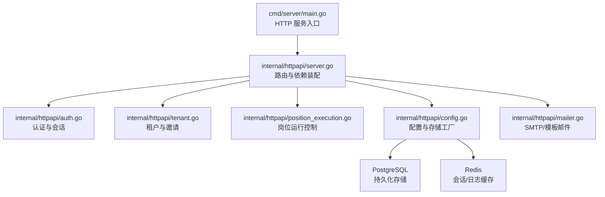
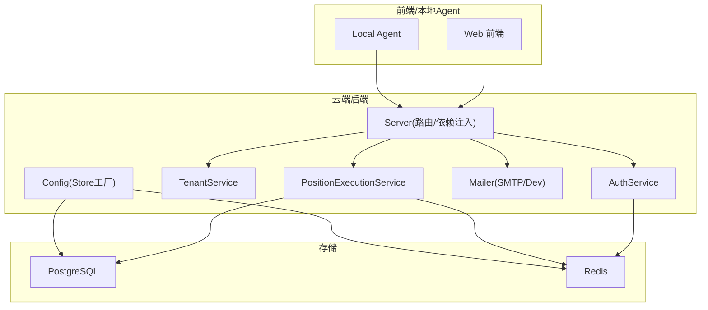
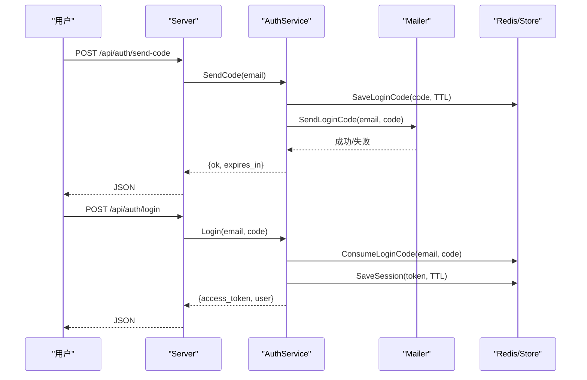
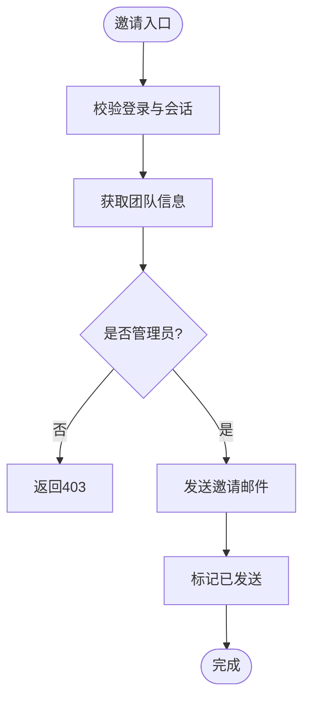
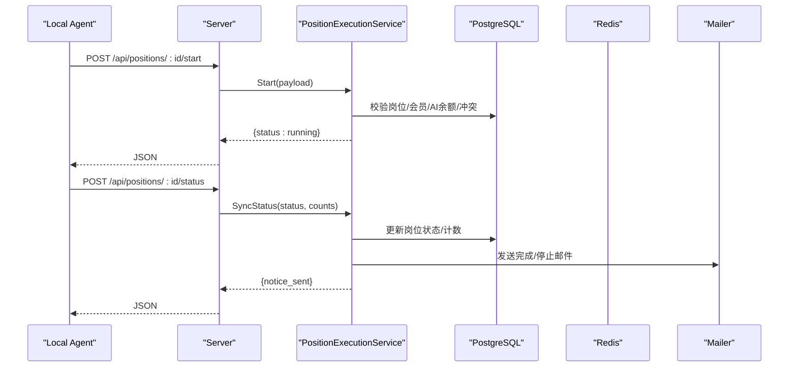
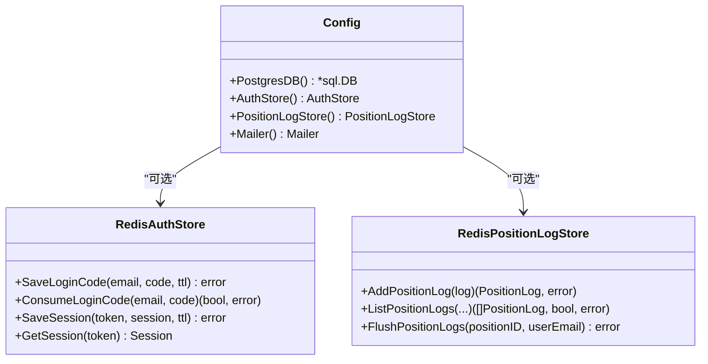
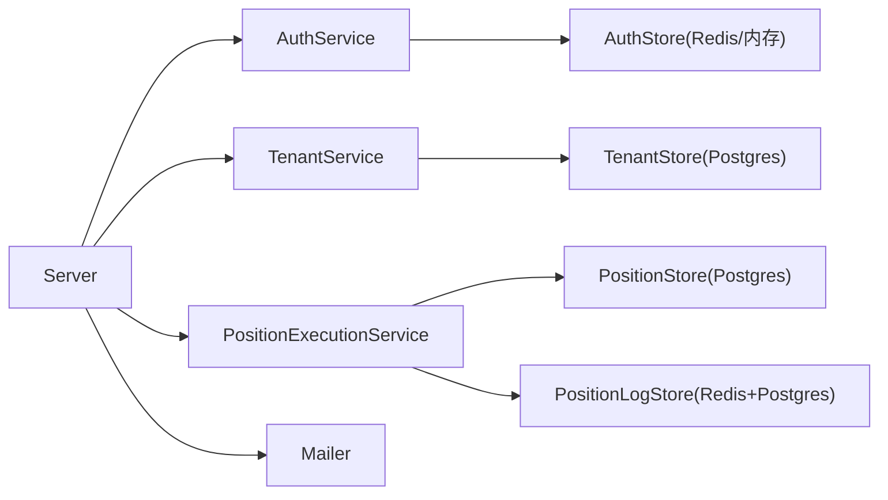
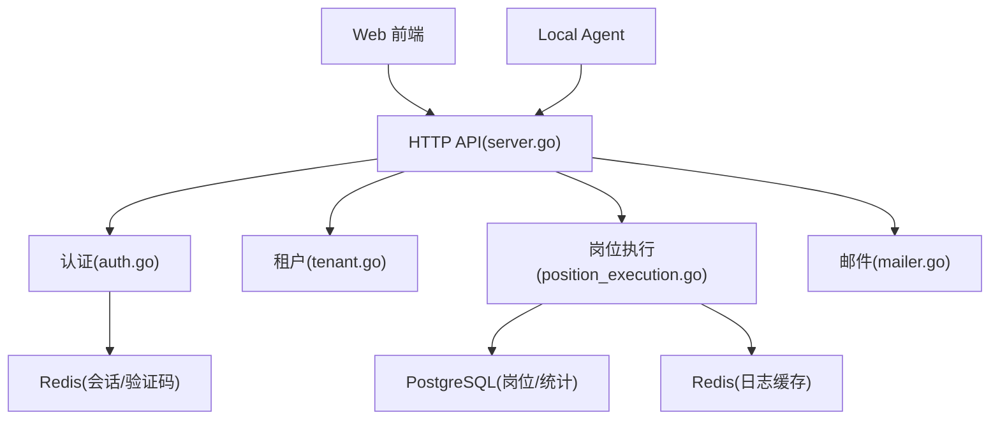
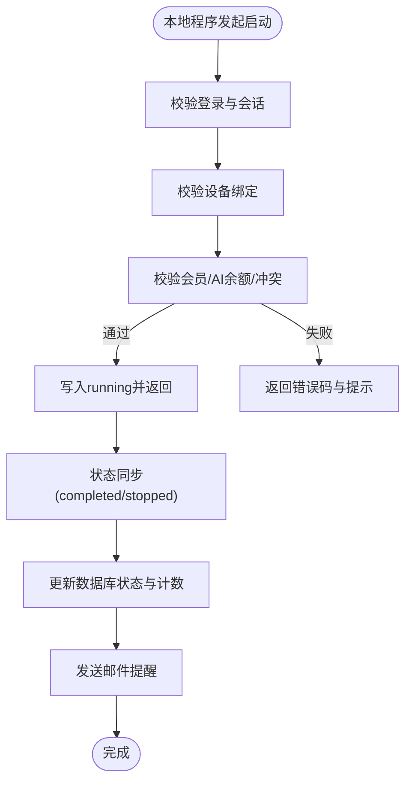

# 云端架构设计

<cite>
**本文引用的文件**
- [main.go](file://goodhr5/cloud/backend/cmd/server/main.go)
- [server.go](file://goodhr5/cloud/backend/internal/httpapi/server.go)
- [auth.go](file://goodhr5/cloud/backend/internal/httpapi/auth.go)
- [tenant.go](file://goodhr5/cloud/backend/internal/httpapi/tenant.go)
- [position_execution.go](file://goodhr5/cloud/backend/internal/httpapi/position_execution.go)
- [config.go](file://goodhr5/cloud/backend/internal/httpapi/config.go)
- [redis_auth_store.go](file://goodhr5/cloud/backend/internal/httpapi/redis_auth_store.go)
- [mailer.go](file://goodhr5/cloud/backend/internal/httpapi/mailer.go)
- [position_log_store_redis.go](file://goodhr5/cloud/backend/internal/httpapi/position_log_store_redis.go)
- [0001_initial_schema.sql](file://goodhr5/cloud/backend/db/migrations/0001_initial_schema.sql)
- [0004_tenants.sql](file://goodhr5/cloud/backend/db/migrations/0004_tenants.sql)
- [0022_user_subscription.sql](file://goodhr5/cloud/backend/db/migrations/0022_user_subscription.sql)
</cite>

## 目录
1. [简介](#简介)
2. [项目结构](#项目结构)
3. [核心组件](#核心组件)
4. [架构总览](#架构总览)
5. [详细组件分析](#详细组件分析)
6. [依赖关系分析](#依赖关系分析)
7. [性能考虑](#性能考虑)
8. [故障排查指南](#故障排查指南)
9. [结论](#结论)
10. [附录](#附录)

## 简介
本文件面向开发者与运维人员，系统化阐述 GoodHR 云端后端（Go）的微服务式架构：API 路由、中间件处理、认证授权机制；PostgreSQL 数据库设计、Redis 缓存策略、SMTP 邮件服务集成；用户认证系统、租户隔离机制、岗位运行管理核心逻辑；以及云端数据边界定义、安全考虑与性能优化策略。文档包含云端组件交互图与数据处理流程图，帮助快速理解整体架构与关键流程。

## 项目结构
云端后端采用“单进程多模块”的轻量微服务形态：入口 main 启动 HTTP 服务，httpapi 层负责路由组装、依赖注入与业务编排，存储层通过接口抽象 PostgreSQL/Redis/内存实现，邮件通过 SMTP 或开发模式兜底。

图表来源
- [main.go:14-30](file://goodhr5/cloud/backend/cmd/server/main.go#L14-L30)
- [server.go:46-121](file://goodhr5/cloud/backend/internal/httpapi/server.go#L46-L121)
- [config.go:30-101](file://goodhr5/cloud/backend/internal/httpapi/config.go#L30-L101)

章节来源
- [main.go:14-30](file://goodhr5/cloud/backend/cmd/server/main.go#L14-L30)
- [server.go:124-212](file://goodhr5/cloud/backend/internal/httpapi/server.go#L124-L212)

## 核心组件
- HTTP 服务与路由：统一注册健康检查、认证、租户、岗位、候选人、支付、订阅、AI 钱包、系统配置等 API，并包裹 CORS 中间件。
- 认证授权：邮箱验证码登录、会话令牌、超管白名单、通用动态验证码、协议同意校验、角色判定（超管/管理员/成员）。
- 租户隔离：团队创建、成员邀请、角色管理、Cookie 共享开关、待处理邀请列表。
- 岗位运行管理：本地程序与云端的启动许可、状态同步、失败通知、统计汇总、邮件提醒。
- 存储与缓存：PostgreSQL 持久化、Redis 会话与日志缓存、内存降级实现。
- 邮件服务：SMTP 发送与模板渲染，开发模式日志输出。

章节来源
- [server.go:124-212](file://goodhr5/cloud/backend/internal/httpapi/server.go#L124-L212)
- [auth.go:71-214](file://goodhr5/cloud/backend/internal/httpapi/auth.go#L71-L214)
- [tenant.go:34-125](file://goodhr5/cloud/backend/internal/httpapi/tenant.go#L34-L125)
- [position_execution.go:49-275](file://goodhr5/cloud/backend/internal/httpapi/position_execution.go#L49-L275)
- [config.go:47-101](file://goodhr5/cloud/backend/internal/httpapi/config.go#L47-L101)
- [mailer.go:19-25](file://goodhr5/cloud/backend/internal/httpapi/mailer.go#L19-L25)

## 架构总览
云端以 Go HTTP 服务为核心，通过依赖注入将各业务服务组合在一起。配置中心根据环境变量选择存储实现（PostgreSQL/Redis/内存），并提供统一的 Store 接口。认证与会话可落 Redis 提升扩展性；岗位日志在高频写入时先入 Redis，再批量落库。

图表来源
- [server.go:46-121](file://goodhr5/cloud/backend/internal/httpapi/server.go#L46-L121)
- [config.go:47-101](file://goodhr5/cloud/backend/internal/httpapi/config.go#L47-L101)
- [redis_auth_store.go:12-34](file://goodhr5/cloud/backend/internal/httpapi/redis_auth_store.go#L12-L34)
- [position_log_store_redis.go:16-34](file://goodhr5/cloud/backend/internal/httpapi/position_log_store_redis.go#L16-L34)

## 详细组件分析

### 认证与授权
- 验证码登录：生成随机验证码，保存至存储（Redis/内存），发送邮件；登录时校验验证码并创建会话令牌，记录登录活动，必要时发放试用会员与 AI 钱包初始化。
- 会话校验：从请求头提取 Bearer Token，解析会话；支持“不安全会话”用于失败通知兜底。
- 权限模型：超管白名单、租户管理员、普通成员；邮箱域名白名单控制注册入口。
- 通用动态验证码：基于时间片段的万能码，便于调试与特殊场景。

图表来源
- [auth.go:71-214](file://goodhr5/cloud/backend/internal/httpapi/auth.go#L71-L214)
- [redis_auth_store.go:36-87](file://goodhr5/cloud/backend/internal/httpapi/redis_auth_store.go#L36-L87)
- [mailer.go:112-119](file://goodhr5/cloud/backend/internal/httpapi/mailer.go#L112-L119)

章节来源
- [auth.go:71-214](file://goodhr5/cloud/backend/internal/httpapi/auth.go#L71-L214)
- [auth.go:452-564](file://goodhr5/cloud/backend/internal/httpapi/auth.go#L452-L564)
- [redis_auth_store.go:36-87](file://goodhr5/cloud/backend/internal/httpapi/redis_auth_store.go#L36-L87)

### 租户与邀请
- 团队管理：获取当前用户所在团队、成员列表、管理员能力判断。
- 邀请流程：管理员邀请成员，发送邮件；被邀请者查看待处理邀请并确认加入。
- Cookie 共享：团队级开关，控制是否允许团队成员间共享平台 Cookie。

图表来源
- [tenant.go:67-125](file://goodhr5/cloud/backend/internal/httpapi/tenant.go#L67-L125)
- [tenant.go:145-232](file://goodhr5/cloud/backend/internal/httpapi/tenant.go#L145-L232)

章节来源
- [tenant.go:34-125](file://goodhr5/cloud/backend/internal/httpapi/tenant.go#L34-L125)
- [tenant.go:145-232](file://goodhr5/cloud/backend/internal/httpapi/tenant.go#L145-L232)
- [tenant.go:273-297](file://goodhr5/cloud/backend/internal/httpapi/tenant.go#L273-L297)

### 岗位运行管理
- 启动许可：验证设备绑定、岗位归属、会员与 AI 余额、任务冲突，通过后写入 running。
- 状态同步：接收本地程序的状态上报（running/completed/stopped），更新岗位状态并发送邮件提醒。
- 失败通知：接收错误消息，归类原因，记录用户流程事件，发送失败邮件。
- 统计与日志：汇总扫描/打招呼/跳过/失败次数，结合 Redis 缓存与数据库统计。

图表来源
- [position_execution.go:49-275](file://goodhr5/cloud/backend/internal/httpapi/position_execution.go#L49-L275)
- [position_execution.go:311-392](file://goodhr5/cloud/backend/internal/httpapi/position_execution.go#L311-L392)

章节来源
- [position_execution.go:49-275](file://goodhr5/cloud/backend/internal/httpapi/position_execution.go#L49-L275)
- [position_execution.go:311-392](file://goodhr5/cloud/backend/internal/httpapi/position_execution.go#L311-L392)

### 数据存储与缓存
- PostgreSQL：用户、本地 Agent 连接、平台账号映射、岗位配置、任务运行摘要、日志摘要、订阅信息等。
- Redis：登录验证码与会话、岗位运行期日志缓存（按岗位队列，限制条数与过期时间）、读取时优先缓存再回源数据库。
- 内存降级：未配置外部存储时使用内存实现，便于开发与测试。

图表来源
- [config.go:47-101](file://goodhr5/cloud/backend/internal/httpapi/config.go#L47-L101)
- [config.go:256-268](file://goodhr5/cloud/backend/internal/httpapi/config.go#L256-L268)
- [redis_auth_store.go:12-87](file://goodhr5/cloud/backend/internal/httpapi/redis_auth_store.go#L12-L87)
- [position_log_store_redis.go:16-165](file://goodhr5/cloud/backend/internal/httpapi/position_log_store_redis.go#L16-L165)

章节来源
- [config.go:47-101](file://goodhr5/cloud/backend/internal/httpapi/config.go#L47-L101)
- [config.go:256-268](file://goodhr5/cloud/backend/internal/httpapi/config.go#L256-L268)
- [redis_auth_store.go:12-87](file://goodhr5/cloud/backend/internal/httpapi/redis_auth_store.go#L12-L87)
- [position_log_store_redis.go:16-165](file://goodhr5/cloud/backend/internal/httpapi/position_log_store_redis.go#L16-L165)

### 邮件服务集成
- SMTP 发信：支持 TLS 端口与非 TLS 端口，HTML 模板与纯文本双内容，移动端友好包装。
- 模板体系：登录验证码、会员变动、AI 余额、岗位状态、团队邀请等模板。
- 开发模式：不实际发信，仅记录日志，便于联调。

章节来源
- [mailer.go:19-25](file://goodhr5/cloud/backend/internal/httpapi/mailer.go#L19-L25)
- [mailer.go:112-119](file://goodhr5/cloud/backend/internal/httpapi/mailer.go#L112-L119)
- [mailer.go:204-228](file://goodhr5/cloud/backend/internal/httpapi/mailer.go#L204-L228)
- [mailer.go:278-295](file://goodhr5/cloud/backend/internal/httpapi/mailer.go#L278-L295)
- [mailer.go:297-312](file://goodhr5/cloud/backend/internal/httpapi/mailer.go#L297-L312)
- [mailer.go:358-454](file://goodhr5/cloud/backend/internal/httpapi/mailer.go#L358-L454)

## 依赖关系分析
- 服务装配：Server 在 NewServer 中集中装配各 Service 与 Store，形成松耦合的依赖图。
- 存储抽象：所有持久化操作通过 Store 接口进行，便于切换 PostgreSQL/Redis/内存实现。
- 外部依赖：PostgreSQL（主数据）、Redis（会话与日志缓存）、SMTP（邮件）。

图表来源
- [server.go:46-121](file://goodhr5/cloud/backend/internal/httpapi/server.go#L46-L121)
- [config.go:103-268](file://goodhr5/cloud/backend/internal/httpapi/config.go#L103-L268)

章节来源
- [server.go:46-121](file://goodhr5/cloud/backend/internal/httpapi/server.go#L46-L121)
- [config.go:103-268](file://goodhr5/cloud/backend/internal/httpapi/config.go#L103-L268)

## 性能考虑
- 连接池与超时：PostgreSQL 连接池大小与生命周期设置，避免资源耗尽；Ping 检查确保连接可用。
- 缓存策略：登录验证码与会话使用 Redis，降低 DB 压力；岗位日志先写 Redis，限制单岗位最大条数与过期时间，减少 DB 写入。
- 读写分离：日志读取优先缓存，缺失时回源数据库并合并结果，保证实时性与一致性。
- 并发与限流：通过 Store 接口与上下文超时控制，避免长耗时阻塞；对关键路径增加错误码与重试提示。
- 降级方案：未配置外部存储时自动降级为内存实现，保障开发体验与基本可用性。

章节来源
- [config.go:47-75](file://goodhr5/cloud/backend/internal/httpapi/config.go#L47-L75)
- [position_log_store_redis.go:36-110](file://goodhr5/cloud/backend/internal/httpapi/position_log_store_redis.go#L36-L110)
- [redis_auth_store.go:12-34](file://goodhr5/cloud/backend/internal/httpapi/redis_auth_store.go#L12-L34)

## 故障排查指南
- 认证失败：检查 Authorization 头格式、Token 是否过期；确认 Redis 连通性与键空间；核对邮箱域名白名单。
- 岗位启动失败：检查设备绑定状态、会员与 AI 余额、任务冲突；关注错误码（如 DEVICE_BINDING_REQUIRED、SUBSCRIPTION_REQUIRED、AI_BALANCE_INSUFFICIENT）。
- 邮件发送失败：确认 SMTP 配置、TLS 端口、模板路径；开发模式下查看日志输出。
- 日志缺失：检查 Redis 缓存是否过期或容量限制；调用 FlushPositionLogs 将缓存落库。

章节来源
- [auth.go:452-564](file://goodhr5/cloud/backend/internal/httpapi/auth.go#L452-L564)
- [position_execution.go:215-275](file://goodhr5/cloud/backend/internal/httpapi/position_execution.go#L215-L275)
- [mailer.go:278-312](file://goodhr5/cloud/backend/internal/httpapi/mailer.go#L278-L312)
- [position_log_store_redis.go:143-165](file://goodhr5/cloud/backend/internal/httpapi/position_log_store_redis.go#L143-L165)

## 结论
GoodHR 云端后端以清晰的职责划分与可扩展的存储抽象，实现了高内聚低耦合的微服务式架构。通过 PostgreSQL 持久化、Redis 缓存与 SMTP 邮件集成，支撑了用户认证、租户隔离、岗位运行管理等核心能力。系统在性能与安全方面提供了连接池、缓存、鉴权、模板渲染等多重保障，并通过内存降级提升开发效率。建议在生产环境启用 Redis 与 PostgreSQL，合理配置 SMTP，持续监控岗位日志与认证成功率，确保系统稳定高效运行。

## 附录

### 数据库设计与数据边界
- 云端只保存必要元数据与摘要：用户、本地 Agent 连接、平台账号映射、岗位配置、任务运行摘要、日志摘要、订阅信息等。
- 敏感与大数据（候选人详情、截图、OCR 原文、招聘平台 cookie/profile）保留在本地 Agent，云端不持有。
- 租户隔离通过 tenants 表与 users 字段关联，配合服务层查询条件实现数据隔离。

章节来源
- [0001_initial_schema.sql:1-135](file://goodhr5/cloud/backend/db/migrations/0001_initial_schema.sql#L1-L135)
- [0004_tenants.sql:1-21](file://goodhr5/cloud/backend/db/migrations/0004_tenants.sql#L1-L21)
- [0022_user_subscription.sql:1-62](file://goodhr5/cloud/backend/db/migrations/0022_user_subscription.sql#L1-L62)

### 云端组件交互图

图表来源
- [server.go:124-212](file://goodhr5/cloud/backend/internal/httpapi/server.go#L124-L212)
- [auth.go:71-214](file://goodhr5/cloud/backend/internal/httpapi/auth.go#L71-L214)
- [tenant.go:34-125](file://goodhr5/cloud/backend/internal/httpapi/tenant.go#L34-L125)
- [position_execution.go:49-275](file://goodhr5/cloud/backend/internal/httpapi/position_execution.go#L49-L275)
- [mailer.go:19-25](file://goodhr5/cloud/backend/internal/httpapi/mailer.go#L19-L25)

### 数据处理流程图（岗位运行）

图表来源
- [position_execution.go:49-275](file://goodhr5/cloud/backend/internal/httpapi/position_execution.go#L49-L275)
- [position_execution.go:311-392](file://goodhr5/cloud/backend/internal/httpapi/position_execution.go#L311-L392)