# 数据流设计

<cite>
**本文引用的文件**
- [goodhr5/docs/goodhr5-flow.md](file://goodhr5/docs/goodhr5-flow.md)
- [docs/cloud-control-local-agent-architecture.md](file://docs/cloud-control-local-agent-architecture.md)
- [goodhr5/README.md](file://goodhr5/README.md)
- [goodhr5/cloud/backend/internal/httpapi/position_execution.go](file://goodhr5/cloud/backend/internal/httpapi/position_execution.go)
- [goodhr5/local-agent-go/internal/positionrunner/runner.go](file://goodhr5/local-agent-go/internal/positionrunner/runner.go)
- [goodhr5/local-agent-go/internal/positionrunner/pipeline.go](file://goodhr5/local-agent-go/internal/positionrunner/pipeline.go)
- [goodhr5/local-agent-go/internal/platformcore/runtime.go](file://goodhr5/local-agent-go/internal/platformcore/runtime.go)
- [goodhr5/local-agent-go/internal/platforms/boss/candidate.go](file://goodhr5/local-agent-go/internal/platforms/boss/candidate.go)
- [goodhr5/local-agent-go/internal/platforms/boss/runtime.go](file://goodhr5/local-agent-go/internal/platforms/boss/runtime.go)
- [goodhr5/cloud/backend/internal/httpapi/candidate_store_pg.go](file://goodhr5/cloud/backend/internal/httpapi/candidate_store_pg.go)
- [goodhr5/local-agent-go/internal/localdb/records.go](file://goodhr5/local-agent-go/internal/localdb/records.go)
</cite>

## 目录
1. [引言](#引言)
2. [项目结构](#项目结构)
3. [核心组件](#核心组件)
4. [架构总览](#架构总览)
5. [详细组件分析](#详细组件分析)
6. [依赖关系分析](#依赖关系分析)
7. [性能与一致性](#性能与一致性)
8. [故障恢复与错误处理](#故障恢复与错误处理)
9. [结论](#结论)
10. [附录：关键流程图与状态图](#附录：关键流程图与状态图)

## 引言
本文件面向开发者，系统化梳理 HRPlus 的数据流设计，覆盖从云端配置下发、本地执行到结果回传的完整链路；重点说明候选人数据采集、解析、存储流程，截图与 OCR 的处理管道，以及 AI 分析的数据流向。同时给出数据一致性保证、事务处理策略和错误恢复机制，并提供数据流图和状态转换图，帮助理解系统核心业务流程。

## 项目结构
HRPlus 采用“云端控制台 + 本地执行器”的架构：
- 云端（Go 后端 + Vue 前端）：负责登录认证、岗位模板与运行元信息、系统配置、机器绑定、版本管理、候选人三表模型持久化、统计摘要与通知。
- 本地 Agent（Go 程序）：运行在用户电脑上，负责浏览器控制（CloakBrowser）、平台页面操作、cookie/profile、截图、OCR、按岗位落库候选人 JSON、日志与下载记录等。

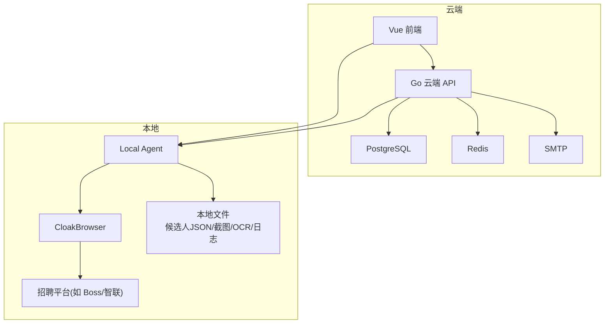

**图表来源**
- [docs/cloud-control-local-agent-architecture.md:30-50](file://docs/cloud-control-local-agent-architecture.md#L30-L50)
- [goodhr5/README.md:5-17](file://goodhr5/README.md#L5-L17)

**章节来源**
- [goodhr5/README.md:1-22](file://goodhr5/README.md#L1-L22)
- [docs/cloud-control-local-agent-architecture.md:1-50](file://docs/cloud-control-local-agent-architecture.md#L1-L50)

## 核心组件
- 云端岗位运行服务：负责启动许可校验、设备绑定、会员与AI余额检查、原子占用运行名额、状态同步与完成通知。
- 本地岗位运行器：编排浏览器打开、滚动加载、候选人提取、详情打开、截图与OCR、打招呼、AI评分、统计汇总与云端同步。
- 平台运行时抽象：统一接口封装各平台（Boss/智联/猎聘等）的页面导航、候选列表提取、详情抓取、关闭、打招呼等能力。
- 候选人数据模型：云端三表模型（主体、触达、事件），本地按岗位保存候选人JSON、截图与OCR文本。

**章节来源**
- [goodhr5/cloud/backend/internal/httpapi/position_execution.go:21-91](file://goodhr5/cloud/backend/internal/httpapi/position_execution.go#L21-L91)
- [goodhr5/local-agent-go/internal/positionrunner/runner.go:71-137](file://goodhr5/local-agent-go/internal/positionrunner/runner.go#L71-L137)
- [goodhr5/local-agent-go/internal/platformcore/runtime.go:10-111](file://goodhr5/local-agent-go/internal/platformcore/runtime.go#L10-L111)
- [goodhr5/cloud/backend/internal/httpapi/candidate_store_pg.go:14-161](file://goodhr5/cloud/backend/internal/httpapi/candidate_store_pg.go#L14-L161)

## 架构总览
整体数据流分为三个阶段：
1) 云端配置下发：岗位模板、平台配置、AI配置、账号映射等由云端维护，本地执行时按需拉取或已随任务快照下发。
2) 本地执行采集：Local Agent 驱动浏览器访问平台，滚动加载候选人卡片，提取字段，必要时打开详情并截图+OCR。
3) 结果回传与持久化：本地将候选人数据写入本地JSON，云端通过API接收统计摘要、状态变更、失败通知；候选人三表模型在云端持久化，支持检索与审计。

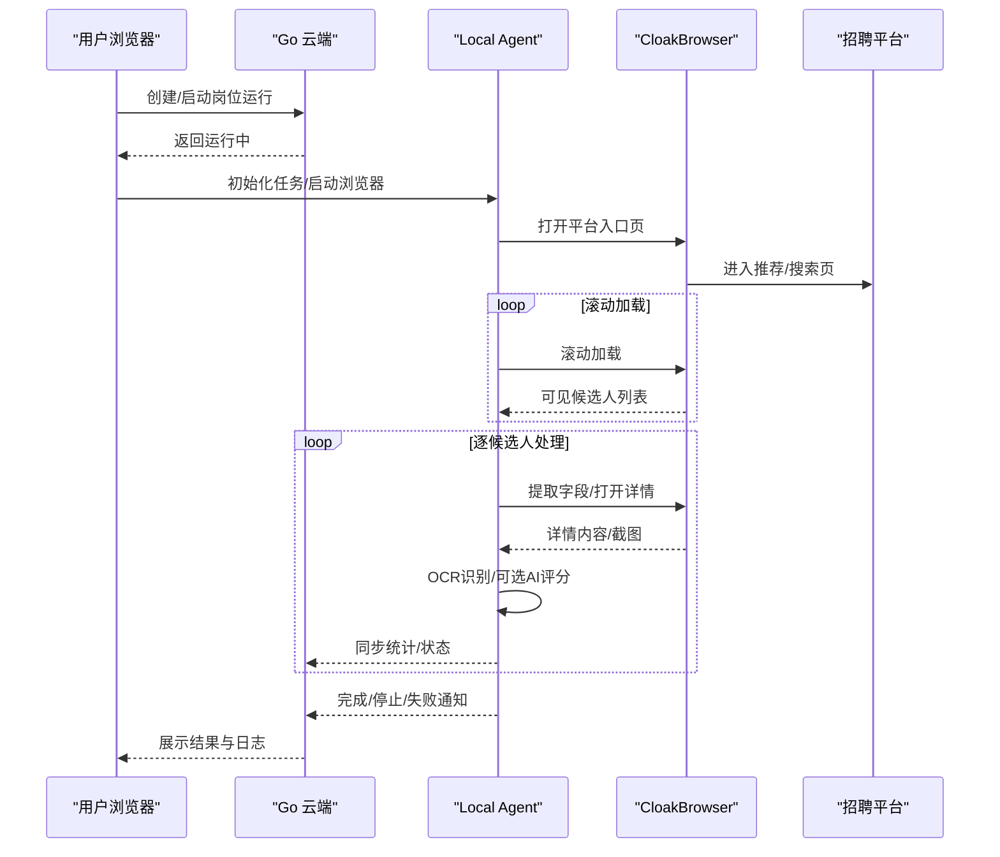

**图表来源**
- [goodhr5/docs/goodhr5-flow.md:344-545](file://goodhr5/docs/goodhr5-flow.md#L344-L545)
- [docs/cloud-control-local-agent-architecture.md:595-618](file://docs/cloud-control-local-agent-architecture.md#L595-L618)

## 详细组件分析

### 云端岗位运行服务（启动许可、状态同步、通知）
- 启动许可：校验会话、岗位归属、设备绑定、会员与AI余额，原子占用运行名额后返回 running。
- 状态同步：接收本地同步的 running/completed/stopped，更新岗位状态、发送完成邮件、记录用户流程事件。
- 失败通知：接收本地失败消息，更新状态为 failed 或 stopped，发送邮件提醒，记录失败原因分类。

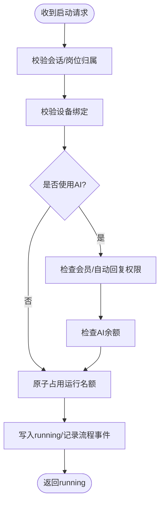

**图表来源**
- [goodhr5/cloud/backend/internal/httpapi/position_execution.go:49-91](file://goodhr5/cloud/backend/internal/httpapi/position_execution.go#L49-L91)
- [goodhr5/cloud/backend/internal/httpapi/position_execution.go:234-275](file://goodhr5/cloud/backend/internal/httpapi/position_execution.go#L234-L275)

**章节来源**
- [goodhr5/cloud/backend/internal/httpapi/position_execution.go:49-91](file://goodhr5/cloud/backend/internal/httpapi/position_execution.go#L49-L91)
- [goodhr5/cloud/backend/internal/httpapi/position_execution.go:125-213](file://goodhr5/cloud/backend/internal/httpapi/position_execution.go#L125-L213)
- [goodhr5/cloud/backend/internal/httpapi/position_execution.go:311-371](file://goodhr5/cloud/backend/internal/httpapi/position_execution.go#L311-L371)

### 本地岗位运行器（编排与流水线）
- 运行器职责：管理并发、超时、进度、暂停/停止信号、统计增量计算、AI客户端构建、候选人流水线调度。
- 流水线：按页面顺序将候选人送入后台队列，进行AI预评分、详情打开、截图OCR、打招呼、保存与统计。
- 平台适配：通过 platformcore.Executor 调用 Worker 实现具体平台行为（如 Boss 的候选人提取、滚动、可见定位）。

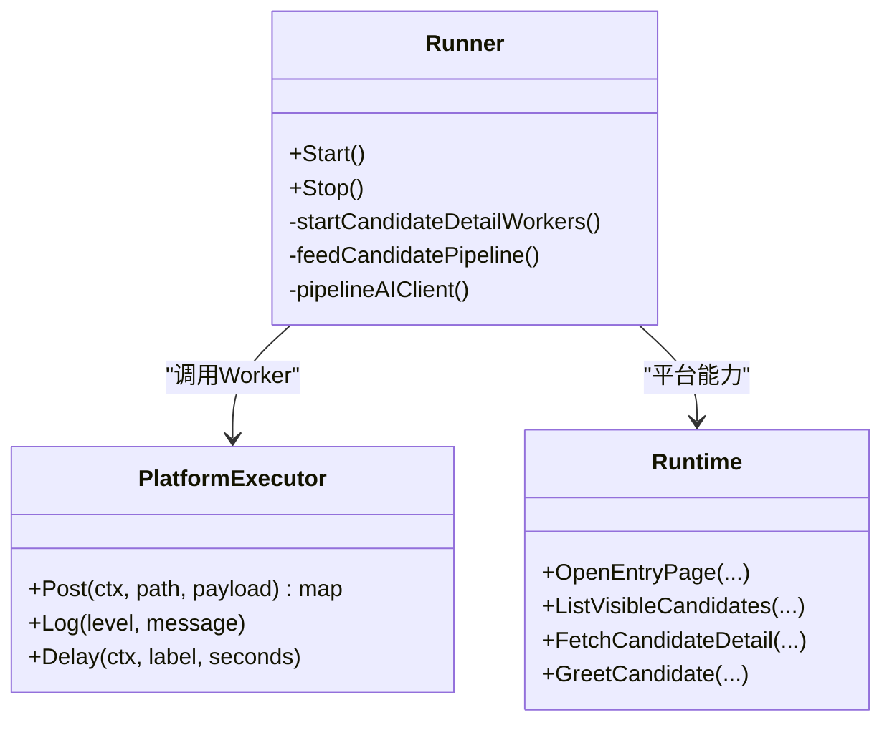

**图表来源**
- [goodhr5/local-agent-go/internal/positionrunner/runner.go:71-137](file://goodhr5/local-agent-go/internal/positionrunner/runner.go#L71-L137)
- [goodhr5/local-agent-go/internal/platformcore/runtime.go:46-111](file://goodhr5/local-agent-go/internal/platformcore/runtime.go#L46-L111)

**章节来源**
- [goodhr5/local-agent-go/internal/positionrunner/runner.go:71-137](file://goodhr5/local-agent-go/internal/positionrunner/runner.go#L71-L137)
- [goodhr5/local-agent-go/internal/positionrunner/pipeline.go:14-150](file://goodhr5/local-agent-go/internal/positionrunner/pipeline.go#L14-L150)
- [goodhr5/local-agent-go/internal/platformcore/runtime.go:10-111](file://goodhr5/local-agent-go/internal/platformcore/runtime.go#L10-L111)

### 平台运行时（以 Boss 为例）
- 候选人提取：通过 Worker 路径 /api/v1/boss/candidates/extract 获取当前可见候选人，整理并生成稳定指纹。
- 滚动加载：通过 /api/v1/boss/candidates/scroll 滚动加载更多候选人。
- 可见定位：确保目标候选人卡片滚动至可视区域，便于后续详情打开与截图。
- 筛选文本与指纹：基于字段与正则提取年龄等信息，生成去重ID。

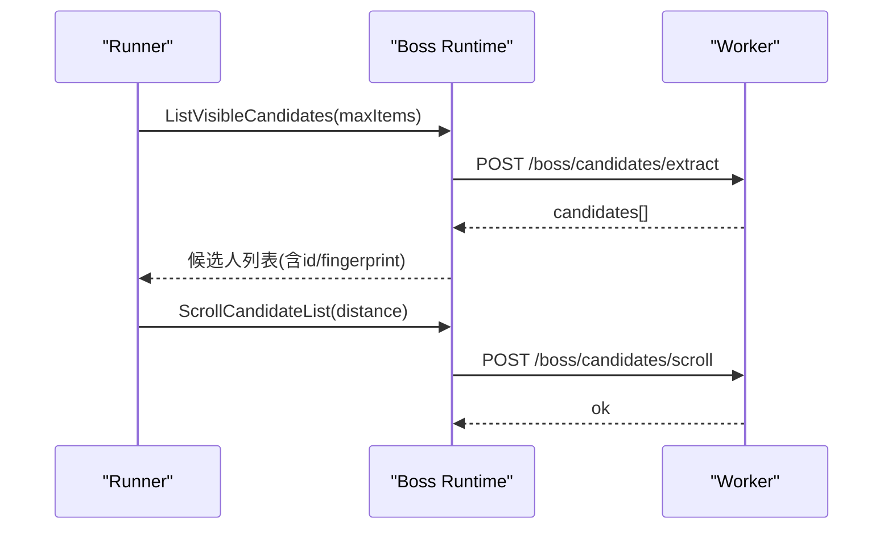

**图表来源**
- [goodhr5/local-agent-go/internal/platforms/boss/candidate.go:13-87](file://goodhr5/local-agent-go/internal/platforms/boss/candidate.go#L13-L87)
- [goodhr5/local-agent-go/internal/platforms/boss/runtime.go:19-34](file://goodhr5/local-agent-go/internal/platforms/boss/runtime.go#L19-L34)

**章节来源**
- [goodhr5/local-agent-go/internal/platforms/boss/candidate.go:13-87](file://goodhr5/local-agent-go/internal/platforms/boss/candidate.go#L13-L87)
- [goodhr5/local-agent-go/internal/platforms/boss/runtime.go:11-34](file://goodhr5/local-agent-go/internal/platforms/boss/runtime.go#L11-L34)

### 候选人数据采集、解析与存储
- 采集：本地通过 Worker 提取候选人字段，必要时打开详情并截图。
- 解析：平台运行时对原始文本进行清洗、结构化（如年龄、教育、经验等），生成筛选文本与指纹。
- 存储：
  - 本地：按岗位目录保存 candidates.json、screenshots/、ocr/ 等文件。
  - 云端：候选人三表模型（主体、触达、事件）持久化于 PostgreSQL，支持查询、审计与报表。

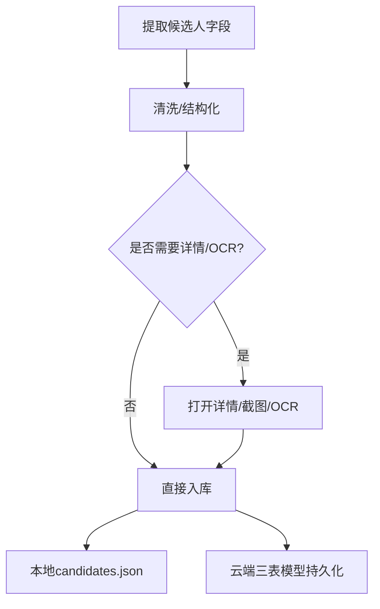

**图表来源**
- [goodhr5/local-agent-go/internal/platforms/boss/candidate.go:13-49](file://goodhr5/local-agent-go/internal/platforms/boss/candidate.go#L13-L49)
- [goodhr5/cloud/backend/internal/httpapi/candidate_store_pg.go:24-161](file://goodhr5/cloud/backend/internal/httpapi/candidate_store_pg.go#L24-L161)
- [goodhr5/local-agent-go/internal/localdb/records.go:14-37](file://goodhr5/local-agent-go/internal/localdb/records.go#L14-L37)

**章节来源**
- [goodhr5/local-agent-go/internal/platforms/boss/candidate.go:13-87](file://goodhr5/local-agent-go/internal/platforms/boss/candidate.go#L13-L87)
- [goodhr5/cloud/backend/internal/httpapi/candidate_store_pg.go:24-161](file://goodhr5/cloud/backend/internal/httpapi/candidate_store_pg.go#L24-L161)
- [goodhr5/local-agent-go/internal/localdb/records.go:14-37](file://goodhr5/local-agent-go/internal/localdb/records.go#L14-L37)

### 截图与OCR处理管道
- 截图：在详情打开后截取详情弹框或整页，保存到本地 screenshots/ 目录。
- OCR：对截图执行识别，结果写入本地 ocr/ 目录，并将识别文本摘要写入当前候选人的 JSON。
- 预览与读取：前端通过 Local Agent API 读取截图与OCR文本，云端不保存图片和原文。

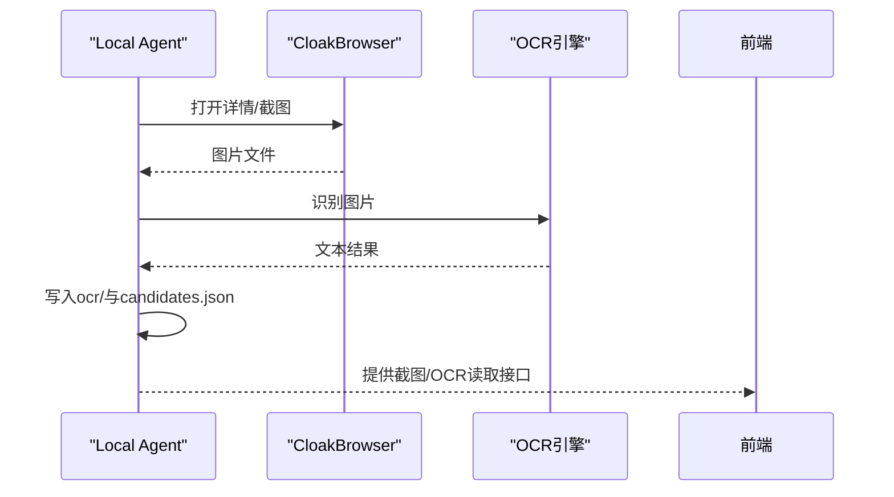

**图表来源**
- [docs/cloud-control-local-agent-architecture.md:348-372](file://docs/cloud-control-local-agent-architecture.md#L348-L372)
- [docs/cloud-control-local-agent-architecture.md:478-502](file://docs/cloud-control-local-agent-architecture.md#L478-L502)

**章节来源**
- [docs/cloud-control-local-agent-architecture.md:348-372](file://docs/cloud-control-local-agent-architecture.md#L348-L372)
- [docs/cloud-control-local-agent-architecture.md:478-502](file://docs/cloud-control-local-agent-architecture.md#L478-L502)

### AI分析数据流向
- 触发条件：岗位模式为 AI 或详情模式为 AI 时启用。
- 预评分：在打开详情前进行基础预评分，决定是否值得打开详情。
- 详情评分：打开详情后结合OCR文本进行评分与理由输出。
- 配置优先级：用户AI配置 > 系统默认AI配置；云端检查会员与AI余额后允许启动。

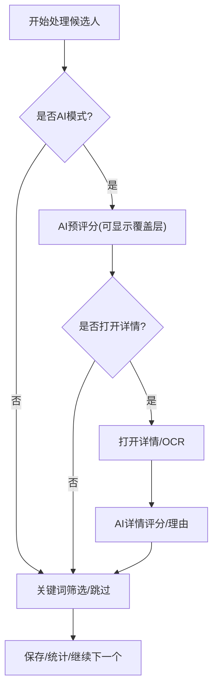

**图表来源**
- [goodhr5/local-agent-go/internal/positionrunner/pipeline.go:49-131](file://goodhr5/local-agent-go/internal/positionrunner/pipeline.go#L49-L131)
- [goodhr5/cloud/backend/internal/httpapi/position_execution.go:234-282](file://goodhr5/cloud/backend/internal/httpapi/position_execution.go#L234-L282)

**章节来源**
- [goodhr5/local-agent-go/internal/positionrunner/pipeline.go:49-131](file://goodhr5/local-agent-go/internal/positionrunner/pipeline.go#L49-L131)
- [goodhr5/cloud/backend/internal/httpapi/position_execution.go:234-282](file://goodhr5/cloud/backend/internal/httpapi/position_execution.go#L234-L282)

## 依赖关系分析
- 云端与本地：通过 HTTP 直连 localhost，Local Agent 暴露健康检查、浏览器控制、页面操作、岗位数据管理等接口。
- 平台运行时：通过 platformcore 统一接口解耦具体平台差异，便于扩展新平台。
- 数据存储：云端使用 PostgreSQL 持久化候选人三表模型与岗位运行元信息；本地使用 SQLite/文件系统保存设置、下载记录、截图与OCR。

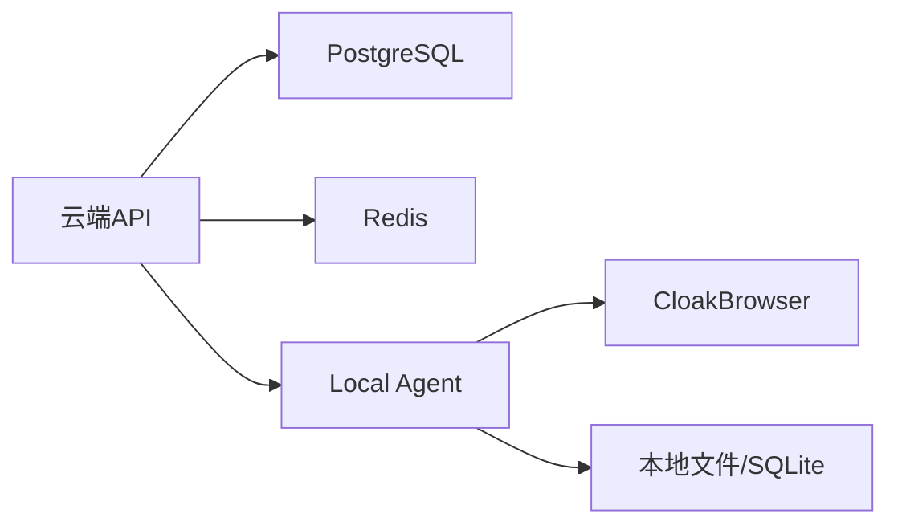

**图表来源**
- [docs/cloud-control-local-agent-architecture.md:30-50](file://docs/cloud-control-local-agent-architecture.md#L30-L50)
- [goodhr5/local-agent-go/internal/localdb/records.go:39-82](file://goodhr5/local-agent-go/internal/localdb/records.go#L39-L82)

**章节来源**
- [docs/cloud-control-local-agent-architecture.md:30-50](file://docs/cloud-control-local-agent-architecture.md#L30-L50)
- [goodhr5/local-agent-go/internal/localdb/records.go:39-82](file://goodhr5/local-agent-go/internal/localdb/records.go#L39-L82)

## 性能与一致性
- 并发与超时：候选人后台处理池默认并发数可调，单个操作带超时与异常捕获，避免长时间阻塞。
- 统计增量：本地统计相对已落库统计计算非负增量，减少重复写入。
- 原子占用：云端通过 ClaimPositionStart 原子占用运行名额，防止同一账号多任务冲突。
- 幂等与去重：候选人指纹用于去重，云端 Upsert 保证主体唯一性。

**章节来源**
- [goodhr5/local-agent-go/internal/positionrunner/pipeline.go:133-150](file://goodhr5/local-agent-go/internal/positionrunner/pipeline.go#L133-L150)
- [goodhr5/local-agent-go/internal/positionrunner/runner.go:243-268](file://goodhr5/local-agent-go/internal/positionrunner/runner.go#L243-L268)
- [goodhr5/cloud/backend/internal/httpapi/position_execution.go:234-275](file://goodhr5/cloud/backend/internal/httpapi/position_execution.go#L234-L275)
- [goodhr5/cloud/backend/internal/httpapi/candidate_store_pg.go:163-230](file://goodhr5/cloud/backend/internal/httpapi/candidate_store_pg.go#L163-L230)

## 故障恢复与错误处理
- 网络与平台异常：Worker 调用失败记录 warning/error 日志，继续处理下一个候选人，不中断整个运行。
- 登录态失效：云端 SessionFromRequest 失败返回 401，前端引导重新登录。
- 设备绑定缺失：未绑定或绑定无效时拒绝启动，提示刷新后台等待绑定完成。
- 会员与AI余额不足：明确错误码与提示信息，阻止启动。
- 完成/停止/失败通知：本地主动上报，云端更新状态并发送邮件提醒。

**章节来源**
- [goodhr5/docs/goodhr5-flow.md:625-707](file://goodhr5/docs/goodhr5-flow.md#L625-L707)
- [goodhr5/cloud/backend/internal/httpapi/position_execution.go:215-232](file://goodhr5/cloud/backend/internal/httpapi/position_execution.go#L215-L232)
- [goodhr5/cloud/backend/internal/httpapi/position_execution.go:311-371](file://goodhr5/cloud/backend/internal/httpapi/position_execution.go#L311-L371)

## 结论
HRPlus 通过云端与本地的清晰分工，实现了高内聚、低耦合的数据流设计：云端负责编排与持久化，本地负责执行与采集。候选人数据在本地完成采集、解析与存储，云端通过三表模型提供检索与审计能力。AI 分析与 OCR 管道增强了筛选精度与可追溯性。系统在并发、超时、原子占用、幂等方面具备良好的一致性与健壮性。

## 附录：关键流程图与状态图

### 岗位运行生命周期状态图
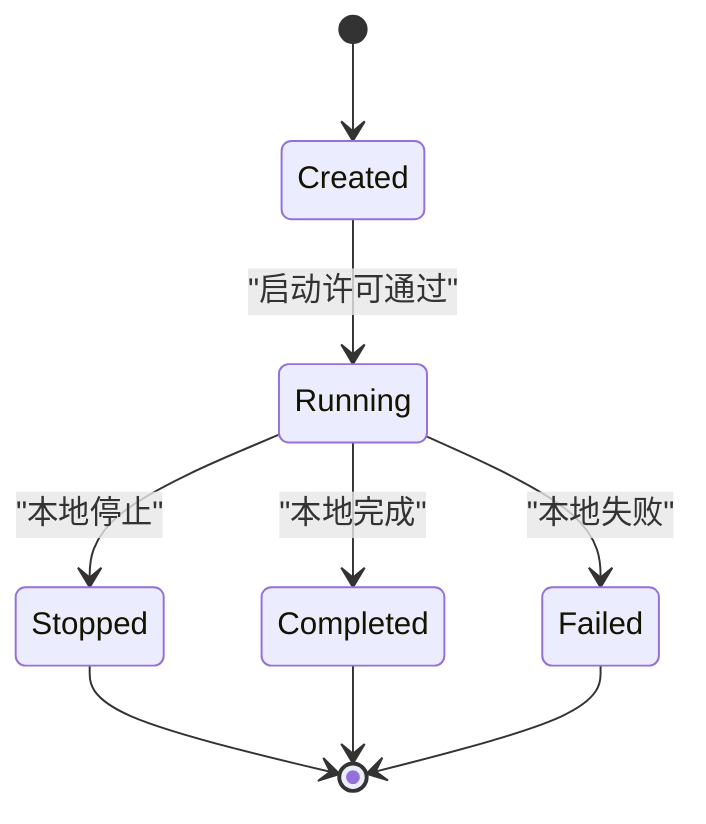

**图表来源**
- [goodhr5/cloud/backend/internal/httpapi/position_execution.go:125-213](file://goodhr5/cloud/backend/internal/httpapi/position_execution.go#L125-L213)
- [goodhr5/cloud/backend/internal/httpapi/position_execution.go:311-371](file://goodhr5/cloud/backend/internal/httpapi/position_execution.go#L311-L371)

### 候选人处理主流程时序图
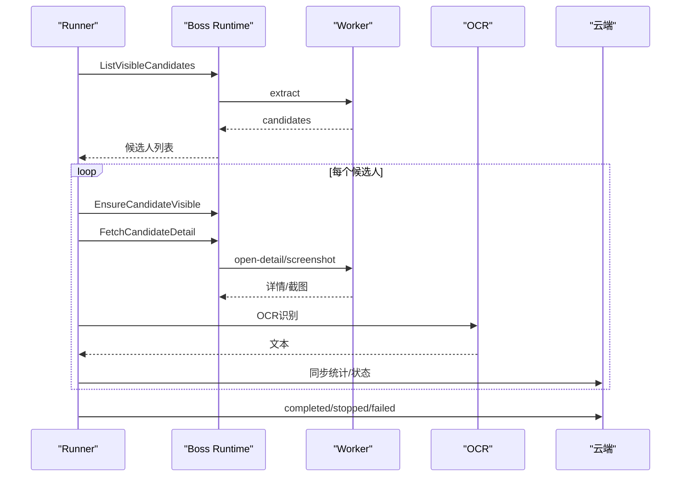

**图表来源**
- [goodhr5/local-agent-go/internal/platforms/boss/candidate.go:13-87](file://goodhr5/local-agent-go/internal/platforms/boss/candidate.go#L13-L87)
- [docs/cloud-control-local-agent-architecture.md:595-618](file://docs/cloud-control-local-agent-architecture.md#L595-L618)