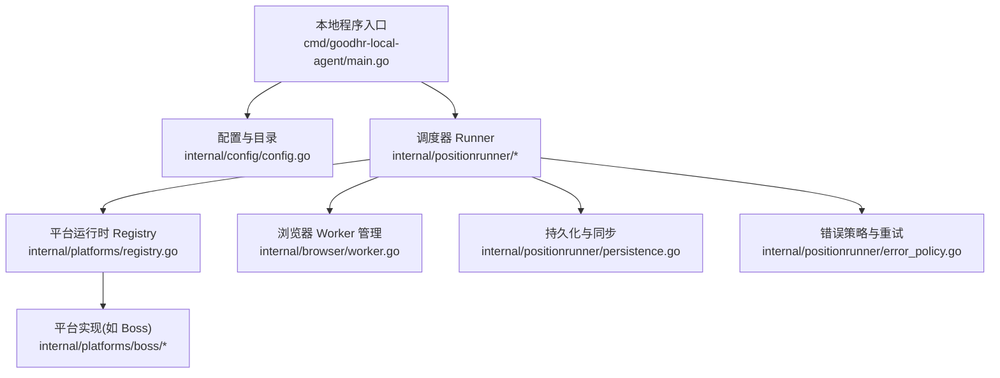
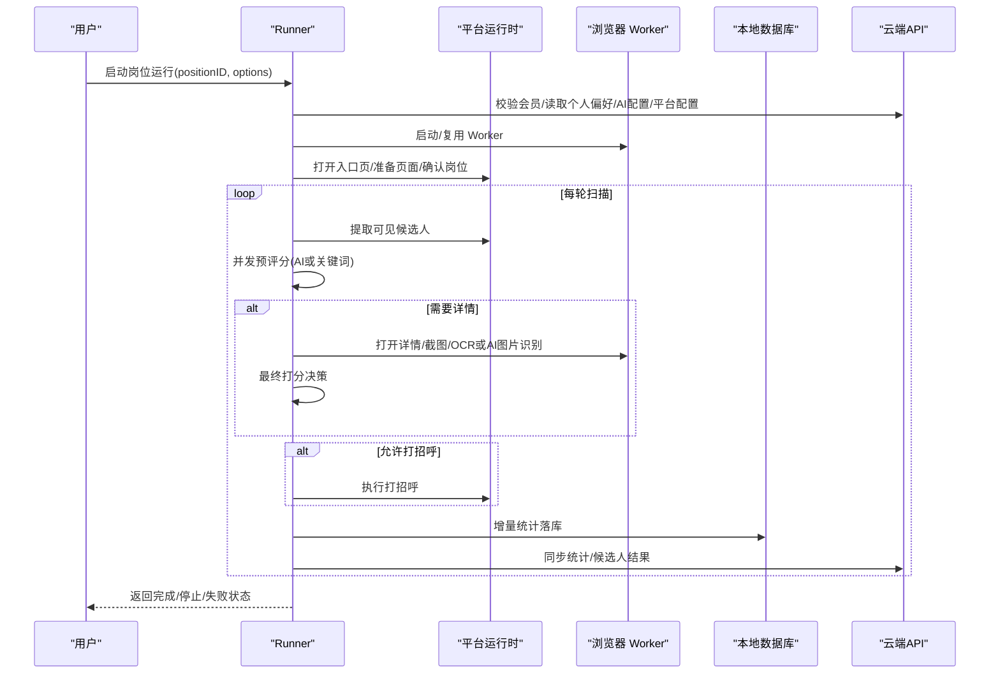
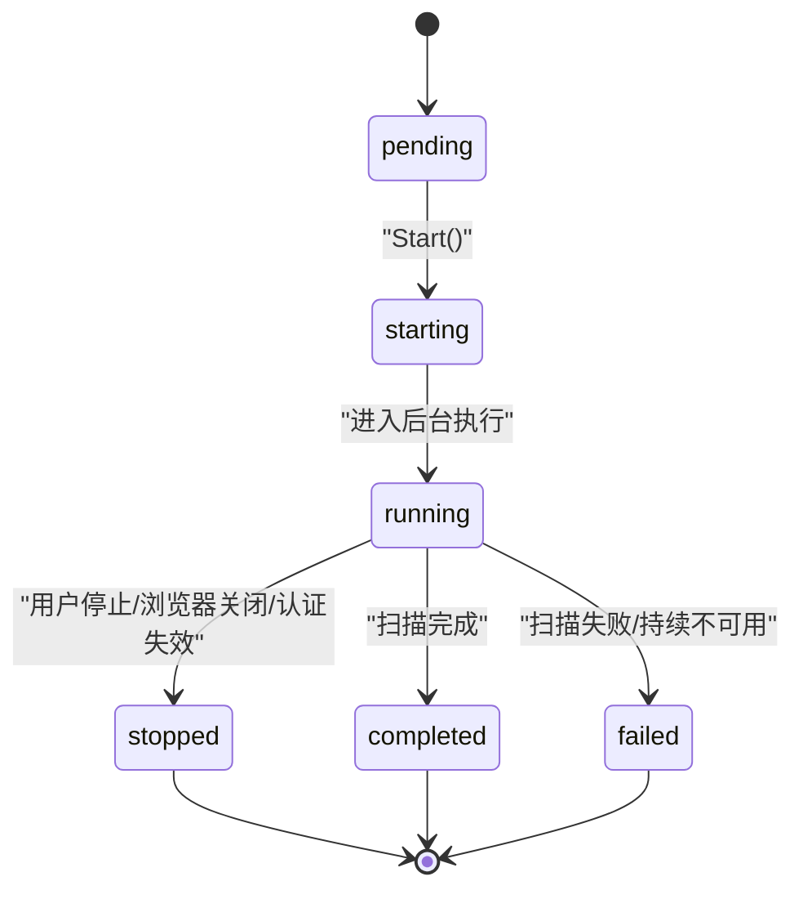
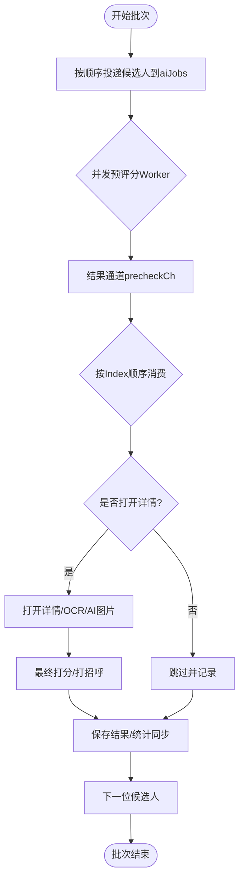
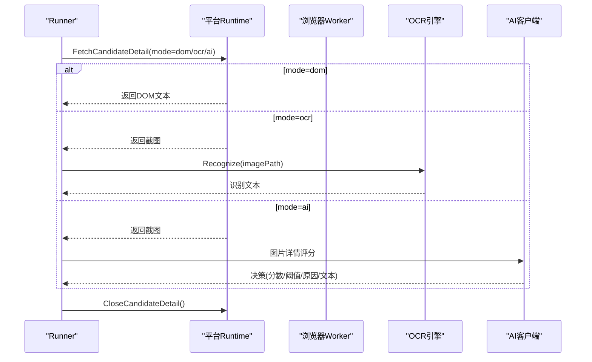
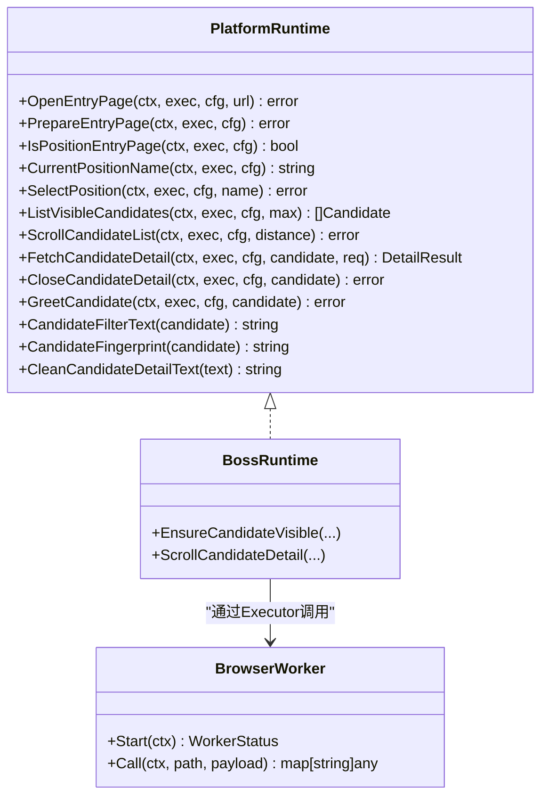
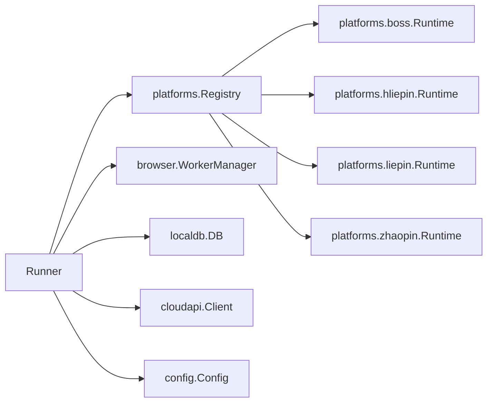

# 任务调度器

<cite>
**本文引用的文件**
- [main.go](file://goodhr5/local-agent-go/cmd/goodhr-local-agent/main.go)
- [runner.go](file://goodhr5/local-agent-go/internal/positionrunner/runner.go)
- [lifecycle.go](file://goodhr5/local-agent-go/internal/positionrunner/lifecycle.go)
- [pipeline.go](file://goodhr5/local-agent-go/internal/positionrunner/pipeline.go)
- [scan.go](file://goodhr5/local-agent-go/internal/positionrunner/scan.go)
- [detail.go](file://goodhr5/local-agent-go/internal/positionrunner/detail.go)
- [error_policy.go](file://goodhr5/local-agent-go/internal/positionrunner/error_policy.go)
- [persistence.go](file://goodhr5/local-agent-go/internal/positionrunner/persistence.go)
- [runtime.go](file://goodhr5/local-agent-go/internal/platformcore/runtime.go)
- [registry.go](file://goodhr5/local-agent-go/internal/platforms/registry.go)
- [worker.go](file://goodhr5/local-agent-go/internal/browser/worker.go)
- [config.go](file://goodhr5/local-agent-go/internal/config/config.go)
</cite>

## 目录
1. [简介](#简介)
2. [项目结构](#项目结构)
3. [核心组件](#核心组件)
4. [架构总览](#架构总览)
5. [详细组件分析](#详细组件分析)
6. [依赖关系分析](#依赖关系分析)
7. [性能与并发特性](#性能与并发特性)
8. [故障排查指南](#故障排查指南)
9. [结论](#结论)
10. [附录：配置与调优](#附录：配置与调优)

## 简介
本文件面向 GoodHR 本地 Agent 的“岗位运行任务调度器”，系统性阐述其调度算法、生命周期管理、执行流水线设计，以及状态机、并发控制、资源管理、优先级排序、失败重试策略、超时处理、监控日志通知机制，以及与浏览器控制和平台适配器的协作模式。目标是帮助读者在不深入源码的情况下理解整体运行机制，并在需要时快速定位到具体实现位置。

## 项目结构
GoodHR 本地 Agent 的任务调度由 Go 主进程驱动，通过内部模块组织职责：
- 入口与配置：命令行参数解析、配置文件加载、日志初始化
- 调度器核心：Runner 负责启动、停止、状态、进度、并发与错误策略
- 扫描与流水线：按页面顺序读取候选人，并行进行 AI 预评分与详情处理
- 平台适配器：统一 Runtime 接口，屏蔽不同招聘平台的差异
- 浏览器 Worker：Node 进程封装，提供页面操作、截图、OCR、AI 图片识别等能力
- 持久化与同步：增量统计落库与云端同步、候选人结果入库

**图表来源**
- [main.go:18-62](file://goodhr5/local-agent-go/cmd/goodhr-local-agent/main.go#L18-L62)
- [config.go:26-87](file://goodhr5/local-agent-go/internal/config/config.go#L26-L87)
- [registry.go:15-34](file://goodhr5/local-agent-go/internal/platforms/registry.go#L15-L34)
- [worker.go:78-142](file://goodhr5/local-agent-go/internal/browser/worker.go#L78-L142)

**章节来源**
- [main.go:18-62](file://goodhr5/local-agent-go/cmd/goodhr-local-agent/main.go#L18-L62)
- [config.go:26-87](file://goodhr5/local-agent-go/internal/config/config.go#L26-L87)

## 核心组件
- 调度器 Runner：维护运行锁、用户停止标记、防睡眠保护、进度与结构化分析快照；编排扫描、详情、打招呼、保存、统计同步等流程。
- 平台运行时 Runtime：抽象平台能力（打开入口页、切换岗位、提取候选人、滚动列表、读取详情、关闭详情、打招呼、筛选文本、指纹去重等）。
- 浏览器 Worker：管理 Node 进程，提供 HTTP API 调用，自动重启、健康检查、端口清理、日志输出。
- 流水线 Pipeline：按页面顺序消费候选人，支持并发预评分与详情处理，保证顺序一致性与可观测性。
- 错误策略：连续相同错误检测、立即停止条件、OCR 致命错误识别。
- 持久化与同步：增量统计落库、云端统计同步、候选人结果异步入库、AI 完整详情输出等待。

**章节来源**
- [runner.go:71-216](file://goodhr5/local-agent-go/internal/positionrunner/runner.go#L71-L216)
- [runtime.go:10-111](file://goodhr5/local-agent-go/internal/platformcore/runtime.go#L10-L111)
- [worker.go:27-142](file://goodhr5/local-agent-go/internal/browser/worker.go#L27-L142)
- [pipeline.go:49-150](file://goodhr5/local-agent-go/internal/positionrunner/pipeline.go#L49-L150)
- [error_policy.go:15-119](file://goodhr5/local-agent-go/internal/positionrunner/error_policy.go#L15-L119)
- [persistence.go:14-169](file://goodhr5/local-agent-go/internal/positionrunner/persistence.go#L14-L169)

## 架构总览
调度器以 Runner 为中心，协调平台运行时与浏览器 Worker，完成一轮或多轮候选人扫描与处理。关键交互如下：

**图表来源**
- [lifecycle.go:17-79](file://goodhr5/local-agent-go/internal/positionrunner/lifecycle.go#L17-L79)
- [scan.go:17-462](file://goodhr5/local-agent-go/internal/positionrunner/scan.go#L17-L462)
- [detail.go:122-279](file://goodhr5/local-agent-go/internal/positionrunner/detail.go#L122-L279)
- [persistence.go:49-169](file://goodhr5/local-agent-go/internal/positionrunner/persistence.go#L49-L169)

## 详细组件分析

### 调度器 Runner：生命周期与状态机
- 启动流程：校验 token、拉取云端岗位模板与配置、创建运行锁、开启防睡眠保护、构建运行时快照、更新状态为 running、后台协程执行 runPosition。
- 运行主循环：scanOnce 执行一轮扫描，包含页面准备、岗位确认、基础筛选、候选人提取、并发预评分、详情读取、最终打分、打招呼、保存与统计同步。
- 停止流程：Stop 标记用户停止并优雅等待当前候选人处理完成；StopAll 取消所有运行；Status/Progress 暴露运行状态与进度。
- 状态机：pending → starting → running → completed/stopped/failed；中间阶段包括 page_ready、extracting、pipeline、scrolling。
- 资源管理：防睡眠保护在运行期间阻止系统休眠；检测到睡眠恢复后取消运行；详情页关闭动作登记与兜底关闭。

**图表来源**
- [lifecycle.go:17-139](file://goodhr5/local-agent-go/internal/positionrunner/lifecycle.go#L17-L139)
- [lifecycle.go:195-241](file://goodhr5/local-agent-go/internal/positionrunner/lifecycle.go#L195-L241)

**章节来源**
- [lifecycle.go:17-139](file://goodhr5/local-agent-go/internal/positionrunner/lifecycle.go#L17-L139)
- [lifecycle.go:141-193](file://goodhr5/local-agent-go/internal/positionrunner/lifecycle.go#L141-L193)
- [lifecycle.go:195-241](file://goodhr5/local-agent-go/internal/positionrunner/lifecycle.go#L195-L241)
- [lifecycle.go:370-459](file://goodhr5/local-agent-go/internal/positionrunner/lifecycle.go#L370-L459)

### 执行流水线：顺序消费与并发预评分
- 顺序消费：主流程按页面顺序逐个处理候选人，确保 UI 展示与业务逻辑一致性。
- 并发预评分：对一批候选人启动 workerCount 个协程进行“是否值得看详情”的预评分，workerCount 根据候选人数动态调整，默认上限为固定值。
- 管道通信：使用通道 aiJobs 与 precheckCh 将候选人送入并发池，主流程按索引有序消费结果。
- 超时与异常：每个操作通过 withOperationTimeout 包裹，记录耗时与错误，区分超时与一般失败。

**图表来源**
- [pipeline.go:49-150](file://goodhr5/local-agent-go/internal/positionrunner/pipeline.go#L49-L150)
- [scan.go:217-434](file://goodhr5/local-agent-go/internal/positionrunner/scan.go#L217-L434)

**章节来源**
- [pipeline.go:49-150](file://goodhr5/local-agent-go/internal/positionrunner/pipeline.go#L49-L150)
- [scan.go:217-434](file://goodhr5/local-agent-go/internal/positionrunner/scan.go#L217-L434)

### 详情读取与 OCR/AI 图片识别
- 详情模式：DOM、OCR、AI 三种模式，优先从 common_config/keyword_config 读取 detail_mode；AI 模式下默认 DOM。
- 打开详情：带随机点击延时，避免机械行为；详情页关闭前也带随机延时。
- OCR 识别：截图路径传入 OCR 引擎，识别失败时判断是否为致命错误（组件未安装/损坏/退出），必要时停止岗位运行。
- AI 图片详情：调用本地 AI 客户端进行长图识别与打分，支持思考开关；若失败且为持续不可用错误则停止岗位运行。
- 详情滚动：在最终 AI 分析期间后台滚动详情，提升信息获取概率；完成后停止滚动。

**图表来源**
- [detail.go:122-279](file://goodhr5/local-agent-go/internal/positionrunner/detail.go#L122-L279)
- [detail.go:41-86](file://goodhr5/local-agent-go/internal/positionrunner/detail.go#L41-L86)

**章节来源**
- [detail.go:122-279](file://goodhr5/local-agent-go/internal/positionrunner/detail.go#L122-L279)
- [detail.go:41-86](file://goodhr5/local-agent-go/internal/positionrunner/detail.go#L41-L86)

### 平台适配器与浏览器控制协作
- 平台运行时：统一接口 Executor/Runtime，屏蔽平台差异；支持可选能力 BasicFilterApplier、CandidateInfoRequester、PositionSearchPreparer、DirectPositionSelector、PositionSelectionSkipper、DetailAnalysisScroller。
- 浏览器 Worker：Go 进程通过 HTTP 调用 Node Worker，封装启动、健康检查、端口清理、自动重启、日志输出；Worker 负责实际页面操作、截图、OCR、AI 图片识别。
- 平台实现：以 Boss 为例，提供候选人可见定位、年龄提取、ID 规范化等能力。

**图表来源**
- [runtime.go:10-111](file://goodhr5/local-agent-go/internal/platformcore/runtime.go#L10-L111)
- [worker.go:78-142](file://goodhr5/local-agent-go/internal/browser/worker.go#L78-L142)
- [boss/runtime.go:11-62](file://goodhr5/local-agent-go/internal/platforms/boss/runtime.go#L11-L62)

**章节来源**
- [runtime.go:10-111](file://goodhr5/local-agent-go/internal/platformcore/runtime.go#L10-L111)
- [worker.go:78-142](file://goodhr5/local-agent-go/internal/browser/worker.go#L78-L142)
- [registry.go:15-34](file://goodhr5/local-agent-go/internal/platforms/registry.go#L15-L34)
- [boss/runtime.go:11-62](file://goodhr5/local-agent-go/internal/platforms/boss/runtime.go#L11-L62)

### 优先级排序与失败重试策略
- 优先级排序：候选人按页面顺序消费，保证 UI 与业务一致性；并发预评分不改变消费顺序。
- 失败重试：同一平台环节连续出现相同错误达到阈值（默认3次）时停止岗位运行；OCR 致命错误直接停止；浏览器关闭或认证失效立即停止。
- 超时处理：每个操作设置超时（如详情读取、OCR、AI 详情评分、打招呼等），超时记录为失败并继续或停止取决于错误类型。

**章节来源**
- [error_policy.go:37-119](file://goodhr5/local-agent-go/internal/positionrunner/error_policy.go#L37-L119)
- [scan.go:217-434](file://goodhr5/local-agent-go/internal/positionrunner/scan.go#L217-L434)
- [detail.go:122-279](file://goodhr5/local-agent-go/internal/positionrunner/detail.go#L122-L279)

### 监控、日志与通知
- 进度与状态：Progress 包含 stage、message、round、total_rounds、updated_at；Status 返回 position、running、progress、logs、analysis 等。
- 日志记录：positionLog 写入岗位运行日志，包含 info/warning/error 级别；Worker 日志独立文件；控制台置顶小窗显示 AI 分析状态。
- 通知机制：失败时播放提示音（若启用）、发送邮件通知；云端统计与候选人结果异步同步。

**章节来源**
- [lifecycle.go:195-241](file://goodhr5/local-agent-go/internal/positionrunner/lifecycle.go#L195-L241)
- [lifecycle.go:313-324](file://goodhr5/local-agent-go/internal/positionrunner/lifecycle.go#L313-L324)
- [persistence.go:14-169](file://goodhr5/local-agent-go/internal/positionrunner/persistence.go#L14-L169)

## 依赖关系分析
调度器依赖以下核心模块：
- 平台运行时：通过 registry 按 platform_id 分发具体实现。
- 浏览器 Worker：HTTP 调用 Node 进程，提供页面操作能力。
- 本地数据库：持久化岗位运行统计与日志。
- 云端 API：校验会员、读取配置、同步统计与结果。
- 配置模块：管理监听地址、端口、数据目录、云 API 基址等。

**图表来源**
- [registry.go:15-34](file://goodhr5/local-agent-go/internal/platforms/registry.go#L15-L34)
- [worker.go:78-142](file://goodhr5/local-agent-go/internal/browser/worker.go#L78-L142)
- [config.go:26-87](file://goodhr5/local-agent-go/internal/config/config.go#L26-L87)

**章节来源**
- [registry.go:15-34](file://goodhr5/local-agent-go/internal/platforms/registry.go#L15-L34)
- [worker.go:78-142](file://goodhr5/local-agent-go/internal/browser/worker.go#L78-L142)
- [config.go:26-87](file://goodhr5/local-agent-go/internal/config/config.go#L26-L87)

## 性能与并发特性
- 并发度：候选人预评分并发数根据批次大小动态调整，默认上限为固定值，避免过度并发导致平台限流或资源争用。
- 超时控制：每个关键操作设置超时，防止长时间阻塞；超时错误记录为失败，不影响其他候选人。
- 资源释放：详情页关闭动作登记与兜底关闭；防睡眠保护在运行结束后释放；Worker 自动重启与端口清理。
- 统计同步：增量统计落库与云端同步，避免重复累计；异步保存候选人结果，减少主流程阻塞。

**章节来源**
- [pipeline.go:133-150](file://goodhr5/local-agent-go/internal/positionrunner/pipeline.go#L133-L150)
- [detail.go:281-329](file://goodhr5/local-agent-go/internal/positionrunner/detail.go#L281-L329)
- [lifecycle.go:370-459](file://goodhr5/local-agent-go/internal/positionrunner/lifecycle.go#L370-L459)
- [persistence.go:49-169](file://goodhr5/local-agent-go/internal/positionrunner/persistence.go#L49-L169)

## 故障排查指南
- 浏览器未启动或已关闭：错误包含“浏览器已关闭”“target page closed”等关键字，岗位运行自动停止；检查 Worker 进程与健康检查。
- OCR 组件不可用：错误包含“ocr 组件未安装/未配置/模型不完整/已退出”，岗位运行自动停止；检查 OCR 目录与模型文件。
- AI 服务持续不可用：错误被识别为持续不可用，岗位运行自动停止；检查 AI 配置与网络连通性。
- 认证失效：云端会话验证失败，岗位运行停止并通知；重新登录后再启动。
- 端口占用：Worker 固定端口被占用，启动失败；清理旧进程或更换端口。

**章节来源**
- [lifecycle.go:338-359](file://goodhr5/local-agent-go/internal/positionrunner/lifecycle.go#L338-L359)
- [error_policy.go:106-119](file://goodhr5/local-agent-go/internal/positionrunner/error_policy.go#L106-L119)
- [worker.go:334-364](file://goodhr5/local-agent-go/internal/browser/worker.go#L334-L364)
- [worker.go:437-484](file://goodhr5/local-agent-go/internal/browser/worker.go#L437-L484)

## 结论
GoodHR 本地 Agent 的任务调度器以 Runner 为核心，结合平台运行时与浏览器 Worker，实现了高可靠、可观测、可扩展的岗位运行自动化流程。通过顺序消费与并发预评分的平衡、严格的超时与错误策略、完善的日志与通知机制，确保了在不同平台与环境下的稳定运行。建议在生产环境中合理配置并发度、超时时间与重试策略，并结合监控与日志进行持续优化。

## 附录：配置与调优
- 启动参数：host、port、data-dir、open-console、restart
- 运行配置：监听地址、端口、数据目录、运行时目录、日志目录、OCR 目录、前端目录、下载目录、截图目录、云 API 基址、控制台清单 URL、自动打开控制台
- 岗位运行选项：扫描轮次、最大项数、滚动距离、页面稳定延时、模拟人工延时范围、详情打开概率、摸鱼休息策略、提示音与通知邮箱
- 性能调优建议：
  - 根据候选人数量调整预评分并发度，避免平台限流
  - 合理设置超时时间，避免长时间阻塞
  - 启用防睡眠保护，防止系统休眠影响运行
  - 定期清理 Worker 日志与截图文件，避免磁盘占用过高
- 故障排查方法：
  - 查看岗位运行日志与 Worker 日志，定位具体错误
  - 检查浏览器账号登录态与平台配置
  - 验证 AI 配置与网络连通性
  - 确认 OCR 组件安装与模型完整性

**章节来源**
- [main.go:18-62](file://goodhr5/local-agent-go/cmd/goodhr-local-agent/main.go#L18-L62)
- [config.go:26-87](file://goodhr5/local-agent-go/internal/config/config.go#L26-L87)
- [runner.go:173-210](file://goodhr5/local-agent-go/internal/positionrunner/runner.go#L173-L210)
- [persistence.go:318-347](file://goodhr5/local-agent-go/internal/positionrunner/persistence.go#L318-L347)