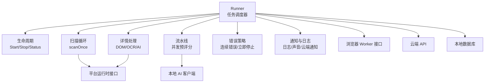
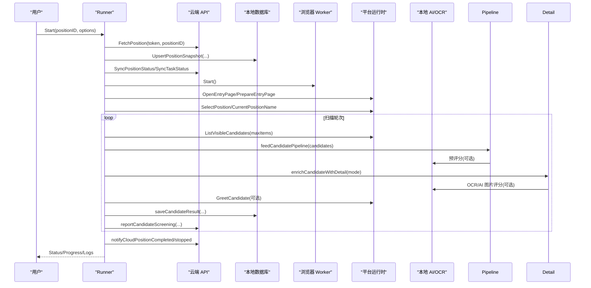
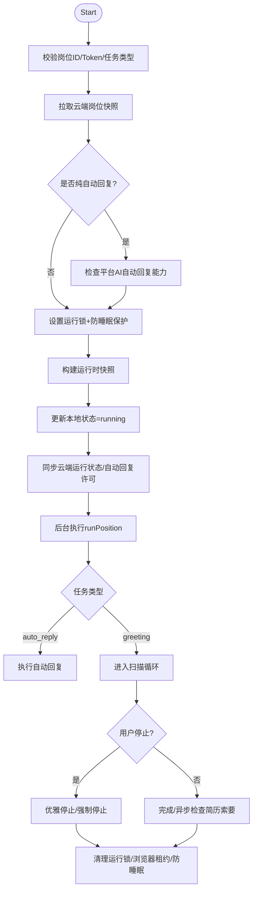
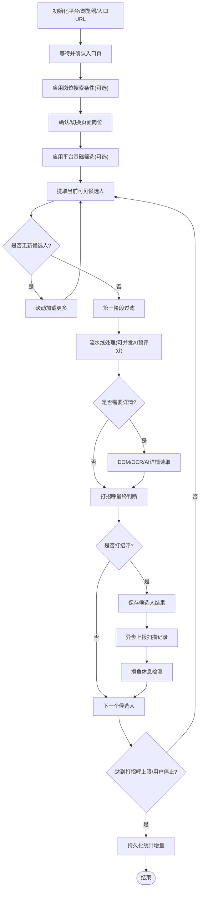
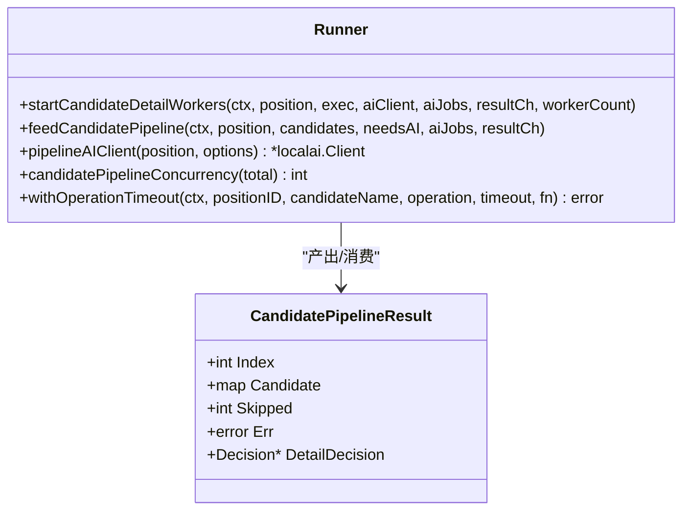
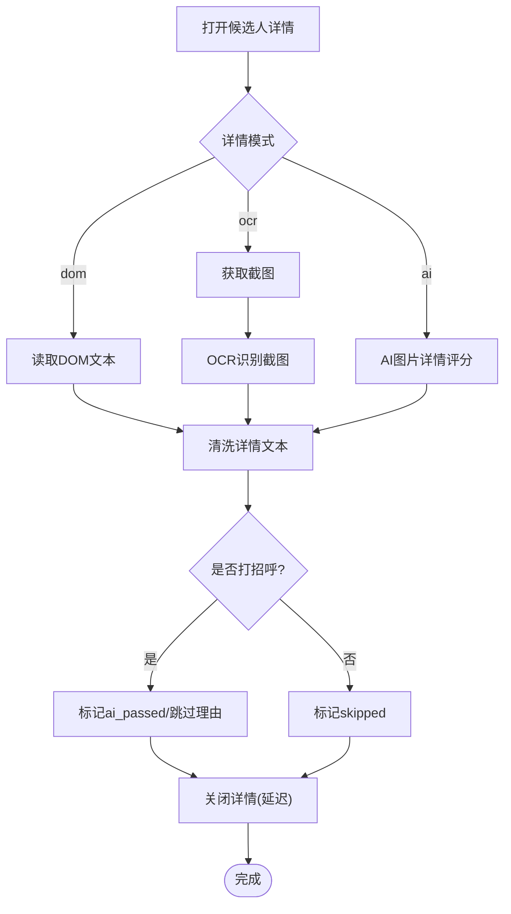
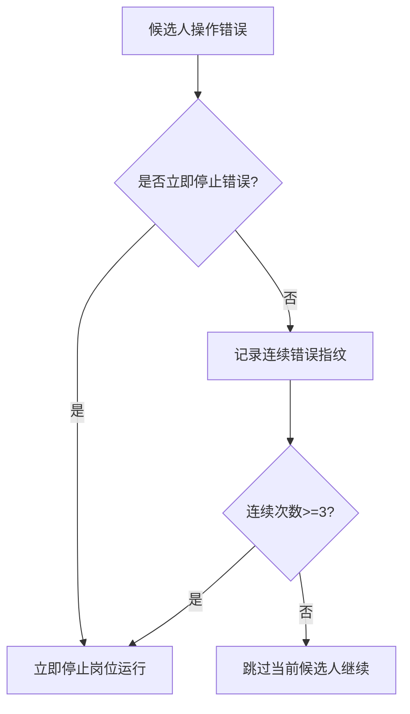
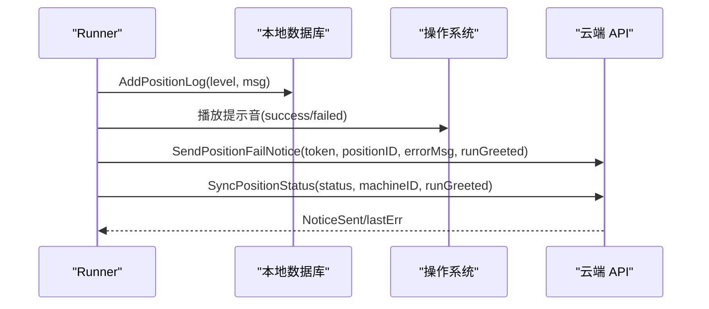
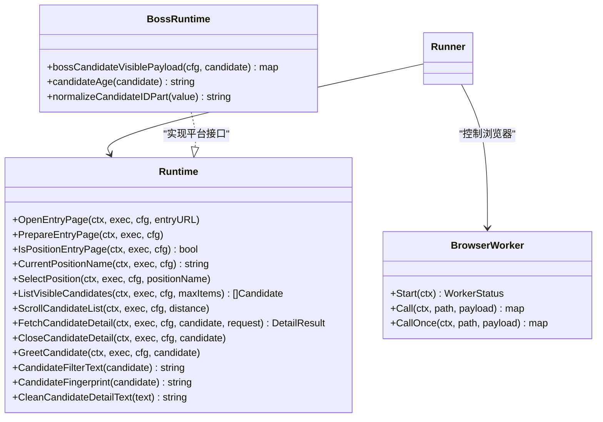
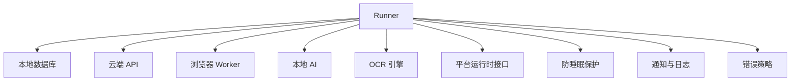

# 任务调度器

<cite>
**本文引用的文件**   
- [lifecycle.go](file://goodhr5/local-agent-go/internal/positionrunner/lifecycle.go)
- [pipeline.go](file://goodhr5/local-agent-go/internal/positionrunner/pipeline.go)
- [runner.go](file://goodhr5/local-agent-go/internal/positionrunner/runner.go)
- [scan.go](file://goodhr5/local-agent-go/internal/positionrunner/scan.go)
- [detail.go](file://goodhr5/local-agent-go/internal/positionrunner/detail.go)
- [error_policy.go](file://goodhr5/local-agent-go/internal/positionrunner/error_policy.go)
- [notification.go](file://goodhr5/local-agent-go/internal/positionrunner/notification.go)
- [runtime.go](file://goodhr5/local-agent-go/internal/platformcore/runtime.go)
- [boss_runtime.go](file://goodhr5/local-agent-go/internal/platforms/boss/runtime.go)
</cite>

## 目录
1. [引言](#引言)
2. [项目结构](#项目结构)
3. [核心组件](#核心组件)
4. [架构总览](#架构总览)
5. [详细组件分析](#详细组件分析)
6. [依赖关系分析](#依赖关系分析)
7. [性能与并发特性](#性能与并发特性)
8. [配置选项与调优建议](#配置选项与调优建议)
9. [故障排查指南](#故障排查指南)
10. [结论](#结论)

## 引言
本文件面向 GoodHR 本地 Agent 的岗位运行任务调度器，聚焦以下目标：
- 解释岗位运行任务的调度算法、生命周期管理、执行流水线设计。
- 说明任务状态机、并发控制、资源管理机制。
- 描述任务优先级排序、失败重试策略、超时处理方案。
- 覆盖任务监控、日志记录、通知机制的实现细节。
- 给出任务调度的配置选项、性能调优建议、故障排查方法。
- 展示调度器与浏览器控制、平台适配器的协作模式。

该调度器以“岗位运行”为基本单位，围绕一次启动、一轮或多轮候选人扫描、详情读取、打招呼、自动回复、收尾检查等阶段组织流程，并通过云端同步、本地数据库、浏览器 Worker、OCR/AI 能力共同完成自动化招聘流程。

## 项目结构
GoodHR 本地 Agent 的任务调度相关代码集中在 `internal/positionrunner` 包中，并与平台运行时接口 `platformcore` 以及具体平台实现（如 Boss）协同工作。关键文件职责如下：
- `runner.go`：Runner 主结构体、常量、工具函数、启动参数模型、基础统计与随机延时逻辑。
- `lifecycle.go`：Start/Stop/Status 等生命周期入口、运行锁、防睡眠保护、进度更新、清理逻辑。
- `scan.go`：单轮扫描主循环、页面准备、岗位切换、候选人提取、滚动加载、统计持久化。
- `pipeline.go`：候选人后台预评分并发池、流水线投递、AI 客户端创建、并发度计算。
- `detail.go`：候选人详情打开、DOM/OCR/AI 详情读取、截图、OCR 识别、AI 图片评分、详情关闭。
- `error_policy.go`：候选人级错误封装、连续错误追踪、必须停止岗位运行的错误判定。
- `notification.go`：岗位运行日志、提示音播放、云端失败通知、状态同步。
- `platformcore/runtime.go`：平台运行时统一接口定义。
- `platforms/boss/runtime.go`：Boss 平台运行时辅助能力示例。

**图表来源**
- [runner.go:72-89](file://goodhr5/local-agent-go/internal/positionrunner/runner.go#L72-L89)
- [lifecycle.go:17-123](file://goodhr5/local-agent-go/internal/positionrunner/lifecycle.go#L17-L123)
- [scan.go:17-476](file://goodhr5/local-agent-go/internal/positionrunner/scan.go#L17-L476)
- [pipeline.go:49-143](file://goodhr5/local-agent-go/internal/positionrunner/pipeline.go#L49-L143)
- [detail.go:17-279](file://goodhr5/local-agent-go/internal/positionrunner/detail.go#L17-L279)
- [error_policy.go:15-119](file://goodhr5/local-agent-go/internal/positionrunner/error_policy.go#L15-L119)
- [notification.go:21-243](file://goodhr5/local-agent-go/internal/positionrunner/notification.go#L21-L243)
- [runtime.go:10-127](file://goodhr5/local-agent-go/internal/platformcore/runtime.go#L10-L127)

**章节来源**
- [runner.go:72-89](file://goodhr5/local-agent-go/internal/positionrunner/runner.go#L72-L89)
- [lifecycle.go:17-123](file://goodhr5/local-agent-go/internal/positionrunner/lifecycle.go#L17-L123)
- [scan.go:17-476](file://goodhr5/local-agent-go/internal/positionrunner/scan.go#L17-L476)
- [pipeline.go:49-143](file://goodhr5/local-agent-go/internal/positionrunner/pipeline.go#L49-L143)
- [detail.go:17-279](file://goodhr5/local-agent-go/internal/positionrunner/detail.go#L17-L279)
- [error_policy.go:15-119](file://goodhr5/local-agent-go/internal/positionrunner/error_policy.go#L15-L119)
- [notification.go:21-243](file://goodhr5/local-agent-go/internal/positionrunner/notification.go#L21-L243)
- [runtime.go:10-127](file://goodhr5/local-agent-go/internal/platformcore/runtime.go#L10-L127)

## 核心组件
- Runner：调度器主体，持有本地数据库、浏览器 Worker、OCR、下载/截图/音频目录、云端 API 基址、开发扫描限制、运行状态表、用户停止标记、防睡眠保护、浏览器占用租约。
- runState：单个岗位运行的控制句柄，包含浏览器租约、完成通道、取消函数、进度、结构化分析结果、通知邮箱、启动参数、取消原因、本次打招呼计数、自动回复统计、待关闭详情动作、摸鱼休息状态。
- Progress：进度对象，包含阶段、消息、轮次、总轮次、更新时间。
- PositionRuntimeSnapshot：一次启动时从云端拉取的完整快照，包括岗位记录、启动参数、平台配置、偏好、AI 配置。
- platformExecutor：平台运行时调用浏览器 Worker 的统一执行器，封装 Post/Delay/Log。
- StartOptions：启动参数，包含任务类型、云端 API、Token、AI 配置、是否打招呼、各种人工模拟延时、滚动距离、详情页打开概率、休息策略、提示音和通知邮箱、云端执行任务 ID、机器码。

这些组件共同构成调度器的数据与控制中枢，贯穿启动、扫描、详情、打招呼、自动回复、收尾、停止、清理全过程。

**章节来源**
- [runner.go:72-228](file://goodhr5/local-agent-go/internal/positionrunner/runner.go#L72-L228)
- [lifecycle.go:94-146](file://goodhr5/local-agent-go/internal/positionrunner/lifecycle.go#L94-L146)

## 架构总览
调度器采用“生命周期 + 扫描循环 + 流水线 + 详情处理 + 错误策略 + 通知”的分层架构：
- 生命周期层负责启动校验、云端同步、运行锁、防睡眠保护、进度与状态更新、清理。
- 扫描循环层负责页面准备、岗位确认、候选人提取、滚动加载、统计持久化、云会话保活。
- 流水线层负责候选人后台预评分并发池、按页面顺序消费结果、AI 客户端创建。
- 详情处理层负责 DOM/OCR/AI 三种详情读取模式、截图、OCR 识别、AI 图片评分、详情关闭。
- 错误策略层负责候选人级错误封装、连续错误计数、必须立即停止的错误判定。
- 通知层负责日志写入、系统提示音、云端失败通知、状态同步。

**图表来源**
- [lifecycle.go:17-123](file://goodhr5/local-agent-go/internal/positionrunner/lifecycle.go#L17-L123)
- [scan.go:17-476](file://goodhr5/local-agent-go/internal/positionrunner/scan.go#L17-L476)
- [pipeline.go:49-143](file://goodhr5/local-agent-go/internal/positionrunner/pipeline.go#L49-L143)
- [detail.go:122-279](file://goodhr5/local-agent-go/internal/positionrunner/detail.go#L122-L279)
- [notification.go:163-243](file://goodhr5/local-agent-go/internal/positionrunner/notification.go#L163-L243)

## 详细组件分析

### 生命周期管理
生命周期由 `Start`、`runPosition`、`Stop`、`StopAll`、`Status`、`Progress`、`IsRunning` 等方法组成，核心要点：
- 启动前校验岗位 ID、Token、任务类型，并拉取云端岗位快照。
- 纯自动回复模式在浏览器动作前检查平台是否支持 AI 自动回复。
- 设置运行锁，确保一次只运行一个岗位；同时建立防睡眠保护。
- 构建运行时快照，更新本地数据库状态为 running，并同步云端运行状态或自动回复许可。
- 后台协程执行 `runPosition`，根据任务类型分流到自动回复或候选人扫描。
- 停止流程支持优雅等待当前候选人处理完成，超时则强制取消；自动回复收到停止信号立即取消尚未发送的 AI 请求。
- 清理流程释放浏览器租约、防睡眠保护、运行状态和用户停止标记。

**图表来源**
- [lifecycle.go:17-123](file://goodhr5/local-agent-go/internal/positionrunner/lifecycle.go#L17-L123)
- [lifecycle.go:125-203](file://goodhr5/local-agent-go/internal/positionrunner/lifecycle.go#L125-L203)
- [lifecycle.go:205-262](file://goodhr5/local-agent-go/internal/positionrunner/lifecycle.go#L205-L262)
- [lifecycle.go:533-545](file://goodhr5/local-agent-go/internal/positionrunner/lifecycle.go#L533-L545)
- [lifecycle.go:718-763](file://goodhr5/local-agent-go/internal/positionrunner/lifecycle.go#L718-L763)

**章节来源**
- [lifecycle.go:17-123](file://goodhr5/local-agent-go/internal/positionrunner/lifecycle.go#L17-L123)
- [lifecycle.go:125-203](file://goodhr5/local-agent-go/internal/positionrunner/lifecycle.go#L125-L203)
- [lifecycle.go:205-262](file://goodhr5/local-agent-go/internal/positionrunner/lifecycle.go#L205-L262)
- [lifecycle.go:533-545](file://goodhr5/local-agent-go/internal/positionrunner/lifecycle.go#L533-L545)
- [lifecycle.go:718-763](file://goodhr5/local-agent-go/internal/positionrunner/lifecycle.go#L718-L763)

### 扫描循环与任务调度算法
扫描循环 `scanOnce` 是调度器的核心算法，主要步骤：
- 初始化平台运行时、浏览器 Worker、下载目录、入口页 URL。
- 等待并确认页面已加载到岗位入口，必要时打开入口页。
- 应用岗位搜索条件（部分平台需要）。
- 确认或切换页面岗位，必要时二次复核。
- 应用平台基础筛选条件（可选）。
- 等待页面稳定后提取当前可见候选人，去重后加入队列。
- 若连续空轮达到阈值，停止继续滚动。
- 对候选人进行第一阶段过滤，然后进入流水线处理。
- 流水线支持 AI 预评分并发池，但主流程仍按页面顺序消费结果。
- 根据岗位模式决定是否打开详情，详情模式支持 DOM/OCR/AI。
- 详情处理后进行最终打招呼判断，成功后执行打招呼并保存候选人结果。
- 每批统计增量持久化到本地数据库，并在结束时再次尝试保存。
- 异步上报候选人扫描记录到云端，供自动回复查表分流。
- 支持开发环境扫描上限、摸鱼休息、用户停止检测。

**图表来源**
- [scan.go:17-476](file://goodhr5/local-agent-go/internal/positionrunner/scan.go#L17-L476)

**章节来源**
- [scan.go:17-476](file://goodhr5/local-agent-go/internal/positionrunner/scan.go#L17-L476)

### 执行流水线与并发控制
流水线负责将候选人送入后台预评分队列，并按页面顺序消费结果：
- `startCandidateDetailWorkers` 启动固定数量的 worker 协程，每个 worker 从 aiJobs 通道取出候选人，调用 AI 预评分，并将结果写入 resultCh。
- `feedCandidatePipeline` 按页面顺序将候选人投递到 aiJobs，非 AI 模式或不可继续的候选人直接写入 resultCh。
- `candidatePipelineConcurrency` 根据候选人数量决定并发数，默认最大并发为 5。
- `withOperationTimeout` 为单个候选人的关键操作加超时、异常捕获和耗时日志。
- 主流程维护 pending 映射，按索引顺序消费结果，保证页面顺序一致性。

**图表来源**
- [pipeline.go:14-143](file://goodhr5/local-agent-go/internal/positionrunner/pipeline.go#L14-L143)
- [runner.go:294-301](file://goodhr5/local-agent-go/internal/positionrunner/runner.go#L294-L301)

**章节来源**
- [pipeline.go:14-143](file://goodhr5/local-agent-go/internal/positionrunner/pipeline.go#L14-L143)
- [runner.go:294-301](file://goodhr5/local-agent-go/internal/positionrunner/runner.go#L294-L301)

### 详情处理与多模态读取
详情处理支持 DOM、OCR、AI 三种模式：
- DOM 模式直接读取详情文本。
- OCR 模式通过截图路径调用本地 OCR 引擎识别文本。
- AI 模式通过本地 AI 客户端对详情长图进行视觉评分与文本抽取。
- 详情打开前模拟人工点击延时，详情关闭前模拟人工关闭延时。
- 对于支持详情滚动的平台，在 AI 分析期间后台滚动详情以提升信息完整性。
- 详情读取失败时区分浏览器关闭、详情未找到、OCR 组件不可用、AI 持续不可用等错误，采取不同恢复策略。
- 详情会话使用 `sync.Once` 确保唯一关闭动作，避免重复关闭导致竞态。

**图表来源**
- [detail.go:122-279](file://goodhr5/local-agent-go/internal/positionrunner/detail.go#L122-L279)
- [detail.go:377-415](file://goodhr5/local-agent-go/internal/positionrunner/detail.go#L377-L415)

**章节来源**
- [detail.go:122-279](file://goodhr5/local-agent-go/internal/positionrunner/detail.go#L122-L279)
- [detail.go:377-415](file://goodhr5/local-agent-go/internal/positionrunner/detail.go#L377-L415)

### 错误策略与重试机制
错误策略分为候选人级错误与岗位级错误：
- `candidateOperationError` 表示允许跳过当前候选人但需统计连续次数的平台操作错误。
- `consecutiveOperationErrorTracker` 记录同一平台环节连续出现的相同错误，超过 3 次则停止整个岗位运行。
- `stopAfterCandidateOperationError` 结合立即停止错误与连续错误计数，决定是否终止岗位运行。
- `shouldStopPositionImmediately` 判定是否为必须立即停止的错误，包括 AI 服务持续不可用、浏览器已关闭等。
- `isFatalOCRError` 判定 OCR 组件是否处于致命状态（未安装、模型不完整、进程退出等）。

**图表来源**
- [error_policy.go:15-119](file://goodhr5/local-agent-go/internal/positionrunner/error_policy.go#L15-L119)

**章节来源**
- [error_policy.go:15-119](file://goodhr5/local-agent-go/internal/positionrunner/error_policy.go#L15-L119)

### 通知、日志与监控
通知与监控包括：
- 岗位运行日志：通过 `positionLog` 写入本地数据库，便于控制台查看。
- 提示音播放：优先使用平台音频文件，缺失时回退到系统提示音命令。
- 云端失败通知：通过云端 API 发送失败邮件，附带本次打招呼计数。
- 云端状态同步：完成或停止时同步云端状态，完成邮件可能重试多次。
- 进度与状态查询：`Status` 返回岗位记录、运行状态、进度、日志、分析结果、统计计数。

**图表来源**
- [notification.go:21-243](file://goodhr5/local-agent-go/internal/positionrunner/notification.go#L21-L243)

**章节来源**
- [notification.go:21-243](file://goodhr5/local-agent-go/internal/positionrunner/notification.go#L21-L243)

### 与浏览器控制和平台适配器的协作
调度器通过 `BrowserWorker` 接口与浏览器控制进程通信，通过 `platformcore.Runtime` 接口与平台适配器解耦：
- `BrowserWorker` 提供 Start/Call/CallOnce 能力，用于启动浏览器、调用页面脚本、一次性调用（如自动回复发送）。
- `platformcore.Runtime` 定义平台通用能力，包括打开入口页、准备入口页、判断岗位入口页、读取当前岗位、选择岗位、提取候选人、滚动列表、读取详情、关闭详情、打招呼、候选人筛选文本、指纹、清洗详情文本等。
- 平台适配器（如 Boss）实现上述接口，并提供平台特有辅助能力（如候选人可见定位、年龄解析、ID 规范化）。

**图表来源**
- [runner.go:60-65](file://goodhr5/local-agent-go/internal/positionrunner/runner.go#L60-L65)
- [runtime.go:10-127](file://goodhr5/local-agent-go/internal/platformcore/runtime.go#L10-L127)
- [boss_runtime.go:11-64](file://goodhr5/local-agent-go/internal/platforms/boss/runtime.go#L11-L64)

**章节来源**
- [runner.go:60-65](file://goodhr5/local-agent-go/internal/positionrunner/runner.go#L60-L65)
- [runtime.go:10-127](file://goodhr5/local-agent-go/internal/platformcore/runtime.go#L10-L127)
- [boss_runtime.go:11-64](file://goodhr5/local-agent-go/internal/platforms/boss/runtime.go#L11-L64)

## 依赖关系分析
调度器对外依赖包括：
- 本地数据库：岗位记录、日志、设置、候选人结果。
- 云端 API：岗位快照、状态同步、失败通知、会话校验。
- 浏览器 Worker：启动浏览器、执行页面脚本、截图、下载。
- 本地 AI/OCR：AI 评分、OCR 识别。
- 平台运行时：平台特定页面交互、候选人提取、详情读取、打招呼。
- 系统能力：防睡眠保护、提示音播放、进程管理。

内部模块耦合：
- Runner 聚合所有子系统，通过接口抽象降低耦合。
- lifecycle 与 scan 共享 runner 的状态与工具函数。
- pipeline 与 detail 依赖 runner 的 AI 客户端创建与超时封装。
- error_policy 被 scan 与 detail 共同使用，统一错误处理语义。
- notification 被 lifecycle 与 scan 调用，统一日志与通知出口。

**图表来源**
- [runner.go:72-89](file://goodhr5/local-agent-go/internal/positionrunner/runner.go#L72-L89)
- [lifecycle.go:442-489](file://goodhr5/local-agent-go/internal/positionrunner/lifecycle.go#L442-L489)
- [notification.go:21-243](file://goodhr5/local-agent-go/internal/positionrunner/notification.go#L21-L243)
- [error_policy.go:15-119](file://goodhr5/local-agent-go/internal/positionrunner/error_policy.go#L15-L119)

**章节来源**
- [runner.go:72-89](file://goodhr5/local-agent-go/internal/positionrunner/runner.go#L72-L89)
- [lifecycle.go:442-489](file://goodhr5/local-agent-go/internal/positionrunner/lifecycle.go#L442-L489)
- [notification.go:21-243](file://goodhr5/local-agent-go/internal/positionrunner/notification.go#L21-L243)
- [error_policy.go:15-119](file://goodhr5/local-agent-go/internal/positionrunner/error_policy.go#L15-L119)

## 性能与并发特性
- 候选人预评分并发池：默认最大并发 5，按候选人数量动态调整，避免过度并发导致 AI 服务过载。
- 流水线顺序消费：尽管预评分并发执行，主流程仍按页面顺序消费结果，保证业务顺序一致性。
- 超时控制：每个关键操作都有独立超时，包括 AI 预评分、详情读取、OCR 识别、AI 图片评分、打招呼、详情关闭等。
- 随机延时：滚动、查看详情、关闭详情、打招呼前均支持随机延时，模拟人工操作，降低平台风控风险。
- 统计增量持久化：每批候选人处理完成后尝试持久化统计增量，避免长时间运行丢失进度。
- 防睡眠保护：运行岗位运行时阻止系统休眠，检测到睡眠恢复后取消正在运行的岗位运行。
- 浏览器租约：主任务与收尾任务共享浏览器租约，全部退出后才释放浏览器，避免资源竞争。

[本节为通用性能讨论，不直接分析具体文件]

## 配置选项与调优建议
StartOptions 提供丰富的配置项，可用于调优调度行为：
- 任务类型：greeting 或 auto_reply，支持逗号分隔多选，省略时默认为打招呼。
- 云端 API：CloudAPIBase、Token、MachineID、CloudRunID。
- AI 配置：AIConfig，启用 thinking 模式。
- 打招呼开关与上限：EnableGreet、MatchLimit。
- 扫描轮次与每轮候选人数：ScanRounds、MaxItems。
- 滚动距离与抖动：ScrollDistance、ScrollDelayMin/Max。
- 列表停留时间：ListViewDelayMin/Max。
- 详情打开概率与延时：DetailOpenProbability、DetailOpenDelayMin/Max、DetailCloseDelayMin/Max。
- 打招呼前延时：GreetBeforeDelayMin/Max。
- 摸鱼休息策略：RestAfterCandidatesMin/Max、RestTimesMin/Max、RestDurationMin/Max。
- 提示音与通知：EnableSound、EmailForNotify。

调优建议：
- 提高并发度：当 AI 服务稳定且带宽充足时，可适当增加候选人预评分并发数，但需注意平台风控。
- 调整滚动距离：根据平台页面加载速度调整 ScrollDistance，避免频繁滚动导致卡顿。
- 控制详情打开概率：关键词模式下可通过 DetailOpenProbability 控制打开详情的比例，减少不必要的页面操作。
- 合理设置休息策略：根据候选人数量与平台节奏设置 RestAfterCandidatesMin/Max，避免长时间连续操作。
- 启用提示音：在重要场景开启 EnableSound，便于用户及时感知任务状态变化。
- 云端状态同步：确保 CloudAPIBase 与 Token 正确，避免因网络问题导致状态不同步。

**章节来源**
- [runner.go:186-228](file://goodhr5/local-agent-go/internal/positionrunner/runner.go#L186-L228)
- [runner.go:347-475](file://goodhr5/local-agent-go/internal/positionrunner/runner.go#L347-L475)

## 故障排查指南
常见问题与排查方法：
- 浏览器未启动或已关闭：检查浏览器 Worker 启动日志，确认 userDataDir 与 downloads_path 配置正确；若出现“浏览器已关闭”，岗位运行会自动停止。
- 账号登录态失效：云端会话校验失败会停止岗位运行并发送邮件通知；请重新登录后再启动。
- OCR 组件不可用：检查 OCR 组件是否安装、模型文件是否完整、进程是否存活；致命错误会停止岗位运行。
- AI 服务持续不可用：AI 预评分或图片详情评分失败且持续不可用时，岗位运行会自动停止。
- 连续平台操作错误：同一平台环节连续 3 个候选人出现相同错误，岗位运行会自动停止；检查平台页面结构是否变化。
- 云端状态同步失败：完成或停止状态同步失败会重试多次；检查网络与云端 API 可用性。
- 提示音播放失败：检查系统播放器命令是否存在，或音频文件是否缺失；可使用系统默认提示音回退。

**章节来源**
- [lifecycle.go:410-431](file://goodhr5/local-agent-go/internal/positionrunner/lifecycle.go#L410-L431)
- [scan.go:478-507](file://goodhr5/local-agent-go/internal/positionrunner/scan.go#L478-L507)
- [error_policy.go:101-119](file://goodhr5/local-agent-go/internal/positionrunner/error_policy.go#L101-L119)
- [notification.go:163-243](file://goodhr5/local-agent-go/internal/positionrunner/notification.go#L163-L243)

## 结论
GoodHR 本地 Agent 的任务调度器以 Runner 为核心，通过生命周期管理、扫描循环、流水线并发、详情多模态处理、错误策略与通知机制，构建了稳健、可扩展、可观测的岗位运行自动化流程。其设计强调：
- 明确的生命周期与状态机，确保任务可控、可中断、可清理。
- 流水线并发与顺序消费兼顾效率与一致性。
- 多模态详情处理适应不同平台与页面结构。
- 细粒度的错误策略与重试机制提升鲁棒性。
- 完善的日志、提示音与云端通知增强可观测性与用户体验。
- 丰富的配置选项支持灵活调优与平台适配。

在实际使用中，建议根据平台稳定性、AI 服务性能、网络状况与风控策略，合理配置并发度、延时、滚动距离、详情打开概率与休息策略，并结合日志与通知机制进行持续监控与优化。

[本节为总结性内容，不直接分析具体文件]