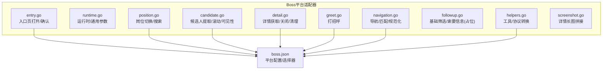
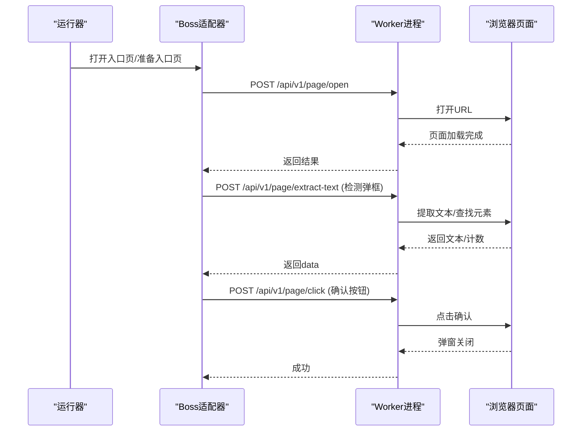
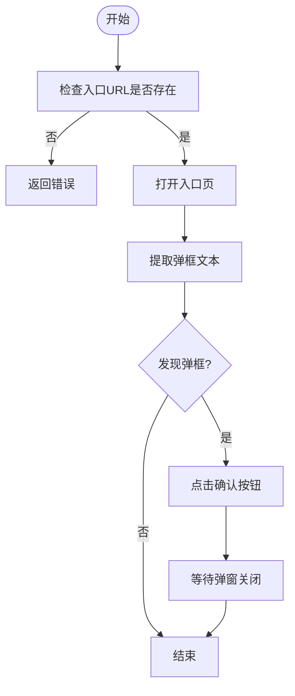
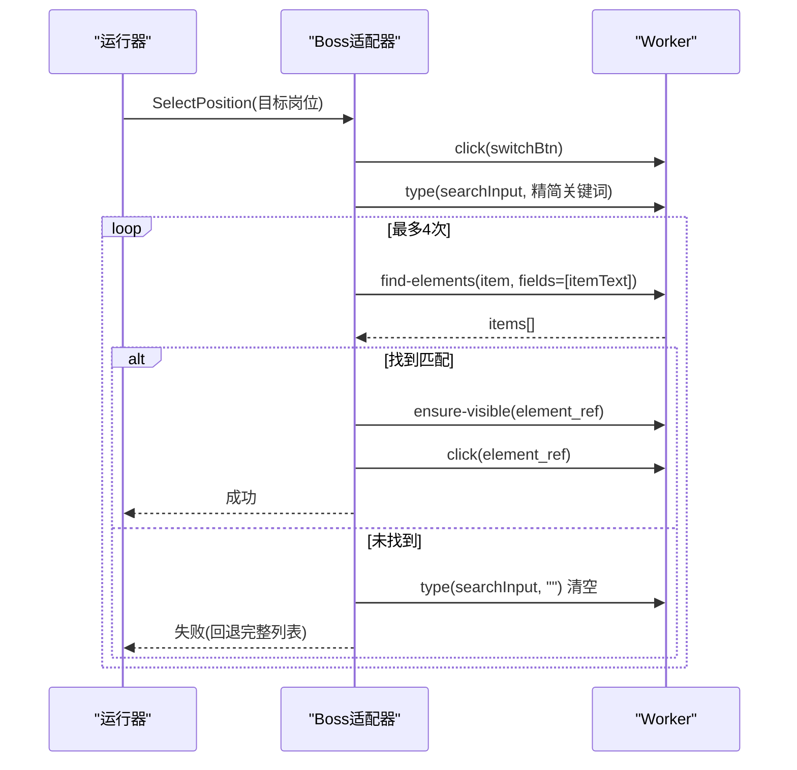
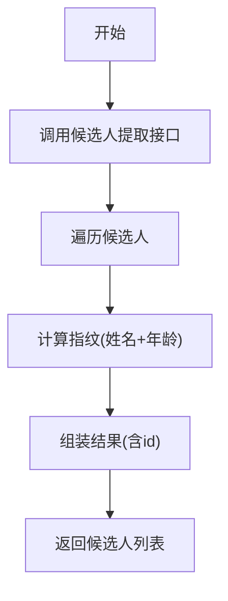
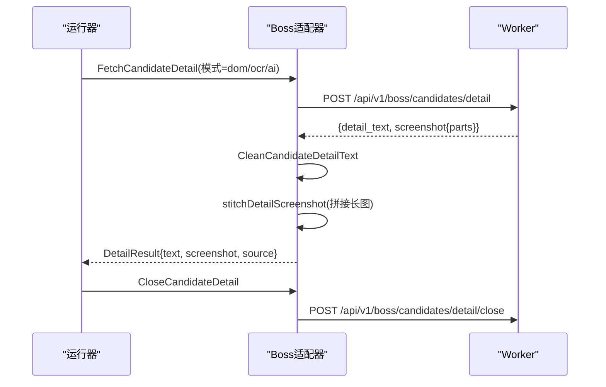
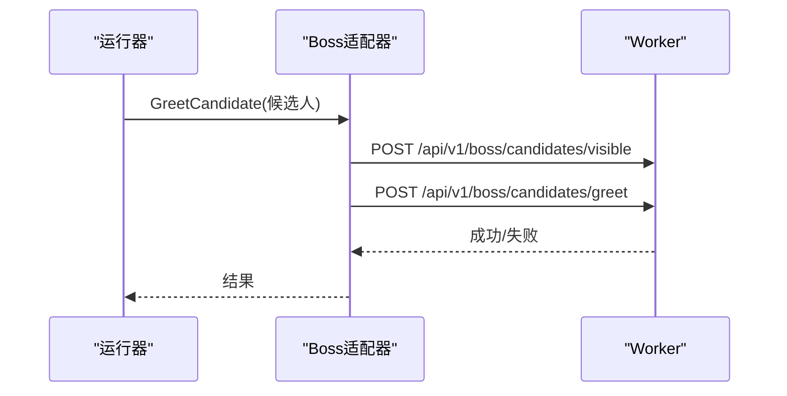
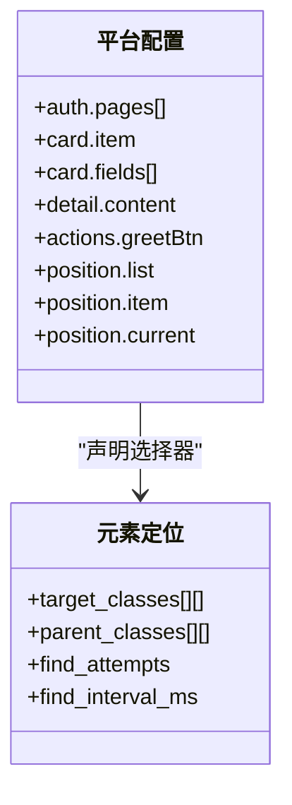
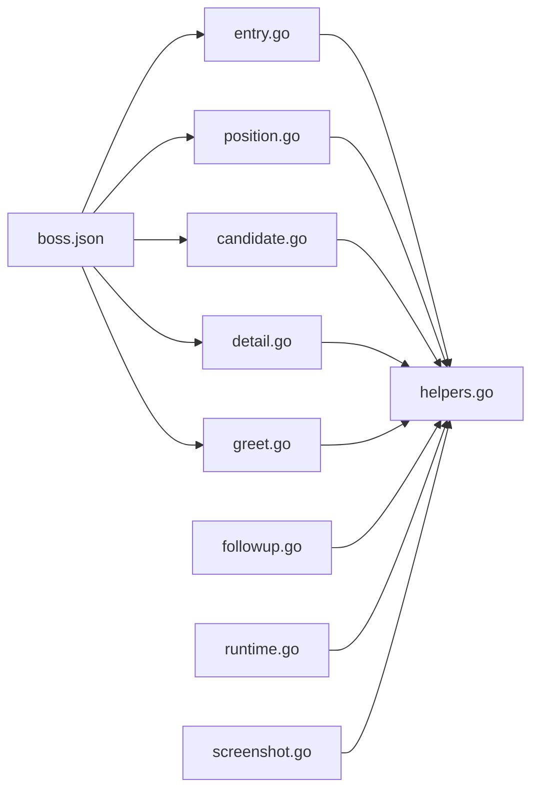

# Boss直聘适配器

<cite>
**本文引用的文件**
- [entry.go](file://goodhr5/local-agent-go/internal/platforms/boss/entry.go)
- [runtime.go](file://goodhr5/local-agent-go/internal/platforms/boss/runtime.go)
- [navigation.go](file://goodhr5/local-agent-go/internal/platforms/boss/navigation.go)
- [position.go](file://goodhr5/local-agent-go/internal/platforms/boss/position.go)
- [candidate.go](file://goodhr5/local-agent-go/internal/platforms/boss/candidate.go)
- [detail.go](file://goodhr5/local-agent-go/internal/platforms/boss/detail.go)
- [greet.go](file://goodhr5/local-agent-go/internal/platforms/boss/greet.go)
- [followup.go](file://goodhr5/local-agent-go/internal/platforms/boss/followup.go)
- [helpers.go](file://goodhr5/local-agent-go/internal/platforms/boss/helpers.go)
- [screenshot.go](file://goodhr5/local-agent-go/internal/platforms/boss/screenshot.go)
- [boss.json](file://goodhr5/cloud/backend/boss.json)
- [runtime_test.go](file://goodhr5/local-agent-go/internal/platforms/boss/runtime_test.go)
</cite>

## 目录
1. [简介](#简介)
2. [项目结构](#项目结构)
3. [核心组件](#核心组件)
4. [架构总览](#架构总览)
5. [详细组件分析](#详细组件分析)
6. [依赖关系分析](#依赖关系分析)
7. [性能考量](#性能考量)
8. [故障排查指南](#故障排查指南)
9. [结论](#结论)
10. [附录](#附录)

## 简介
本文件面向Boss直聘平台适配器的实现与使用，系统性说明页面结构分析、DOM选择器策略、用户交互模拟、岗位搜索流程、候选人列表解析、简历详情获取、自动问候发送、跟进消息处理、导航模式、元素定位、异常处理、截图采集、反爬应对与性能优化，并提供测试方法与调试技巧。

## 项目结构
Boss直聘适配器位于本地Agent的platforms模块中，按职责拆分为入口页、运行时、导航、岗位、候选人、详情、问候、跟进、辅助工具与截图拼接等文件；平台配置由云端下发JSON定义。

图表来源
- [entry.go:12-73](file://goodhr5/local-agent-go/internal/platforms/boss/entry.go#L12-L73)
- [runtime.go:11-62](file://goodhr5/local-agent-go/internal/platforms/boss/runtime.go#L11-L62)
- [navigation.go:12-162](file://goodhr5/local-agent-go/internal/platforms/boss/navigation.go#L12-L162)
- [position.go:12-200](file://goodhr5/local-agent-go/internal/platforms/boss/position.go#L12-L200)
- [candidate.go:13-87](file://goodhr5/local-agent-go/internal/platforms/boss/candidate.go#L13-L87)
- [detail.go:14-108](file://goodhr5/local-agent-go/internal/platforms/boss/detail.go#L14-L108)
- [greet.go:11-24](file://goodhr5/local-agent-go/internal/platforms/boss/greet.go#L11-L24)
- [followup.go:11-20](file://goodhr5/local-agent-go/internal/platforms/boss/followup.go#L11-L20)
- [helpers.go:112-186](file://goodhr5/local-agent-go/internal/platforms/boss/helpers.go#L112-L186)
- [boss.json:1-195](file://goodhr5/cloud/backend/boss.json#L1-L195)

章节来源
- [entry.go:12-73](file://goodhr5/local-agent-go/internal/platforms/boss/entry.go#L12-L73)
- [boss.json:1-195](file://goodhr5/cloud/backend/boss.json#L1-L195)

## 核心组件
- 入口与导航：负责打开入口页、处理弹框、判断是否仍在入口页、URL匹配策略与岗位名称规范化。
- 岗位操作：读取当前岗位、通过搜索或列表切换岗位，支持回退与日志诊断。
- 候选人处理：提取可见候选人、滚动列表、确保卡片可见、生成去重指纹。
- 详情处理：调用Worker获取详情文本与截图，拼接长图，清理平台附加内容，关闭详情。
- 问候与跟进：将候选人滚动到可视区域并点击打招呼；预留基础筛选与索要信息接口（当前为空实现）。
- 辅助工具：统一元素定位协议转换、Worker响应解析、日志格式化、候选字段请求构造等。
- 截图拼接：分段截图合并为长图，带内存与耗时诊断，失败降级与临时文件清理。

章节来源
- [entry.go:12-73](file://goodhr5/local-agent-go/internal/platforms/boss/entry.go#L12-L73)
- [navigation.go:12-162](file://goodhr5/local-agent-go/internal/platforms/boss/navigation.go#L12-L162)
- [position.go:12-200](file://goodhr5/local-agent-go/internal/platforms/boss/position.go#L12-L200)
- [candidate.go:13-87](file://goodhr5/local-agent-go/internal/platforms/boss/candidate.go#L13-L87)
- [detail.go:14-108](file://goodhr5/local-agent-go/internal/platforms/boss/detail.go#L14-L108)
- [greet.go:11-24](file://goodhr5/local-agent-go/internal/platforms/boss/greet.go#L11-L24)
- [followup.go:11-20](file://goodhr5/local-agent-go/internal/platforms/boss/followup.go#L11-L20)
- [helpers.go:112-186](file://goodhr5/local-agent-go/internal/platforms/boss/helpers.go#L112-L186)
- [screenshot.go:19-374](file://goodhr5/local-agent-go/internal/platforms/boss/screenshot.go#L19-L374)

## 架构总览
Boss直聘适配器通过Executor向Worker进程发起HTTP调用，完成页面操作、数据提取与截图处理；平台配置由云端JSON提供，包含登录态判定、页面入口、选择器与行为开关。

图表来源
- [entry.go:12-53](file://goodhr5/local-agent-go/internal/platforms/boss/entry.go#L12-L53)
- [helpers.go:75-99](file://goodhr5/local-agent-go/internal/platforms/boss/helpers.go#L75-L99)

章节来源
- [entry.go:12-53](file://goodhr5/local-agent-go/internal/platforms/boss/entry.go#L12-L53)
- [helpers.go:75-99](file://goodhr5/local-agent-go/internal/platforms/boss/helpers.go#L75-L99)

## 详细组件分析

### 入口页与导航
- 打开入口页：校验配置中的入口URL，调用page/open打开页面。
- 入口页准备：提取弹框文本，若存在则点击确认按钮，等待关闭。
- 入口页判断：列出当前标签页，匹配配置中的入口URL（支持prefix/contains/精确匹配）。
- 导航辅助：岗位名称规范化、搜索关键词清洗（去除括号说明）、列表项与容器选择器合并。

图表来源
- [entry.go:12-53](file://goodhr5/local-agent-go/internal/platforms/boss/entry.go#L12-L53)
- [navigation.go:12-71](file://goodhr5/local-agent-go/internal/platforms/boss/navigation.go#L12-L71)

章节来源
- [entry.go:12-53](file://goodhr5/local-agent-go/internal/platforms/boss/entry.go#L12-L53)
- [navigation.go:12-71](file://goodhr5/local-agent-go/internal/platforms/boss/navigation.go#L12-L71)

### 岗位搜索与切换
- 读取当前岗位：从当前页面提取岗位名称，缺失时记录诊断信息并报错。
- 切换岗位：优先尝试“岗位搜索框”输入精简关键词，轮询搜索结果匹配目标；若无搜索框或失败，回退到滚动列表逐项比对。
- 匹配与点击：找到匹配项后滚动至可视区域并点击；缺少element_ref时按索引点击。
- 关键词清洗：去除中英文括号说明、城市与薪资后缀，提高匹配稳定性。

图表来源
- [position.go:32-199](file://goodhr5/local-agent-go/internal/platforms/boss/position.go#L32-L199)
- [navigation.go:73-93](file://goodhr5/local-agent-go/internal/platforms/boss/navigation.go#L73-L93)

章节来源
- [position.go:32-199](file://goodhr5/local-agent-go/internal/platforms/boss/position.go#L32-L199)
- [navigation.go:73-93](file://goodhr5/local-agent-go/internal/platforms/boss/navigation.go#L73-L93)

### 候选人列表解析与可见性
- 提取候选人：调用专用接口批量提取，统计find/convert耗时，输出有效数量。
- 滚动列表：按距离滚动以加载更多。
- 确保可见：小步滚轮滚动到指定候选人卡片，携带诊断姓名与滚动参数。
- 去重指纹：基于姓名与年龄生成稳定ID，便于跨任务去重。

图表来源
- [candidate.go:13-87](file://goodhr5/local-agent-go/internal/platforms/boss/candidate.go#L13-L87)
- [runtime.go:19-62](file://goodhr5/local-agent-go/internal/platforms/boss/runtime.go#L19-L62)

章节来源
- [candidate.go:13-87](file://goodhr5/local-agent-go/internal/platforms/boss/candidate.go#L13-L87)
- [runtime.go:19-62](file://goodhr5/local-agent-go/internal/platforms/boss/runtime.go#L19-L62)

### 简历详情获取与截图拼接
- 获取详情：传入岗位ID、候选人索引与元素引用，开启截图与强制滚动，设置详情就绪超时。
- 清理文本：移除平台附加分析标记，仅保留业务相关文本。
- 关闭详情：通过按键关闭弹窗。
- 截图拼接：对分段截图进行像素级纵向拼接，输出固定长图；单段直接复制；失败时降级并清理临时文件。

图表来源
- [detail.go:14-108](file://goodhr5/local-agent-go/internal/platforms/boss/detail.go#L14-L108)
- [screenshot.go:19-374](file://goodhr5/local-agent-go/internal/platforms/boss/screenshot.go#L19-L374)

章节来源
- [detail.go:14-108](file://goodhr5/local-agent-go/internal/platforms/boss/detail.go#L14-L108)
- [screenshot.go:19-374](file://goodhr5/local-agent-go/internal/platforms/boss/screenshot.go#L19-L374)

### 自动问候与跟进
- 自动问候：先将候选人滚动到可视区域，再调用打招呼接口。
- 跟进消息：预留基础筛选与索要信息接口，当前为空实现，便于后续扩展。

图表来源
- [greet.go:11-24](file://goodhr5/local-agent-go/internal/platforms/boss/greet.go#L11-L24)
- [followup.go:11-20](file://goodhr5/local-agent-go/internal/platforms/boss/followup.go#L11-L20)

章节来源
- [greet.go:11-24](file://goodhr5/local-agent-go/internal/platforms/boss/greet.go#L11-L24)
- [followup.go:11-20](file://goodhr5/local-agent-go/internal/platforms/boss/followup.go#L11-L20)

### 元素定位与选择器策略
- 统一协议：将云端配置中的target_classes/parent_classes/find_attempts等转换为Worker统一元素协议。
- 列表项合并：岗位列表容器与列表项的选择器可叠加父类与目标类，提升鲁棒性。
- 平台配置：登录态判定、入口页、详情页、动作按钮、岗位列表等均在boss.json中声明。

图表来源
- [helpers.go:112-186](file://goodhr5/local-agent-go/internal/platforms/boss/helpers.go#L112-L186)
- [boss.json:1-195](file://goodhr5/cloud/backend/boss.json#L1-L195)

章节来源
- [helpers.go:112-186](file://goodhr5/local-agent-go/internal/platforms/boss/helpers.go#L112-L186)
- [boss.json:1-195](file://goodhr5/cloud/backend/boss.json#L1-L195)

## 依赖关系分析
- 内部依赖：所有方法通过Executor调用Worker HTTP接口，使用统一的响应解析工具函数。
- 外部依赖：平台配置来自云端JSON，决定页面入口、选择器与行为开关。
- 耦合度：各模块职责清晰，通过配置与协议解耦；截图拼接独立于其他流程，具备降级能力。

图表来源
- [entry.go:12-73](file://goodhr5/local-agent-go/internal/platforms/boss/entry.go#L12-L73)
- [position.go:12-200](file://goodhr5/local-agent-go/internal/platforms/boss/position.go#L12-L200)
- [candidate.go:13-87](file://goodhr5/local-agent-go/internal/platforms/boss/candidate.go#L13-L87)
- [detail.go:14-108](file://goodhr5/local-agent-go/internal/platforms/boss/detail.go#L14-L108)
- [greet.go:11-24](file://goodhr5/local-agent-go/internal/platforms/boss/greet.go#L11-L24)
- [followup.go:11-20](file://goodhr5/local-agent-go/internal/platforms/boss/followup.go#L11-L20)
- [runtime.go:11-62](file://goodhr5/local-agent-go/internal/platforms/boss/runtime.go#L11-L62)
- [helpers.go:112-186](file://goodhr5/local-agent-go/internal/platforms/boss/helpers.go#L112-L186)
- [boss.json:1-195](file://goodhr5/cloud/backend/boss.json#L1-L195)

章节来源
- [helpers.go:112-186](file://goodhr5/local-agent-go/internal/platforms/boss/helpers.go#L112-L186)
- [boss.json:1-195](file://goodhr5/cloud/backend/boss.json#L1-L195)

## 性能考量
- 滚动与可见性：采用小步滚轮与最大距离限制，减少抖动与重复渲染；详情获取强制滚动并设置就绪超时，避免长时间阻塞。
- 截图拼接：分段解码与增量合并，内存分配前记录状态；单段直接复制降低开销；失败时快速降级并清理临时文件。
- 日志诊断：关键步骤记录耗时与内存占用，便于定位瓶颈。
- 反爬策略应对：
  - 动态选择器：通过target_classes与parent_classes组合，增强抗变更能力。
  - 行为拟人：输入前短暂延迟、滚动步长与等待时间合理设置。
  - 重试机制：岗位搜索轮询多次刷新结果，失败回退完整列表。
  - 指纹去重：基于姓名与年龄的稳定ID，避免重复处理。

[本节为通用指导，不直接分析具体文件]

## 故障排查指南
- 入口页弹框未关闭：检查弹框文本提取是否成功，确认按钮选择器是否正确，必要时增加等待时间。
- 岗位切换失败：
  - 搜索框不可用：查看日志提示“岗位搜索框不可用”，回退到完整列表。
  - 未匹配到岗位：核对岗位模板名称与Boss展示名称一致性，注意关键词清洗规则。
- 候选人可见性失败：确认候选人指纹与元素引用是否正确传递，检查滚动参数与可视区域边距。
- 详情获取失败：关注追踪编号与诊断信息，检查截图分段路径与权限，确认Worker返回的detail_text是否为空。
- 截图拼接失败：查看分段图片数量与大小，确认PNG解码与写入是否成功，必要时启用降级逻辑。

章节来源
- [entry.go:23-53](file://goodhr5/local-agent-go/internal/platforms/boss/entry.go#L23-L53)
- [position.go:32-119](file://goodhr5/local-agent-go/internal/platforms/boss/position.go#L32-L119)
- [candidate.go:61-68](file://goodhr5/local-agent-go/internal/platforms/boss/candidate.go#L61-L68)
- [detail.go:14-108](file://goodhr5/local-agent-go/internal/platforms/boss/detail.go#L14-L108)
- [screenshot.go:19-374](file://goodhr5/local-agent-go/internal/platforms/boss/screenshot.go#L19-L374)

## 结论
Boss直聘适配器通过清晰的模块化设计与稳健的元素定位策略，实现了从入口页到岗位切换、候选人提取、详情获取与问候的全流程自动化。配合截图拼接与详尽的诊断日志，能够在复杂页面结构与反爬策略下保持稳定运行。建议在生产环境中持续监控日志指标，并根据平台UI变化及时更新选择器配置。

[本节为总结，不直接分析具体文件]

## 附录

### Boss平台配置要点
- 登录态与入口：auth.pages定义入口与匹配方式，login_url_prefixes与logged_in_url_prefixes用于登录态判定。
- 候选人卡片：card.item与card.fields定义卡片容器与字段选择器，scroll.target_classes定义滚动容器。
- 详情页：detail.content与closeBtn定义详情内容与关闭按钮，openTarget定义打开详情的目标。
- 动作按钮：actions.greetBtn等定义常见操作按钮。
- 岗位列表：position.list/item/current/switchBtn等定义岗位列表与切换入口。

章节来源
- [boss.json:1-195](file://goodhr5/cloud/backend/boss.json#L1-L195)

### 测试方法与调试技巧
- 单元测试覆盖：
  - 候选人指纹：验证仅基于姓名与年龄生成稳定ID。
  - 岗位搜索词清洗：验证去除括号说明、城市与薪资后缀。
  - 岗位切换流程：验证优先使用搜索框，且点击正确匹配项。
  - 详情获取参数：验证详情就绪超时、追踪编号与诊断姓名传递。
- 调试技巧：
  - 利用日志中的追踪编号串联全流程。
  - 检查Worker返回的data字段与错误信息。
  - 在截图拼接阶段观察分段数量、尺寸与耗时，定位IO或解码问题。

章节来源
- [runtime_test.go:12-234](file://goodhr5/local-agent-go/internal/platforms/boss/runtime_test.go#L12-L234)