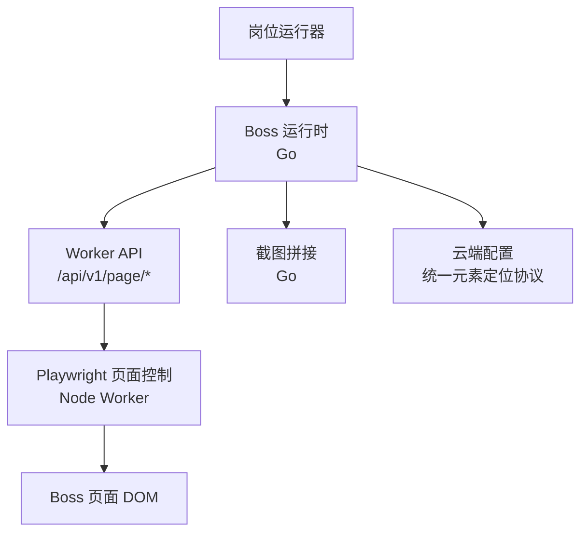
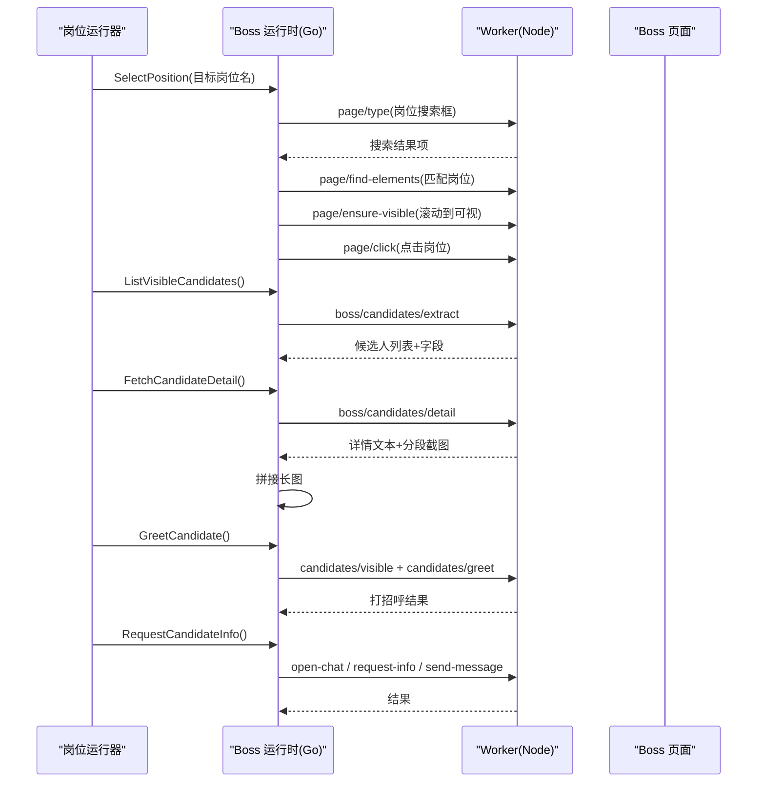
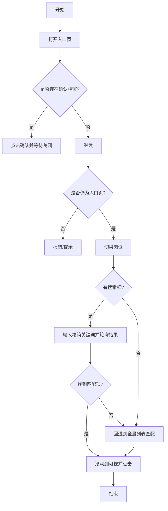
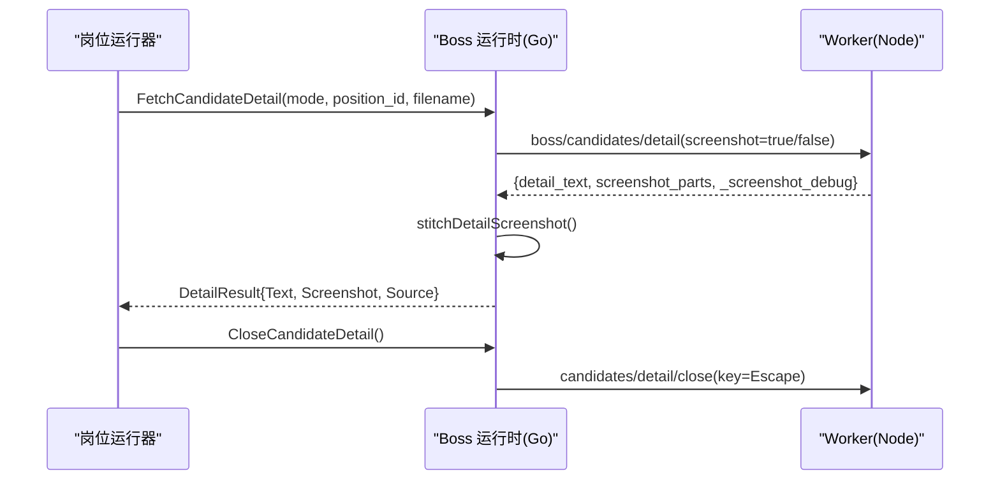
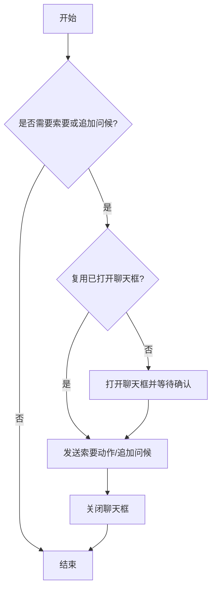
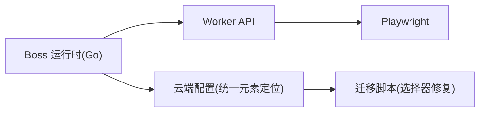

# Boss直聘适配器

<cite>
**本文引用的文件**
- [entry.go](file://goodhr5/local-agent-go/internal/platforms/boss/entry.go)
- [runtime.go](file://goodhr5/local-agent-go/internal/platforms/boss/runtime.go)
- [navigation.go](file://goodhr5/local-agent-go/internal/platforms/boss/navigation.go)
- [position.go](file://goodhr5/local-agent-go/internal/platforms/boss/position.go)
- [candidate.go](file://goodhr5/local-agent-go/internal/platforms/boss/candidate.go)
- [detail.go](file://goodhr5/local-agent-go/internal/platforms/boss/detail.go)
- [greet.go](file://goodhr5/local-agent-go/internal/platforms/boss/greet.go)
- [followup.go](file://goodhr5/local-agent-go/internal/platforms/boss/followup.go)
- [helpers.go](file://goodhr5/local-agent-go/internal/platforms/boss/helpers.go)
- [screenshot.go](file://goodhr5/local-agent-go/internal/platforms/boss/screenshot.go)
- [config.json](file://goodhr5/local-agent-go/internal/platforms/boss/config.json)
- [0012_platform_locator_schema.sql](file://goodhr5/cloud/backend/db/migrations/0012_platform_locator_schema.sql)
- [0036_boss_position_switch_config.sql](file://goodhr5/cloud/backend/db/migrations/0036_boss_position_switch_config.sql)
- [0038_ensure_boss_position_config.sql](file://goodhr5/cloud/backend/db/migrations/0038_ensure_boss_position_config.sql)
- [0039_fix_boss_position_placeholder.sql](file://goodhr5/cloud/backend/db/migrations/0039_fix_boss_position_placeholder.sql)
- [boss.normalized.json](file://goodhr5/cloud/backend/boss.normalized.json)
- [index.js](file://goodhr5/local-agent-go/worker-node/src/index.js)
- [greet-policy.test.js](file://goodhr5/local-agent-go/worker-node/src/greet-policy.test.js)
</cite>

## 目录
1. [简介](#简介)
2. [项目结构](#项目结构)
3. [核心组件](#核心组件)
4. [架构总览](#架构总览)
5. [详细组件分析](#详细组件分析)
6. [依赖关系分析](#依赖关系分析)
7. [性能与反爬策略](#性能与反爬策略)
8. [故障排查指南](#故障排查指南)
9. [结论](#结论)
10. [附录](#附录)

## 简介
本文件为 Boss 直聘平台适配器的完整技术文档，聚焦页面结构分析、DOM 选择器策略、用户交互模拟、岗位搜索流程、候选人列表解析、简历详情获取、自动问候发送、跟进消息处理、导航模式实现、元素定位策略、异常处理机制、截图采集功能，以及 Boss 平台特有的业务逻辑、反爬虫策略应对、性能优化方案与测试调试方法。

## 项目结构
Boss 直聘适配器位于本地 Agent 的“平台实现”层，采用“Go 运行时 + Node Worker”的双端协作：
- Go 侧负责编排、配置解析、日志与错误封装、截图拼接等重逻辑。
- Node Worker 侧负责浏览器自动化、DOM 查找、滚动、点击、输入、截图分段等具体页面操作。
- 云端配置通过统一元素定位协议下发，支持 target_classes / parent_classes / find_attempts / find_interval_ms 等字段。

图表来源
- [position.go:32-119](file://goodhr5/local-agent-go/internal/platforms/boss/position.go#L32-L119)
- [candidate.go:13-49](file://goodhr5/local-agent-go/internal/platforms/boss/candidate.go#L13-L49)
- [detail.go:14-64](file://goodhr5/local-agent-go/internal/platforms/boss/detail.go#L14-L64)
- [index.js:1569-1615](file://goodhr5/local-agent-go/worker-node/src/index.js#L1569-L1615)

章节来源
- [position.go:12-119](file://goodhr5/local-agent-go/internal/platforms/boss/position.go#L12-L119)
- [candidate.go:13-49](file://goodhr5/local-agent-go/internal/platforms/boss/candidate.go#L13-L49)
- [detail.go:14-64](file://goodhr5/local-agent-go/internal/platforms/boss/detail.go#L14-L64)
- [index.js:1569-1615](file://goodhr5/local-agent-go/worker-node/src/index.js#L1569-L1615)

## 核心组件
- 入口与导航：打开入口页、检测确认弹窗、判断是否仍在入口页、岗位切换（搜索框优先，回退到列表匹配）。
- 候选人提取与可见性：批量提取当前可见候选人、滚动加载、确保指定卡片进入视口。
- 详情获取：调用 Worker 拉取详情文本与截图，必要时进行长图拼接。
- 打招呼与跟进：执行打招呼、复用已打开聊天框、按岗位配置索要信息并追加问候语。
- 工具与配置：统一元素定位协议转换、日志格式化、名称规范化、指纹去重。

章节来源
- [entry.go:12-73](file://goodhr5/local-agent-go/internal/platforms/boss/entry.go#L12-L73)
- [navigation.go:12-93](file://goodhr5/local-agent-go/internal/platforms/boss/navigation.go#L12-L93)
- [position.go:32-199](file://goodhr5/local-agent-go/internal/platforms/boss/position.go#L32-L199)
- [candidate.go:13-87](file://goodhr5/local-agent-go/internal/platforms/boss/candidate.go#L13-L87)
- [detail.go:14-108](file://goodhr5/local-agent-go/internal/platforms/boss/detail.go#L14-L108)
- [greet.go:11-24](file://goodhr5/local-agent-go/internal/platforms/boss/greet.go#L11-L24)
- [followup.go:16-117](file://goodhr5/local-agent-go/internal/platforms/boss/followup.go#L16-L117)
- [helpers.go:9-207](file://goodhr5/local-agent-go/internal/platforms/boss/helpers.go#L9-L207)

## 架构总览
Boss 适配器的关键调用链如下：
- 岗位切换：先尝试通过岗位搜索框输入精简关键词，再轮询结果列表匹配；失败则回退到全量列表滚动匹配。
- 候选人提取：调用 Worker 接口提取当前可见候选人，附带字段定位规则，返回结构化数据。
- 详情获取：根据模式（DOM/OCR/AI）决定是否携带截图参数，Worker 返回文本与分段截图，Go 侧拼接长图。
- 打招呼与跟进：先确保候选人在视口，再触发打招呼；若需索要信息，复用或打开聊天框，按按钮序列完成索要与发送。

图表来源
- [position.go:32-199](file://goodhr5/local-agent-go/internal/platforms/boss/position.go#L32-L199)
- [candidate.go:13-49](file://goodhr5/local-agent-go/internal/platforms/boss/candidate.go#L13-L49)
- [detail.go:14-64](file://goodhr5/local-agent-go/internal/platforms/boss/detail.go#L14-L64)
- [greet.go:11-24](file://goodhr5/local-agent-go/internal/platforms/boss/greet.go#L11-L24)
- [followup.go:45-117](file://goodhr5/local-agent-go/internal/platforms/boss/followup.go#L45-L117)
- [index.js:1569-1615](file://goodhr5/local-agent-go/worker-node/src/index.js#L1569-L1615)

## 详细组件分析

### 入口与导航
- 打开入口页：校验入口 URL，调用 Worker 打开页面。
- 入口页确认弹窗：提取弹框文本，若存在则点击确认按钮并等待关闭。
- 入口页判定：读取当前页面列表，比较 URL 是否匹配入口配置（支持 exact/prefix/contains）。
- 岗位切换：优先使用岗位搜索框输入精简关键词（去除括号说明），多次刷新后匹配；未命中则回退到全量列表滚动匹配，滚动到可视区域后点击。

图表来源
- [entry.go:12-73](file://goodhr5/local-agent-go/internal/platforms/boss/entry.go#L12-L73)
- [navigation.go:12-93](file://goodhr5/local-agent-go/internal/platforms/boss/navigation.go#L12-L93)
- [position.go:32-199](file://goodhr5/local-agent-go/internal/platforms/boss/position.go#L32-L199)

章节来源
- [entry.go:12-73](file://goodhr5/local-agent-go/internal/platforms/boss/entry.go#L12-L73)
- [navigation.go:12-93](file://goodhr5/local-agent-go/internal/platforms/boss/navigation.go#L12-L93)
- [position.go:32-199](file://goodhr5/local-agent-go/internal/platforms/boss/position.go#L32-L199)

### 候选人列表解析
- 提取可见候选人：调用 Worker 接口，传入平台配置与最大数量限制，返回结构化候选人数组及耗时统计。
- 滚动加载：按配置滚动容器滚动指定距离，触发新卡片渲染。
- 可见性保证：对指定候选人卡片使用小步滚轮滚动至可视区域，支持 require_full 与 viewport_margin 控制。
- 去重指纹：基于姓名与年龄生成稳定 ID，避免重复处理。

章节来源
- [candidate.go:13-87](file://goodhr5/local-agent-go/internal/platforms/boss/candidate.go#L13-L87)
- [index.js:1569-1615](file://goodhr5/local-agent-go/worker-node/src/index.js#L1569-L1615)
- [runtime.go:21-36](file://goodhr5/local-agent-go/internal/platforms/boss/runtime.go#L21-L36)

### 简历详情获取
- 详情提取：根据模式（DOM/OCR/AI）决定是否开启截图；传递 card_index、element_ref、滚动参数与截图目录。
- 文本清理：移除平台附加内容标记，保留有效正文。
- 截图拼接：将分段截图按重叠像素智能拼接为一张长图，输出固定路径并记录尺寸与分段数。
- 关闭详情：通过键盘快捷键关闭详情弹窗。

图表来源
- [detail.go:14-108](file://goodhr5/local-agent-go/internal/platforms/boss/detail.go#L14-L108)
- [screenshot.go:19-168](file://goodhr5/local-agent-go/internal/platforms/boss/screenshot.go#L19-L168)

章节来源
- [detail.go:14-108](file://goodhr5/local-agent-go/internal/platforms/boss/detail.go#L14-L108)
- [screenshot.go:19-168](file://goodhr5/local-agent-go/internal/platforms/boss/screenshot.go#L19-L168)

### 自动问候发送
- 可见性前置：确保候选人在视口后再执行打招呼。
- 打招呼动作：调用 Worker 接口点击打招呼按钮；若启用后续点击策略，会依次点击“继续沟通”和“确认”。
- 策略控制：Boss 平台默认保留打招呼后的追加点击处理。

章节来源
- [greet.go:11-24](file://goodhr5/local-agent-go/internal/platforms/boss/greet.go#L11-L24)
- [index.js:1676-1714](file://goodhr5/local-agent-go/worker-node/src/index.js#L1676-L1714)
- [greet-policy.test.js:13-16](file://goodhr5/local-agent-go/worker-node/src/greet-policy.test.js#L13-L16)

### 跟进消息处理
- 聊天框复用：打招呼后聊天框通常自动打开，短轮询复用；否则主动打开并等待确认。
- 信息索要：在聊天框内按岗位配置点击“手机号/微信/简历”，并处理确认浮层。
- 追加问候语：可选发送岗位追加问候语。
- 收尾清理：无论成功与否，最终都会尝试关闭聊天框。

图表来源
- [followup.go:16-117](file://goodhr5/local-agent-go/internal/platforms/boss/followup.go#L16-L117)

章节来源
- [followup.go:16-117](file://goodhr5/local-agent-go/internal/platforms/boss/followup.go#L16-L117)

### 导航模式与元素定位策略
- 统一元素定位协议：target_classes / parent_classes / find_attempts / find_interval_ms，兼容旧版字段命名。
- 岗位列表合并：将列表容器与列表项配置合并，叠加父级与目标类集合，提高定位稳定性。
- 入口页匹配：支持 exact/prefix/contains 三种匹配模式，便于 SPA 路由变化下的鲁棒性。
- 岗位名称规范化：去除空白与括号说明，提升搜索匹配准确率。

章节来源
- [helpers.go:112-160](file://goodhr5/local-agent-go/internal/platforms/boss/helpers.go#L112-L160)
- [navigation.go:12-93](file://goodhr5/local-agent-go/internal/platforms/boss/navigation.go#L12-L93)
- [0012_platform_locator_schema.sql:1-36](file://goodhr5/cloud/backend/db/migrations/0012_platform_locator_schema.sql#L1-L36)

### 异常处理机制
- 空值与缺失配置：对缺失的选择器、URL、文本等给出明确警告与错误信息。
- 超时与重试：岗位搜索轮询、滚动可见性、弹窗等待均设置合理超时与间隔。
- 降级策略：岗位搜索失败回退到全量列表；截图拼接失败回退单段复制；聊天框关闭失败记录警告但不阻断主流程。
- 追踪编号：详情提取过程附带 traceID，便于问题定位。

章节来源
- [position.go:32-199](file://goodhr5/local-agent-go/internal/platforms/boss/position.go#L32-L199)
- [detail.go:14-108](file://goodhr5/local-agent-go/internal/platforms/boss/detail.go#L14-L108)
- [followup.go:45-117](file://goodhr5/local-agent-go/internal/platforms/boss/followup.go#L45-L117)

### 截图采集与长图拼接
- 分段截图：Worker 按可滚动区域分段截取，返回片段路径与重叠像素。
- 拼接算法：计算上下两张图的重叠条带差异，确定最佳拼接位置，合成 RGBA 图像并写入固定路径。
- 资源清理：完成后删除临时分段文件，仅保留最终长图。

章节来源
- [screenshot.go:19-168](file://goodhr5/local-agent-go/internal/platforms/boss/screenshot.go#L19-L168)
- [screenshot.go:237-331](file://goodhr5/local-agent-go/internal/platforms/boss/screenshot.go#L237-L331)

## 依赖关系分析
- Go 运行时依赖 Worker API：page/open、page/list、page/extract-text、page/find-elements、page/ensure-visible、page/click、page/type、boss/candidates/*。
- Worker 依赖 Playwright：页面定位、滚动、点击、输入、键盘事件、截图。
- 配置依赖：云端系统配置提供统一元素定位协议，迁移脚本修复占位符与默认值。

图表来源
- [position.go:32-199](file://goodhr5/local-agent-go/internal/platforms/boss/position.go#L32-L199)
- [candidate.go:13-49](file://goodhr5/local-agent-go/internal/platforms/boss/candidate.go#L13-L49)
- [0036_boss_position_switch_config.sql:37-60](file://goodhr5/cloud/backend/db/migrations/0036_boss_position_switch_config.sql#L37-L60)
- [0038_ensure_boss_position_config.sql:36-75](file://goodhr5/cloud/backend/db/migrations/0038_ensure_boss_position_config.sql#L36-L75)
- [0039_fix_boss_position_placeholder.sql:1-14](file://goodhr5/cloud/backend/db/migrations/0039_fix_boss_position_placeholder.sql#L1-L14)

章节来源
- [position.go:32-199](file://goodhr5/local-agent-go/internal/platforms/boss/position.go#L32-L199)
- [candidate.go:13-49](file://goodhr5/local-agent-go/internal/platforms/boss/candidate.go#L13-L49)
- [0036_boss_position_switch_config.sql:37-60](file://goodhr5/cloud/backend/db/migrations/0036_boss_position_switch_config.sql#L37-L60)
- [0038_ensure_boss_position_config.sql:36-75](file://goodhr5/cloud/backend/db/migrations/0038_ensure_boss_position_config.sql#L36-L75)
- [0039_fix_boss_position_placeholder.sql:1-14](file://goodhr5/cloud/backend/db/migrations/0039_fix_boss_position_placeholder.sql#L1-L14)

## 性能与反爬策略
- 滚动与可见性：使用 ensure-visible 小步滚轮滚动，减少抖动与误判；viewport_margin 控制边距，require_full 确保完全可见。
- 搜索优先：岗位切换优先使用搜索框，降低全量列表遍历成本。
- 截图拼接优化：按重叠像素智能拼接，避免重复渲染与内存浪费；单段时直接复制，减少开销。
- 反爬应对：
  - 延迟与随机化：输入、滚动、点击前后加入合理延时，模拟人类行为。
  - 选择器稳健：使用 target_classes 与 parent_classes 组合，容忍类名变化。
  - 降级与重试：搜索失败回退列表匹配；弹窗关闭失败记录警告并继续。
  - 行为策略：Boss 平台允许打招呼后继续点击“继续沟通”和“确认”，提高成功率。

章节来源
- [position.go:32-199](file://goodhr5/local-agent-go/internal/platforms/boss/position.go#L32-L199)
- [screenshot.go:19-168](file://goodhr5/local-agent-go/internal/platforms/boss/screenshot.go#L19-L168)
- [greet.go:11-24](file://goodhr5/local-agent-go/internal/platforms/boss/greet.go#L11-L24)
- [greet-policy.test.js:13-16](file://goodhr5/local-agent-go/worker-node/src/greet-policy.test.js#L13-L16)

## 故障排查指南
- 入口页未匹配：检查入口 URL 配置与 match 模式，确认当前页面列表是否为空。
- 岗位搜索失败：查看精简关键词是否正确；确认搜索框可用；检查结果列表是否刷新；必要时回退到全量列表。
- 候选人提取为空：确认当前页面为推荐牛人页；检查 candidate_card 选择器；查看 Worker 返回的 found_count。
- 详情截图为空：检查 mode 是否开启截图；查看 _screenshot_debug 与分段数量；确认输出目录权限。
- 聊天框无法关闭：记录关闭错误；确认 key 参数；必要时手动干预。

章节来源
- [entry.go:12-73](file://goodhr5/local-agent-go/internal/platforms/boss/entry.go#L12-L73)
- [position.go:32-199](file://goodhr5/local-agent-go/internal/platforms/boss/position.go#L32-L199)
- [candidate.go:13-49](file://goodhr5/local-agent-go/internal/platforms/boss/candidate.go#L13-L49)
- [detail.go:14-108](file://goodhr5/local-agent-go/internal/platforms/boss/detail.go#L14-L108)
- [followup.go:45-117](file://goodhr5/local-agent-go/internal/platforms/boss/followup.go#L45-L117)

## 结论
Boss 直聘适配器通过统一的元素定位协议与双端协作架构，实现了稳定的岗位切换、候选人提取、详情获取、打招呼与跟进能力。其设计强调鲁棒性（选择器组合、降级策略）、可观测性（日志与追踪编号）与性能（搜索优先、滚动优化、截图拼接）。配合云端配置与迁移脚本，可在平台 UI 变化时快速调整选择器，保障长期可用性。

## 附录

### 平台配置与选择器参考
- 统一元素定位协议字段：target_classes、parent_classes、find_attempts、find_interval_ms。
- 岗位相关选择器：current、switchBtn、list、item、itemText、clickTarget。
- 候选人相关选择器：card、fields（name、basic_info、education、university、description）。
- 消息与附件：会话列表、输入框、发送按钮、求简历按钮、确认弹窗。

章节来源
- [0012_platform_locator_schema.sql:1-36](file://goodhr5/cloud/backend/db/migrations/0012_platform_locator_schema.sql#L1-L36)
- [0036_boss_position_switch_config.sql:37-60](file://goodhr5/cloud/backend/db/migrations/0036_boss_position_switch_config.sql#L37-L60)
- [0038_ensure_boss_position_config.sql:36-75](file://goodhr5/cloud/backend/db/migrations/0038_ensure_boss_position_config.sql#L36-L75)
- [0039_fix_boss_position_placeholder.sql:1-14](file://goodhr5/cloud/backend/db/migrations/0039_fix_boss_position_placeholder.sql#L1-L14)
- [config.json:1-102](file://goodhr5/local-agent-go/internal/platforms/boss/config.json#L1-L102)
- [boss.normalized.json:18-61](file://goodhr5/cloud/backend/boss.normalized.json#L18-L61)

### 测试方法与调试技巧
- 单元测试：验证岗位搜索词规范化、岗位切换优先使用搜索框、候选人可见性滚动参数等。
- 端到端验证：在真实 Boss 页面执行入口页打开、岗位切换、候选人提取、详情获取、打招呼与跟进全流程。
- 调试要点：
  - 关注日志中的 traceID、found_count、elapsed_ms、parts_count 等指标。
  - 使用 _screenshot_debug 与滚动调试信息定位截图问题。
  - 检查 Worker 返回的 element_ref 与 final_view，确认元素可见性与滚动效果。

章节来源
- [runtime_test.go:65-92](file://goodhr5/local-agent-go/internal/platforms/boss/runtime_test.go#L65-L92)
- [detail.go:14-64](file://goodhr5/local-agent-go/internal/platforms/boss/detail.go#L14-L64)
- [screenshot.go:19-168](file://goodhr5/local-agent-go/internal/platforms/boss/screenshot.go#L19-L168)