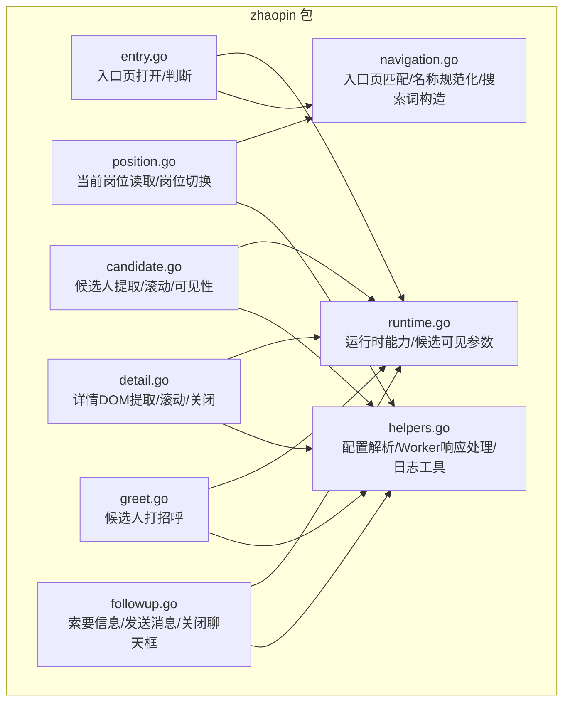
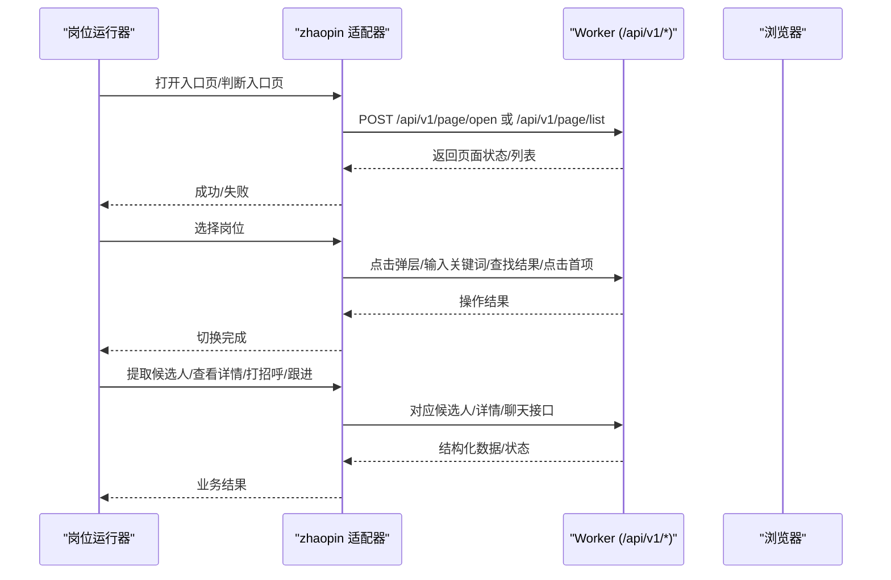
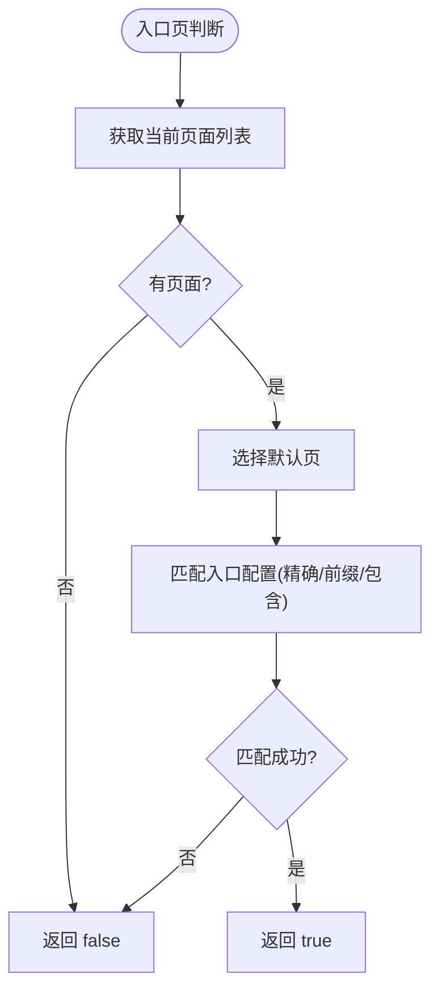
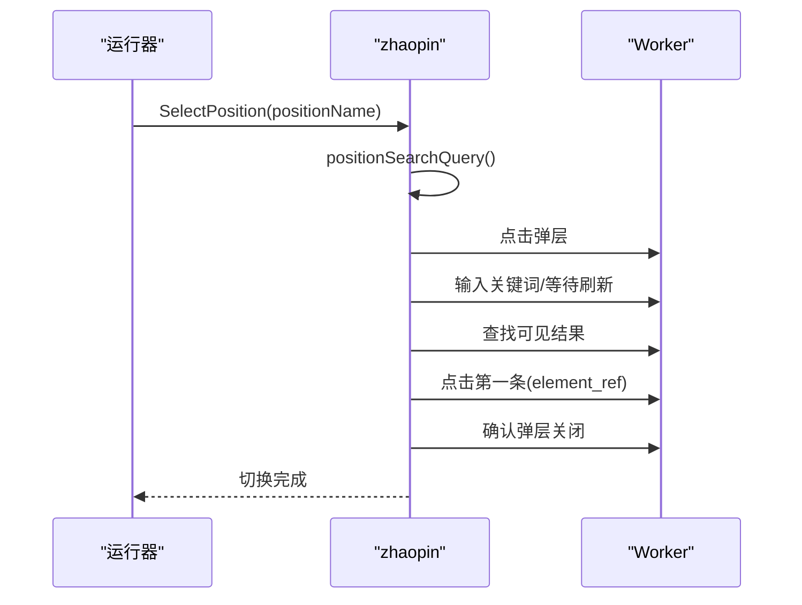
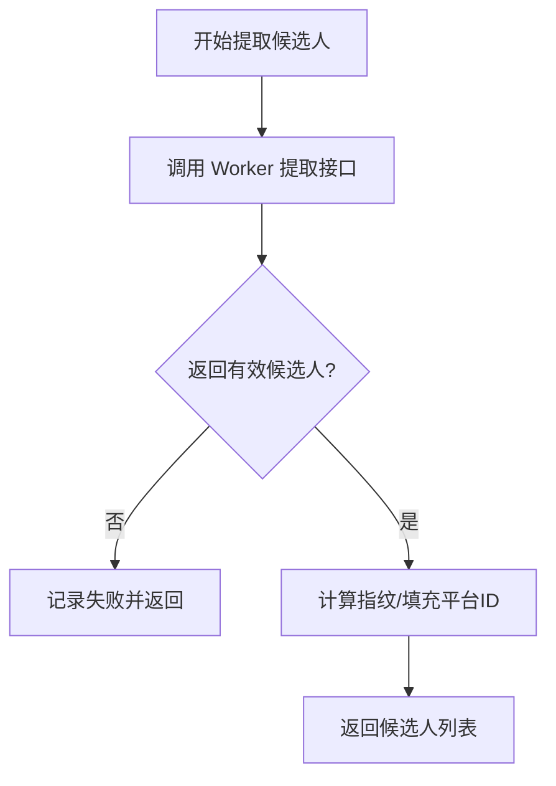
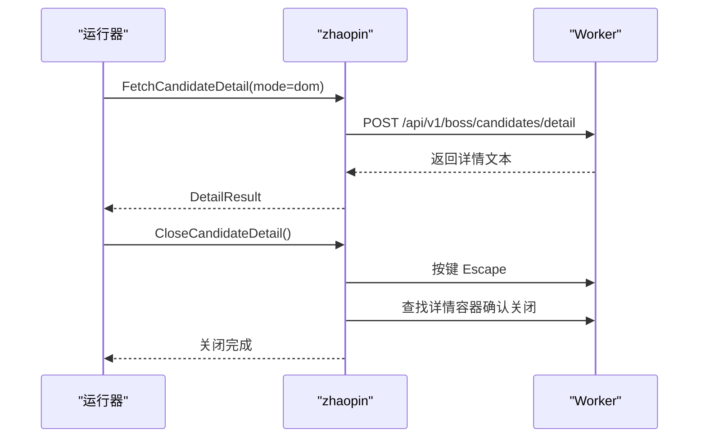
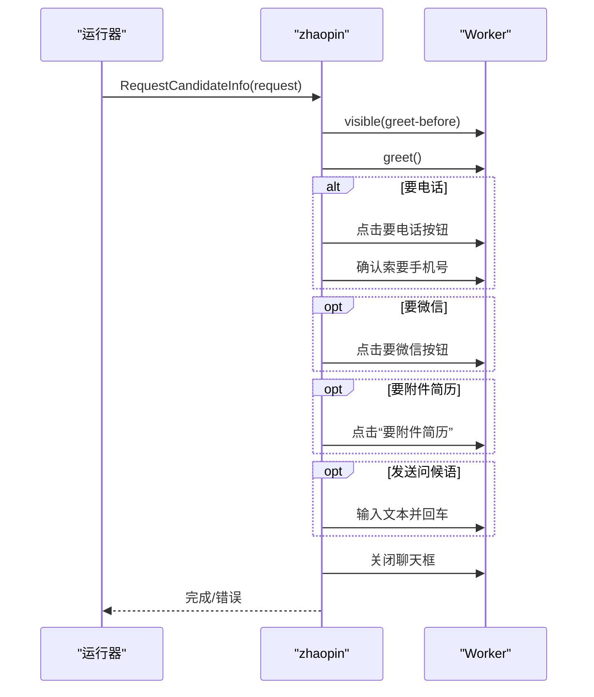
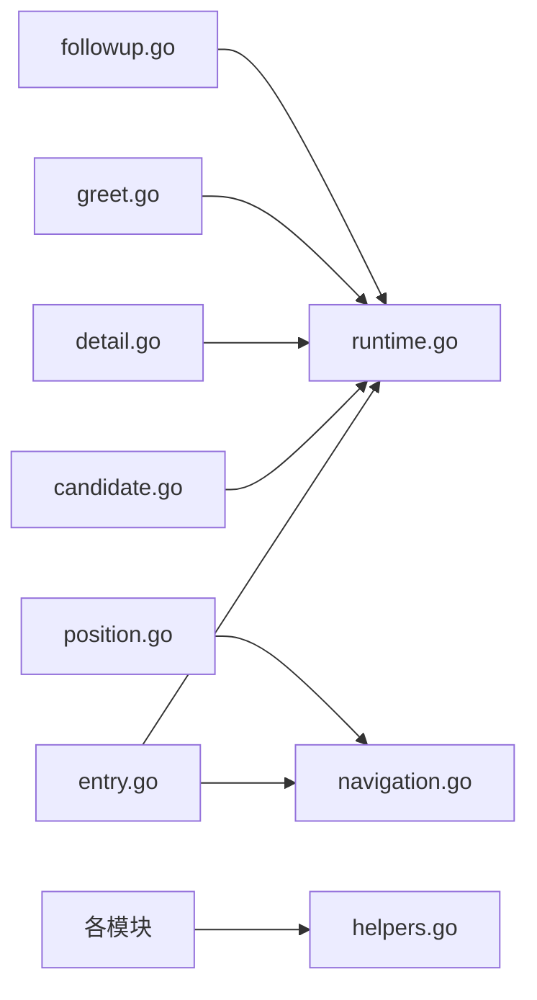

# 前程无忧适配器

<cite>
**本文引用的文件**
- [entry.go](file://goodhr5/local-agent-go/internal/platforms/zhaopin/entry.go)
- [runtime.go](file://goodhr5/local-agent-go/internal/platforms/zhaopin/runtime.go)
- [navigation.go](file://goodhr5/local-agent-go/internal/platforms/zhaopin/navigation.go)
- [position.go](file://goodhr5/local-agent-go/internal/platforms/zhaopin/position.go)
- [candidate.go](file://goodhr5/local-agent-go/internal/platforms/zhaopin/candidate.go)
- [detail.go](file://goodhr5/local-agent-go/internal/platforms/zhaopin/detail.go)
- [greet.go](file://goodhr5/local-agent-go/internal/platforms/zhaopin/greet.go)
- [followup.go](file://goodhr5/local-agent-go/internal/platforms/zhaopin/followup.go)
- [helpers.go](file://goodhr5/local-agent-go/internal/platforms/zhaopin/helpers.go)
</cite>

## 目录
1. [简介](#简介)
2. [项目结构](#项目结构)
3. [核心组件](#核心组件)
4. [架构总览](#架构总览)
5. [详细组件分析](#详细组件分析)
6. [依赖关系分析](#依赖关系分析)
7. [性能与并发](#性能与并发)
8. [故障排查指南](#故障排查指南)
9. [结论](#结论)
10. [附录：测试与监控](#附录测试与监控)

## 简介
本文件面向“前程无忧平台适配器”（代码中为 zhaopin 包），系统性说明其架构特点、页面渲染机制、数据交互模式，以及职位搜索优化、候选人信息抓取、简历内容解析、智能回复生成、跟进管理流程。同时覆盖页面导航控制、元素识别策略、并发处理机制、资源管理方案，并给出针对平台反自动化检测的应对思路、性能优化策略，以及适配器的测试用例建议与监控指标定义。

## 项目结构
zhaopin 包按职责拆分为多个文件，分别承担入口页、运行时能力、导航与定位、岗位选择、候选人列表与可见性、详情读取与关闭、打招呼、跟进索要信息与聊天操作、通用工具等职责。整体通过统一的 Worker API 进行浏览器侧执行，云端配置驱动行为。

**图表来源**
- [entry.go:12-43](file://goodhr5/local-agent-go/internal/platforms/zhaopin/entry.go#L12-L43)
- [runtime.go:11-48](file://goodhr5/local-agent-go/internal/platforms/zhaopin/runtime.go#L11-L48)
- [navigation.go:12-93](file://goodhr5/local-agent-go/internal/platforms/zhaopin/navigation.go#L12-L93)
- [position.go:11-102](file://goodhr5/local-agent-go/internal/platforms/zhaopin/position.go#L11-L102)
- [candidate.go:13-85](file://goodhr5/local-agent-go/internal/platforms/zhaopin/candidate.go#L13-L85)
- [detail.go:13-102](file://goodhr5/local-agent-go/internal/platforms/zhaopin/detail.go#L13-L102)
- [greet.go:11-22](file://goodhr5/local-agent-go/internal/platforms/zhaopin/greet.go#L11-L22)
- [followup.go:30-167](file://goodhr5/local-agent-go/internal/platforms/zhaopin/followup.go#L30-L167)
- [helpers.go:75-186](file://goodhr5/local-agent-go/internal/platforms/zhaopin/helpers.go#L75-L186)

**章节来源**
- [entry.go:12-43](file://goodhr5/local-agent-go/internal/platforms/zhaopin/entry.go#L12-L43)
- [runtime.go:11-48](file://goodhr5/local-agent-go/internal/platforms/zhaopin/runtime.go#L11-L48)
- [navigation.go:12-93](file://goodhr5/local-agent-go/internal/platforms/zhaopin/navigation.go#L12-L93)
- [position.go:11-102](file://goodhr5/local-agent-go/internal/platforms/zhaopin/position.go#L11-L102)
- [candidate.go:13-85](file://goodhr5/local-agent-go/internal/platforms/zhaopin/candidate.go#L13-L85)
- [detail.go:13-102](file://goodhr5/local-agent-go/internal/platforms/zhaopin/detail.go#L13-L102)
- [greet.go:11-22](file://goodhr5/local-agent-go/internal/platforms/zhaopin/greet.go#L11-L22)
- [followup.go:30-167](file://goodhr5/local-agent-go/internal/platforms/zhaopin/followup.go#L30-L167)
- [helpers.go:75-186](file://goodhr5/local-agent-go/internal/platforms/zhaopin/helpers.go#L75-L186)

## 核心组件
- 入口与运行时
  - 入口页打开与判断：通过云端配置的入口 URL 打开页面，并校验当前页面是否仍为岗位运行入口页。
  - 运行时能力：声明直接切换岗位的策略；提供候选人可见性所需的统一负载参数；实现候选人指纹与年龄抽取等。
- 导航与定位
  - 入口页匹配：支持精确、前缀、包含三种匹配方式；默认页选择逻辑。
  - 岗位名称规范化与搜索关键词构造：去除括号备注、截断多余后缀，提升搜索命中率。
- 岗位选择
  - 读取当前岗位名称；通过弹层输入精简关键词，选择第一条结果并确认关闭弹层。
- 候选人列表与可见性
  - 批量提取当前可见候选人；小步滚动确保目标卡片进入可视区域；去重指纹基于姓名+年龄。
- 详情读取与关闭
  - 仅支持 DOM 模式；通过专用接口获取详情文本；支持滚动一次以补充上下文；提供稳健的关闭流程（Esc + 二次确认）。
- 打招呼与跟进
  - 先使候选人可见，再触发打招呼；跟进阶段可索要电话/微信/附件简历，并可发送首次问候语，最后安全关闭聊天框。
- 通用工具
  - Worker 响应解析、配置分区读取、元素定位载荷转换、日志摘要等。

**章节来源**
- [entry.go:12-43](file://goodhr5/local-agent-go/internal/platforms/zhaopin/entry.go#L12-L43)
- [runtime.go:11-48](file://goodhr5/local-agent-go/internal/platforms/zhaopin/runtime.go#L11-L48)
- [navigation.go:12-93](file://goodhr5/local-agent-go/internal/platforms/zhaopin/navigation.go#L12-L93)
- [position.go:11-102](file://goodhr5/local-agent-go/internal/platforms/zhaopin/position.go#L11-L102)
- [candidate.go:13-85](file://goodhr5/local-agent-go/internal/platforms/zhaopin/candidate.go#L13-L85)
- [detail.go:13-102](file://goodhr5/local-agent-go/internal/platforms/zhaopin/detail.go#L13-L102)
- [greet.go:11-22](file://goodhr5/local-agent-go/internal/platforms/zhaopin/greet.go#L11-L22)
- [followup.go:30-167](file://goodhr5/local-agent-go/internal/platforms/zhaopin/followup.go#L30-L167)
- [helpers.go:75-186](file://goodhr5/local-agent-go/internal/platforms/zhaopin/helpers.go#L75-L186)

## 架构总览
zhaopin 适配器作为本地 Agent 的平台插件，通过 Executor 调用 Worker 提供的 HTTP 接口完成浏览器内操作。所有页面交互均通过 /api/v1/* 系列接口完成，包括页面打开、元素点击/输入/查找、滚动、按键、文本提取、候选人相关操作等。平台行为由云端配置驱动，如入口页、元素定位、字段映射等。

**图表来源**
- [entry.go:12-43](file://goodhr5/local-agent-go/internal/platforms/zhaopin/entry.go#L12-L43)
- [position.go:31-102](file://goodhr5/local-agent-go/internal/platforms/zhaopin/position.go#L31-L102)
- [candidate.go:13-69](file://goodhr5/local-agent-go/internal/platforms/zhaopin/candidate.go#L13-L69)
- [detail.go:13-96](file://goodhr5/local-agent-go/internal/platforms/zhaopin/detail.go#L13-L96)
- [greet.go:11-22](file://goodhr5/local-agent-go/internal/platforms/zhaopin/greet.go#L11-L22)
- [followup.go:30-167](file://goodhr5/local-agent-go/internal/platforms/zhaopin/followup.go#L30-L167)

## 详细组件分析

### 入口页与运行时
- 入口页打开：校验配置中的入口 URL，调用 Worker 打开页面并记录日志。
- 入口页判断：获取当前页面列表，取默认页并与配置匹配（支持精确/前缀/包含）。
- 运行时能力：声明直接切换岗位；构建候选人可见性负载（平台标识、配置、候选名、匹配文本、距离、等待、滚动次数、视口边距等）；从原始文本中抽取年龄；规范化 ID 片段。

**图表来源**
- [entry.go:27-43](file://goodhr5/local-agent-go/internal/platforms/zhaopin/entry.go#L27-L43)
- [navigation.go:41-71](file://goodhr5/local-agent-go/internal/platforms/zhaopin/navigation.go#L41-L71)

**章节来源**
- [entry.go:12-43](file://goodhr5/local-agent-go/internal/platforms/zhaopin/entry.go#L12-L43)
- [runtime.go:11-48](file://goodhr5/local-agent-go/internal/platforms/zhaopin/runtime.go#L11-L48)
- [navigation.go:41-71](file://goodhr5/local-agent-go/internal/platforms/zhaopin/navigation.go#L41-L71)

### 岗位选择与搜索优化
- 读取当前岗位：通过配置的元素定位提取当前岗位文本，为空时告警并报错。
- 岗位切换流程：
  - 构造精简搜索关键词：去除中英文括号备注、截断特定分隔符后的内容。
  - 打开职位选择弹层，输入关键词，等待刷新。
  - 查找可见结果，取第一条并点击，等待切换完成。
  - 二次确认弹层已关闭。
- 优化点：关键词精简提高命中率；使用 element_ref 提升点击稳定性；显式延迟与超时控制。

**图表来源**
- [position.go:31-102](file://goodhr5/local-agent-go/internal/platforms/zhaopin/position.go#L31-L102)
- [navigation.go:79-93](file://goodhr5/local-agent-go/internal/platforms/zhaopin/navigation.go#L79-L93)

**章节来源**
- [position.go:11-102](file://goodhr5/local-agent-go/internal/platforms/zhaopin/position.go#L11-L102)
- [navigation.go:79-93](file://goodhr5/local-agent-go/internal/platforms/zhaopin/navigation.go#L79-L93)

### 候选人列表与可见性
- 列表提取：调用 Worker 接口批量提取当前可见候选人，附带平台标识与配置；记录提取耗时与数量。
- 滚动与可见性：通过小步滚动将目标候选人卡片滚入可视区域，减少误判。
- 去重指纹：基于姓名与年龄组合，规范化空格后拼接平台前缀，避免重复处理。

**图表来源**
- [candidate.go:13-49](file://goodhr5/local-agent-go/internal/platforms/zhaopin/candidate.go#L13-L49)
- [runtime.go:24-48](file://goodhr5/local-agent-go/internal/platforms/zhaopin/runtime.go#L24-L48)

**章节来源**
- [candidate.go:13-85](file://goodhr5/local-agent-go/internal/platforms/zhaopin/candidate.go#L13-L85)
- [runtime.go:24-48](file://goodhr5/local-agent-go/internal/platforms/zhaopin/runtime.go#L24-L48)

### 详情读取与关闭
- 详情模式：仅支持 DOM 模式，其他模式直接拒绝。
- 详情提取：构造可见性负载，设置较短滚动尝试与视口边距，调用 Worker 详情接口获取文本。
- 滚动辅助：在 AI 分析期间滚动一次详情弹窗，补充上下文。
- 关闭流程：优先 Esc 关闭，若未关闭则再次尝试，并通过查找详情容器确认关闭状态。

**图表来源**
- [detail.go:13-96](file://goodhr5/local-agent-go/internal/platforms/zhaopin/detail.go#L13-L96)

**章节来源**
- [detail.go:13-102](file://goodhr5/local-agent-go/internal/platforms/zhaopin/detail.go#L13-L102)

### 打招呼与跟进管理
- 打招呼：先确保候选人可见，再调用打招呼接口。
- 跟进索要信息：
  - 打开聊天框，等待加载。
  - 根据配置依次执行：要电话（含确认）、要微信、要附件简历。
  - 可选发送首次问候语（输入并回车）。
  - 最终安全关闭聊天框。
- 稳定点击：在限定作用域内按精确文字点击，降低误触风险。

**图表来源**
- [greet.go:11-22](file://goodhr5/local-agent-go/internal/platforms/zhaopin/greet.go#L11-L22)
- [followup.go:30-167](file://goodhr5/local-agent-go/internal/platforms/zhaopin/followup.go#L30-L167)

**章节来源**
- [greet.go:11-22](file://goodhr5/local-agent-go/internal/platforms/zhaopin/greet.go#L11-L22)
- [followup.go:30-167](file://goodhr5/local-agent-go/internal/platforms/zhaopin/followup.go#L30-L167)

### 元素识别与配置解析
- 元素定位载荷：将云端配置中的 target_classes/parent_classes/find_attempts/find_interval_ms 等转换为 Worker 统一协议。
- 列表项合并：将列表容器与列表项的配置合并，继承父级约束，增强鲁棒性。
- 配置分区：支持 auth/pages、card/fields 等分区读取，兼容不同命名风格。

**章节来源**
- [helpers.go:112-186](file://goodhr5/local-agent-go/internal/platforms/zhaopin/helpers.go#L112-L186)
- [navigation.go:95-122](file://goodhr5/local-agent-go/internal/platforms/zhaopin/navigation.go#L95-L122)

## 依赖关系分析
zhaopin 适配器依赖 platformcore.Executor 与 cloudapi.PlatformConfig，通过 Worker 的 /api/v1/* 接口完成浏览器操作。各模块之间耦合度低，职责清晰：
- entry.go 负责入口页生命周期。
- runtime.go 提供运行时策略与公共负载构造。
- navigation.go 提供导航与定位工具。
- position.go 专注岗位选择。
- candidate.go 专注候选人列表与可见性。
- detail.go 专注详情读取与关闭。
- greet.go/followup.go 专注沟通与跟进。
- helpers.go 提供跨模块工具。

**图表来源**
- [entry.go:12-43](file://goodhr5/local-agent-go/internal/platforms/zhaopin/entry.go#L12-L43)
- [runtime.go:11-48](file://goodhr5/local-agent-go/internal/platforms/zhaopin/runtime.go#L11-L48)
- [navigation.go:12-93](file://goodhr5/local-agent-go/internal/platforms/zhaopin/navigation.go#L12-L93)
- [position.go:11-102](file://goodhr5/local-agent-go/internal/platforms/zhaopin/position.go#L11-L102)
- [candidate.go:13-85](file://goodhr5/local-agent-go/internal/platforms/zhaopin/candidate.go#L13-L85)
- [detail.go:13-102](file://goodhr5/local-agent-go/internal/platforms/zhaopin/detail.go#L13-L102)
- [greet.go:11-22](file://goodhr5/local-agent-go/internal/platforms/zhaopin/greet.go#L11-L22)
- [followup.go:30-167](file://goodhr5/local-agent-go/internal/platforms/zhaopin/followup.go#L30-L167)
- [helpers.go:75-186](file://goodhr5/local-agent-go/internal/platforms/zhaopin/helpers.go#L75-L186)

**章节来源**
- [entry.go:12-43](file://goodhr5/local-agent-go/internal/platforms/zhaopin/entry.go#L12-L43)
- [runtime.go:11-48](file://goodhr5/local-agent-go/internal/platforms/zhaopin/runtime.go#L11-L48)
- [navigation.go:12-93](file://goodhr5/local-agent-go/internal/platforms/zhaopin/navigation.go#L12-L93)
- [position.go:11-102](file://goodhr5/local-agent-go/internal/platforms/zhaopin/position.go#L11-L102)
- [candidate.go:13-85](file://goodhr5/local-agent-go/internal/platforms/zhaopin/candidate.go#L13-L85)
- [detail.go:13-102](file://goodhr5/local-agent-go/internal/platforms/zhaopin/detail.go#L13-L102)
- [greet.go:11-22](file://goodhr5/local-agent-go/internal/platforms/zhaopin/greet.go#L11-L22)
- [followup.go:30-167](file://goodhr5/local-agent-go/internal/platforms/zhaopin/followup.go#L30-L167)
- [helpers.go:75-186](file://goodhr5/local-agent-go/internal/platforms/zhaopin/helpers.go#L75-L186)

## 性能与并发
- 并发模型：zhaopin 适配器本身不直接创建并发任务，而是通过 Executor 串行或受控地调用 Worker 接口。实际并发由上层运行器与 Worker 调度决定。
- 资源管理：
  - 显式延迟：关键步骤间插入 Delay，避免竞态与误判。
  - 超时控制：大量接口调用携带 timeout，防止阻塞。
  - 重试与确认：如关闭详情采用二次确认，降低假阳性。
- 性能优化建议：
  - 使用 element_ref 替代反复 selector 查找，减少 DOM 查询开销。
  - 合理设置 card_scroll_attempts、viewport_margin、wait_ms 等参数，平衡速度与稳定性。
  - 对详情页仅滚动一次，避免过度滚动带来的额外开销。
  - 利用 firstNonEmpty 与字段优先级，减少多次网络请求。

[本节为通用指导，不直接分析具体文件]

## 故障排查指南
- 入口页问题
  - 现象：无法判断是否为入口页。
  - 排查：检查云端配置 pages/auth 是否正确；确认当前页面列表非空；验证匹配模式（精确/前缀/包含）。
  - 参考路径：[入口页判断:27-43](file://goodhr5/local-agent-go/internal/platforms/zhaopin/entry.go#L27-L43)、[页面匹配:55-71](file://goodhr5/local-agent-go/internal/platforms/zhaopin/navigation.go#L55-L71)。
- 岗位选择失败
  - 现象：搜索无结果或弹层未关闭。
  - 排查：确认关键词精简逻辑；检查搜索结果列表是否存在；确认点击 element_ref 成功；查看弹层二次确认日志。
  - 参考路径：[岗位选择:31-102](file://goodhr5/local-agent-go/internal/platforms/zhaopin/position.go#L31-L102)、[关键词构造:79-93](file://goodhr5/local-agent-go/internal/platforms/zhaopin/navigation.go#L79-L93)。
- 候选人提取异常
  - 现象：提取结果为空或耗时过长。
  - 排查：检查 max_items 与 Worker 返回；关注 find_elapsed_ms/convert_elapsed_ms；确认可见性滚动参数。
  - 参考路径：[候选人提取:13-49](file://goodhr5/local-agent-go/internal/platforms/zhaopin/candidate.go#L13-L49)、[可见性负载:24-41](file://goodhr5/local-agent-go/internal/platforms/zhaopin/runtime.go#L24-L41)。
- 详情读取失败
  - 现象：详情文本为空或关闭失败。
  - 排查：确认 mode=dom；检查 detail_ready_timeout；查看关闭流程日志与二次确认。
  - 参考路径：[详情读取与关闭:13-96](file://goodhr5/local-agent-go/internal/platforms/zhaopin/detail.go#L13-L96)。
- 跟进操作失败
  - 现象：要电话/微信/附件简历失败或聊天框未关闭。
  - 排查：检查作用域选择器与精确文本；确认弹窗出现后再点击；查看关闭函数日志。
  - 参考路径：[跟进流程:30-167](file://goodhr5/local-agent-go/internal/platforms/zhaopin/followup.go#L30-L167)。

**章节来源**
- [entry.go:27-43](file://goodhr5/local-agent-go/internal/platforms/zhaopin/entry.go#L27-L43)
- [navigation.go:55-71](file://goodhr5/local-agent-go/internal/platforms/zhaopin/navigation.go#L55-L71)
- [position.go:31-102](file://goodhr5/local-agent-go/internal/platforms/zhaopin/position.go#L31-L102)
- [candidate.go:13-49](file://goodhr5/local-agent-go/internal/platforms/zhaopin/candidate.go#L13-L49)
- [detail.go:13-96](file://goodhr5/local-agent-go/internal/platforms/zhaopin/detail.go#L13-L96)
- [followup.go:30-167](file://goodhr5/local-agent-go/internal/platforms/zhaopin/followup.go#L30-L167)

## 结论
zhaopin 适配器以清晰的模块化设计实现了前程无忧平台的自动化适配，围绕 Worker 的统一接口完成页面导航、岗位选择、候选人抓取、详情解析、打招呼与跟进等核心流程。通过配置驱动的页面定位与稳健的错误处理，兼顾了稳定性与可维护性。建议在后续迭代中持续优化关键词构造、元素定位与滚动策略，并结合监控指标完善质量保障体系。

[本节为总结性内容，不直接分析具体文件]

## 附录：测试与监控

### 测试用例建议
- 入口页测试
  - 验证打开入口页成功。
  - 验证 IsPositionEntryPage 在不同匹配模式下的正确性。
  - 参考路径：[入口页打开/判断:12-43](file://goodhr5/local-agent-go/internal/platforms/zhaopin/entry.go#L12-L43)、[页面匹配:55-71](file://goodhr5/local-agent-go/internal/platforms/zhaopin/navigation.go#L55-L71)。
- 岗位选择测试
  - 验证关键词精简规则。
  - 验证弹层打开、输入、结果选择、关闭全流程。
  - 参考路径：[岗位选择:31-102](file://goodhr5/local-agent-go/internal/platforms/zhaopin/position.go#L31-L102)、[关键词构造:79-93](file://goodhr5/local-agent-go/internal/platforms/zhaopin/navigation.go#L79-L93)。
- 候选人列表测试
  - 验证 ListVisibleCandidates 返回数量与耗时。
  - 验证 EnsureCandidateVisible 滚动到目标卡片的稳定性。
  - 参考路径：[候选人提取/可见性:13-69](file://goodhr5/local-agent-go/internal/platforms/zhaopin/candidate.go#L13-L69)。
- 详情测试
  - 验证 DOM 模式详情提取成功。
  - 验证关闭流程能可靠关闭详情弹窗。
  - 参考路径：[详情读取与关闭:13-96](file://goodhr5/local-agent-go/internal/platforms/zhaopin/detail.go#L13-L96)。
- 打招呼与跟进测试
  - 验证打招呼流程。
  - 验证索要电话/微信/附件简历及发送问候语。
  - 验证聊天框关闭。
  - 参考路径：[打招呼:11-22](file://goodhr5/local-agent-go/internal/platforms/zhaopin/greet.go#L11-L22)、[跟进:30-167](file://goodhr5/local-agent-go/internal/platforms/zhaopin/followup.go#L30-L167)。

### 监控指标定义
- 入口页
  - 打开成功率、判断耗时、匹配模式命中分布。
- 岗位选择
  - 关键词命中率、搜索结果数量、弹层关闭成功率、平均耗时。
- 候选人列表
  - 提取成功率、found_count、worker_find_elapsed_ms、worker_convert_elapsed_ms、total_elapsed_ms、去重率。
- 详情
  - DOM 提取成功率、详情文本长度、滚动次数、关闭成功率、平均耗时。
- 打招呼与跟进
  - 打招呼成功率、索要电话/微信/附件简历成功率、消息发送成功率、聊天框关闭成功率、平均耗时。
- 通用
  - 错误类型分布（超时、元素未找到、弹层未关闭等）、重试次数、Worker 接口调用次数。

[本节为通用指导，不直接分析具体文件]