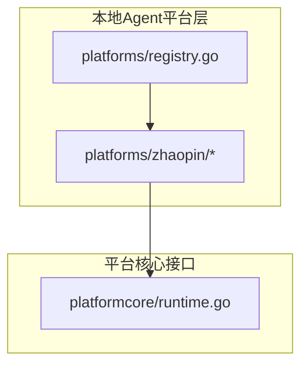
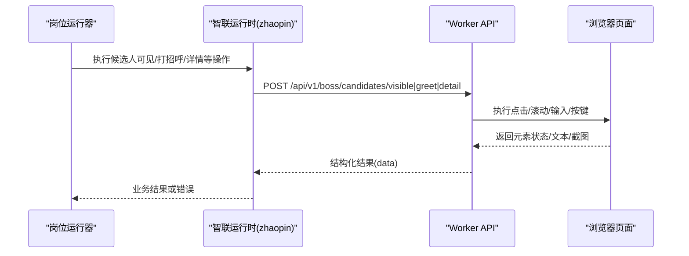
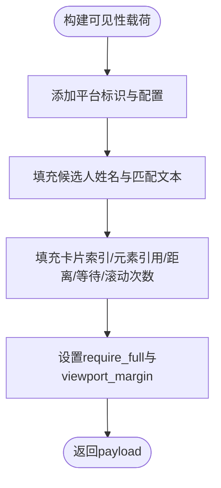
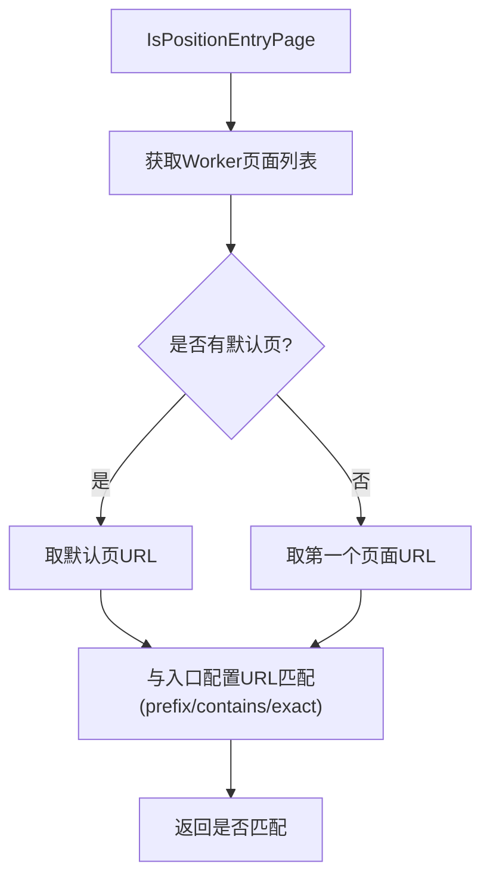
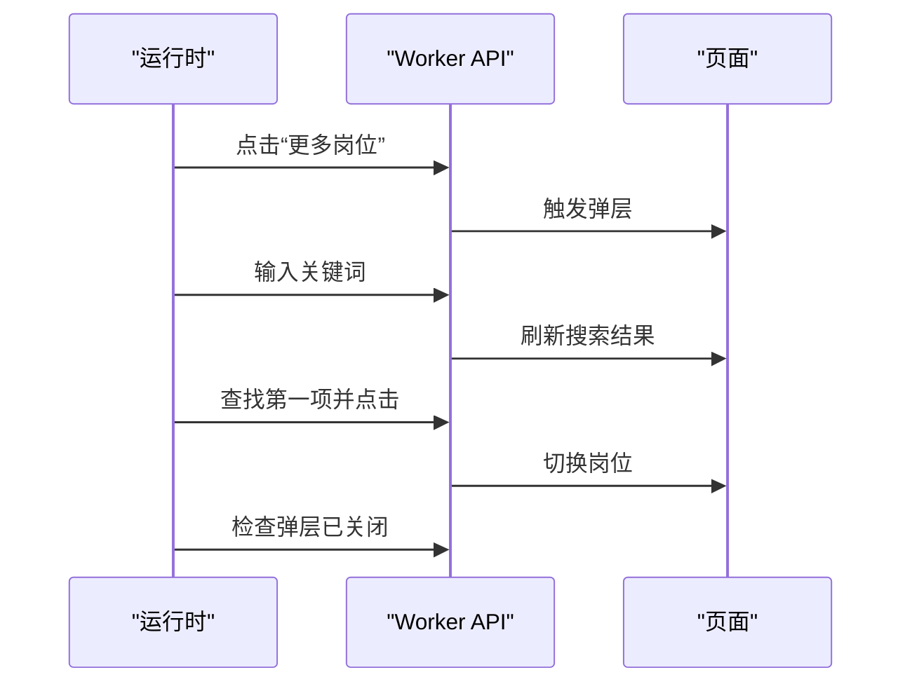
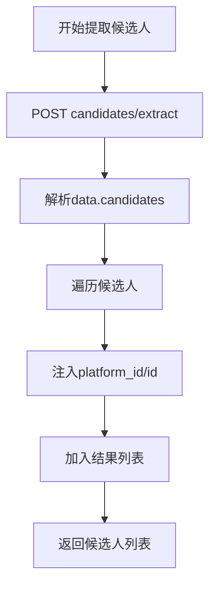
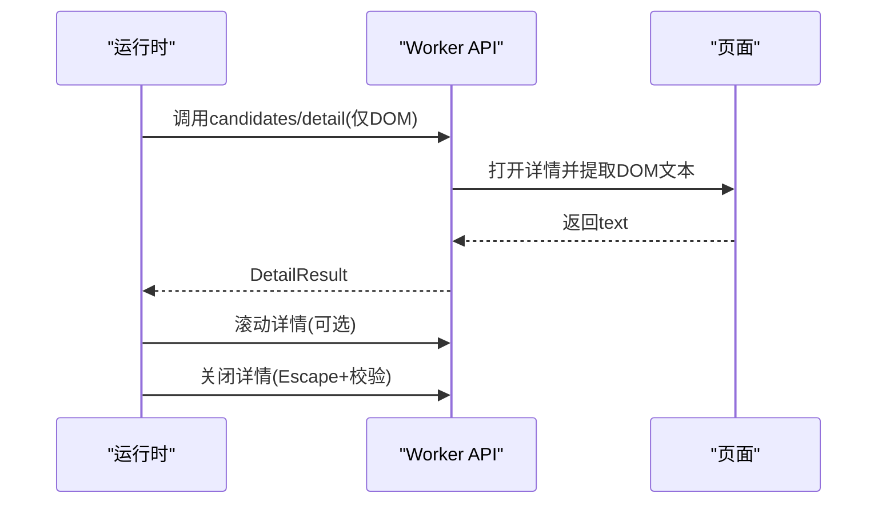
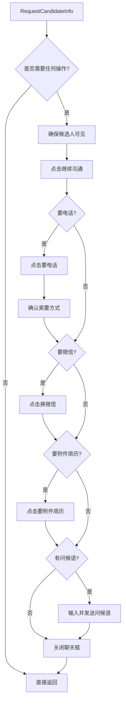
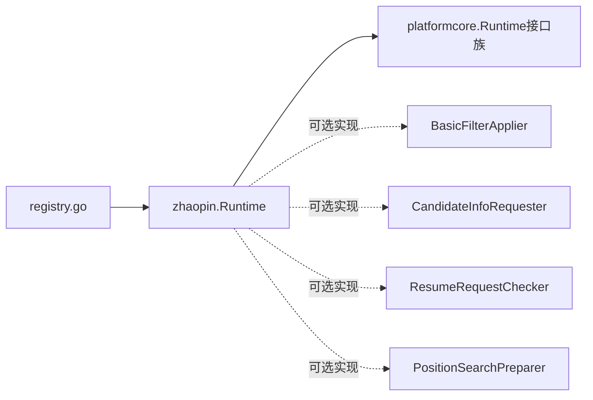

# 前程无忧适配器

<cite>
**本文引用的文件**   
- [runtime.go](file://goodhr5/local-agent-go/internal/platforms/zhaopin/runtime.go)
- [entry.go](file://goodhr5/local-agent-go/internal/platforms/zhaopin/entry.go)
- [navigation.go](file://goodhr5/local-agent-go/internal/platforms/zhaopin/navigation.go)
- [position.go](file://goodhr5/local-agent-go/internal/platforms/zhaopin/position.go)
- [candidate.go](file://goodhr5/local-agent-go/internal/platforms/zhaopin/candidate.go)
- [detail.go](file://goodhr5/local-agent-go/internal/platforms/zhaopin/detail.go)
- [greet.go](file://goodhr5/local-agent-go/internal/platforms/zhaopin/greet.go)
- [followup.go](file://goodhr5/local-agent-go/internal/platforms/zhaopin/followup.go)
- [helpers.go](file://goodhr5/local-agent-go/internal/platforms/zhaopin/helpers.go)
- [registry.go](file://goodhr5/local-agent-go/internal/platforms/registry.go)
- [0012_platform_locator_schema.sql](file://goodhr5/cloud/backend/db/migrations/0012_platform_locator_schema.sql)
- [runtime.go](file://goodhr5/local-agent-go/internal/platformcore/runtime.go)
</cite>

## 目录
1. [引言](#引言)
2. [项目结构](#项目结构)
3. [核心组件](#核心组件)
4. [架构总览](#架构总览)
5. [详细组件分析](#详细组件分析)
6. [依赖关系分析](#依赖关系分析)
7. [性能与并发特性](#性能与并发特性)
8. [反自动化检测与稳定性策略](#反自动化检测与稳定性策略)
9. [测试用例建议](#测试用例建议)
10. [监控指标定义](#监控指标定义)
11. [故障排查指南](#故障排查指南)
12. [结论](#结论)

## 引言
本文件面向“智联招聘”平台适配器的实现与使用，聚焦以下目标：
- 解释平台适配器的架构特点、页面渲染机制与数据交互模式。
- 说明职位搜索优化、候选人信息抓取、简历内容解析、智能回复生成、跟进管理流程。
- 描述页面导航控制、元素识别策略、并发处理机制与资源管理方案。
- 总结平台特有业务规则、反自动化检测应对与性能优化策略。
- 提供测试用例建议与监控指标定义，便于运维与持续集成。

需要特别说明的是：仓库中“zhaopin”对应“智联招聘”，并非“前程无忧”。本文严格基于代码库中的 zhaopin 实现进行文档化，避免将不同平台能力混淆。

## 项目结构
智联招聘适配器位于本地 Agent 的 platform 层，按职责拆分为多个文件：
- 运行时入口与通用参数构造：runtime.go
- 入口页打开与校验：entry.go
- 导航与定位工具：navigation.go
- 岗位选择与搜索：position.go
- 候选人列表提取与可见性保证：candidate.go
- 详情页 DOM 读取与关闭：detail.go
- 打招呼动作：greet.go
- 基础筛选与后续信息索要（电话/微信/附件简历）：followup.go
- 公共辅助函数：helpers.go
- 平台注册表：registry.go



**图表来源**
- [registry.go:15-34](file://goodhr5/local-agent-go/internal/platforms/registry.go#L15-L34)
- [runtime.go:85-102](file://goodhr5/local-agent-go/internal/platformcore/runtime.go#L85-L102)

**章节来源**
- [registry.go:1-35](file://goodhr5/local-agent-go/internal/platforms/registry.go#L1-L35)
- [runtime.go:1-69](file://goodhr5/local-agent-go/internal/platforms/zhaopin/runtime.go#L1-L69)

## 核心组件
- Runtime：智联招聘平台运行时对象，声明平台行为特征并提供候选人与详情相关通用参数。
- Entry：入口页打开、初始化与当前页匹配判断。
- Navigation：入口页配置解析、默认页选择、URL 匹配、岗位名称规范化与搜索关键词生成。
- Position：当前岗位名读取与通过弹层切换岗位。
- Candidate：候选人列表提取、滚动、可见性保证、指纹去重与筛选文本。
- Detail：DOM 模式详情读取、滚动与关闭。
- Greet：候选人打招呼。
- Followup：基础筛选占位、聊天框内索要电话/微信/附件简历与发送问候语。
- Helpers：Worker 响应解析、元素定位转换、日志格式化等通用工具。

**章节来源**
- [runtime.go:11-41](file://goodhr5/local-agent-go/internal/platforms/zhaopin/runtime.go#L11-L41)
- [entry.go:12-43](file://goodhr5/local-agent-go/internal/platforms/zhaopin/entry.go#L12-L43)
- [navigation.go:12-93](file://goodhr5/local-agent-go/internal/platforms/zhaopin/navigation.go#L12-L93)
- [position.go:11-102](file://goodhr5/local-agent-go/internal/platforms/zhaopin/position.go#L11-L102)
- [candidate.go:13-85](file://goodhr5/local-agent-go/internal/platforms/zhaopin/candidate.go#L13-L85)
- [detail.go:13-102](file://goodhr5/local-agent-go/internal/platforms/zhaopin/detail.go#L13-L102)
- [greet.go:11-22](file://goodhr5/local-agent-go/internal/platforms/zhaopin/greet.go#L11-L22)
- [followup.go:25-101](file://goodhr5/local-agent-go/internal/platforms/zhaopin/followup.go#L25-L101)
- [helpers.go:9-186](file://goodhr5/local-agent-go/internal/platforms/zhaopin/helpers.go#L9-L186)

## 架构总览
智联招聘适配器采用“平台运行时 + Worker API”的分层架构：
- Go 侧运行时负责编排业务流程、组装请求参数、调用 Worker HTTP API。
- Worker 侧负责浏览器操作、DOM 解析、截图与 OCR（如启用）。
- 平台配置由云端下发，包含入口页、卡片字段、动作按钮、详情页定位等。



**图表来源**
- [candidate.go:13-49](file://goodhr5/local-agent-go/internal/platforms/zhaopin/candidate.go#L13-L49)
- [greet.go:11-22](file://goodhr5/local-agent-go/internal/platforms/zhaopin/greet.go#L11-L22)
- [detail.go:13-39](file://goodhr5/local-agent-go/internal/platforms/zhaopin/detail.go#L13-L39)

## 详细组件分析

### 运行时与通用参数
- Runtime 声明 ShouldSelectPositionDirectly 为 true，表示智联每次直接切换到目标岗位，不依赖页面当前岗位。
- zhaopinCandidateVisiblePayload 统一封装候选人可见性所需的平台标识、配置、姓名、匹配文本、卡片索引、元素引用、距离、等待时间、滚动尝试次数、是否要求完整可视、视口边距等参数。
- candidateMatchText 优先使用 raw_text/filter_text/basic_info 作为动态重新定位时的匹配文本。
- candidateAge 从 fields 或直接字段中提取年龄，若缺失则用正则从文本中抽取“X岁”格式。
- normalizeCandidateIDPart 用于 ID 组成部分规范化，去除多余空白。



**图表来源**
- [runtime.go:24-41](file://goodhr5/local-agent-go/internal/platforms/zhaopin/runtime.go#L24-L41)

**章节来源**
- [runtime.go:11-69](file://goodhr5/local-agent-go/internal/platforms/zhaopin/runtime.go#L11-L69)

### 入口页与页面导航
- OpenEntryPage：校验入口 URL 非空后，调用 Worker 打开页面并记录日志。
- PrepareEntryPage：智联无额外入口初始化逻辑。
- IsPositionEntryPage：获取 Worker 当前页面列表，匹配云端配置的入口页 URL（支持 prefix/contains/exact 匹配）。
- platformEntryPage：优先从 auth.pages 取 entry=true 的页面，否则回退到 pages 首个有 URL 的项；若无 pages，则回退到 cfg.url。
- currentDefaultPage：优先 is_default=true 的页面，否则取第一个。
- pageMatchesEntry：对 URL 做 trim 与末尾斜杠清理后匹配。
- positionSearchQuery：移除岗位名称中的中英文括号说明，并截断“ _ ”后的内容，得到精简关键词。
- positionListItemElement：合并容器与项的定位配置，合并 parent_classes/target_classes。



**图表来源**
- [entry.go:27-43](file://goodhr5/local-agent-go/internal/platforms/zhaopin/entry.go#L27-L43)
- [navigation.go:12-71](file://goodhr5/local-agent-go/internal/platforms/zhaopin/navigation.go#L12-L71)

**章节来源**
- [entry.go:12-43](file://goodhr5/local-agent-go/internal/platforms/zhaopin/entry.go#L12-L43)
- [navigation.go:12-93](file://goodhr5/local-agent-go/internal/platforms/zhaopin/navigation.go#L12-L93)

### 岗位搜索与切换
- CurrentPositionName：通过平台配置中的“当前岗位选择器”提取文本，失败时记录警告并返回错误。
- SelectPosition：
  - 打开“更多岗位”弹层。
  - 输入精简关键词。
  - 查找第一条搜索结果，提取 element_ref 并点击。
  - 等待弹层关闭并校验。



**图表来源**
- [position.go:31-102](file://goodhr5/local-agent-go/internal/platforms/zhaopin/position.go#L31-L102)

**章节来源**
- [position.go:11-102](file://goodhr5/local-agent-go/internal/platforms/zhaopin/position.go#L11-L102)

### 候选人抓取与可见性
- ListVisibleCandidates：调用 Worker 提取候选人卡片，记录 find_elapsed_ms/convert_elapsed_ms/elapsed_ms 等耗时，并为每个候选人注入 platform_id 与 id（指纹）。
- ScrollCandidateList：滚动候选人列表。
- EnsureCandidateVisible：使用通用 payload 调用 visible 接口，确保候选人卡片进入视口。
- CandidateFilterText：返回 filter_text 或 raw_text 作为筛选依据。
- CandidateFingerprint：以 name+age 组合生成稳定 ID，前缀为平台标识。



**图表来源**
- [candidate.go:13-49](file://goodhr5/local-agent-go/internal/platforms/zhaopin/candidate.go#L13-L49)

**章节来源**
- [candidate.go:13-85](file://goodhr5/local-agent-go/internal/platforms/zhaopin/candidate.go#L13-L85)

### 详情页读取与关闭
- FetchCandidateDetail：仅支持 DOM 模式，构造可见性载荷并调用 detail 接口，返回 text 与 source="dom"。
- ScrollCandidateDetail：在最终 AI 分析期间滚动一次详情弹框。
- CloseCandidateDetail：先发送 Escape 键，再轮询确认弹窗关闭，必要时再次按下 Escape。
- CleanCandidateDetailText：简单 Trim。



**图表来源**
- [detail.go:13-96](file://goodhr5/local-agent-go/internal/platforms/zhaopin/detail.go#L13-L96)

**章节来源**
- [detail.go:13-102](file://goodhr5/local-agent-go/internal/platforms/zhaopin/detail.go#L13-L102)

### 打招呼与后续信息索要
- GreetCandidate：先 ensure visible，再调用 greet 接口。
- RequestCandidateInfo：
  - 校验是否需要索要电话/微信/附件简历或发送问候语。
  - 打开候选人聊天框，依次执行所需操作。
  - 使用 defer 确保聊天框被关闭。
  - 电话索要可能弹出确认框，需点击确认。
  - 微信与附件简历分别通过固定选择器或精确文本点击。
  - 最后可输入并发送首次问候语。



**图表来源**
- [followup.go:30-101](file://goodhr5/local-agent-go/internal/platforms/zhaopin/followup.go#L30-L101)

**章节来源**
- [greet.go:11-22](file://goodhr5/local-agent-go/internal/platforms/zhaopin/greet.go#L11-L22)
- [followup.go:25-168](file://goodhr5/local-agent-go/internal/platforms/zhaopin/followup.go#L25-L168)

### 平台配置与元素定位
- 云端平台配置中包含入口页、卡片字段、动作按钮、详情页定位、行为开关等。
- helpers.platformSection/elementPayload 将云端配置转换为 Worker 统一的元素协议，支持 target_classes/parent_classes/find_attempts/find_interval_ms 等。
- navigation.positionListItemElement 合并容器与项的定位，增强鲁棒性。

```mermaid
classDiagram
class PlatformConfig {
+string id
+string name
+string domain
+pages[]
+card{}
+actions{}
+detail{}
+extras[]
+behavior{}
}
class ElementLocator {
+target_classes[]
+parent_classes[]
+find_attempts
+find_interval_ms
}
PlatformConfig --> ElementLocator : "card.actions.detail.extras"
```

**图表来源**
- [0012_platform_locator_schema.sql:48-88](file://goodhr5/cloud/backend/db/migrations/0012_platform_locator_schema.sql#L48-L88)
- [helpers.go:112-160](file://goodhr5/local-agent-go/internal/platforms/zhaopin/helpers.go#L112-L160)
- [navigation.go:95-122](file://goodhr5/local-agent-go/internal/platforms/zhaopin/navigation.go#L95-L122)

**章节来源**
- [0012_platform_locator_schema.sql:48-88](file://goodhr5/cloud/backend/db/migrations/0012_platform_locator_schema.sql#L48-L88)
- [helpers.go:112-186](file://goodhr5/local-agent-go/internal/platforms/zhaopin/helpers.go#L112-L186)
- [navigation.go:95-122](file://goodhr5/local-agent-go/internal/platforms/zhaopin/navigation.go#L95-L122)

## 依赖关系分析
- 平台运行时通过 registry 注册并按 platform_id 分发。
- zhaopin.Runtime 实现了 platformcore 定义的若干可选扩展接口，例如 BasicFilterApplier、CandidateInfoRequester、ResumeRequestChecker、PositionSearchPreparer 等。
- 智联适配器主要实现 CandidateInfoRequester 的能力（RequestCandidateInfo），其他可选能力为空实现或未实现。



**图表来源**
- [registry.go:15-34](file://goodhr5/local-agent-go/internal/platforms/registry.go#L15-L34)
- [runtime.go:85-102](file://goodhr5/local-agent-go/internal/platformcore/runtime.go#L85-L102)
- [followup.go:25-28](file://goodhr5/local-agent-go/internal/platforms/zhaopin/followup.go#L25-L28)

**章节来源**
- [registry.go:1-35](file://goodhr5/local-agent-go/internal/platforms/registry.go#L1-L35)
- [runtime.go:85-102](file://goodhr5/local-agent-go/internal/platformcore/runtime.go#L85-L102)
- [followup.go:25-28](file://goodhr5/local-agent-go/internal/platforms/zhaopin/followup.go#L25-L28)

## 性能与并发特性
- 候选人提取阶段记录 find_elapsed_ms、convert_elapsed_ms、elapsed_ms，便于定位 Worker 侧 DOM 查找与数据转换瓶颈。
- 详情页读取限制为 DOM 模式，避免 OCR/AI 带来的额外开销。
- 滚动与等待时间较短（如 0.15s、0.2s、0.25s），减少整体流程耗时。
- 岗位搜索限定最多读取 20 条结果，降低 DOM 扫描成本。
- 关闭详情页采用快速重试与短延迟，避免长时间阻塞。

[本节为通用性能讨论，不直接分析具体文件]

## 反自动化检测与稳定性策略
- 小步滚动与合理等待：EnsureCandidateVisible 与 ScrollCandidateDetail 使用较小距离与短暂等待，模拟人类浏览节奏。
- 键盘事件与精确点击：关闭详情页使用 Escape 键，聊天框内操作使用 selector 或精确文本点击，降低被检测概率。
- 元素定位容错：elementPayload 兼容多种字段命名（targetClasses/target_classes、parentClasses/parent_classes），提升跨版本稳定性。
- 弹层状态校验：岗位切换与详情页关闭均进行二次校验，确保 UI 状态一致。
- 日志与诊断：关键步骤输出 info/warning，便于问题回溯。

**章节来源**
- [candidate.go:62-69](file://goodhr5/local-agent-go/internal/platforms/zhaopin/candidate.go#L62-L69)
- [detail.go:57-96](file://goodhr5/local-agent-go/internal/platforms/zhaopin/detail.go#L57-L96)
- [helpers.go:132-160](file://goodhr5/local-agent-go/internal/platforms/zhaopin/helpers.go#L132-L160)
- [position.go:80-101](file://goodhr5/local-agent-go/internal/platforms/zhaopin/position.go#L80-L101)

## 测试用例建议
- 入口页打开与匹配
  - 验证 OpenEntryPage 能正确调用 Worker 打开页面。
  - 验证 IsPositionEntryPage 在不同 URL 匹配模式下返回正确结果。
- 岗位搜索与切换
  - 验证 SelectPosition 能打开弹层、输入关键词、点击第一条结果并关闭弹层。
  - 验证当无搜索结果或 element_ref 缺失时返回明确错误。
- 候选人抓取
  - 验证 ListVisibleCandidates 返回有效候选人列表，且每个候选人包含 platform_id 与 id。
  - 验证 ScrollCandidateList 与 EnsureCandidateVisible 能成功滚动与定位。
- 详情页
  - 验证 FetchCandidateDetail 仅接受 DOM 模式并返回非空 text。
  - 验证 CloseCandidateDetail 能在多次尝试后关闭弹窗。
- 打招呼与后续信息
  - 验证 GreetCandidate 能成功点击“继续沟通”。
  - 验证 RequestCandidateInfo 能按需执行电话/微信/附件简历与发送问候语，并在结束时关闭聊天框。
- 配置与定位
  - 验证 platformEntryPage/currentDefaultPage/pageMatchesEntry 的行为符合预期。
  - 验证 elementPayload 能正确转换云端配置为 Worker 协议。

[本节为测试建议，不直接分析具体文件]

## 监控指标定义
- 候选人提取
  - found_count：Worker 找到的候选人数量。
  - candidates：实际返回的候选人数量。
  - find_elapsed_ms：DOM 查找耗时。
  - convert_elapsed_ms：数据转换耗时。
  - elapsed_ms：总耗时。
- 岗位搜索
  - query：搜索关键词。
  - result_count：搜索结果数量。
  - first_result_name：第一条结果名称。
- 详情页
  - mode：详情模式（仅 DOM）。
  - has_detail_text：是否读取到详情文本。
  - close_attempts：关闭尝试次数。
- 打招呼与后续信息
  - greet_success：是否成功点击继续沟通。
  - request_phone/wechat/resume：是否执行相应操作。
  - chat_closed：聊天框是否成功关闭。

[本节为监控指标定义，不直接分析具体文件]

## 故障排查指南
- 入口页未打开或页面不匹配
  - 检查云端平台配置是否包含入口页 URL 与 pages。
  - 核对 pageMatchesEntry 的匹配模式（prefix/contains/exact）。
- 岗位搜索无结果
  - 检查 positionSearchQuery 生成的关键词是否正确。
  - 查看 Worker 返回 items 是否为空。
- 候选人不可见或定位失败
  - 检查 EnsureCandidateVisible 的 payload 是否包含 card_index/element_ref/distance/wait_ms。
  - 查看 Worker 返回的 debug_stage 与错误信息。
- 详情页无法关闭
  - 检查 Escape 键发送与 .new-resume-detail--inner/.resume-detail 是否存在。
  - 关注二次关闭逻辑与延时。
- 聊天框未关闭
  - 检查 closeZhaopinChatDialog 是否成功点击关闭按钮。
  - 注意 RequestCandidateInfo 的 defer 清理逻辑。

**章节来源**
- [entry.go:27-43](file://goodhr5/local-agent-go/internal/platforms/zhaopin/entry.go#L27-L43)
- [position.go:31-102](file://goodhr5/local-agent-go/internal/platforms/zhaopin/position.go#L31-L102)
- [candidate.go:62-69](file://goodhr5/local-agent-go/internal/platforms/zhaopin/candidate.go#L62-L69)
- [detail.go:57-96](file://goodhr5/local-agent-go/internal/platforms/zhaopin/detail.go#L57-L96)
- [followup.go:158-167](file://goodhr5/local-agent-go/internal/platforms/zhaopin/followup.go#L158-L167)

## 结论
智联招聘适配器通过清晰的运行时分层与 Worker API 协作，实现了岗位搜索优化、候选人抓取、DOM 详情解析、打招呼与后续信息索要等核心能力。其设计强调：
- 配置驱动的元素定位与页面导航。
- 稳定的可见性与弹层状态校验。
- 轻量化的交互与较短的等待时间，兼顾效率与稳定性。
- 完善的日志与错误提示，便于问题定位。

建议在后续迭代中：
- 补充 ResumeRequestChecker 与 PositionSearchPreparer 的可选实现，以覆盖更多收尾与搜索准备场景。
- 引入更细粒度的监控指标与告警规则，结合前端控制台展示关键步骤耗时与成功率。
- 持续优化元素定位策略，提升跨版本兼容性。

[本节为总结性内容，不直接分析具体文件]