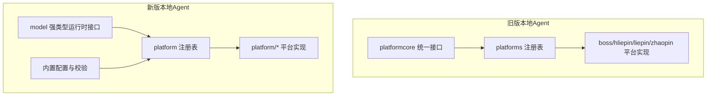
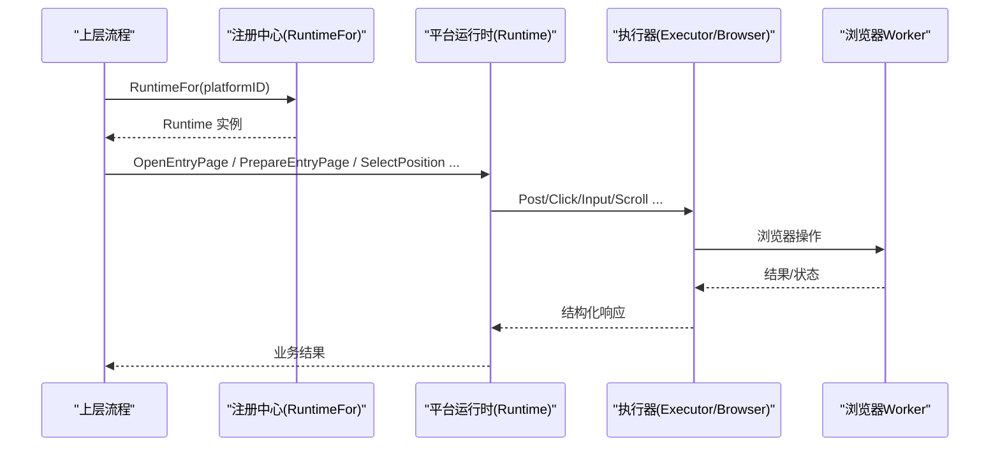
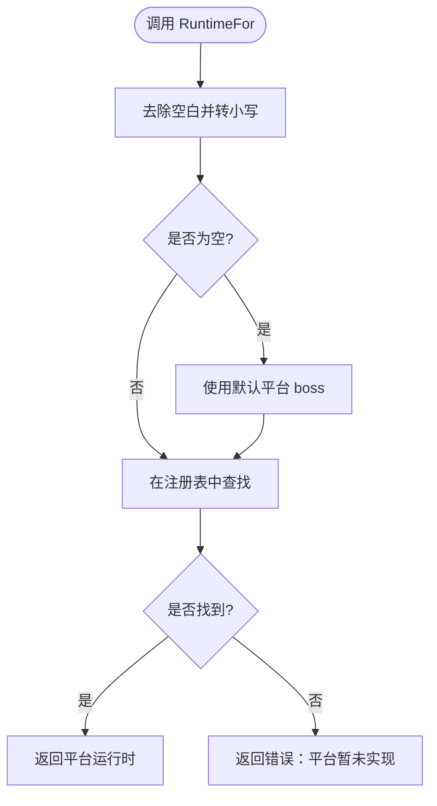
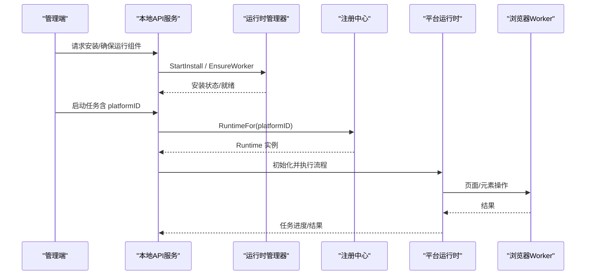
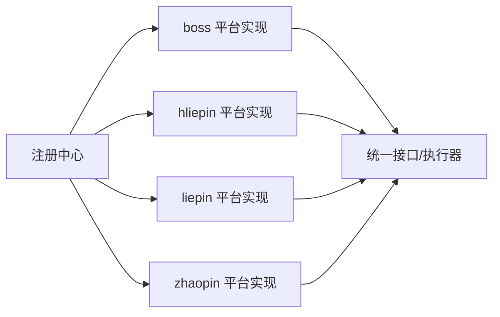
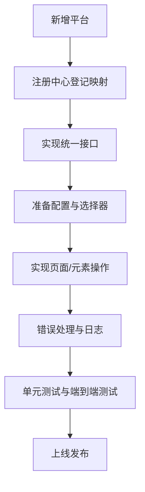

# 平台注册中心

<cite>
**本文引用的文件**
- [runtime.go](file://goodhr5/local-agent-go/internal/platformcore/runtime.go)
- [registry.go](file://goodhr5/local-agent-go/internal/platforms/registry.go)
- [registry_test.go](file://goodhr5/local-agent-go/internal/platforms/registry_test.go)
- [entry.go](file://goodhr5/local-agent-go/internal/platforms/boss/entry.go)
- [runtime.go](file://goodhr5/local-agent-go/internal/platforms/boss/runtime.go)
- [runtime.go](file://goodhr5/local-agent-go-new/internal/platform/model/runtime.go)
- [registry.go](file://goodhr5/local-agent-go-new/internal/platform/registry.go)
- [config.go](file://goodhr5/local-agent-go-new/internal/platform/config.go)
- [server.go](file://goodhr5/local-agent-go-new/internal/api/server.go)
- [installer_test.go](file://goodhr5/local-agent-go-new/internal/runtime/installer_test.go)
- [page.tsx](file://goodhr5/cloud/frontend-next/app/admin/accounts/page.tsx)
- [platform_account.go](file://goodhr5/cloud/backend/internal/httpapi/platform_account.go)
- [platform_account_store_pg.go](file://goodhr5/cloud/backend/internal/httpapi/platform_account_store_pg.go)
- [platform-open.ts](file://goodhr5/cloud/frontend-next/lib/platform-open.ts)
</cite>

## 目录
1. [简介](#简介)
2. [项目结构](#项目结构)
3. [核心组件](#核心组件)
4. [架构总览](#架构总览)
5. [详细组件分析](#详细组件分析)
6. [依赖关系分析](#依赖关系分析)
7. [性能与稳定性](#性能与稳定性)
8. [故障排查指南](#故障排查指南)
9. [结论](#结论)
10. [附录：新平台扩展开发指南](#附录新平台扩展开发指南)

## 简介
本文件面向“平台注册中心”的运行时机制，系统性说明本地 Agent 如何按平台 ID 动态加载对应招聘平台的运行时实现、统一接口规范、生命周期管理、配置传递与错误处理。文档同时覆盖新旧两套本地 Agent 代码路径中的注册中心设计差异，并给出新增平台接入流程、兼容性检查与初始化步骤，帮助开发者快速扩展新的招聘平台支持。

## 项目结构
本项目包含两个本地 Agent 实现：
- 旧版 local-agent-go：通过包级注册表集中维护平台运行时映射，使用 platformcore 定义统一执行器与运行时接口。
- 新版 local-agent-go-new：采用更严格的强类型模型 model.Runtime，并通过内置配置与校验保障平台能力一致性。

图表来源
- [runtime.go:1-111](file://goodhr5/local-agent-go/internal/platformcore/runtime.go#L1-L111)
- [registry.go:1-35](file://goodhr5/local-agent-go/internal/platforms/registry.go#L1-L35)
- [runtime.go:1-153](file://goodhr5/local-agent-go-new/internal/platform/model/runtime.go#L1-L153)
- [registry.go:1-30](file://goodhr5/local-agent-go-new/internal/platform/registry.go#L1-L30)
- [config.go:1-57](file://goodhr5/local-agent-go-new/internal/platform/config.go#L1-L57)

章节来源
- [runtime.go:1-111](file://goodhr5/local-agent-go/internal/platformcore/runtime.go#L1-L111)
- [registry.go:1-35](file://goodhr5/local-agent-go/internal/platforms/registry.go#L1-L35)
- [runtime.go:1-153](file://goodhr5/local-agent-go-new/internal/platform/model/runtime.go#L1-L153)
- [registry.go:1-30](file://goodhr5/local-agent-go-new/internal/platform/registry.go#L1-L30)
- [config.go:1-57](file://goodhr5/local-agent-go-new/internal/platform/config.go#L1-L57)

## 核心组件
- 统一执行器与运行时接口（旧版）
  - Executor：封装对浏览器 Worker 的 Post、Log、Delay 调用，屏蔽底层 HTTP/CDP 细节。
  - Runtime：定义平台必须实现的页面打开、岗位切换、候选人列表、详情读取、打招呼等能力。
  - 可选能力：基础筛选、打招呼后索要信息、搜索准备、直接岗位选择、跳过岗位选择、详情滚动等。
- 强类型运行时模型（新版）
  - Browser：平台适配层可调用的 Worker 封装能力，包括页面打开、元素查找、点击、输入、滚动、键盘等。
  - Config：平台页面 URL、选择器、行为参数、动作序列等配置。
  - Runtime：强制实现页面、岗位、候选人、详情、动作、自动回复等完整能力集。
- 注册中心
  - 旧版：map[string]Runtime 集中注册，提供 RuntimeFor(platformID) 返回具体实现。
  - 新版：switch 分支返回各平台 NewRuntime()，同样提供 RuntimeFor(platformID)。

章节来源
- [runtime.go:10-111](file://goodhr5/local-agent-go/internal/platformcore/runtime.go#L10-L111)
- [runtime.go:18-153](file://goodhr5/local-agent-go-new/internal/platform/model/runtime.go#L18-L153)
- [registry.go:15-34](file://goodhr5/local-agent-go/internal/platforms/registry.go#L15-L34)
- [registry.go:15-29](file://goodhr5/local-agent-go-new/internal/platform/registry.go#L15-L29)

## 架构总览
平台运行时的整体调用链如下：上层流程根据任务或用户操作传入 platformID，调用注册中心的 RuntimeFor 获取具体平台运行时；随后通过统一接口完成页面导航、候选人操作、详情提取与消息交互。

图表来源
- [registry.go:22-34](file://goodhr5/local-agent-go/internal/platforms/registry.go#L22-L34)
- [runtime.go:46-111](file://goodhr5/local-agent-go/internal/platformcore/runtime.go#L46-L111)
- [runtime.go:18-153](file://goodhr5/local-agent-go-new/internal/platform/model/runtime.go#L18-L153)

## 详细组件分析

### 平台运行时统一接口（旧版）
- 执行器 Executor
  - Post：向 Worker 发送请求并返回通用 map 响应。
  - Log：写入岗位运行日志。
  - Delay：按业务动作等待指定秒数。
- 运行时 Runtime
  - 入口页：OpenEntryPage、PrepareEntryPage、IsPositionEntryPage。
  - 岗位：CurrentPositionName、SelectPosition。
  - 候选人：ListVisibleCandidates、ScrollCandidateList、FetchCandidateDetail、CloseCandidateDetail。
  - 交互：GreetCandidate、CandidateFilterText、CandidateFingerprint、CleanCandidateDetailText。
- 可选能力
  - BasicFilterApplier：应用基础筛选。
  - CandidateInfoRequester：打招呼后索要信息。
  - PositionSearchPreparer：首次确认岗位前的搜索准备。
  - DirectPositionSelector / PositionSelectionSkipper：控制岗位选择策略。
  - DetailAnalysisScroller：AI 分析期间滚动详情。

章节来源
- [runtime.go:10-111](file://goodhr5/local-agent-go/internal/platformcore/runtime.go#L10-L111)

### 平台运行时统一接口（新版）
- Browser 封装
  - 页面：OpenPage、ListPages、UsePage、ClosePage。
  - 元素：FindAll、Read、Click、Input、PressKey。
  - 滚动：Scroll。
- 配置 Config
  - 平台标识、名称、登录/入口/消息页 URL。
  - 选择器、候选字段、对话字段、动作序列、行为开关、滚动距离、最大条目数。
- 运行时 Runtime
  - 页面：OpenLoginPage、InitializeLoginPage、OpenGreetingPage、InitializeGreetingPage、OpenMessagesPage、InitializeMessagesPage。
  - 岗位：SelectPosition、ApplyBasicFilters。
  - 候选人：FindCandidates、ScrollToCandidate、AdvanceCandidateList。
  - 详情：OpenCandidateDetail、ExtractCandidateDetail、CleanCandidateDetailText、CloseCandidateDetail。
  - 动作：GreetCandidate、EnsureCandidateConversation、RequestCandidateInfo、SendCandidateMessage、CloseCandidateConversation、FavoriteCandidate、RejectCandidate。
  - 自动回复：ScanUnreadConversations、ReadConversation、ReplyConversation。

章节来源
- [runtime.go:18-153](file://goodhr5/local-agent-go-new/internal/platform/model/runtime.go#L18-L153)

### 平台 ID 映射与默认值
- 旧版注册中心
  - 将 platformID 去空白并小写化。
  - 空字符串时回退到默认平台 boss。
  - 未找到映射时返回错误，提示平台暂未实现本地运行时。
- 新版注册中心
  - 同样进行去空白与小写化处理。
  - 通过 switch 分支返回对应平台 NewRuntime()。
  - 未匹配时返回错误，提示平台暂未实现。

图表来源
- [registry.go:22-34](file://goodhr5/local-agent-go/internal/platforms/registry.go#L22-L34)
- [registry.go:15-29](file://goodhr5/local-agent-go-new/internal/platform/registry.go#L15-L29)

章节来源
- [registry.go:22-34](file://goodhr5/local-agent-go/internal/platforms/registry.go#L22-L34)
- [registry.go:15-29](file://goodhr5/local-agent-go-new/internal/platform/registry.go#L15-L29)

### 平台运行时初始化与配置传递
- 旧版
  - 平台实现通过 cloudapi.PlatformConfig 接收云端下发的平台配置，如入口 URL、选择器等。
  - 示例：Boss 平台在打开入口页前校验 entryURL 非空，并通过执行器调用 Worker 打开页面。
- 新版
  - 平台配置以内置 JSON 形式嵌入程序，LoadConfig 按 platformID 加载对应配置。
  - ValidateTaskConfig 针对自动回复任务校验必要选择器与 URL 是否齐全。
  - 运行时方法通过 Browser 与 Config 协作完成页面与元素操作。

章节来源
- [entry.go:12-21](file://goodhr5/local-agent-go/internal/platforms/boss/entry.go#L12-L21)
- [config.go:25-57](file://goodhr5/local-agent-go-new/internal/platform/config.go#L25-L57)

### 平台运行时生命周期管理
- 启动阶段
  - 确保运行组件就绪：安装/校验 Worker 及资源，必要时触发异步安装。
  - 启动电源保护与后台监控，防止系统休眠影响自动化流程。
- 运行阶段
  - 按平台 Runtime 接口顺序执行：打开页面→准备页面→选择岗位→扫描候选人→打开详情→提取内容→执行动作→关闭会话。
- 结束阶段
  - 保存任务状态、释放资源、记录日志与通知。

图表来源
- [server.go:247-278](file://goodhr5/local-agent-go-new/internal/api/server.go#L247-L278)
- [registry.go:22-34](file://goodhr5/local-agent-go/internal/platforms/registry.go#L22-L34)
- [runtime.go:46-153](file://goodhr5/local-agent-go/internal/platformcore/runtime.go#L46-L153)

章节来源
- [server.go:247-278](file://goodhr5/local-agent-go-new/internal/api/server.go#L247-L278)

### 错误处理机制
- 平台未实现
  - 注册中心返回错误，提示平台暂未实现本地运行时或未实现。
- 配置缺失
  - 平台实现中校验必要配置项（如入口 URL），缺失时报错。
- 任务启动失败
  - 云端启动检查未通过时，记录错误码与摘要，终止任务。
- 连续操作错误
  - 按操作维度归一化错误指纹，统计连续失败次数，便于重试与降级策略。

章节来源
- [registry.go:22-34](file://goodhr5/local-agent-go/internal/platforms/registry.go#L22-L34)
- [entry.go:12-21](file://goodhr5/local-agent-go/internal/platforms/boss/entry.go#L12-L21)
- [error_policy.go:48-85](file://goodhr5/local-agent-go/internal/positionrunner/error_policy.go#L48-L85)

### 平台账号映射与前端交互
- 后端 API
  - 创建平台账号映射：绑定平台 ID、显示名与本地资料目录 ID。
  - 删除平台账号映射：按用户与账号 ID 删除。
- 前端界面
  - 创建账号后打开本地浏览器并完成登录确认。
  - 使用账号 ID 作为本地浏览器资料目录打开平台入口页。
- 平台开放控制
  - 前端判断平台是否开放需显式 open: true。

章节来源
- [platform_account.go:91-134](file://goodhr5/cloud/backend/internal/httpapi/platform_account.go#L91-L134)
- [platform_account_store_pg.go:70-129](file://goodhr5/cloud/backend/internal/httpapi/platform_account_store_pg.go#L70-L129)
- [page.tsx:51-80](file://goodhr5/cloud/frontend-next/app/admin/accounts/page.tsx#L51-L80)
- [platform-open.ts:46-53](file://goodhr5/cloud/frontend-next/lib/platform-open.ts#L46-L53)

## 依赖关系分析
- 模块耦合
  - 注册中心仅依赖平台实现包，不感知具体平台逻辑，保持低耦合。
  - 平台实现依赖统一接口与执行器，屏蔽底层 Worker 差异。
- 外部依赖
  - 云端配置与账号映射由后端 API 提供。
  - 前端通过管理界面驱动本地 Agent 的安装、启动与账号管理。
- 潜在循环依赖
  - 注册中心与平台实现为单向依赖，无循环引用。

图表来源
- [registry.go:15-34](file://goodhr5/local-agent-go/internal/platforms/registry.go#L15-L34)
- [runtime.go:10-111](file://goodhr5/local-agent-go/internal/platformcore/runtime.go#L10-L111)

章节来源
- [registry.go:15-34](file://goodhr5/local-agent-go/internal/platforms/registry.go#L15-L34)
- [runtime.go:10-111](file://goodhr5/local-agent-go/internal/platformcore/runtime.go#L10-L111)

## 性能与稳定性
- 注册中心查找为 O(1)，适合高频调用。
- 平台实现通过执行器批量操作与合理延迟，降低频繁 UI 交互开销。
- 错误归一化与连续错误计数有助于避免抖动与误判。
- 运行组件安装与校验保证 Worker 环境稳定，减少运行时异常。

[本节为通用指导，无需特定文件引用]

## 故障排查指南
- 平台未实现
  - 现象：RuntimeFor 返回“平台暂未实现”。
  - 处理：确认 platformID 是否正确，或在注册中心添加新平台映射。
- 配置缺失
  - 现象：打开入口页报错“缺少入口页面地址”。
  - 处理：检查云端平台配置或内置配置是否完整。
- 任务启动失败
  - 现象：云端启动检查未通过，任务标记失败。
  - 处理：查看错误码与摘要，调整权限或资源限制。
- 连续操作错误
  - 现象：同一操作多次失败。
  - 处理：检查页面结构变化、选择器失效或网络超时，必要时增加重试与降级。

章节来源
- [registry.go:22-34](file://goodhr5/local-agent-go/internal/platforms/registry.go#L22-L34)
- [entry.go:12-21](file://goodhr5/local-agent-go/internal/platforms/boss/entry.go#L12-L21)
- [error_policy.go:48-85](file://goodhr5/local-agent-go/internal/positionrunner/error_policy.go#L48-L85)

## 结论
平台注册中心通过统一的运行时接口与集中的 ID 映射，实现了多招聘平台的动态加载与标准化执行。旧版侧重灵活性与执行器抽象，新版强调强类型与内置配置校验，两者均提供了清晰的扩展点与完善的错误处理。结合云端账号映射与前端管理界面，形成了从配置到执行的闭环体系。

[本节为总结性内容，无需特定文件引用]

## 附录：新平台扩展开发指南
- 目标
  - 为新招聘平台添加本地运行时支持，使其可通过 platformID 被注册中心发现与调用。
- 步骤
  1. 确定平台 ID 与名称，并在注册中心登记映射。
     - 旧版：在 map 中添加键值对，指向 NewRuntime()。
     - 新版：在 switch 分支中添加 case，返回 NewRuntime()。
  2. 实现统一接口
     - 旧版：实现 platformcore.Runtime 及其可选能力。
     - 新版：实现 model.Runtime 的全部方法，确保页面、岗位、候选人、详情、动作、自动回复能力完整。
  3. 配置与选择器
     - 旧版：通过 cloudapi.PlatformConfig 接收云端配置。
     - 新版：在平台目录下添加 config.json，并使用 LoadConfig 与 ValidateTaskConfig 进行加载与校验。
  4. 页面与元素操作
     - 通过执行器或 Browser 封装调用 Worker，完成页面打开、元素查找、点击、输入、滚动等操作。
  5. 错误处理与日志
     - 对关键步骤进行错误捕获与日志记录，必要时实现连续错误跟踪与重试策略。
  6. 测试验证
     - 编写单元测试验证 RuntimeFor 返回正确类型与行为。
     - 使用管理界面创建账号并打开浏览器完成登录确认，端到端验证流程。

图表来源
- [registry.go:15-34](file://goodhr5/local-agent-go/internal/platforms/registry.go#L15-L34)
- [registry.go:15-29](file://goodhr5/local-agent-go-new/internal/platform/registry.go#L15-L29)
- [config.go:25-57](file://goodhr5/local-agent-go-new/internal/platform/config.go#L25-L57)
- [runtime.go:46-153](file://goodhr5/local-agent-go/internal/platformcore/runtime.go#L46-L153)
- [runtime.go:18-153](file://goodhr5/local-agent-go-new/internal/platform/model/runtime.go#L18-L153)

章节来源
- [registry.go:15-34](file://goodhr5/local-agent-go/internal/platforms/registry.go#L15-L34)
- [registry.go:15-29](file://goodhr5/local-agent-go-new/internal/platform/registry.go#L15-L29)
- [config.go:25-57](file://goodhr5/local-agent-go-new/internal/platform/config.go#L25-L57)
- [runtime.go:46-153](file://goodhr5/local-agent-go/internal/platformcore/runtime.go#L46-L153)
- [runtime.go:18-153](file://goodhr5/local-agent-go-new/internal/platform/model/runtime.go#L18-L153)