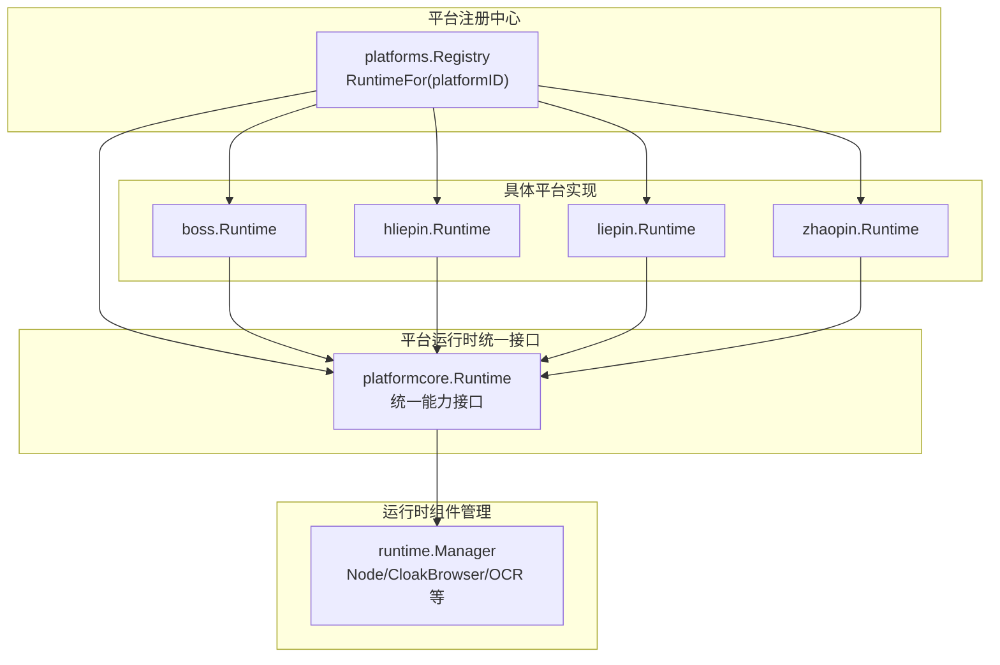
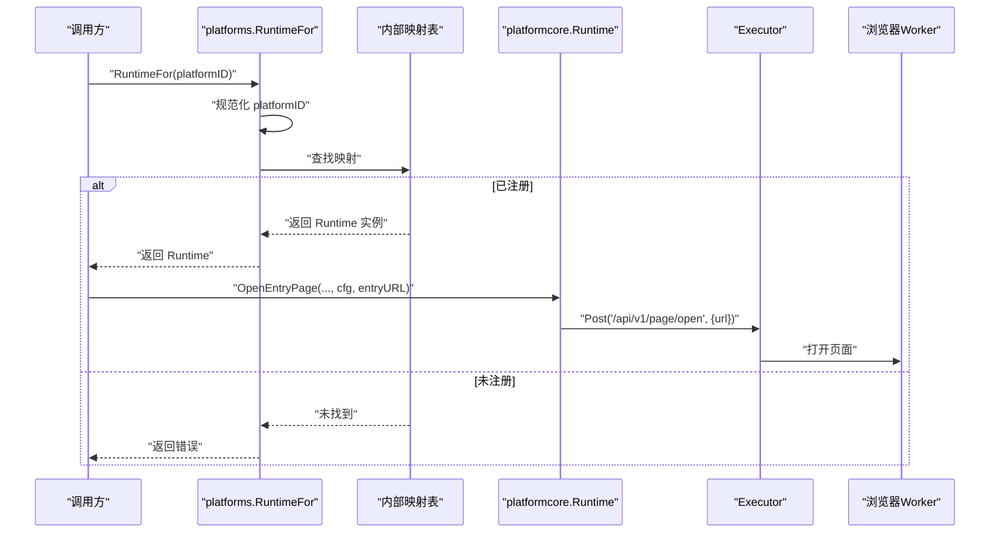
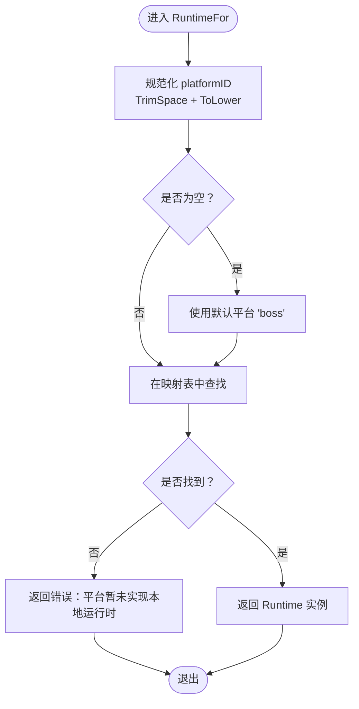
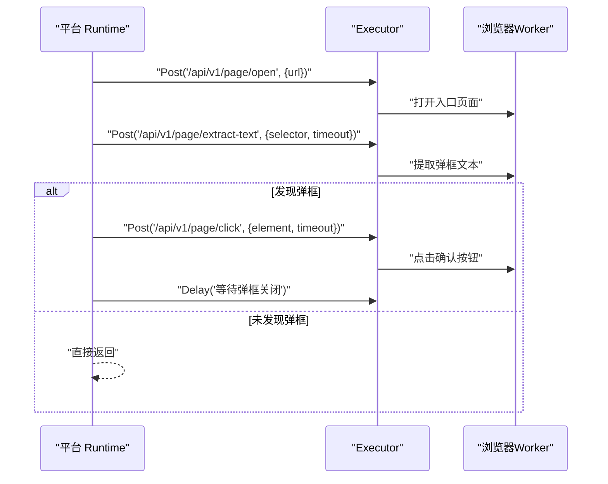
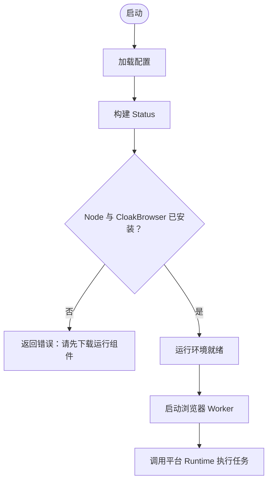
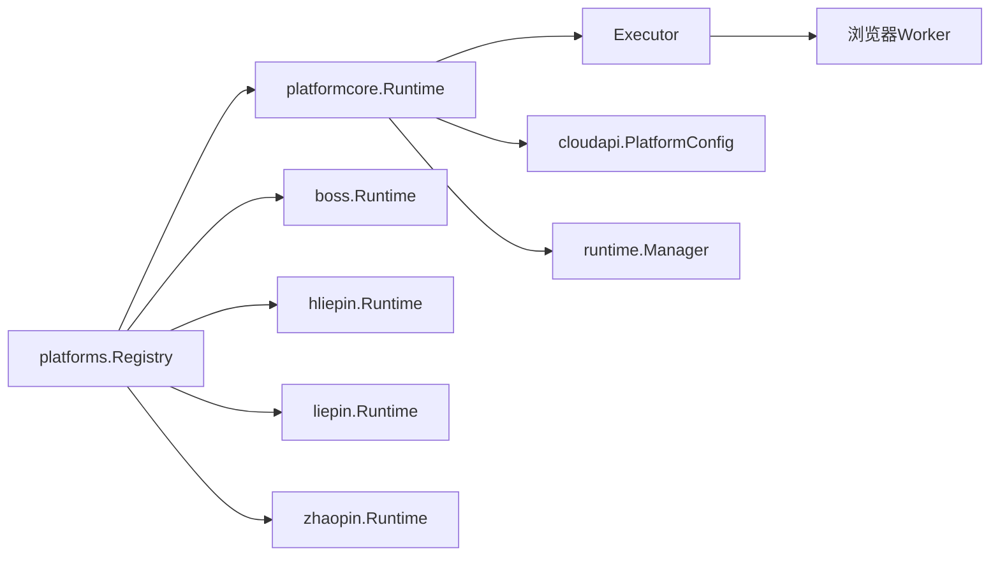

# 平台注册中心

<cite>
**本文引用的文件**   
- [registry.go](file://goodhr5/local-agent-go/internal/platforms/registry.go)
- [runtime.go](file://goodhr5/local-agent-go/internal/platformcore/runtime.go)
- [boss_entry.go](file://goodhr5/local-agent-go/internal/platforms/boss/entry.go)
- [boss_runtime.go](file://goodhr5/local-agent-go/internal/platforms/boss/runtime.go)
- [hliepin_entry.go](file://goodhr5/local-agent-go/internal/platforms/hliepin/entry.go)
- [hliepin_runtime.go](file://goodhr5/local-agent-go/internal/platforms/hliepin/runtime.go)
- [registry_test.go](file://goodhr5/local-agent-go/internal/platforms/registry_test.go)
- [manager.go](file://goodhr5/local-agent-go/internal/runtime/manager.go)
</cite>

## 目录
1. [引言](#引言)
2. [项目结构](#项目结构)
3. [核心组件](#核心组件)
4. [架构总览](#架构总览)
5. [详细组件分析](#详细组件分析)
6. [依赖关系分析](#依赖关系分析)
7. [性能与稳定性考虑](#性能与稳定性考虑)
8. [故障排查指南](#故障排查指南)
9. [结论](#结论)
10. [附录：新平台接入指南](#附录新平台接入指南)

## 引言
本文件聚焦“平台注册中心”，围绕本地招聘代理中的平台运行时注册机制、动态加载原理与平台 ID 映射策略展开。重点解释 RuntimeFor 函数的实现逻辑、默认平台处理、错误处理机制，并说明平台运行时的统一接口规范、生命周期管理、配置传递机制。同时给出新平台注册流程、兼容性检查建议与运行时初始化过程，帮助开发者快速扩展新的招聘平台支持。

## 项目结构
平台注册中心位于 local-agent-go 的 internal/platforms 包中，负责按平台 ID 分发到具体平台的运行时实现；平台运行时统一能力由 platformcore 定义；各平台（如 boss、hliepin、liepin、zhaopin）各自提供 Runtime 实现；运行时组件的生命周期与安装状态由 runtime.Manager 管理。

图表来源
- [registry.go:15-34](file://goodhr5/local-agent-go/internal/platforms/registry.go#L15-L34)
- [runtime.go:54-127](file://goodhr5/local-agent-go/internal/platformcore/runtime.go#L54-L127)
- [manager.go:34-90](file://goodhr5/local-agent-go/internal/runtime/manager.go#L34-L90)

章节来源
- [registry.go:1-35](file://goodhr5/local-agent-go/internal/platforms/registry.go#L1-L35)
- [runtime.go:1-127](file://goodhr5/local-agent-go/internal/platformcore/runtime.go#L1-L127)
- [manager.go:1-343](file://goodhr5/local-agent-go/internal/runtime/manager.go#L1-L343)

## 核心组件
- 平台注册表：维护平台 ID 到 Runtime 实例的映射，提供 RuntimeFor 查询入口。
- 平台运行时统一接口：定义 OpenEntryPage、PrepareEntryPage、IsPositionEntryPage、ListVisibleCandidates、GreetCandidate 等能力，以及可选能力接口。
- 平台实现：每个平台实现 Runtime 接口，并通过 NewRuntime 暴露实例。
- 运行时组件管理器：负责 Node、CloakBrowser、OCR 等运行组件的安装状态检测与路径解析，为平台运行时提供底层执行环境。

章节来源
- [registry.go:15-34](file://goodhr5/local-agent-go/internal/platforms/registry.go#L15-L34)
- [runtime.go:54-127](file://goodhr5/local-agent-go/internal/platformcore/runtime.go#L54-L127)
- [boss_runtime.go:11-19](file://goodhr5/local-agent-go/internal/platforms/boss/runtime.go#L11-L19)
- [hliepin_runtime.go:10-19](file://goodhr5/local-agent-go/internal/platforms/hliepin/runtime.go#L10-L19)
- [manager.go:34-90](file://goodhr5/local-agent-go/internal/runtime/manager.go#L34-L90)

## 架构总览
平台注册中心通过静态注册表将平台 ID 映射到具体 Runtime 实例。调用方传入平台 ID，RuntimeFor 进行规范化处理后查表返回对应 Runtime；若未找到则返回错误。平台 Runtime 通过 Executor 与浏览器 Worker 交互，使用 cloudapi.PlatformConfig 作为平台配置上下文。

图表来源
- [registry.go:22-34](file://goodhr5/local-agent-go/internal/platforms/registry.go#L22-L34)
- [boss_entry.go:12-21](file://goodhr5/local-agent-go/internal/platforms/boss/entry.go#L12-L21)
- [hliepin_entry.go:12-20](file://goodhr5/local-agent-go/internal/platforms/hliepin/entry.go#L12-L20)

## 详细组件分析

### 平台注册表与 RuntimeFor 函数
- 注册表结构：以字符串平台 ID 为键，platformcore.Runtime 为值的静态 map。
- 支持的默认平台：boss、hliepin、liepin、zhaopin。
- RuntimeFor 行为：
  - 对输入 platformID 进行 TrimSpace 与 ToLower 规范化。
  - 空值时回退到默认平台 "boss"。
  - 在映射表中查找，未命中返回错误，提示平台暂未实现本地运行时。
- 测试覆盖：验证 hliepin、liepin、zhaopin 返回的具体类型符合预期。

图表来源
- [registry.go:22-34](file://goodhr5/local-agent-go/internal/platforms/registry.go#L22-L34)
- [registry_test.go:9-26](file://goodhr5/local-agent-go/internal/platforms/registry_test.go#L9-L26)

章节来源
- [registry.go:15-34](file://goodhr5/local-agent-go/internal/platforms/registry.go#L15-L34)
- [registry_test.go:1-27](file://goodhr5/local-agent-go/internal/platforms/registry_test.go#L1-L27)

### 平台运行时统一接口规范
- 核心 Runtime 接口：
  - 页面与岗位：OpenEntryPage、PrepareEntryPage、IsPositionEntryPage、CurrentPositionName、SelectPosition。
  - 候选人：ListVisibleCandidates、ScrollCandidateList、FetchCandidateDetail、CloseCandidateDetail、GreetCandidate。
  - 数据工具：CandidateFilterText、CandidateFingerprint、CleanCandidateDetailText。
- 可选能力接口：
  - BasicFilterApplier：岗位处理完成后应用基础筛选。
  - CandidateInfoRequester：打招呼后索要信息并发送追加消息。
  - ResumeRequestChecker：收尾阶段检查候选人回复并执行索要简历。
  - PositionSearchPreparer：首次确认岗位前准备搜索。
  - DirectPositionSelector / PositionSelectionSkipper：岗位选择策略开关。
  - DetailAnalysisScroller：AI 分析期间滚动候选人详情。
- 执行器 Executor：
  - Post：调用浏览器 Worker API。
  - Log：写入岗位运行日志。
  - Delay：业务动作等待。

```mermaid
classDiagram
class Runtime {
+OpenEntryPage(ctx, exec, cfg, entryURL) error
+PrepareEntryPage(ctx, exec, cfg) error
+IsPositionEntryPage(ctx, exec, cfg) (bool, error)
+CurrentPositionName(ctx, exec, cfg) (string, error)
+SelectPosition(ctx, exec, cfg, positionName) error
+ListVisibleCandidates(ctx, exec, cfg, maxItems) ([]Candidate, error)
+ScrollCandidateList(ctx, exec, cfg, distance) error
+FetchCandidateDetail(ctx, exec, cfg, candidate, request) (DetailResult, error)
+CloseCandidateDetail(ctx, exec, cfg, candidate) error
+GreetCandidate(ctx, exec, cfg, candidate) error
+CandidateFilterText(candidate) string
+CandidateFingerprint(candidate) string
+CleanCandidateDetailText(text) string
}
class BasicFilterApplier {
+ApplyBasicFilters(ctx, exec, cfg, positionSnapshot) error
}
class CandidateInfoRequester {
+RequestCandidateInfo(ctx, exec, cfg, candidate, request) error
}
class ResumeRequestChecker {
+CheckResumeRequests(ctx, exec, cfg, candidateNames) (map[string]ResumeRequestOutcome, error)
}
class PositionSearchPreparer {
+PreparePositionSearch(ctx, exec, cfg, positionSnapshot) error
}
class DirectPositionSelector {
+ShouldSelectPositionDirectly() bool
}
class PositionSelectionSkipper {
+ShouldSkipPositionSelection() bool
}
class DetailAnalysisScroller {
+ScrollCandidateDetail(ctx, exec, cfg, candidate, distance) error
}
class Executor {
+Post(ctx, path, payload) (map[string]any, error)
+Log(level, message) void
+Delay(ctx, label, seconds) error
}
Runtime <|-- BossRuntime
Runtime <|-- HliepinRuntime
Runtime <|-- LiepinRuntime
Runtime <|-- ZhaopinRuntime
```

图表来源
- [runtime.go:10-127](file://goodhr5/local-agent-go/internal/platformcore/runtime.go#L10-L127)

章节来源
- [runtime.go:10-127](file://goodhr5/local-agent-go/internal/platformcore/runtime.go#L10-L127)

### 平台实现示例：Boss 与猎聘猎头端
- Boss 平台：
  - OpenEntryPage：校验 entryURL 非空，记录日志，调用 Worker 打开页面。
  - PrepareEntryPage：检测入口页弹框文本，必要时点击确认按钮并延迟关闭。
  - IsPositionEntryPage：读取当前页面列表，判断是否与配置的入口 URL 匹配。
- 猎聘猎头端：
  - OpenEntryPage：同 Boss，校验并打开入口页面。
  - PrepareEntryPage：无额外初始化动作。
  - IsPositionEntryPage：与 Boss 类似，基于页面列表与配置 URL 匹配。

图表来源
- [boss_entry.go:12-53](file://goodhr5/local-agent-go/internal/platforms/boss/entry.go#L12-L53)
- [hliepin_entry.go:12-44](file://goodhr5/local-agent-go/internal/platforms/hliepin/entry.go#L12-L44)

章节来源
- [boss_entry.go:1-73](file://goodhr5/local-agent-go/internal/platforms/boss/entry.go#L1-L73)
- [hliepin_entry.go:1-45](file://goodhr5/local-agent-go/internal/platforms/hliepin/entry.go#L1-L45)

### 运行时组件管理与生命周期
- Manager.Status：汇总 Node、Worker、CloakBrowser、OCR 的安装状态与路径。
- Manager.Ensure：校验 Node 与 CloakBrowser 是否已安装，否则返回错误。
- 路径解析：
  - NodePath：优先内置 node，其次系统 PATH。
  - WorkerEntry：定位 worker-node/index.js 或 dist/src 入口。
  - CloakBrowserPath：按操作系统选择可执行文件名。
  - OCRPath：按操作系统选择 RapidOCR-json 可执行文件。
- 版本记录：保存 installed-components.json，便于诊断与升级。

图表来源
- [manager.go:68-90](file://goodhr5/local-agent-go/internal/runtime/manager.go#L68-L90)
- [manager.go:181-192](file://goodhr5/local-agent-go/internal/runtime/manager.go#L181-L192)

章节来源
- [manager.go:68-90](file://goodhr5/local-agent-go/internal/runtime/manager.go#L68-L90)
- [manager.go:181-192](file://goodhr5/local-agent-go/internal/runtime/manager.go#L181-L192)

## 依赖关系分析
- platforms.registry 依赖 platformcore.Runtime 接口与各平台 Runtime 实现。
- 平台 Runtime 通过 Executor 与浏览器 Worker 通信，依赖 cloudapi.PlatformConfig 作为配置上下文。
- runtime.Manager 不直接依赖平台，但为平台运行时提供底层执行环境（Node、CloakBrowser、OCR）。

图表来源
- [registry.go:15-34](file://goodhr5/local-agent-go/internal/platforms/registry.go#L15-L34)
- [runtime.go:54-127](file://goodhr5/local-agent-go/internal/platformcore/runtime.go#L54-L127)
- [manager.go:34-90](file://goodhr5/local-agent-go/internal/runtime/manager.go#L34-L90)

章节来源
- [registry.go:15-34](file://goodhr5/local-agent-go/internal/platforms/registry.go#L15-L34)
- [runtime.go:54-127](file://goodhr5/local-agent-go/internal/platformcore/runtime.go#L54-L127)
- [manager.go:34-90](file://goodhr5/local-agent-go/internal/runtime/manager.go#L34-L90)

## 性能与稳定性考虑
- 平台 ID 规范化与默认回退：避免空值与大小写不一致导致的失败，提升鲁棒性。
- 页面操作超时与重试：PrepareEntryPage 中使用超时参数控制弹框检测与点击，避免阻塞。
- 运行组件完整性检查：Manager.Ensure 确保 Node 与 CloakBrowser 存在，减少运行时异常。
- 日志与诊断：Executor.Log 与 Status 输出有助于问题定位。

[本节为通用指导，不直接分析具体文件]

## 故障排查指南
- “平台暂未实现本地运行时”：
  - 原因：传入的 platformID 未在注册表中注册。
  - 处理：检查平台 ID 拼写与大小写，或新增平台注册。
- “云端平台配置缺少入口页面地址”：
  - 原因：cfg.entryURL 为空或未正确配置。
  - 处理：检查 cloudapi.PlatformConfig 中入口 URL 是否正确设置。
- “Node 运行组件未安装，请先下载运行组件”：
  - 原因：Manager.Ensure 检测到 Node 缺失。
  - 处理：安装 Node 或使用内置 Node。
- “CloakBrowser 未安装，请先下载浏览器组件”：
  - 原因：CloakBrowser 可执行文件缺失。
  - 处理：安装 CloakBrowser 并确保路径正确。

章节来源
- [registry.go:22-34](file://goodhr5/local-agent-go/internal/platforms/registry.go#L22-L34)
- [boss_entry.go:12-21](file://goodhr5/local-agent-go/internal/platforms/boss/entry.go#L12-L21)
- [manager.go:181-192](file://goodhr5/local-agent-go/internal/runtime/manager.go#L181-L192)

## 结论
平台注册中心通过简洁的静态映射与统一的 Runtime 接口，实现了多平台招聘自动化能力的可扩展架构。RuntimeFor 提供稳定的平台运行时获取入口，配合 platformcore 的统一能力定义与 runtime.Manager 的运行环境管理，形成从平台抽象到执行落地的完整链路。开发者可依据本文档快速理解现有机制并扩展新平台。

[本节为总结性内容，不直接分析具体文件]

## 附录：新平台接入指南
- 步骤概览
  1. 新建平台包：在 internal/platforms 下创建新平台子包，例如 newplatform。
  2. 实现 Runtime：实现 platformcore.Runtime 接口，至少包含 OpenEntryPage、PrepareEntryPage、IsPositionEntryPage、ListVisibleCandidates、GreetCandidate 等方法。
  3. 提供 NewRuntime：在平台包中暴露 NewRuntime 构造函数，返回 *Runtime 实例。
  4. 注册平台：在 platforms.registry 中添加平台 ID 到 NewRuntime 的映射。
  5. 编写测试：参考 registry_test.go，验证 RuntimeFor 返回的类型与行为。
  6. 集成运行环境：确保 Node、CloakBrowser、OCR 等运行组件可用，必要时调整 Manager 的路径解析。

- 关键注意事项
  - 平台 ID 命名：建议使用小写英文标识，避免与已有平台冲突。
  - 入口页面配置：确保 cloudapi.PlatformConfig 中的 entryURL 有效。
  - 页面元素选择器：根据目标平台 DOM 结构编写稳定选择器，必要时加入 parent_classes 与 find_attempts。
  - 错误处理：对缺失配置、网络异常、页面元素未找到等情况返回明确错误信息。
  - 日志记录：使用 Executor.Log 记录关键步骤，便于问题追踪。

- 兼容性检查建议
  - 页面结构变化：定期回归测试 IsPositionEntryPage 与候选列表抓取逻辑。
  - 弹窗与引导：针对平台新增弹窗或引导流程，补充 PrepareEntryPage 的处理逻辑。
  - 运行组件版本：关注 Node、CloakBrowser、OCR 的版本兼容性与更新策略。

章节来源
- [registry.go:15-34](file://goodhr5/local-agent-go/internal/platforms/registry.go#L15-L34)
- [runtime.go:54-127](file://goodhr5/local-agent-go/internal/platformcore/runtime.go#L54-L127)
- [boss_entry.go:12-53](file://goodhr5/local-agent-go/internal/platforms/boss/entry.go#L12-L53)
- [hliepin_entry.go:12-44](file://goodhr5/local-agent-go/internal/platforms/hliepin/entry.go#L12-L44)
- [manager.go:68-90](file://goodhr5/local-agent-go/internal/runtime/manager.go#L68-L90)