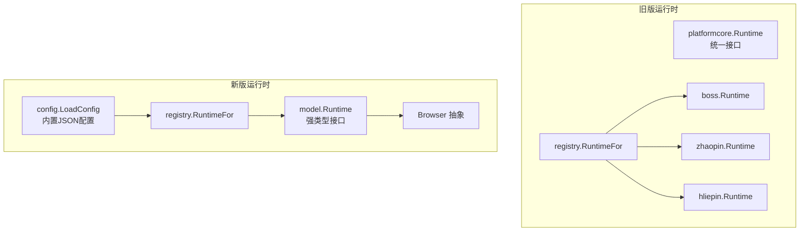
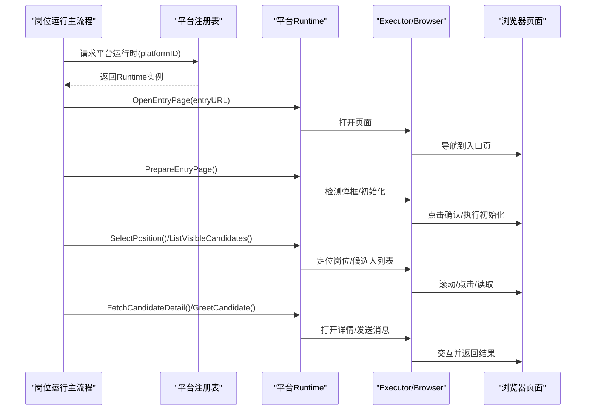
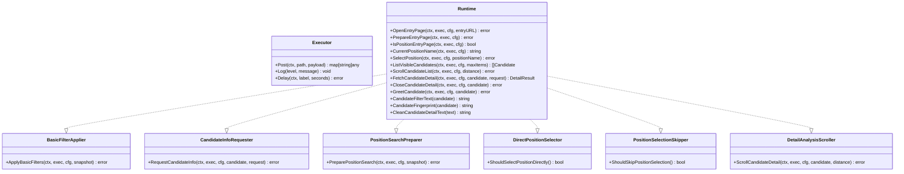
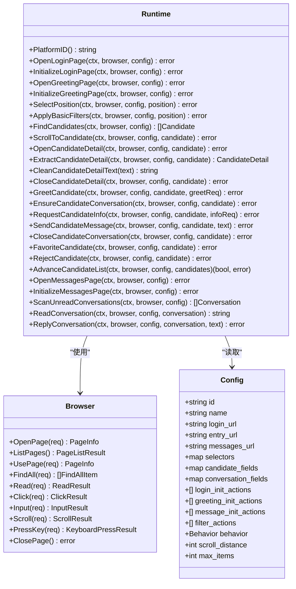
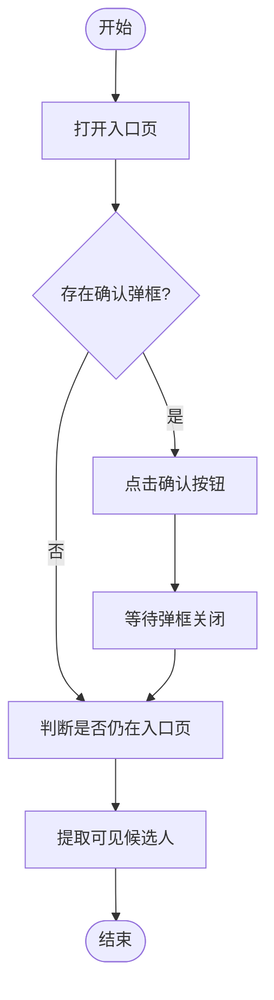
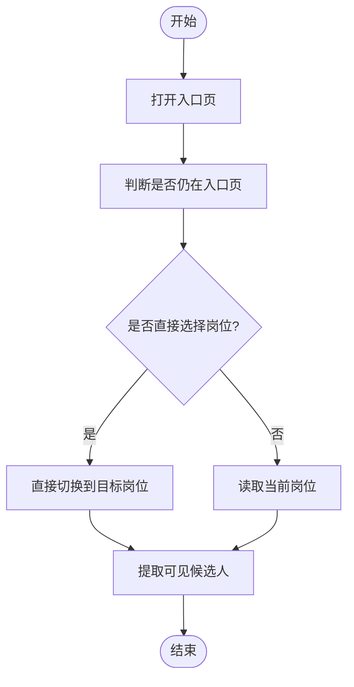
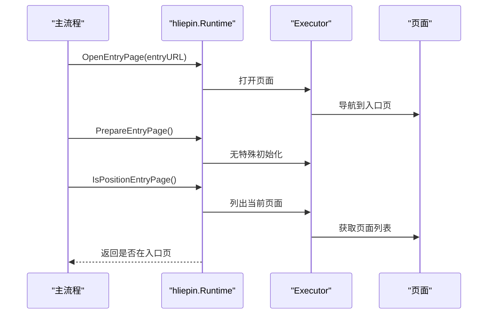
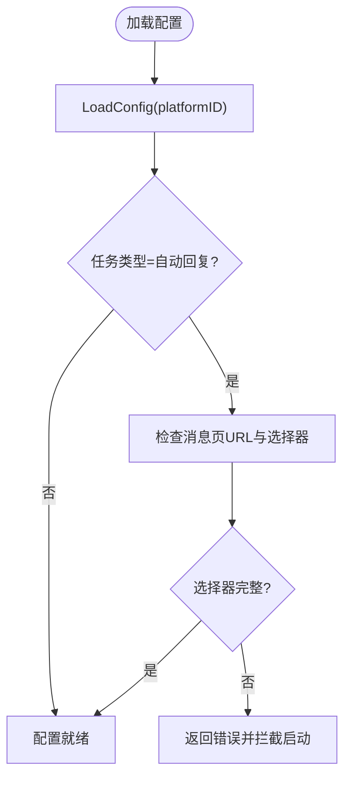
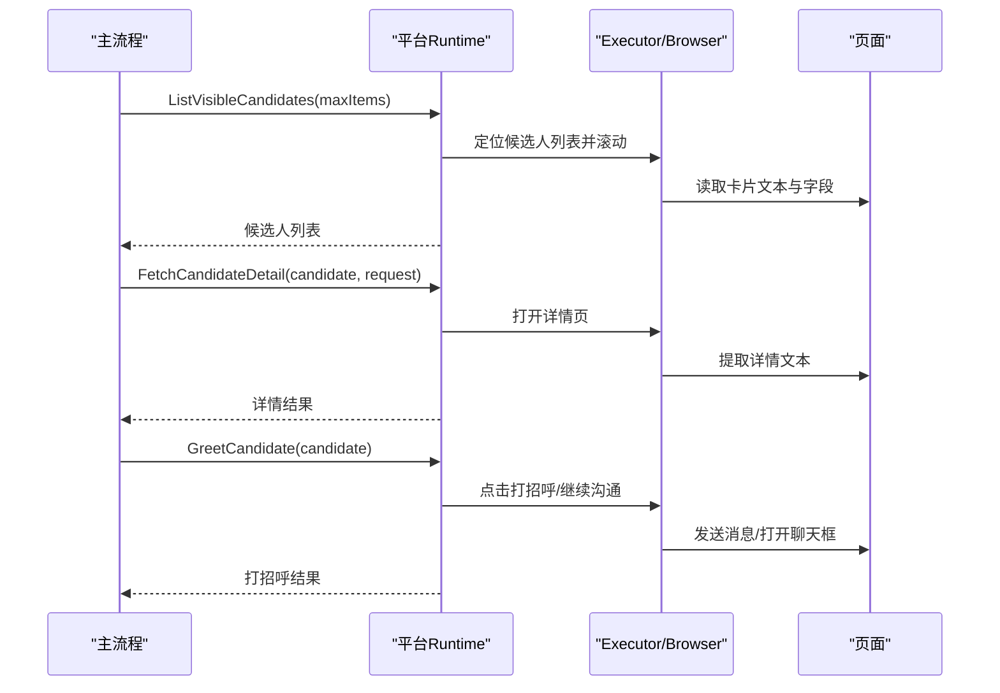
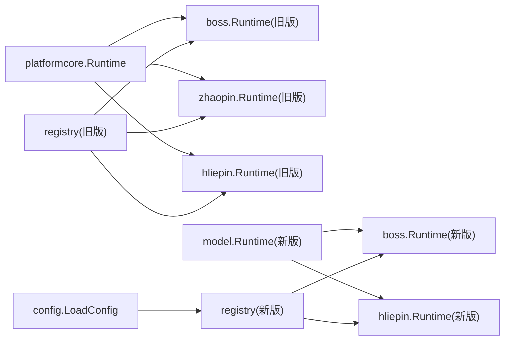

# 平台适配器系统

<cite>
**本文引用的文件**
- [local-agent-go/internal/platformcore/runtime.go](file://goodhr5/local-agent-go/internal/platformcore/runtime.go)
- [local-agent-go/internal/platforms/registry.go](file://goodhr5/local-agent-go/internal/platforms/registry.go)
- [local-agent-go/internal/platforms/boss/entry.go](file://goodhr5/local-agent-go/internal/platforms/boss/entry.go)
- [local-agent-go/internal/platforms/boss/runtime.go](file://goodhr5/local-agent-go/internal/platforms/boss/runtime.go)
- [local-agent-go/internal/platforms/boss/helpers.go](file://goodhr5/local-agent-go/internal/platforms/boss/helpers.go)
- [local-agent-go/internal/platforms/zhaopin/entry.go](file://goodhr5/local-agent-go/internal/platforms/zhaopin/entry.go)
- [local-agent-go/internal/platforms/zhaopin/runtime.go](file://goodhr5/local-agent-go/internal/platforms/zhaopin/runtime.go)
- [local-agent-go/internal/platforms/hliepin/entry.go](file://goodhr5/local-agent-go/internal/platforms/hliepin/entry.go)
- [local-agent-go-new/internal/platform/model/runtime.go](file://goodhr5/local-agent-go-new/internal/platform/model/runtime.go)
- [local-agent-go-new/internal/platform/config.go](file://goodhr5/local-agent-go-new/internal/platform/config.go)
- [local-agent-go-new/internal/platform/registry.go](file://goodhr5/local-agent-go-new/internal/platform/registry.go)
- [local-agent-go-new/internal/platform/boss/runtime.go](file://goodhr5/local-agent-go-new/internal/platform/boss/runtime.go)
- [local-agent-go-new/internal/platform/hliepin/runtime.go](file://goodhr5/local-agent-go-new/internal/platform/hliepin/runtime.go)
- [local-agent-go-new/internal/platform/config_template_test.go](file://goodhr5/local-agent-go-new/internal/platform/config_template_test.go)
</cite>

## 目录
1. [简介](#简介)
2. [项目结构](#项目结构)
3. [核心组件](#核心组件)
4. [架构总览](#架构总览)
5. [详细组件分析](#详细组件分析)
6. [依赖关系分析](#依赖关系分析)
7. [性能考虑](#性能考虑)
8. [故障排查指南](#故障排查指南)
9. [结论](#结论)
10. [附录：新平台接入与扩展开发](#附录新平台接入与扩展开发)

## 简介
本文件面向 HRPlus 本地 Agent 的“平台适配器系统”，系统性说明多平台适配器的插件化架构、统一接口规范、平台特定逻辑实现，覆盖 Boss 直聘、猎聘（含猎头端）、智联招聘等平台的适配方案。文档同时解释平台配置管理、选择器策略、导航模式、候选人处理流程，并提供新平台接入指南、测试验证方法与兼容性处理策略，帮助开发者快速为新的招聘平台添加支持。

## 项目结构
本地 Agent 包含两套并行演进的平台适配层：
- 旧版 Go 运行时：通过 platformcore 定义统一接口，各平台以独立包实现 Runtime，并由 registry 按平台 ID 分发。
- 新版 Go 运行时：使用强类型 model.Runtime 与 Browser 抽象，平台配置以 JSON 模板内嵌并校验，registry 返回隔离的平台运行时实例。

图表来源
- [local-agent-go/internal/platformcore/runtime.go:46-111](file://goodhr5/local-agent-go/internal/platformcore/runtime.go#L46-L111)
- [local-agent-go/internal/platforms/registry.go:15-34](file://goodhr5/local-agent-go/internal/platforms/registry.go#L15-L34)
- [local-agent-go-new/internal/platform/model/runtime.go:124-153](file://goodhr5/local-agent-go-new/internal/platform/model/runtime.go#L124-L153)
- [local-agent-go-new/internal/platform/config.go:25-56](file://goodhr5/local-agent-go-new/internal/platform/config.go#L25-L56)
- [local-agent-go-new/internal/platform/registry.go:15-29](file://goodhr5/local-agent-go-new/internal/platform/registry.go#L15-L29)

章节来源
- [local-agent-go/internal/platformcore/runtime.go:46-111](file://goodhr5/local-agent-go/internal/platformcore/runtime.go#L46-L111)
- [local-agent-go/internal/platforms/registry.go:15-34](file://goodhr5/local-agent-go/internal/platforms/registry.go#L15-L34)
- [local-agent-go-new/internal/platform/model/runtime.go:124-153](file://goodhr5/local-agent-go-new/internal/platform/model/runtime.go#L124-L153)
- [local-agent-go-new/internal/platform/config.go:25-56](file://goodhr5/local-agent-go-new/internal/platform/config.go#L25-L56)
- [local-agent-go-new/internal/platform/registry.go:15-29](file://goodhr5/local-agent-go-new/internal/platform/registry.go#L15-L29)

## 核心组件
- 统一运行时接口（旧版）
  - Executor：封装对浏览器 Worker 的统一调用（打开页面、点击、输入、滚动、截图、日志、延时）。
  - Runtime：定义平台必须实现的入口页、岗位切换、候选人列表、详情读取、打招呼、筛选、指纹等能力。
  - 可选能力：基础筛选应用、打招呼后索要信息、搜索准备、直接岗位选择、跳过岗位选择、详情滚动。
- 统一运行时接口（新版）
  - Browser：封装页面打开、元素查找/读取/点击/输入、滚动、键盘、关闭页面等能力。
  - Config：平台 URL、选择器、候选字段、对话字段、初始化动作、行为开关、翻页参数等。
  - Runtime：定义登录页、问候页、岗位选择、筛选、候选人发现与定位、详情提取、打招呼、消息回复、收藏/拒绝、翻页前进等完整流程。
- 平台注册表
  - 旧版：按平台 ID 返回对应 Runtime 实例。
  - 新版：按平台 ID 返回强类型 Runtime，并加载内置 JSON 配置。

章节来源
- [local-agent-go/internal/platformcore/runtime.go:10-111](file://goodhr5/local-agent-go/internal/platformcore/runtime.go#L10-L111)
- [local-agent-go-new/internal/platform/model/runtime.go:18-153](file://goodhr5/local-agent-go-new/internal/platform/model/runtime.go#L18-L153)
- [local-agent-go/internal/platforms/registry.go:15-34](file://goodhr5/local-agent-go/internal/platforms/registry.go#L15-L34)
- [local-agent-go-new/internal/platform/registry.go:15-29](file://goodhr5/local-agent-go-new/internal/platform/registry.go#L15-L29)

## 架构总览
平台适配器采用“插件化 + 统一接口”的设计：
- 上层任务调度不感知具体平台差异，仅通过 Runtime 接口驱动流程。
- 平台差异集中在各自 Runtime 实现与配置（选择器、行为开关、初始化动作）。
- 浏览器操作通过 Executor/Browser 抽象，屏蔽底层 CDP/Worker 细节。
- 配置管理将平台 URL、选择器、行为参数以 JSON 模板内嵌，并在启动时校验完整性。

图表来源
- [local-agent-go/internal/platformcore/runtime.go:46-111](file://goodhr5/local-agent-go/internal/platformcore/runtime.go#L46-L111)
- [local-agent-go/internal/platforms/boss/entry.go:12-53](file://goodhr5/local-agent-go/internal/platforms/boss/entry.go#L12-L53)
- [local-agent-go/internal/platforms/zhaopin/entry.go:12-43](file://goodhr5/local-agent-go/internal/platforms/zhaopin/entry.go#L12-L43)
- [local-agent-go/internal/platforms/hliepin/entry.go:12-44](file://goodhr5/local-agent-go/internal/platforms/hliepin/entry.go#L12-L44)
- [local-agent-go-new/internal/platform/model/runtime.go:124-153](file://goodhr5/local-agent-go-new/internal/platform/model/runtime.go#L124-L153)

## 详细组件分析

### 统一接口与执行器（旧版）
- Executor 提供 Post、Log、Delay 等通用能力，供平台实现调用 Worker 完成页面操作与日志记录。
- Runtime 定义平台必须实现的能力集合，包括入口页打开、入口页准备、岗位判断与切换、候选人列表提取与滚动、详情读取与关闭、打招呼、筛选文本与指纹生成、详情文本清理等。
- 可选能力用于扩展平台特性：基础筛选应用、打招呼后索要信息、搜索准备、直接岗位选择、跳过岗位选择、详情滚动。

图表来源
- [local-agent-go/internal/platformcore/runtime.go:10-111](file://goodhr5/local-agent-go/internal/platformcore/runtime.go#L10-L111)

章节来源
- [local-agent-go/internal/platformcore/runtime.go:10-111](file://goodhr5/local-agent-go/internal/platformcore/runtime.go#L10-L111)

### 统一接口与模型（新版）
- Browser 抽象页面操作，包括打开/使用/关闭页面、查找元素、读取/点击/输入、滚动、按键等。
- Config 保存平台 URL、选择器、候选字段、对话字段、初始化动作、行为开关、翻页参数等，并通过 LoadConfig 从内置 JSON 加载。
- Runtime 定义完整的平台流程：登录页、问候页、岗位选择、筛选、候选人发现与定位、详情提取、打招呼、消息回复、收藏/拒绝、翻页前进等。
- 新增错误语义：如候选人已沟通、详情不可用等。

图表来源
- [local-agent-go-new/internal/platform/model/runtime.go:18-153](file://goodhr5/local-agent-go-new/internal/platform/model/runtime.go#L18-L153)

章节来源
- [local-agent-go-new/internal/platform/model/runtime.go:18-153](file://goodhr5/local-agent-go-new/internal/platform/model/runtime.go#L18-L153)

### Boss 直聘平台适配
- 入口页打开与准备：打开云端配置的入口 URL；检测并点击确认弹框；记录日志。
- 岗位入口判断：通过 Worker 列出当前页面并与入口 URL 匹配。
- 候选人可见定位：构造平台特定的可见定位负载，包含卡片索引、元素引用、诊断名称、滚动参数等。
- 年龄提取与指纹规范化：优先结构化字段，缺失时从文本中抽取年龄；规范化姓名/年龄用于去重。

图表来源
- [local-agent-go/internal/platforms/boss/entry.go:12-53](file://goodhr5/local-agent-go/internal/platforms/boss/entry.go#L12-L53)
- [local-agent-go/internal/platforms/boss/runtime.go:19-34](file://goodhr5/local-agent-go/internal/platforms/boss/runtime.go#L19-L34)
- [local-agent-go/internal/platforms/boss/helpers.go:182-207](file://goodhr5/local-agent-go/internal/platforms/boss/helpers.go#L182-L207)

章节来源
- [local-agent-go/internal/platforms/boss/entry.go:12-53](file://goodhr5/local-agent-go/internal/platforms/boss/entry.go#L12-L53)
- [local-agent-go/internal/platforms/boss/runtime.go:19-34](file://goodhr5/local-agent-go/internal/platforms/boss/runtime.go#L19-L34)
- [local-agent-go/internal/platforms/boss/helpers.go:182-207](file://goodhr5/local-agent-go/internal/platforms/boss/helpers.go#L182-L207)

### 智联招聘平台适配
- 入口页打开与判断：打开入口 URL；通过 Worker 列出当前页面并与入口 URL 匹配。
- 直接岗位选择策略：每次直接切换到目标岗位，不读取当前页面岗位。
- 候选人可见定位：构造平台特定的可见定位负载，包含候选匹配文本、卡片索引、滚动参数等。
- 年龄提取与匹配文本：优先结构化字段，缺失时从文本中抽取年龄；动态列表重新定位时使用卡片文本。

图表来源
- [local-agent-go/internal/platforms/zhaopin/entry.go:12-43](file://goodhr5/local-agent-go/internal/platforms/zhaopin/entry.go#L12-L43)
- [local-agent-go/internal/platforms/zhaopin/runtime.go:19-41](file://goodhr5/local-agent-go/internal/platforms/zhaopin/runtime.go#L19-L41)

章节来源
- [local-agent-go/internal/platforms/zhaopin/entry.go:12-43](file://goodhr5/local-agent-go/internal/platforms/zhaopin/entry.go#L12-L43)
- [local-agent-go/internal/platforms/zhaopin/runtime.go:19-41](file://goodhr5/local-agent-go/internal/platforms/zhaopin/runtime.go#L19-L41)

### 猎聘（含猎头端）平台适配
- 入口页打开与准备：打开入口 URL；猎头端在搜索完成后统一进行岗位选择和隐藏筛选。
- 岗位入口判断：通过 Worker 列出当前页面并与入口 URL 匹配。
- 运行时状态：猎头端运行时维护当前岗位名、下一页码、详情返回 URL 等单任务上下文。

图表来源
- [local-agent-go/internal/platforms/hliepin/entry.go:12-44](file://goodhr5/local-agent-go/internal/platforms/hliepin/entry.go#L12-L44)
- [local-agent-go-new/internal/platform/hliepin/runtime.go:5-19](file://goodhr5/local-agent-go-new/internal/platform/hliepin/runtime.go#L5-L19)

章节来源
- [local-agent-go/internal/platforms/hliepin/entry.go:12-44](file://goodhr5/local-agent-go/internal/platforms/hliepin/entry.go#L12-L44)
- [local-agent-go-new/internal/platform/hliepin/runtime.go:5-19](file://goodhr5/local-agent-go-new/internal/platform/hliepin/runtime.go#L5-L19)

### 平台配置管理与选择器策略
- 配置加载：新版通过 LoadConfig 从内置 JSON 加载平台配置，包含 URL、选择器、候选字段、对话字段、初始化动作、行为开关等。
- 任务配置校验：ValidateTaskConfig 检查自动回复所需的消息页 URL 与选择器是否完整，避免运行时失败。
- 选择器策略：
  - Boss：详情入口限定安全小区域，避免误点头像；首次招呼语复用当前聊天框输入与发送控件。
  - 智联：详情页入口与大屏/小屏打招呼按钮完全分离；继续沟通复用原按钮打开聊天框。
  - 猎聘猎头端：候选人行使用唯一标识，避免依赖不唯一的父级；详情页入口避开立即沟通按钮；推广弹框兼容新旧文案。

图表来源
- [local-agent-go-new/internal/platform/config.go:25-56](file://goodhr5/local-agent-go-new/internal/platform/config.go#L25-L56)
- [local-agent-go-new/internal/platform/config_template_test.go:188-207](file://goodhr5/local-agent-go-new/internal/platform/config_template_test.go#L188-L207)

章节来源
- [local-agent-go-new/internal/platform/config.go:25-56](file://goodhr5/local-agent-go-new/internal/platform/config.go#L25-L56)
- [local-agent-go-new/internal/platform/config_template_test.go:188-207](file://goodhr5/local-agent-go-new/internal/platform/config_template_test.go#L188-L207)

### 候选人处理流程
- 列表提取：通过平台特定的可见定位负载，结合卡片索引、元素引用、滚动参数，稳定提取候选人摘要。
- 详情读取：打开详情页，提取文本并清理非简历内容；部分平台支持 AI 分析期间滚动详情。
- 打招呼与信息索要：执行打招呼，必要时进入对话窗口发送追加消息或索要联系方式/简历。
- 去重与指纹：基于候选人字段与文本规范化生成指纹，避免重复处理。

图表来源
- [local-agent-go/internal/platformcore/runtime.go:46-111](file://goodhr5/local-agent-go/internal/platformcore/runtime.go#L46-L111)
- [local-agent-go-new/internal/platform/model/runtime.go:124-153](file://goodhr5/local-agent-go-new/internal/platform/model/runtime.go#L124-L153)

章节来源
- [local-agent-go/internal/platformcore/runtime.go:46-111](file://goodhr5/local-agent-go/internal/platformcore/runtime.go#L46-L111)
- [local-agent-go-new/internal/platform/model/runtime.go:124-153](file://goodhr5/local-agent-go-new/internal/platform/model/runtime.go#L124-L153)

## 依赖关系分析
- 旧版运行时依赖 platformcore 统一接口，各平台包实现 Runtime，由 registry 按平台 ID 分发。
- 新版运行时依赖 model 强类型接口与 Browser 抽象，registry 返回平台运行时，config 加载内置 JSON 配置。
- 平台间解耦良好，耦合点集中在统一接口与配置结构。

图表来源
- [local-agent-go/internal/platformcore/runtime.go:46-111](file://goodhr5/local-agent-go/internal/platformcore/runtime.go#L46-L111)
- [local-agent-go/internal/platforms/registry.go:15-34](file://goodhr5/local-agent-go/internal/platforms/registry.go#L15-L34)
- [local-agent-go-new/internal/platform/model/runtime.go:124-153](file://goodhr5/local-agent-go-new/internal/platform/model/runtime.go#L124-L153)
- [local-agent-go-new/internal/platform/registry.go:15-29](file://goodhr5/local-agent-go-new/internal/platform/registry.go#L15-L29)
- [local-agent-go-new/internal/platform/config.go:25-56](file://goodhr5/local-agent-go-new/internal/platform/config.go#L25-L56)

章节来源
- [local-agent-go/internal/platforms/registry.go:15-34](file://goodhr5/local-agent-go/internal/platforms/registry.go#L15-L34)
- [local-agent-go-new/internal/platform/registry.go:15-29](file://goodhr5/local-agent-go-new/internal/platform/registry.go#L15-L29)

## 性能考虑
- 滚动与等待：候选人可见定位使用合理的滚动距离与等待时间，减少抖动与误判。
- 选择器稳定性：通过唯一标识与父级约束提升定位稳定性，降低重试次数。
- 直接岗位选择：智联等平台采用直接切换岗位策略，避免冗余读取与复核。
- 详情滚动：AI 分析期间支持滚动详情，提高长页面信息覆盖率。

[本节为通用指导，不直接分析具体文件]

## 故障排查指南
- 入口页未正确打开：检查云端平台配置是否包含入口 URL；确认 Worker 页面打开成功。
- 弹框未处理：Boss 入口页可能弹出确认框，需检测并点击确认；若未检测到弹框则继续流程。
- 自动回复配置缺失：ValidateTaskConfig 会拦截缺少消息页 URL 或选择器的情况，需在配置中补齐。
- 选择器失效：确保选择器目标唯一且稳定；参考测试用例中的断言，验证关键选择器是否正确。
- 平台未实现：registry 对未知平台 ID 返回错误，需先实现对应 Runtime 并注册。

章节来源
- [local-agent-go/internal/platforms/boss/entry.go:23-53](file://goodhr5/local-agent-go/internal/platforms/boss/entry.go#L23-L53)
- [local-agent-go-new/internal/platform/config.go:41-56](file://goodhr5/local-agent-go-new/internal/platform/config.go#L41-L56)
- [local-agent-go-new/internal/platform/config_template_test.go:188-207](file://goodhr5/local-agent-go-new/internal/platform/config_template_test.go#L188-L207)
- [local-agent-go/internal/platforms/registry.go:22-34](file://goodhr5/local-agent-go/internal/platforms/registry.go#L22-L34)

## 结论
HRPlus 本地 Agent 的平台适配器系统通过统一接口与插件化设计，实现了多招聘平台的稳定适配。旧版以 platformcore 为核心，新版以 model 与 Browser 抽象强化类型与配置管理。Boss、智联、猎聘等平台的具体实现体现了选择器策略、导航模式与候选人处理流程的差异与共性。通过完善的配置校验与测试用例，系统具备良好的可维护性与可扩展性。

[本节为总结性内容，不直接分析具体文件]

## 附录：新平台接入与扩展开发
- 步骤概览
  - 创建平台包：实现 Runtime（旧版）或 model.Runtime（新版），提供 PlatformID。
  - 注册平台：在 registry 中添加平台 ID 到运行时映射。
  - 配置模板：为新平台编写内置 JSON 配置，包含 URL、选择器、候选字段、对话字段、初始化动作、行为开关等。
  - 校验配置：确保 ValidateTaskConfig 能通过；补充自动回复所需的选择器。
  - 编写测试：验证选择器与行为是否符合预期，参考现有测试用例。
- 关键要点
  - 选择器应唯一且稳定，避免依赖不稳定的父级或动态类名。
  - 详情页入口与打招呼按钮需分离，防止误操作。
  - 候选人指纹与文本规范化需一致，避免重复处理。
  - 直接岗位选择与跳过岗位选择策略应根据平台特性合理设置。
- 参考路径
  - 旧版接口与实现：[local-agent-go/internal/platformcore/runtime.go](file://goodhr5/local-agent-go/internal/platformcore/runtime.go)、[local-agent-go/internal/platforms/boss/runtime.go](file://goodhr5/local-agent-go/internal/platforms/boss/runtime.go)
  - 新版接口与配置：[local-agent-go-new/internal/platform/model/runtime.go](file://goodhr5/local-agent-go-new/internal/platform/model/runtime.go)、[local-agent-go-new/internal/platform/config.go](file://goodhr5/local-agent-go-new/internal/platform/config.go)
  - 注册表示例：[local-agent-go/internal/platforms/registry.go](file://goodhr5/local-agent-go/internal/platforms/registry.go)、[local-agent-go-new/internal/platform/registry.go](file://goodhr5/local-agent-go-new/internal/platform/registry.go)
  - 配置测试用例：[local-agent-go-new/internal/platform/config_template_test.go](file://goodhr5/local-agent-go-new/internal/platform/config_template_test.go)

[本节为扩展指导，不直接分析具体文件]