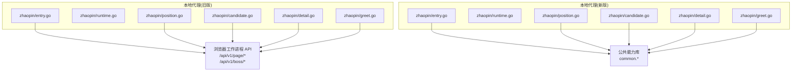
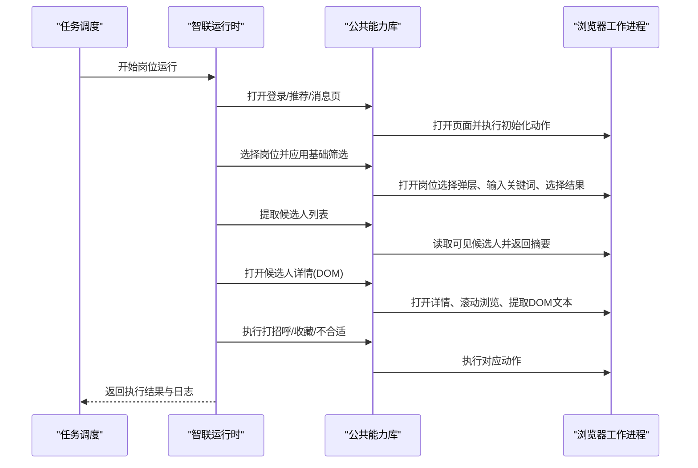
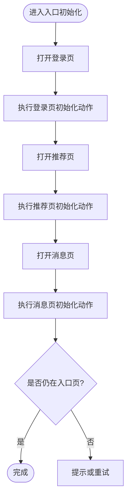
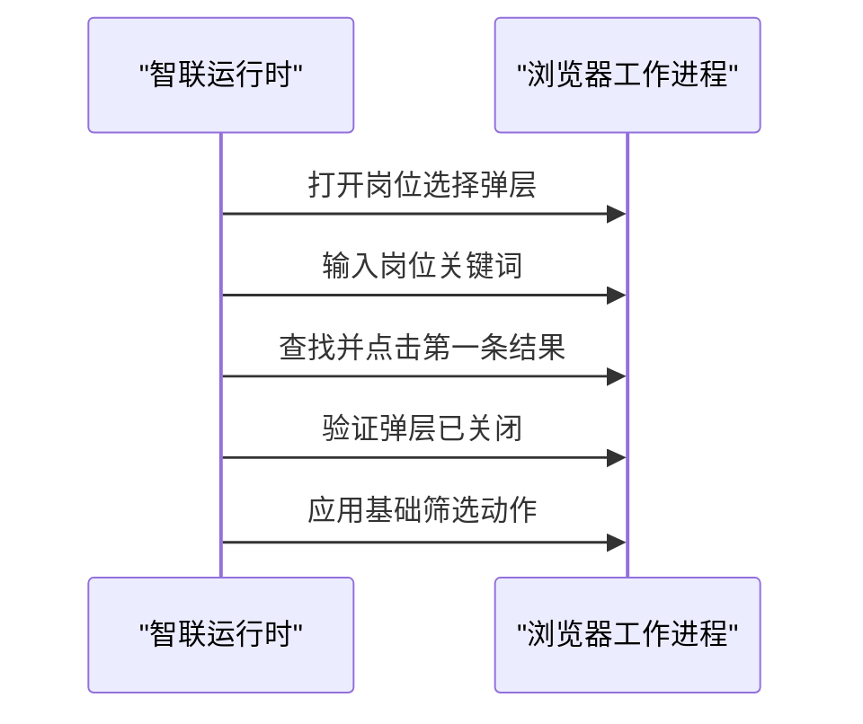
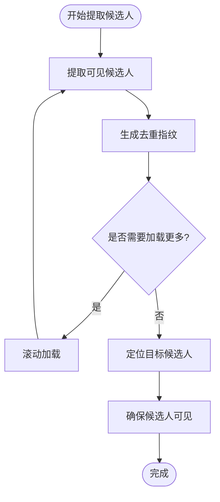
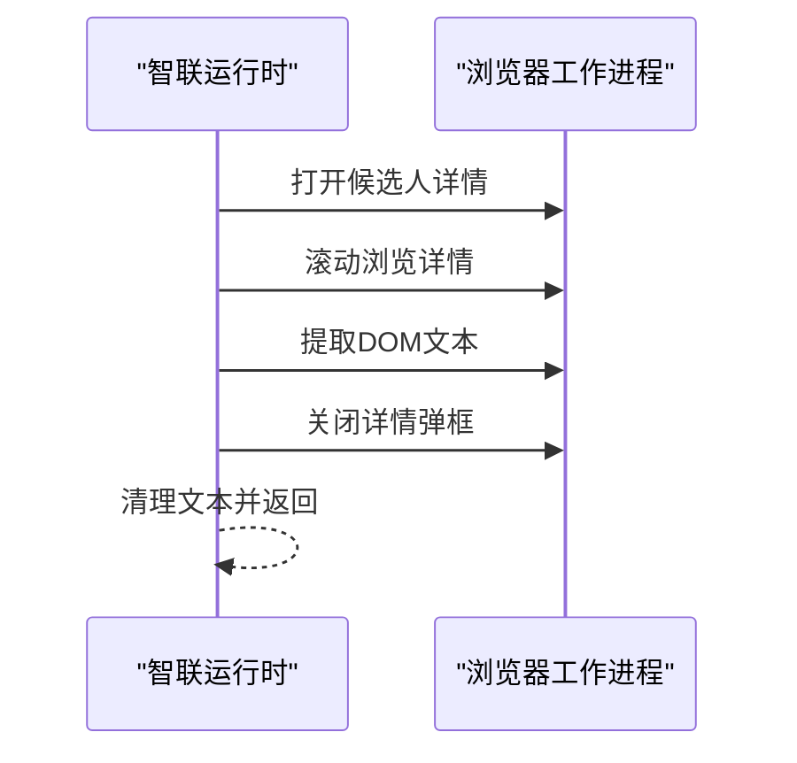
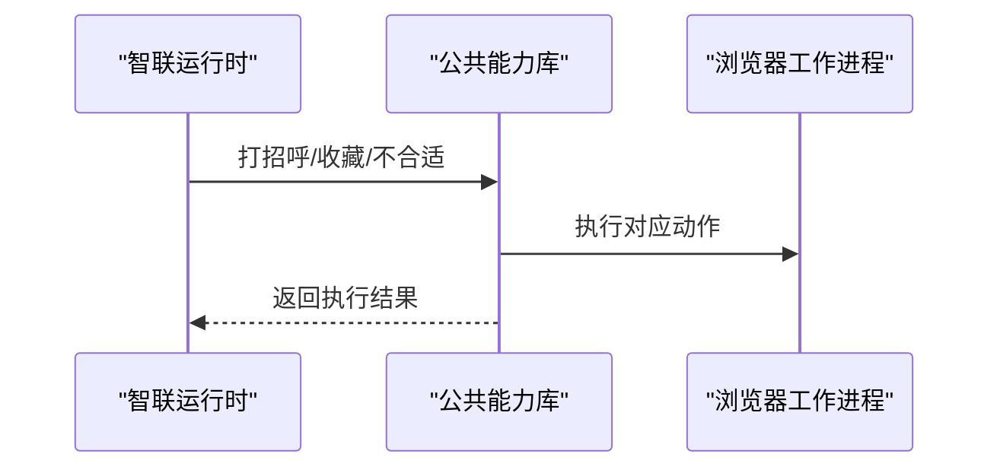
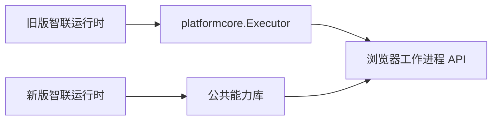

# 智联招聘适配器

<cite>
**本文引用的文件**
- [entry.go](file://goodhr5/local-agent-go/internal/platforms/zhaopin/entry.go)
- [runtime.go](file://goodhr5/local-agent-go/internal/platforms/zhaopin/runtime.go)
- [position.go](file://goodhr5/local-agent-go/internal/platforms/zhaopin/position.go)
- [candidate.go](file://goodhr5/local-agent-go/internal/platforms/zhaopin/candidate.go)
- [detail.go](file://goodhr5/local-agent-go/internal/platforms/zhaopin/detail.go)
- [greet.go](file://goodhr5/local-agent-go/internal/platforms/zhaopin/greet.go)
- [entry.go](file://goodhr5/local-agent-go/internal/platform/zhaopin/entry.go)
- [runtime.go](file://goodhr5/local-agent-go/internal/platform/zhaopin/runtime.go)
- [position.go](file://goodhr5/local-agent-go/internal/platform/zhaopin/position.go)
- [candidate.go](file://goodhr5/local-agent-go/internal/platform/zhaopin/candidate.go)
- [detail.go](file://goodhr5/local-agent-go/internal/platform/zhaopin/detail.go)
- [greet.go](file://goodhr5/local-agent-go/internal/platform/zhaopin/greet.go)
</cite>

## 目录
1. [简介](#简介)
2. [项目结构](#项目结构)
3. [核心组件](#核心组件)
4. [架构总览](#架构总览)
5. [详细组件分析](#详细组件分析)
6. [依赖关系分析](#依赖关系分析)
7. [性能考量](#性能考量)
8. [故障排除指南](#故障排除指南)
9. [结论](#结论)
10. [附录](#附录)

## 简介
本文件为智联招聘平台适配器的完整技术文档，聚焦以下方面：
- 平台特性与页面交互模式：登录页、推荐页、消息页、岗位选择弹层、候选人列表与详情弹框。
- 数据获取方式：通过本地执行器调用浏览器工作进程提供的 API，完成文本提取、元素查找、滚动、点击等操作。
- 职位匹配算法与候选人筛选逻辑：基于配置化动作与通用能力实现基础筛选；通过指纹与可见性定位进行去重与稳定定位。
- 简历内容分析：仅支持 DOM 模式详情提取，并清理两端空白。
- 自动沟通策略：打招呼、收藏、不合适等动作统一委托给公共能力。
- 任务跟踪机制：通过日志与耗时统计记录关键阶段。
- 导航控制与元素定位：使用选择器与元素引用（element_ref）结合的方式，配合重试与等待策略。
- 异常处理与状态同步：对弹窗关闭、结果校验、超时等进行兜底处理。
- 安全策略应对：强调真实用户行为模拟、最小权限与可观测性。
- 部署配置与排障：提供运行期参数、常见错误定位与修复建议。

## 项目结构
智联招聘适配器在两套运行时中均有实现：
- local-agent-go：面向旧版本地代理，通过 platformcore.Executor 调用 /api/v1/* 系列接口。
- local-agent-go：面向新版本地代理，通过 model.Browser 与 common 公共库封装能力。

图表来源
- [entry.go:12-43](file://goodhr5/local-agent-go/internal/platforms/zhaopin/entry.go#L12-L43)
- [position.go:31-101](file://goodhr5/local-agent-go/internal/platforms/zhaopin/position.go#L31-L101)
- [candidate.go:13-85](file://goodhr5/local-agent-go/internal/platforms/zhaopin/candidate.go#L13-L85)
- [detail.go:13-102](file://goodhr5/local-agent-go/internal/platforms/zhaopin/detail.go#L13-L102)
- [greet.go:11-22](file://goodhr5/local-agent-go/internal/platforms/zhaopin/greet.go#L11-L22)
- [entry.go:11-45](file://goodhr5/local-agent-go/internal/platform/zhaopin/entry.go#L11-L45)
- [position.go:11-21](file://goodhr5/local-agent-go/internal/platform/zhaopin/position.go#L11-L21)
- [candidate.go:11-24](file://goodhr5/local-agent-go/internal/platform/zhaopin/candidate.go#L11-L24)
- [detail.go:12-35](file://goodhr5/local-agent-go/internal/platform/zhaopin/detail.go#L12-L35)
- [greet.go:11-24](file://goodhr5/local-agent-go/internal/platform/zhaopin/greet.go#L11-L24)

章节来源
- [entry.go:12-43](file://goodhr5/local-agent-go/internal/platforms/zhaopin/entry.go#L12-L43)
- [runtime.go:11-69](file://goodhr5/local-agent-go/internal/platforms/zhaopin/runtime.go#L11-L69)
- [position.go:11-103](file://goodhr5/local-agent-go/internal/platforms/zhaopin/position.go#L11-L103)
- [candidate.go:13-86](file://goodhr5/local-agent-go/internal/platforms/zhaopin/candidate.go#L13-L86)
- [detail.go:13-103](file://goodhr5/local-agent-go/internal/platforms/zhaopin/detail.go#L13-L103)
- [greet.go:11-23](file://goodhr5/local-agent-go/internal/platforms/zhaopin/greet.go#L11-L23)
- [entry.go:11-45](file://goodhr5/local-agent-go/internal/platform/zhaopin/entry.go#L11-L45)
- [runtime.go:4-15](file://goodhr5/local-agent-go/internal/platform/zhaopin/runtime.go#L4-L15)
- [position.go:11-21](file://goodhr5/local-agent-go/internal/platform/zhaopin/position.go#L11-L21)
- [candidate.go:11-24](file://goodhr5/local-agent-go/internal/platform/zhaopin/candidate.go#L11-L24)
- [detail.go:12-35](file://goodhr5/local-agent-go/internal/platform/zhaopin/detail.go#L12-L35)
- [greet.go:11-24](file://goodhr5/local-agent-go/internal/platform/zhaopin/greet.go#L11-L24)

## 核心组件
- 入口与初始化
  - 打开登录页、推荐页、消息页，并在各页执行可选的初始化动作（如关闭提示）。
  - 判断当前页面是否为岗位运行入口页。
- 岗位选择与筛选
  - 打开岗位选择弹层，输入关键词，选择第一条结果，并确认弹层关闭。
  - 按配置顺序应用基础筛选动作。
- 候选人列表与定位
  - 提取当前可见候选人，生成去重指纹，滚动加载更多候选人。
  - 将指定候选人滚动至可视区域，确保后续操作稳定。
- 详情读取与分析
  - 仅支持 DOM 模式详情提取，滚动一次以增强信息完整性，最后关闭详情弹框。
- 自动沟通
  - 打招呼、收藏、不合适等动作统一委托给公共能力。

章节来源
- [entry.go:12-43](file://goodhr5/local-agent-go/internal/platforms/zhaopin/entry.go#L12-L43)
- [position.go:31-101](file://goodhr5/local-agent-go/internal/platforms/zhaopin/position.go#L31-L101)
- [candidate.go:13-85](file://goodhr5/local-agent-go/internal/platforms/zhaopin/candidate.go#L13-L85)
- [detail.go:13-102](file://goodhr5/local-agent-go/internal/platforms/zhaopin/detail.go#L13-L102)
- [greet.go:11-22](file://goodhr5/local-agent-go/internal/platforms/zhaopin/greet.go#L11-L22)
- [entry.go:11-45](file://goodhr5/local-agent-go/internal/platform/zhaopin/entry.go#L11-L45)
- [position.go:11-21](file://goodhr5/local-agent-go/internal/platform/zhaopin/position.go#L11-L21)
- [candidate.go:11-24](file://goodhr5/local-agent-go/internal/platform/zhaopin/candidate.go#L11-L24)
- [detail.go:12-35](file://goodhr5/local-agent-go/internal/platform/zhaopin/detail.go#L12-L35)
- [greet.go:11-24](file://goodhr5/local-agent-go/internal/platform/zhaopin/greet.go#L11-L24)

## 架构总览
智联招聘适配器采用“平台运行时 + 公共能力”的分层设计：
- 平台运行时负责智联特定流程编排与平台差异处理。
- 公共能力库封装通用的页面操作、候选人与详情处理、动作执行等。
- 旧版通过 Executor 直接调用浏览器工作进程 API；新版通过 Browser 抽象屏蔽底层细节。

图表来源
- [entry.go:11-45](file://goodhr5/local-agent-go/internal/platform/zhaopin/entry.go#L11-L45)
- [position.go:11-21](file://goodhr5/local-agent-go/internal/platform/zhaopin/position.go#L11-L21)
- [candidate.go:11-24](file://goodhr5/local-agent-go/internal/platform/zhaopin/candidate.go#L11-L24)
- [detail.go:12-35](file://goodhr5/local-agent-go/internal/platform/zhaopin/detail.go#L12-L35)
- [greet.go:11-24](file://goodhr5/local-agent-go/internal/platform/zhaopin/greet.go#L11-L24)

## 详细组件分析

### 入口与初始化
- 打开登录页、推荐页、消息页，并执行配置的初始化动作（如关闭提示）。
- 判断当前页面是否为岗位运行入口页，通过页面列表与目标 URL 匹配。

图表来源
- [entry.go:11-45](file://goodhr5/local-agent-go/internal/platform/zhaopin/entry.go#L11-L45)
- [entry.go:12-43](file://goodhr5/local-agent-go/internal/platforms/zhaopin/entry.go#L12-L43)

章节来源
- [entry.go:11-45](file://goodhr5/local-agent-go/internal/platform/zhaopin/entry.go#L11-L45)
- [entry.go:12-43](file://goodhr5/local-agent-go/internal/platforms/zhaopin/entry.go#L12-L43)

### 岗位选择与基础筛选
- 打开岗位选择弹层，输入搜索关键词，选择第一条结果，并验证弹层关闭。
- 按配置顺序应用基础筛选动作。

图表来源
- [position.go:31-101](file://goodhr5/local-agent-go/internal/platforms/zhaopin/position.go#L31-L101)
- [position.go:11-21](file://goodhr5/local-agent-go/internal/platform/zhaopin/position.go#L11-L21)

章节来源
- [position.go:31-101](file://goodhr5/local-agent-go/internal/platforms/zhaopin/position.go#L31-L101)
- [position.go:11-21](file://goodhr5/local-agent-go/internal/platform/zhaopin/position.go#L11-L21)

### 候选人列表与定位
- 提取当前可见候选人，生成去重指纹（姓名+年龄），滚动加载更多候选人。
- 将指定候选人滚动至可视区域，确保后续操作稳定。

图表来源
- [candidate.go:13-85](file://goodhr5/local-agent-go/internal/platforms/zhaopin/candidate.go#L13-L85)
- [candidate.go:11-24](file://goodhr5/local-agent-go/internal/platform/zhaopin/candidate.go#L11-L24)

章节来源
- [candidate.go:13-85](file://goodhr5/local-agent-go/internal/platforms/zhaopin/candidate.go#L13-L85)
- [candidate.go:11-24](file://goodhr5/local-agent-go/internal/platform/zhaopin/candidate.go#L11-L24)

### 详情读取与分析
- 仅支持 DOM 模式详情提取，滚动一次以增强信息完整性，最后关闭详情弹框。
- 清理详情文本两端空白，便于后续 AI 分析。

图表来源
- [detail.go:13-102](file://goodhr5/local-agent-go/internal/platforms/zhaopin/detail.go#L13-L102)
- [detail.go:12-35](file://goodhr5/local-agent-go/internal/platform/zhaopin/detail.go#L12-L35)

章节来源
- [detail.go:13-102](file://goodhr5/local-agent-go/internal/platforms/zhaopin/detail.go#L13-L102)
- [detail.go:12-35](file://goodhr5/local-agent-go/internal/platform/zhaopin/detail.go#L12-L35)

### 自动沟通策略
- 打招呼、收藏、不合适等动作统一委托给公共能力，保证一致性与可维护性。

图表来源
- [greet.go:11-22](file://goodhr5/local-agent-go/internal/platforms/zhaopin/greet.go#L11-L22)
- [greet.go:11-24](file://goodhr5/local-agent-go/internal/platform/zhaopin/greet.go#L11-L24)

章节来源
- [greet.go:11-22](file://goodhr5/local-agent-go/internal/platforms/zhaopin/greet.go#L11-L22)
- [greet.go:11-24](file://goodhr5/local-agent-go/internal/platform/zhaopin/greet.go#L11-L24)

## 依赖关系分析
- 旧版运行时依赖 platformcore.Executor 与 cloudapi.PlatformConfig，通过 /api/v1/* 接口与浏览器工作进程通信。
- 新版运行时依赖 model.Browser 与 common 公共库，屏蔽底层 API 细节，提升可移植性。
- 运行时之间无直接耦合，均通过各自抽象层与浏览器工作进程交互。

图表来源
- [runtime.go:11-69](file://goodhr5/local-agent-go/internal/platforms/zhaopin/runtime.go#L11-L69)
- [runtime.go:4-15](file://goodhr5/local-agent-go/internal/platform/zhaopin/runtime.go#L4-L15)

章节来源
- [runtime.go:11-69](file://goodhr5/local-agent-go/internal/platforms/zhaopin/runtime.go#L11-L69)
- [runtime.go:4-15](file://goodhr5/local-agent-go/internal/platform/zhaopin/runtime.go#L4-L15)

## 性能考量
- 列表提取与转换耗时统计：在候选人提取过程中记录 find_elapsed_ms、convert_elapsed_ms、elapsed_ms，便于定位瓶颈。
- 滚动与等待策略：合理设置 wait_ms、card_scroll_attempts、viewport_margin 等参数，平衡稳定性与速度。
- 详情提取优化：限制截图开关、减少滚动次数，降低额外开销。
- 日志与可观测性：关键步骤输出结构化日志，便于问题追踪与性能分析。

章节来源
- [candidate.go:13-49](file://goodhr5/local-agent-go/internal/platforms/zhaopin/candidate.go#L13-L49)
- [detail.go:42-55](file://goodhr5/local-agent-go/internal/platforms/zhaopin/detail.go#L42-L55)

## 故障排除指南
- 入口页地址缺失：检查云端平台配置是否包含入口页面地址。
- 岗位选择失败：确认岗位选择弹层是否成功打开、关键词输入是否生效、搜索结果是否存在。
- 候选人提取为空：检查可见候选人列表是否为空，必要时滚动加载更多。
- 详情未关闭：多次尝试关闭详情弹框，若仍失败，检查选择器与键盘事件。
- 详情页文本为空：确认详情弹框已就绪且 DOM 文本可读，必要时调整等待时间。

章节来源
- [entry.go:12-43](file://goodhr5/local-agent-go/internal/platforms/zhaopin/entry.go#L12-L43)
- [position.go:31-101](file://goodhr5/local-agent-go/internal/platforms/zhaopin/position.go#L31-L101)
- [candidate.go:13-85](file://goodhr5/local-agent-go/internal/platforms/zhaopin/candidate.go#L13-L85)
- [detail.go:57-96](file://goodhr5/local-agent-go/internal/platforms/zhaopin/detail.go#L57-L96)

## 结论
智联招聘适配器通过分层设计与公共能力复用，实现了稳定的页面交互、数据提取与自动化沟通。其特点包括：
- 明确的职责划分：平台运行时专注智联特定流程，公共能力库提供通用操作。
- 可配置化与可扩展性：通过配置动作与选择器适配平台变化。
- 强可观测性：详细的日志与耗时统计，便于问题定位与性能优化。
建议在后续迭代中持续优化选择器稳定性、增加重试与降级策略，并完善错误分类与告警机制。

## 附录
- 部署配置要点
  - 确保云端平台配置包含入口页面地址、登录页、推荐页、消息页 URL。
  - 配置基础筛选动作与初始化动作，确保页面状态符合预期。
  - 合理设置滚动距离、等待时间与可见性要求，平衡稳定性与效率。
- 安全策略应对
  - 使用真实用户行为模拟（真实滚轮、点击、键盘事件），避免被风控识别。
  - 最小权限原则：仅请求必要的页面与元素操作。
  - 可观测性优先：记录关键步骤与异常，便于审计与回溯。
- 用户体验优化
  - 减少不必要的等待与重复操作，提升整体效率。
  - 提供清晰的错误提示与恢复路径，降低人工干预成本。