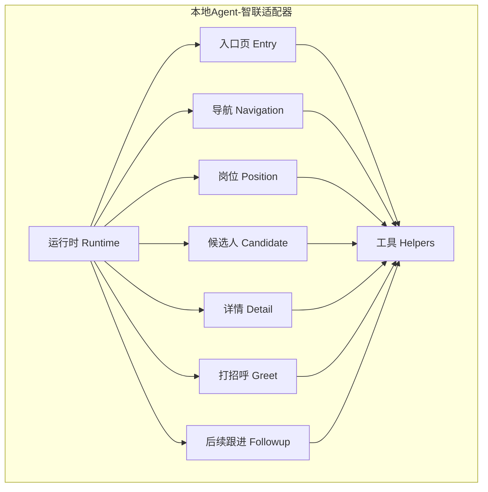
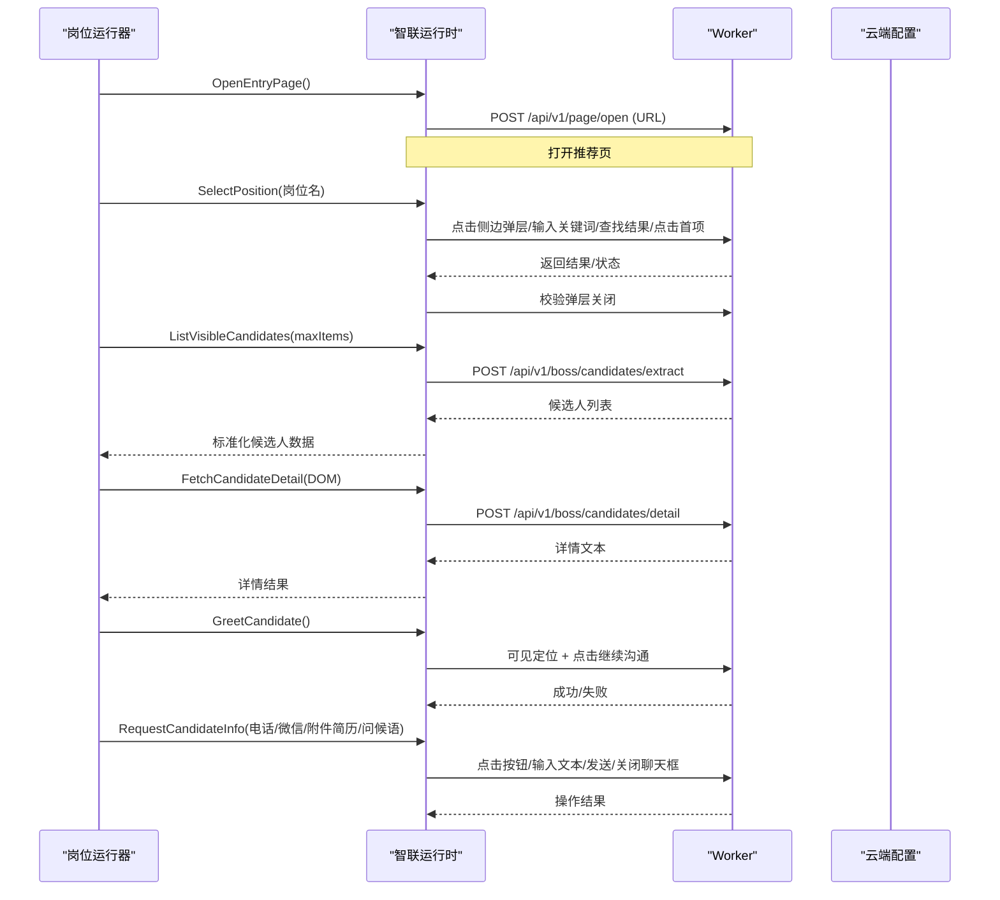
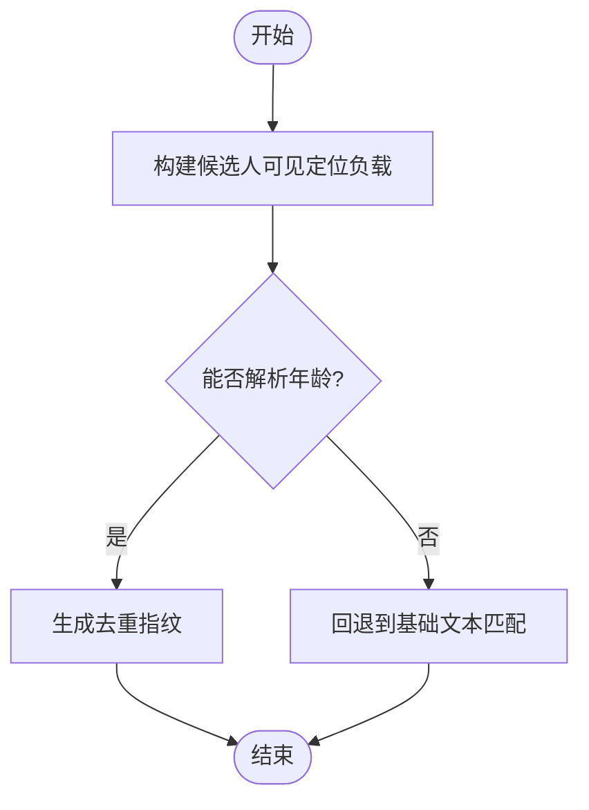
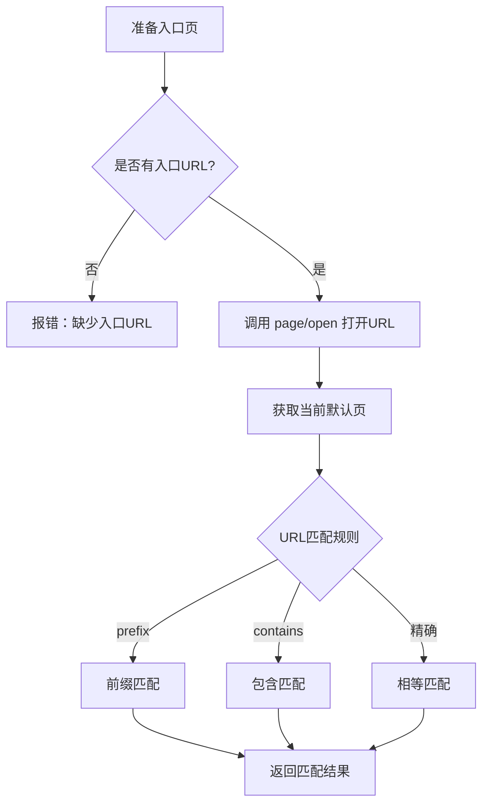
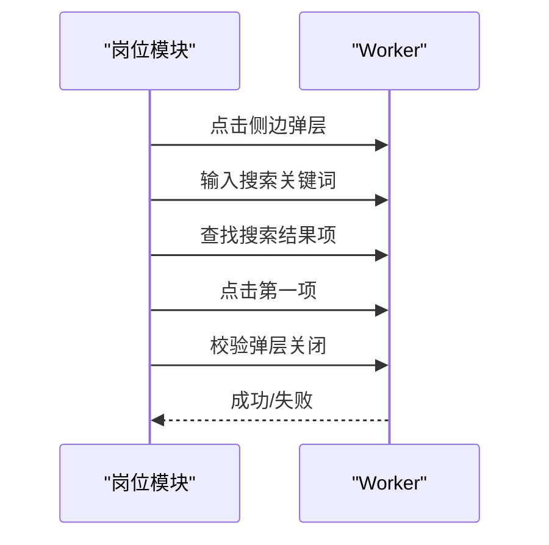
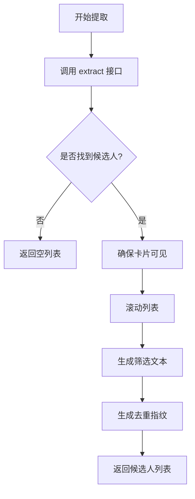
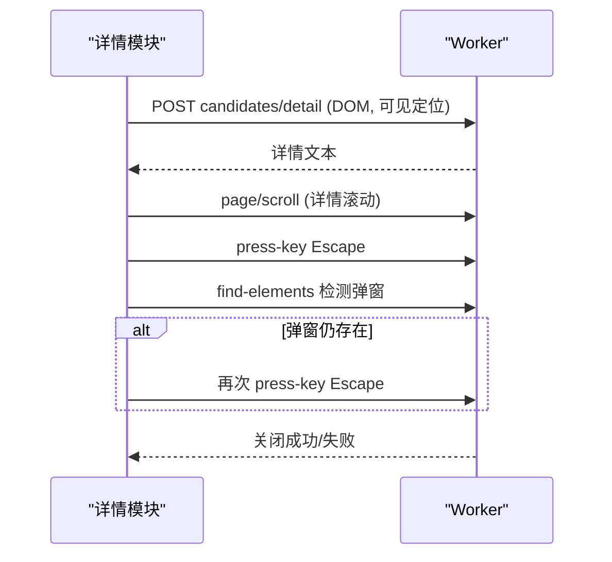
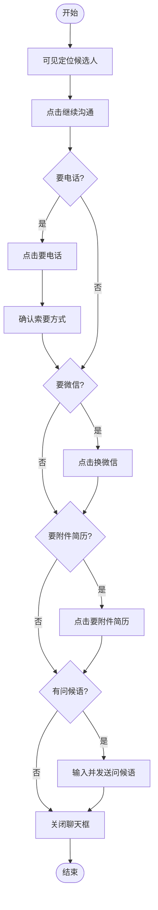
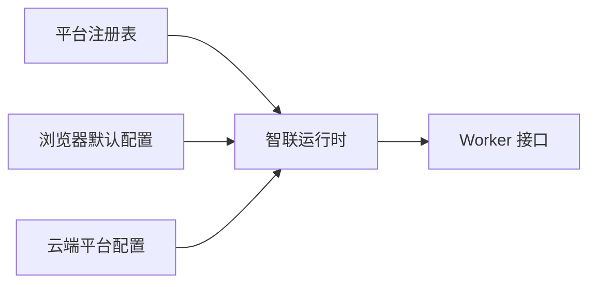

# 智联招聘适配器

<cite>
**本文引用的文件**
- [registry.go](file://goodhr5/local-agent-go/internal/platforms/registry.go)
- [runtime.go](file://goodhr5/local-agent-go/internal/platforms/zhaopin/runtime.go)
- [entry.go](file://goodhr5/local-agent-go/internal/platforms/zhaopin/entry.go)
- [navigation.go](file://goodhr5/local-agent-go/internal/platforms/zhaopin/navigation.go)
- [position.go](file://goodhr5/local-agent-go/internal/platforms/zhaopin/position.go)
- [candidate.go](file://goodhr5/local-agent-go/internal/platforms/zhaopin/candidate.go)
- [detail.go](file://goodhr5/local-agent-go/internal/platforms/zhaopin/detail.go)
- [greet.go](file://goodhr5/local-agent-go/internal/platforms/zhaopin/greet.go)
- [followup.go](file://goodhr5/local-agent-go/internal/platforms/zhaopin/followup.go)
- [helpers.go](file://goodhr5/local-agent-go/internal/platforms/zhaopin/helpers.go)
- [0012_platform_locator_schema.sql](file://goodhr5/cloud/backend/db/migrations/0012_platform_locator_schema.sql)
- [defaults.go](file://goodhr5/local-agent-go/internal/browserprofile/defaults.go)
</cite>

## 目录
1. [简介](#简介)
2. [项目结构](#项目结构)
3. [核心组件](#核心组件)
4. [架构总览](#架构总览)
5. [详细组件分析](#详细组件分析)
6. [依赖关系分析](#依赖关系分析)
7. [性能考量](#性能考量)
8. [故障排除指南](#故障排除指南)
9. [结论](#结论)
10. [附录](#附录)

## 简介
本文件为“智联招聘平台适配器”的完整技术文档，聚焦于本地 Agent 中 zhaopin 适配器的实现与运行机制。内容涵盖：
- 平台特性与页面交互模式（入口页、岗位选择、候选人列表、详情弹窗、聊天框）
- 数据获取方式（DOM 提取、Worker 调用、云端配置驱动）
- 职位匹配算法、候选人筛选逻辑、简历内容分析
- 自动沟通策略（打招呼、索要电话/微信/附件简历）
- 任务跟踪机制（日志、耗时统计、状态校验）
- 导航控制、元素定位策略、异常处理、状态同步
- 平台特定业务逻辑与安全策略应对
- 部署配置与故障排除

## 项目结构
智联招聘适配器位于 local-agent-go 的 platforms/zhaopin 包内，按职责拆分为多个文件：
- runtime.go：运行时能力声明、通用参数构造、候选者指纹与年龄解析
- entry.go：入口页打开与判断
- navigation.go：页面匹配、岗位名称规范化、搜索关键词生成、元素定位合并
- position.go：当前岗位读取、岗位切换（搜索并点击）
- candidate.go：候选人可见性定位、滚动、提取、去重指纹
- detail.go：详情页 DOM 文本提取、滚动、关闭
- greet.go：候选人打招呼
- followup.go：打招呼后索要信息（电话/微信/附件简历）、发送问候语、关闭聊天框
- helpers.go：通用工具函数（Worker 响应解析、元素定位转换等）



图表来源
- [runtime.go:11-41](file://goodhr5/local-agent-go/internal/platforms/zhaopin/runtime.go#L11-L41)
- [entry.go:12-43](file://goodhr5/local-agent-go/internal/platforms/zhaopin/entry.go#L12-L43)
- [navigation.go:12-122](file://goodhr5/local-agent-go/internal/platforms/zhaopin/navigation.go#L12-L122)
- [position.go:11-102](file://goodhr5/local-agent-go/internal/platforms/zhaopin/position.go#L11-L102)
- [candidate.go:13-85](file://goodhr5/local-agent-go/internal/platforms/zhaopin/candidate.go#L13-L85)
- [detail.go:13-103](file://goodhr5/local-agent-go/internal/platforms/zhaopin/detail.go#L13-L103)
- [greet.go:11-22](file://goodhr5/local-agent-go/internal/platforms/zhaopin/greet.go#L11-L22)
- [followup.go:25-168](file://goodhr5/local-agent-go/internal/platforms/zhaopin/followup.go#L25-L168)
- [helpers.go:75-186](file://goodhr5/local-agent-go/internal/platforms/zhaopin/helpers.go#L75-L186)

章节来源
- [registry.go:15-33](file://goodhr5/local-agent-go/internal/platforms/registry.go#L15-L33)
- [defaults.go:47-47](file://goodhr5/local-agent-go/internal/browserprofile/defaults.go#L47-L47)

## 核心组件
- 运行时 Runtime：提供 ShouldSelectPositionDirectly 标志位，强制每次直接切换岗位；构造候选人可见定位通用负载；解析候选人年龄与匹配文本；生成去重指纹。
- 入口页 Entry：打开云端配置的入口 URL；判断当前默认页是否匹配入口配置。
- 导航 Navigation：从平台配置中解析入口页、页面匹配规则；规范化岗位名称与搜索关键词；合并列表容器与项的定位配置。
- 岗位 Position：读取当前岗位名称；通过侧边弹层搜索并选择目标岗位，校验弹层关闭。
- 候选人 Candidate：请求 Worker 提取当前可见候选人；滚动列表；确保候选人卡片可见；生成筛选文本与去重指纹。
- 详情 Detail：仅支持 DOM 模式；构造可见定位负载并调用详情提取接口；滚动详情弹窗；安全关闭弹窗并二次确认。
- 打招呼 Greet：先定位候选人可见，再执行打招呼。
- 后续跟进 Followup：在聊天框中点击要电话/换微信/要附件简历；输入并发送首次问候语；关闭聊天框。
- 工具 Helpers：统一 Worker 响应解析、元素定位协议转换、字段读取与格式化。

章节来源
- [runtime.go:19-68](file://goodhr5/local-agent-go/internal/platforms/zhaopin/runtime.go#L19-L68)
- [entry.go:12-43](file://goodhr5/local-agent-go/internal/platforms/zhaopin/entry.go#L12-L43)
- [navigation.go:12-122](file://goodhr5/local-agent-go/internal/platforms/zhaopin/navigation.go#L12-L122)
- [position.go:11-102](file://goodhr5/local-agent-go/internal/platforms/zhaopin/position.go#L11-L102)
- [candidate.go:13-85](file://goodhr5/local-agent-go/internal/platforms/zhaopin/candidate.go#L13-L85)
- [detail.go:13-103](file://goodhr5/local-agent-go/internal/platforms/zhaopin/detail.go#L13-L103)
- [greet.go:11-22](file://goodhr5/local-agent-go/internal/platforms/zhaopin/greet.go#L11-L22)
- [followup.go:25-168](file://goodhr5/local-agent-go/internal/platforms/zhaopin/followup.go#L25-L168)
- [helpers.go:75-186](file://goodhr5/local-agent-go/internal/platforms/zhaopin/helpers.go#L75-L186)

## 架构总览
智联招聘适配器通过本地 Agent 的 platformcore 接口与 Worker 通信，使用云端配置驱动的 DOM 定位策略完成页面操作与数据提取。整体流程如下：
- 入口页打开与校验：根据云端配置打开推荐页，并判断是否为入口页。
- 岗位切换：通过侧边弹层搜索并选择目标岗位，确保弹层关闭。
- 候选人提取：调用 Worker 接口提取当前可见候选人，附加平台标识与匹配文本。
- 详情读取：仅支持 DOM 模式，构造可见定位负载，提取详情文本。
- 打招呼与后续沟通：定位候选人卡片，点击继续沟通，按需索要联系方式或附件简历，发送问候语，关闭聊天框。



图表来源
- [entry.go:12-43](file://goodhr5/local-agent-go/internal/platforms/zhaopin/entry.go#L12-L43)
- [position.go:31-102](file://goodhr5/local-agent-go/internal/platforms/zhaopin/position.go#L31-L102)
- [candidate.go:13-85](file://goodhr5/local-agent-go/internal/platforms/zhaopin/candidate.go#L13-L85)
- [detail.go:13-103](file://goodhr5/local-agent-go/internal/platforms/zhaopin/detail.go#L13-L103)
- [greet.go:11-22](file://goodhr5/local-agent-go/internal/platforms/zhaopin/greet.go#L11-L22)
- [followup.go:30-168](file://goodhr5/local-agent-go/internal/platforms/zhaopin/followup.go#L30-L168)

## 详细组件分析

### 运行时与通用参数
- 强制直接切换岗位：ShouldSelectPositionDirectly 返回 true，避免读取当前岗位，减少不稳定因素。
- 候选人可见定位负载：统一注入 platform_id、platform_config、candidate_name、candidate_match_text、require_candidate_match、card_index、element_ref、distance、wait_ms、card_scroll_attempts、require_full、viewport_margin。
- 候选人年龄与匹配文本：优先从 fields 读取，否则从 raw_text/filter_text/basic_info 解析；年龄正则匹配“数字+岁”。
- 去重指纹：组合 name 与 age，前缀 zhaopin_，并对组成部分进行规范化。



图表来源
- [runtime.go:19-68](file://goodhr5/local-agent-go/internal/platforms/zhaopin/runtime.go#L19-L68)
- [helpers.go:182-186](file://goodhr5/local-agent-go/internal/platforms/zhaopin/helpers.go#L182-L186)

章节来源
- [runtime.go:19-68](file://goodhr5/local-agent-go/internal/platforms/zhaopin/runtime.go#L19-L68)

### 入口页与页面匹配
- 打开入口页：校验云端配置包含入口 URL，调用 page/open。
- 判断入口页：获取当前默认页 URL，与配置中的入口 URL 进行匹配（支持 prefix/contains/精确匹配）。
- 入口页配置来源：优先 auth.pages，其次 cfg.pages，最后 fallback 到 cfg.url。



图表来源
- [entry.go:12-43](file://goodhr5/local-agent-go/internal/platforms/zhaopin/entry.go#L12-L43)
- [navigation.go:12-71](file://goodhr5/local-agent-go/internal/platforms/zhaopin/navigation.go#L12-L71)

章节来源
- [entry.go:12-43](file://goodhr5/local-agent-go/internal/platforms/zhaopin/entry.go#L12-L43)
- [navigation.go:12-71](file://goodhr5/local-agent-go/internal/platforms/zhaopin/navigation.go#L12-L71)

### 岗位选择与搜索
- 当前岗位读取：通过配置中的 current 元素定位，提取文本，为空时报错。
- 岗位切换流程：
  - 点击侧边弹层入口（zp-stat-id="talent_more_jobs"）
  - 等待展开，输入精简关键词（去除括号说明、下划线分隔符）
  - 查找搜索结果项，取第一条并点击
  - 等待切换完成，校验弹层已关闭



图表来源
- [position.go:11-102](file://goodhr5/local-agent-go/internal/platforms/zhaopin/position.go#L11-L102)
- [navigation.go:73-93](file://goodhr5/local-agent-go/internal/platforms/zhaopin/navigation.go#L73-L93)

章节来源
- [position.go:11-102](file://goodhr5/local-agent-go/internal/platforms/zhaopin/position.go#L11-L102)
- [navigation.go:73-93](file://goodhr5/local-agent-go/internal/platforms/zhaopin/navigation.go#L73-L93)

### 候选人提取与筛选
- 提取可见候选人：调用 candidates/extract，附加 platform_id=zhaopin、platform_config、max_items。
- 滚动列表：调用 candidates/scroll，传入 distance。
- 确保可见：调用 candidates/visible，注入调试阶段与可见定位参数。
- 筛选文本：优先 filter_text，其次 raw_text。
- 去重指纹：name+age 规范化后拼接。



图表来源
- [candidate.go:13-85](file://goodhr5/local-agent-go/internal/platforms/zhaopin/candidate.go#L13-L85)
- [runtime.go:43-68](file://goodhr5/local-agent-go/internal/platforms/zhaopin/runtime.go#L43-L68)

章节来源
- [candidate.go:13-85](file://goodhr5/local-agent-go/internal/platforms/zhaopin/candidate.go#L13-L85)
- [runtime.go:43-68](file://goodhr5/local-agent-go/internal/platforms/zhaopin/runtime.go#L43-L68)

### 详情读取与关闭
- 模式限制：仅支持 DOM 模式，其他模式直接报错。
- 详情提取：构造可见定位负载，设置 require_full=false、detail_ready_timeout=5000、viewport_margin=24，调用 candidates/detail。
- 滚动详情：page/scroll，skip_mouse_move=true。
- 关闭详情：发送 Escape，延迟等待，二次检测弹窗是否存在，必要时再次发送 Escape，最终仍未关闭则报错。



图表来源
- [detail.go:13-103](file://goodhr5/local-agent-go/internal/platforms/zhaopin/detail.go#L13-L103)

章节来源
- [detail.go:13-103](file://goodhr5/local-agent-go/internal/platforms/zhaopin/detail.go#L13-L103)

### 打招呼与后续沟通
- 打招呼：先 visible 定位候选人，再调用 candidates/greet。
- 索要信息：
  - 打开聊天框（继续沟通）
  - 点击要电话/换微信/要附件简历（稳定父级范围内点击）
  - 手机号索要确认：查找确认项并点击
  - 输入并发送首次问候语
  - 关闭聊天框（im-widget-session__close）



图表来源
- [greet.go:11-22](file://goodhr5/local-agent-go/internal/platforms/zhaopin/greet.go#L11-L22)
- [followup.go:30-168](file://goodhr5/local-agent-go/internal/platforms/zhaopin/followup.go#L30-L168)

章节来源
- [greet.go:11-22](file://goodhr5/local-agent-go/internal/platforms/zhaopin/greet.go#L11-L22)
- [followup.go:30-168](file://goodhr5/local-agent-go/internal/platforms/zhaopin/followup.go#L30-L168)

### 元素定位与配置驱动
- 平台配置分区：auth/pages、card、actions、detail、extras、behavior。
- 元素定位协议：target_classes、parent_classes、find_attempts、find_interval_ms。
- 列表容器与项合并：将 list 与 item 的 parent/target classes 合并，提升定位稳定性。
- 默认入口页：浏览器配置文件包含智联推荐页 URL。

```mermaid
classDiagram
class PlatformConfig {
+string id
+string name
+string domain
+pages[]
+card{scroll,item,fields[]}
+actions{greetBtn,continueBtn,...}
+detail{openTarget,closeBtn,...}
+extras[]
+behavior{needsDetailPage,supportsPaging,...}
}
class ElementLocator {
+target_classes[]
+parent_classes[]
+find_attempts int
+find_interval_ms int
}
PlatformConfig --> ElementLocator : "card.fields / actions / detail"
```

图表来源
- [0012_platform_locator_schema.sql:48-88](file://goodhr5/cloud/backend/db/migrations/0012_platform_locator_schema.sql#L48-L88)
- [helpers.go:118-160](file://goodhr5/local-agent-go/internal/platforms/zhaopin/helpers.go#L118-L160)
- [defaults.go:47-47](file://goodhr5/local-agent-go/internal/browserprofile/defaults.go#L47-L47)

章节来源
- [0012_platform_locator_schema.sql:48-88](file://goodhr5/cloud/backend/db/migrations/0012_platform_locator_schema.sql#L48-L88)
- [helpers.go:118-160](file://goodhr5/local-agent-go/internal/platforms/zhaopin/helpers.go#L118-L160)
- [defaults.go:47-47](file://goodhr5/local-agent-go/internal/browserprofile/defaults.go#L47-L47)

## 依赖关系分析
- 注册表：platforms 包通过 registry 映射平台 ID 到具体运行时实现，zhaopin 作为其中之一被注册。
- 浏览器配置：defaults.go 提供智联推荐页默认入口 URL。
- 云端配置：migration 文件中定义了 zhaopin 的平台配置结构，包括 card、actions、detail、behavior 等。



图表来源
- [registry.go:15-33](file://goodhr5/local-agent-go/internal/platforms/registry.go#L15-L33)
- [defaults.go:47-47](file://goodhr5/local-agent-go/internal/browserprofile/defaults.go#L47-L47)
- [0012_platform_locator_schema.sql:48-88](file://goodhr5/cloud/backend/db/migrations/0012_platform_locator_schema.sql#L48-L88)

章节来源
- [registry.go:15-33](file://goodhr5/local-agent-go/internal/platforms/registry.go#L15-L33)
- [defaults.go:47-47](file://goodhr5/local-agent-go/internal/browserprofile/defaults.go#L47-L47)
- [0012_platform_locator_schema.sql:48-88](file://goodhr5/cloud/backend/db/migrations/0012_platform_locator_schema.sql#L48-L88)

## 性能考量
- 小步滚动与等待：候选人可见定位使用 distance=120、wait_ms=260、card_scroll_attempts=18，平衡速度与稳定性。
- 详情提取超时：detail_ready_timeout=5000ms，避免长时间阻塞。
- 滚动优化：详情滚动 skip_mouse_move=true，减少不必要的鼠标移动开销。
- 日志与耗时：多处记录 elapsed_ms、find_elapsed_ms、convert_elapsed_ms，便于性能分析与调优。

[本节为通用性能建议，不直接分析具体文件]

## 故障排除指南
- 入口页缺失：OpenEntryPage 与 IsPositionEntryPage 均会检查入口 URL，缺失时返回错误。
- 岗位为空：CurrentPositionName 提取为空时返回错误，需检查页面结构与定位配置。
- 岗位搜索无结果：SelectPosition 未找到搜索结果时返回错误，需调整关键词或页面状态。
- 详情文本为空：FetchCandidateDetail 未读取到 DOM 文本时返回错误，需检查弹窗是否打开、DOM 是否可用。
- 详情未关闭：CloseCandidateDetail 多次尝试仍无法关闭时返回错误，需检查弹窗选择器或页面状态。
- 聊天框操作失败：Followup 中点击按钮或输入文本失败时返回错误，需检查选择器与页面加载状态。
- 平台配置问题：card/actions/detail/behavior 配置不正确会导致定位失败，需核对 migration 中的配置结构。

章节来源
- [entry.go:12-43](file://goodhr5/local-agent-go/internal/platforms/zhaopin/entry.go#L12-L43)
- [position.go:11-102](file://goodhr5/local-agent-go/internal/platforms/zhaopin/position.go#L11-L102)
- [detail.go:13-103](file://goodhr5/local-agent-go/internal/platforms/zhaopin/detail.go#L13-L103)
- [followup.go:30-168](file://goodhr5/local-agent-go/internal/platforms/zhaopin/followup.go#L30-L168)
- [0012_platform_locator_schema.sql:48-88](file://goodhr5/cloud/backend/db/migrations/0012_platform_locator_schema.sql#L48-L88)

## 结论
智联招聘适配器通过云端配置驱动的 DOM 定位策略与 Worker 接口，实现了稳定的页面导航、候选人提取、详情读取、打招呼与后续沟通。其设计强调：
- 强制直接切换岗位，减少状态不确定性
- 统一的可见定位负载，提升跨步骤一致性
- 严格的错误处理与二次确认，保障操作可靠性
- 详细的日志与耗时统计，便于问题定位与性能优化

## 附录
- 平台配置示例：参考 migration 中的 zhaopin 配置结构，包含 card、actions、detail、behavior 等字段。
- 默认入口页：浏览器配置文件提供智联推荐页 URL。
- 运行时注册：platforms 注册表将 zhaopin 映射到具体运行时实现。

章节来源
- [0012_platform_locator_schema.sql:48-88](file://goodhr5/cloud/backend/db/migrations/0012_platform_locator_schema.sql#L48-L88)
- [defaults.go:47-47](file://goodhr5/local-agent-go/internal/browserprofile/defaults.go#L47-L47)
- [registry.go:15-33](file://goodhr5/local-agent-go/internal/platforms/registry.go#L15-L33)