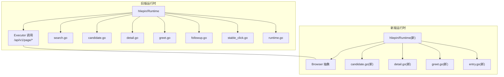
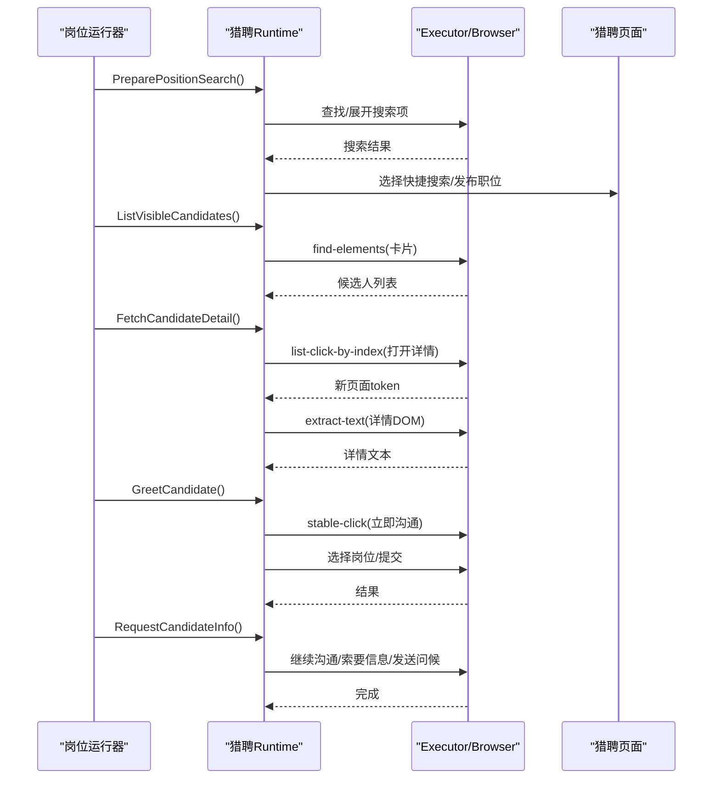
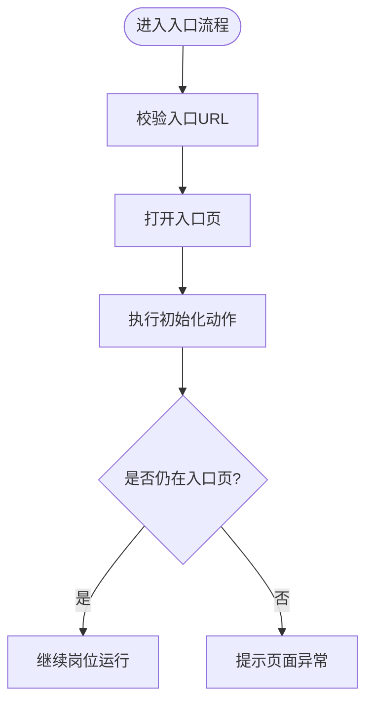
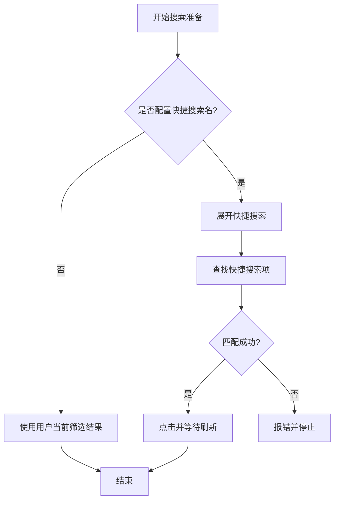
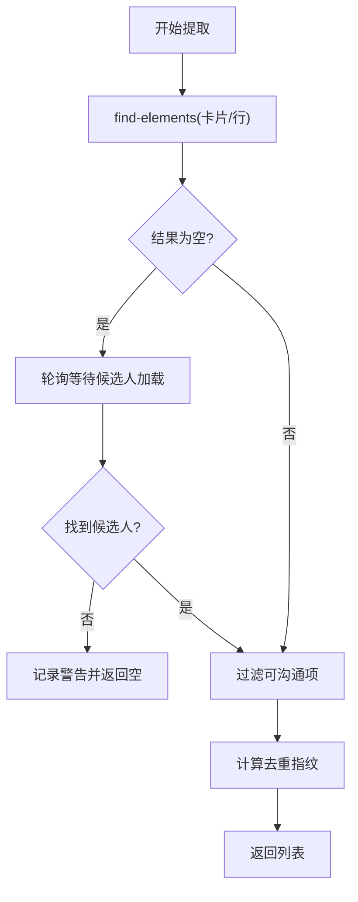
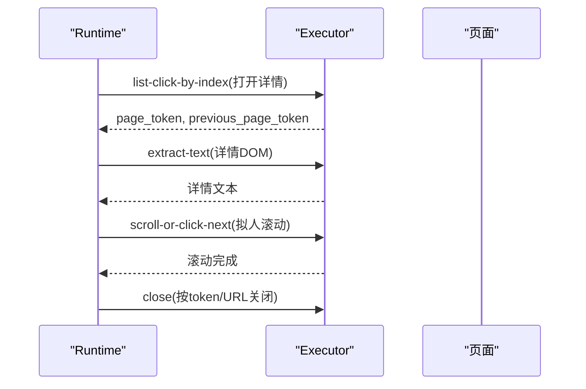
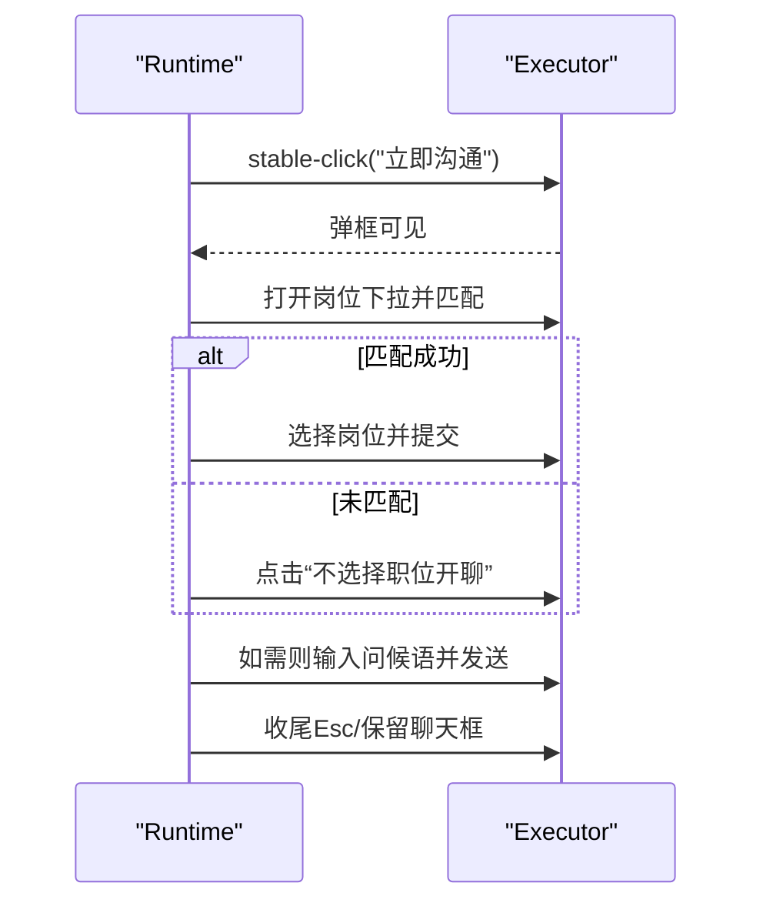
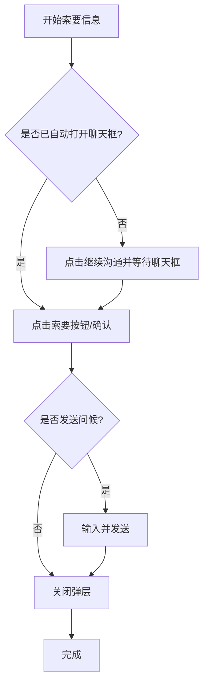
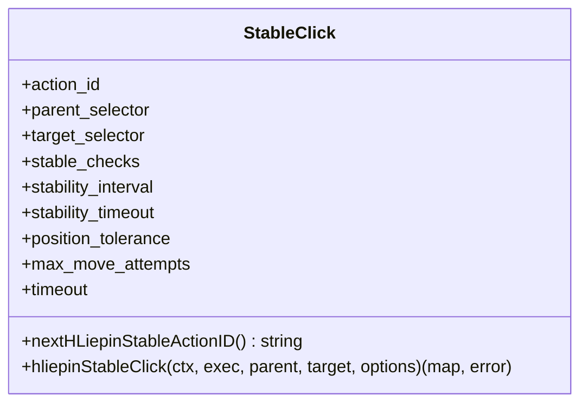
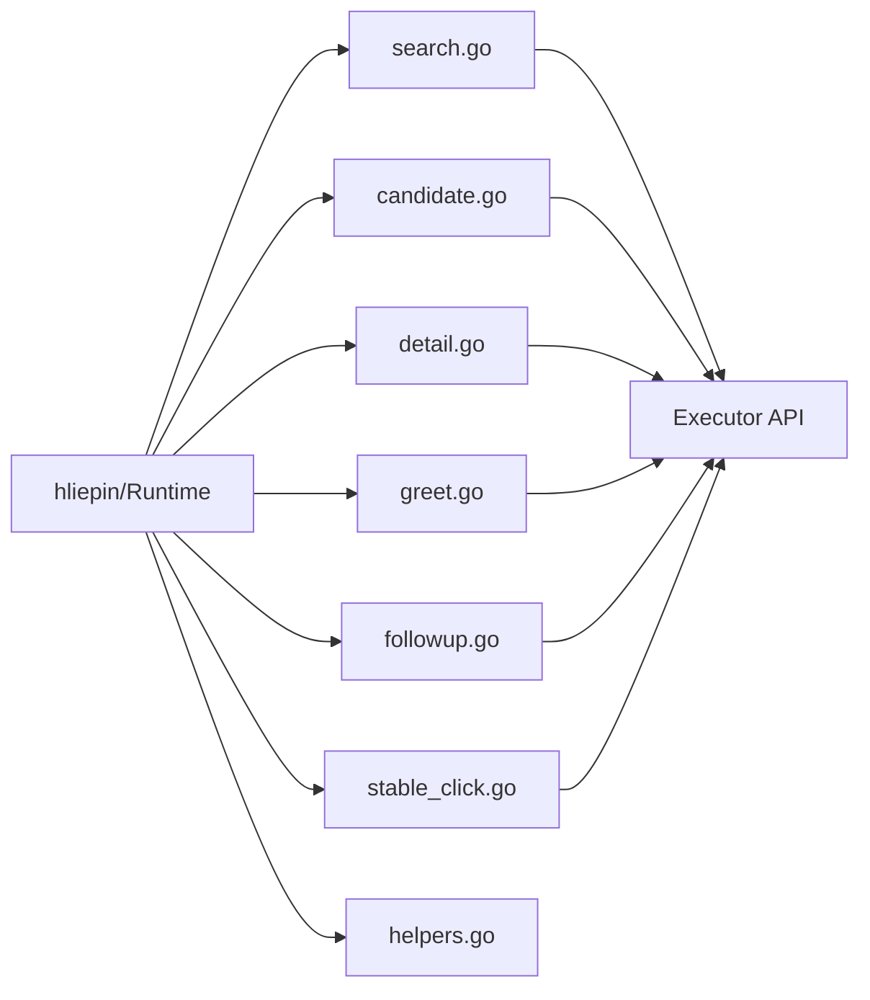

# 猎聘适配器

<cite>
**本文引用的文件**
- [entry.go](file://goodhr5/local-agent-go/internal/platforms/hliepin/entry.go)
- [search.go](file://goodhr5/local-agent-go/internal/platforms/hliepin/search.go)
- [candidate.go](file://goodhr5/local-agent-go/internal/platforms/hliepin/candidate.go)
- [detail.go](file://goodhr5/local-agent-go/internal/platforms/hliepin/detail.go)
- [greet.go](file://goodhr5/local-agent-go/internal/platforms/hliepin/greet.go)
- [followup.go](file://goodhr5/local-agent-go/internal/platforms/hliepin/followup.go)
- [stable_click.go](file://goodhr5/local-agent-go/internal/platforms/hliepin/stable_click.go)
- [helpers.go](file://goodhr5/local-agent-go/internal/platforms/hliepin/helpers.go)
- [runtime.go](file://goodhr5/local-agent-go/internal/platforms/hliepin/runtime.go)
- [hliepin/entry.go（新版本）](file://goodhr5/local-agent-go/internal/platform/hliepin/entry.go)
- [hliepin/candidate.go（新版本）](file://goodhr5/local-agent-go/internal/platform/hliepin/candidate.go)
- [hliepin/detail.go（新版本）](file://goodhr5/local-agent-go/internal/platform/hliepin/detail.go)
- [hliepin/greet.go（新版本）](file://goodhr5/local-agent-go/internal/platform/hliepin/greet.go)
</cite>

## 目录
1. [简介](#简介)
2. [项目结构](#项目结构)
3. [核心组件](#核心组件)
4. [架构总览](#架构总览)
5. [详细组件分析](#详细组件分析)
6. [依赖关系分析](#依赖关系分析)
7. [性能与稳定性](#性能与稳定性)
8. [故障排查指南](#故障排查指南)
9. [结论](#结论)
10. [附录：集成测试与自动化验证](#附录集成测试与自动化验证)

## 简介
本文件面向猎聘平台适配器的实现，覆盖页面架构、数据加载机制、异步操作处理、职位搜索算法、候选人信息提取、简历内容解析、智能问候生成与后续跟进策略。同时说明稳定点击技术、页面滚动优化、元素等待机制、错误恢复策略，以及猎聘平台特有的业务规则、验证码处理、会话管理与性能调优方案，并提供集成测试与自动化验证方法建议。

## 项目结构
猎聘适配器在两套运行时中均有实现：
- 旧版本地代理（local-agent-go）：通过 Executor 调用 Worker API，完成页面查找、点击、滚动、文本提取等动作。
- 新版本地代理（local-agent-go）：通过 Browser 抽象与通用能力（common），以声明式配置驱动页面交互。

图表来源
- [entry.go:12-44](file://goodhr5/local-agent-go/internal/platforms/hliepin/entry.go#L12-L44)
- [search.go:22-54](file://goodhr5/local-agent-go/internal/platforms/hliepin/search.go#L22-L54)
- [candidate.go:14-79](file://goodhr5/local-agent-go/internal/platforms/hliepin/candidate.go#L14-L79)
- [detail.go:14-56](file://goodhr5/local-agent-go/internal/platforms/hliepin/detail.go#L14-L56)
- [greet.go:20-97](file://goodhr5/local-agent-go/internal/platforms/hliepin/greet.go#L20-L97)
- [followup.go:46-130](file://goodhr5/local-agent-go/internal/platforms/hliepin/followup.go#L46-L130)
- [stable_click.go:46-81](file://goodhr5/local-agent-go/internal/platforms/hliepin/stable_click.go#L46-L81)
- [hliepin/entry.go（新版本）:11-52](file://goodhr5/local-agent-go/internal/platform/hliepin/entry.go#L11-L52)
- [hliepin/candidate.go（新版本）:12-93](file://goodhr5/local-agent-go/internal/platform/hliepin/candidate.go#L12-L93)
- [hliepin/detail.go（新版本）:14-66](file://goodhr5/local-agent-go/internal/platform/hliepin/detail.go#L14-L66)
- [hliepin/greet.go（新版本）:18-80](file://goodhr5/local-agent-go/internal/platform/hliepin/greet.go#L18-L80)

章节来源
- [entry.go:12-44](file://goodhr5/local-agent-go/internal/platforms/hliepin/entry.go#L12-L44)
- [hliepin/entry.go（新版本）:11-52](file://goodhr5/local-agent-go/internal/platform/hliepin/entry.go#L11-L52)

## 核心组件
- 入口与页面管理：打开登录页、找人页、消息页；判断是否处于岗位运行入口页；清理遗留弹层。
- 搜索与筛选：快捷搜索与发布职位选择；隐藏条件勾选；当前页面手动筛选保留。
- 候选人列表：可见项提取、去重指纹、翻页推进、滚动加载。
- 详情读取：打开详情页、DOM 文本提取、拟人滚动浏览、关闭并返回原标签页。
- 打招呼与跟进：开聊弹框处理、岗位匹配、发送问候语、索要联系方式/微信/简历、关闭多余弹层。
- 稳定点击：基于唯一父级与目标定位，位置稳定后只点击一次，支持重试与诊断。
- 辅助工具：Worker 响应解析、元素定位转换、日志格式化、候选人名/年龄提取。

章节来源
- [search.go:22-54](file://goodhr5/local-agent-go/internal/platforms/hliepin/search.go#L22-L54)
- [candidate.go:14-79](file://goodhr5/local-agent-go/internal/platforms/hliepin/candidate.go#L14-L79)
- [detail.go:14-56](file://goodhr5/local-agent-go/internal/platforms/hliepin/detail.go#L14-L56)
- [greet.go:20-97](file://goodhr5/local-agent-go/internal/platforms/hliepin/greet.go#L20-L97)
- [followup.go:46-130](file://goodhr5/local-agent-go/internal/platforms/hliepin/followup.go#L46-L130)
- [stable_click.go:46-81](file://goodhr5/local-agent-go/internal/platforms/hliepin/stable_click.go#L46-L81)
- [helpers.go:75-180](file://goodhr5/local-agent-go/internal/platforms/hliepin/helpers.go#L75-L180)
- [runtime.go:10-51](file://goodhr5/local-agent-go/internal/platforms/hliepin/runtime.go#L10-L51)

## 架构总览
猎聘适配器采用“平台运行时 + 执行器/浏览器”的分层设计：
- 运行时负责业务编排与平台特定逻辑。
- 执行器或浏览器提供底层页面操作能力（查找、点击、滚动、输入、截图、页面切换）。
- 通用能力（新版本）封装了重复的交互模式，如弹窗关闭、元素等待、滚动到可见等。

图表来源
- [search.go:22-54](file://goodhr5/local-agent-go/internal/platforms/hliepin/search.go#L22-L54)
- [candidate.go:14-79](file://goodhr5/local-agent-go/internal/platforms/hliepin/candidate.go#L14-L79)
- [detail.go:14-56](file://goodhr5/local-agent-go/internal/platforms/hliepin/detail.go#L14-L56)
- [greet.go:20-97](file://goodhr5/local-agent-go/internal/platforms/hliepin/greet.go#L20-L97)
- [followup.go:46-130](file://goodhr5/local-agent-go/internal/platforms/hliepin/followup.go#L46-L130)

## 详细组件分析

### 页面入口与初始化
- 打开入口页：校验配置中的入口 URL，通过执行器打开页面。
- 准备入口页：猎头端会刷新候选人条件，岗位选择与隐藏筛选统一在搜索完成后执行。
- 判断入口页：获取当前页面列表，比对是否为配置的入口页。

图表来源
- [entry.go:12-44](file://goodhr5/local-agent-go/internal/platforms/hliepin/entry.go#L12-L44)
- [hliepin/entry.go（新版本）:11-52](file://goodhr5/local-agent-go/internal/platform/hliepin/entry.go#L11-L52)

章节来源
- [entry.go:12-44](file://goodhr5/local-agent-go/internal/platforms/hliepin/entry.go#L12-L44)
- [hliepin/entry.go（新版本）:11-52](file://goodhr5/local-agent-go/internal/platform/hliepin/entry.go#L11-L52)

### 职位搜索与筛选
- 准备搜索：保留岗位上下文，不再自动改变用户手动设置的搜索和筛选条件；若未配置快捷搜索名称，则使用当前页面筛选结果。
- 快捷搜索：展开快捷搜索列表，按完整名称匹配并点击；等待结果刷新。
- 发布职位：展开正在发布的职位，按岗位名称匹配（含截断兼容），点击并等待刷新。
- 隐藏条件：按配置勾选“隐藏已查看/已沟通/已获取联系方式”，必要时回到顶部再勾选。

图表来源
- [search.go:22-54](file://goodhr5/local-agent-go/internal/platforms/hliepin/search.go#L22-L54)
- [search.go:56-123](file://goodhr5/local-agent-go/internal/platforms/hliepin/search.go#L56-L123)
- [search.go:146-183](file://goodhr5/local-agent-go/internal/platforms/hliepin/search.go#L146-L183)

章节来源
- [search.go:22-54](file://goodhr5/local-agent-go/internal/platforms/hliepin/search.go#L22-L54)
- [search.go:56-123](file://goodhr5/local-agent-go/internal/platforms/hliepin/search.go#L56-L123)
- [search.go:146-183](file://goodhr5/local-agent-go/internal/platforms/hliepin/search.go#L146-L183)

### 候选人列表提取与翻页
- 可见候选人提取：优先使用配置卡片字段，首次为空时回退到表格行并轮询等待“立即沟通”出现；过滤不含“立即沟通/继续沟通”的行。
- 去重指纹：优先使用稳定的平台候选人 ID；否则基于姓名、年龄与稳定文本计算哈希。
- 翻页推进：根据行为配置决定滚动或点击下一页，带禁用状态检测与等待。

图表来源
- [candidate.go:14-79](file://goodhr5/local-agent-go/internal/platforms/hliepin/candidate.go#L14-L79)
- [candidate.go:81-98](file://goodhr5/local-agent-go/internal/platforms/hliepin/candidate.go#L81-L98)

章节来源
- [candidate.go:14-79](file://goodhr5/local-agent-go/internal/platforms/hliepin/candidate.go#L14-L79)
- [candidate.go:81-98](file://goodhr5/local-agent-go/internal/platforms/hliepin/candidate.go#L81-L98)

### 详情读取与浏览
- 打开详情：通过索引点击候选人行目标链接，等待新页面打开并记录 token。
- 提取 DOM：仅支持 DOM 模式；提取详情文本并清理两端空白。
- 拟人滚动：使用连续滚轮在随机时长内滚动到底部，模拟人类浏览。
- 关闭详情：根据 token 与 URL 特征安全关闭并返回原列表页。

图表来源
- [detail.go:14-56](file://goodhr5/local-agent-go/internal/platforms/hliepin/detail.go#L14-L56)
- [detail.go:58-90](file://goodhr5/local-agent-go/internal/platforms/hliepin/detail.go#L58-L90)

章节来源
- [detail.go:14-56](file://goodhr5/local-agent-go/internal/platforms/hliepin/detail.go#L14-L56)
- [detail.go:58-90](file://goodhr5/local-agent-go/internal/platforms/hliepin/detail.go#L58-L90)

### 打招呼与智能问候
- 前置清理：关闭遗留的开聊弹框、聊天框与联系人抽屉，避免串台。
- 点击立即沟通：在候选人行内定位“立即沟通”，等待开聊弹框出现。
- 岗位匹配：若需选择岗位，则打开下拉列表并匹配职位名称（支持截断与省略号）；未匹配则点击“不选择职位开聊”。
- 提交开聊：点击“立即开聊”，随后根据是否需要索要信息决定是否保留自动打开的聊天框。
- 智能问候：在需要时输入问候语并发送。

图表来源
- [greet.go:20-97](file://goodhr5/local-agent-go/internal/platforms/hliepin/greet.go#L20-L97)
- [greet.go:128-178](file://goodhr5/local-agent-go/internal/platforms/hliepin/greet.go#L128-L178)
- [greet.go:224-234](file://goodhr5/local-agent-go/internal/platforms/hliepin/greet.go#L224-L234)

章节来源
- [greet.go:20-97](file://goodhr5/local-agent-go/internal/platforms/hliepin/greet.go#L20-L97)
- [greet.go:128-178](file://goodhr5/local-agent-go/internal/platforms/hliepin/greet.go#L128-L178)
- [greet.go:224-234](file://goodhr5/local-agent-go/internal/platforms/hliepin/greet.go#L224-L234)

### 后续跟进：索要信息与消息发送
- 复用聊天框：若打招呼已自动打开当前候选人聊天框，直接复用，不再重复点击“继续沟通”。
- 打开聊天框：否则点击“继续沟通”，等待聊天框打开且姓名匹配。
- 索要信息：依次点击“索要手机/微信/简历”，出现确认弹框则点击确定。
- 发送问候：输入并发送岗位首次问候语。
- 弹层收尾：持续检查并关闭聊天框与联系人抽屉，直到状态稳定干净。

图表来源
- [followup.go:46-130](file://goodhr5/local-agent-go/internal/platforms/hliepin/followup.go#L46-L130)
- [followup.go:132-197](file://goodhr5/local-agent-go/internal/platforms/hliepin/followup.go#L132-L197)
- [followup.go:199-231](file://goodhr5/local-agent-go/internal/platforms/hliepin/followup.go#L199-L231)
- [followup.go:233-368](file://goodhr5/local-agent-go/internal/platforms/hliepin/followup.go#L233-L368)

章节来源
- [followup.go:46-130](file://goodhr5/local-agent-go/internal/platforms/hliepin/followup.go#L46-L130)
- [followup.go:132-197](file://goodhr5/local-agent-go/internal/platforms/hliepin/followup.go#L132-L197)
- [followup.go:199-231](file://goodhr5/local-agent-go/internal/platforms/hliepin/followup.go#L199-L231)
- [followup.go:233-368](file://goodhr5/local-agent-go/internal/platforms/hliepin/followup.go#L233-L368)

### 稳定点击技术
- 唯一父级：基于稳定的简历 ID 构造行父级选择器，禁止退回全局按钮选择器。
- 位置稳定：多次检查目标位置稳定后再点击，限制最大移动次数。
- 单次点击：保证只执行一次点击，避免重复触发。
- 诊断追踪：为每次稳定点击生成动作 ID，记录重试次数与实际点击次数。

图表来源
- [stable_click.go:32-81](file://goodhr5/local-agent-go/internal/platforms/hliepin/stable_click.go#L32-L81)

章节来源
- [stable_click.go:32-81](file://goodhr5/local-agent-go/internal/platforms/hliepin/stable_click.go#L32-L81)

### 助手与运行时
- 运行时：维护平台标识、当前岗位、是否必须选择开聊岗位等状态。
- 助手：Worker 响应解析、元素定位转换、候选人名/年龄提取、日志格式化等。

章节来源
- [runtime.go:10-51](file://goodhr5/local-agent-go/internal/platforms/hliepin/runtime.go#L10-L51)
- [helpers.go:75-180](file://goodhr5/local-agent-go/internal/platforms/hliepin/helpers.go#L75-L180)

## 依赖关系分析
- 模块耦合：各功能文件围绕 Runtime 实例组织，通过 Executor/Browser 解耦底层页面操作。
- 外部依赖：云端平台配置（PlatformConfig）、Worker API（/api/v1/page/*）、浏览器抽象（新版本）。
- 循环依赖：未发现循环导入；模块职责清晰，便于独立测试与维护。

图表来源
- [runtime.go:10-51](file://goodhr5/local-agent-go/internal/platforms/hliepin/runtime.go#L10-L51)
- [search.go:22-54](file://goodhr5/local-agent-go/internal/platforms/hliepin/search.go#L22-L54)
- [candidate.go:14-79](file://goodhr5/local-agent-go/internal/platforms/hliepin/candidate.go#L14-L79)
- [detail.go:14-56](file://goodhr5/local-agent-go/internal/platforms/hliepin/detail.go#L14-L56)
- [greet.go:20-97](file://goodhr5/local-agent-go/internal/platforms/hliepin/greet.go#L20-L97)
- [followup.go:46-130](file://goodhr5/local-agent-go/internal/platforms/hliepin/followup.go#L46-L130)
- [stable_click.go:46-81](file://goodhr5/local-agent-go/internal/platforms/hliepin/stable_click.go#L46-L81)

章节来源
- [runtime.go:10-51](file://goodhr5/local-agent-go/internal/platforms/hliepin/runtime.go#L10-L51)

## 性能与稳定性
- 元素等待机制：
  - 轮询等待：开聊弹框、候选人列表加载、索要按钮渲染等场景采用短间隔轮询，避免固定延迟导致的时序问题。
  - 超时控制：关键步骤设置超时与重试，确保整体流程健壮。
- 页面滚动优化：
  - 详情页拟人滚动：随机时长与连续滚轮，降低被反爬识别风险。
  - 列表翻页：根据行为配置选择滚动或点击下一页，带禁用状态检测。
- 错误恢复策略：
  - 前置清理：在进入关键操作前关闭遗留弹层，防止串台。
  - 兜底关闭：失败路径中尝试关闭开聊弹框、聊天框与联系人抽屉，确保页面状态干净。
- 性能调优建议：
  - 合理设置轮询间隔与超时，避免过度请求。
  - 使用稳定选择器与唯一父级，减少误判与重算。
  - 批量读取字段，减少多次网络往返。

[本节为通用指导，无需具体文件引用]

## 故障排查指南
- 常见问题定位：
  - 候选人列表为空：检查 selector 与页面结构变化，必要时启用回退选择器并等待加载。
  - 开聊弹框未出现：检查稳定点击参数与等待时间，确认前置清理是否生效。
  - 岗位匹配失败：核对职位名称规范化逻辑与页面显示截断情况。
  - 聊天框串台：检查姓名匹配与弹层数量校验，及时清理多余弹层。
- 日志与诊断：
  - 利用稳定点击的动作 ID 与耗时统计，定位慢点与失败点。
  - 关注 Worker 响应 data 字段与错误堆栈，结合页面 URL 与元素列表进行复盘。

章节来源
- [greet.go:164-205](file://goodhr5/local-agent-go/internal/platforms/hliepin/greet.go#L164-L205)
- [followup.go:233-368](file://goodhr5/local-agent-go/internal/platforms/hliepin/followup.go#L233-L368)
- [stable_click.go:46-81](file://goodhr5/local-agent-go/internal/platforms/hliepin/stable_click.go#L46-L81)

## 结论
猎聘适配器通过分层架构与通用能力，实现了稳定的页面交互与数据处理。其核心优势在于：
- 明确的职责划分与模块化设计。
- 强大的等待与重试机制，提升鲁棒性。
- 针对猎聘平台的定制化优化（稳定点击、拟人滚动、弹层清理）。
建议在后续迭代中持续完善配置化选择器与更细粒度的监控指标，进一步提升可维护性与可观测性。

[本节为总结，无需具体文件引用]

## 附录：集成测试与自动化验证
- 单元测试建议：
  - 对匹配函数（如发布职位匹配、开聊岗位匹配）编写用例，覆盖截断、大小写、空白等边界。
  - 对指纹计算与姓名/年龄提取进行断言，确保去重与展示一致性。
- 端到端测试建议：
  - 使用沙箱环境模拟猎聘页面，验证入口打开、搜索、列表提取、详情读取、打招呼与跟进全流程。
  - 注入异常（如弹框未出现、页面结构变化），验证错误恢复与兜底关闭逻辑。
- 自动化验证要点：
  - 使用稳定选择器与唯一父级，避免 UI 微调导致的不稳定。
  - 记录关键步骤的耗时与重试次数，作为回归基准。
  - 对配置变更（如选择器、行为开关）进行灰度验证与回滚预案。

[本节为方法论建议，无需具体文件引用]