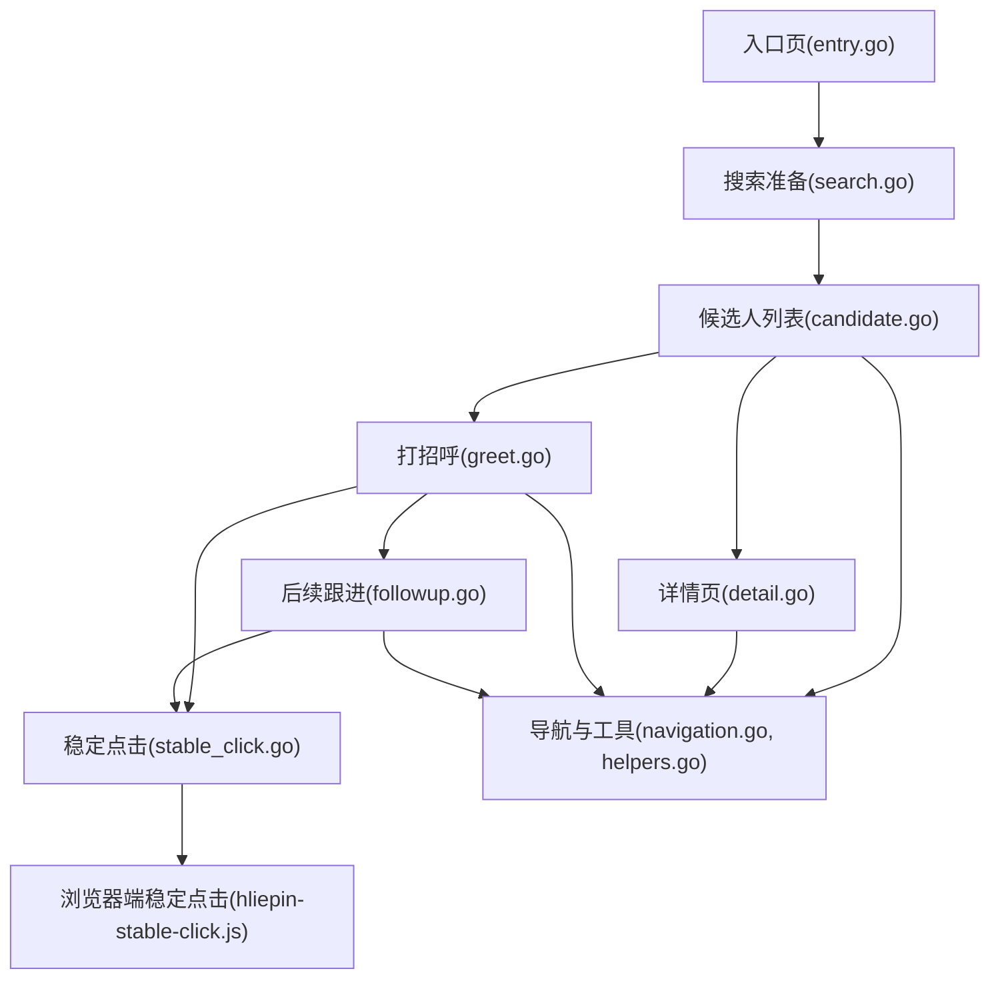
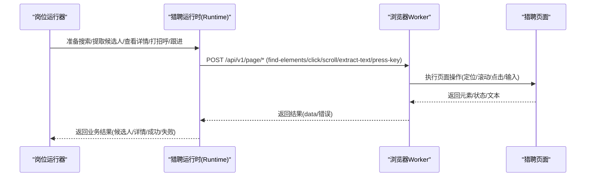
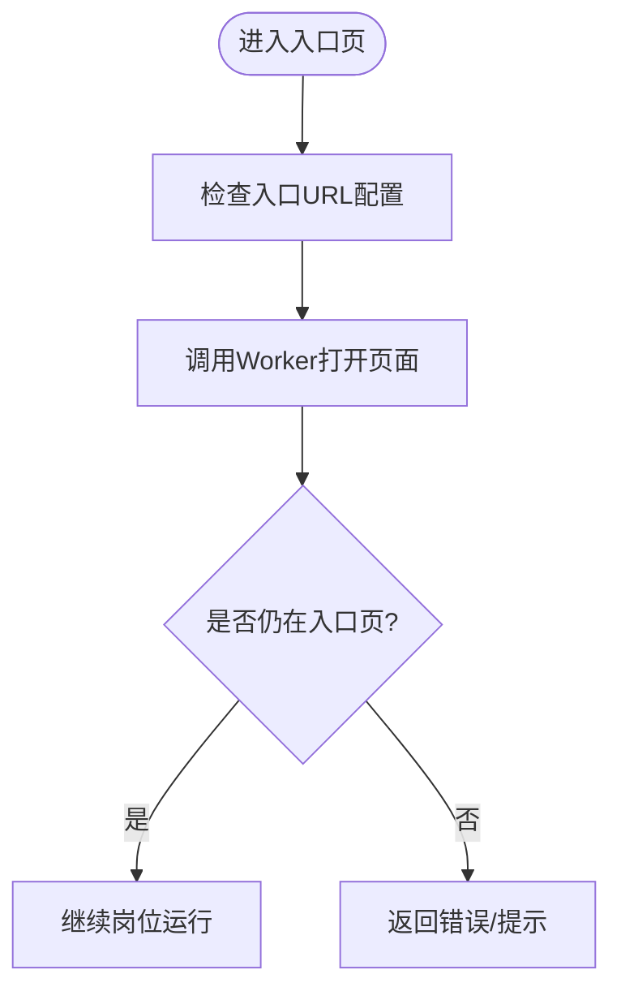
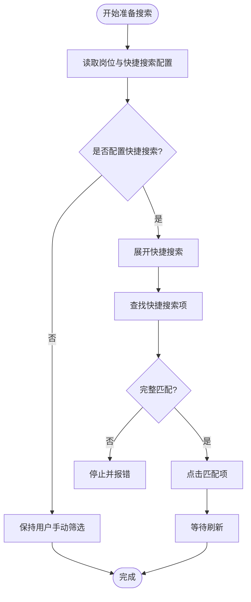
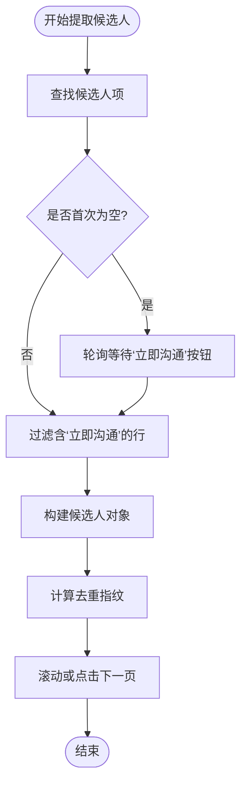
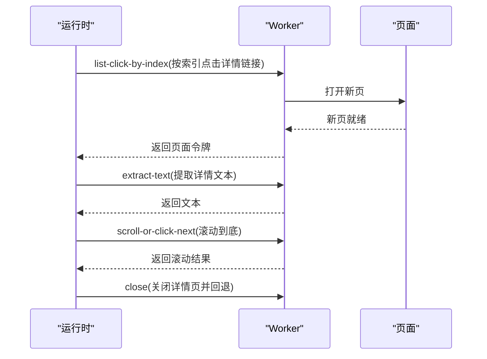
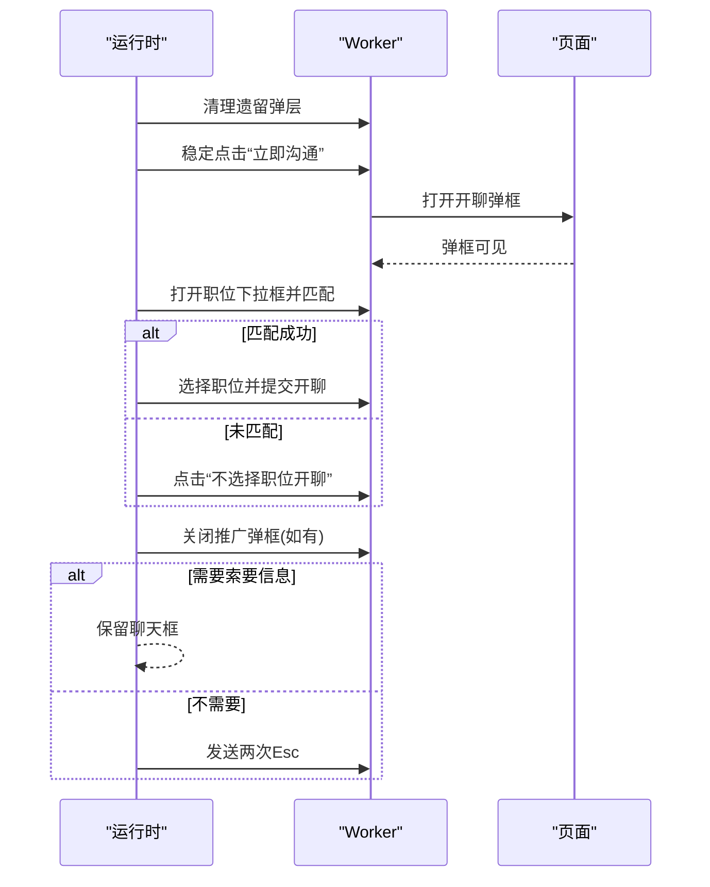
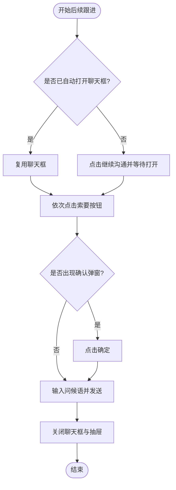
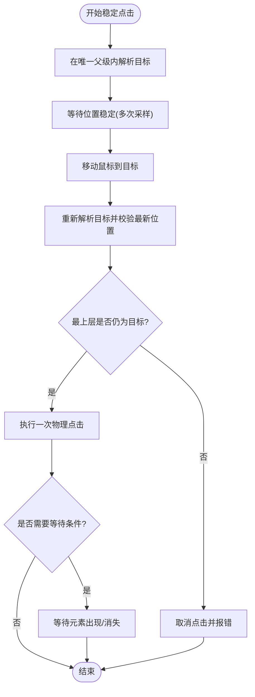
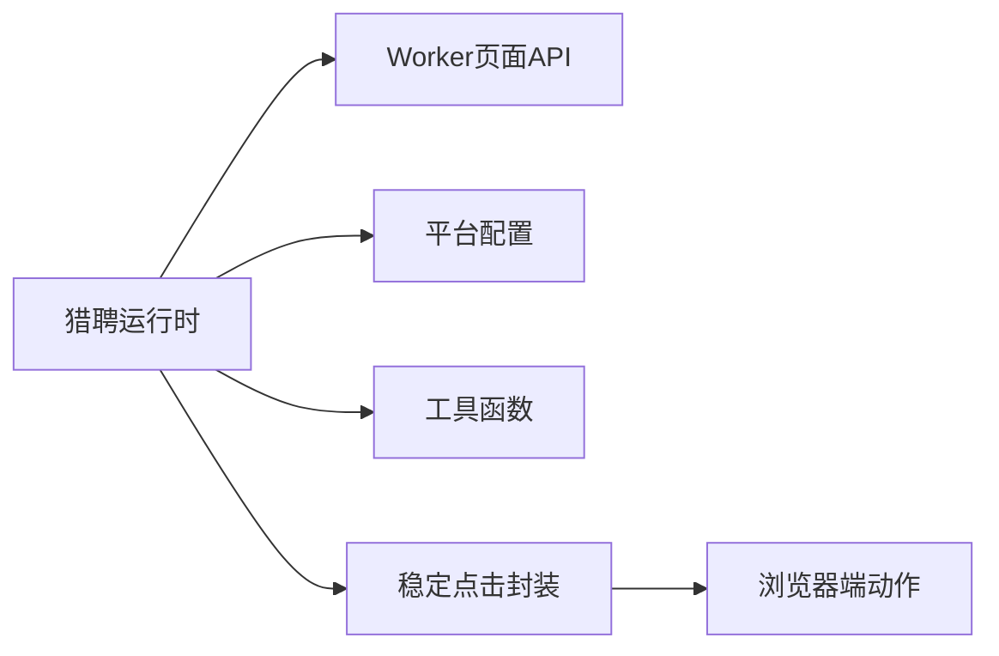

# 猎聘适配器

<cite>
**本文引用的文件**
- [entry.go](file://goodhr5/local-agent-go/internal/platforms/hliepin/entry.go)
- [search.go](file://goodhr5/local-agent-go/internal/platforms/hliepin/search.go)
- [stable_click.go](file://goodhr5/local-agent-go/internal/platforms/hliepin/stable_click.go)
- [navigation.go](file://goodhr5/local-agent-go/internal/platforms/hliepin/navigation.go)
- [runtime.go](file://goodhr5/local-agent-go/internal/platforms/hliepin/runtime.go)
- [candidate.go](file://goodhr5/local-agent-go/internal/platforms/hliepin/candidate.go)
- [detail.go](file://goodhr5/local-agent-go/internal/platforms/hliepin/detail.go)
- [greet.go](file://goodhr5/local-agent-go/internal/platforms/hliepin/greet.go)
- [followup.go](file://goodhr5/local-agent-go/internal/platforms/hliepin/followup.go)
- [helpers.go](file://goodhr5/local-agent-go/internal/platforms/hliepin/helpers.go)
- [hliepin-stable-click.js](file://goodhr5/local-agent-go/worker-node/src/hliepin-stable-click.js)
- [runtime_test.go](file://goodhr5/local-agent-go/internal/platforms/hliepin/runtime_test.go)
</cite>

## 目录
1. [简介](#简介)
2. [项目结构](#项目结构)
3. [核心组件](#核心组件)
4. [架构总览](#架构总览)
5. [详细组件分析](#详细组件分析)
6. [依赖关系分析](#依赖关系分析)
7. [性能考虑](#性能考虑)
8. [故障排查指南](#故障排查指南)
9. [结论](#结论)
10. [附录](#附录)

## 简介
本文件为猎聘平台适配器的技术文档，聚焦以下目标：
- 页面架构与数据加载机制：候选人列表、详情页、开聊弹框、聊天框与联系人抽屉的识别与交互。
- 异步操作处理：等待元素稳定、轮询渲染、弹窗出现/消失、页面切换与回退。
- 职位搜索算法：快捷搜索与发布职位匹配策略、隐藏筛选项（当前由用户手动设置）。
- 候选人信息提取与简历解析：DOM 文本提取、指纹去重、字段定位与回退选择器。
- 智能问候生成与后续跟进：打招呼流程、索要联系方式/微信/简历、发送问候语、自动收尾。
- 稳定点击技术：父子唯一选择器、位置稳定性校验、遮挡检测、单次物理点击。
- 滚动优化与元素等待：拟人化滚动、到达底部判定、超时与轮询策略。
- 错误恢复策略：异常关闭遗留弹层、重试边界、失败不重复点击候选人的幂等设计。
- 业务规则与验证码/会话管理：入口页判断、页面列表接口、URL片段识别、Esc兜底。
- 集成测试与自动化验证：单元测试覆盖关键路径、模拟执行器与断言要点。

## 项目结构
猎聘适配器位于本地 Agent 的平台实现目录中，按职责拆分为多个文件：
- entry.go：入口页打开与判断。
- search.go：岗位运行前的搜索准备（快捷搜索/发布职位匹配逻辑保留但默认停用自动勾选）。
- candidate.go：候选人列表提取、滚动翻页、指纹去重。
- detail.go：详情页 DOM 文本读取、滚动到底、关闭详情。
- greet.go：开聊弹框处理、岗位选择、立即开聊、推广弹框清理。
- followup.go：索要信息（手机/微信/简历）、发送问候语、聊天框与抽屉状态管理与收尾。
- stable_click.go：猎聘专用稳定点击封装。
- navigation.go：入口页配置解析、页面匹配、名称规范化等工具。
- helpers.go：通用工具函数、Worker 响应解析、平台配置读取。
- worker-node 侧 hliepin-stable-click.js：浏览器端稳定点击动作实现。
- runtime_test.go：针对各模块的单元测试。

图表来源
- [entry.go:13-44](file://goodhr5/local-agent-go/internal/platforms/hliepin/entry.go#L13-L44)
- [search.go:23-54](file://goodhr5/local-agent-go/internal/platforms/hliepin/search.go#L23-L54)
- [candidate.go:15-79](file://goodhr5/local-agent-go/internal/platforms/hliepin/candidate.go#L15-L79)
- [detail.go:15-56](file://goodhr5/local-agent-go/internal/platforms/hliepin/detail.go#L15-L56)
- [greet.go:31-110](file://goodhr5/local-agent-go/internal/platforms/hliepin/greet.go#L31-L110)
- [followup.go:51-141](file://goodhr5/local-agent-go/internal/platforms/hliepin/followup.go#L51-L141)
- [stable_click.go:47-81](file://goodhr5/local-agent-go/internal/platforms/hliepin/stable_click.go#L47-L81)
- [hliepin-stable-click.js:40-232](file://goodhr5/local-agent-go/worker-node/src/hliepin-stable-click.js#L40-L232)

章节来源
- [entry.go:13-44](file://goodhr5/local-agent-go/internal/platforms/hliepin/entry.go#L13-L44)
- [search.go:23-54](file://goodhr5/local-agent-go/internal/platforms/hliepin/search.go#L23-L54)
- [candidate.go:15-79](file://goodhr5/local-agent-go/internal/platforms/hliepin/candidate.go#L15-L79)
- [detail.go:15-56](file://goodhr5/local-agent-go/internal/platforms/hliepin/detail.go#L15-L56)
- [greet.go:31-110](file://goodhr5/local-agent-go/internal/platforms/hliepin/greet.go#L31-L110)
- [followup.go:51-141](file://goodhr5/local-agent-go/internal/platforms/hliepin/followup.go#L51-L141)
- [stable_click.go:47-81](file://goodhr5/local-agent-go/internal/platforms/hliepin/stable_click.go#L47-L81)
- [hliepin-stable-click.js:40-232](file://goodhr5/local-agent-go/worker-node/src/hliepin-stable-click.js#L40-L232)

## 核心组件
- 运行时 Runtime：维护平台标识、当前岗位名、是否需要在开聊弹框中选择岗位等上下文。
- 候选人提取：基于配置或回退选择器抓取可见候选人，过滤“立即沟通”按钮，生成去重指纹。
- 详情页读取：仅支持 DOM 模式，打开新页后提取文本并滚动到底。
- 打招呼流程：清理遗留弹层、稳定点击“立即沟通”，等待开聊弹框，选择或不选择岗位，提交开聊，必要时关闭推广弹框。
- 后续跟进：复用已打开聊天框或重新打开，依次点击索要按钮，确认弹窗，输入并发送问候语，最终关闭聊天框和联系人抽屉。
- 稳定点击：在唯一父级内定位唯一目标，等待位置稳定，移动鼠标后复核，最后执行一次物理点击。

章节来源
- [runtime.go:11-19](file://goodhr5/local-agent-go/internal/platforms/hliepin/runtime.go#L11-L19)
- [candidate.go:15-79](file://goodhr5/local-agent-go/internal/platforms/hliepin/candidate.go#L15-L79)
- [detail.go:15-56](file://goodhr5/local-agent-go/internal/platforms/hliepin/detail.go#L15-L56)
- [greet.go:31-110](file://goodhr5/local-agent-go/internal/platforms/hliepin/greet.go#L31-L110)
- [followup.go:51-141](file://goodhr5/local-agent-go/internal/platforms/hliepin/followup.go#L51-L141)
- [stable_click.go:47-81](file://goodhr5/local-agent-go/internal/platforms/hliepin/stable_click.go#L47-L81)

## 架构总览
猎聘适配器通过本地运行时调用 Worker 提供的页面能力（查找元素、点击、滚动、提取文本、按键等），并在浏览器端使用稳定点击动作确保在弹层动画与遮挡场景下的可靠交互。

图表来源
- [candidate.go:15-79](file://goodhr5/local-agent-go/internal/platforms/hliepin/candidate.go#L15-L79)
- [detail.go:15-56](file://goodhr5/local-agent-go/internal/platforms/hliepin/detail.go#L15-L56)
- [greet.go:31-110](file://goodhr5/local-agent-go/internal/platforms/hliepin/greet.go#L31-L110)
- [followup.go:51-141](file://goodhr5/local-agent-go/internal/platforms/hliepin/followup.go#L51-L141)
- [stable_click.go:47-81](file://goodhr5/local-agent-go/internal/platforms/hliepin/stable_click.go#L47-L81)
- [hliepin-stable-click.js:40-232](file://goodhr5/local-agent-go/worker-node/src/hliepin-stable-click.js#L40-L232)

## 详细组件分析

### 入口页与页面导航
- 打开入口页：校验云端配置中的入口 URL，并通过 Worker 打开页面。
- 判断是否在入口页：获取当前页面列表，取默认页并与配置的入口 URL 进行匹配（支持前缀/包含/精确匹配）。
- 名称与元素工具：岗位名称规范化、合并容器与项配置、读取平台配置分区与元素定位。

图表来源
- [entry.go:13-44](file://goodhr5/local-agent-go/internal/platforms/hliepin/entry.go#L13-L44)
- [navigation.go:7-65](file://goodhr5/local-agent-go/internal/platforms/hliepin/navigation.go#L7-L65)

章节来源
- [entry.go:13-44](file://goodhr5/local-agent-go/internal/platforms/hliepin/entry.go#L13-L44)
- [navigation.go:7-65](file://goodhr5/local-agent-go/internal/platforms/hliepin/navigation.go#L7-L65)

### 职位搜索与筛选
- 准备搜索：保留岗位上下文；默认不再自动选择发布职位或快捷搜索，也不自动勾选三项隐藏条件，交由用户手动设置。
- 快捷搜索匹配：展开快捷搜索列表，按完整名称匹配并点击；若未找到则报错停止。
- 发布职位匹配：展开正在发布的职位，优先完整匹配，否则去掉省略号后按前六个字匹配第一个命中项。
- 隐藏筛选：旧版本可配置勾选“隐藏已查看/已沟通/已获取联系方式”，当前默认停用自动勾选。

图表来源
- [search.go:23-54](file://goodhr5/local-agent-go/internal/platforms/hliepin/search.go#L23-L54)
- [search.go:57-123](file://goodhr5/local-agent-go/internal/platforms/hliepin/search.go#L57-L123)
- [search.go:125-183](file://goodhr5/local-agent-go/internal/platforms/hliepin/search.go#L125-L183)
- [search.go:185-247](file://goodhr5/local-agent-go/internal/platforms/hliepin/search.go#L185-L247)

章节来源
- [search.go:23-54](file://goodhr5/local-agent-go/internal/platforms/hliepin/search.go#L23-L54)
- [search.go:57-123](file://goodhr5/local-agent-go/internal/platforms/hliepin/search.go#L57-L123)
- [search.go:125-183](file://goodhr5/local-agent-go/internal/platforms/hliepin/search.go#L125-L183)
- [search.go:185-247](file://goodhr5/local-agent-go/internal/platforms/hliepin/search.go#L185-L247)

### 候选人列表提取与滚动
- 列表提取：优先使用配置中的卡片项选择器，若无则回退到表格行；首次为空时轮询等待“立即沟通”按钮出现。
- 过滤与命名：仅保留含“立即沟通”的行；姓名从文本或字段中提取，缺失时使用序号占位。
- 去重指纹：优先使用稳定的平台候选人 ID；否则基于姓名、年龄与稳定文本计算哈希。
- 滚动翻页：使用统一的滚动或下一页点击接口，直接点击下一页并等待加载。

图表来源
- [candidate.go:15-79](file://goodhr5/local-agent-go/internal/platforms/hliepin/candidate.go#L15-L79)
- [candidate.go:82-98](file://goodhr5/local-agent-go/internal/platforms/hliepin/candidate.go#L82-L98)
- [candidate.go:105-127](file://goodhr5/local-agent-go/internal/platforms/hliepin/candidate.go#L105-L127)

章节来源
- [candidate.go:15-79](file://goodhr5/local-agent-go/internal/platforms/hliepin/candidate.go#L15-L79)
- [candidate.go:82-98](file://goodhr5/local-agent-go/internal/platforms/hliepin/candidate.go#L82-L98)
- [candidate.go:105-127](file://goodhr5/local-agent-go/internal/platforms/hliepin/candidate.go#L105-L127)

### 详情页读取与滚动
- 详情页打开：仅支持 DOM 模式；按卡片索引点击链接，等待新页打开并记录页面令牌以便回退。
- 内容提取：读取详情页内容区域文本，若为空则报错。
- 滚动到底：使用连续滚轮在随机时长内滚动至底部，并校验到达底部。
- 关闭详情：根据 URL 片段识别目标页并关闭，回退到搜索列表页。

图表来源
- [detail.go:15-56](file://goodhr5/local-agent-go/internal/platforms/hliepin/detail.go#L15-L56)
- [detail.go:58-75](file://goodhr5/local-agent-go/internal/platforms/hliepin/detail.go#L58-L75)
- [detail.go:77-90](file://goodhr5/local-agent-go/internal/platforms/hliepin/detail.go#L77-L90)

章节来源
- [detail.go:15-56](file://goodhr5/local-agent-go/internal/platforms/hliepin/detail.go#L15-L56)
- [detail.go:58-75](file://goodhr5/local-agent-go/internal/platforms/hliepin/detail.go#L58-L75)
- [detail.go:77-90](file://goodhr5/local-agent-go/internal/platforms/hliepin/detail.go#L77-L90)

### 打招呼流程与智能问候
- 前置清理：关闭遗留的开聊弹框、推广弹框、聊天框与联系人抽屉，避免串台。
- 稳定点击“立即沟通”：在候选人行父级内定位目标，等待开聊弹框出现。
- 岗位选择：若需选择岗位，则打开下拉框并匹配职位名称；未匹配时点击“不选择职位开聊”。
- 提交开聊：点击“立即开聊”，随后等待并关闭偶发的推广弹框。
- 收尾策略：若非需要立即索要信息，则发送两次 Esc 关闭自动出现的聊天框；否则保留聊天框供后续流程接管。

图表来源
- [greet.go:31-110](file://goodhr5/local-agent-go/internal/platforms/hliepin/greet.go#L31-L110)
- [greet.go:118-143](file://goodhr5/local-agent-go/internal/platforms/hliepin/greet.go#L118-L143)
- [greet.go:145-179](file://goodhr5/local-agent-go/internal/platforms/hliepin/greet.go#L145-L179)
- [greet.go:181-251](file://goodhr5/local-agent-go/internal/platforms/hliepin/greet.go#L181-L251)
- [greet.go:297-334](file://goodhr5/local-agent-go/internal/platforms/hliepin/greet.go#L297-L334)

章节来源
- [greet.go:31-110](file://goodhr5/local-agent-go/internal/platforms/hliepin/greet.go#L31-L110)
- [greet.go:118-143](file://goodhr5/local-agent-go/internal/platforms/hliepin/greet.go#L118-L143)
- [greet.go:145-179](file://goodhr5/local-agent-go/internal/platforms/hliepin/greet.go#L145-L179)
- [greet.go:181-251](file://goodhr5/local-agent-go/internal/platforms/hliepin/greet.go#L181-L251)
- [greet.go:297-334](file://goodhr5/local-agent-go/internal/platforms/hliepin/greet.go#L297-L334)

### 后续跟进：索要信息与发送问候
- 复用聊天框：每100毫秒检查是否已自动打开当前候选人的聊天框，存在则直接复用。
- 打开聊天框：若未复用，则点击“继续沟通”，等待聊天框打开且姓名匹配当前候选人。
- 索要信息：按配置依次点击索要手机/微信/简历按钮，若出现确认弹窗则点击确定。
- 发送问候：输入问候语并按 Enter 发送。
- 收尾：关闭聊天框与联系人抽屉，直到连续多次检测到干净状态。

图表来源
- [followup.go:51-141](file://goodhr5/local-agent-go/internal/platforms/hliepin/followup.go#L51-L141)
- [followup.go:143-175](file://goodhr5/local-agent-go/internal/platforms/hliepin/followup.go#L143-L175)
- [followup.go:177-242](file://goodhr5/local-agent-go/internal/platforms/hliepin/followup.go#L177-L242)
- [followup.go:320-378](file://goodhr5/local-agent-go/internal/platforms/hliepin/followup.go#L320-L378)

章节来源
- [followup.go:51-141](file://goodhr5/local-agent-go/internal/platforms/hliepin/followup.go#L51-L141)
- [followup.go:143-175](file://goodhr5/local-agent-go/internal/platforms/hliepin/followup.go#L143-L175)
- [followup.go:177-242](file://goodhr5/local-agent-go/internal/platforms/hliepin/followup.go#L177-L242)
- [followup.go:320-378](file://goodhr5/local-agent-go/internal/platforms/hliepin/followup.go#L320-L378)

### 稳定点击技术实现
- 父子唯一选择器：以候选人行为父级，构造唯一父级选择器，禁止退回全局按钮选择器。
- 位置稳定：连续读取元素边界框，达到指定次数稳定后认为弹层动画结束。
- 鼠标移动与复核：移动到目标后再次解析目标并校验最新位置，防止位移导致误点。
- 遮挡检测：在点击前进行 hit-test，确保最上层元素仍为目标。
- 单次点击：仅执行一次物理点击，并可选择等待某元素出现或消失。

图表来源
- [stable_click.go:47-81](file://goodhr5/local-agent-go/internal/platforms/hliepin/stable_click.go#L47-L81)
- [hliepin-stable-click.js:51-97](file://goodhr5/local-agent-go/worker-node/src/hliepin-stable-click.js#L51-L97)
- [hliepin-stable-click.js:99-122](file://goodhr5/local-agent-go/worker-node/src/hliepin-stable-click.js#L99-L122)
- [hliepin-stable-click.js:124-229](file://goodhr5/local-agent-go/worker-node/src/hliepin-stable-click.js#L124-L229)

章节来源
- [stable_click.go:47-81](file://goodhr5/local-agent-go/internal/platforms/hliepin/stable_click.go#L47-L81)
- [hliepin-stable-click.js:51-97](file://goodhr5/local-agent-go/worker-node/src/hliepin-stable-click.js#L51-L97)
- [hliepin-stable-click.js:99-122](file://goodhr5/local-agent-go/worker-node/src/hliepin-stable-click.js#L99-L122)
- [hliepin-stable-click.js:124-229](file://goodhr5/local-agent-go/worker-node/src/hliepin-stable-click.js#L124-L229)

### 页面滚动优化与元素等待机制
- 列表滚动：使用统一接口滚动或点击下一页，直接点击下一页并等待加载完成。
- 详情页滚动：无鼠标移动，使用连续滚轮在随机时长内滚动到底，并校验到达底部。
- 元素等待：对开聊弹框、推广弹框、索要按钮等进行轮询检测，避免固定延迟早于渲染完成。
- 超时与轮询：多处使用超时与轮询间隔参数，保证在动态页面中稳定等待。

章节来源
- [candidate.go:82-98](file://goodhr5/local-agent-go/internal/platforms/hliepin/candidate.go#L82-L98)
- [detail.go:58-75](file://goodhr5/local-agent-go/internal/platforms/hliepin/detail.go#L58-L75)
- [greet.go:181-251](file://goodhr5/local-agent-go/internal/platforms/hliepin/greet.go#L181-L251)
- [followup.go:143-175](file://goodhr5/local-agent-go/internal/platforms/hliepin/followup.go#L143-L175)
- [followup.go:177-242](file://goodhr5/local-agent-go/internal/platforms/hliepin/followup.go#L177-L242)

### 错误恢复策略
- 遗留弹层清理：在每次候选人操作前检查并关闭遗留的开聊弹框、聊天框与联系人抽屉，失败则中止后续操作。
- 失败不重试点击候选人：开聊失败直接返回，不重新点击候选人，避免重复触发。
- 兜底关闭：推广弹框关闭按钮失败时按 Escape 兜底；开聊弹框连续按两次 Esc 仍未关闭时报错。
- 意外详情页收尾：索要简历时可能意外打开简历详情页，收尾阶段会关闭并切回列表页。

章节来源
- [greet.go:31-61](file://goodhr5/local-agent-go/internal/platforms/hliepin/greet.go#L31-L61)
- [greet.go:181-251](file://goodhr5/local-agent-go/internal/platforms/hliepin/greet.go#L181-L251)
- [followup.go:61-80](file://goodhr5/local-agent-go/internal/platforms/hliepin/followup.go#L61-L80)
- [followup.go:380-397](file://goodhr5/local-agent-go/internal/platforms/hliepin/followup.go#L380-L397)

### 业务规则、验证码与会话管理
- 入口页判断：通过页面列表接口获取当前默认页，并与配置的入口 URL 进行匹配。
- URL片段识别：详情页与列表页通过固定 URL 片段识别，用于关闭与回退。
- 验证码处理：本适配器未内置验证码识别逻辑，依赖云端配置与用户登录态维持。
- 会话管理：通过 Worker 的页面令牌与 URL 片段控制页面切换与回退，避免跨候选人串台。

章节来源
- [entry.go:28-44](file://goodhr5/local-agent-go/internal/platforms/hliepin/entry.go#L28-L44)
- [navigation.go:7-65](file://goodhr5/local-agent-go/internal/platforms/hliepin/navigation.go#L7-L65)
- [detail.go:77-90](file://goodhr5/local-agent-go/internal/platforms/hliepin/detail.go#L77-L90)
- [followup.go:380-397](file://goodhr5/local-agent-go/internal/platforms/hliepin/followup.go#L380-L397)

### 集成测试与自动化验证
- 入口页判断：验证使用页面列表接口并正确匹配入口页。
- 候选人提取：验证旧选择器失效时回退到表格行，并等待“立即沟通”按钮出现。
- 去重指纹：验证使用稳定简历 ID 或忽略瞬时文本后的指纹一致性。
- 滚动翻页：验证直接点击下一页并传递距离参数。
- 岗位选择跳过：验证猎聘跳过页面岗位处理。
- 搜索准备：验证配置过快捷搜索或未配置时均不自动点击页面搜索项或隐藏条件。
- 详情页滚动：验证无鼠标移动的连续滚轮滚动与到达底部校验。
- 详情页诊断：验证点击详情携带平台、操作与候选人诊断上下文。
- 快捷搜索匹配：验证必须完整匹配，避免截断名称误匹配。
- 发布职位匹配：验证完整优先、截断前六字匹配与重复前缀选择。
- 打招呼流程：验证选择岗位、立即开聊、Esc 关闭与推广弹框清理。
- 快捷搜索模式：验证不选择职位直接开聊。
- 未匹配职位：验证点击“不选择职位开聊”并保留聊天框（当需要索要信息）。
- 清理遗留弹层：验证先关闭遗留弹层再点击候选人，失败则中止。
- 不重试点击：验证开聊失败后不重新点击候选人。
- 后续跟进：验证按勾选项索要信息、发送问候语并依次关闭两个弹层。

章节来源
- [runtime_test.go:219-240](file://goodhr5/local-agent-go/internal/platforms/hliepin/runtime_test.go#L219-L240)
- [runtime_test.go:242-279](file://goodhr5/local-agent-go/internal/platforms/hliepin/runtime_test.go#L242-L279)
- [runtime_test.go:281-322](file://goodhr5/local-agent-go/internal/platforms/hliepin/runtime_test.go#L281-L322)
- [runtime_test.go:324-341](file://goodhr5/local-agent-go/internal/platforms/hliepin/runtime_test.go#L324-L341)
- [runtime_test.go:343-434](file://goodhr5/local-agent-go/internal/platforms/hliepin/runtime_test.go#L343-L434)
- [runtime_test.go:436-496](file://goodhr5/local-agent-go/internal/platforms/hliepin/runtime_test.go#L436-L496)
- [runtime_test.go:498-535](file://goodhr5/local-agent-go/internal/platforms/hliepin/runtime_test.go#L498-L535)
- [runtime_test.go:537-782](file://goodhr5/local-agent-go/internal/platforms/hliepin/runtime_test.go#L537-L782)
- [runtime_test.go:784-800](file://goodhr5/local-agent-go/internal/platforms/hliepin/runtime_test.go#L784-L800)

## 依赖关系分析
- 运行时依赖 Worker 的页面能力：查找元素、点击、滚动、提取文本、按键。
- 稳定点击依赖浏览器端动作：确保页面、移动鼠标到元素、人类式点击。
- 配置依赖云端平台配置：入口页、卡片字段、行为配置等。
- 工具函数提供通用能力：字符串/整数读取、map/list转换、Worker响应解析、平台配置读取。

图表来源
- [helpers.go:112-180](file://goodhr5/local-agent-go/internal/platforms/hliepin/helpers.go#L112-L180)
- [stable_click.go:47-81](file://goodhr5/local-agent-go/internal/platforms/hliepin/stable_click.go#L47-L81)
- [hliepin-stable-click.js:40-232](file://goodhr5/local-agent-go/worker-node/src/hliepin-stable-click.js#L40-L232)

章节来源
- [helpers.go:112-180](file://goodhr5/local-agent-go/internal/platforms/hliepin/helpers.go#L112-L180)
- [stable_click.go:47-81](file://goodhr5/local-agent-go/internal/platforms/hliepin/stable_click.go#L47-L81)
- [hliepin-stable-click.js:40-232](file://goodhr5/local-agent-go/worker-node/src/hliepin-stable-click.js#L40-L232)

## 性能考虑
- 减少不必要的 API 调用：仅在必要时展开搜索分组与下拉框，避免重复查询。
- 使用轮询与超时：对动态渲染的元素采用轮询与超时，避免固定延迟导致的抖动。
- 稳定点击降低误触：父子唯一选择器与位置稳定校验减少误点与重复点击。
- 滚动优化：详情页使用无鼠标移动的连续滚轮，提升滚动效率并降低干扰。
- 日志与诊断：稳定点击与关键步骤输出诊断信息，便于定位性能瓶颈与异常。

[本节为通用指导，无需特定文件引用]

## 故障排查指南
- 入口页判断失败：检查页面列表接口返回与入口 URL 配置，确认匹配模式。
- 候选人提取为空：确认选择器是否有效，观察是否回退到表格行并等待“立即沟通”按钮。
- 详情页文本为空：确认详情页打开成功且内容区域存在，检查提取配置。
- 开聊弹框未出现：检查轮询等待逻辑与推广弹框清理，必要时按 Esc 兜底。
- 岗位未匹配：核对职位名称规范化与匹配策略，查看错误日志中的当前职位列表。
- 聊天框数量异常：检查聊天框与抽屉状态，确保清理残留弹层后再操作。
- 稳定点击失败：查看诊断日志中的动作 ID、父级/目标选择器、位置变化与遮挡检测结果。

章节来源
- [entry.go:28-44](file://goodhr5/local-agent-go/internal/platforms/hliepin/entry.go#L28-L44)
- [candidate.go:27-47](file://goodhr5/local-agent-go/internal/platforms/hliepin/candidate.go#L27-L47)
- [detail.go:15-56](file://goodhr5/local-agent-go/internal/platforms/hliepin/detail.go#L15-L56)
- [greet.go:181-251](file://goodhr5/local-agent-go/internal/platforms/hliepin/greet.go#L181-L251)
- [followup.go:244-298](file://goodhr5/local-agent-go/internal/platforms/hliepin/followup.go#L244-L298)
- [hliepin-stable-click.js:124-229](file://goodhr5/local-agent-go/worker-node/src/hliepin-stable-click.js#L124-L229)

## 结论
猎聘适配器通过清晰的模块化设计与严格的稳定点击机制，实现了在复杂弹层与动态渲染环境下的可靠自动化。其核心优势包括：
- 明确的页面导航与入口页判断。
- 稳健的候选人提取与去重策略。
- 完善的打招呼与后续跟进流程，具备自动收尾与错误恢复能力。
- 浏览器端稳定点击确保在动画与遮挡场景下的单次安全点击。
- 丰富的单元测试覆盖关键路径，便于持续集成与回归验证。

[本节为总结性内容，无需特定文件引用]

## 附录
- 常用选择器与常量：
  - 开聊弹框父级、职位下拉父级、选项目标、提交按钮、聊天框父级、联系人抽屉父级等。
  - 稳定点击路径与候选人行父级选择器。
- 配置项参考：
  - 入口页配置、卡片字段配置、行为配置（下一页选择器与禁用类）。
- 测试要点：
  - 入口页判断、候选人提取回退、去重指纹、滚动翻页、岗位选择跳过、搜索准备、详情页滚动与诊断、匹配策略、打招呼流程、后续跟进。

章节来源
- [stable_click.go:15-27](file://goodhr5/local-agent-go/internal/platforms/hliepin/stable_click.go#L15-L27)
- [candidate.go:82-98](file://goodhr5/local-agent-go/internal/platforms/hliepin/candidate.go#L82-L98)
- [runtime_test.go:219-800](file://goodhr5/local-agent-go/internal/platforms/hliepin/runtime_test.go#L219-L800)