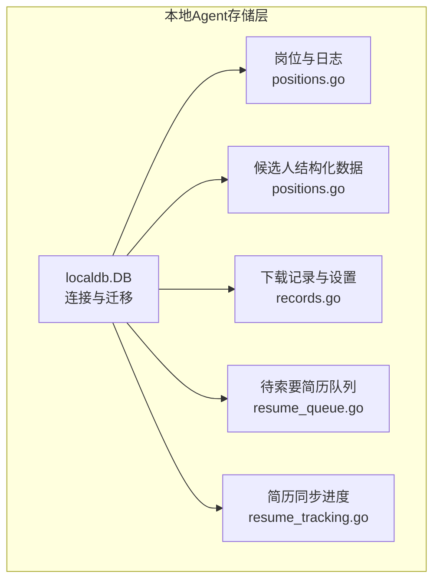
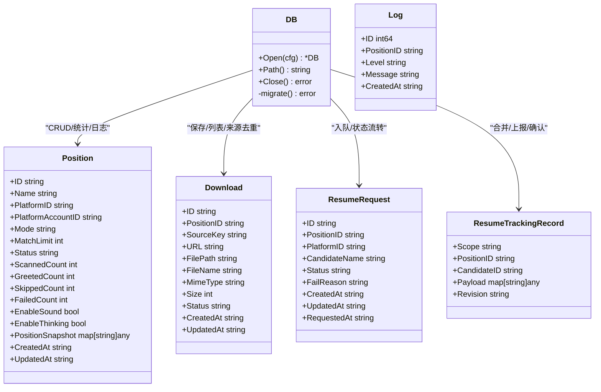
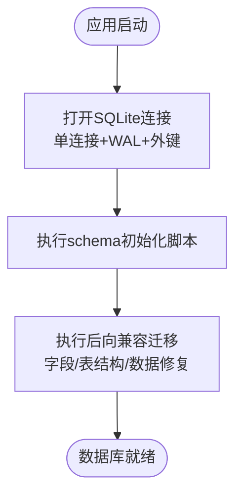
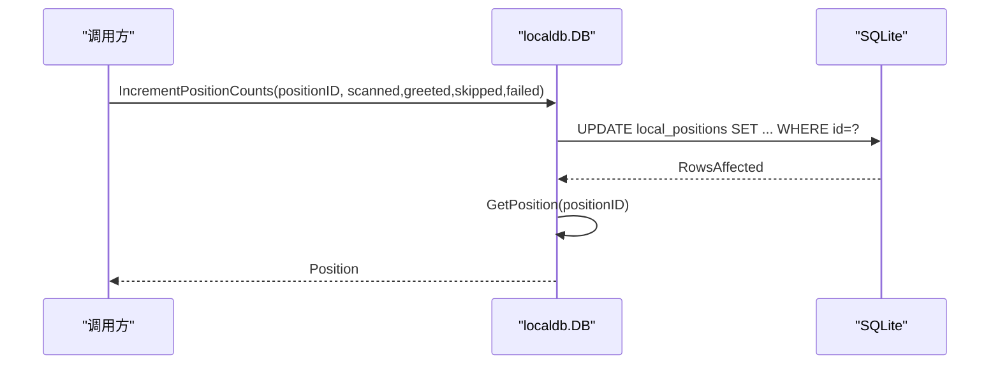
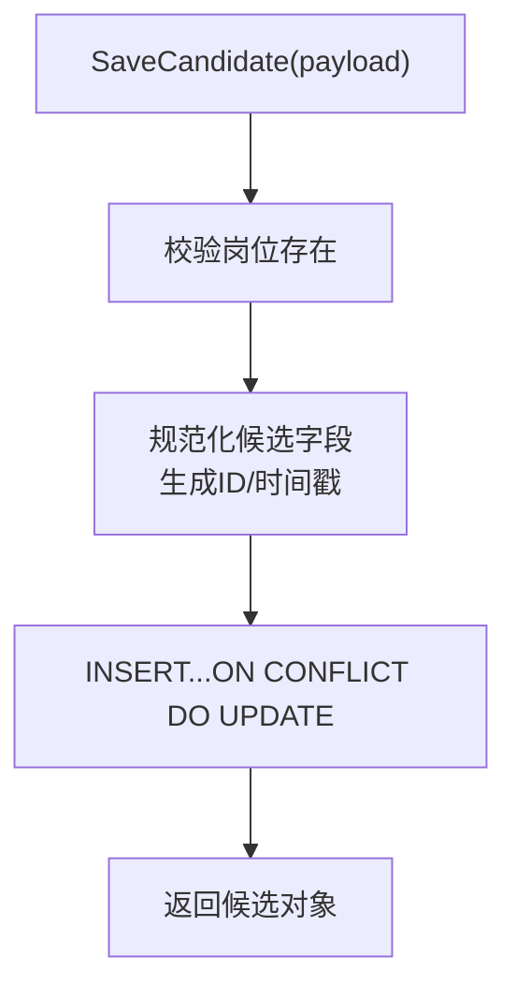
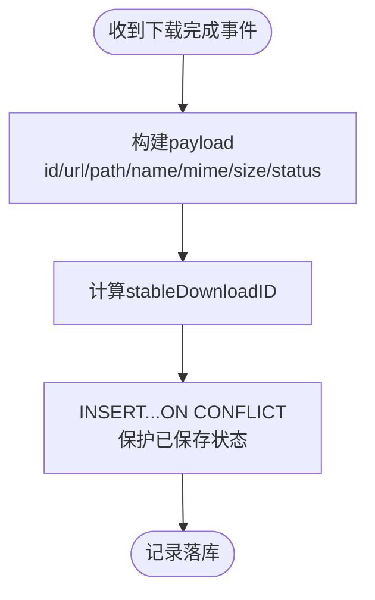
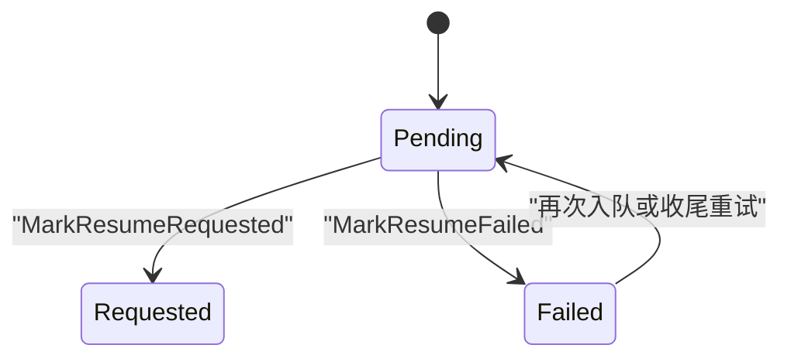
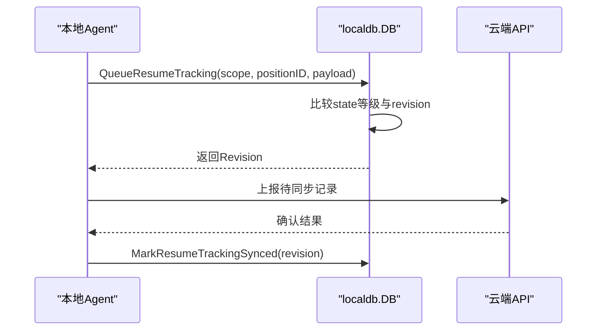
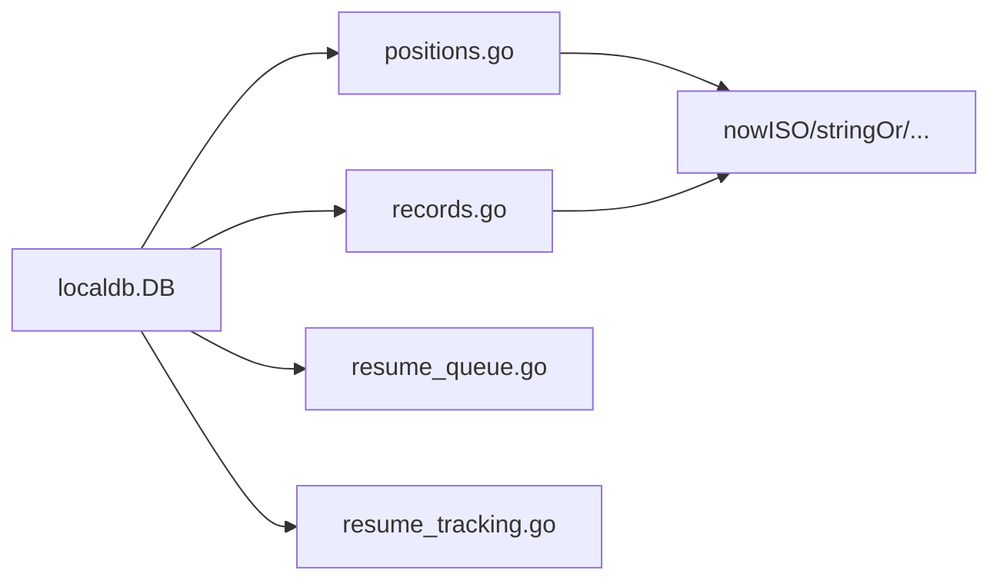

# 数据存储层

<cite>
**本文引用的文件**   
- [db.go](file://goodhr5/local-agent-go/internal/localdb/db.go)
- [positions.go](file://goodhr5/local-agent-go/internal/localdb/positions.go)
- [records.go](file://goodhr5/local-agent-go/internal/localdb/records.go)
- [resume_queue.go](file://goodhr5/local-agent-go/internal/localdb/resume_queue.go)
- [resume_tracking.go](file://goodhr5/local-agent-go/internal/localdb/resume_tracking.go)
- [backup-db.sh](file://goodhr5/scripts/backup-db.sh)
</cite>

## 目录
1. [引言](#引言)
2. [项目结构](#项目结构)
3. [核心组件](#核心组件)
4. [架构总览](#架构总览)
5. [详细组件分析](#详细组件分析)
6. [依赖关系分析](#依赖关系分析)
7. [性能与优化](#性能与优化)
8. [故障排查指南](#故障排查指南)
9. [结论](#结论)
10. [附录：数据模型与接口速查](#附录数据模型与接口速查)

## 引言
本文件面向 HRPlus 本地 Agent 的数据存储层，聚焦 Go 版本 SQLite 本地数据库设计、数据模型定义、ORM 映射实现、岗位信息存储、运行记录管理、日志持久化机制、文件与截图策略、下载记录处理、数据迁移方案、备份恢复机制、性能优化策略、数据安全考虑，以及本地存储与云端同步的一致性保证。文档以代码级事实为依据，提供可视化图示与可操作的查询建议，帮助开发者与维护者快速理解并安全扩展本地存储能力。

## 项目结构
HRPlus 本地 Agent 的本地存储由 internal/localdb 包统一封装，负责 SQLite 连接管理、表结构初始化与迁移、岗位运行与候选人数据、下载记录、待索要简历队列、简历同步进度等。关键文件职责如下：
- db.go：数据库连接、WAL 模式、外键约束、表结构创建与迁移、路径暴露。
- positions.go：岗位运行、统计计数、日志、候选人结构化存取。
- records.go：本地设置、下载记录、截图兼容接口。
- resume_queue.go：打招呼后“待索要简历”名单的状态机与去重。
- resume_tracking.go：简历库待同步进度的幂等与修订时间保护。
- backup-db.sh：数据库备份脚本（仓库内提供）。



**图表来源** 
- [db.go:16-45](file://goodhr5/local-agent-go/internal/localdb/db.go#L16-L45)
- [positions.go:15-42](file://goodhr5/local-agent-go/internal/localdb/positions.go#L15-L42)
- [records.go:14-38](file://goodhr5/local-agent-go/internal/localdb/records.go#L14-L38)
- [resume_queue.go:23-34](file://goodhr5/local-agent-go/internal/localdb/resume_queue.go#L23-L34)
- [resume_tracking.go:14-21](file://goodhr5/local-agent-go/internal/localdb/resume_tracking.go#L14-L21)

**章节来源**
- [db.go:16-45](file://goodhr5/local-agent-go/internal/localdb/db.go#L16-L45)
- [positions.go:15-42](file://goodhr5/local-agent-go/internal/localdb/positions.go#L15-L42)
- [records.go:14-38](file://goodhr5/local-agent-go/internal/localdb/records.go#L14-L38)
- [resume_queue.go:23-34](file://goodhr5/local-agent-go/internal/localdb/resume_queue.go#L23-L34)
- [resume_tracking.go:14-21](file://goodhr5/local-agent-go/internal/localdb/resume_tracking.go#L14-L21)

## 核心组件
- 数据库连接与迁移
  - 单连接串行化读写，避免 SQLite 并发写锁冲突；启用 WAL 与外键约束；启动时执行 schema 初始化与多阶段迁移。
- 岗位运行与日志
  - 岗位运行基础字段、统计计数、状态更新、快照 JSON 存储；日志按岗位关联，自动裁剪保留最近 N 条。
- 候选人结构化数据
  - 对齐云端 position_candidates 的结构化字段；支持 Upsert、分页过滤、详情读取、批量清空与删除。
- 下载记录与设置
  - 下载记录支持稳定 ID、来源摘要去重、按岗位筛选；本地设置采用 key/value JSON 存储。
- 待索要简历队列
  - 三态（pending/requested/failed）状态机；同名同岗位复用或重置失败项；支持按岗位与状态查询。
- 简历同步进度
  - 作用域隔离（云端地址+平台+浏览器账号），修订时间防旧覆盖；仅上报轻量 payload，避免泄露完整候选人信息。

**章节来源**
- [db.go:22-45](file://goodhr5/local-agent-go/internal/localdb/db.go#L22-L45)
- [db.go:67-229](file://goodhr5/local-agent-go/internal/localdb/db.go#L67-L229)
- [positions.go:52-234](file://goodhr5/local-agent-go/internal/localdb/positions.go#L52-L234)
- [positions.go:317-597](file://goodhr5/local-agent-go/internal/localdb/positions.go#L317-L597)
- [records.go:40-188](file://goodhr5/local-agent-go/internal/localdb/records.go#L40-L188)
- [resume_queue.go:36-187](file://goodhr5/local-agent-go/internal/localdb/resume_queue.go#L36-L187)
- [resume_tracking.go:23-102](file://goodhr5/local-agent-go/internal/localdb/resume_tracking.go#L23-L102)

## 架构总览
本地存储层围绕 DB 对象展开，所有业务模块通过 DB 提供的函数访问 SQLite。迁移在 Open 时执行，确保表结构与字段演进向后兼容。



**图表来源**
- [db.go:16-45](file://goodhr5/local-agent-go/internal/localdb/db.go#L16-L45)
- [positions.go:15-42](file://goodhr5/local-agent-go/internal/localdb/positions.go#L15-L42)
- [records.go:14-27](file://goodhr5/local-agent-go/internal/localdb/records.go#L14-L27)
- [resume_queue.go:23-34](file://goodhr5/local-agent-go/internal/localdb/resume_queue.go#L23-L34)
- [resume_tracking.go:14-21](file://goodhr5/local-agent-go/internal/localdb/resume_tracking.go#L14-L21)

## 详细组件分析

### 数据库连接与迁移
- 连接参数
  - 使用 modernc.org/sqlite 驱动；强制单连接 SetMaxOpenConns(1)，避免 database is locked。
  - 启用 PRAGMA journal_mode=WAL 与 foreign_keys=ON。
- 表结构
  - local_meta：元信息与版本标记。
  - local_positions：岗位运行主表。
  - local_position_logs：岗位运行日志，级联删除。
  - local_candidates：候选人结构化字段，复合主键 (position_id, id)。
  - local_settings：通用设置 key/value。
  - local_downloads：下载记录，含 source_key 索引。
  - resume_request_queue：待索要简历队列。
  - resume_tracking：简历同步进度。
- 迁移策略
  - 首次初始化脚本建表；随后执行多项后向兼容迁移：新增 enable_thinking 字段、重建 candidates 表、修正 scanned_count 语义、为 downloads 添加 source_key 及索引、创建 resume_tracking 与 auto_reply 相关迁移。



**图表来源**
- [db.go:22-45](file://goodhr5/local-agent-go/internal/localdb/db.go#L22-L45)
- [db.go:67-229](file://goodhr5/local-agent-go/internal/localdb/db.go#L67-L229)

**章节来源**
- [db.go:22-45](file://goodhr5/local-agent-go/internal/localdb/db.go#L22-L45)
- [db.go:67-229](file://goodhr5/local-agent-go/internal/localdb/db.go#L67-L229)

### 岗位信息存储与运行记录
- 数据结构
  - Position：包含平台标识、运行模式、匹配上限、状态、统计计数、声音开关、思考开关、JSON 快照与时间戳。
  - Log：日志级别、消息、时间戳，关联 position_id。
- 主要操作
  - CreatePosition/UpsertPositionSnapshot/ListPositions/GetPosition/UpdatePosition/UpdatePositionStatus/IncrementPositionCounts/DeletePosition。
  - AddPositionLog/TrimPositionLogs/ListPositionLogs/ClearPositionLogs。
- 关键点
  - 统计增量使用原子 UPDATE，避免竞态。
  - 日志写入后自动 Trim 到最近 1000 条，控制体积。
  - 快照以 JSON 存储，便于灵活扩展。



**图表来源**
- [positions.go:201-221](file://goodhr5/local-agent-go/internal/localdb/positions.go#L201-L221)
- [positions.go:132-139](file://goodhr5/local-agent-go/internal/localdb/positions.go#L132-L139)

**章节来源**
- [positions.go:15-42](file://goodhr5/local-agent-go/internal/localdb/positions.go#L15-L42)
- [positions.go:52-234](file://goodhr5/local-agent-go/internal/localdb/positions.go#L52-L234)
- [positions.go:236-315](file://goodhr5/local-agent-go/internal/localdb/positions.go#L236-L315)

### 候选人结构化数据
- 设计目标
  - 与云端 position_candidates 字段对齐，支持 AI 评分与原因、简历附件 URL 与提取文本、工作/教育/证书/荣誉/项目/同事沟通等多维数组。
- 主要操作
  - SaveCandidate：Upsert，按 (position_id, id) 唯一键合并。
  - ListCandidates/ListCandidatesFiltered：支持按岗位、关键词、页码分页。
  - GetCandidate：支持按 candidateID 全局查找或限定 positionID。
  - ClearCandidates/DeleteCandidate：批量清空与单条删除。
- 复杂度与性能
  - 列表扫描全量后内存过滤与分页，适合中小规模；大数据量建议在上层加索引或限制范围。



**图表来源**
- [positions.go:317-418](file://goodhr5/local-agent-go/internal/localdb/positions.go#L317-L418)

**章节来源**
- [positions.go:317-597](file://goodhr5/local-agent-go/internal/localdb/positions.go#L317-L597)

### 下载记录与文件存储策略
- 下载记录
  - stableDownloadID：基于 file_path|url 的 SHA1 前缀生成稳定 ID，避免重复落库。
  - SourceKey：账号+平台+候选人会话摘要，用于跨次尝试的去重与最新一次查询。
  - SaveDownload：支持已保存状态的保护性更新，避免覆盖成功记录。
- 文件存储
  - 文件本体不入库，仅存 FilePath/FileName/MimeType/Size 等元数据。
  - 新版本不再持久化截图记录，ListScreenshots 返回空，SaveScreenshot 仅构造对象供上层使用。
- 查询建议
  - 按 position_id 过滤；使用 source_key 获取 LatestSourceDownload 进行幂等重试。



**图表来源**
- [records.go:127-182](file://goodhr5/local-agent-go/internal/localdb/records.go#L127-L182)

**章节来源**
- [records.go:14-27](file://goodhr5/local-agent-go/internal/localdb/records.go#L14-L27)
- [records.go:85-188](file://goodhr5/local-agent-go/internal/localdb/records.go#L85-L188)

### 待索要简历队列
- 状态机
  - pending：等待检查回复。
  - requested：已完成索要。
  - failed：本轮未能完成，允许下次重试。
- 行为特性
  - EnqueueResumeRequest：同名同岗位复用；若为 failed 则重置为 pending。
  - MarkResumeRequested/MarkResumeFailed：状态切换并更新时间。
  - ListResumeRequests：支持按岗位与状态过滤。



**图表来源**
- [resume_queue.go:13-21](file://goodhr5/local-agent-go/internal/localdb/resume_queue.go#L13-L21)
- [resume_queue.go:36-84](file://goodhr5/local-agent-go/internal/localdb/resume_queue.go#L36-L84)
- [resume_queue.go:120-146](file://goodhr5/local-agent-go/internal/localdb/resume_queue.go#L120-L146)

**章节来源**
- [resume_queue.go:36-187](file://goodhr5/local-agent-go/internal/localdb/resume_queue.go#L36-L187)

### 简历同步进度与一致性
- 作用域隔离
  - scope = 云端地址 + 平台 + 浏览器账号，防止不同账号串数据。
- 幂等与修订
  - QueueResumeTracking：比较新旧 state 等级，低阶段不能覆盖高阶段；revision 时间戳防止旧响应覆盖新状态。
  - PendingResumeTracking：只取 synced=0 的记录，分批上报。
  - MarkResumeTrackingSynced：仅确认 revision 匹配的条目，较新的继续保留待同步。
- 安全性
  - payload 仅包含身份摘要、评分、实际进度与失败原因，不暴露完整候选人信息。



**图表来源**
- [resume_tracking.go:43-79](file://goodhr5/local-agent-go/internal/localdb/resume_tracking.go#L43-L79)
- [resume_tracking.go:82-102](file://goodhr5/local-agent-go/internal/localdb/resume_tracking.go#L82-L102)

**章节来源**
- [resume_tracking.go:23-102](file://goodhr5/local-agent-go/internal/localdb/resume_tracking.go#L23-L102)

## 依赖关系分析
- 内部依赖
  - 所有子模块均依赖 DB 对象进行 SQL 操作；无循环依赖。
  - positions.go 与 records.go 共享 nowISO/stringOr/intValue 等工具函数。
- 外部依赖
  - modernc.org/sqlite：纯 Go SQLite 驱动，便于打包部署。
  - github.com/google/uuid：生成稳定 ID。
- 耦合与内聚
  - DB 作为单一入口，职责清晰；各功能按领域拆分文件，内聚度高。



**图表来源**
- [db.go:16-45](file://goodhr5/local-agent-go/internal/localdb/db.go#L16-L45)
- [positions.go:635-639](file://goodhr5/local-agent-go/internal/localdb/positions.go#L635-L639)
- [records.go:14-27](file://goodhr5/local-agent-go/internal/localdb/records.go#L14-L27)

**章节来源**
- [db.go:16-45](file://goodhr5/local-agent-go/internal/localdb/db.go#L16-L45)
- [positions.go:635-639](file://goodhr5/local-agent-go/internal/localdb/positions.go#L635-L639)

## 性能与优化
- 连接与并发
  - 单连接串行化避免锁竞争；WAL 提升读并发与崩溃恢复速度。
- 索引与查询
  - local_downloads.source_key 已建索引，加速来源去重查询。
  - 候选人列表当前为内存过滤+分页，建议在高频字段上增加索引或在上层限制 position_id 范围。
- 日志与体积控制
  - 日志自动 Trim 至最近 1000 条，避免无限增长。
- 迁移成本
  - 迁移在启动时执行，尽量保持幂等与最小变更；复杂迁移（如 candidates 重建）已在代码中处理。

[本节为通用指导，无需具体文件引用]

## 故障排查指南
- 常见错误
  - database is locked：检查是否多处打开连接；确保仅通过 DB 对象访问且未手动开启额外连接。
  - 岗位不存在：更新/删除接口会校验行数，返回“不存在”错误。
  - 下载记录未去重：检查 source_key 是否正确传入；必要时用 LatestSourceDownload 验证。
  - 候选人数据异常：确认 SaveCandidate 的 position_id 与 id 组合唯一；检查 JSON 数组字段是否为合法 JSON。
- 诊断步骤
  - 查看数据库路径：通过 DB.Path() 定位 goodhr_local_go.db。
  - 检查迁移日志：启动失败时关注 migrate 相关错误。
  - 备份数据库：使用仓库提供的脚本进行冷备。

**章节来源**
- [db.go:22-45](file://goodhr5/local-agent-go/internal/localdb/db.go#L22-L45)
- [positions.go:132-139](file://goodhr5/local-agent-go/internal/localdb/positions.go#L132-L139)
- [records.go:115-125](file://goodhr5/local-agent-go/internal/localdb/records.go#L115-L125)

## 结论
HRPlus 本地 Agent 的数据存储层以 SQLite 为核心，通过单连接+WAL+外键约束保障一致性与可靠性；以迁移脚本与后向兼容逻辑支撑平滑演进；以结构化候选人数据、下载记录去重、待索要简历状态机与简历同步修订时间戳，构建了稳健的本地数据基座。配合备份脚本与清晰的 API 边界，可在本地与云端之间实现可靠、可观测、可扩展的数据流。

[本节为总结性内容，无需具体文件引用]

## 附录：数据模型与接口速查

### 数据模型概览
- local_meta：key/value 元信息。
- local_positions：岗位运行主表。
- local_position_logs：岗位运行日志。
- local_candidates：候选人结构化字段。
- local_settings：通用设置。
- local_downloads：下载记录。
- resume_request_queue：待索要简历队列。
- resume_tracking：简历同步进度。

```mermaid
erDiagram
LOCAL_POSITIONS {
text id PK
text name
text platform_id
text platform_account_id
text mode
integer match_limit
text status
integer scanned_count
integer greeted_count
integer skipped_count
integer failed_count
integer enable_sound
integer enable_thinking
text position_snapshot
text created_at
text updated_at
}
LOCAL_POSITION_LOGS {
integer id PK
text position_id FK
text level
text message
text created_at
}
LOCAL_CANDIDATES {
text id
text position_id FK
text candidate_name
text status
text birth_ym
text phone
text email
text work_region
text work_years
integer expected_salary_min
integer expected_salary_max
text personal_description
text work_status
text expected_position
text online_status
text education_level
text basic_info
text raw_text
text filter_text
text work_experiences
text educations
text certificates
text honors
text project_experiences
text colleague_communications
text resume_attachment_url
text resume_attachment_extracted_text
text ai_detail_reason
real ai_detail_score
text ai_greet_reason
real ai_greet_score
text ai_review_reason
real ai_review_score
text ext
text first_seen_at
text detail_fetched_at
text greeted_at
text created_at
text updated_at
composite_pk "position_id,id"
}
LOCAL_SETTINGS {
text key PK
text value
text updated_at
}
LOCAL_DOWNLOADS {
text id PK
text position_id
text url
text file_path
text file_name
text mime_type
integer size
text status
text created_at
text updated_at
text source_key
}
RESUME_REQUEST_QUEUE {
text id PK
text position_id FK
text platform_id
text candidate_name
text status
text fail_reason
text created_at
text updated_at
text requested_at
}
RESUME_TRACKING {
text scope PK
text position_id PK
text candidate_id PK
text payload
text revision
integer synced
}
LOCAL_POSITIONS ||--o{ LOCAL_POSITION_LOGS : "logs"
LOCAL_POSITIONS ||--o{ LOCAL_CANDIDATES : "candidates"
LOCAL_POSITIONS ||--o{ RESUME_REQUEST_QUEUE : "requests"
```

**图表来源**
- [db.go:67-229](file://goodhr5/local-agent-go/internal/localdb/db.go#L67-L229)

### 常用接口速查
- 岗位与日志
  - CreatePosition/UpsertPositionSnapshot/ListPositions/GetPosition/UpdatePosition/UpdatePositionStatus/IncrementPositionCounts/DeletePosition
  - AddPositionLog/TrimPositionLogs/ListPositionLogs/ClearPositionLogs
- 候选人
  - SaveCandidate/ListCandidates/ListCandidatesFiltered/GetCandidate/ClearCandidates/DeleteCandidate
- 下载与设置
  - GetSettings/SaveSettings
  - ListDownloads/LatestSourceDownload/SaveDownload
- 待索要简历
  - EnqueueResumeRequest/ListResumeRequests/MarkResumeRequested/MarkResumeFailed
- 简历同步
  - QueueResumeTracking/PendingResumeTracking/MarkResumeTrackingSynced

**章节来源**
- [positions.go:52-234](file://goodhr5/local-agent-go/internal/localdb/positions.go#L52-L234)
- [positions.go:317-597](file://goodhr5/local-agent-go/internal/localdb/positions.go#L317-L597)
- [records.go:40-188](file://goodhr5/local-agent-go/internal/localdb/records.go#L40-L188)
- [resume_queue.go:36-187](file://goodhr5/local-agent-go/internal/localdb/resume_queue.go#L36-L187)
- [resume_tracking.go:43-102](file://goodhr5/local-agent-go/internal/localdb/resume_tracking.go#L43-L102)

### 数据迁移与备份恢复
- 迁移
  - 启动时自动执行 schema 初始化与多项后向兼容迁移；新增字段与表结构变更均在代码中处理。
- 备份
  - 使用仓库脚本对数据库文件进行备份。
- 恢复
  - 停止应用后替换 goodhr_local_go.db；重启应用触发迁移与校验。

**章节来源**
- [db.go:67-229](file://goodhr5/local-agent-go/internal/localdb/db.go#L67-L229)
- [backup-db.sh](file://goodhr5/scripts/backup-db.sh)