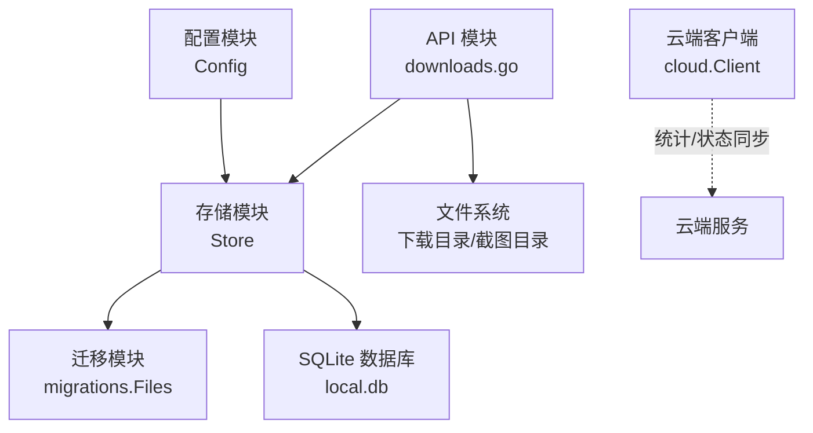
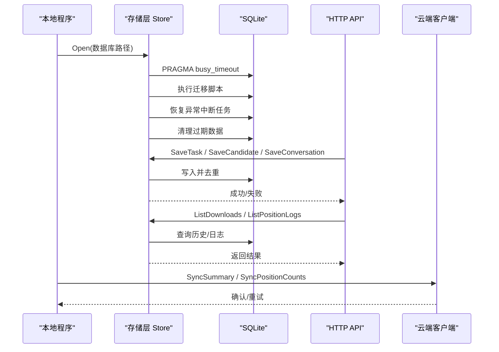
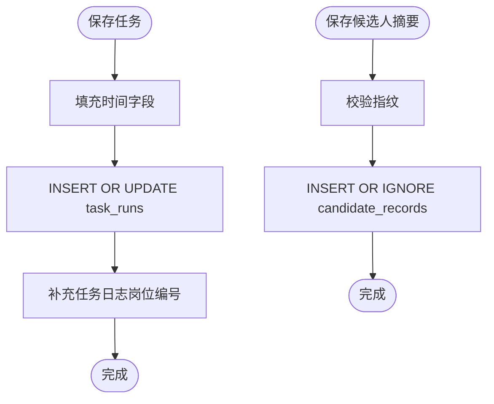
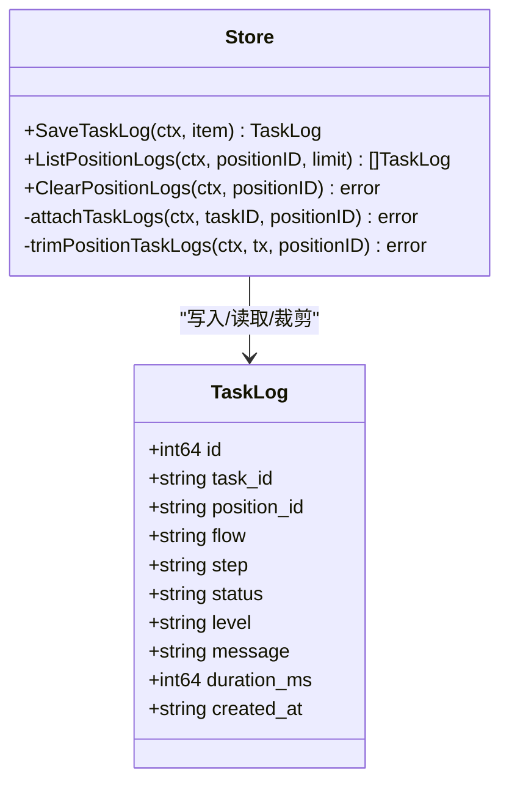
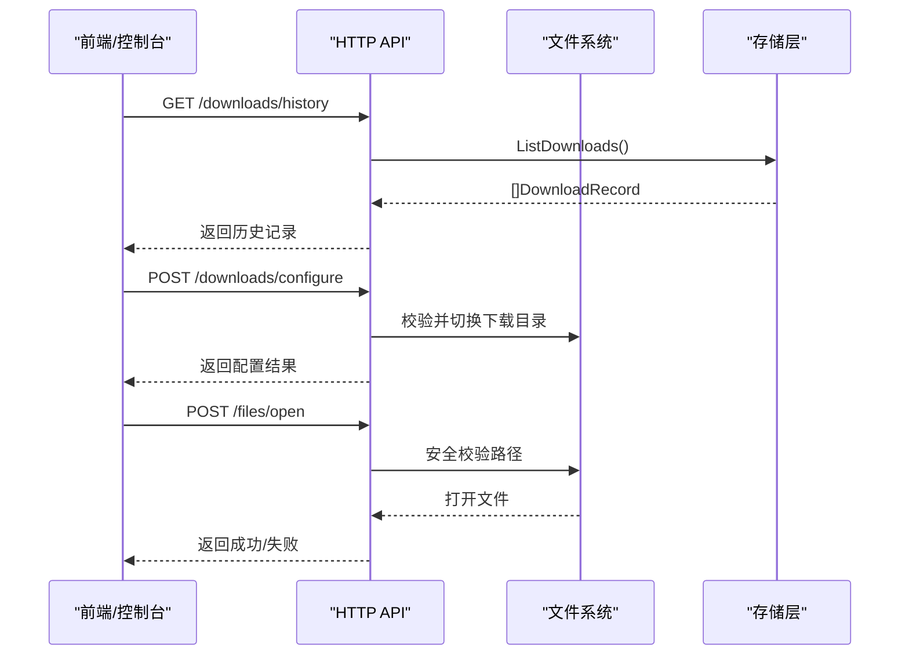
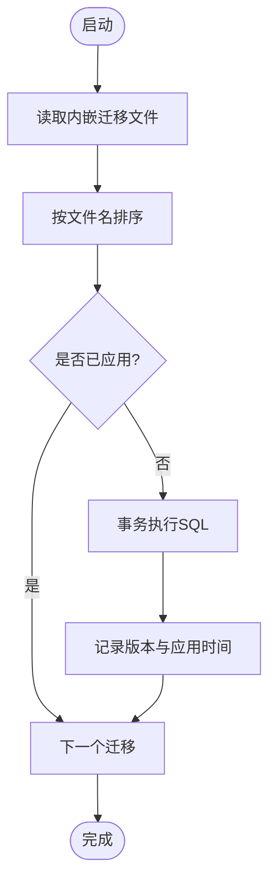
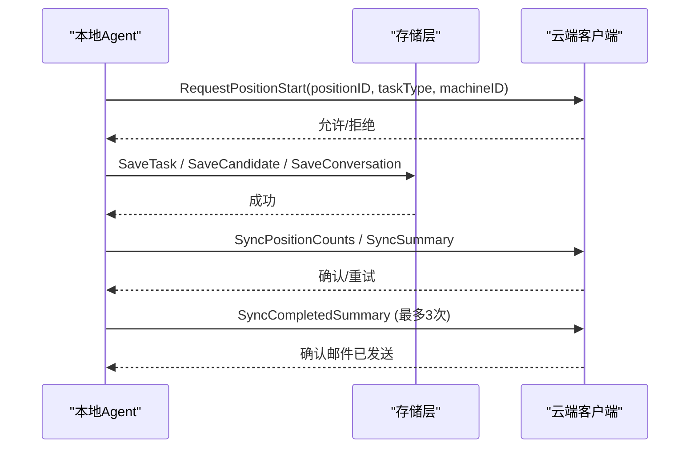
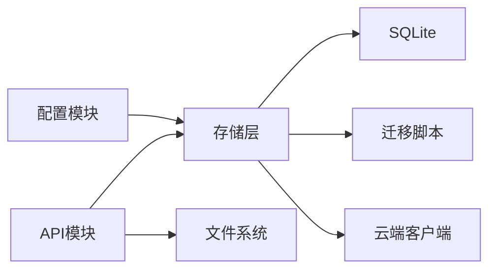

# 数据存储层

<cite>
**本文引用的文件**
- [store.go](file://goodhr5/local-agent-go/internal/storage/store.go)
- [download.go](file://goodhr5/local-agent-go/internal/storage/download.go)
- [task_log.go](file://goodhr5/local-agent-go/internal/storage/task_log.go)
- [embed.go](file://goodhr5/local-agent-go/migrations/embed.go)
- [001_initial.sql](file://goodhr5/local-agent-go/migrations/001_initial.sql)
- [002_download_records.sql](file://goodhr5/local-agent-go/migrations/002_download_records.sql)
- [003_task_logs.sql](file://goodhr5/local-agent-go/migrations/003_task_logs.sql)
- [downloads.go](file://goodhr5/local-agent-go/internal/api/downloads.go)
- [config.go](file://goodhr5/local-agent-go/internal/config/config.go)
- [client.go](file://goodhr5/local-agent-go/internal/integration/cloud/client.go)
- [download_test.go](file://goodhr5/local-agent-go/internal/storage/download_test.go)
- [task_log_test.go](file://goodhr5/local-agent-go/internal/storage/task_log_test.go)
</cite>

## 目录
1. [简介](#简介)
2. [项目结构](#项目结构)
3. [核心组件](#核心组件)
4. [架构总览](#架构总览)
5. [详细组件分析](#详细组件分析)
6. [依赖关系分析](#依赖关系分析)
7. [性能考虑](#性能考虑)
8. [故障排查指南](#故障排查指南)
9. [结论](#结论)
10. [附录](#附录)

## 简介
本文件聚焦 GoodHR 本地 Agent 的数据存储层，围绕 SQLite 数据库设计、数据模型定义、ORM 映射实现展开，系统说明岗位信息运行状态、候选人动作摘要、自动回复去重、任务步骤日志、下载记录等本地持久化机制。同时覆盖数据迁移方案、备份恢复策略、性能优化建议、数据访问接口使用示例、查询优化与安全注意事项，并阐述本地存储与云端同步的一致性保证机制。

## 项目结构
本地 Agent 的存储层由“存储抽象 + 内嵌 SQL 迁移 + API 暴露 + 配置管理”构成：
- 存储抽象：统一封装 SQLite 连接、迁移执行、任务状态、候选人摘要、对话去重、下载记录、任务日志的读写。
- 迁移管理：通过内嵌文件系统加载并按文件名顺序执行 SQL 迁移脚本，记录已应用版本。
- API 暴露：提供下载历史、下载目录切换、文件打开/显示等 HTTP 接口，底层读取 SQLite 或调用系统能力。
- 配置管理：集中管理数据目录、数据库路径、截图目录、下载目录、日志目录等运行时路径。

图表来源
- [config.go:30-90](file://goodhr5/local-agent-go/internal/config/config.go#L30-L90)
- [store.go:19-88](file://goodhr5/local-agent-go/internal/storage/store.go#L19-L88)
- [embed.go:1-10](file://goodhr5/local-agent-go/migrations/embed.go#L1-L10)
- [downloads.go:17-74](file://goodhr5/local-agent-go/internal/api/downloads.go#L17-L74)
- [client.go:172-286](file://goodhr5/local-agent-go/internal/integration/cloud/client.go#L172-L286)

章节来源
- [config.go:30-90](file://goodhr5/local-agent-go/internal/config/config.go#L30-L90)
- [store.go:19-88](file://goodhr5/local-agent-go/internal/storage/store.go#L19-L88)
- [embed.go:1-10](file://goodhr5/local-agent-go/migrations/embed.go#L1-L10)
- [downloads.go:17-74](file://goodhr5/local-agent-go/internal/api/downloads.go#L17-L74)

## 核心组件
- Store（存储核心）
  - 负责 SQLite 初始化、PRAGMA 设置、迁移执行、异常中断任务恢复、过期数据清理。
  - 提供任务状态保存/查询、候选人摘要保存与去重、对话回复去重、下载记录保存与查询、任务日志保存与裁剪、按岗位读取日志等能力。
- 数据模型
  - 任务运行表：记录任务编号、岗位编号、平台编号、任务类型、状态、当前步骤、摘要、错误码/信息、时间戳。
  - 候选人记录表：以指纹去重，记录动作、结果、原因。
  - 会话记录表：以会话键和回复哈希去重，避免重复发送相同回复。
  - 下载记录表：记录下载来源、页面地址、文件路径、大小、状态、错误、时间戳。
  - 任务日志表：记录流程、步骤、状态、级别、消息、耗时、创建时间，支持按岗位裁剪保留最近 1000 条。
- 迁移管理
  - 通过内嵌文件系统加载所有 .sql 迁移文件，按文件名排序依次执行，并在 schema_migrations 中记录版本号与应用时间。
- API 接口
  - 下载历史查询、下载目录切换、文件打开/显示等接口，均对路径进行安全校验，限制在已确认的下载根目录下。

章节来源
- [store.go:19-410](file://goodhr5/local-agent-go/internal/storage/store.go#L19-L410)
- [download.go:11-108](file://goodhr5/local-agent-go/internal/storage/download.go#L11-L108)
- [task_log.go:14-218](file://goodhr5/local-agent-go/internal/storage/task_log.go#L14-L218)
- [001_initial.sql:3-48](file://goodhr5/local-agent-go/migrations/001_initial.sql#L3-L48)
- [002_download_records.sql:3-20](file://goodhr5/local-agent-go/migrations/002_download_records.sql#L3-L20)
- [003_task_logs.sql:3-18](file://goodhr5/local-agent-go/migrations/003_task_logs.sql#L3-L18)
- [downloads.go:17-177](file://goodhr5/local-agent-go/internal/api/downloads.go#L17-L177)

## 架构总览
本地存储层采用“单进程单连接 + 事务化迁移 + 严格路径校验”的设计：
- 启动时打开 SQLite，设置 busy_timeout，执行迁移，恢复异常中断任务，清理过期数据。
- 业务写入通过 Store 方法完成，内部使用参数化 SQL 与事务，确保一致性与幂等性。
- API 层仅暴露必要操作，并对文件路径做白名单校验，防止越权访问。
- 云端同步通过强类型客户端上报统计与状态，不上传敏感详情，保持本地最小化持久化。

图表来源
- [store.go:64-88](file://goodhr5/local-agent-go/internal/storage/store.go#L64-L88)
- [store.go:117-160](file://goodhr5/local-agent-go/internal/storage/store.go#L117-L160)
- [store.go:270-323](file://goodhr5/local-agent-go/internal/storage/store.go#L270-L323)
- [downloads.go:17-74](file://goodhr5/local-agent-go/internal/api/downloads.go#L17-L74)
- [client.go:172-286](file://goodhr5/local-agent-go/internal/integration/cloud/client.go#L172-L286)

## 详细组件分析

### 任务运行与候选人摘要
- 任务运行
  - 保存任务状态时使用 INSERT OR UPDATE ON CONFLICT(task_id)，保证幂等更新；自动填充开始时间、更新时间、结束时间。
  - 查询任务后补充本次任务的扫描、打招呼、跳过数量，来源于候选人记录的聚合统计。
  - 支持按岗位查询最近一次任务状态，便于控制台展示。
- 候选人摘要
  - 以 fingerprint 与 action 组合唯一约束，避免重复记录同一候选人的同一动作。
  - 保存前校验指纹非空，确保去重有效性。
- 自动回复去重
  - 以 conversation_key 与 reply_hash 组合唯一约束，避免重复发送相同回复。
  - 提供存在性检查接口，供上层决策是否发送。

图表来源
- [store.go:117-160](file://goodhr5/local-agent-go/internal/storage/store.go#L117-L160)
- [store.go:238-256](file://goodhr5/local-agent-go/internal/storage/store.go#L238-L256)
- [store.go:325-361](file://goodhr5/local-agent-go/internal/storage/store.go#L325-L361)

章节来源
- [store.go:117-160](file://goodhr5/local-agent-go/internal/storage/store.go#L117-L160)
- [store.go:238-256](file://goodhr5/local-agent-go/internal/storage/store.go#L238-L256)
- [store.go:325-361](file://goodhr5/local-agent-go/internal/storage/store.go#L325-L361)

### 任务步骤日志
- 日志保存
  - 若未提供岗位编号，则根据任务编号从任务运行表反查岗位编号，保证日志可归属。
  - 写入后自动裁剪该岗位日志，仅保留最近 1000 条，避免无限增长。
- 日志查询
  - 按岗位读取最近日志，默认限制 100 条，最大不超过 1000 条，按时间正序返回，便于控制台展示。
- 日志清空
  - 清空指定岗位的全部日志，并清理该岗位的历史错误信息，用于重新诊断。

图表来源
- [task_log.go:14-82](file://goodhr5/local-agent-go/internal/storage/task_log.go#L14-L82)
- [task_log.go:84-164](file://goodhr5/local-agent-go/internal/storage/task_log.go#L84-L164)
- [task_log.go:166-205](file://goodhr5/local-agent-go/internal/storage/task_log.go#L166-L205)

章节来源
- [task_log.go:14-218](file://goodhr5/local-agent-go/internal/storage/task_log.go#L14-L218)

### 下载记录与文件安全
- 下载记录
  - 保存下载结果时进行状态与路径校验，成功状态必须包含文件路径。
  - 提供历史查询接口，按捕获时间倒序返回，便于用户查看下载历史。
- 文件安全
  - API 层对文件路径进行绝对路径、存在性、符号链接解析与白名单校验，仅允许打开已配置的下载根目录下的文件。
  - 支持切换 Worker 后续下载保存目录，并记住已确认的目录集合。

图表来源
- [download.go:26-108](file://goodhr5/local-agent-go/internal/storage/download.go#L26-L108)
- [downloads.go:17-177](file://goodhr5/local-agent-go/internal/api/downloads.go#L17-L177)

章节来源
- [download.go:26-108](file://goodhr5/local-agent-go/internal/storage/download.go#L26-L108)
- [downloads.go:17-177](file://goodhr5/local-agent-go/internal/api/downloads.go#L17-L177)

### 数据迁移与版本控制
- 迁移执行
  - 启动时读取内嵌迁移文件，按文件名排序依次执行，未应用的迁移会在事务中执行并记录版本。
  - 首次迁移固定为 001_initial.sql，后续迁移通过 schema_migrations 表去重。
- 版本回滚
  - 当前实现不包含自动回滚；如需回滚，需手动准备 down 脚本并在维护窗口执行。

图表来源
- [store.go:90-109](file://goodhr5/local-agent-go/internal/storage/store.go#L90-L109)
- [store.go:384-409](file://goodhr5/local-agent-go/internal/storage/store.go#L384-L409)
- [embed.go:1-10](file://goodhr5/local-agent-go/migrations/embed.go#L1-L10)

章节来源
- [store.go:90-109](file://goodhr5/local-agent-go/internal/storage/store.go#L90-L109)
- [store.go:384-409](file://goodhr5/local-agent-go/internal/storage/store.go#L384-L409)
- [embed.go:1-10](file://goodhr5/local-agent-go/migrations/embed.go#L1-L10)

### 数据模型与索引设计
- 任务运行表
  - 主键：task_id
  - 索引：position_id + started_at，用于按岗位查询最近任务。
- 候选人记录表
  - 唯一约束：task_id + fingerprint + action，避免重复动作。
- 会话记录表
  - 唯一约束：task_id + conversation_key + reply_hash，避免重复回复。
- 下载记录表
  - 主键：id
  - 索引：created_at DESC，用于历史查询。
- 任务日志表
  - 自增主键：id
  - 索引：position_id + id DESC、task_id + id DESC，用于按岗位/任务快速读取。

章节来源
- [001_initial.sql:3-48](file://goodhr5/local-agent-go/migrations/001_initial.sql#L3-L48)
- [002_download_records.sql:3-20](file://goodhr5/local-agent-go/migrations/002_download_records.sql#L3-L20)
- [003_task_logs.sql:3-18](file://goodhr5/local-agent-go/migrations/003_task_logs.sql#L3-L18)

### 数据访问接口使用示例
- 保存任务状态
  - 调用 Store.SaveTask，传入任务对象；若任务已存在则更新状态、步骤、摘要、错误信息与时间戳。
  - 参考测试用例验证任务恢复与统计填充行为。
- 保存下载记录
  - 调用 Store.SaveDownload，传入下载记录；首次保存返回 true，重复 ID 不会再次插入。
  - 参考测试用例验证去重与读取顺序。
- 读取岗位日志
  - 调用 Store.ListPositionLogs，传入岗位编号与限制数量；返回按时间正序的日志列表。
  - 参考测试用例验证日志裁剪与清空行为。

章节来源
- [task_log_test.go:13-49](file://goodhr5/local-agent-go/internal/storage/task_log_test.go#L13-L49)
- [task_log_test.go:51-79](file://goodhr5/local-agent-go/internal/storage/task_log_test.go#L51-L79)
- [task_log_test.go:81-109](file://goodhr5/local-agent-go/internal/storage/task_log_test.go#L81-L109)
- [task_log_test.go:111-145](file://goodhr5/local-agent-go/internal/storage/task_log_test.go#L111-L145)
- [task_log_test.go:147-179](file://goodhr5/local-agent-go/internal/storage/task_log_test.go#L147-L179)
- [download_test.go:10-41](file://goodhr5/local-agent-go/internal/storage/download_test.go#L10-L41)

### 本地存储与云端同步一致性
- 启动检查与占用名额
  - 本地程序请求云端启动检查并占用账号唯一运行名额，确保多设备并发安全。
- 统计与状态同步
  - 任务完成后将统计与状态同步到云端；对于主动打招呼任务，会先同步累计扫描、跳过与失败计数。
  - 完成状态同步最多尝试三次，并要求云端确认完成邮件已发送。
- 数据最小化原则
  - 本地不保存 Cookie、Token、截图或完整候选人详情；云端同步仅包含统计与必要元数据，降低隐私风险。

图表来源
- [client.go:172-286](file://goodhr5/local-agent-go/internal/integration/cloud/client.go#L172-L286)
- [store.go:117-160](file://goodhr5/local-agent-go/internal/storage/store.go#L117-L160)
- [store.go:238-256](file://goodhr5/local-agent-go/internal/storage/store.go#L238-L256)

章节来源
- [client.go:172-286](file://goodhr5/local-agent-go/internal/integration/cloud/client.go#L172-L286)
- [store.go:117-160](file://goodhr5/local-agent-go/internal/storage/store.go#L117-L160)
- [store.go:238-256](file://goodhr5/local-agent-go/internal/storage/store.go#L238-L256)

## 依赖关系分析
- 存储层依赖
  - SQLite 驱动：modernc.org/sqlite
  - 迁移文件：通过 embed.FS 内嵌 SQL 脚本
  - 配置模块：提供数据目录、数据库路径、下载目录、截图目录等
  - API 模块：暴露下载历史、下载目录切换、文件操作接口
  - 云端客户端：负责统计与状态同步
- 耦合与内聚
  - Store 高内聚于 SQLite 操作，职责清晰；API 层仅关注 HTTP 协议与路径安全；配置模块集中管理路径与环境变量。
- 外部依赖
  - 文件系统：用于截图、下载、日志等文件的落盘。
  - 云端服务：用于启动检查、统计同步、状态确认。

图表来源
- [config.go:30-90](file://goodhr5/local-agent-go/internal/config/config.go#L30-L90)
- [store.go:19-88](file://goodhr5/local-agent-go/internal/storage/store.go#L19-L88)
- [embed.go:1-10](file://goodhr5/local-agent-go/migrations/embed.go#L1-L10)
- [downloads.go:17-74](file://goodhr5/local-agent-go/internal/api/downloads.go#L17-L74)
- [client.go:172-286](file://goodhr5/local-agent-go/internal/integration/cloud/client.go#L172-L286)

章节来源
- [config.go:30-90](file://goodhr5/local-agent-go/internal/config/config.go#L30-L90)
- [store.go:19-88](file://goodhr5/local-agent-go/internal/storage/store.go#L19-L88)
- [embed.go:1-10](file://goodhr5/local-agent-go/migrations/embed.go#L1-L10)
- [downloads.go:17-74](file://goodhr5/local-agent-go/internal/api/downloads.go#L17-L74)
- [client.go:172-286](file://goodhr5/local-agent-go/internal/integration/cloud/client.go#L172-L286)

## 性能考虑
- 连接与并发
  - 设置最大打开连接数为 1，避免 SQLite 并发写入冲突；设置 busy_timeout 提升写入等待容忍度。
- 索引优化
  - 任务运行表按岗位与开始时间建立复合索引，加速最近任务查询。
  - 下载记录表按创建时间降序索引，加速历史查询。
  - 任务日志表按岗位与任务建立索引，加速日志读取。
- 数据裁剪
  - 每个岗位日志保留最近 1000 条，避免无限增长影响查询性能。
  - 统一清理过期本地数据（任务、候选人、会话、下载、日志），默认保留 90 天。
- 查询优化建议
  - 优先使用带索引的字段过滤（如 position_id、created_at）。
  - 分页或限制返回条数，避免一次性加载大量日志。
  - 对频繁查询的岗位，缓存最近任务与统计结果，减少数据库压力。

章节来源
- [store.go:64-88](file://goodhr5/local-agent-go/internal/storage/store.go#L64-L88)
- [store.go:292-323](file://goodhr5/local-agent-go/internal/storage/store.go#L292-L323)
- [001_initial.sql:23-24](file://goodhr5/local-agent-go/migrations/001_initial.sql#L23-L24)
- [002_download_records.sql:17-20](file://goodhr5/local-agent-go/migrations/002_download_records.sql#L17-L20)
- [003_task_logs.sql:16-18](file://goodhr5/local-agent-go/migrations/003_task_logs.sql#L16-L18)

## 故障排查指南
- 启动失败
  - 检查 SQLite 打开与 PRAGMA 设置是否正确；查看迁移执行日志。
  - 参考异常中断任务恢复逻辑，确认 running 任务是否被正确收尾。
- 数据不一致
  - 检查候选人记录与对话记录的唯一定义，避免重复或遗漏。
  - 核对任务日志的岗位归属，确认 attachTaskLogs 是否生效。
- 下载问题
  - 检查下载记录的状态与路径校验；确认 API 层路径白名单是否包含目标目录。
  - 使用历史查询接口定位下载失败原因。
- 云端同步失败
  - 检查登录态与网络连通性；查看错误码与重试逻辑。
  - 对于完成状态同步，确认云端是否确认邮件已发送。

章节来源
- [store.go:270-323](file://goodhr5/local-agent-go/internal/storage/store.go#L270-L323)
- [store.go:325-361](file://goodhr5/local-agent-go/internal/storage/store.go#L325-L361)
- [download.go:26-108](file://goodhr5/local-agent-go/internal/storage/download.go#L26-L108)
- [downloads.go:76-177](file://goodhr5/local-agent-go/internal/api/downloads.go#L76-L177)
- [client.go:31-61](file://goodhr5/local-agent-go/internal/integration/cloud/client.go#L31-L61)
- [client.go:240-286](file://goodhr5/local-agent-go/internal/integration/cloud/client.go#L240-L286)

## 结论
GoodHR 本地 Agent 的数据存储层以 SQLite 为核心，结合内嵌迁移、严格路径校验与最小化数据持久化策略，实现了任务运行状态、候选人摘要、自动回复去重、任务日志与下载记录的可靠本地存储。通过统一的 Store 抽象与清晰的 API 暴露，系统在易用性、安全性与性能之间取得平衡。云端同步采用统计与状态上报方式，既保证了数据一致性，又避免了敏感数据泄露。未来可在备份恢复、增量同步与更细粒度权限控制方面持续优化。

## 附录
- 数据目录与路径
  - 数据目录、数据库路径、下载目录、截图目录、日志目录由配置模块统一管理，支持环境变量覆盖。
- 安全注意事项
  - 本地不保存 Cookie、Token、截图或完整候选人详情；API 层对文件路径进行白名单校验，防止越权访问。
- 最佳实践
  - 定期清理过期数据，保持数据库体积可控。
  - 使用索引字段进行查询，避免全表扫描。
  - 对关键操作添加日志，便于问题定位与审计。

章节来源
- [config.go:30-90](file://goodhr5/local-agent-go/internal/config/config.go#L30-L90)
- [store.go:292-323](file://goodhr5/local-agent-go/internal/storage/store.go#L292-L323)
- [downloads.go:109-177](file://goodhr5/local-agent-go/internal/api/downloads.go#L109-L177)