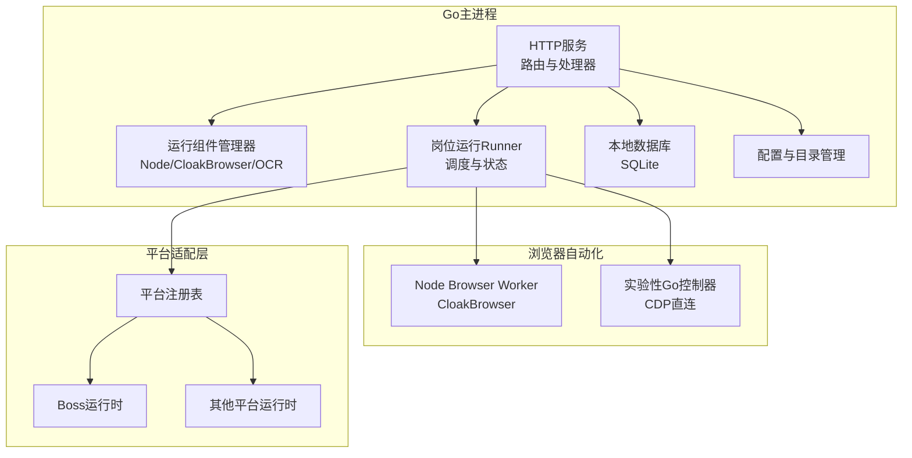
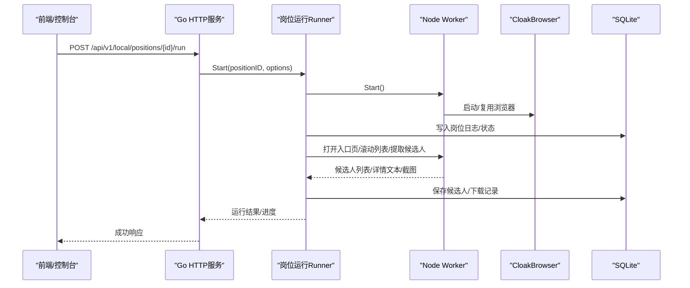
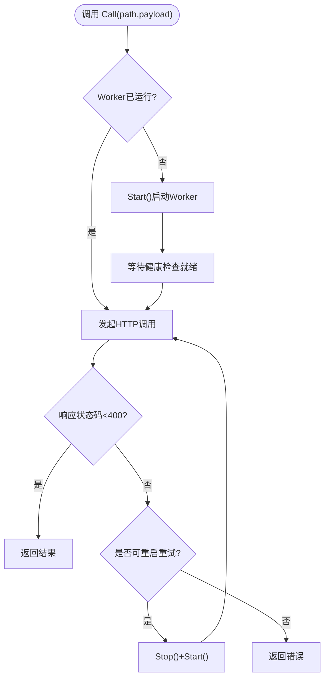
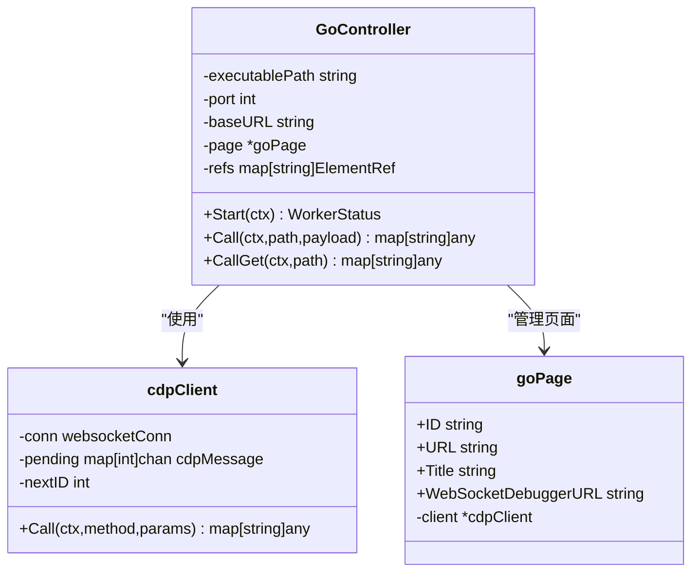
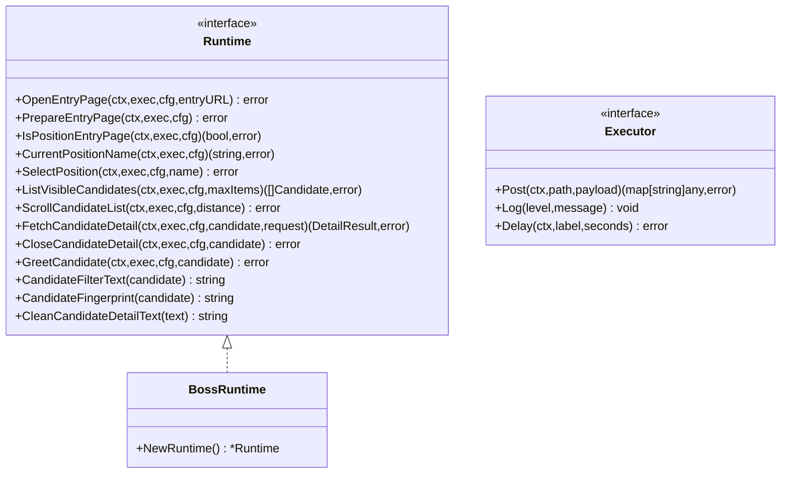
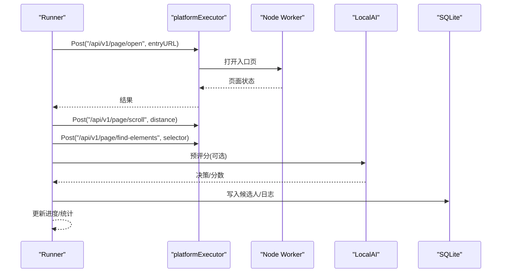
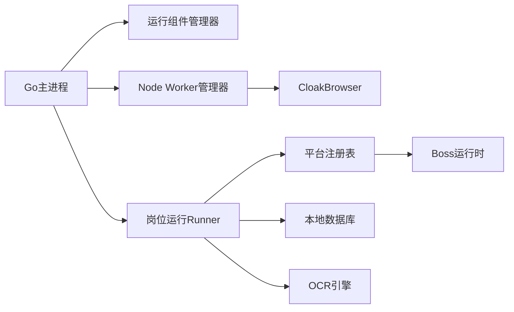
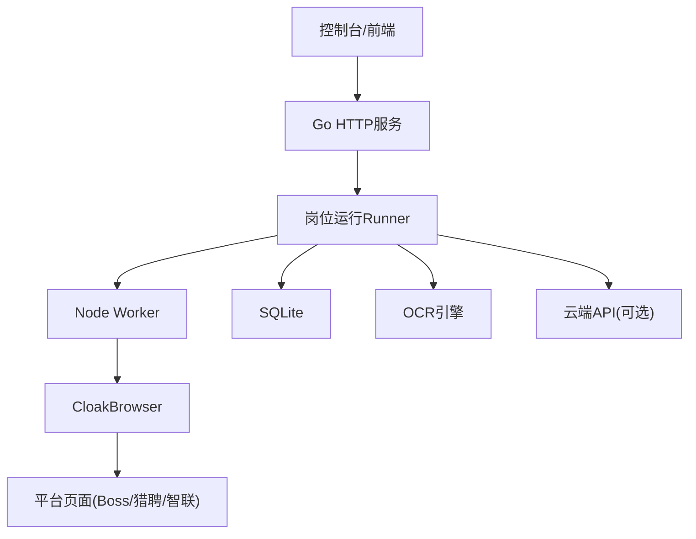

# 本地Agent架构

<cite>
**本文引用的文件**
- [main.go](file://goodhr5/local-agent-go/cmd/goodhr-local-agent/main.go)
- [server.go](file://goodhr5/local-agent-go/internal/app/server.go)
- [worker.go](file://goodhr5/local-agent-go/internal/browser/worker.go)
- [go_controller.go](file://goodhr5/local-agent-go/internal/browser/go_controller.go)
- [go_cdp.go](file://goodhr5/local-agent-go/internal/browser/go_cdp.go)
- [registry.go](file://goodhr5/local-agent-go/internal/platforms/registry.go)
- [runtime.go](file://goodhr5/local-agent-go/internal/platformcore/runtime.go)
- [boss_runtime.go](file://goodhr5/local-agent-go/internal/platforms/boss/runtime.go)
- [runner.go](file://goodhr5/local-agent-go/internal/positionrunner/runner.go)
- [pipeline.go](file://goodhr5/local-agent-go/internal/positionrunner/pipeline.go)
- [config.go](file://goodhr5/local-agent-go/internal/config/config.go)
- [db.go](file://goodhr5/local-agent-go/internal/localdb/db.go)
- [manager.go](file://goodhr5/local-agent-go/internal/runtime/manager.go)
- [restart_windows.go](file://goodhr5/local-agent-go/internal/process/restart_windows.go)
</cite>

## 目录
1. [简介](#简介)
2. [项目结构](#项目结构)
3. [核心组件](#核心组件)
4. [架构总览](#架构总览)
5. [详细组件分析](#详细组件分析)
6. [依赖关系分析](#依赖关系分析)
7. [性能与可靠性](#性能与可靠性)
8. [故障排查指南](#故障排查指南)
9. [结论](#结论)
10. [附录：数据流向图](#附录数据流向图)

## 简介
本文件面向HRPlus本地Agent（Go版本）的架构设计，重点解释以下方面：
- Go主程序如何作为HTTP服务暴露能力、协调运行组件、调度岗位运行。
- 浏览器自动化引擎的双实现路径：Node Worker（默认）与实验性Go控制器（直连CloakBrowser）。
- 平台适配器机制：通过统一接口抽象不同招聘平台的页面交互差异。
- CloakBrowser集成与CDP通信：Node侧通过CloakBrowser管理浏览器实例；Go侧提供实验性CDP客户端直连。
- 任务调度器与状态管理：岗位运行的生命周期、并发流水线、进度与日志持久化。
- 本地数据存储策略、文件管理与进程控制：SQLite数据库、下载/截图目录、端口与进程清理。

## 项目结构
本地Agent采用“Go主进程 + Node Browser Worker + 平台运行时”的分层架构：
- Go主进程：负责HTTP路由、配置、运行组件管理、岗位运行调度、本地存储、OCR、云API对接等。
- Node Browser Worker：基于CloakBrowser进行真实浏览器自动化，提供页面操作API。
- 平台运行时：按平台ID注册并实现具体平台业务逻辑（如Boss、猎聘、智联等）。
- 实验性Go控制器：在Go中直接通过WebSocket+CDP与CloakBrowser通信，用于未来替代Node Worker。

图表来源
- [server.go:117-168](file://goodhr5/local-agent-go/internal/app/server.go#L117-L168)
- [manager.go:18-90](file://goodhr5/local-agent-go/internal/runtime/manager.go#L18-L90)
- [runner.go:71-86](file://goodhr5/local-agent-go/internal/positionrunner/runner.go#L71-L86)
- [registry.go:15-34](file://goodhr5/local-agent-go/internal/platforms/registry.go#L15-L34)

章节来源
- [main.go:18-62](file://goodhr5/local-agent-go/cmd/goodhr-local-agent/main.go#L18-L62)
- [config.go:26-88](file://goodhr5/local-agent-go/internal/config/config.go#L26-L88)

## 核心组件
- HTTP服务与路由：集中注册健康检查、运行时安装、Worker管理、页面操作、岗位运行、OCR、下载记录、云端配置等接口。
- 运行组件管理器：检测并定位Node、CloakBrowser、OCR可执行文件，维护安装状态与版本信息。
- Node Worker管理器：启动、停止、重启Node Browser Worker进程，封装HTTP调用，处理兼容性与端口冲突。
- 实验性Go控制器：以Go实现浏览器控制，支持基础页面操作并通过CDP与CloakBrowser通信。
- 平台运行时：定义统一Runtime接口，按平台ID分发到具体实现。
- 岗位运行Runner：管理多岗位并发运行、候选人流水线、AI评分、截图与下载、通知与统计。
- 本地数据库：SQLite持久化岗位、候选人、下载记录、设置与日志。
- 进程与端口管理：Windows下安全关闭旧实例、释放端口、避免冲突。

章节来源
- [server.go:35-63](file://goodhr5/local-agent-go/internal/app/server.go#L35-L63)
- [manager.go:34-90](file://goodhr5/local-agent-go/internal/runtime/manager.go#L34-L90)
- [worker.go:35-54](file://goodhr5/local-agent-go/internal/browser/worker.go#L35-L54)
- [go_controller.go:109-149](file://goodhr5/local-agent-go/internal/browser/go_controller.go#L109-L149)
- [runtime.go:10-111](file://goodhr5/local-agent-go/internal/platformcore/runtime.go#L10-L111)
- [runner.go:71-86](file://goodhr5/local-agent-go/internal/positionrunner/runner.go#L71-L86)
- [db.go:16-42](file://goodhr5/local-agent-go/internal/localdb/db.go#L16-L42)
- [restart_windows.go:30-50](file://goodhr5/local-agent-go/internal/process/restart_windows.go#L30-L50)

## 架构总览
Go主进程作为本地Agent的核心编排者，对外暴露HTTP API，对内协调运行组件、浏览器自动化、平台适配与任务调度。Node Worker通过CloakBrowser驱动真实浏览器完成页面操作；实验性Go控制器则尝试用纯Go+CDP减少外部依赖。平台运行时屏蔽各招聘网站差异，使岗位运行流程通用化。

图表来源
- [server.go:408-451](file://goodhr5/local-agent-go/internal/app/server.go#L408-L451)
- [worker.go:78-142](file://goodhr5/local-agent-go/internal/browser/worker.go#L78-L142)
- [runner.go:212-216](file://goodhr5/local-agent-go/internal/positionrunner/runner.go#L212-L216)
- [db.go:64-199](file://goodhr5/local-agent-go/internal/localdb/db.go#L64-L199)

## 详细组件分析

### Go主程序与服务路由
- 入口解析参数、初始化配置、创建日志文件、确保浏览器配置文件存在，然后启动HTTP服务。
- 服务注册大量路由，覆盖健康检查、运行时安装、Worker管理、页面操作、岗位运行、OCR识别、下载记录、云端配置读取等。
- 对页面操作类请求多数转发给Node Worker，保持职责分离。

章节来源
- [main.go:18-62](file://goodhr5/local-agent-go/cmd/goodhr-local-agent/main.go#L18-L62)
- [server.go:117-168](file://goodhr5/local-agent-go/internal/app/server.go#L117-L168)

### 运行组件管理器（Node/CloakBrowser/OCR）
- 负责检测Node、CloakBrowser、OCR是否安装，返回当前状态与路径。
- 提供工作目录查找策略，兼容开发环境与正式包目录结构。
- 维护已安装组件版本信息，便于诊断与升级。

章节来源
- [manager.go:18-90](file://goodhr5/local-agent-go/internal/runtime/manager.go#L18-L90)
- [manager.go:194-253](file://goodhr5/local-agent-go/internal/runtime/manager.go#L194-L253)
- [manager.go:310-343](file://goodhr5/local-agent-go/internal/runtime/manager.go#L310-L343)

### Node Browser Worker管理器
- 启动Node Worker进程，注入环境变量（Node路径、CloakBrowser路径、运行时目录、Agent回调地址等）。
- 自动探测固定端口上的旧Worker并清理，等待就绪后复用或重启。
- 封装Call/CallGet方法，统一错误归一化与重试策略。

图表来源
- [worker.go:254-332](file://goodhr5/local-agent-go/internal/browser/worker.go#L254-L332)
- [worker.go:78-142](file://goodhr5/local-agent-go/internal/browser/worker.go#L78-L142)
- [worker.go:437-462](file://goodhr5/local-agent-go/internal/browser/worker.go#L437-L462)

章节来源
- [worker.go:78-142](file://goodhr5/local-agent-go/internal/browser/worker.go#L78-L142)
- [worker.go:254-332](file://goodhr5/local-agent-go/internal/browser/worker.go#L254-L332)
- [worker.go:437-462](file://goodhr5/local-agent-go/internal/browser/worker.go#L437-L462)

### 实验性Go控制器与CDP通信
- Go控制器提供与Node Worker一致的调用形态，便于替换与测试。
- 内置CDP客户端通过WebSocket与CloakBrowser通信，支持页面脚本执行、元素操作、截图、Cookie管理等。
- 当前处于实验模式，部分组合操作尚未完全实现。

图表来源
- [go_controller.go:109-149](file://goodhr5/local-agent-go/internal/browser/go_controller.go#L109-L149)
- [go_cdp.go:21-81](file://goodhr5/local-agent-go/internal/browser/go_cdp.go#L21-L81)
- [go_controller.go:229-235](file://goodhr5/local-agent-go/internal/browser/go_controller.go#L229-L235)

章节来源
- [go_controller.go:109-149](file://goodhr5/local-agent-go/internal/browser/go_controller.go#L109-L149)
- [go_cdp.go:48-81](file://goodhr5/local-agent-go/internal/browser/go_cdp.go#L48-L81)
- [go_cdp.go:106-114](file://goodhr5/local-agent-go/internal/browser/go_cdp.go#L106-L114)

### 平台适配器机制
- 平台注册表按平台ID返回对应运行时实例，未实现的平台会返回错误。
- 平台运行时统一接口定义Executor、Runtime及可选能力（基础筛选、打招呼后索要信息、搜索准备、详情页滚动等）。
- Boss平台示例展示了候选人可见定位、年龄提取、ID规范化等细节。

图表来源
- [runtime.go:10-111](file://goodhr5/local-agent-go/internal/platformcore/runtime.go#L10-L111)
- [registry.go:15-34](file://goodhr5/local-agent-go/internal/platforms/registry.go#L15-L34)
- [boss_runtime.go:11-62](file://goodhr5/local-agent-go/internal/platforms/boss/runtime.go#L11-L62)

章节来源
- [registry.go:15-34](file://goodhr5/local-agent-go/internal/platforms/registry.go#L15-L34)
- [runtime.go:10-111](file://goodhr5/local-agent-go/internal/platformcore/runtime.go#L10-L111)
- [boss_runtime.go:11-62](file://goodhr5/local-agent-go/internal/platforms/boss/runtime.go#L11-L62)

### 任务调度器与状态管理（岗位运行Runner）
- Runner维护多个岗位的运行状态、取消信号、进度、AI分析状态、休息策略等。
- 通过platformExecutor桥接平台运行时与Worker调用，同时写岗位运行日志。
- 候选人流水线支持并发处理、超时保护、AI预评分、详情打开概率、摸鱼休息等。

图表来源
- [runner.go:145-171](file://goodhr5/local-agent-go/internal/positionrunner/runner.go#L145-L171)
- [pipeline.go:49-116](file://goodhr5/local-agent-go/internal/positionrunner/pipeline.go#L49-L116)
- [db.go:64-199](file://goodhr5/local-agent-go/internal/localdb/db.go#L64-L199)

章节来源
- [runner.go:71-86](file://goodhr5/local-agent-go/internal/positionrunner/runner.go#L71-L86)
- [runner.go:145-171](file://goodhr5/local-agent-go/internal/positionrunner/runner.go#L145-L171)
- [pipeline.go:49-116](file://goodhr5/local-agent-go/internal/positionrunner/pipeline.go#L49-L116)

### 本地数据存储策略与文件管理
- SQLite数据库包含岗位、候选人、下载记录、设置与日志表，支持迁移与兼容性修复。
- 配置模块统一管理数据目录、运行时目录、日志目录、OCR目录、前端目录、配置文件目录、下载目录与截图目录。
- 下载记录与截图文件保存在指定目录，OCR识别限制在数据目录内，防止越权访问。

章节来源
- [db.go:64-199](file://goodhr5/local-agent-go/internal/localdb/db.go#L64-L199)
- [config.go:26-88](file://goodhr5/local-agent-go/internal/config/config.go#L26-L88)
- [server.go:519-535](file://goodhr5/local-agent-go/internal/app/server.go#L519-L535)

### 进程控制与端口管理
- Windows下通过系统命令查询监听端口与进程，验证健康检查后安全结束旧实例。
- 等待端口释放，避免新进程启动时抢占端口。
- 支持关闭同名旧进程并等待退出，确保资源清理。

章节来源
- [restart_windows.go:30-50](file://goodhr5/local-agent-go/internal/process/restart_windows.go#L30-L50)
- [restart_windows.go:52-124](file://goodhr5/local-agent-go/internal/process/restart_windows.go#L52-L124)
- [restart_windows.go:126-192](file://goodhr5/local-agent-go/internal/process/restart_windows.go#L126-L192)

## 依赖关系分析
- Go主进程依赖运行组件管理器、Worker管理器、OCR引擎、本地数据库、岗位运行Runner。
- 岗位运行Runner依赖平台运行时、本地AI客户端、Worker调用、数据库持久化。
- 平台运行时依赖统一接口与云端配置，Boss等平台实现具体页面交互逻辑。
- Node Worker依赖CloakBrowser；实验性Go控制器通过CDP直连CloakBrowser。

图表来源
- [server.go:35-63](file://goodhr5/local-agent-go/internal/app/server.go#L35-L63)
- [manager.go:18-90](file://goodhr5/local-agent-go/internal/runtime/manager.go#L18-L90)
- [registry.go:15-34](file://goodhr5/local-agent-go/internal/platforms/registry.go#L15-L34)
- [db.go:16-42](file://goodhr5/local-agent-go/internal/localdb/db.go#L16-L42)

章节来源
- [server.go:35-63](file://goodhr5/local-agent-go/internal/app/server.go#L35-L63)
- [registry.go:15-34](file://goodhr5/local-agent-go/internal/platforms/registry.go#L15-L34)

## 性能与可靠性
- 并发流水线：候选人详情评分采用并发工作池，提升整体吞吐。
- 超时与恢复：关键操作带超时与异常捕获，失败时记录日志并继续处理其他候选人。
- Worker自愈：调用失败时自动重启Worker并重试，提高稳定性。
- 随机延时与抖动：模拟人工操作，降低被反爬检测风险。
- 端口与进程清理：避免端口占用与旧进程残留导致的启动失败。

[本节为通用指导，不直接分析具体文件]

## 故障排查指南
- 健康检查：通过/health接口查看本地程序状态、端口、数据目录、运行组件状态。
- Worker状态：通过/worker/status查看Node Worker是否运行、PID与BaseURL。
- 运行组件安装：通过/runtime/ensure与/runtime/install检查并安装Node、CloakBrowser、OCR。
- 岗位运行日志：通过/local/positions/{id}/logs读取运行日志，定位问题。
- 端口冲突：Windows下使用进程工具确认占用端口，必要时手动结束旧进程。
- 图片识别限制：OCR识别仅允许数据目录内的图片，避免越权访问。

章节来源
- [server.go:170-191](file://goodhr5/local-agent-go/internal/app/server.go#L170-L191)
- [server.go:313-321](file://goodhr5/local-agent-go/internal/app/server.go#L313-L321)
- [server.go:374-406](file://goodhr5/local-agent-go/internal/app/server.go#L374-L406)
- [server.go:484-535](file://goodhr5/local-agent-go/internal/app/server.go#L484-L535)
- [restart_windows.go:30-50](file://goodhr5/local-agent-go/internal/process/restart_windows.go#L30-L50)

## 结论
HRPlus本地Agent采用清晰的层次化架构：Go主进程负责编排与对外API，Node Worker负责浏览器自动化，平台运行时屏蔽站点差异，Runner负责任务调度与状态管理。该设计兼顾可扩展性（新增平台只需实现Runtime）、可维护性（职责分离）、可靠性（Worker自愈与超时保护）与安全性（本地文件访问限制）。实验性Go控制器为未来减少外部依赖提供了路径。

[本节为总结，不直接分析具体文件]

## 附录：数据流向图

图表来源
- [server.go:117-168](file://goodhr5/local-agent-go/internal/app/server.go#L117-L168)
- [worker.go:78-142](file://goodhr5/local-agent-go/internal/browser/worker.go#L78-L142)
- [runner.go:212-216](file://goodhr5/local-agent-go/internal/positionrunner/runner.go#L212-L216)
- [db.go:64-199](file://goodhr5/local-agent-go/internal/localdb/db.go#L64-L199)