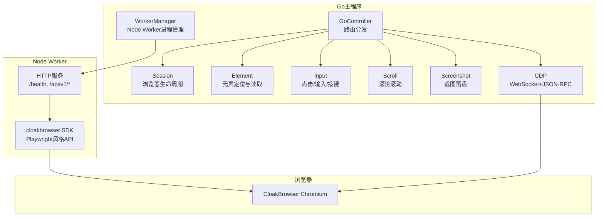
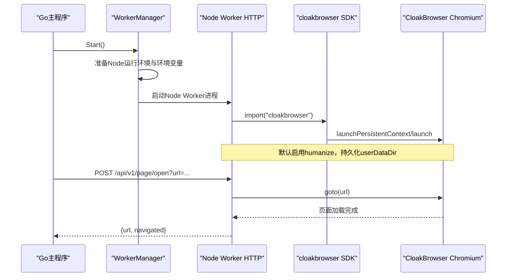
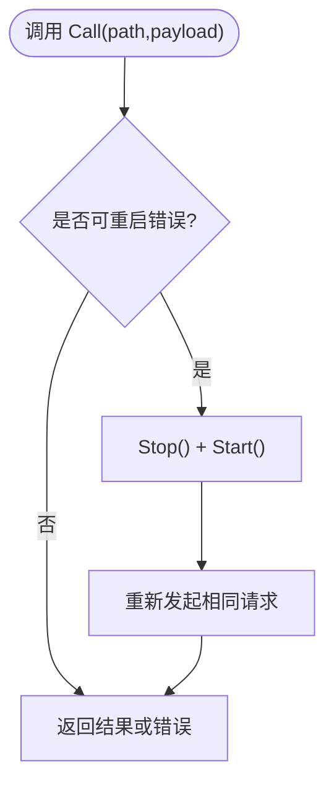
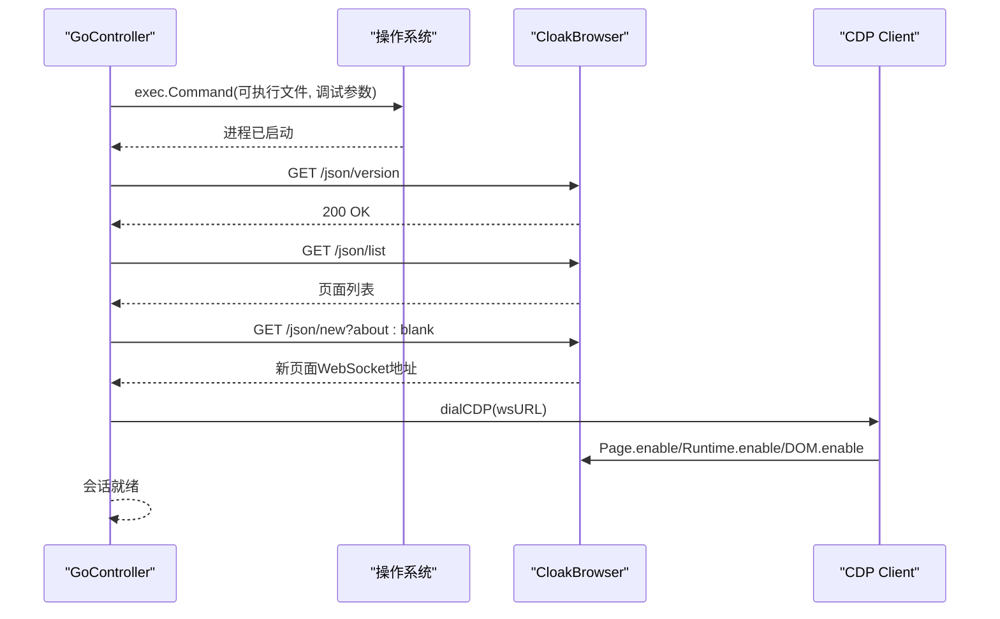
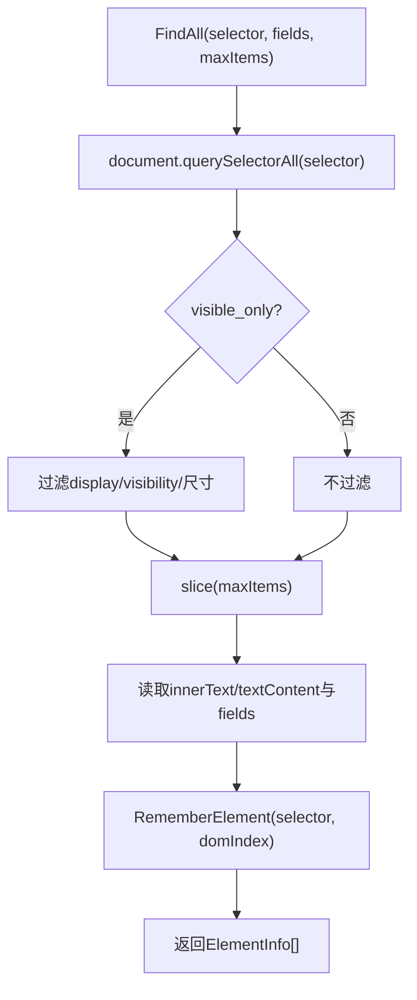
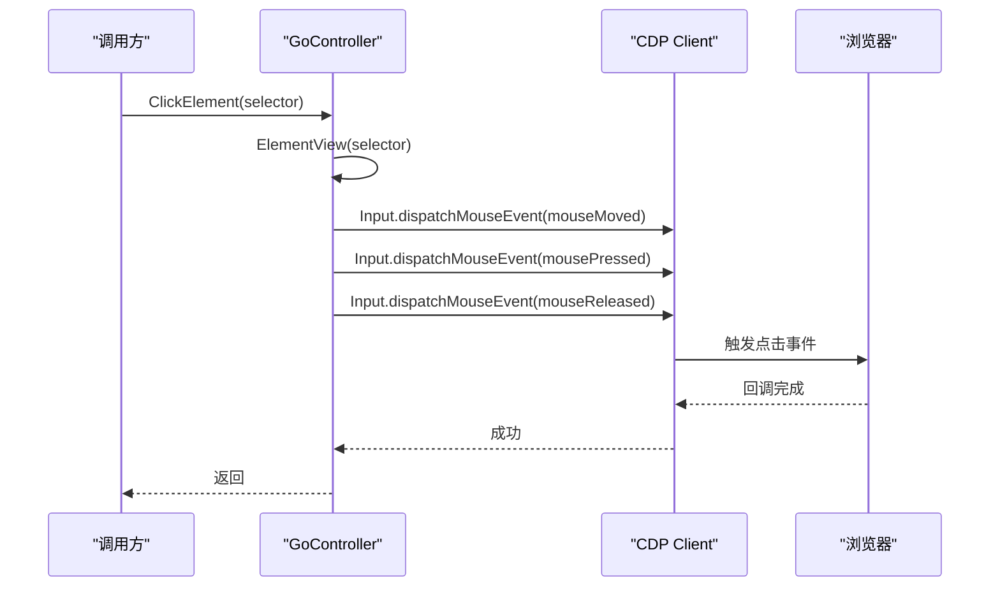
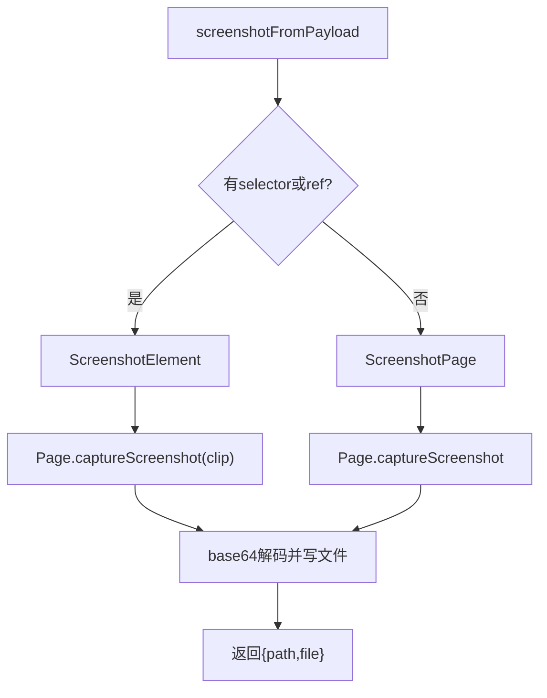
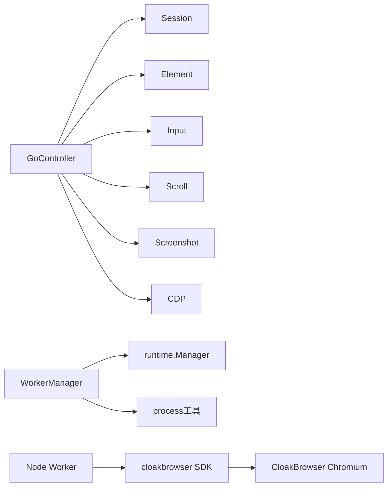

# 浏览器控制引擎

<cite>
**本文引用的文件**   
- [go_controller.go](file://goodhr5/local-agent-go/internal/browser/go_controller.go)
- [go_cdp.go](file://goodhr5/local-agent-go/internal/browser/go_cdp.go)
- [worker.go](file://goodhr5/local-agent-go/internal/browser/worker.go)
- [CLOAKBROWSER.md](file://goodhr5/local-agent-go/internal/browser/CLOAKBROWSER.md)
- [cloud-control-local-agent-architecture.md](file://docs/cloud-control-local-agent-architecture.md)
- [go_session.go](file://goodhr5/local-agent-go/internal/browser/go_session.go)
- [go_element.go](file://goodhr5/local-agent-go/internal/browser/go_element.go)
- [go_input.go](file://goodhr5/local-agent-go/internal/browser/go_input.go)
- [go_screenshot.go](file://goodhr5/local-agent-go/internal/browser/go_screenshot.go)
- [go_scroll.go](file://goodhr5/local-agent-go/internal/browser/go_scroll.go)
- [go_actions.go](file://goodhr5/local-agent-go/internal/browser/go_actions.go)
- [viewport.go](file://goodhr5/local-agent-go/internal/browser/viewport.go)
- [index.js](file://goodhr5/local-agent-go/worker-node/src/index.js)
</cite>

## 更新摘要
**变更内容**   
- 移除了对已删除的 `local-agent-go-new` 目录结构的所有引用
- 更新了架构描述，明确当前仅存在 `local-agent-go` 和 `worker-node` 两个实现路径
- 简化了组件关系图，移除不存在的中间层组件
- 更新了依赖关系分析，反映实际的代码组织结构

## 目录
1. [简介](#简介)
2. [项目结构](#项目结构)
3. [核心组件](#核心组件)
4. [架构总览](#架构总览)
5. [详细组件分析](#详细组件分析)
6. [依赖关系分析](#依赖关系分析)
7. [性能与稳定性](#性能与稳定性)
8. [故障排查指南](#故障排查指南)
9. [结论](#结论)
10. [附录：API调用示例与调试方法](#附录api调用示例与调试方法)

## 简介
本文件面向GoodHR本地Agent的"浏览器控制引擎"，聚焦以下目标：
- 解释CDP协议通信机制，以及Go实验性控制器如何直连CloakBrowser。
- 说明Node Worker进程管理、浏览器会话控制、元素定位与操作。
- 阐述截图、滚动、输入模拟等核心能力。
- 给出浏览器启动配置、性能优化策略、错误处理机制。
- 提供具体API调用示例和调试方法，帮助开发者理解底层实现。

该引擎包含两条路径：
- 生产路径：Go主程序通过WorkerManager启动并复用Node Browser Worker，由Node侧使用cloakbrowser npm包驱动CloakBrowser Chromium。
- 实验路径：Go直接启动CloakBrowser可执行文件，通过Chrome DevTools Protocol（CDP）进行页面与元素级控制。

## 项目结构
浏览器控制相关代码集中在local-agent-go/internal/browser目录，按职责拆分：
- go_controller.go：统一入口、类型定义、路由分发、操作清单。
- go_session.go：浏览器生命周期、页面列表、打开/刷新/等待加载。
- go_element.go：元素查找、文本/属性/HTML读取、视口信息、引用缓存。
- go_input.go：真实鼠标点击、键盘输入、组合键派发。
- go_scroll.go：真实滚轮滚动页面或元素。
- go_screenshot.go：页面/元素截图，落盘PNG。
- go_cdp.go：WebSocket握手、CDP消息收发、异步响应匹配。
- worker.go：Node Worker进程管理、健康检查、自动重启、端口探测。
- viewport.go：固定内容视口尺寸常量。
- CLOAKBROWSER.md：CloakBrowser能力边界、接入方式与注意事项。
- docs/cloud-control-local-agent-architecture.md：云端控制台与本地Agent整体架构说明。



图表来源
- [go_controller.go:109-374](file://goodhr5/local-agent-go/internal/browser/go_controller.go#L109-L374)
- [worker.go:35-142](file://goodhr5/local-agent-go/internal/browser/worker.go#L35-L142)
- [index.js:50-120](file://goodhr5/local-agent-go/worker-node/src/index.js#L50-L120)

章节来源
- [go_controller.go:1-130](file://goodhr5/local-agent-go/internal/browser/go_controller.go#L1-L130)
- [worker.go:1-142](file://goodhr5/local-agent-go/internal/browser/worker.go#L1-L142)
- [CLOAKBROWSER.md:87-143](file://goodhr5/local-agent-go/internal/browser/CLOAKBROWSER.md#L87-L143)

## 核心组件
- GoController：统一暴露Start/Call/CallGet，兼容Node Worker路由形态；维护当前页、元素引用、下载记录、用户数据目录等状态。
- Session：负责启动/停止CloakBrowser，创建或切换页面，等待DevTools就绪，启用Page/Runtime/DOM域。
- Element：基于document.querySelectorAll与JS表达式读取元素信息、可见性与视口位置，支持选择器合并与字段提取。
- Input：通过CDP Input.dispatchMouseEvent/Input.dispatchKeyEvent/Input.insertText实现人类化输入。
- Scroll：通过Input.dispatchMouseEvent mouseWheel事件滚动页面或元素，避免注入scroll脚本。
- Screenshot：通过Page.captureScreenshot截取页面或元素区域，保存为PNG。
- CDP：自定义WebSocket连接与帧编解码，发送JSON-RPC请求，等待对应ID响应，支持超时与关闭信号。
- WorkerManager：启动/停止/重启Node Worker，固定端口探测，日志收集，兼容性校验，失败自动重试。

章节来源
- [go_controller.go:109-374](file://goodhr5/local-agent-go/internal/browser/go_controller.go#L109-L374)
- [go_session.go:18-132](file://goodhr5/local-agent-go/internal/browser/go_session.go#L18-L132)
- [go_element.go:11-105](file://goodhr5/local-agent-go/internal/browser/go_element.go#L11-L105)
- [go_input.go:11-114](file://goodhr5/local-agent-go/internal/browser/go_input.go#L11-L114)
- [go_scroll.go:8-51](file://goodhr5/local-agent-go/internal/browser/go_scroll.go#L8-L51)
- [go_screenshot.go:14-86](file://goodhr5/local-agent-go/internal/browser/go_screenshot.go#L14-L86)
- [go_cdp.go:21-81](file://goodhr5/local-agent-go/internal/browser/go_cdp.go#L21-L81)
- [worker.go:35-142](file://goodhr5/local-agent-go/internal/browser/worker.go#L35-L142)

## 架构总览
GoodHR本地Agent在运行时存在两种浏览器控制路径：

- 生产路径（Node Worker）
  - Go主程序通过WorkerManager启动Node Worker进程，设置环境变量GOODHR_WORKER_ADDR、GOODHR_CLOAKBROWSER_PATH等。
  - Node Worker暴露HTTP接口，接收浏览器控制请求，动态导入cloakbrowser npm包，使用launchPersistentContext或launch启动CloakBrowser Chromium。
  - 通过Playwright风格API完成页面导航、元素定位、输入、截图、滚动等操作。
  - 支持持久化userDataDir保留登录态，默认启用humanize提升人类行为特征。

- 实验路径（Go直连CDP）
  - GoController直接启动CloakBrowser可执行文件，绑定--remote-debugging-address=127.0.0.1与随机端口。
  - 等待/devtools/json/version可用后，获取页面WebSocketDebuggerURL，建立WebSocket连接，实现CDP JSON-RPC通信。
  - 通过Runtime.evaluate执行JS查询DOM，通过Input.*与Page.*命令完成点击、输入、滚动、截图等。



图表来源
- [worker.go:78-142](file://goodhr5/local-agent-go/internal/browser/worker.go#L78-L142)
- [index.js:388-530](file://goodhr5/local-agent-go/worker-node/src/index.js#L388-L530)

章节来源
- [CLOAKBROWSER.md:87-143](file://goodhr5/local-agent-go/internal/browser/CLOAKBROWSER.md#L87-L143)
- [cloud-control-local-agent-architecture.md:30-52](file://docs/cloud-control-local-agent-architecture.md#L30-L52)

## 详细组件分析

### CDP协议通信机制
Go实验控制器实现了轻量级CDP客户端：
- WebSocket握手：手动构造HTTP Upgrade请求，解析101 Switching Protocols响应。
- 帧编解码：实现WebSocket文本帧读写，包括长度编码、掩码生成与解掩码、控制帧处理。
- 请求-响应匹配：为每个Call分配自增ID，维护pending map，readLoop将响应投递到对应通道。
- 超时与关闭：支持context取消与client.Close，确保资源释放。

```mermaid
classDiagram
class cdpClient {
+conn websocketConn
+mu Mutex
+nextID int
+pending map[int]chan cdpMessage
+closed chan struct{}
+Call(ctx, method, params) map[string]any
+Close() error
-removePending(id) void
-readLoop() void
}
class websocketConn {
+conn net.Conn
+mu Mutex
+WriteText(payload []byte) error
+ReadText() []byte
+writeControl(opcode, payload) error
+Close() error
}
cdpClient --> websocketConn : "使用"
```

图表来源
- [go_cdp.go:21-81](file://goodhr5/local-agent-go/internal/browser/go_cdp.go#L21-L81)
- [go_cdp.go:148-289](file://goodhr5/local-agent-go/internal/browser/go_cdp.go#L148-L289)

章节来源
- [go_cdp.go:48-114](file://goodhr5/local-agent-go/internal/browser/go_cdp.go#L48-L114)
- [go_cdp.go:197-289](file://goodhr5/local-agent-go/internal/browser/go_cdp.go#L197-L289)

### Node Worker进程管理
WorkerManager负责：
- 启动Node Worker进程，注入GOODHR_WORKER_ADDR、GOODHR_WORKER_VERSION、GOODHR_CLOAKBROWSER_PATH等环境变量。
- 写入日志文件，监控进程退出，捕获最近日志片段辅助诊断。
- 健康检查：轮询http://127.0.0.1:port+/health，验证worker字段为node且版本兼容。
- 自动重启：当POST/GET调用失败且错误可重启时，Stop后再Start并重发原请求。
- 端口清理：启动前检测固定端口是否被旧Worker占用，必要时终止进程树并等待端口释放。



图表来源
- [worker.go:254-292](file://goodhr5/local-agent-go/internal/browser/worker.go#L254-L292)
- [worker.go:294-364](file://goodhr5/local-agent-go/internal/browser/worker.go#L294-L364)
- [worker.go:437-484](file://goodhr5/local-agent-go/internal/browser/worker.go#L437-L484)

章节来源
- [worker.go:78-142](file://goodhr5/local-agent-go/internal/browser/worker.go#L78-L142)
- [worker.go:241-364](file://goodhr5/local-agent-go/internal/browser/worker.go#L241-364)

### 浏览器会话控制
Go实验控制器会话流程：
- 启动：解析可执行文件路径，分配随机调试端口，传入--headless/--user-data-dir等参数，启动about:blank。
- 等待DevTools：轮询/json/version直到成功。
- 创建页面：优先复用已有页面，否则通过/json/new创建新页面。
- 建立CDP：根据WebSocketDebuggerURL建立连接，启用Page/Runtime/DOM域。
- 页面切换：ListPages/UsePage更新当前页并清空元素引用。
- 页面操作：OpenPage/ReloadPage/WaitPageLoad通过CDP Page.navigate/Page.reload/Runtime.evaluate实现。



图表来源
- [go_session.go:18-103](file://goodhr5/local-agent-go/internal/browser/go_session.go#L18-L103)
- [go_session.go:310-373](file://goodhr5/local-agent-go/internal/browser/go_session.go#L310-L373)

章节来源
- [go_session.go:18-132](file://goodhr5/local-agent-go/internal/browser/go_session.go#L18-L132)
- [go_session.go:198-240](file://goodhr5/local-agent-go/internal/browser/go_session.go#L198-L240)

### 元素定位与操作
元素定位采用CSS选择器与引用缓存结合：
- FindAll：通过document.querySelectorAll查找元素，可选visible过滤，支持fields字段提取，返回索引、文本、字段与元素引用。
- RememberElement：将选择器与DOM索引缓存为ref，后续可通过ref快速定位。
- ElementText/Attribute/HTML：通过elementExprLocked构建JS表达式，在页面上下文中执行并返回值。
- ElementView：读取getBoundingClientRect与computedStyle，判断visible与in_viewport。
- 选择器规范化：支持纯class名转换为CSS选择器，支持父类+目标类组合。



图表来源
- [go_element.go:23-105](file://goodhr5/local-agent-go/internal/browser/go_element.go#L23-L105)
- [go_element.go:107-139](file://goodhr5/local-agent-go/internal/browser/go_element.go#L107-L139)
- [go_element.go:218-238](file://goodhr5/local-agent-go/internal/browser/go_element.go#L218-L238)

章节来源
- [go_element.go:11-105](file://goodhr5/local-agent-go/internal/browser/go_element.go#L11-L105)
- [go_element.go:141-216](file://goodhr5/local-agent-go/internal/browser/go_element.go#L141-L216)

### 输入模拟与滚动控制
输入与滚动均通过CDP真实事件实现，避免DOM赋值与脚本滚动：
- ClickElement：先计算元素中心坐标，依次派发mouseMoved/mousePressed/mouseReleased。
- FillElement：先点击聚焦，再使用Control+A/Meta+A全选并Backspace清除，最后通过Input.insertText插入文本，并校验最终值。
- PressKey：解析跨平台组合键（如ControlOrMeta+A），通过Input.dispatchKeyEvent派发keyDown/keyUp。
- ScrollPage/ScrollElement：通过Input.dispatchMouseEvent mouseWheel事件滚动，坐标限制在视口范围内。
- EnsureElementVisible：循环滚动直到元素进入视口，记录每次尝试的view信息。



图表来源
- [go_input.go:11-41](file://goodhr5/local-agent-go/internal/browser/go_input.go#L11-L41)
- [go_input.go:43-114](file://goodhr5/local-agent-go/internal/browser/go_input.go#L43-L114)
- [go_scroll.go:8-51](file://goodhr5/local-agent-go/internal/browser/go_scroll.go#L8-L51)
- [go_actions.go:10-56](file://goodhr5/local-agent-go/internal/browser/go_actions.go#L10-L56)

章节来源
- [go_input.go:11-173](file://goodhr5/local-agent-go/internal/browser/go_input.go#L11-L173)
- [go_scroll.go:8-81](file://goodhr5/local-agent-go/internal/browser/go_scroll.go#L8-L81)
- [go_actions.go:10-56](file://goodhr5/local-agent-go/internal/browser/go_actions.go#L10-L56)

### 截图功能
截图支持页面与元素两种模式：
- ScreenshotPage：直接调用Page.captureScreenshot，format=png，fromSurface=true，captureBeyondViewport=true。
- ScreenshotElement：先计算元素clip区域，再调用Page.captureScreenshot并传入clip。
- 文件落盘：默认保存到系统临时目录goodhr-screenshots，文件名带时间戳，支持自定义目录与文件名。
- 兜底策略：screenshotFromPayload优先尝试元素截图，失败后回退到页面截图。



图表来源
- [go_screenshot.go:14-86](file://goodhr5/local-agent-go/internal/browser/go_screenshot.go#L14-L86)
- [go_element.go:240-255](file://goodhr5/local-agent-go/internal/browser/go_element.go#L240-L255)

章节来源
- [go_screenshot.go:14-95](file://goodhr5/local-agent-go/internal/browser/go_screenshot.go#L14-L95)

### 浏览器启动配置与性能优化
- 启动参数：
  - 调试端口：--remote-debugging-address=127.0.0.1与随机端口。
  - 无头模式：--headless=new。
  - 用户数据目录：--user-data-dir用于持久化Cookie与LocalStorage。
  - 禁用后台网络：--disable-background-networking减少无关请求。
  - 测试期间取消固定窗口尺寸，允许浏览器使用账号保存或系统默认窗口大小。
- 性能优化：
  - 复用页面与上下文，避免频繁创建销毁。
  - 使用document.readyState等待页面加载完成。
  - 滚动使用真实滚轮事件，避免注入scroll脚本带来的不一致。
  - 固定内容视口宽度1440、高度900，保证定位一致性。
- 安全边界：
  - CDP仅绑定本机127.0.0.1，不暴露公网。
  - 不在日志中输出Cookie、代理密码、完整CDP地址。
  - 遵守招聘平台条款与访问频率限制。

章节来源
- [go_session.go:48-66](file://goodhr5/local-agent-go/internal/browser/go_session.go#L48-L66)
- [go_session.go:291-308](file://goodhr5/local-agent-go/internal/browser/go_session.go#L291-L308)
- [viewport.go:4-14](file://goodhr5/local-agent-go/internal/browser/viewport.go#L4-L14)
- [CLOAKBROWSER.md:163-172](file://goodhr5/local-agent-go/internal/browser/CLOAKBROWSER.md#L163-L172)

### 错误处理机制
- Node Worker：
  - normalizeCallError将连接拒绝等错误转换为中文提示。
  - isRestartableCallError判断是否适合自动重启并重发请求。
  - workerExitError在进程退出时附加最近日志片段。
- Go实验控制器：
  - CDP Call支持context取消与关闭信号，避免阻塞。
  - 元素操作前检查visible与in_viewport，避免无效点击。
  - 输入后校验最终value，防止静默失败。
  - 截图失败时回退到页面截图。

章节来源
- [worker.go:334-364](file://goodhr5/local-agent-go/internal/browser/worker.go#L334-L364)
- [worker.go:658-700](file://goodhr5/local-agent-go/internal/browser/worker.go#L658-L700)
- [go_input.go:43-81](file://goodhr5/local-agent-go/internal/browser/go_input.go#L43-L81)
- [go_cdp.go:48-81](file://goodhr5/local-agent-go/internal/browser/go_cdp.go#L48-L81)

## 依赖关系分析
- GoController依赖Session、Element、Input、Scroll、Screenshot、CDP模块。
- WorkerManager依赖runtime.Manager获取Node与CloakBrowser路径，依赖process工具终止进程树。
- Node Worker依赖cloakbrowser npm包，通过动态import加载，使用launchPersistentContext或launch。
- CloakBrowser Chromium提供源码级指纹补丁与人类化交互基础能力。



图表来源
- [go_controller.go:109-374](file://goodhr5/local-agent-go/internal/browser/go_controller.go#L109-L374)
- [worker.go:35-142](file://goodhr5/local-agent-go/internal/browser/worker.go#L35-L142)
- [index.js:388-530](file://goodhr5/local-agent-go/worker-node/src/index.js#L388-L530)

章节来源
- [go_controller.go:109-374](file://goodhr5/local-agent-go/internal/browser/go_controller.go#L109-L374)
- [worker.go:35-142](file://goodhr5/local-agent-go/internal/browser/worker.go#L35-L142)
- [index.js:388-530](file://goodhr5/local-agent-go/worker-node/src/index.js#L388-L530)

## 性能与稳定性
- 页面加载等待：使用document.readyState轮询，避免过早操作未就绪DOM。
- 滚动策略：真实滚轮事件+视口内坐标限制，避免脚本滚动导致的布局差异。
- 元素引用缓存：减少重复querySelectorAll开销，提高连续操作效率。
- 截图优化：元素截图优先，失败回退页面截图；captureBeyondViewport确保长内容完整。
- Worker健壮性：健康检查、版本兼容校验、自动重启、日志附加，提升长期运行稳定性。
- 资源释放：CDP client关闭、浏览器进程Kill、日志文件Sync，避免资源泄漏。

## 故障排查指南
- Node Worker未启动：
  - 检查端口是否被占用，使用ensureWorkerPortAvailable确认。
  - 查看logs/browser-worker.log最近日志片段。
  - 调用Status或/health确认worker字段与版本。
- 浏览器启动失败：
  - 检查GOODHR_CLOAKBROWSER_PATH或可执行文件路径是否正确。
  - 查看waitDevTools超时错误，确认调试端口可用。
  - 检查userDataDir权限与锁文件残留。
- 元素不可见或无法点击：
  - 调用EnsureElementVisible滚动到视口，记录attempts与final_view。
  - 检查ElementView返回的visible与in_viewport字段。
- 输入校验失败：
  - 检查FillElement后value是否与预期一致。
  - 确认目标元素是否为input或contenteditable。
- 截图失败：
  - 检查元素clip计算是否有效，回退到页面截图。
  - 确认目录权限与磁盘空间。

章节来源
- [worker.go:437-484](file://goodhr5/local-agent-go/internal/browser/worker.go#L437-L484)
- [worker.go:658-700](file://goodhr5/local-agent-go/internal/browser/worker.go#L658-L700)
- [go_session.go:310-329](file://goodhr5/local-agent-go/internal/browser/go_session.go#L310-L329)
- [go_actions.go:10-56](file://goodhr5/local-agent-go/internal/browser/go_actions.go#L10-L56)
- [go_input.go:43-81](file://goodhr5/local-agent-go/internal/browser/go_input.go#L43-L81)
- [go_screenshot.go:34-86](file://goodhr5/local-agent-go/internal/browser/go_screenshot.go#L34-L86)

## 结论
GoodHR本地Agent的浏览器控制引擎通过双路径设计兼顾稳定与演进：
- 生产路径依赖Node Worker与cloakbrowser SDK，具备成熟的持久化上下文、人类化输入与平台适配能力。
- 实验路径通过Go直连CDP，减少对Node依赖，提供更细粒度控制与更低延迟，但需持续验证平台兼容性与风控表现。
- 两者共享元素定位、滚动、输入、截图等核心能力，并通过统一路由与类型定义保持调用一致性。
- 未来可在完成充分回归测试后，逐步将实验路径替换生产路径，同时保留Node Worker作为降级方案。

## 附录：API调用示例与调试方法

### Node Worker API示例
- 启动浏览器
  - POST /api/v1/browser/start
  - 请求体包含user_data_dir、headless、downloads_path等。
  - 返回running、persistent、user_data_dir、viewport等。
- 打开页面
  - POST /api/v1/page/open
  - 请求体包含url、new_page、timeout等。
  - 返回url、navigated、page_token等。
- 列出页面
  - POST /api/v1/page/list
  - 返回pages数组与count。
- 切换页面
  - POST /api/v1/page/use
  - 请求体包含page_id或page_token。
  - 返回url与page_token。
- 点击元素
  - POST /api/v1/page/click
  - 请求体包含element或selector、index等。
- 输入文本
  - POST /api/v1/page/type
  - 请求体包含element或selector、text等。
- 按下按键
  - POST /api/v1/page/press-key
  - 请求体包含key，支持Control+A、Escape等。
- 滚动
  - POST /api/v1/page/scroll
  - 请求体包含distance、element或selector。
- 截图
  - POST /api/v1/page/screenshot
  - 请求体包含selector/ref/dir/filename/full_page。
  - 返回path与file。
- 健康检查
  - GET /health
  - 返回worker、worker_version、pid、browser_running等。

章节来源
- [index.js:388-530](file://goodhr5/local-agent-go/worker-node/src/index.js#L388-L530)
- [index.js:679-741](file://goodhr5/local-agent-go/worker-node/src/index.js#L679-L741)
- [index.js:763-795](file://goodhr5/local-agent-go/worker-node/src/index.js#L763-L795)
- [index.js:603-620](file://goodhr5/local-agent-go/worker-node/src/index.js#L603-L620)

### Go实验控制器API示例
- 启动浏览器
  - GoController.StartBrowser(ctx, BrowserStartOptions)
  - 选项包含executable_path、user_data_dir、downloads_path、headless等。
  - 返回BrowserStatus，包含running、experimental、current_url等。
- 打开页面
  - GoController.OpenPage(ctx, url)
  - 返回PageInfo，包含url与title。
- 查找元素
  - GoController.FindAll(ctx, ElementSelector, fields, maxItems)
  - 返回ElementInfo数组，包含index、ref、text、fields。
- 点击元素
  - GoController.ClickElement(ctx, ElementSelector)
  - 要求元素visible且in_viewport。
- 输入文本
  - GoController.FillElement(ctx, ElementSelector, text)
  - 自动全选并插入，校验最终value。
- 滚动
  - GoController.ScrollPage(ctx, distance)
  - GoController.ScrollElement(ctx, selector, distance)
- 截图
  - GoController.ScreenshotPage(ctx, ScreenshotOptions)
  - GoController.ScreenshotElement(ctx, ScreenshotOptions)
  - 返回ScreenshotResult，包含path与file。
- 健康检查
  - GoController.BrowserHealth(ctx)
  - 返回BrowserStatus。

章节来源
- [go_controller.go:129-149](file://goodhr5/local-agent-go/internal/browser/go_controller.go#L129-L149)
- [go_controller.go:253-335](file://goodhr5/local-agent-go/internal/browser/go_controller.go#L253-L335)
- [go_session.go:18-103](file://goodhr5/local-agent-go/internal/browser/go_session.go#L18-L103)
- [go_element.go:23-105](file://goodhr5/local-agent-go/internal/browser/go_element.go#L23-L105)
- [go_input.go:11-81](file://goodhr5/local-agent-go/internal/browser/go_input.go#L11-L81)
- [go_scroll.go:8-51](file://goodhr5/local-agent-go/internal/browser/go_scroll.go#L8-L51)
- [go_screenshot.go:14-86](file://goodhr5/local-agent-go/internal/browser/go_screenshot.go#L14-L86)

### 调试方法
- 查看Node Worker日志：
  - 路径位于runtimeDir/logs/browser-worker.log。
  - 关注详情截图诊断、滚动诊断、内存快照等字段。
- 查看Go实验控制器日志：
  - 关注启动参数、DevTools就绪、CDP调用错误。
- 使用/health接口：
  - Node Worker返回worker、worker_version、pid、browser_running。
  - Go实验控制器返回worker、go_experimental、browser_running。
- 元素定位调试：
  - 使用ElementView获取x/y/width/height/visible/in_viewport。
  - 使用EnsureElementVisible记录attempts与final_view。
- 截图调试：
  - 使用screenshotFromPayload优先元素截图，失败回退页面截图。
  - 检查目录权限与文件名合法性。

章节来源
- [worker.go:144-158](file://goodhr5/local-agent-go/internal/browser/worker.go#L144-L158)
- [worker.go:658-700](file://goodhr5/local-agent-go/internal/browser/worker.go#L658-L700)
- [go_element.go:184-216](file://goodhr5/local-agent-go/internal/browser/go_element.go#L184-L216)
- [go_actions.go:10-56](file://goodhr5/local-agent-go/internal/browser/go_actions.go#L10-L56)
- [go_screenshot.go:34-86](file://goodhr5/local-agent-go/internal/browser/go_screenshot.go#L34-L86)