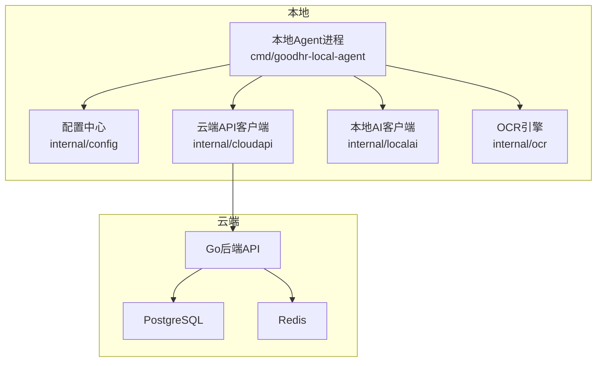
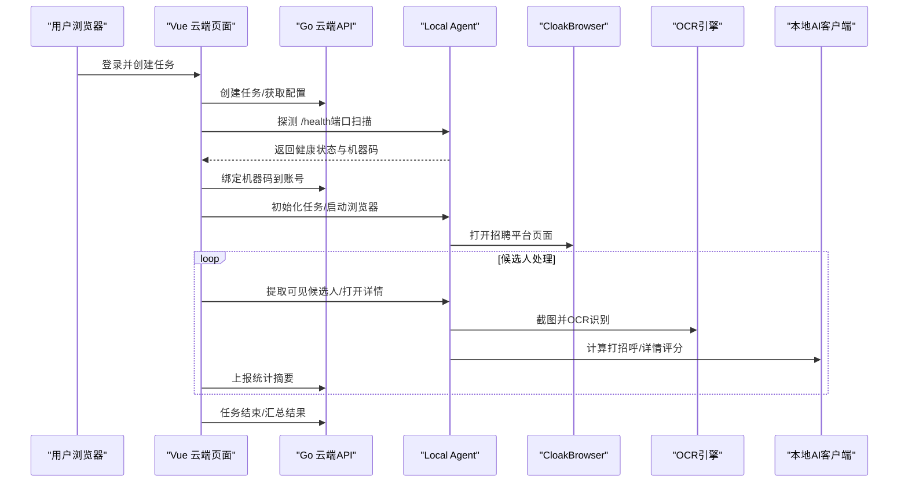
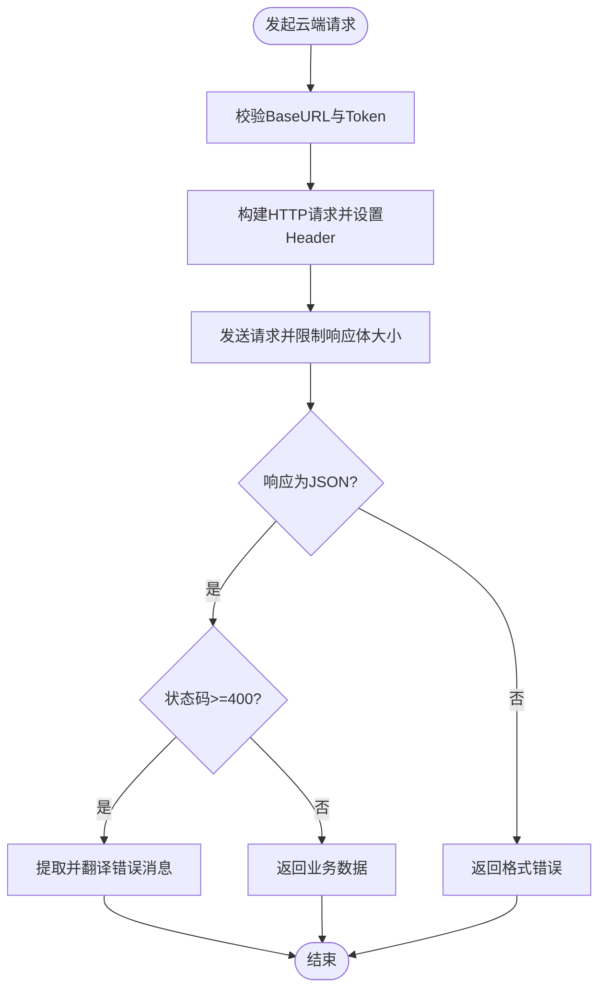
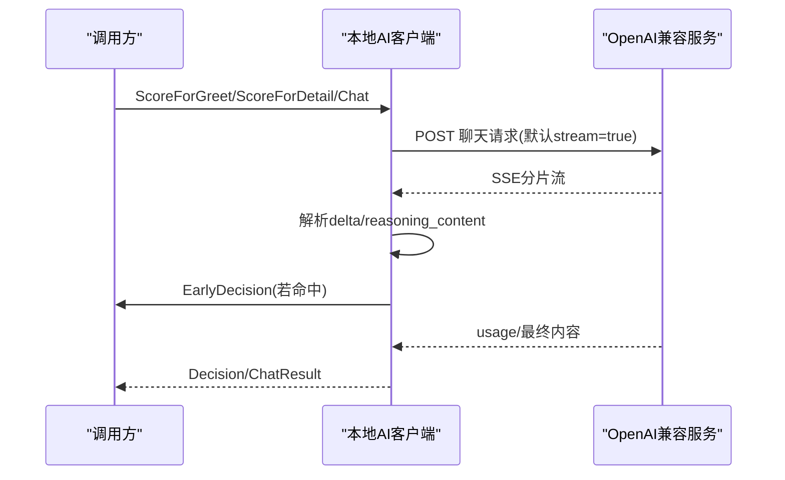
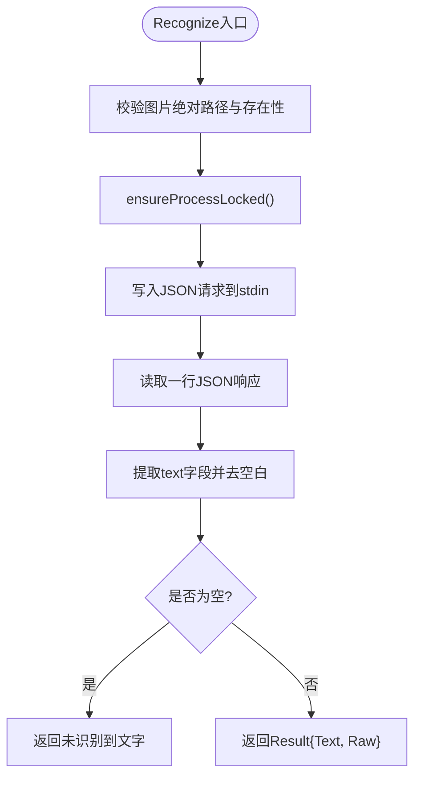
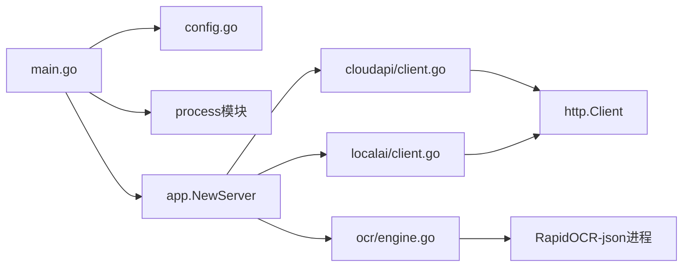

# 系统集成

<cite>
**本文引用的文件**
- [main.go](file://goodhr5/local-agent-go/cmd/goodhr-local-agent/main.go)
- [config.go](file://goodhr5/local-agent-go/internal/config/config.go)
- [client.go（云端API客户端）](file://goodhr5/local-agent-go/internal/cloudapi/client.go)
- [client.go（本地AI客户端）](file://goodhr5/local-agent-go/internal/localai/client.go)
- [engine.go（OCR引擎）](file://goodhr5/local-agent-go/internal/ocr/engine.go)
- [cloud-control-local-agent-architecture.md](file://docs/cloud-control-local-agent-architecture.md)
</cite>

## 目录
1. [简介](#简介)
2. [项目结构](#项目结构)
3. [核心组件](#核心组件)
4. [架构总览](#架构总览)
5. [详细组件分析](#详细组件分析)
6. [依赖关系分析](#依赖关系分析)
7. [性能与连接池优化](#性能与连接池优化)
8. [故障排查指南](#故障排查指南)
9. [结论](#结论)
10. [附录：配置与调试示例](#附录配置与调试示例)

## 简介
本文件面向 GoodHR 本地 Agent 的系统集成，聚焦以下目标：
- 云端 API 客户端实现、认证机制与请求处理流程
- 本地 AI 服务集成、OCR 识别引擎
- 配置文件管理与外部依赖管理
- 错误处理策略、连接池优化
- 服务发现、健康检查与降级方案
- 第三方服务集成的配置示例、调试方法与性能监控
- 本地 Agent 与云端服务的通信协议、数据格式与安全传输机制

## 项目结构
GoodHR 本地 Agent 以 Go 程序为核心，围绕“云端控制台 + 本地执行器”的架构展开。本地程序负责浏览器自动化、截图与 OCR、候选人数据本地存储；云端负责账号、任务编排、系统配置与统计摘要。

图表来源
- [main.go:21-76](file://goodhr5/local-agent-go/cmd/goodhr-local-agent/main.go#L21-L76)
- [config.go:23-96](file://goodhr5/local-agent-go/internal/config/config.go#L23-L96)
- [client.go（云端API客户端）:17-57](file://goodhr5/local-agent-go/internal/cloudapi/client.go#L17-L57)
- [client.go（本地AI客户端）:33-115](file://goodhr5/local-agent-go/internal/localai/client.go#L33-L115)
- [engine.go:21-43](file://goodhr5/local-agent-go/internal/ocr/engine.go#L21-L43)

章节来源
- [main.go:21-76](file://goodhr5/local-agent-go/cmd/goodhr-local-agent/main.go#L21-L76)
- [config.go:23-96](file://goodhr5/local-agent-go/internal/config/config.go#L23-L96)
- [cloud-control-local-agent-architecture.md:31-52](file://docs/cloud-control-local-agent-architecture.md#L31-L52)

## 核心组件
- 本地入口与生命周期：解析参数、初始化配置、启动本地服务、日志输出、可选自动打开控制台。
- 配置管理：默认监听地址与端口、数据目录、运行时目录、OCR 目录、前端控制台目录、云 API 基址、是否自动打开控制台等。
- 云端 API 客户端：封装公开接口与鉴权接口，统一 JSON 响应解析、错误翻译、重试与业务状态同步。
- 本地 AI 客户端：基于 OpenAI 兼容接口进行打分、流式读取、提前决策、视觉识别、超时与重试策略。
- OCR 引擎：通过常驻子进程调用 RapidOCR-json，完成图片文字识别，具备进程生命周期管理与日志落盘。

章节来源
- [main.go:21-76](file://goodhr5/local-agent-go/cmd/goodhr-local-agent/main.go#L21-L76)
- [config.go:23-96](file://goodhr5/local-agent-go/internal/config/config.go#L23-L96)
- [client.go（云端API客户端）:17-57](file://goodhr5/local-agent-go/internal/cloudapi/client.go#L17-L57)
- [client.go（本地AI客户端）:33-115](file://goodhr5/local-agent-go/internal/localai/client.go#L33-L115)
- [engine.go:21-43](file://goodhr5/local-agent-go/internal/ocr/engine.go#L21-L43)

## 架构总览
云端与本地的职责边界清晰：云端保存任务元信息、统计摘要、配置与机器绑定；本地保存候选人详情、截图、OCR 原文与浏览器 profile。本地通过 HTTP 向云端上报状态与统计，云端通过 Web 页面协调任务并读取本地数据。

图表来源
- [cloud-control-local-agent-architecture.md:161-180](file://docs/cloud-control-local-agent-architecture.md#L161-L180)
- [cloud-control-local-agent-architecture.md:595-618](file://docs/cloud-control-local-agent-architecture.md#L595-L618)
- [client.go（云端API客户端）:313-370](file://goodhr5/local-agent-go/internal/cloudapi/client.go#L313-L370)
- [client.go（本地AI客户端）:164-256](file://goodhr5/local-agent-go/internal/localai/client.go#L164-L256)
- [engine.go:59-97](file://goodhr5/local-agent-go/internal/ocr/engine.go#L59-L97)

## 详细组件分析

### 云端 API 客户端
- 功能要点
  - 统一 BaseURL 校验与规范化
  - 鉴权请求：Bearer Token 注入 Authorization 头
  - JSON 响应解析与错误消息翻译
  - 岗位运行状态同步、统计上报、简历进度补报、扫描记录上报
  - 设备绑定、失败邮件通知、控制台地址获取、平台配置拉取、订阅与个人配置读取
- 关键流程
  - 认证：所有受保护接口通过 getAuthed/postAuthed 注入 Token
  - 错误处理：HTTP 非 2xx 时提取云端 msg/message/error 字段并翻译常见英文错误
  - 安全：BaseURL 必须包含 scheme 和 host，路径拼接前清理尾部斜杠

图表来源
- [client.go（云端API客户端）:523-604](file://goodhr5/local-agent-go/internal/cloudapi/client.go#L523-L604)
- [client.go（云端API客户端）:639-699](file://goodhr5/local-agent-go/internal/cloudapi/client.go#L639-L699)

章节来源
- [client.go（云端API客户端）:17-57](file://goodhr5/local-agent-go/internal/cloudapi/client.go#L17-L57)
- [client.go（云端API客户端）:523-604](file://goodhr5/local-agent-go/internal/cloudapi/client.go#L523-L604)
- [client.go（云端API客户端）:639-699](file://goodhr5/local-agent-go/internal/cloudapi/client.go#L639-L699)

### 本地 AI 客户端
- 功能要点
  - 支持 OpenAI 兼容聊天接口，默认开启流式输出
  - 提前从流式中解析评分 JSON，触发 EarlyDecision 回调
  - 视觉识别：将长图转为 base64 与结构化提示词一起发送给模型
  - 超时、重试与退避：根据 Retry-After 头部或状态码判断可重试与致命错误
  - 温度、模型、额外参数合并策略，避免覆盖显式传入值
- 关键流程
  - Chat：组装 payload，默认 stream=true，最多重试3次，按 ServiceError 策略退避
  - 流式读取：按行读取 SSE，累积正文与思考内容，支持提前决策
  - 错误分类：401/403/404/429/5xx 等区分可重试与致命错误

图表来源
- [client.go（本地AI客户端）:164-256](file://goodhr5/local-agent-go/internal/localai/client.go#L164-L256)
- [client.go（本地AI客户端）:258-326](file://goodhr5/local-agent-go/internal/localai/client.go#L258-L326)
- [client.go（本地AI客户端）:328-403](file://goodhr5/local-agent-go/internal/localai/client.go#L328-L403)
- [client.go（本地AI客户端）:470-539](file://goodhr5/local-agent-go/internal/localai/client.go#L470-L539)

章节来源
- [client.go（本地AI客户端）:33-115](file://goodhr5/local-agent-go/internal/localai/client.go#L33-L115)
- [client.go（本地AI客户端）:258-326](file://goodhr5/local-agent-go/internal/localai/client.go#L258-L326)
- [client.go（本地AI客户端）:470-539](file://goodhr5/local-agent-go/internal/localai/client.go#L470-L539)

### OCR 识别引擎
- 功能要点
  - 通过 exec.Command 启动 RapidOCR-json 常驻进程，复用 stdin/stdout 管道
  - 进程生命周期管理：首次调用时启动，异常退出后重建
  - 模型就绪检查：检测 models 目录下必要 ONNX 模型文件
  - 日志落盘：stderr 重定向至 runtime/logs/ocr.log
- 关键流程
  - Recognize：校验图片路径 -> 确保进程存在 -> 写入JSON请求 -> 读取一行JSON响应 -> 提取文本
  - 错误处理：EOF/读取失败/进程退出均给出明确提示与日志路径

图表来源
- [engine.go:59-97](file://goodhr5/local-agent-go/internal/ocr/engine.go#L59-L97)
- [engine.go:99-146](file://goodhr5/local-agent-go/internal/ocr/engine.go#L99-L146)
- [engine.go:148-179](file://goodhr5/local-agent-go/internal/ocr/engine.go#L148-L179)
- [engine.go:240-278](file://goodhr5/local-agent-go/internal/ocr/engine.go#L240-L278)

章节来源
- [engine.go:21-43](file://goodhr5/local-agent-go/internal/ocr/engine.go#L21-L43)
- [engine.go:59-97](file://goodhr5/local-agent-go/internal/ocr/engine.go#L59-L97)
- [engine.go:99-146](file://goodhr5/local-agent-go/internal/ocr/engine.go#L99-L146)
- [engine.go:148-179](file://goodhr5/local-agent-go/internal/ocr/engine.go#L148-L179)
- [engine.go:240-278](file://goodhr5/local-agent-go/internal/ocr/engine.go#L240-L278)

### 配置文件管理
- 配置项
  - 环境、控制台地址、监听地址与端口、数据目录、运行时目录、日志目录、OCR 目录、前端控制台目录、下载目录、截图目录、云 API 基址、是否自动打开控制台、开发扫描限制
- 行为
  - 自动创建所需目录
  - 默认数据目录使用系统用户配置目录下的固定应用名
  - 可通过环境变量覆盖部分行为（如 GOODHR_DATA_DIR、GOODHR_AUTO_OPEN_CONSOLE）

章节来源
- [config.go:23-96](file://goodhr5/local-agent-go/internal/config/config.go#L23-L96)
- [config.go:107-149](file://goodhr5/local-agent-go/internal/config/config.go#L107-L149)

### 本地入口与服务启动
- 启动流程
  - 解析命令行参数（host/port/data-dir/open-console/restart/print-config）
  - 可选打印运行时配置并退出
  - 可选关闭旧实例并释放端口
  - 初始化配置与文件日志
  - 异步确保浏览器 profile 默认值
  - 初始化并运行本地服务

章节来源
- [main.go:21-76](file://goodhr5/local-agent-go/cmd/goodhr-local-agent/main.go#L21-L76)
- [main.go:79-102](file://goodhr5/local-agent-go/cmd/goodhr-local-agent/main.go#L79-L102)

## 依赖关系分析
- 本地入口依赖配置模块与进程管理模块
- 云端 API 客户端依赖标准库 http.Client，无外部框架耦合
- 本地 AI 客户端依赖 OpenAI 兼容 HTTP 接口，内部维护重试与流式解析
- OCR 引擎依赖外部可执行文件（RapidOCR-json），通过进程管道通信
- 云端与本地通过 HTTP 交互，遵循 CORS/Private Network Access 要求

图表来源
- [main.go:21-76](file://goodhr5/local-agent-go/cmd/goodhr-local-agent/main.go#L21-L76)
- [client.go（云端API客户端）:17-57](file://goodhr5/local-agent-go/internal/cloudapi/client.go#L17-L57)
- [client.go（本地AI客户端）:33-115](file://goodhr5/local-agent-go/internal/localai/client.go#L33-L115)
- [engine.go:21-43](file://goodhr5/local-agent-go/internal/ocr/engine.go#L21-L43)

章节来源
- [main.go:21-76](file://goodhr5/local-agent-go/cmd/goodhr-local-agent/main.go#L21-L76)
- [client.go（云端API客户端）:17-57](file://goodhr5/local-agent-go/internal/cloudapi/client.go#L17-L57)
- [client.go（本地AI客户端）:33-115](file://goodhr5/local-agent-go/internal/localai/client.go#L33-L115)
- [engine.go:21-43](file://goodhr5/local-agent-go/internal/ocr/engine.go#L21-L43)

## 性能与连接池优化
- 云端 API 客户端
  - 使用共享 http.Client 并设置超时，避免频繁新建连接
  - 响应体限制读取，防止大响应占用内存
- 本地 AI 客户端
  - 默认启用流式输出，降低首字节延迟
  - 最多3次重试，结合 Retry-After 退避，减少瞬时拥塞影响
  - 合理合并 temperature/model/extra 参数，避免重复网络开销
- OCR 引擎
  - 常驻进程模式减少模型加载与进程启动开销
  - 管道读写加锁，保证并发安全
  - 日志落盘便于定位性能瓶颈

[本节提供通用指导，不直接分析具体文件]

## 故障排查指南
- 云端 API 客户端
  - 认证失败：检查 Token 是否过期或无效，参考 AuthExpiredError 语义
  - 业务错误：查看云端返回的 msg/message/error 字段，已做常见英文错误中文翻译
  - 网络错误：检查 BaseURL 格式与网络连通性
- 本地 AI 客户端
  - 服务不可用：根据 ServiceError 的 StatusCode/Body/Cause 判断是否可重试或致命
  - 流式中断：关注 readChatStream 的错误提示，必要时关闭 enable_thinking 或调整模型
- OCR 引擎
  - 组件未安装/模型不完整：检查 executablePath 与 modelsReady
  - 进程异常退出：查看 runtime/logs/ocr.log 中的 stderr 输出
  - 读取失败：确认 stdout 管道是否正常，必要时重启进程

章节来源
- [client.go（云端API客户端）:32-43](file://goodhr5/local-agent-go/internal/cloudapi/client.go#L32-L43)
- [client.go（云端API客户端）:523-604](file://goodhr5/local-agent-go/internal/cloudapi/client.go#L523-L604)
- [client.go（云端API客户端）:639-699](file://goodhr5/local-agent-go/internal/cloudapi/client.go#L639-L699)
- [client.go（本地AI客户端）:64-100](file://goodhr5/local-agent-go/internal/localai/client.go#L64-L100)
- [client.go（本地AI客户端）:328-403](file://goodhr5/local-agent-go/internal/localai/client.go#L328-L403)
- [engine.go:99-146](file://goodhr5/local-agent-go/internal/ocr/engine.go#L99-L146)
- [engine.go:202-238](file://goodhr5/local-agent-go/internal/ocr/engine.go#L202-L238)

## 结论
GoodHR 本地 Agent 采用清晰的云端/本地职责划分：云端负责编排与统计，本地负责执行与隐私敏感数据。通过统一的云端 API 客户端、灵活的本地 AI 客户端与稳健的 OCR 引擎，实现了高可用、可观测、易扩展的集成体系。配合健康检查、CORS/PNA、错误分类与重试退避，系统在真实环境中具备良好的鲁棒性与可维护性。

[本节总结整体设计，不直接分析具体文件]

## 附录：配置与调试示例
- 本地程序启动参数
  - host/port：指定监听地址与端口
  - data-dir：指定数据目录
  - open-console：是否自动打开控制台
  - restart：启动前先关闭旧实例并释放端口
  - print-config：仅输出运行时配置并退出
- 环境变量
  - GOODHR_DATA_DIR：覆盖默认数据目录
  - GOODHR_AUTO_OPEN_CONSOLE：控制是否自动打开控制台
  - GOODHR_OCR_EXECUTABLE：指定 OCR 可执行文件路径
  - GOODHR_OCR_ARGS：传入 OCR 额外参数
- 健康检查与服务发现
  - 云端页面依次探测 127.0.0.1:9001-9009 的 /health，首个成功者作为本地 Agent 地址
- CORS 与 Private Network Access
  - 本地 Agent 需允许来自正式域名的跨源访问，并处理 OPTIONS 预检
- 调试建议
  - 查看本地日志：runtime/logs/local-agent.log
  - 查看 OCR 日志：runtime/logs/ocr.log
  - 观察 AI 流式输出：通过 EarlyDecision 与 Progress 回调定位问题
  - 云端 API 错误：捕获并打印云端返回的 msg/message/error 字段

章节来源
- [main.go:21-76](file://goodhr5/local-agent-go/cmd/goodhr-local-agent/main.go#L21-L76)
- [config.go:23-96](file://goodhr5/local-agent-go/internal/config/config.go#L23-L96)
- [cloud-control-local-agent-architecture.md:161-180](file://docs/cloud-control-local-agent-architecture.md#L161-L180)
- [cloud-control-local-agent-architecture.md:547-565](file://docs/cloud-control-local-agent-architecture.md#L547-L565)
- [engine.go:202-238](file://goodhr5/local-agent-go/internal/ocr/engine.go#L202-L238)
- [client.go（云端API客户端）:639-699](file://goodhr5/local-agent-go/internal/cloudapi/client.go#L639-L699)
- [client.go（本地AI客户端）:470-539](file://goodhr5/local-agent-go/internal/localai/client.go#L470-L539)