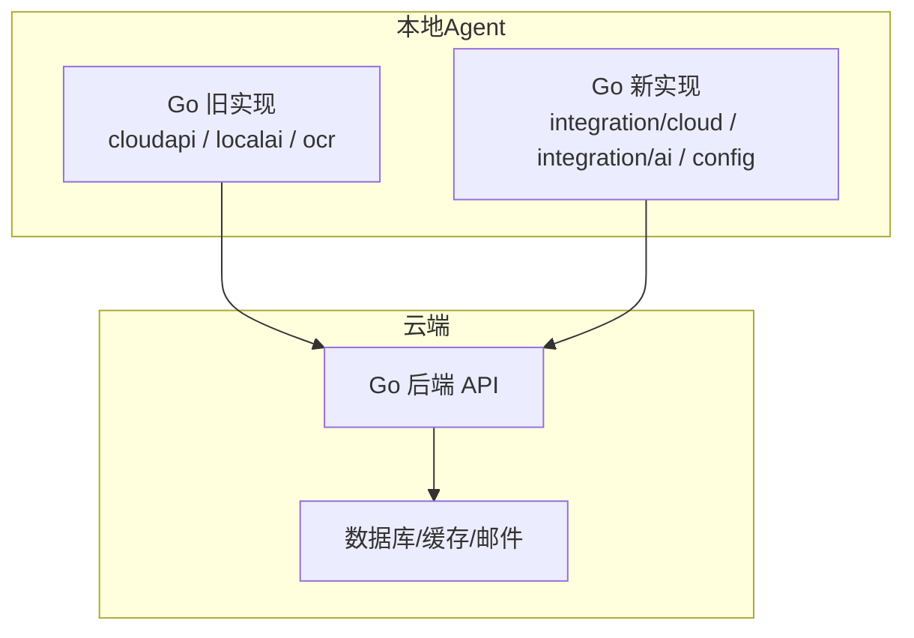
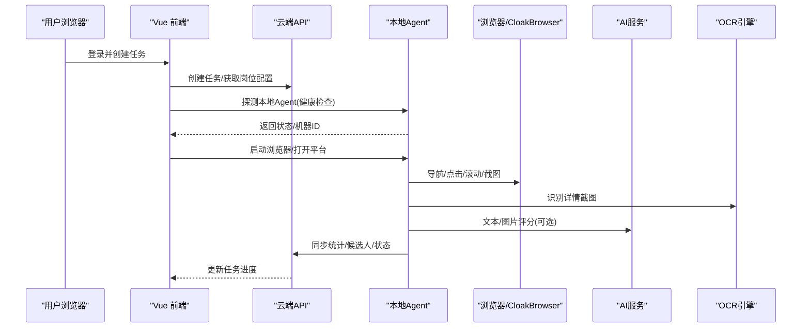
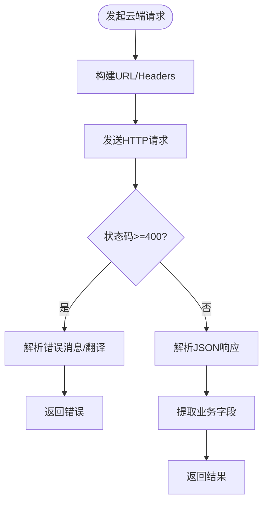
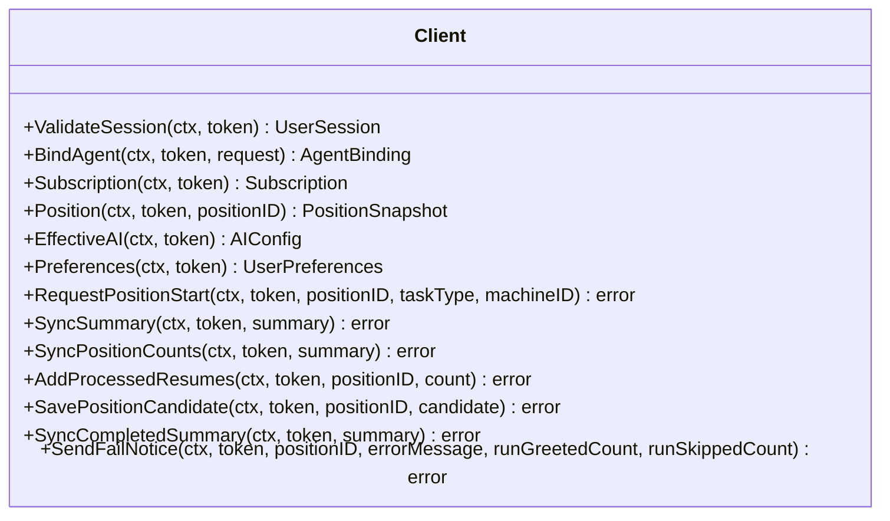
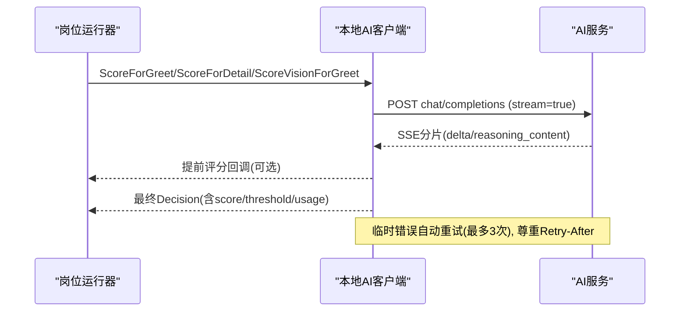
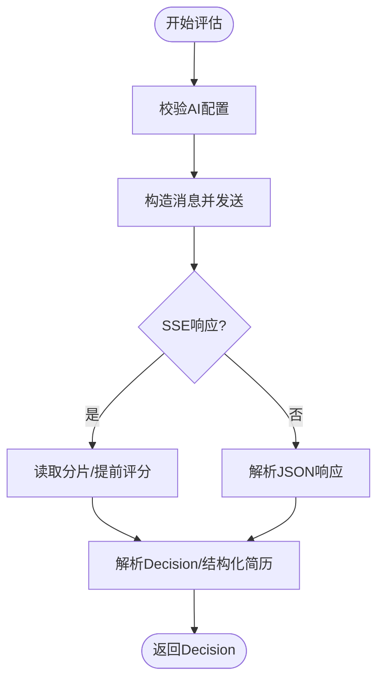
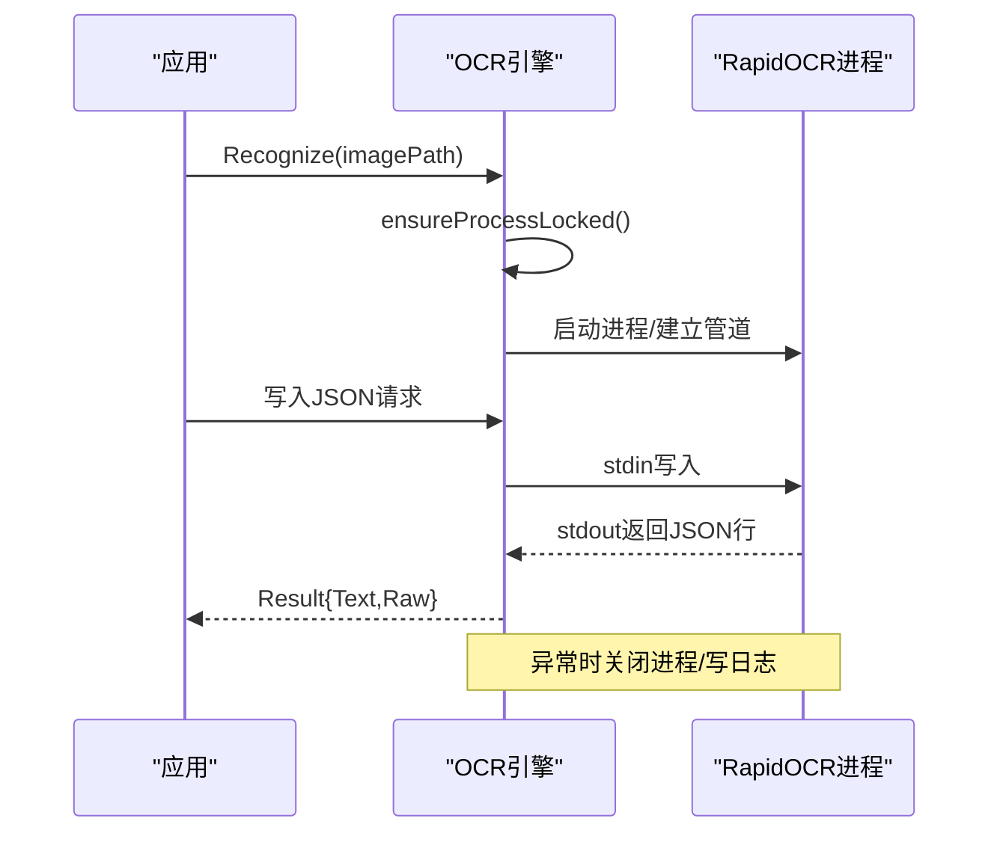
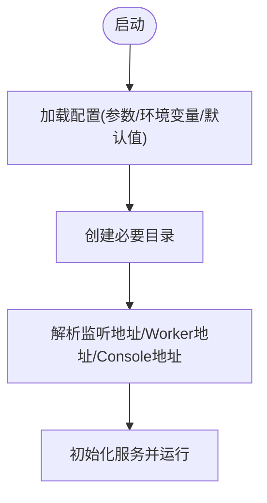
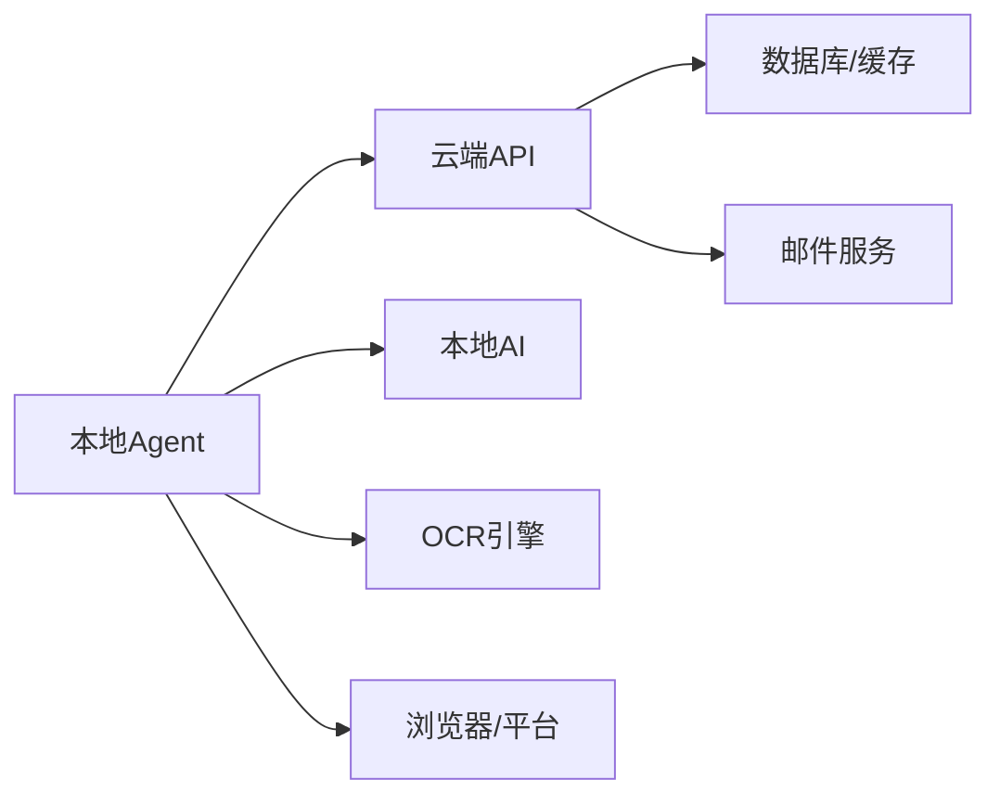
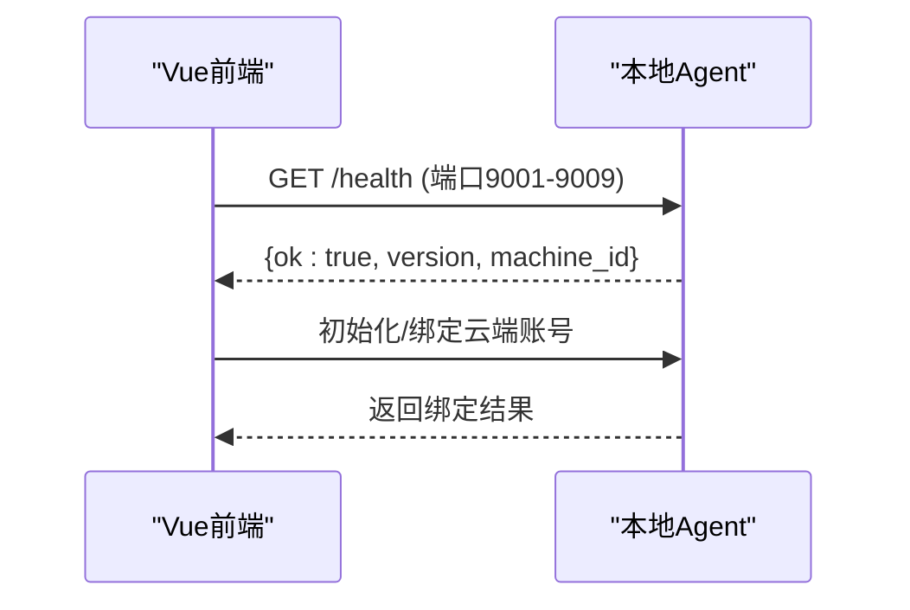

# 系统集成

<cite>
**本文引用的文件**
- [main.go](file://goodhr5/local-agent-go/cmd/goodhr-local-agent/main.go)
- [config.go](file://goodhr5/local-agent-go/internal/config/config.go)
- [client.go](file://goodhr5/local-agent-go/internal/cloudapi/client.go)
- [client.go](file://goodhr5/local-agent-go/internal/localai/client.go)
- [engine.go](file://goodhr5/local-agent-go/internal/ocr/engine.go)
- [client.go](file://goodhr5/local-agent-go-new/internal/integration/cloud/client.go)
- [client.go](file://goodhr5/local-agent-go-new/internal/integration/ai/client.go)
- [config.go](file://goodhr5/local-agent-go-new/internal/config/config.go)
- [cloud-control-local-agent-architecture.md](file://docs/cloud-control-local-agent-architecture.md)
</cite>

## 目录
1. [简介](#简介)
2. [项目结构](#项目结构)
3. [核心组件](#核心组件)
4. [架构总览](#架构总览)
5. [详细组件分析](#详细组件分析)
6. [依赖关系分析](#依赖关系分析)
7. [性能与连接池优化](#性能与连接池优化)
8. [故障处理与降级策略](#故障处理与降级策略)
9. [服务发现与健康检查](#服务发现与健康检查)
10. [第三方集成配置与调试](#第三方集成配置与调试)
11. [通信协议与安全传输](#通信协议与安全传输)
12. [结论](#结论)

## 简介
本文件面向 GoodHR 本地 Agent 与云端服务的系统集成，覆盖以下主题：
- 云端 API 客户端实现、认证机制、请求处理流程
- 本地 AI 服务集成（OpenAI 兼容接口）、OCR 识别引擎
- 配置文件管理、外部服务依赖管理
- 错误处理策略、连接池优化、重试与退避
- 服务发现机制、健康检查、降级方案
- 第三方服务集成的配置示例、调试方法、性能监控
- 本地 Agent 与云端服务的通信协议、数据格式、安全传输机制

## 项目结构
GoodHR 包含两套本地 Agent 实现：
- Go 版本旧实现（local-agent-go）：以通用 JSON 为主，提供云端 API 客户端、本地 AI 调用、OCR 引擎和基础配置。
- Go 版本新实现（local-agent-go-new）：强类型客户端、统一配置加载、更清晰的集成边界。

图表来源
- [client.go:17-55](file://goodhr5/local-agent-go/internal/cloudapi/client.go#L17-L55)
- [client.go:17-29](file://goodhr5/local-agent-go-new/internal/integration/cloud/client.go#L17-L29)
- [config.go:27-83](file://goodhr5/local-agent-go/internal/config/config.go#L27-L83)
- [config.go:30-89](file://goodhr5/local-agent-go-new/internal/config/config.go#L30-L89)

章节来源
- [main.go:18-61](file://goodhr5/local-agent-go/cmd/goodhr-local-agent/main.go#L18-L61)
- [config.go:27-83](file://goodhr5/local-agent-go/internal/config/config.go#L27-L83)
- [config.go:30-89](file://goodhr5/local-agent-go-new/internal/config/config.go#L30-L89)

## 核心组件
- 云端 API 客户端（旧/新）：封装登录态校验、岗位运行、统计同步、候选人上传、失败通知等能力。
- 本地 AI 客户端：对接 OpenAI 兼容接口，支持文本、图片、SSE 流式响应、提前评分回调、重试与退避。
- OCR 引擎：通过本地进程（RapidOCR-json）执行截图文字识别，具备进程生命周期管理与日志输出。
- 配置管理：统一读取环境变量、默认值、创建运行时目录、端口与地址解析。

章节来源
- [client.go:17-55](file://goodhr5/local-agent-go/internal/cloudapi/client.go#L17-L55)
- [client.go:17-29](file://goodhr5/local-agent-go-new/internal/integration/cloud/client.go#L17-L29)
- [client.go:23-115](file://goodhr5/local-agent-go/internal/localai/client.go#L23-L115)
- [client.go:22-92](file://goodhr5/local-agent-go-new/internal/integration/ai/client.go#L22-L92)
- [engine.go:21-97](file://goodhr5/local-agent-go/internal/ocr/engine.go#L21-L97)
- [config.go:27-83](file://goodhr5/local-agent-go/internal/config/config.go#L27-L83)
- [config.go:30-89](file://goodhr5/local-agent-go-new/internal/config/config.go#L30-L89)

## 架构总览
云端负责任务编排、用户与系统配置、统计摘要；本地 Agent 负责浏览器操作、截图、OCR、候选人数据处理，并通过 HTTP 与云端交互。

图表来源
- [cloud-control-local-agent-architecture.md:32-52](file://docs/cloud-control-local-agent-architecture.md#L32-L52)
- [client.go:17-55](file://goodhr5/local-agent-go/internal/cloudapi/client.go#L17-L55)
- [client.go:17-29](file://goodhr5/local-agent-go-new/internal/integration/cloud/client.go#L17-L29)
- [client.go:23-115](file://goodhr5/local-agent-go/internal/localai/client.go#L23-L115)
- [engine.go:21-97](file://goodhr5/local-agent-go/internal/ocr/engine.go#L21-L97)

## 详细组件分析

### 云端 API 客户端（旧实现）
- 职责：访问云端公开接口与会员接口，完成控制台地址获取、平台配置读取、会话校验、岗位运行详情获取、AI 配置读取、个人偏好、候选人保存、统计同步、停止通知、失败邮件通知等。
- 认证：使用 Bearer Token 进行鉴权，未登录时返回明确错误。
- 请求处理：统一的 doJSON 封装，限制响应体大小，解析 JSON 并提取错误消息，支持中英文错误映射。
- 错误处理：区分网络错误、HTTP 错误、业务错误，对“session is invalid or expired”等常见错误进行中文提示。

图表来源
- [client.go:342-423](file://goodhr5/local-agent-go/internal/cloudapi/client.go#L342-L423)
- [client.go:458-496](file://goodhr5/local-agent-go/internal/cloudapi/client.go#L458-L496)

章节来源
- [client.go:17-55](file://goodhr5/local-agent-go/internal/cloudapi/client.go#L17-L55)
- [client.go:128-164](file://goodhr5/local-agent-go/internal/cloudapi/client.go#L128-L164)
- [client.go:166-212](file://goodhr5/local-agent-go/internal/cloudapi/client.go#L166-L212)
- [client.go:236-340](file://goodhr5/local-agent-go/internal/cloudapi/client.go#L236-L340)
- [client.go:342-423](file://goodhr5/local-agent-go/internal/cloudapi/client.go#L342-L423)
- [client.go:498-541](file://goodhr5/local-agent-go/internal/cloudapi/client.go#L498-L541)

### 云端 API 客户端（新实现）
- 职责：强类型封装登录态验证、设备绑定、订阅状态、岗位快照、有效 AI 配置、用户偏好、任务启动、统计同步、完成状态确认、失败通知等。
- 认证：同样使用 Bearer Token，统一 do 方法处理请求与响应，错误转换为 APIError。
- 健壮性：对响应结构兼容 data 包裹或顶层字段，规范化岗位与用户偏好范围。

图表来源
- [client.go:17-29](file://goodhr5/local-agent-go-new/internal/integration/cloud/client.go#L17-L29)
- [client.go:31-147](file://goodhr5/local-agent-go-new/internal/integration/cloud/client.go#L31-L147)
- [client.go:172-306](file://goodhr5/local-agent-go-new/internal/integration/cloud/client.go#L172-L306)
- [client.go:393-468](file://goodhr5/local-agent-go-new/internal/integration/cloud/client.go#L393-L468)

章节来源
- [client.go:31-147](file://goodhr5/local-agent-go-new/internal/integration/cloud/client.go#L31-L147)
- [client.go:172-306](file://goodhr5/local-agent-go-new/internal/integration/cloud/client.go#L172-L306)
- [client.go:393-468](file://goodhr5/local-agent-go-new/internal/integration/cloud/client.go#L393-L468)

### 本地 AI 服务集成（旧实现）
- 职责：基于云端下发的 AI 配置调用 OpenAI 兼容接口，支持文本与图片评分、SSE 流式响应、提前评分回调、思考模式显示、重试与退避。
- 超时与重试：默认 180s 超时，临时错误最多重试 3 次，按 Retry-After 退避。
- 错误分类：ServiceError 标记可重试与致命错误，便于上层决定是否需要停止岗位运行。

图表来源
- [client.go:164-256](file://goodhr5/local-agent-go/internal/localai/client.go#L164-L256)
- [client.go:258-326](file://goodhr5/local-agent-go/internal/localai/client.go#L258-L326)
- [client.go:328-403](file://goodhr5/local-agent-go/internal/localai/client.go#L328-L403)
- [client.go:470-539](file://goodhr5/local-agent-go/internal/localai/client.go#L470-L539)

章节来源
- [client.go:23-115](file://goodhr5/local-agent-go/internal/localai/client.go#L23-L115)
- [client.go:164-256](file://goodhr5/local-agent-go/internal/localai/client.go#L164-L256)
- [client.go:258-326](file://goodhr5/local-agent-go/internal/localai/client.go#L258-L326)
- [client.go:328-403](file://goodhr5/local-agent-go/internal/localai/client.go#L328-L403)
- [client.go:470-539](file://goodhr5/local-agent-go/internal/localai/client.go#L470-L539)

### 本地 AI 服务集成（新实现）
- 职责：强类型决策对象、文本/图片评估、回复生成、SSE 流式响应、提前评分回调、重试与退避。
- 配置：Ready 校验 BaseURL/APIKey/Model，chatOptions 控制思考模式与阈值。
- 错误：ServiceError 标记可重试与致命错误，IsPositionStoppingError 用于决定是否停止任务。

图表来源
- [client.go:22-92](file://goodhr5/local-agent-go-new/internal/integration/ai/client.go#L22-L92)
- [client.go:108-193](file://goodhr5/local-agent-go-new/internal/integration/ai/client.go#L108-L193)
- [client.go:235-303](file://goodhr5/local-agent-go-new/internal/integration/ai/client.go#L235-L303)
- [client.go:317-352](file://goodhr5/local-agent-go-new/internal/integration/ai/client.go#L317-L352)

章节来源
- [client.go:22-92](file://goodhr5/local-agent-go-new/internal/integration/ai/client.go#L22-L92)
- [client.go:108-193](file://goodhr5/local-agent-go-new/internal/integration/ai/client.go#L108-L193)
- [client.go:235-303](file://goodhr5/local-agent-go-new/internal/integration/ai/client.go#L235-L303)
- [client.go:317-352](file://goodhr5/local-agent-go-new/internal/integration/ai/client.go#L317-L352)

### OCR 识别引擎
- 职责：通过本地进程 RapidOCR-json 执行截图文字识别，维护进程生命周期、输入输出管道、日志文件。
- 健壮性：检测模型文件完整性，异常退出时记录日志路径，支持上下文取消与进程清理。
- 配置：可通过环境变量指定可执行文件路径与额外参数。

图表来源
- [engine.go:21-97](file://goodhr5/local-agent-go/internal/ocr/engine.go#L21-L97)
- [engine.go:99-146](file://goodhr5/local-agent-go/internal/ocr/engine.go#L99-L146)
- [engine.go:148-200](file://goodhr5/local-agent-go/internal/ocr/engine.go#L148-L200)
- [engine.go:202-238](file://goodhr5/local-agent-go/internal/ocr/engine.go#L202-L238)
- [engine.go:240-296](file://goodhr5/local-agent-go/internal/ocr/engine.go#L240-L296)

章节来源
- [engine.go:21-97](file://goodhr5/local-agent-go/internal/ocr/engine.go#L21-L97)
- [engine.go:99-200](file://goodhr5/local-agent-go/internal/ocr/engine.go#L99-L200)
- [engine.go:202-296](file://goodhr5/local-agent-go/internal/ocr/engine.go#L202-L296)

### 配置文件管理
- 旧实现：集中定义默认主机、端口、数据目录、运行时目录、OCR 目录、前端目录、下载目录、截图目录、控制台清单 URL、云端 API 基础地址、是否自动打开控制台等，并自动创建目录。
- 新实现：统一 Load 函数从参数与环境变量加载配置，计算 Worker 入口、Node 路径、数据库路径、扩展目录，确保目录存在，并提供 Worker 与 Console 地址解析。

图表来源
- [config.go:27-83](file://goodhr5/local-agent-go/internal/config/config.go#L27-L83)
- [config.go:30-89](file://goodhr5/local-agent-go-new/internal/config/config.go#L30-L89)
- [config.go:113-140](file://goodhr5/local-agent-go/internal/config/config.go#L113-L140)
- [config.go:192-205](file://goodhr5/local-agent-go-new/internal/config/config.go#L192-L205)

章节来源
- [config.go:27-83](file://goodhr5/local-agent-go/internal/config/config.go#L27-L83)
- [config.go:113-140](file://goodhr5/local-agent-go/internal/config/config.go#L113-L140)
- [config.go:30-89](file://goodhr5/local-agent-go-new/internal/config/config.go#L30-L89)
- [config.go:192-205](file://goodhr5/local-agent-go-new/internal/config/config.go#L192-L205)

## 依赖关系分析
- 本地 Agent 依赖：
  - 云端 API：用于会话校验、岗位配置、统计同步、失败通知等。
  - 本地 AI：用于候选人匹配评分、详情判断、回复生成。
  - OCR 引擎：用于详情截图文字识别。
  - 浏览器/平台：用于页面操作与数据采集。
- 云端依赖：
  - 数据库/缓存：存储用户、任务、配置、会话等。
  - 邮件服务：发送验证码与通知。

图表来源
- [client.go:17-55](file://goodhr5/local-agent-go/internal/cloudapi/client.go#L17-L55)
- [client.go:23-115](file://goodhr5/local-agent-go/internal/localai/client.go#L23-L115)
- [engine.go:21-97](file://goodhr5/local-agent-go/internal/ocr/engine.go#L21-L97)
- [cloud-control-local-agent-architecture.md:32-52](file://docs/cloud-control-local-agent-architecture.md#L32-L52)

章节来源
- [client.go:17-55](file://goodhr5/local-agent-go/internal/cloudapi/client.go#L17-L55)
- [client.go:23-115](file://goodhr5/local-agent-go/internal/localai/client.go#L23-L115)
- [engine.go:21-97](file://goodhr5/local-agent-go/internal/ocr/engine.go#L21-L97)
- [cloud-control-local-agent-architecture.md:32-52](file://docs/cloud-control-local-agent-architecture.md#L32-L52)

## 性能与连接池优化
- HTTP 客户端超时：
  - 云端 API 客户端：默认 15s/20s 超时，避免长时间阻塞。
  - 本地 AI 客户端：默认 180s 超时，适配长耗时推理。
- 响应体限制：统一限制响应体大小，防止内存占用过大。
- 重试与退避：
  - AI 请求临时错误最多重试 3 次，按指数退避与 Retry-After 头调整等待时间。
  - 云端完成状态同步最多尝试 3 次，确保邮件通知确认。
- 流式处理：
  - AI SSE 流式响应，支持提前评分回调，降低首反馈延迟。
  - OCR 进程通过管道读写，避免阻塞主线程。
- 目录与资源：
  - 预创建运行时目录，减少 I/O 错误。
  - OCR 模型完整性检查，避免无效调用。

章节来源
- [client.go:47-55](file://goodhr5/local-agent-go/internal/cloudapi/client.go#L47-L55)
- [client.go:23-115](file://goodhr5/local-agent-go/internal/localai/client.go#L23-L115)
- [client.go:311-326](file://goodhr5/local-agent-go/internal/localai/client.go#L311-L326)
- [client.go:378-403](file://goodhr5/local-agent-go/internal/localai/client.go#L378-L403)
- [client.go:240-264](file://goodhr5/local-agent-go-new/internal/integration/cloud/client.go#L240-L264)
- [client.go:235-303](file://goodhr5/local-agent-go-new/internal/integration/ai/client.go#L235-L303)
- [engine.go:99-146](file://goodhr5/local-agent-go/internal/ocr/engine.go#L99-L146)

## 故障处理与降级策略
- 云端 API 错误：
  - 区分网络错误、HTTP 错误、业务错误，提取 msg/message/error 字段并翻译为中文。
  - 会话失效（401/403）明确提示重新登录。
- AI 服务错误：
  - ServiceError 标记可重试与致命错误，IsPositionStoppingError 用于决定是否停止任务。
  - 400/422 且包含额度/余额/模型不存在等关键词视为致命错误。
  - 支持 Retry-After 秒数或 HTTP 时间解析。
- OCR 错误：
  - 进程异常退出时记录日志路径，提示查看日志。
  - 模型不完整时提示重新安装组件。
- 降级方案：
  - AI 不可用时，可回退到关键词筛选或人工审核。
  - OCR 不可用时，可回退到全文截图或跳过详情识别。
  - 云端不可用时，本地继续运行并缓存统计，待恢复后同步。

章节来源
- [client.go:458-496](file://goodhr5/local-agent-go/internal/cloudapi/client.go#L458-L496)
- [client.go:64-100](file://goodhr5/local-agent-go/internal/localai/client.go#L64-L100)
- [client.go:378-403](file://goodhr5/local-agent-go/internal/localai/client.go#L378-L403)
- [client.go:48-87](file://goodhr5/local-agent-go-new/internal/integration/ai/client.go#L48-L87)
- [client.go:354-374](file://goodhr5/local-agent-go-new/internal/integration/ai/client.go#L354-L374)
- [engine.go:218-238](file://goodhr5/local-agent-go/internal/ocr/engine.go#L218-L238)

## 服务发现与健康检查
- 本地 Agent 健康检查：
  - 云端前端依次探测 127.0.0.1:9001-9009 的 /health，第一个成功响应的端口作为本地 Agent 地址。
  - 若全部失败，提示下载与启动步骤，并提供“重新检测”。
- 本地 Agent 启动：
  - 解析 host/port/data-dir/open-console/restart 参数，初始化配置与服务，必要时关闭旧实例并释放端口。

图表来源
- [cloud-control-local-agent-architecture.md:161-180](file://docs/cloud-control-local-agent-architecture.md#L161-L180)
- [cloud-control-local-agent-architecture.md:404-449](file://docs/cloud-control-local-agent-architecture.md#L404-L449)
- [main.go:18-61](file://goodhr5/local-agent-go/cmd/goodhr-local-agent/main.go#L18-L61)

章节来源
- [cloud-control-local-agent-architecture.md:161-180](file://docs/cloud-control-local-agent-architecture.md#L161-L180)
- [cloud-control-local-agent-architecture.md:404-449](file://docs/cloud-control-local-agent-architecture.md#L404-L449)
- [main.go:18-61](file://goodhr5/local-agent-go/cmd/goodhr-local-agent/main.go#L18-L61)

## 第三方集成配置与调试
- 云端 API 配置：
  - 通过环境变量 GOODHR_CLOUD_API_BASE 设置云端基础地址。
  - 控制台清单 URL 可通过 GOODHR_CONSOLE_MANIFEST_URL 覆盖。
- AI 服务配置：
  - 通过云端下发 EffectiveAI 配置（BaseURL、APIKey、Model、Temperature、SystemPrompt）。
  - 新实现中需满足 Ready 条件（BaseURL、APIKey、Model 非空）。
- OCR 引擎配置：
  - 通过 GOODHR_OCR_EXECUTABLE 指定可执行文件路径。
  - 通过 GOODHR_OCR_ARGS 传入额外参数。
- 调试方法：
  - 启用本地文件日志（local-agent.log），查看启动参数与配置。
  - OCR 组件日志写入 runtime/logs/ocr.log，便于排查进程异常。
  - AI 流式响应支持提前评分回调与思考内容显示，便于定位问题。

章节来源
- [config.go:27-83](file://goodhr5/local-agent-go/internal/config/config.go#L27-L83)
- [config.go:30-89](file://goodhr5/local-agent-go-new/internal/config/config.go#L30-L89)
- [client.go:192-212](file://goodhr5/local-agent-go/internal/cloudapi/client.go#L192-L212)
- [client.go:94-106](file://goodhr5/local-agent-go-new/internal/integration/ai/client.go#L94-L106)
- [engine.go:240-296](file://goodhr5/local-agent-go/internal/ocr/engine.go#L240-L296)
- [main.go:64-86](file://goodhr5/local-agent-go/cmd/goodhr-local-agent/main.go#L64-L86)

## 通信协议与安全传输
- 认证机制：
  - 云端 API 使用 Bearer Token 进行鉴权，未登录时返回明确错误。
  - 本地 Agent 仅监听 127.0.0.1，避免公网暴露。
- CORS 与 Private Network Access：
  - 云端网页访问本地 Agent 需响应 CORS，允许指定域名与方法头，处理 OPTIONS 预检。
- 数据格式：
  - 云端 API 返回 JSON，支持 data 包裹或顶层字段，统一解析。
  - AI 服务采用 OpenAI 兼容接口，支持 JSON 与 SSE 流式响应。
  - OCR 通过 JSON 行协议与本地进程通信。
- 安全传输：
  - 建议使用 HTTPS 访问云端 API。
  - 本地 Agent 不暴露任意文件读写与 shell 执行接口，所有操作限制在数据目录与浏览器控制能力内。

章节来源
- [client.go:342-383](file://goodhr5/local-agent-go/internal/cloudapi/client.go#L342-L383)
- [client.go:393-468](file://goodhr5/local-agent-go-new/internal/integration/cloud/client.go#L393-L468)
- [cloud-control-local-agent-architecture.md:547-578](file://docs/cloud-control-local-agent-architecture.md#L547-L578)
- [client.go:258-326](file://goodhr5/local-agent-go/internal/localai/client.go#L258-L326)
- [engine.go:59-97](file://goodhr5/local-agent-go/internal/ocr/engine.go#L59-L97)

## 结论
GoodHR 本地 Agent 与云端服务通过明确的 HTTP API 与数据格式进行协作，云端负责编排与配置，本地负责执行与数据采集。系统在认证、错误处理、重试与退避、流式响应等方面具备良好健壮性。通过配置管理、健康检查与服务发现，实现了灵活的部署与运维。未来可进一步增强连接池管理、指标采集与告警，以提升整体性能与可观测性。