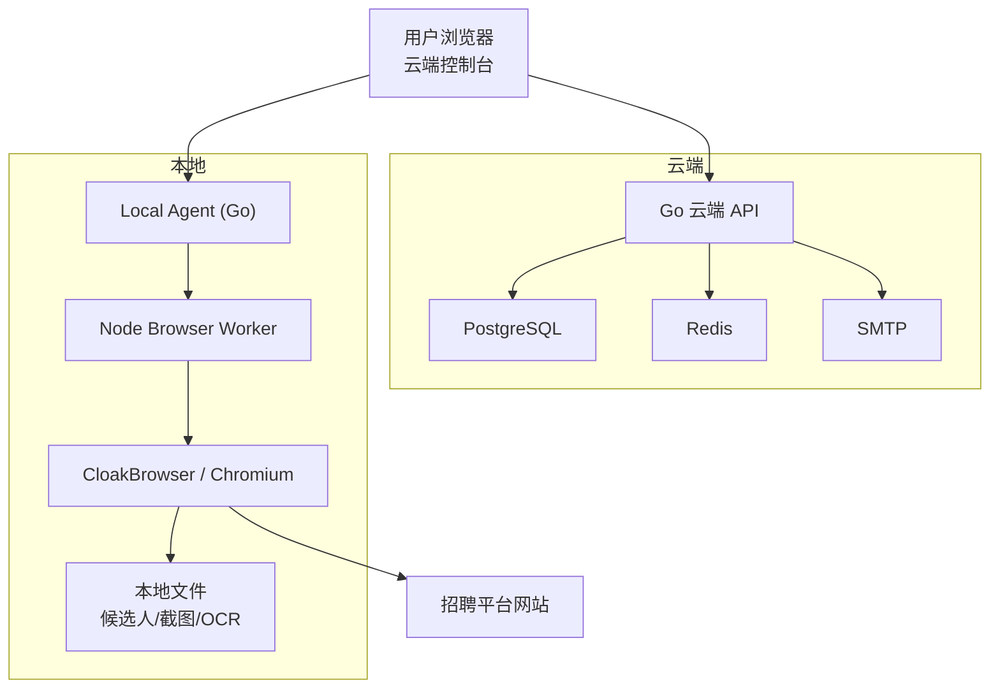
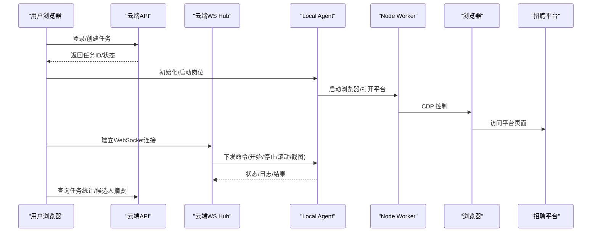
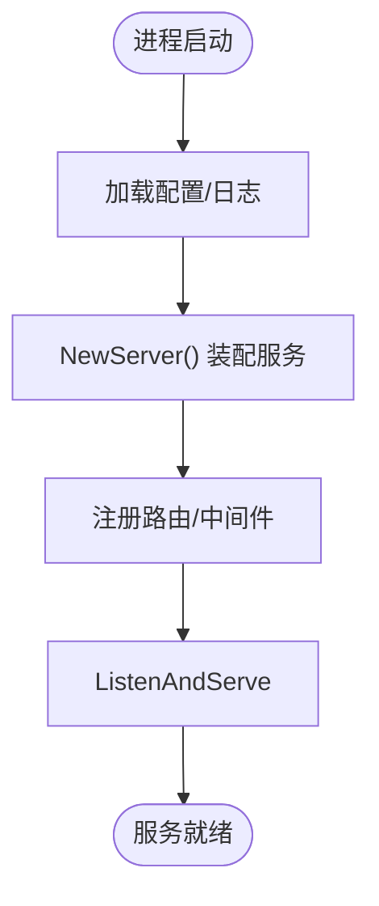
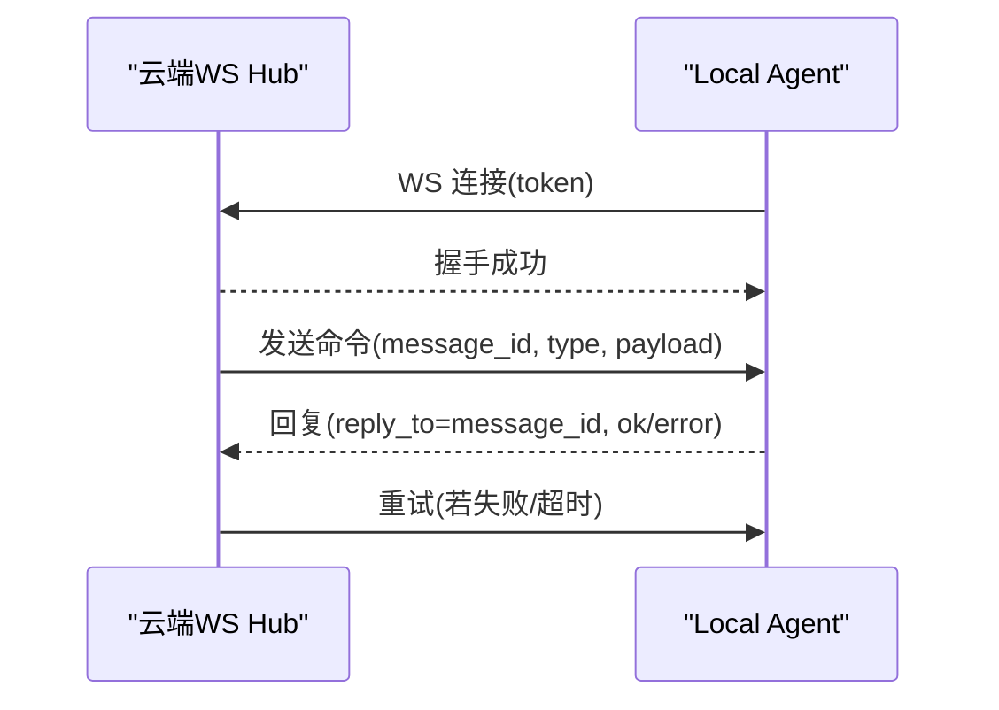
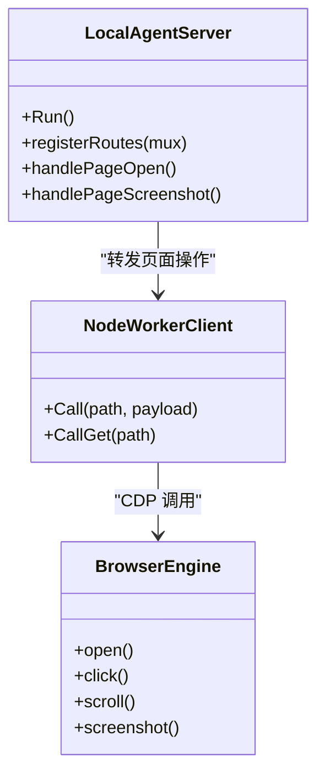
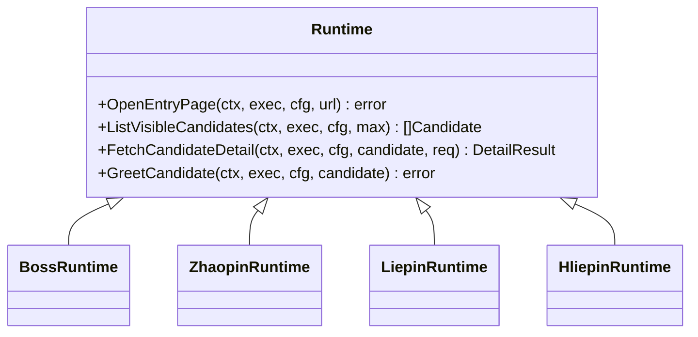
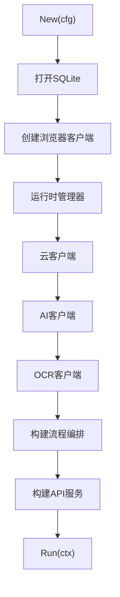
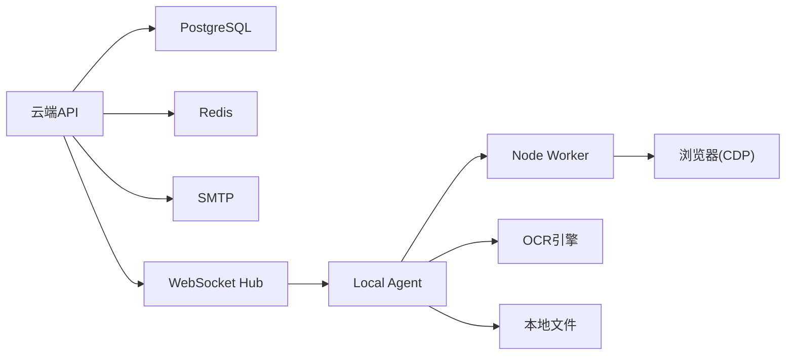

# 系统架构

<cite>
**本文引用的文件**
- [goodhr5/docs/architecture.md](file://goodhr5/docs/architecture.md)
- [docs/cloud-control-local-agent-architecture.md](file://docs/cloud-control-local-agent-architecture.md)
- [goodhr5/cloud/backend/cmd/server/main.go](file://goodhr5/cloud/backend/cmd/server/main.go)
- [goodhr5/cloud/backend/internal/httpapi/server.go](file://goodhr5/cloud/backend/internal/httpapi/server.go)
- [goodhr5/cloud/backend/internal/httpapi/agent_ws.go](file://goodhr5/cloud/backend/internal/httpapi/agent_ws.go)
- [goodhr5/local-agent-go/cmd/goodhr-local-agent/main.go](file://goodhr5/local-agent-go/cmd/goodhr-local-agent/main.go)
- [goodhr5/local-agent-go/internal/app/server.go](file://goodhr5/local-agent-go/internal/app/server.go)
- [goodhr5/local-agent-go/internal/platformcore/runtime.go](file://goodhr5/local-agent-go/internal/platformcore/runtime.go)
- [goodhr5/local-agent-go/internal/browser/go_cdp.go](file://goodhr5/local-agent-go/internal/browser/go_cdp.go)
- [goodhr5/local-agent-go/cmd/goodhr-local-agent/main.go](file://goodhr5/local-agent-go/cmd/goodhr-local-agent/main.go)
- [goodhr5/local-agent-go/internal/bootstrap/application.go](file://goodhr5/local-agent-go/internal/bootstrap/application.go)
- [goodhr5/local-agent-go/internal/platform/registry.go](file://goodhr5/local-agent-go/internal/platform/registry.go)
</cite>

## 目录
1. [简介](#简介)
2. [项目结构](#项目结构)
3. [核心组件](#核心组件)
4. [架构总览](#架构总览)
5. [详细组件分析](#详细组件分析)
6. [依赖关系分析](#依赖关系分析)
7. [性能考虑](#性能考虑)
8. [故障排查指南](#故障排查指南)
9. [结论](#结论)
10. [附录](#附录)

## 简介
本文件面向开发者与架构师，系统性阐述 GoodHR 5 的云端本地混合架构：云端负责用户、任务编排、配置与统计；本地 Agent 负责浏览器自动化、平台页面操作、候选人数据与截图/OCR。文档覆盖职责划分、通信机制（REST API、WebSocket、CDP）、微服务化模式、事件驱动设计、插件化扩展、系统边界与安全策略、性能优化建议，并提供架构图与数据流图帮助理解整体设计。

## 项目结构
GoodHR 5 由三大部分组成：
- 云端后端：Go HTTP 服务，提供认证、Agent 绑定、岗位运行控制、AI 配置、支付、租户等能力，并维护 PostgreSQL/Redis 等持久化与缓存。
- 云端前端：Next.js/Vue 风格控制台，用于创建与管理任务、查看候选人、配置系统与用户偏好。
- 本地执行器：Go + Node Worker 组合，监听本地端口，通过 CDP 控制浏览器，实现招聘平台自动化与候选人数据处理。

图表来源
- [goodhr5/cloud/backend/cmd/server/main.go:14-29](file://goodhr5/cloud/backend/cmd/server/main.go#L14-L29)
- [goodhr5/cloud/backend/internal/httpapi/server.go:124-211](file://goodhr5/cloud/backend/internal/httpapi/server.go#L124-L211)
- [goodhr5/local-agent-go/internal/app/server.go:87-115](file://goodhr5/local-agent-go/internal/app/server.go#L87-L115)
- [goodhr5/local-agent-go/internal/browser/go_cdp.go:48-55](file://goodhr5/local-agent-go/internal/browser/go_cdp.go#L48-L55)

章节来源
- [goodhr5/docs/architecture.md:1-50](file://goodhr5/docs/architecture.md#L1-L50)
- [docs/cloud-control-local-agent-architecture.md:30-52](file://docs/cloud-control-local-agent-architecture.md#L30-L52)

## 核心组件
- 云端 HTTP 服务：统一路由注册、CORS、健康检查、认证、Agent WebSocket Hub、业务服务装配。
- 云端 WebSocket Hub：维护每个用户的唯一在线 Local Agent 连接，支持命令发送、重试、ACK 与超时处理。
- 本地 Agent Go 服务：HTTP 接口、运行时管理、Node Worker 管理、OCR、岗位运行 Runner、平台配置拉取。
- Node Browser Worker：基于 CDP 的浏览器自动化引擎，提供页面打开、点击、滚动、截图、文本提取等能力。
- 平台运行时抽象：定义跨平台的通用流程接口（入口页、候选人列表、详情、打招呼、筛选等），各平台以插件形式实现。
- 存储与缓存：PostgreSQL 持久化用户、任务、配置、日志摘要；Redis 用于验证码、会话、临时状态。
- AI 与 OCR：云端 AI 配置与钱包；本地 OCR 识别候选详情截图，结果落盘。

章节来源
- [goodhr5/cloud/backend/internal/httpapi/server.go:16-121](file://goodhr5/cloud/backend/internal/httpapi/server.go#L16-L121)
- [goodhr5/cloud/backend/internal/httpapi/agent_ws.go:21-141](file://goodhr5/cloud/backend/internal/httpapi/agent_ws.go#L21-L141)
- [goodhr5/local-agent-go/internal/app/server.go:35-63](file://goodhr5/local-agent-go/internal/app/server.go#L35-L63)
- [goodhr5/local-agent-go/internal/platformcore/runtime.go:10-111](file://goodhr5/local-agent-go/internal/platformcore/runtime.go#L10-L111)

## 架构总览
GoodHR 5 采用“云端编排 + 本地执行”的混合架构：
- 云端负责：用户登录、任务创建与生命周期管理、系统/用户配置、统计摘要、支付与订阅、管理员后台。
- 本地负责：浏览器自动化、平台页面交互、候选人数据与截图/OCR 本地存储、岗位运行执行。
- 通信机制：
  - REST API：云端与前端、本地与云端配置/状态同步。
  - WebSocket：云端与 Local Agent 长连接，用于实时命令下发与状态上报。
  - CDP：本地 Node Worker 通过 Chrome DevTools Protocol 控制浏览器。

图表来源
- [goodhr5/cloud/backend/internal/httpapi/server.go:124-211](file://goodhr5/cloud/backend/internal/httpapi/server.go#L124-L211)
- [goodhr5/cloud/backend/internal/httpapi/agent_ws.go:54-141](file://goodhr5/cloud/backend/internal/httpapi/agent_ws.go#L54-L141)
- [goodhr5/local-agent-go/internal/app/server.go:117-168](file://goodhr5/local-agent-go/internal/app/server.go#L117-L168)
- [goodhr5/local-agent-go/internal/browser/go_cdp.go:48-55](file://goodhr5/local-agent-go/internal/browser/go_cdp.go#L48-L55)

## 详细组件分析

### 云端 HTTP 服务与路由
- 启动入口：读取环境变量、初始化日志、构建服务实例并监听端口。
- 路由组装：集中注册认证、Agent 绑定、WebSocket、AI 配置、支付、租户、平台配置、岗位运行等接口，统一 CORS 中间件。
- 健康检查：提供 /health 供部署与健康探测使用。

图表来源
- [goodhr5/cloud/backend/cmd/server/main.go:14-29](file://goodhr5/cloud/backend/cmd/server/main.go#L14-L29)
- [goodhr5/cloud/backend/internal/httpapi/server.go:124-211](file://goodhr5/cloud/backend/internal/httpapi/server.go#L124-L211)

章节来源
- [goodhr5/cloud/backend/cmd/server/main.go:14-29](file://goodhr5/cloud/backend/cmd/server/main.go#L14-L29)
- [goodhr5/cloud/backend/internal/httpapi/server.go:124-211](file://goodhr5/cloud/backend/internal/httpapi/server.go#L124-L211)

### 云端与 Local Agent 的 WebSocket 通信
- 连接模型：Local Agent 主动连接云端 /api/agents/ws，携带 token 鉴权；云端按用户邮箱维护唯一在线连接。
- 消息协议：统一消息体包含 message_id、reply_to、type、position_id、attempt、ok、error、payload。
- 可靠性：SendCommand 支持重试与超时，自动 ACK 与 pending 解析。

图表来源
- [goodhr5/cloud/backend/internal/httpapi/agent_ws.go:54-141](file://goodhr5/cloud/backend/internal/httpapi/agent_ws.go#L54-L141)
- [goodhr5/cloud/backend/internal/httpapi/agent_ws.go:171-230](file://goodhr5/cloud/backend/internal/httpapi/agent_ws.go#L171-L230)

章节来源
- [goodhr5/cloud/backend/internal/httpapi/agent_ws.go:21-141](file://goodhr5/cloud/backend/internal/httpapi/agent_ws.go#L21-L141)

### 本地 Agent 服务与 Node Worker
- 本地服务：监听 127.0.0.1，暴露健康检查、运行时安装/状态、Worker 管理、页面操作、OCR、下载记录、平台配置拉取等接口。
- Node Worker：封装浏览器自动化能力，通过 CDP 与浏览器通信，提供页面打开、点击、滚动、截图、文本提取等接口。
- 代理转发：Go 层将页面操作请求转发给 Node Worker，统一错误处理与响应格式。

图表来源
- [goodhr5/local-agent-go/internal/app/server.go:87-168](file://goodhr5/local-agent-go/internal/app/server.go#L87-L168)
- [goodhr5/local-agent-go/internal/browser/go_cdp.go:48-55](file://goodhr5/local-agent-go/internal/browser/go_cdp.go#L48-L55)

章节来源
- [goodhr5/local-agent-go/internal/app/server.go:87-168](file://goodhr5/local-agent-go/internal/app/server.go#L87-L168)
- [goodhr5/local-agent-go/internal/browser/go_cdp.go:48-55](file://goodhr5/local-agent-go/internal/browser/go_cdp.go#L48-L55)

### 平台运行时与插件化架构
- 运行时接口：定义 OpenEntryPage、ListVisibleCandidates、FetchCandidateDetail、GreetCandidate 等通用能力。
- 平台插件：Boss、智联、猎聘、好猎聘等平台分别实现 Runtime 接口，通过注册表获取对应运行时。
- 扩展性：新增平台只需实现接口并在注册表中登记，主流程无需修改。

图表来源
- [goodhr5/local-agent-go/internal/platformcore/runtime.go:10-111](file://goodhr5/local-agent-go/internal/platformcore/runtime.go#L10-L111)
- [goodhr5/local-agent-go/internal/platform/registry.go:15-29](file://goodhr5/local-agent-go/internal/platform/registry.go#L15-L29)

章节来源
- [goodhr5/local-agent-go/internal/platformcore/runtime.go:10-111](file://goodhr5/local-agent-go/internal/platformcore/runtime.go#L10-L111)
- [goodhr5/local-agent-go/internal/platform/registry.go:15-29](file://goodhr5/local-agent-go/internal/platform/registry.go#L15-L29)

### 新本地程序引导与资源管理
- 应用引导：按依赖顺序创建 SQLite、浏览器客户端、运行时管理器、云客户端、设备 ID、AI/OCR 客户端、流程编排、下载监控、更新器、API 服务。
- 生命周期：启动时清理过期临时文件，启动后按上下文优雅关闭任务、服务、浏览器、下载记录与数据库。

图表来源
- [goodhr5/local-agent-go/internal/bootstrap/application.go:48-109](file://goodhr5/local-agent-go/internal/bootstrap/application.go#L48-L109)
- [goodhr5/local-agent-go/internal/bootstrap/application.go:128-181](file://goodhr5/local-agent-go/internal/bootstrap/application.go#L128-L181)

章节来源
- [goodhr5/local-agent-go/internal/bootstrap/application.go:48-109](file://goodhr5/local-agent-go/internal/bootstrap/application.go#L48-L109)
- [goodhr5/local-agent-go/internal/bootstrap/application.go:128-181](file://goodhr5/local-agent-go/internal/bootstrap/application.go#L128-L181)

### 数据流向与边界
- 云端保存：用户信息、系统默认配置、用户配置、平台账号显示名与本地 profile 映射、机器码与 Agent 版本、岗位配置、累计统计与日志摘要。
- 本地保存：招聘平台 cookie/profile、候选人详情数据、截图、OCR 原始文本、按岗位关联的候选人数据。
- 数据边界：云端不保存候选人详情正文、简历原文、截图与 OCR 原文；Vue 页面通过 Local Agent API 读取本地数据渲染。

章节来源
- [goodhr5/docs/architecture.md:17-50](file://goodhr5/docs/architecture.md#L17-L50)
- [docs/cloud-control-local-agent-architecture.md:94-117](file://docs/cloud-control-local-agent-architecture.md#L94-L117)

## 依赖关系分析
- 云端依赖：PostgreSQL（持久化）、Redis（验证码/会话/临时状态）、SMTP（邮件验证码）。
- 本地依赖：Node Worker（浏览器自动化）、Chromium/CloakBrowser（CDP）、OCR 引擎（本地模型与资源）。
- 耦合与内聚：
  - 云端通过 WebSocket 与 Local Agent 解耦，避免直接 HTTP 轮询。
  - 平台运行时通过接口隔离，新增平台不影响主流程。
  - 本地 Go 服务与 Node Worker 通过 HTTP 接口协作，职责清晰。

图表来源
- [goodhr5/cloud/backend/internal/httpapi/server.go:16-121](file://goodhr5/cloud/backend/internal/httpapi/server.go#L16-L121)
- [goodhr5/local-agent-go/internal/app/server.go:35-63](file://goodhr5/local-agent-go/internal/app/server.go#L35-L63)

章节来源
- [goodhr5/cloud/backend/internal/httpapi/server.go:16-121](file://goodhr5/cloud/backend/internal/httpapi/server.go#L16-L121)
- [goodhr5/local-agent-go/internal/app/server.go:35-63](file://goodhr5/local-agent-go/internal/app/server.go#L35-L63)

## 性能考虑
- 云端：
  - 使用 Redis 缓存验证码与会话，降低数据库压力。
  - 统一写 JSON 响应并设置无缓存头，避免浏览器缓存导致的状态不一致。
  - WebSocket 长连接减少轮询开销，提升实时性。
- 本地：
  - Node Worker 复用浏览器实例，减少启动开销。
  - 截图与 OCR 仅在需要时触发，结果落盘避免重复计算。
  - 路径校验限制在 GoodHR 数据目录，防止越界 IO。
- 网络：
  - 云端对 Local Agent 启用 CORS 与 Private Network Access 预检，确保浏览器直连安全可用。

章节来源
- [docs/cloud-control-local-agent-architecture.md:547-565](file://docs/cloud-control-local-agent-architecture.md#L547-L565)
- [goodhr5/local-agent-go/internal/app/server.go:519-535](file://goodhr5/local-agent-go/internal/app/server.go#L519-L535)
- [goodhr5/cloud/backend/internal/httpapi/server.go:261-269](file://goodhr5/cloud/backend/internal/httpapi/server.go#L261-L269)

## 故障排查指南
- 本地不可达：
  - 检查 Local Agent 是否监听 127.0.0.1 且端口可用。
  - 确认 CORS 与 Private Network Access 预检响应正确。
- WebSocket 断连：
  - 检查 token 是否有效，Hub 是否维护唯一连接。
  - 关注 SendCommand 的重试与超时日志。
- 浏览器自动化异常：
  - 查看 Node Worker 状态与日志，确认 CDP 连接正常。
  - 截图/OCR 失败时检查路径权限与模型资源。
- 云端服务异常：
  - 健康检查 /health 是否正常。
  - 数据库/Redis/SMTP 连接是否成功。

章节来源
- [goodhr5/cloud/backend/internal/httpapi/agent_ws.go:111-141](file://goodhr5/cloud/backend/internal/httpapi/agent_ws.go#L111-L141)
- [goodhr5/local-agent-go/internal/app/server.go:170-191](file://goodhr5/local-agent-go/internal/app/server.go#L170-L191)
- [docs/cloud-control-local-agent-architecture.md:567-577](file://docs/cloud-control-local-agent-architecture.md#L567-L577)

## 结论
GoodHR 5 通过云端编排与本地执行的职责分离，结合 REST API、WebSocket 与 CDP 三种通信机制，实现了高内聚、低耦合的微服务化架构。平台运行时接口与注册表支撑插件化扩展，便于快速接入新招聘平台。数据边界清晰，敏感数据留在本地，云端仅保存必要元信息与统计摘要。系统在安全性、可扩展性与性能方面具备良好基础，适合持续演进与规模化部署。

## 附录
- 关键入口文件：
  - 云端启动：[goodhr5/cloud/backend/cmd/server/main.go](file://goodhr5/cloud/backend/cmd/server/main.go)
  - 云端路由与服务装配：[goodhr5/cloud/backend/internal/httpapi/server.go](file://goodhr5/cloud/backend/internal/httpapi/server.go)
  - 云端 WebSocket Hub：[goodhr5/cloud/backend/internal/httpapi/agent_ws.go](file://goodhr5/cloud/backend/internal/httpapi/agent_ws.go)
  - 本地 Agent 启动：[goodhr5/local-agent-go/cmd/goodhr-local-agent/main.go](file://goodhr5/local-agent-go/cmd/goodhr-local-agent/main.go)
  - 本地 Agent 服务：[goodhr5/local-agent-go/internal/app/server.go](file://goodhr5/local-agent-go/internal/app/server.go)
  - 新本地程序引导：[goodhr5/local-agent-go/internal/bootstrap/application.go](file://goodhr5/local-agent-go/internal/bootstrap/application.go)
  - 平台运行时接口：[goodhr5/local-agent-go/internal/platformcore/runtime.go](file://goodhr5/local-agent-go/internal/platformcore/runtime.go)
  - 平台注册表：[goodhr5/local-agent-go/internal/platform/registry.go](file://goodhr5/local-agent-go/internal/platform/registry.go)
  - CDP 客户端：[goodhr5/local-agent-go/internal/browser/go_cdp.go](file://goodhr5/local-agent-go/internal/browser/go_cdp.go)