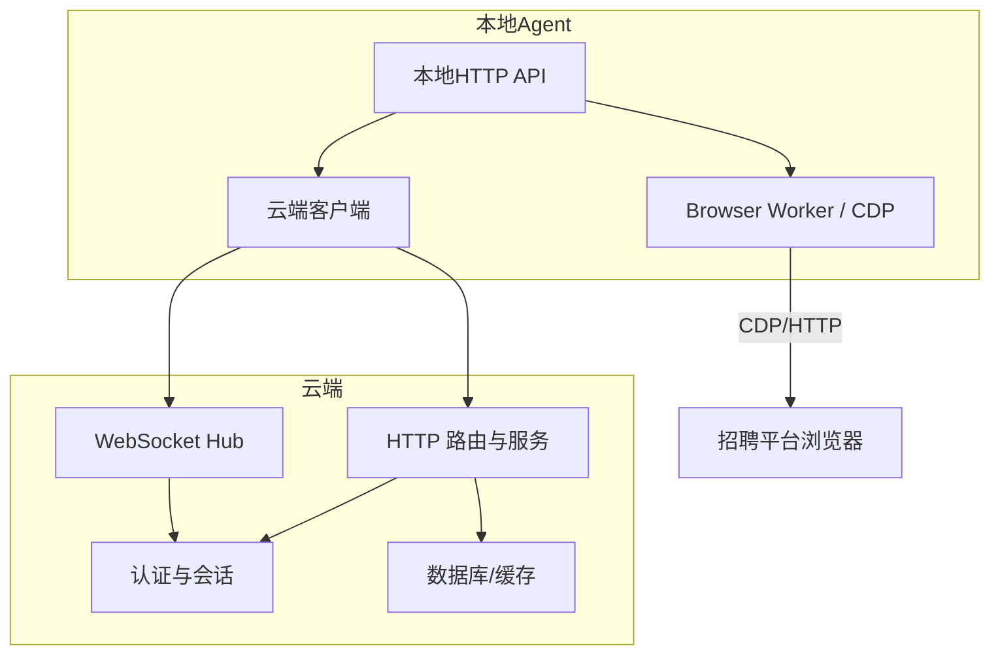
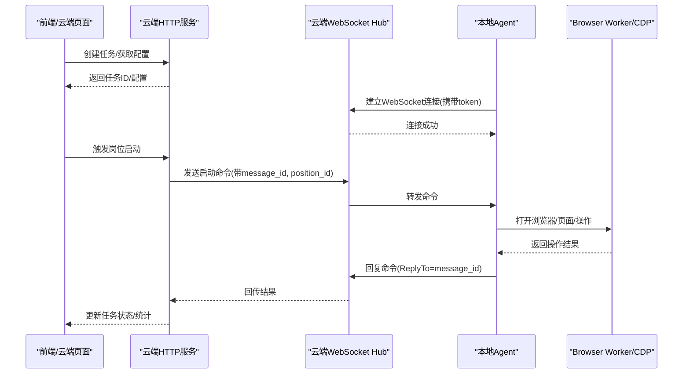
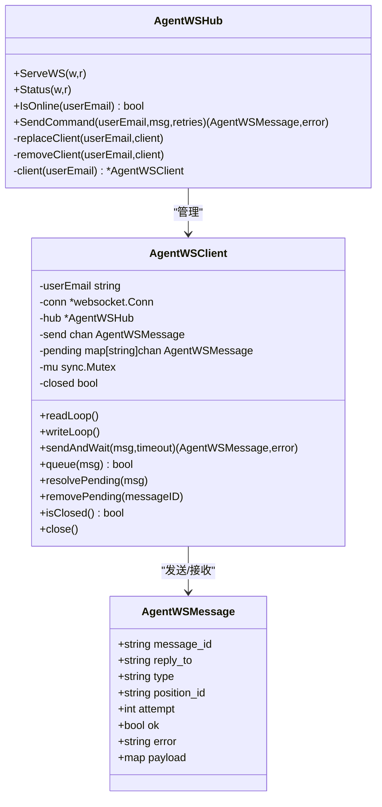
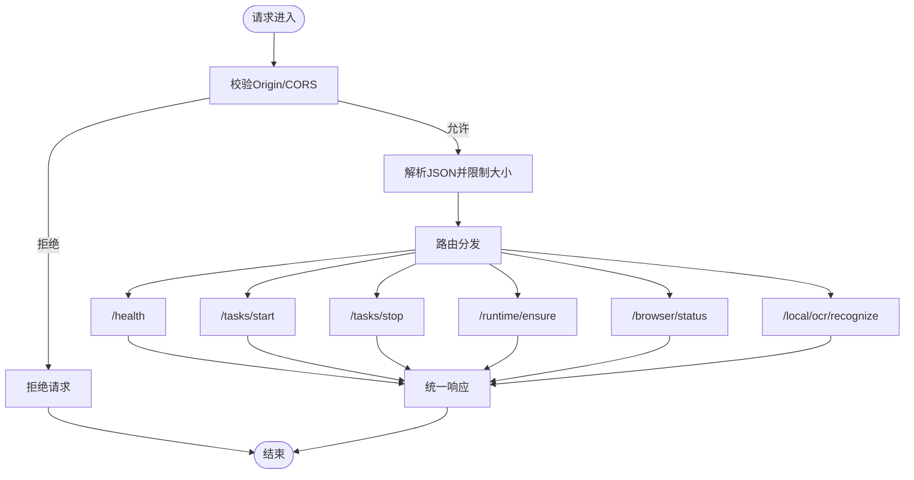
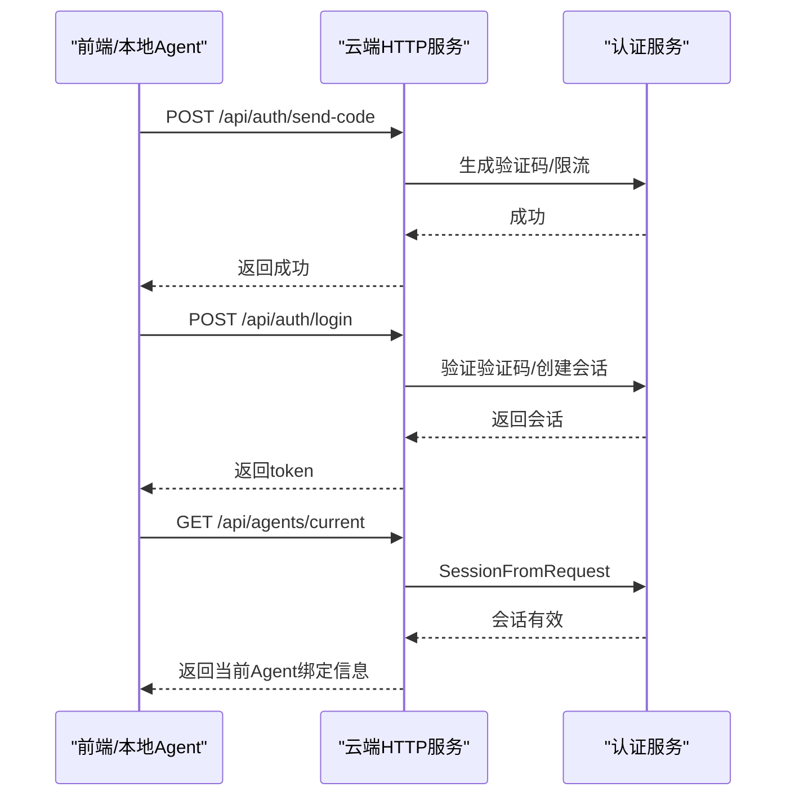
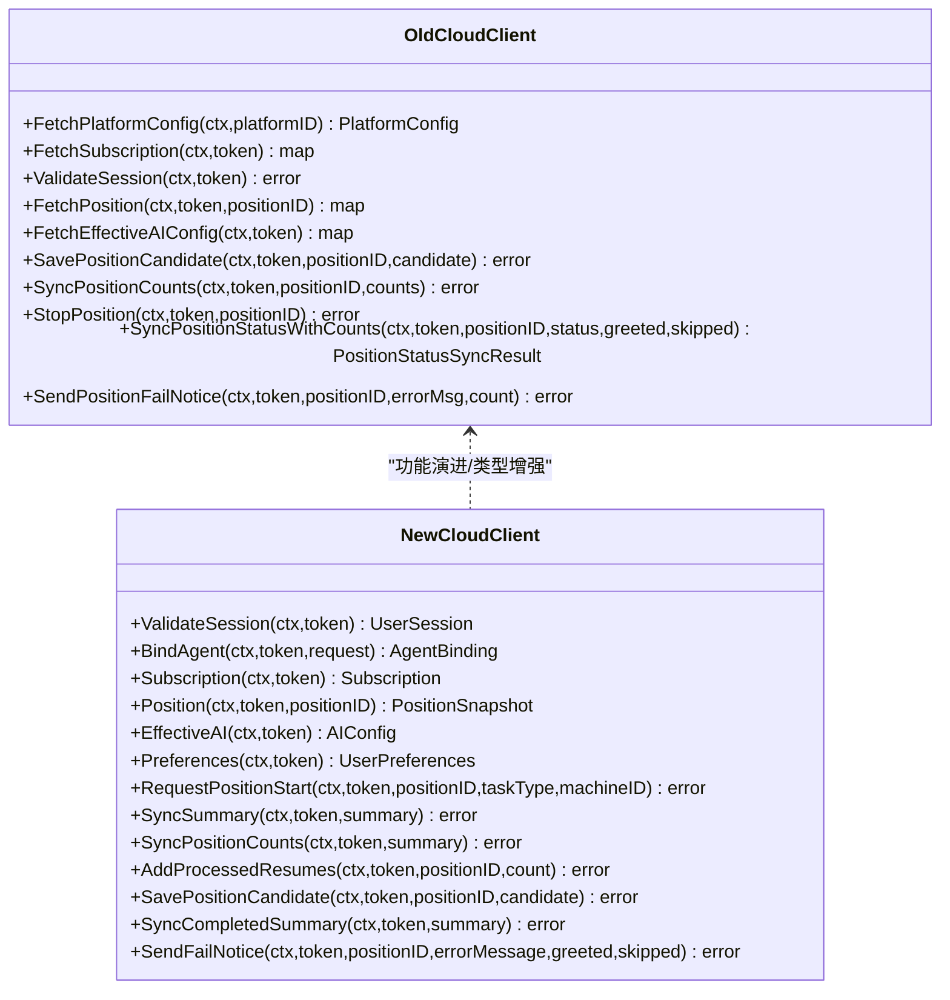
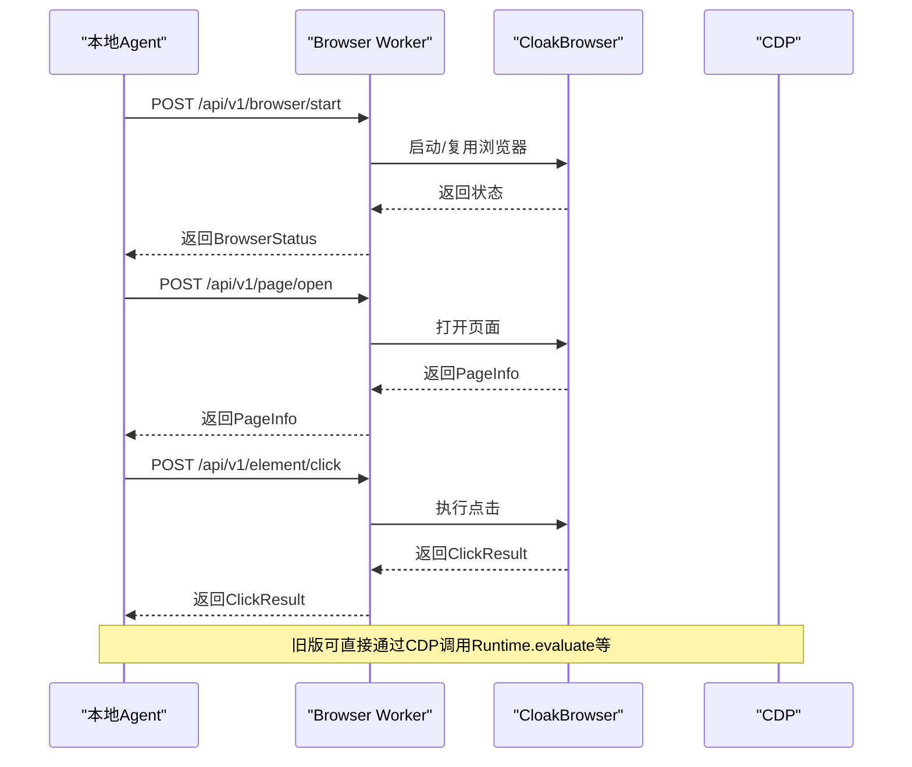
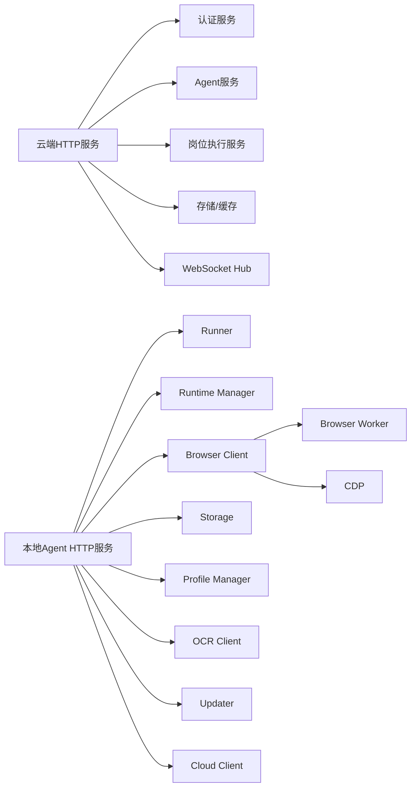

# 通信机制设计

<cite>
**本文引用的文件**
- [云端架构文档](file://docs/cloud-control-local-agent-architecture.md)
- [云端HTTP服务路由](file://goodhr5/cloud/backend/internal/httpapi/server.go)
- [云端Agent绑定API](file://goodhr5/cloud/backend/internal/httpapi/agent.go)
- [云端WebSocket Hub与消息协议](file://goodhr5/cloud/backend/internal/httpapi/agent_ws.go)
- [旧版本地Agent云端客户端](file://goodhr5/local-agent-go/internal/cloudapi/client.go)
- [新版本地Agent HTTP API服务](file://goodhr5/local-agent-go-new/internal/api/server.go)
- [新版本地Agent云端强类型客户端](file://goodhr5/local-agent-go-new/internal/integration/cloud/client.go)
- [CDP浏览器协议实现](file://goodhr5/local-agent-go/internal/browser/go_cdp.go)
- [新版Browser Worker HTTP客户端](file://goodhr5/local-agent-go-new/internal/browser/client/client.go)
</cite>

## 目录
1. [简介](#简介)
2. [项目结构与通信边界](#项目结构与通信边界)
3. [核心组件](#核心组件)
4. [架构总览](#架构总览)
5. [详细组件分析](#详细组件分析)
6. [依赖关系分析](#依赖关系分析)
7. [性能与并发特性](#性能与并发特性)
8. [故障排查指南](#故障排查指南)
9. [结论](#结论)
10. [附录：协议规范与时序图](#附录协议规范与时序图)

## 简介
本文件系统化梳理 GoodHR 云端控制台与本地 Agent 之间的通信机制，覆盖三类通信通道：
- REST API：用于任务、配置、统计、认证等请求响应式交互。
- WebSocket：用于云端与本地 Agent 的长连接命令下发、确认与重试。
- CDP浏览器协议：本地 Agent 通过 Chrome DevTools Protocol 控制 CloakBrowser，完成页面操作、截图、OCR 等。

同时说明心跳检测、断线重连、错误处理、数据同步策略、消息队列设计、并发控制、安全认证、传输加密与请求限流策略，并提供时序图和协议规范，帮助开发者理解各组件间的交互模式。

## 项目结构与通信边界
GoodHR 由“云端后端”和“本地 Agent”两部分组成：
- 云端后端提供 REST API 与 WebSocket 服务，负责用户登录、岗位运行编排、统计汇总、系统配置、平台账号管理等。
- 本地 Agent 运行在用户机器上，暴露受限的本地 HTTP API，并通过 WebSocket 主动连接云端进行命令收发；内部通过 Browser Worker（Node/TS）或直接使用 CDP 控制 CloakBrowser，完成招聘平台页面自动化。

**图表来源**
- [云端HTTP服务路由:123-212](file://goodhr5/cloud/backend/internal/httpapi/server.go#L123-L212)
- [云端WebSocket Hub与消息协议:54-80](file://goodhr5/cloud/backend/internal/httpapi/agent_ws.go#L54-L80)
- [新版本地Agent HTTP API服务:77-119](file://goodhr5/local-agent-go-new/internal/api/server.go#L77-L119)
- [CDP浏览器协议实现:48-81](file://goodhr5/local-agent-go/internal/browser/go_cdp.go#L48-L81)

**章节来源**
- [云端架构文档:30-52](file://docs/cloud-control-local-agent-architecture.md#L30-L52)
- [云端HTTP服务路由:123-212](file://goodhr5/cloud/backend/internal/httpapi/server.go#L123-L212)

## 核心组件
- 云端REST API：统一路由注册、认证中间件、业务服务装配。
- 云端WebSocket Hub：维护每个用户的唯一在线 Local Agent 连接，支持命令发送、回复等待、超时重试、负载摘要日志。
- 本地Agent HTTP API：仅监听本机地址，提供健康检查、任务生命周期、浏览器状态、运行时安装、Worker管理、截图/OCR等接口。
- 本地Agent云端客户端：封装对云端的认证访问、岗位启动/停止、统计同步、候选人上报、失败通知等。
- Browser Worker/CDP：本地Agent通过HTTP调用Browser Worker，或直接使用WS+CDP控制CloakBrowser。

**章节来源**
- [云端HTTP服务路由:46-121](file://goodhr5/cloud/backend/internal/httpapi/server.go#L46-L121)
- [云端WebSocket Hub与消息协议:21-40](file://goodhr5/cloud/backend/internal/httpapi/agent_ws.go#L21-L40)
- [新版本地Agent HTTP API服务:35-65](file://goodhr5/local-agent-go-new/internal/api/server.go#L35-L65)
- [旧版本地Agent云端客户端:17-55](file://goodhr5/local-agent-go/internal/cloudapi/client.go#L17-L55)
- [新版本地Agent云端强类型客户端:17-29](file://goodhr5/local-agent-go-new/internal/integration/cloud/client.go#L17-L29)
- [新版Browser Worker HTTP客户端:17-37](file://goodhr5/local-agent-go-new/internal/browser/client/client.go#L17-L37)
- [CDP浏览器协议实现:21-46](file://goodhr5/local-agent-go/internal/browser/go_cdp.go#L21-L46)

## 架构总览
GoodHR 的通信采用“云端主导、本地执行”的模式：
- 前端通过云端REST API创建任务、读取配置、查看统计。
- 本地Agent通过WebSocket主动连接云端，接收命令并返回结果。
- 本地Agent通过Browser Worker或CDP控制浏览器，完成页面操作、截图、OCR。
- 统计数据、候选人结构化结果按需同步到云端；原始详情、截图、OCR文本保留在本地。

**图表来源**
- [云端WebSocket Hub与消息协议:111-141](file://goodhr5/cloud/backend/internal/httpapi/agent_ws.go#L111-L141)
- [新版本地Agent HTTP API服务:163-184](file://goodhr5/local-agent-go-new/internal/api/server.go#L163-L184)
- [新版Browser Worker HTTP客户端:53-80](file://goodhr5/local-agent-go-new/internal/browser/client/client.go#L53-L80)
- [CDP浏览器协议实现:48-81](file://goodhr5/local-agent-go/internal/browser/go_cdp.go#L48-L81)

## 详细组件分析

### 云端WebSocket Hub与消息协议
- 统一消息结构包含 message_id、reply_to、type、position_id、attempt、ok、error、payload。
- 每个用户只保留一条在线连接，新连接替换旧连接。
- SendCommand支持重试：每次超时后递增 attempt 并重发。
- readLoop自动为无 reply_to 的消息发送 ack，避免重复处理。
- sendAndWait使用pending map + channel等待对应 reply_to 的回复，设置超时防止阻塞。
- 日志摘要会提取 payload 中的 path、url、cookies数量、encrypted_data标记、selectors、fields、element_ref、max_scrolls、距离范围等关键信息，便于问题定位。

**图表来源**
- [云端WebSocket Hub与消息协议:21-40](file://goodhr5/cloud/backend/internal/httpapi/agent_ws.go#L21-L40)
- [云端WebSocket Hub与消息协议:111-141](file://goodhr5/cloud/backend/internal/httpapi/agent_ws.go#L111-L141)
- [云端WebSocket Hub与消息协议:171-192](file://goodhr5/cloud/backend/internal/httpapi/agent_ws.go#L171-L192)
- [云端WebSocket Hub与消息协议:325-350](file://goodhr5/cloud/backend/internal/httpapi/agent_ws.go#L325-L350)

**章节来源**
- [云端WebSocket Hub与消息协议:54-80](file://goodhr5/cloud/backend/internal/httpapi/agent_ws.go#L54-L80)
- [云端WebSocket Hub与消息协议:111-141](file://goodhr5/cloud/backend/internal/httpapi/agent_ws.go#L111-L141)
- [云端WebSocket Hub与消息协议:194-217](file://goodhr5/cloud/backend/internal/httpapi/agent_ws.go#L194-L217)
- [云端WebSocket Hub与消息协议:219-230](file://goodhr5/cloud/backend/internal/httpapi/agent_ws.go#L219-L230)
- [云端WebSocket Hub与消息协议:325-350](file://goodhr5/cloud/backend/internal/httpapi/agent_ws.go#L325-L350)

### 本地Agent HTTP API与安全边界
- 仅监听本机地址，限制CORS白名单，拒绝任意路径访问。
- 提供健康检查、任务启动/停止/状态查询、运行时安装/确保、Worker启停、浏览器状态、截图/OCR、下载管理等接口。
- 统一响应格式：成功返回 ok=true 与 data；失败返回 ok=false 与 error.code/message。
- 请求体限制大小，禁止未知字段，避免注入风险。

**图表来源**
- [新版本地Agent HTTP API服务:77-119](file://goodhr5/local-agent-go-new/internal/api/server.go#L77-L119)
- [新版本地Agent HTTP API服务:304-340](file://goodhr5/local-agent-go-new/internal/api/server.go#L304-L340)
- [新版本地Agent HTTP API服务:342-355](file://goodhr5/local-agent-go-new/internal/api/server.go#L342-L355)
- [新版本地Agent HTTP API服务:357-384](file://goodhr5/local-agent-go-new/internal/api/server.go#L357-L384)

**章节来源**
- [新版本地Agent HTTP API服务:137-161](file://goodhr5/local-agent-go-new/internal/api/server.go#L137-L161)
- [新版本地Agent HTTP API服务:163-184](file://goodhr5/local-agent-go-new/internal/api/server.go#L163-L184)
- [新版本地Agent HTTP API服务:220-245](file://goodhr5/local-agent-go-new/internal/api/server.go#L220-L245)
- [新版本地Agent HTTP API服务:269-278](file://goodhr5/local-agent-go-new/internal/api/server.go#L269-L278)
- [新版本地Agent HTTP API服务:280-302](file://goodhr5/local-agent-go-new/internal/api/server.go#L280-L302)

### 云端REST API与认证
- 统一路由注册，涵盖认证、Agent绑定、配置、岗位、简历库、支付、租户等。
- 认证服务从请求头解析会话，Agent相关接口复用该能力。
- CORS全局开启，但本地Agent侧严格限制Origin。

**图表来源**
- [云端HTTP服务路由:123-212](file://goodhr5/cloud/backend/internal/httpapi/server.go#L123-L212)
- [云端HTTP服务路由:577-589](file://goodhr5/cloud/backend/internal/httpapi/server.go#L577-L589)
- [云端Agent绑定API:34-94](file://goodhr5/cloud/backend/internal/httpapi/agent.go#L34-L94)
- [云端Agent绑定API:96-135](file://goodhr5/cloud/backend/internal/httpapi/agent.go#L96-L135)

**章节来源**
- [云端HTTP服务路由:46-121](file://goodhr5/cloud/backend/internal/httpapi/server.go#L46-L121)
- [云端HTTP服务路由:247-269](file://goodhr5/cloud/backend/internal/httpapi/server.go#L247-L269)
- [云端HTTP服务路由:279-372](file://goodhr5/cloud/backend/internal/httpapi/server.go#L279-L372)
- [云端HTTP服务路由:374-421](file://goodhr5/cloud/backend/internal/httpapi/server.go#L374-L421)
- [云端HTTP服务路由:445-544](file://goodhr5/cloud/backend/internal/httpapi/server.go#L445-L544)
- [云端HTTP服务路由:577-589](file://goodhr5/cloud/backend/internal/httpapi/server.go#L577-L589)

### 本地Agent云端客户端（旧版与新版）
- 旧版客户端使用通用map结构，提供平台配置、订阅状态、岗位详情、AI配置、统计同步、候选人保存、失败通知等。
- 新版客户端使用强类型结构，提供更严格的输入输出校验与错误包装，支持会话校验、设备绑定、岗位快照、个人偏好、启动占用名额、统计汇总、完成状态同步、失败邮件等。
- 两者均使用Bearer Token认证，错误码与消息统一解析。

**图表来源**
- [旧版本地Agent云端客户端:79-126](file://goodhr5/local-agent-go/internal/cloudapi/client.go#L79-L126)
- [旧版本地Agent云端客户端:128-164](file://goodhr5/local-agent-go/internal/cloudapi/client.go#L128-L164)
- [旧版本地Agent云端客户端:166-212](file://goodhr5/local-agent-go/internal/cloudapi/client.go#L166-L212)
- [旧版本地Agent云端客户端:236-340](file://goodhr5/local-agent-go/internal/cloudapi/client.go#L236-L340)
- [旧版本地Agent云端客户端:498-541](file://goodhr5/local-agent-go/internal/cloudapi/client.go#L498-L541)
- [新版本地Agent云端强类型客户端:31-54](file://goodhr5/local-agent-go-new/internal/integration/cloud/client.go#L31-L54)
- [新版本地Agent云端强类型客户端:63-85](file://goodhr5/local-agent-go-new/internal/integration/cloud/client.go#L63-L85)
- [新版本地Agent云端强类型客户端:105-147](file://goodhr5/local-agent-go-new/internal/integration/cloud/client.go#L105-L147)
- [新版本地Agent云端强类型客户端:149-170](file://goodhr5/local-agent-go-new/internal/integration/cloud/client.go#L149-L170)
- [新版本地Agent云端强类型客户端:172-185](file://goodhr5/local-agent-go-new/internal/integration/cloud/client.go#L172-L185)
- [新版本地Agent云端强类型客户端:187-264](file://goodhr5/local-agent-go-new/internal/integration/cloud/client.go#L187-L264)
- [新版本地Agent云端强类型客户端:288-306](file://goodhr5/local-agent-go-new/internal/integration/cloud/client.go#L288-L306)

**章节来源**
- [旧版本地Agent云端客户端:47-55](file://goodhr5/local-agent-go/internal/cloudapi/client.go#L47-L55)
- [旧版本地Agent云端客户端:342-383](file://goodhr5/local-agent-go/internal/cloudapi/client.go#L342-L383)
- [旧版本地Agent云端客户端:385-423](file://goodhr5/local-agent-go/internal/cloudapi/client.go#L385-L423)
- [旧版本地Agent云端客户端:458-496](file://goodhr5/local-agent-go/internal/cloudapi/client.go#L458-L496)
- [新版本地Agent云端强类型客户端:393-468](file://goodhr5/local-agent-go-new/internal/integration/cloud/client.go#L393-L468)

### Browser Worker与CDP通信
- 新版本地Agent通过HTTP调用Browser Worker，提供强类型接口：启动/停止浏览器、打开页面、查找元素、点击、输入、滚动、截图、长截图、Cookie管理、下载管理等。
- 旧版本地Agent直接使用CDP协议，通过WebSocket与Chrome DevTools通信，实现Runtime.evaluate等底层能力。
- Browser Worker作为隔离层，屏蔽底层浏览器差异，提供稳定API。

**图表来源**
- [新版Browser Worker HTTP客户端:53-80](file://goodhr5/local-agent-go-new/internal/browser/client/client.go#L53-L80)
- [新版Browser Worker HTTP客户端:102-153](file://goodhr5/local-agent-go-new/internal/browser/client/client.go#L102-L153)
- [CDP浏览器协议实现:83-104](file://goodhr5/local-agent-go/internal/browser/go_cdp.go#L83-L104)
- [CDP浏览器协议实现:106-114](file://goodhr5/local-agent-go/internal/browser/go_cdp.go#L106-L114)

**章节来源**
- [新版Browser Worker HTTP客户端:39-51](file://goodhr5/local-agent-go-new/internal/browser/client/client.go#L39-L51)
- [新版Browser Worker HTTP客户端:200-238](file://goodhr5/local-agent-go-new/internal/browser/client/client.go#L200-L238)
- [CDP浏览器协议实现:48-81](file://goodhr5/local-agent-go/internal/browser/go_cdp.go#L48-L81)
- [CDP浏览器协议实现:148-195](file://goodhr5/local-agent-go/internal/browser/go_cdp.go#L148-L195)
- [CDP浏览器协议实现:197-284](file://goodhr5/local-agent-go/internal/browser/go_cdp.go#L197-L284)

## 依赖关系分析
- 云端HTTP服务依赖认证服务、Agent服务、岗位执行服务、存储服务等。
- WebSocket Hub依赖认证服务，维护用户级连接映射。
- 本地Agent HTTP服务依赖Runner、Runtime、Browser、Storage、Profile、OCR、Updater、Cloud集成等。
- 本地Agent云端客户端依赖HTTP网络栈与JSON编解码。
- Browser Worker与CloakBrowser之间通过HTTP或CDP通信。

**图表来源**
- [云端HTTP服务路由:46-121](file://goodhr5/cloud/backend/internal/httpapi/server.go#L46-L121)
- [新版本地Agent HTTP API服务:35-65](file://goodhr5/local-agent-go-new/internal/api/server.go#L35-L65)
- [新版Browser Worker HTTP客户端:17-37](file://goodhr5/local-agent-go-new/internal/browser/client/client.go#L17-L37)
- [CDP浏览器协议实现:21-46](file://goodhr5/local-agent-go/internal/browser/go_cdp.go#L21-L46)

**章节来源**
- [云端HTTP服务路由:46-121](file://goodhr5/cloud/backend/internal/httpapi/server.go#L46-L121)
- [新版本地Agent HTTP API服务:35-65](file://goodhr5/local-agent-go-new/internal/api/server.go#L35-L65)

## 性能与并发特性
- WebSocket Hub使用channel缓冲发送队列，避免写阻塞；pending map + channel实现请求-回复模型；超时控制防止永久阻塞。
- 本地Agent HTTP服务设置ReadHeaderTimeout、ReadTimeout、WriteTimeout、IdleTimeout，限制请求处理时长。
- Browser Worker客户端设置较长超时以应对浏览器操作耗时。
- 云端HTTP服务使用goroutine处理读循环，提升并发能力。
- 错误处理中记录负载摘要，便于快速定位性能瓶颈。

[本节为通用性能讨论，不直接分析具体文件]

## 故障排查指南
- WebSocket连接失败：检查token是否有效、服务端是否已升级连接、客户端是否正确携带Authorization或query token。
- 命令超时：检查Local Agent是否在线、是否存在pending未清理、重试次数是否足够。
- 浏览器操作失败：检查Browser Worker是否就绪、CDP握手是否成功、页面元素是否存在。
- 认证失效：检查Bearer Token是否过期、云端是否返回401/403、本地客户端是否识别并提示重新登录。
- 数据不同步：检查统计接口调用是否成功、云端是否返回非预期状态码、错误消息是否被翻译。

**章节来源**
- [云端WebSocket Hub与消息协议:54-80](file://goodhr5/cloud/backend/internal/httpapi/agent_ws.go#L54-L80)
- [云端WebSocket Hub与消息协议:111-141](file://goodhr5/cloud/backend/internal/httpapi/agent_ws.go#L111-L141)
- [云端WebSocket Hub与消息协议:194-217](file://goodhr5/cloud/backend/internal/httpapi/agent_ws.go#L194-L217)
- [云端WebSocket Hub与消息协议:325-350](file://goodhr5/cloud/backend/internal/httpapi/agent_ws.go#L325-L350)
- [新版本地Agent HTTP API服务:304-340](file://goodhr5/local-agent-go-new/internal/api/server.go#L304-L340)
- [新版Browser Worker HTTP客户端:200-238](file://goodhr5/local-agent-go-new/internal/browser/client/client.go#L200-L238)
- [旧版本地Agent云端客户端:342-383](file://goodhr5/local-agent-go/internal/cloudapi/client.go#L342-L383)
- [旧版本地Agent云端客户端:458-496](file://goodhr5/local-agent-go/internal/cloudapi/client.go#L458-L496)

## 结论
GoodHR 的通信机制以云端REST API为基础，结合WebSocket实现实时命令下发与回复，辅以Browser Worker/CDP完成浏览器自动化。系统设计强调安全边界、错误处理、超时重试与可观测性，确保云端与本地Agent的稳定协作。未来可进一步增强心跳检测、断线重连策略、请求限流与数据传输加密，以提升鲁棒性与安全性。

[本节为总结性内容，不直接分析具体文件]

## 附录：协议规范与时序图

### WebSocket消息协议
- message_id：唯一标识消息。
- reply_to：回复目标消息ID。
- type：消息类型，如岗位操作、截图、OCR等。
- position_id：岗位运行ID，用于关联上下文。
- attempt：重试次数。
- ok/error：操作结果。
- payload：业务数据，可能包含path、url、cookies、selectors、fields等。

**章节来源**
- [云端WebSocket Hub与消息协议:21-32](file://goodhr5/cloud/backend/internal/httpapi/agent_ws.go#L21-L32)
- [云端WebSocket Hub与消息协议:232-297](file://goodhr5/cloud/backend/internal/httpapi/agent_ws.go#L232-L297)

### 心跳检测与断线重连
- 当前实现未显式定义心跳包，但通过命令重试与超时控制保障可靠性。
- 建议增加周期性心跳消息，用于检测连接存活。
- 断线时云端应清理pending并释放资源，本地Agent应尝试重连。

[本节为概念性内容，不直接分析具体文件]

### 错误处理机制
- 云端WebSocket Hub在写入失败时关闭连接并清理在线状态。
- 本地Agent HTTP服务统一错误响应格式，包含code与message。
- 云端客户端将错误转换为APIError，支持登录态失效判断。

**章节来源**
- [云端WebSocket Hub与消息协议:219-230](file://goodhr5/cloud/backend/internal/httpapi/agent_ws.go#L219-L230)
- [云端WebSocket Hub与消息协议:395-413](file://goodhr5/cloud/backend/internal/httpapi/agent_ws.go#L395-L413)
- [新版本地Agent HTTP API服务:365-384](file://goodhr5/local-agent-go-new/internal/api/server.go#L365-L384)
- [新版本地Agent云端强类型客户端:56-61](file://goodhr5/local-agent-go-new/internal/integration/cloud/client.go#L56-L61)
- [新版本地Agent云端强类型客户端:425-460](file://goodhr5/local-agent-go-new/internal/integration/cloud/client.go#L425-L460)

### 数据同步策略
- 统计数据通过REST API同步到云端，包括扫描数、跳过数、失败数、已处理简历数等。
- 候选人结构化结果可选择上传至云端简历库。
- 原始详情、截图、OCR文本保留在本地，云端仅保存摘要。

**章节来源**
- [旧版本地Agent云端客户端:236-340](file://goodhr5/local-agent-go/internal/cloudapi/client.go#L236-L340)
- [新版本地Agent云端强类型客户端:187-264](file://goodhr5/local-agent-go-new/internal/integration/cloud/client.go#L187-L264)
- [云端架构文档:300-372](file://docs/cloud-control-local-agent-architecture.md#L300-L372)

### 消息队列设计与并发控制
- WebSocket Hub使用channel作为发送队列，避免阻塞。
- pending map + channel实现请求-回复模型，支持并发等待。
- 本地Agent HTTP服务通过goroutine处理请求，设置超时限制。
- Browser Worker客户端使用HTTP并发调用，注意超时与错误处理。

**章节来源**
- [云端WebSocket Hub与消息协议:171-192](file://goodhr5/cloud/backend/internal/httpapi/agent_ws.go#L171-L192)
- [云端WebSocket Hub与消息协议:325-350](file://goodhr5/cloud/backend/internal/httpapi/agent_ws.go#L325-L350)
- [新版本地Agent HTTP API服务:111-119](file://goodhr5/local-agent-go-new/internal/api/server.go#L111-L119)
- [新版Browser Worker HTTP客户端:200-238](file://goodhr5/local-agent-go-new/internal/browser/client/client.go#L200-L238)

### 安全认证机制
- 云端REST API使用Bearer Token认证。
- WebSocket连接通过token参数或Authorization头认证。
- 本地Agent HTTP服务限制CORS白名单，仅允许指定域名与本机访问。
- 建议增加请求签名与传输加密（HTTPS/TLS）。

**章节来源**
- [云端HTTP服务路由:577-589](file://goodhr5/cloud/backend/internal/httpapi/server.go#L577-L589)
- [云端WebSocket Hub与消息协议:54-80](file://goodhr5/cloud/backend/internal/httpapi/agent_ws.go#L54-L80)
- [新版本地Agent HTTP API服务:304-340](file://goodhr5/local-agent-go-new/internal/api/server.go#L304-L340)
- [旧版本地Agent云端客户端:342-383](file://goodhr5/local-agent-go/internal/cloudapi/client.go#L342-L383)

### 数据传输加密与请求限流
- 传输层建议使用HTTPS/TLS加密。
- 请求限流可通过Redis实现，如验证码发送频率限制、IP限制等。
- 本地Agent接口限制请求体大小，防止恶意请求。

**章节来源**
- [云端架构文档:86-93](file://docs/cloud-control-local-agent-architecture.md#L86-L93)
- [新版本地Agent HTTP API服务:342-355](file://goodhr5/local-agent-go-new/internal/api/server.go#L342-L355)