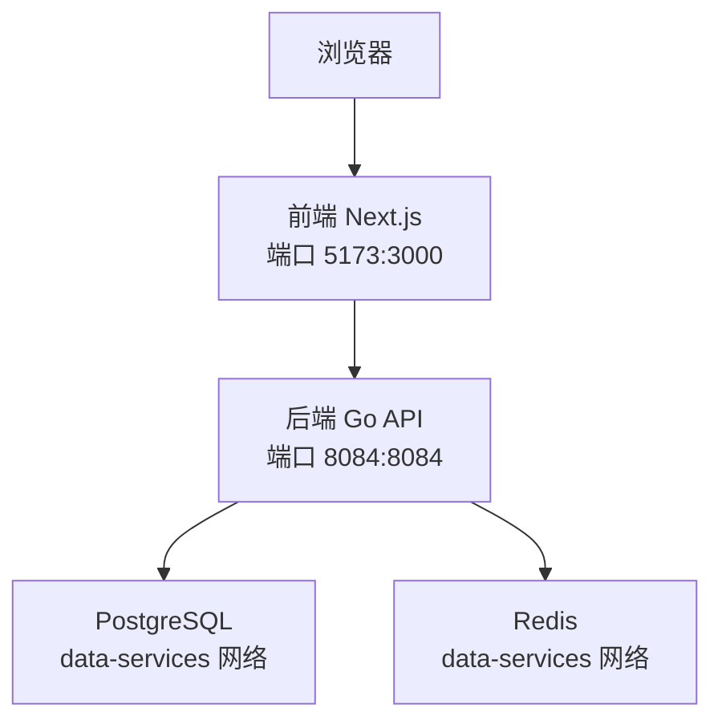
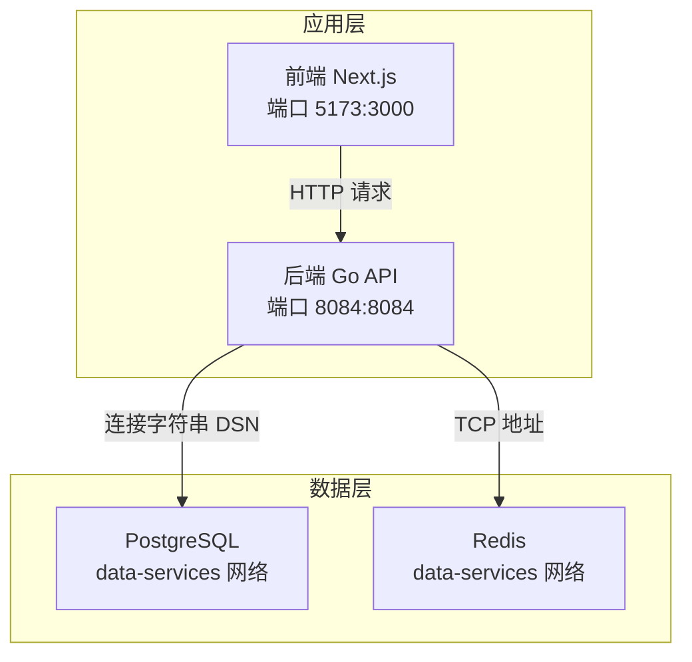
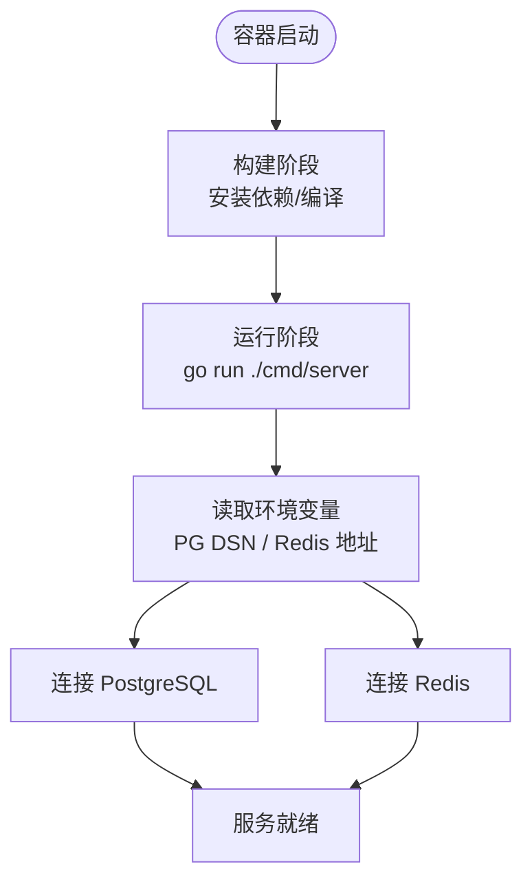
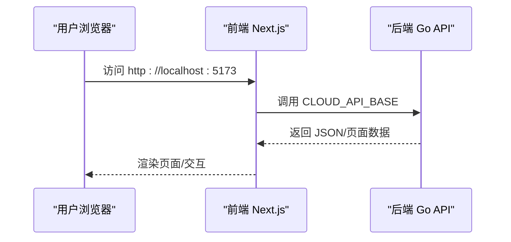
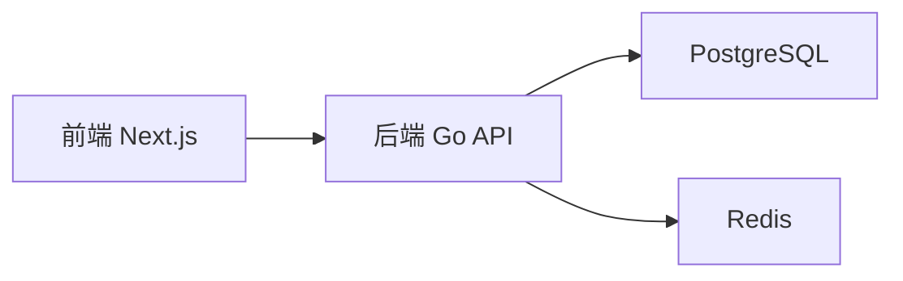

# Docker容器化部署

<cite>
**本文引用的文件**
- [docker-compose.yml](file://goodhr5/docker-compose.yml)
- [docker-compose.local.yml](file://goodhr5/docker-compose.local.yml)
- [docker-compose.server.yml](file://goodhr5/docker-compose.server.yml)
- [docker-compose.local.windows.yml](file://goodhr5/docker-compose.local.windows.yml)
- [README_DOCKER.md](file://goodhr5/README_DOCKER.md)
- [Dockerfile（后端）](file://goodhr5/cloud/backend/Dockerfile)
- [Dockerfile.dev（后端开发）](file://goodhr5/cloud/backend/Dockerfile.dev)
- [Dockerfile（前端生产）](file://goodhr5/cloud/frontend-next/Dockerfile)
- [Dockerfile.dev（前端开发）](file://goodhr5/cloud/frontend-next/Dockerfile.dev)
</cite>

## 目录
1. [简介](#简介)
2. [项目结构](#项目结构)
3. [核心组件](#核心组件)
4. [架构总览](#架构总览)
5. [详细组件分析](#详细组件分析)
6. [依赖关系分析](#依赖关系分析)
7. [性能与可观测性](#性能与可观测性)
8. [故障排查指南](#故障排查指南)
9. [结论](#结论)
10. [附录：本地开发与测试环境搭建](#附录本地开发与测试环境搭建)

## 简介
本文件面向 HRPlus 的容器化部署，覆盖镜像构建、容器编排、服务间通信、环境变量、端口映射、数据卷挂载、网络与健康检查、日志收集方案，以及开发/生产环境的差异化配置。文档基于仓库中提供的 docker-compose 与 Dockerfile 进行说明，帮助开发者快速搭建本地与服务器环境。

## 项目结构
HRPlus 采用前后端分离的容器化编排：
- 后端：Go 服务，提供 REST API 与 WebSocket 能力
- 前端：Next.js 应用，生产模式使用 standalone 输出
- 数据库与缓存：PostgreSQL 与 Redis（可通过外部网络复用或自行启动）
- 多套 compose 文件：默认、本地开发、Windows 本地开发、Linux 服务器部署

图示来源
- [docker-compose.yml:1-32](file://goodhr5/docker-compose.yml#L1-L32)
- [docker-compose.local.yml:1-54](file://goodhr5/docker-compose.local.yml#L1-L54)
- [docker-compose.server.yml:1-12](file://goodhr5/docker-compose.server.yml#L1-L12)
- [docker-compose.local.windows.yml:1-58](file://goodhr5/docker-compose.local.windows.yml#L1-L58)

章节来源
- [docker-compose.yml:1-32](file://goodhr5/docker-compose.yml#L1-L32)
- [docker-compose.local.yml:1-54](file://goodhr5/docker-compose.local.yml#L1-L54)
- [docker-compose.server.yml:1-12](file://goodhr5/docker-compose.server.yml#L1-L12)
- [docker-compose.local.windows.yml:1-58](file://goodhr5/docker-compose.local.windows.yml#L1-L58)
- [README_DOCKER.md:1-46](file://goodhr5/README_DOCKER.md#L1-L46)

## 核心组件
- 后端服务（cloud/backend）
  - 生产镜像：基于 golang:1.24-alpine，直接运行 go run ./cmd/server
  - 开发镜像：安装 air 热重载，监听 .go/.html/.sql 变更自动重启
- 前端服务（cloud/frontend-next）
  - 生产镜像：Node 22 Alpine，npm ci 安装依赖，构建后以 standalone 模式运行
  - 开发镜像：Node 22 Alpine，启用 Next.js 开发服务器并暴露 3000 端口
- 编排文件
  - docker-compose.yml：基础编排，包含后端与前端
  - docker-compose.local.yml：本地开发，复用 data-services 网络的 PG/Redis
  - docker-compose.local.windows.yml：Windows 本地开发，兼容 Windows 文件系统差异
  - docker-compose.server.yml：Linux 服务器部署，后端使用 host 网络直连宿主机 PG/Redis

章节来源
- [Dockerfile（后端）:1-8](file://goodhr5/cloud/backend/Dockerfile#L1-L8)
- [Dockerfile.dev（后端开发）:1-14](file://goodhr5/cloud/backend/Dockerfile.dev#L1-L14)
- [Dockerfile（前端生产）:1-23](file://goodhr5/cloud/frontend-next/Dockerfile#L1-L23)
- [Dockerfile.dev（前端开发）:1-12](file://goodhr5/cloud/frontend-next/Dockerfile.dev#L1-L12)
- [docker-compose.yml:1-32](file://goodhr5/docker-compose.yml#L1-L32)
- [docker-compose.local.yml:1-54](file://goodhr5/docker-compose.local.yml#L1-L54)
- [docker-compose.local.windows.yml:1-58](file://goodhr5/docker-compose.local.windows.yml#L1-L58)
- [docker-compose.server.yml:1-12](file://goodhr5/docker-compose.server.yml#L1-L12)

## 架构总览
下图展示典型本地/服务器部署的服务拓扑与通信路径：

图示来源
- [docker-compose.local.yml:1-54](file://goodhr5/docker-compose.local.yml#L1-L54)
- [docker-compose.server.yml:1-12](file://goodhr5/docker-compose.server.yml#L1-L12)
- [README_DOCKER.md:1-46](file://goodhr5/README_DOCKER.md#L1-L46)

## 详细组件分析

### 后端服务（Go）
- 镜像构建
  - 生产：golang:1.24-alpine，设置 GOPROXY，复制 go.mod/go.sum 并下载依赖，再复制源码，运行 cmd/server
  - 开发：安装 air 热重载工具，通过 .air.local.toml 监听代码变化自动重启
- 运行时
  - 暴露 8084 端口
  - 通过环境变量配置数据库与缓存连接信息（DSN、Redis 地址等）
  - 支持挂载 /app/tmp 用于临时文件存储

图示来源
- [Dockerfile（后端）:1-8](file://goodhr5/cloud/backend/Dockerfile#L1-L8)
- [Dockerfile.dev（后端开发）:1-14](file://goodhr5/cloud/backend/Dockerfile.dev#L1-L14)
- [docker-compose.local.yml:1-54](file://goodhr5/docker-compose.local.yml#L1-L54)
- [docker-compose.server.yml:1-12](file://goodhr5/docker-compose.server.yml#L1-L12)

章节来源
- [Dockerfile（后端）:1-8](file://goodhr5/cloud/backend/Dockerfile#L1-L8)
- [Dockerfile.dev（后端开发）:1-14](file://goodhr5/cloud/backend/Dockerfile.dev#L1-L14)
- [docker-compose.local.yml:1-54](file://goodhr5/docker-compose.local.yml#L1-L54)
- [docker-compose.server.yml:1-12](file://goodhr5/docker-compose.server.yml#L1-L12)

### 前端服务（Next.js）
- 镜像构建
  - 生产：Node 22 Alpine，使用国内 npm 镜像安装依赖，构建产物为 standalone 模式，运行 server.js
  - 开发：Node 22 Alpine，启用 Next.js 开发服务器，监听 0.0.0.0:3000
- 运行时
  - 暴露 3000 端口，compose 映射到宿主 5173
  - 通过环境变量指定后端 API 基址与站点 URL

图示来源
- [docker-compose.yml:1-32](file://goodhr5/docker-compose.yml#L1-L32)
- [docker-compose.local.yml:1-54](file://goodhr5/docker-compose.local.yml#L1-L54)
- [docker-compose.local.windows.yml:1-58](file://goodhr5/docker-compose.local.windows.yml#L1-L58)
- [Dockerfile（前端生产）:1-23](file://goodhr5/cloud/frontend-next/Dockerfile#L1-L23)
- [Dockerfile.dev（前端开发）:1-12](file://goodhr5/cloud/frontend-next/Dockerfile.dev#L1-L12)

章节来源
- [docker-compose.yml:1-32](file://goodhr5/docker-compose.yml#L1-L32)
- [docker-compose.local.yml:1-54](file://goodhr5/docker-compose.local.yml#L1-L54)
- [docker-compose.local.windows.yml:1-58](file://goodhr5/docker-compose.local.windows.yml#L1-L58)
- [Dockerfile（前端生产）:1-23](file://goodhr5/cloud/frontend-next/Dockerfile#L1-L23)
- [Dockerfile.dev（前端开发）:1-12](file://goodhr5/cloud/frontend-next/Dockerfile.dev#L1-L12)

### 数据与缓存（PostgreSQL 与 Redis）
- 本地开发：通过 external 网络 data-services 复用已有 PG/Redis 容器
- 服务器部署：后端使用 host 网络，直接访问宿主机暴露的 PG/Redis
- 环境变量：
  - GOODHR_PG_DSN：PostgreSQL 连接串（含用户名、密码、主机、库名、SSL 模式）
  - GOODHR_REDIS_ADDR：Redis 地址（IP:端口）
- 首次启动：根据 README 提示，首次构建约需数分钟，后续秒级启动

章节来源
- [docker-compose.local.yml:1-54](file://goodhr5/docker-compose.local.yml#L1-L54)
- [docker-compose.server.yml:1-12](file://goodhr5/docker-compose.server.yml#L1-L12)
- [README_DOCKER.md:1-46](file://goodhr5/README_DOCKER.md#L1-L46)

### 端口映射与服务发现
- 前端：容器内 3000 -> 宿主 5173
- 后端：容器内 8084 -> 宿主 8084
- 服务发现：
  - 同一 compose 网络下，前端通过服务名 backend 访问后端
  - 本地/Windows 开发通过 external 网络 data-services 访问 PG/Redis
  - 服务器部署使用 host 网络直连宿主机服务

章节来源
- [docker-compose.yml:1-32](file://goodhr5/docker-compose.yml#L1-L32)
- [docker-compose.local.yml:1-54](file://goodhr5/docker-compose.local.yml#L1-L54)
- [docker-compose.local.windows.yml:1-58](file://goodhr5/docker-compose.local.windows.yml#L1-L58)
- [docker-compose.server.yml:1-12](file://goodhr5/docker-compose.server.yml#L1-L12)

### 数据卷与文件存储
- 后端
  - 挂载 ./cloud/backend:/app 实现源码热更新
  - 挂载 /app/tmp 作为临时目录
  - 开发时额外挂载 Go 模块缓存与构建缓存以提升速度
- 前端
  - 挂载 ./cloud/frontend-next:/app 实现源码热更新
  - 命名卷保存 node_modules 与 .next 缓存加速构建
- 注意：当前 compose 未定义持久化的业务数据卷；如需持久化，请按需添加 PG/Redis 的数据卷映射

章节来源
- [docker-compose.yml:1-32](file://goodhr5/docker-compose.yml#L1-L32)
- [docker-compose.local.yml:1-54](file://goodhr5/docker-compose.local.yml#L1-L54)
- [docker-compose.local.windows.yml:1-58](file://goodhr5/docker-compose.local.windows.yml#L1-L58)

### 环境变量与配置项
- 前端
  - CLOUD_API_BASE：后端 API 基址（容器内）
  - NEXT_PUBLIC_CLOUD_API_BASE：客户端可见的后端 API 基址（本地）
  - NEXT_PUBLIC_SITE_URL：站点 URL
  - WATCHPACK_POLLING：Windows 下开启轮询监听
- 后端
  - GOODHR_PG_DSN：PostgreSQL 连接串
  - GOODHR_REDIS_ADDR：Redis 地址
  - GOODHR_CLOUD_ADDR：后端监听地址（开发）
- 建议：将敏感信息放入 .env 并通过 env_file 引用

章节来源
- [docker-compose.yml:1-32](file://goodhr5/docker-compose.yml#L1-L32)
- [docker-compose.local.yml:1-54](file://goodhr5/docker-compose.local.yml#L1-L54)
- [docker-compose.local.windows.yml:1-58](file://goodhr5/docker-compose.local.windows.yml#L1-L58)
- [docker-compose.server.yml:1-12](file://goodhr5/docker-compose.server.yml#L1-L12)
- [README_DOCKER.md:1-46](file://goodhr5/README_DOCKER.md#L1-L46)

### 网络配置
- 默认网络：frontend 与 backend 在同一 compose 网络中，通过服务名互通
- data-services：外部网络，复用已有 PG/Redis 容器
- host 网络：服务器部署时后端直接使用宿主机网络，便于访问本机 PG/Redis

章节来源
- [docker-compose.local.yml:1-54](file://goodhr5/docker-compose.local.yml#L1-L54)
- [docker-compose.local.windows.yml:1-58](file://goodhr5/docker-compose.local.windows.yml#L1-L58)
- [docker-compose.server.yml:1-12](file://goodhr5/docker-compose.server.yml#L1-L12)

### 健康检查与自恢复
- 当前 compose 未显式定义 healthcheck；可通过以下方式增强：
  - 后端：对 HTTP 接口或 TCP 8084 做健康检查
  - 前端：对 HTTP 3000 做健康检查
  - 数据库/缓存：若自建容器，可对 PG/Redis 端口做健康检查
- 建议结合 restart: unless-stopped 提升可用性

章节来源
- [docker-compose.local.yml:1-54](file://goodhr5/docker-compose.local.yml#L1-L54)
- [docker-compose.local.windows.yml:1-58](file://goodhr5/docker-compose.local.windows.yml#L1-L58)

### 日志收集方案
- 开发环境：
  - 后端：air 控制台输出
  - 前端：Next.js 开发服务器控制台输出
- 生产环境：
  - 建议使用 Docker 日志驱动（如 json-file、journald、fluentd、loki）集中收集
  - 可在 compose 中为各服务配置 logging 驱动与选项
  - 结合系统日志采集器（如 Filebeat/Fluent Bit）统一汇聚

[本节为通用指导，不直接分析具体文件]

## 依赖关系分析
- 前端依赖后端 API（CLOUD_API_BASE）
- 后端依赖 PostgreSQL（GOODHR_PG_DSN）与 Redis（GOODHR_REDIS_ADDR）
- 本地/Windows 开发通过 external 网络 data-services 复用 PG/Redis
- 服务器部署后端使用 host 网络直连宿主机 PG/Redis

图示来源
- [docker-compose.local.yml:1-54](file://goodhr5/docker-compose.local.yml#L1-L54)
- [docker-compose.server.yml:1-12](file://goodhr5/docker-compose.server.yml#L1-L12)

章节来源
- [docker-compose.local.yml:1-54](file://goodhr5/docker-compose.local.yml#L1-L54)
- [docker-compose.server.yml:1-12](file://goodhr5/docker-compose.server.yml#L1-L12)

## 性能与可观测性
- 构建优化
  - 前端：使用 npm ci 与分层缓存，standalone 输出减少体积
  - 后端：先下载依赖再复制源码，利用 Go 模块缓存
- 开发体验
  - 后端：air 热重载
  - 前端：Next.js 开发服务器 + WATCHPACK_POLLING（Windows）
- 可观测性
  - 日志：按“日志收集方案”一节配置
  - 指标：可在后端引入 Prometheus 指标端点，配合采集器上报
  - 追踪：可按需接入 OpenTelemetry 链路追踪

[本节为通用指导，不直接分析具体文件]

## 故障排查指南
- 无法连接数据库
  - 检查 GOODHR_PG_DSN 是否正确（主机、端口、库名、认证）
  - 确认 data-services 网络可达或 host 网络已正确配置
- 无法连接 Redis
  - 检查 GOODHR_REDIS_ADDR 是否指向可用实例
- 前端无法访问后端
  - 核对 CLOUD_API_BASE/NEXT_PUBLIC_CLOUD_API_BASE 与实际端口
  - 确认端口映射 5173:3000 与 8084:8084 生效
- 热更新无效（Windows）
  - 确保设置了 WATCHPACK_POLLING=true
  - 确认 volumes 挂载路径正确
- 首次构建慢
  - 参考 README 提示，首次构建需要时间，后续会显著加快

章节来源
- [README_DOCKER.md:1-46](file://goodhr5/README_DOCKER.md#L1-L46)
- [docker-compose.local.yml:1-54](file://goodhr5/docker-compose.local.yml#L1-L54)
- [docker-compose.local.windows.yml:1-58](file://goodhr5/docker-compose.local.windows.yml#L1-L58)
- [docker-compose.server.yml:1-12](file://goodhr5/docker-compose.server.yml#L1-L12)

## 结论
HRPlus 提供了完善的容器化方案：通过多份 compose 文件适配本地与服务器部署，前后端均具备开发/生产两套镜像，支持热更新与缓存加速。借助 external 网络与 host 网络，灵活对接现有数据库与缓存。建议在生产环境补充健康检查与日志收集策略，进一步提升稳定性与可观测性。

[本节为总结性内容，不直接分析具体文件]

## 附录：本地开发与测试环境搭建
- 前置条件
  - 安装 Docker 与 Docker Compose
  - 准备 data-services 网络（包含 PostgreSQL 与 Redis），或在服务器上直连宿主机 PG/Redis
- 启动步骤
  - 进入 goodhr5 目录
  - 构建镜像并后台启动
  - 访问前端 http://localhost:5173，后端 http://localhost:8084
- 停止与清理
  - 停止并保留数据：docker compose down
  - 停止并删除数据：docker compose down -v
- 使用已有 PG/Redis
  - 注释掉对应服务，在 .env 中填写外部地址
- 开发注意事项
  - Windows：使用 docker-compose.local.windows.yml，开启轮询监听
  - Linux/macOS：使用 docker-compose.local.yml，复用 data-services 网络
  - 服务器部署：使用 docker-compose.server.yml，后端 host 网络直连 PG/Redis

章节来源
- [README_DOCKER.md:1-46](file://goodhr5/README_DOCKER.md#L1-L46)
- [docker-compose.local.yml:1-54](file://goodhr5/docker-compose.local.yml#L1-L54)
- [docker-compose.local.windows.yml:1-58](file://goodhr5/docker-compose.local.windows.yml#L1-L58)
- [docker-compose.server.yml:1-12](file://goodhr5/docker-compose.server.yml#L1-L12)