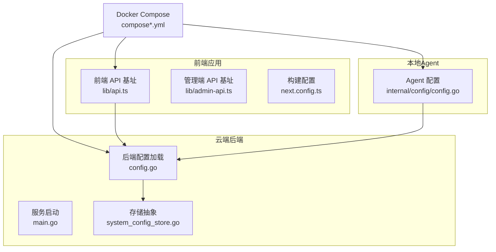
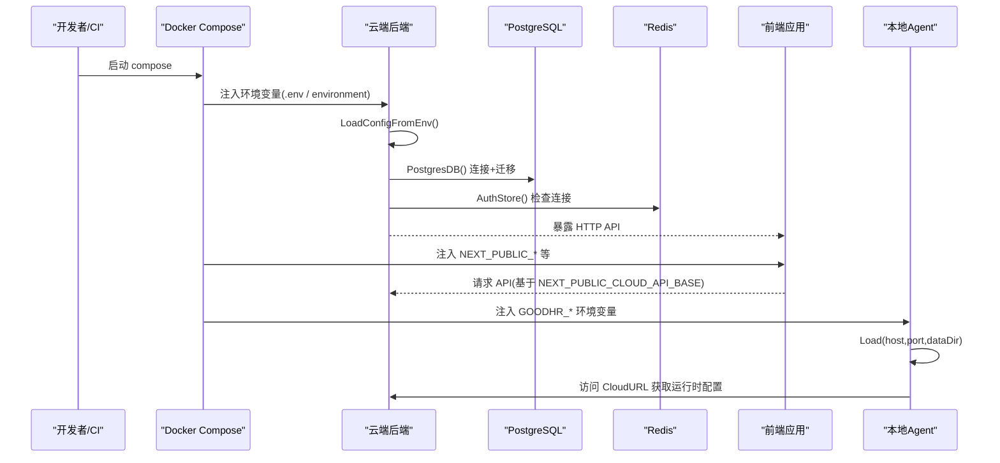
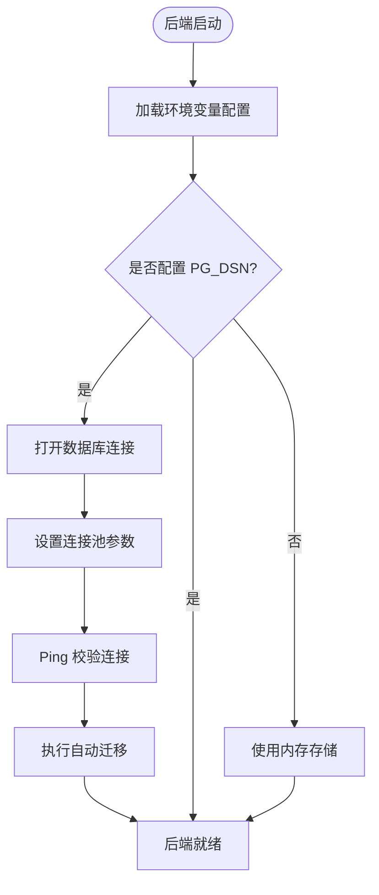
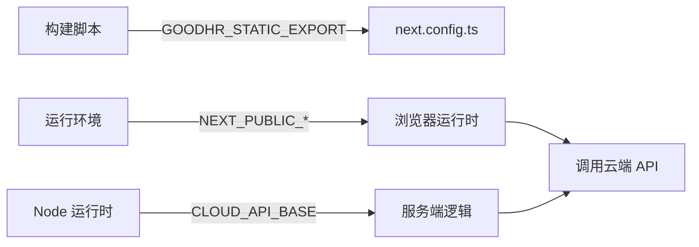
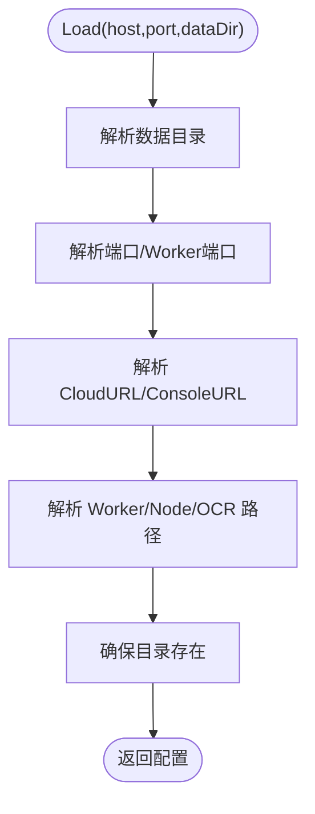
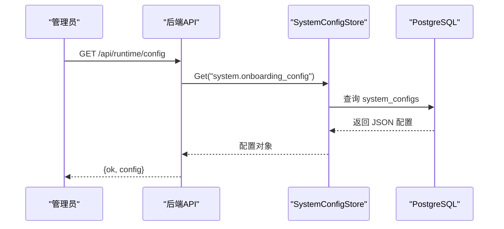
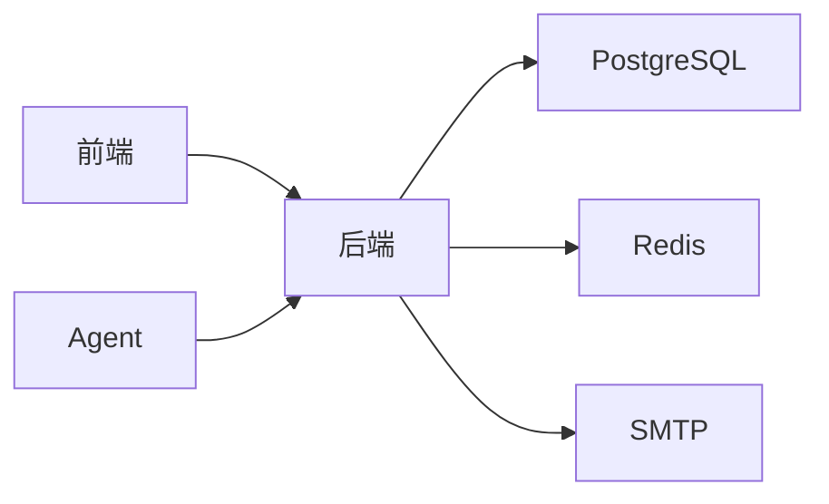

# 环境配置管理

<cite>
**本文引用的文件**
- [cloud/backend/internal/httpapi/config.go](file://goodhr5/cloud/backend/internal/httpapi/config.go)
- [cloud/backend/cmd/server/main.go](file://goodhr5/cloud/backend/cmd/server/main.go)
- [cloud/backend/internal/httpapi/system_config_store.go](file://goodhr5/cloud/backend/internal/httpapi/system_config_store.go)
- [cloud/backend/db/migrations/0021_system_app_config.sql](file://goodhr5/cloud/backend/db/migrations/0021_system_app_config.sql)
- [cloud/backend/internal/httpapi/runtime_config.go](file://goodhr5/cloud/backend/internal/httpapi/runtime_config.go)
- [cloud/frontend-next/lib/api.ts](file://goodhr5/cloud/frontend-next/lib/api.ts)
- [cloud/frontend-next/lib/admin-api.ts](file://goodhr5/cloud/frontend-next/lib/admin-api.ts)
- [cloud/frontend-next/app/robots.ts](file://goodhr5/cloud/frontend-next/app/robots.ts)
- [cloud/frontend-next/app/sitemap.ts](file://goodhr5/cloud/frontend-next/app/sitemap.ts)
- [cloud/frontend-next/app/videos/VideoGuideList.tsx](file://goodhr5/cloud/frontend-next/app/videos/VideoGuideList.tsx)
- [cloud/frontend-next/next.config.ts](file://goodhr5/cloud/frontend-next/next.config.ts)
- [docker-compose.yml](file://goodhr5/docker-compose.yml)
- [docker-compose.local.yml](file://goodhr5/docker-compose.local.yml)
- [docker-compose.server.yml](file://goodhr5/docker-compose.server.yml)
- [local-agent-go-new/internal/config/config.go](file://goodhr5/local-agent-go-new/internal/config/config.go)
- [local-agent-go-new/internal/config/config_test.go](file://goodhr5/local-agent-go-new/internal/config/config_test.go)
</cite>

## 目录
1. [简介](#简介)
2. [项目结构](#项目结构)
3. [核心组件](#核心组件)
4. [架构总览](#架构总览)
5. [详细组件分析](#详细组件分析)
6. [依赖关系分析](#依赖关系分析)
7. [性能考虑](#性能考虑)
8. [故障排查指南](#故障排查指南)
9. [结论](#结论)
10. [附录](#附录)

## 简介
本文件面向 HRPlus 的环境配置管理，覆盖云端后端服务、前端应用与本地 Agent 的配置项、默认值、格式与安全策略。重点说明：
- 环境变量来源与优先级（进程环境 > Docker Compose 注入 > 代码默认）
- 敏感信息安全管理（密钥、凭据、令牌）
- 多环境切换（开发/测试/生产）
- 配置验证机制与错误提示
- 配置热重载能力与限制
- 外部依赖配置：数据库连接池、Redis 缓存、邮件服务
- 标准化落地建议（Docker Compose、Next.js 构建产物、Agent 数据目录）

## 项目结构
HRPlus 由三大部分组成，各自有独立的配置入口与环境变量约定：
- 云端后端（Go）：从环境变量加载数据库、缓存、邮件等运行时配置，并创建对应存储实现。
- 前端应用（Next.js）：通过构建期与运行期环境变量决定 API 地址、站点 URL 与导出模式。
- 本地 Agent（Go + TypeScript Worker）：读取启动参数与环境变量，生成统一数据目录，并连接云端 API 与管理控制台。

**图表来源**
- [cloud/backend/internal/httpapi/config.go:30-45](file://goodhr5/cloud/backend/internal/httpapi/config.go#L30-L45)
- [cloud/backend/cmd/server/main.go:19-41](file://goodhr5/cloud/backend/cmd/server/main.go#L19-L41)
- [cloud/backend/internal/httpapi/system_config_store.go:11-27](file://goodhr5/cloud/backend/internal/httpapi/system_config_store.go#L11-L27)
- [cloud/frontend-next/lib/api.ts:9-17](file://goodhr5/cloud/frontend-next/lib/api.ts#L9-L17)
- [cloud/frontend-next/lib/admin-api.ts:7-12](file://goodhr5/cloud/frontend-next/lib/admin-api.ts#L7-L12)
- [cloud/frontend-next/next.config.ts:4-17](file://goodhr5/cloud/frontend-next/next.config.ts#L4-L17)
- [local-agent-go-new/internal/config/config.go:52-90](file://goodhr5/local-agent-go-new/internal/config/config.go#L52-L90)
- [docker-compose.yml:1-32](file://goodhr5/docker-compose.yml#L1-L32)

**章节来源**
- [cloud/backend/internal/httpapi/config.go:30-45](file://goodhr5/cloud/backend/internal/httpapi/config.go#L30-L45)
- [cloud/backend/cmd/server/main.go:19-41](file://goodhr5/cloud/backend/cmd/server/main.go#L19-L41)
- [cloud/frontend-next/lib/api.ts:9-17](file://goodhr5/cloud/frontend-next/lib/api.ts#L9-L17)
- [cloud/frontend-next/lib/admin-api.ts:7-12](file://goodhr5/cloud/frontend-next/lib/admin-api.ts#L7-L12)
- [cloud/frontend-next/next.config.ts:4-17](file://goodhr5/cloud/frontend-next/next.config.ts#L4-L17)
- [local-agent-go-new/internal/config/config.go:52-90](file://goodhr5/local-agent-go-new/internal/config/config.go#L52-L90)
- [docker-compose.yml:1-32](file://goodhr5/docker-compose.yml#L1-L32)

## 核心组件
- 云端后端配置加载器：集中从环境变量读取数据库、Redis、邮件、超级管理员列表等配置，并提供 PostgresDB、AuthStore、Mailer 等工厂方法。
- 系统配置存储：提供内存与 PostgreSQL 双实现，支持按前缀列出启用配置，用于动态下发系统级配置。
- 前端环境变量：NEXT_PUBLIC_* 暴露给浏览器，CLOUD_API_BASE 仅服务端使用；构建时可通过 GOODHR_STATIC_EXPORT 切换静态导出。
- 本地 Agent 配置：解析数据目录、Worker 端口、云端 API 与管理控制台地址，自动创建必要目录，并支持独立覆盖云端与控制台地址。

**章节来源**
- [cloud/backend/internal/httpapi/config.go:30-101](file://goodhr5/cloud/backend/internal/httpapi/config.go#L30-L101)
- [cloud/backend/internal/httpapi/system_config_store.go:11-27](file://goodhr5/cloud/backend/internal/httpapi/system_config_store.go#L11-L27)
- [cloud/frontend-next/lib/api.ts:9-17](file://goodhr5/cloud/frontend-next/lib/api.ts#L9-L17)
- [cloud/frontend-next/lib/admin-api.ts:7-12](file://goodhr5/cloud/frontend-next/lib/admin-api.ts#L7-L12)
- [cloud/frontend-next/next.config.ts:4-17](file://goodhr5/cloud/frontend-next/next.config.ts#L4-L17)
- [local-agent-go-new/internal/config/config.go:52-90](file://goodhr5/local-agent-go-new/internal/config/config.go#L52-L90)

## 架构总览
下图展示配置在启动期的加载顺序与关键依赖：

**图表来源**
- [cloud/backend/internal/httpapi/config.go:30-75](file://goodhr5/cloud/backend/internal/httpapi/config.go#L30-L75)
- [cloud/backend/internal/httpapi/config.go:77-101](file://goodhr5/cloud/backend/internal/httpapi/config.go#L77-L101)
- [cloud/frontend-next/lib/api.ts:9-17](file://goodhr5/cloud/frontend-next/lib/api.ts#L9-L17)
- [local-agent-go-new/internal/config/config.go:52-90](file://goodhr5/local-agent-go-new/internal/config/config.go#L52-L90)
- [docker-compose.local.yml:9-22](file://goodhr5/docker-compose.local.yml#L9-L22)

## 详细组件分析

### 云端后端配置（数据库、缓存、邮件、监听地址）
- 监听地址与日志路径：
  - 监听地址来自环境变量，未设置时使用默认端口。
  - 日志文件路径可配置，便于容器或宿主机收集。
- 数据库连接与连接池：
  - DSN 来自环境变量；未配置则不启用持久化存储。
  - 连接池大小、空闲连接数、最大生命周期在连接建立后设置。
  - 启动时执行自动迁移，失败会阻断启动。
- Redis 缓存：
  - 地址、密码、库号来自环境变量；未配置时回退到内存实现。
  - 认证存储与岗位日志存储会在启用 Redis 时增加缓存层。
- 邮件服务：
  - SMTP 主机、端口、用户名、密码、发件人来自环境变量；全部具备时启用真实发信，否则使用开发模式。
- 超级管理员列表：
  - 逗号分隔字符串，空值时回退为默认值。

**图表来源**
- [cloud/backend/internal/httpapi/config.go:30-75](file://goodhr5/cloud/backend/internal/httpapi/config.go#L30-L75)
- [cloud/backend/internal/httpapi/config.go:77-101](file://goodhr5/cloud/backend/internal/httpapi/config.go#L77-L101)

**章节来源**
- [cloud/backend/cmd/server/main.go:19-41](file://goodhr5/cloud/backend/cmd/server/main.go#L19-L41)
- [cloud/backend/internal/httpapi/config.go:30-101](file://goodhr5/cloud/backend/internal/httpapi/config.go#L30-L101)

### 前端应用配置（Next.js）
- 构建期开关：
  - GOODHR_STATIC_EXPORT=1 时输出静态站点，关闭图片优化。
- 运行期环境变量：
  - NEXT_PUBLIC_SITE_URL：站点基础 URL，用于 robots/sitemap 等。
  - NEXT_PUBLIC_CLOUD_API_BASE：浏览器侧调用的云端 API 基址。
  - CLOUD_API_BASE：仅 Node 服务端使用的 API 基址。
- 管理端 API 基址：
  - 管理端模块也使用 NEXT_PUBLIC_CLOUD_API_BASE 作为默认基址。
- 视频引导页：
  - 根据 NODE_ENV 选择线上或开发环境的视频资源基址。

**图表来源**
- [cloud/frontend-next/next.config.ts:4-17](file://goodhr5/cloud/frontend-next/next.config.ts#L4-L17)
- [cloud/frontend-next/lib/api.ts:9-17](file://goodhr5/cloud/frontend-next/lib/api.ts#L9-L17)
- [cloud/frontend-next/lib/admin-api.ts:7-12](file://goodhr5/cloud/frontend-next/lib/admin-api.ts#L7-L12)
- [cloud/frontend-next/app/robots.ts:9-9](file://goodhr5/cloud/frontend-next/app/robots.ts#L9-L9)
- [cloud/frontend-next/app/sitemap.ts:9-9](file://goodhr5/cloud/frontend-next/app/sitemap.ts#L9-L9)
- [cloud/frontend-next/app/videos/VideoGuideList.tsx:72-75](file://goodhr5/cloud/frontend-next/app/videos/VideoGuideList.tsx#L72-L75)

**章节来源**
- [cloud/frontend-next/next.config.ts:4-17](file://goodhr5/cloud/frontend-next/next.config.ts#L4-L17)
- [cloud/frontend-next/lib/api.ts:9-17](file://goodhr5/cloud/frontend-next/lib/api.ts#L9-L17)
- [cloud/frontend-next/lib/admin-api.ts:7-12](file://goodhr5/cloud/frontend-next/lib/admin-api.ts#L7-L12)
- [cloud/frontend-next/app/robots.ts:9-9](file://goodhr5/cloud/frontend-next/app/robots.ts#L9-L9)
- [cloud/frontend-next/app/sitemap.ts:9-9](file://goodhr5/cloud/frontend-next/app/sitemap.ts#L9-L9)
- [cloud/frontend-next/app/videos/VideoGuideList.tsx:72-75](file://goodhr5/cloud/frontend-next/app/videos/VideoGuideList.tsx#L72-L75)

### 本地 Agent 配置（数据目录、Worker、云端 API、控制台）
- 数据目录解析：
  - 优先使用传入参数，其次 GOODHR_DATA_DIR，最后落盘到用户配置目录下的固定路径。
- 网络与服务：
  - 本地服务监听地址与端口、Worker 端口均可配置。
  - 云端 API 基址与管理控制台地址可分别通过环境变量覆盖。
- 运行组件与工具：
  - Worker 入口、Node 路径、OCR 可执行文件路径均支持环境变量覆盖。
- 自动行为：
  - 是否自动打开控制台页面可由布尔环境变量控制。

**图表来源**
- [local-agent-go-new/internal/config/config.go:52-90](file://goodhr5/local-agent-go-new/internal/config/config.go#L52-L90)
- [local-agent-go-new/internal/config/config.go:137-157](file://goodhr5/local-agent-go-new/internal/config/config.go#L137-L157)

**章节来源**
- [local-agent-go-new/internal/config/config.go:52-90](file://goodhr5/local-agent-go-new/internal/config/config.go#L52-L90)
- [local-agent-go-new/internal/config/config.go:137-157](file://goodhr5/local-agent-go-new/internal/config/config.go#L137-L157)
- [local-agent-go-new/internal/config/config_test.go:11-44](file://goodhr5/local-agent-go-new/internal/config/config_test.go#L11-L44)

### 系统配置与运行时配置
- 系统配置存储：
  - 提供内存与 PostgreSQL 两种实现；PostgreSQL 实现查询 system_configs 表，支持按前缀列出启用的配置。
- 运行时配置接口：
  - 已登录用户可读取“本地程序与运行组件”配置，底层从 system.onboarding_config 键读取 JSON 并返回。
- 预置系统配置：
  - 迁移中预置了 system.app_config，包含本地执行器版本要求、邮箱域名白名单与公告等。

**图表来源**
- [cloud/backend/internal/httpapi/runtime_config.go:20-38](file://goodhr5/cloud/backend/internal/httpapi/runtime_config.go#L20-L38)
- [cloud/backend/internal/httpapi/system_config_store.go:390-411](file://goodhr5/cloud/backend/internal/httpapi/system_config_store.go#L390-L411)
- [cloud/backend/db/migrations/0021_system_app_config.sql:1-24](file://goodhr5/cloud/backend/db/migrations/0021_system_app_config.sql#L1-L24)

**章节来源**
- [cloud/backend/internal/httpapi/system_config_store.go:11-27](file://goodhr5/cloud/backend/internal/httpapi/system_config_store.go#L11-L27)
- [cloud/backend/internal/httpapi/runtime_config.go:20-38](file://goodhr5/cloud/backend/internal/httpapi/runtime_config.go#L20-L38)
- [cloud/backend/db/migrations/0021_system_app_config.sql:1-24](file://goodhr5/cloud/backend/db/migrations/0021_system_app_config.sql#L1-L24)

## 依赖关系分析
- 后端依赖：
  - PostgreSQL：DSN 为空时不使用持久化；启用后自动迁移。
  - Redis：可选；启用后用于认证存储与部分日志缓存。
  - SMTP：可选；未配置时走开发模式。
- 前端依赖：
  - 构建期：GOODHR_STATIC_EXPORT 影响输出模式与图片优化。
  - 运行期：NEXT_PUBLIC_* 暴露给浏览器；NODE_ENV 影响资源基址。
- Agent 依赖：
  - 云端 API：CloudURL 可被环境变量覆盖。
  - 控制台：ConsoleURL 可被环境变量覆盖，且会自动拼接管理页面路径。

**图表来源**
- [cloud/backend/internal/httpapi/config.go:30-101](file://goodhr5/cloud/backend/internal/httpapi/config.go#L30-L101)
- [cloud/frontend-next/next.config.ts:4-17](file://goodhr5/cloud/frontend-next/next.config.ts#L4-L17)
- [cloud/frontend-next/lib/api.ts:9-17](file://goodhr5/cloud/frontend-next/lib/api.ts#L9-L17)
- [local-agent-go-new/internal/config/config.go:52-90](file://goodhr5/local-agent-go-new/internal/config/config.go#L52-L90)

**章节来源**
- [cloud/backend/internal/httpapi/config.go:30-101](file://goodhr5/cloud/backend/internal/httpapi/config.go#L30-L101)
- [cloud/frontend-next/next.config.ts:4-17](file://goodhr5/cloud/frontend-next/next.config.ts#L4-L17)
- [cloud/frontend-next/lib/api.ts:9-17](file://goodhr5/cloud/frontend-next/lib/api.ts#L9-L17)
- [local-agent-go-new/internal/config/config.go:52-90](file://goodhr5/local-agent-go-new/internal/config/config.go#L52-L90)

## 性能考虑
- 数据库连接池：
  - 最大连接数、空闲连接数、连接生命周期已在后端初始化时设置，避免频繁建连与资源泄露。
- Redis 缓存：
  - 启用后可减少重复查询压力，适用于认证状态与高频日志写入场景。
- 静态导出：
  - 生产环境可使用静态导出降低服务器负载，但需接受图片不优化等限制。
- 日志与监控：
  - 日志文件路径可配置，便于集中采集与分析。

[本节为通用指导，无需特定文件引用]

## 故障排查指南
- 后端无法连接数据库：
  - 检查 GOODHR_PG_DSN 是否正确；确认 PostgresDB 的 Ping 与迁移是否成功。
- Redis 不可用：
  - 若配置了 GOODHR_REDIS_ADDR 但无法连接，认证存储将报错；请检查地址、密码与库号。
- 邮件发送失败：
  - 当 SMTP 相关环境变量缺失或不完整时，将回退到开发模式；请补齐 HOST/PORT/USERNAME/PASSWORD/FROM。
- 前端无法访问 API：
  - 检查 NEXT_PUBLIC_CLOUD_API_BASE 与 CLOUD_API_BASE 是否指向正确的后端地址；开发环境可通过 docker-compose 注入。
- Agent 无法连接云端：
  - 检查 GOODHR_CLOUD_API_BASE 与 GOODHR_CONSOLE_URL 是否覆盖正确；默认值可在开发环境独立调整。
- 系统配置未生效：
  - 确认 system_configs 表中对应键已启用；运行时配置接口会从 system.onboarding_config 读取。

**章节来源**
- [cloud/backend/internal/httpapi/config.go:47-101](file://goodhr5/cloud/backend/internal/httpapi/config.go#L47-L101)
- [cloud/backend/internal/httpapi/runtime_config.go:20-38](file://goodhr5/cloud/backend/internal/httpapi/runtime_config.go#L20-L38)
- [cloud/frontend-next/lib/api.ts:9-17](file://goodhr5/cloud/frontend-next/lib/api.ts#L9-L17)
- [local-agent-go-new/internal/config/config.go:52-90](file://goodhr5/local-agent-go-new/internal/config/config.go#L52-L90)

## 结论
HRPlus 采用“环境变量优先、代码默认兜底”的配置模型，配合 Docker Compose 注入与 Next.js 构建期开关，实现了清晰的多环境切换。后端通过统一的配置加载器与存储抽象，灵活组合数据库、缓存与邮件服务；前端通过 NEXT_PUBLIC_* 暴露必要的运行时基址；本地 Agent 通过独立的数据目录与环境变量覆盖，保证与云端解耦。建议在部署时严格管理敏感信息，结合系统配置存储进行动态下发，并通过自动化测试与日志采集保障稳定性。

[本节为总结性内容，无需特定文件引用]

## 附录

### 环境变量清单与默认值

- 云端后端
  - GOODHR_CLOUD_ADDR：监听地址，默认 :8084
  - GOODHR_CLOUD_LOG_FILE：日志文件路径，默认 logs/backend.log
  - GOODHR_PG_DSN：数据库连接串，为空则不启用持久化
  - GOODHR_REDIS_ADDR：Redis 地址，为空则使用内存实现
  - GOODHR_REDIS_PASSWORD：Redis 密码
  - GOODHR_REDIS_DB：Redis 库号，默认 0
  - GOODHR_SUPER_ADMINS：超级管理员邮箱列表（逗号分隔），默认包含一个示例邮箱
  - GOODHR_SMTP_HOST：SMTP 主机
  - GOODHR_SMTP_PORT：SMTP 端口，默认 465
  - GOODHR_SMTP_USERNAME：SMTP 用户名
  - GOODHR_SMTP_PASSWORD：SMTP 密码
  - GOODHR_SMTP_FROM：发件人地址
  - GOODHR_UNIVERSAL_LOGIN_CODE_OFFSET_MINUTES：验证码偏移分钟数，默认 0
  - GOODHR_PUBLIC_BASE_URL：公共基础 URL（用于邮件链接等）
  - GOODHR_EMAIL_JOB_TOKEN：邮件任务令牌

- 前端应用（Next.js）
  - NEXT_PUBLIC_SITE_URL：站点基础 URL
  - NEXT_PUBLIC_CLOUD_API_BASE：浏览器侧 API 基址
  - CLOUD_API_BASE：服务端 API 基址
  - NODE_ENV：运行环境（development/production）
  - GOODHR_STATIC_EXPORT：构建期开关，1 表示静态导出

- 本地 Agent
  - GOODHR_DATA_DIR：数据目录，未设置时落盘到用户配置目录
  - GOODHR_WORKER_PORT：Worker 端口，默认 39881
  - GOODHR_CLOUD_API_BASE：云端 API 基址，默认 http://127.0.0.1:8084
  - GOODHR_CONSOLE_URL：控制台地址，默认 http://localhost:5173
  - GOODHR_WORKER_ENTRY：Worker 入口路径
  - GOODHR_NODE_PATH：Node 可执行路径
  - GOODHR_OCR_EXECUTABLE：OCR 可执行路径
  - GOODHR_AUTO_OPEN_CONSOLE：是否自动打开控制台，默认 true

**章节来源**
- [cloud/backend/cmd/server/main.go:19-41](file://goodhr5/cloud/backend/cmd/server/main.go#L19-L41)
- [cloud/backend/internal/httpapi/config.go:30-45](file://goodhr5/cloud/backend/internal/httpapi/config.go#L30-L45)
- [cloud/backend/internal/httpapi/config.go:278-320](file://goodhr5/cloud/backend/internal/httpapi/config.go#L278-L320)
- [cloud/frontend-next/lib/api.ts:9-17](file://goodhr5/cloud/frontend-next/lib/api.ts#L9-L17)
- [cloud/frontend-next/lib/admin-api.ts:7-12](file://goodhr5/cloud/frontend-next/lib/admin-api.ts#L7-L12)
- [cloud/frontend-next/next.config.ts:4-17](file://goodhr5/cloud/frontend-next/next.config.ts#L4-L17)
- [local-agent-go-new/internal/config/config.go:52-90](file://goodhr5/local-agent-go-new/internal/config/config.go#L52-L90)
- [local-agent-go-new/internal/config/config.go:231-258](file://goodhr5/local-agent-go-new/internal/config/config.go#L231-L258)

### 多环境配置切换建议
- 开发环境：
  - 使用 docker-compose.local.yml 注入 GOODHR_PG_DSN 与 GOODHR_CLOUD_ADDR，并挂载源码目录以支持热更新。
  - 前端通过 NEXT_PUBLIC_CLOUD_API_BASE 指向 localhost 的 8084。
- 测试/集成环境：
  - 复用 data-services 网络中的数据库服务，保持与本地一致的网络拓扑。
- 生产环境：
  - 使用 docker-compose.server.yml 以 host 网络模式运行后端，直接访问宿主机上的 PostgreSQL/Redis。
  - 通过 .env 文件集中管理敏感环境变量，避免硬编码。

**章节来源**
- [docker-compose.local.yml:9-22](file://goodhr5/docker-compose.local.yml#L9-L22)
- [docker-compose.server.yml:1-12](file://goodhr5/docker-compose.server.yml#L1-L12)
- [docker-compose.yml:1-32](file://goodhr5/docker-compose.yml#L1-L32)

### 敏感信息安全管理
- 所有密钥、密码、令牌应通过环境变量注入，禁止提交到版本库。
- 生产环境建议使用容器编排或平台提供的密钥管理服务。
- 前端 NEXT_PUBLIC_* 仅暴露必要信息，避免泄露内部地址或密钥。

[本节为通用安全实践，无需特定文件引用]

### 配置文件版本控制
- 代码内默认值与迁移脚本纳入版本控制。
- 环境变量与 .env 文件不入库，使用模板文件（如 .env.example）记录必填项。
- 系统级配置（system_configs）通过迁移与后台管理界面维护，变更可追溯。

**章节来源**
- [cloud/backend/db/migrations/0021_system_app_config.sql:1-24](file://goodhr5/cloud/backend/db/migrations/0021_system_app_config.sql#L1-L24)

### 配置验证机制
- 后端：
  - 环境变量解析函数对整数、列表、布尔值进行容错处理，失败时回退默认值。
  - 数据库连接与迁移失败会阻断启动；Redis 连接失败会阻止启用缓存存储。
- 前端：
  - 构建期根据 GOODHR_STATIC_EXPORT 切换输出模式。
  - 管理端保存系统配置时进行 JSON 语法校验，错误会即时提示。
- Agent：
  - 端口、布尔值、路径等均有默认值与合法性检查；目录不存在时会创建。

**章节来源**
- [cloud/backend/internal/httpapi/config.go:278-320](file://goodhr5/cloud/backend/internal/httpapi/config.go#L278-L320)
- [cloud/frontend-next/next.config.ts:4-17](file://goodhr5/cloud/frontend-next/next.config.ts#L4-L17)
- [local-agent-go-new/internal/config/config.go:231-258](file://goodhr5/local-agent-go-new/internal/config/config.go#L231-L258)

### 配置热重载功能
- 后端：
  - 当前实现为启动时加载环境变量，未提供运行时热重载；修改配置后需重启服务。
- 前端：
  - 开发模式下通过 webpack 热更新；生产构建产物为静态或 standalone，修改需重新构建与部署。
- Agent：
  - 配置在启动时解析；如需热重载，需重启进程。

[本节为现状说明，无需特定文件引用]

### 外部依赖配置说明
- 数据库连接池：
  - 最大连接数、空闲连接数、连接生命周期在后端初始化时设置。
- Redis 缓存：
  - 地址、密码、库号；启用后用于认证存储与岗位日志缓存。
- 邮件服务：
  - SMTP 主机、端口、用户名、密码、发件人；缺失任一关键项将回退到开发模式。

**章节来源**
- [cloud/backend/internal/httpapi/config.go:47-101](file://goodhr5/cloud/backend/internal/httpapi/config.go#L47-L101)