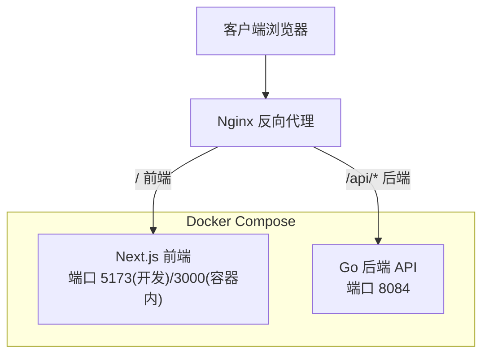
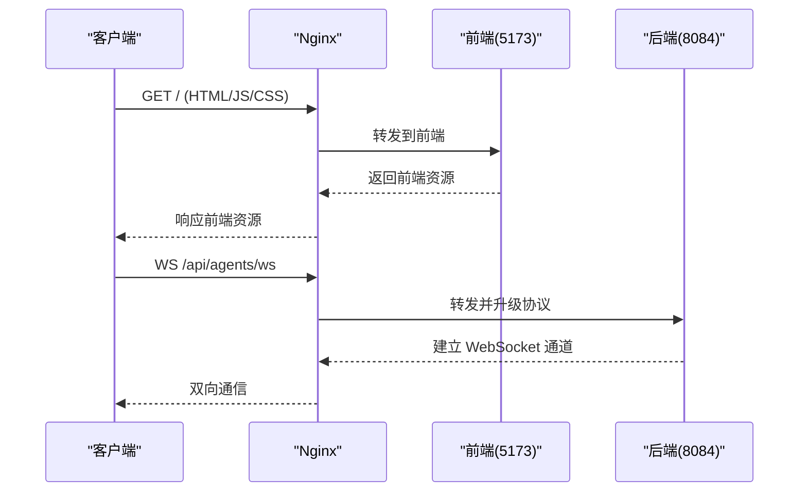
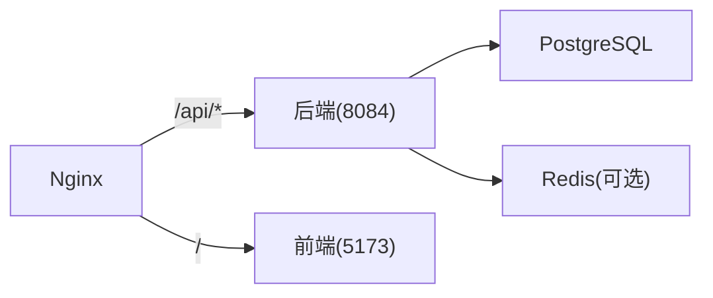

# Nginx反向代理配置

<cite>
**本文引用的文件**
- [nginx.goodhr5.example.conf](file://goodhr5/nginx.goodhr5.example.conf)
- [docker-compose.yml](file://goodhr5/docker-compose.yml)
- [docker-compose.local.yml](file://goodhr5/docker-compose.local.yml)
- [docker-compose.server.yml](file://goodhr5/docker-compose.server.yml)
- [server.go](file://goodhr5/cloud/backend/internal/httpapi/server.go)
</cite>

## 目录
1. [简介](#简介)
2. [项目结构](#项目结构)
3. [核心组件](#核心组件)
4. [架构总览](#架构总览)
5. [详细组件分析](#详细组件分析)
6. [依赖关系分析](#依赖关系分析)
7. [性能与调优](#性能与调优)
8. [故障排查指南](#故障排查指南)
9. [结论](#结论)
10. [附录：生产级Nginx配置清单](#附录生产级nginx配置清单)

## 简介
本文件面向在生产环境部署 HRPlus 的运维与开发同学，提供基于仓库内示例的反向代理实践说明。重点覆盖：
- HTTP 到 HTTPS 的重定向
- SSL 证书配置
- WebSocket 支持（/api/ 路径）
- 静态资源缓存策略
- 域名绑定与多站点部署
- 负载均衡设置
- 安全头、访问控制、错误页面定制
- 与后端服务的连接配置与性能优化参数

## 项目结构
HRPlus 包含云端后端与前端两个服务，以及用于本地与服务器部署的 Docker Compose 配置。Nginx 作为入口网关，将请求转发至前端开发/构建服务与后端 API 服务。

图表来源
- [docker-compose.yml:1-32](file://goodhr5/docker-compose.yml#L1-L32)
- [docker-compose.local.yml:1-54](file://goodhr5/docker-compose.local.yml#L1-L54)
- [docker-compose.server.yml:1-12](file://goodhr5/docker-compose.server.yml#L1-L12)

章节来源
- [docker-compose.yml:1-32](file://goodhr5/docker-compose.yml#L1-L32)
- [docker-compose.local.yml:1-54](file://goodhr5/docker-compose.local.yml#L1-L54)
- [docker-compose.server.yml:1-12](file://goodhr5/docker-compose.server.yml#L1-L12)

## 核心组件
- Nginx 反向代理示例：位于 goodhr5/nginx.goodhr5.example.conf，定义了 /api/ 与 / 的路由转发、WebSocket 升级、超时与缓冲等关键参数。
- 后端服务：Go 实现的 HTTP API，监听 8084 端口，暴露 /health 健康检查与大量业务接口。
- 前端服务：Next.js 开发服务器在本地映射 5173 端口，容器内部为 3000 端口。

章节来源
- [nginx.goodhr5.example.conf:1-37](file://goodhr5/nginx.goodhr5.example.conf#L1-L37)
- [server.go:123-212](file://goodhr5/cloud/backend/internal/httpapi/server.go#L123-L212)
- [docker-compose.local.yml:9-42](file://goodhr5/docker-compose.local.yml#L9-L42)

## 架构总览
Nginx 作为统一入口，根据 URL 前缀进行路由：
- /api/*：转发到后端 8084 端口，启用 WebSocket 升级所需头部与长连接超时。
- /：转发到前端 5173 端口（开发环境），生产环境可替换为静态站点或 Next.js 构建产物。

图表来源
- [nginx.goodhr5.example.conf:3-19](file://goodhr5/nginx.goodhr5.example.conf#L3-L19)
- [nginx.goodhr5.example.conf:21-37](file://goodhr5/nginx.goodhr5.example.conf#L21-L37)
- [server.go:136-139](file://goodhr5/cloud/backend/internal/httpapi/server.go#L136-L139)

## 详细组件分析

### 反向代理与WebSocket支持
- /api/* 路径：
  - 使用 proxy_pass 指向后端 8084。
  - 设置 HTTP/1.1 与 Upgrade 相关头部，确保 WebSocket 升级成功。
  - 关闭缓冲与缓存，避免流式数据被截断。
  - 设置合理的读写超时，适配长连接场景。
- / 路径：
  - 转发到前端 5173，设置 Host、X-Forwarded-* 等头部，便于后端识别真实协议与地址。
  - 设置连接与读写超时，保障交互体验。

章节来源
- [nginx.goodhr5.example.conf:3-19](file://goodhr5/nginx.goodhr5.example.conf#L3-L19)
- [nginx.goodhr5.example.conf:21-37](file://goodhr5/nginx.goodhr5.example.conf#L21-L37)

### 后端服务与路由
- 后端通过 Routes() 注册所有 /api/* 接口，包括认证、岗位、支付、租户管理等。
- 健康检查 /health 可用于 Nginx 健康探测与自动重启策略。
- CORS 中间件允许跨域请求，便于前后端分离开发。

章节来源
- [server.go:123-212](file://goodhr5/cloud/backend/internal/httpapi/server.go#L123-L212)
- [server.go:247-269](file://goodhr5/cloud/backend/internal/httpapi/server.go#L247-L269)
- [server.go:577-589](file://goodhr5/cloud/backend/internal/httpapi/server.go#L577-L589)

### 端口与服务发现
- 后端服务默认监听 8084。
- 前端开发服务器对外暴露 5173，容器内部为 3000。
- 生产环境建议将前端构建为静态资源并由 Nginx 直接提供，减少 Node 进程开销。

章节来源
- [docker-compose.local.yml:9-42](file://goodhr5/docker-compose.local.yml#L9-L42)
- [docker-compose.server.yml:1-12](file://goodhr5/docker-compose.server.yml#L1-L12)
- [docker-compose.yml:1-32](file://goodhr5/docker-compose.yml#L1-L32)

## 依赖关系分析
Nginx 对后端的依赖集中在 /api/* 路由；对前端的依赖集中在 / 路由。后端依赖数据库与 Redis（通过环境变量配置），前端依赖后端 API 基础地址。

图表来源
- [nginx.goodhr5.example.conf:3-19](file://goodhr5/nginx.goodhr5.example.conf#L3-L19)
- [docker-compose.local.yml:9-22](file://goodhr5/docker-compose.local.yml#L9-L22)

章节来源
- [nginx.goodhr5.example.conf:3-19](file://goodhr5/nginx.goodhr5.example.conf#L3-L19)
- [docker-compose.local.yml:9-22](file://goodhr5/docker-compose.local.yml#L9-L22)

## 性能与调优
- 连接与超时：
  - 后端长连接（WebSocket）需提高 proxy_read_timeout 与 proxy_send_timeout，避免误判超时。
  - 前端静态资源建议使用更短的超时以提升首屏速度。
- 缓冲与压缩：
  - 对 /api/* 流式响应建议关闭缓冲与 gzip，避免阻塞。
  - 对静态资源开启 gzip/brotli 与合理缓存头，降低带宽与延迟。
- 并发与队列：
  - 调整 worker_processes、worker_connections 以匹配 CPU 核数与内存。
  - 结合 keepalive 连接池减少握手开销。
- 缓存策略：
  - 静态资源按版本化文件名设置长期缓存（如 .js、.css）。
  - HTML 与 API 响应通常不缓存或短缓存，保证一致性。

[本节为通用指导，不直接分析具体文件]

## 故障排查指南
- WebSocket 无法升级：
  - 确认 Nginx 已设置 Upgrade 与 Connection 头部，且后端路由正确。
  - 检查 proxy_read_timeout 与 proxy_send_timeout 是否过短。
- 前端资源 404：
  - 确认 / 路由的 proxy_pass 指向正确的端口与路径。
  - 生产环境若使用静态站点，请确保文件路径与 Nginx root 一致。
- 后端不可达：
  - 使用 /health 检查后端状态。
  - 核对防火墙与安全组放行 8084 端口。
- 跨域问题：
  - 后端已设置 CORS 中间件，必要时在 Nginx 层也添加相应头。

章节来源
- [nginx.goodhr5.example.conf:3-19](file://goodhr5/nginx.goodhr5.example.conf#L3-L19)
- [server.go:247-269](file://goodhr5/cloud/backend/internal/httpapi/server.go#L247-L269)

## 结论
通过 Nginx 将 /api/* 与 / 分别转发到后端与前端，并结合 WebSocket 升级、超时与缓冲策略，可满足 HRPlus 的生产需求。建议在正式环境引入 HTTPS、安全头、访问控制与错误页面定制，并对静态资源实施缓存策略以提升性能。

[本节为总结性内容，不直接分析具体文件]

## 附录：生产级Nginx配置清单
以下为生产环境推荐的关键配置项与说明（概念性清单，非代码片段）：
- 域名绑定
  - server_name 指定主域名与子域名。
  - 使用 return 301 将 http 重定向到 https。
- SSL 证书
  - ssl_certificate 与 ssl_certificate_key 指向证书文件。
  - 启用 ssl_protocols 与 ssl_ciphers 限制不安全协议与密码套件。
- 安全头
  - 设置 Strict-Transport-Security、X-Content-Type-Options、X-Frame-Options、Referrer-Policy、Permissions-Policy 等。
- 访问控制
  - 对管理后台或敏感接口使用 allow/deny 或 IP 白名单。
  - 对登录与支付回调增加速率限制与防刷策略。
- 错误页面定制
  - error_page 自定义 4xx/5xx 页面，提升用户体验。
- 静态资源缓存
  - 对 .js/.css/.png/.jpg 等设置 long cache 与 ETag。
  - HTML 与 API 响应设置 no-store 或短缓存。
- 负载均衡
  - upstream 定义多个后端实例，配合 least_conn 或 ip_hash 策略。
  - 健康检查与健康阈值设置，失败节点自动剔除。
- 日志与监控
  - access_log 与 error_log 分级输出，便于审计与排障。
  - 结合 Prometheus/Nginx stub_status 进行指标采集。

[本节为通用指导，不直接分析具体文件]