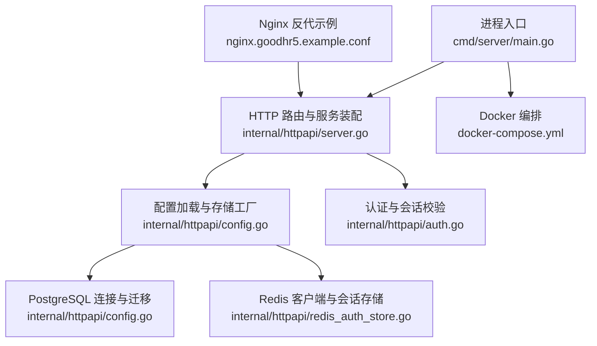
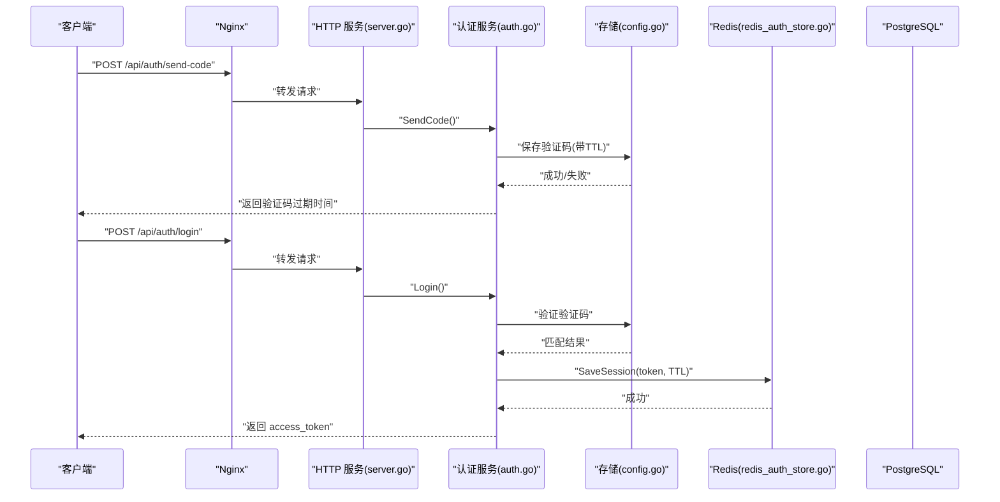
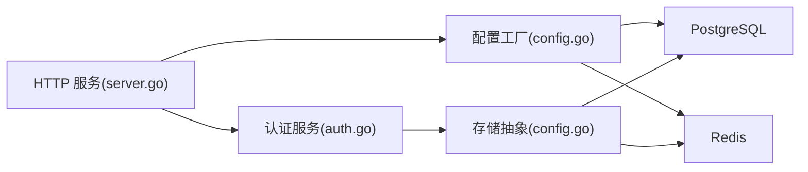

# 性能调优与安全加固

<cite>
**本文引用的文件**
- [main.go](file://goodhr5/cloud/backend/cmd/server/main.go)
- [server.go](file://goodhr5/cloud/backend/internal/httpapi/server.go)
- [config.go](file://goodhr5/cloud/backend/internal/httpapi/config.go)
- [auth.go](file://goodhr5/cloud/backend/internal/httpapi/auth.go)
- [redis_auth_store.go](file://goodhr5/cloud/backend/internal/httpapi/redis_auth_store.go)
- [docker-compose.yml](file://goodhr5/docker-compose.yml)
- [nginx.goodhr5.example.conf](file://goodhr5/nginx.goodhr5.example.conf)
</cite>

## 目录
1. [简介](#简介)
2. [项目结构](#项目结构)
3. [核心组件](#核心组件)
4. [架构总览](#架构总览)
5. [详细组件分析](#详细组件分析)
6. [依赖关系分析](#依赖关系分析)
7. [性能调优指南](#性能调优指南)
8. [安全加固指南](#安全加固指南)
9. [监控与日志](#监控与日志)
10. [负载测试与容量规划](#负载测试与容量规划)
11. [故障排查](#故障排查)
12. [结论](#结论)

## 简介
本指南面向 GoodHR5 云端后端服务，围绕数据库连接池、Redis 缓存、内存与 CPU 优化、容器资源限制、网络与磁盘 I/O 调优，以及防火墙、端口暴露、输入校验、SQL 注入与 XSS 防护等主题，提供可落地的配置建议与操作步骤。同时给出监控指标、日志收集策略、性能分析工具使用方法和负载测试与容量规划原则，帮助在生产环境稳定高效地运行系统。

## 项目结构
GoodHR5 云端后端以 Go 编写，入口在 main.go，HTTP 路由与服务组装在 server.go，配置加载与存储抽象在 config.go，认证与会话在 auth.go，Redis 会话存储在 redis_auth_store.go。开发编排通过 docker-compose.yml 启动前后端，生产反向代理参考 nginx.goodhr5.example.conf。

**图表来源**
- [main.go:14-29](file://goodhr5/cloud/backend/cmd/server/main.go#L14-L29)
- [server.go:47-121](file://goodhr5/cloud/backend/internal/httpapi/server.go#L47-L121)
- [config.go:31-75](file://goodhr5/cloud/backend/internal/httpapi/config.go#L31-L75)
- [redis_auth_store.go:16-34](file://goodhr5/cloud/backend/internal/httpapi/redis_auth_store.go#L16-L34)
- [auth.go:47-69](file://goodhr5/cloud/backend/internal/httpapi/auth.go#L47-L69)
- [docker-compose.yml:1-32](file://goodhr5/docker-compose.yml#L1-L32)
- [nginx.goodhr5.example.conf:1-38](file://goodhr5/nginx.goodhr5.example.conf#L1-L38)

**章节来源**
- [main.go:14-29](file://goodhr5/cloud/backend/cmd/server/main.go#L14-L29)
- [server.go:124-212](file://goodhr5/cloud/backend/internal/httpapi/server.go#L124-L212)
- [config.go:31-75](file://goodhr5/cloud/backend/internal/httpapi/config.go#L31-L75)
- [docker-compose.yml:1-32](file://goodhr5/docker-compose.yml#L1-L32)
- [nginx.goodhr5.example.conf:1-38](file://goodhr5/nginx.goodhr5.example.conf#L1-L38)

## 核心组件
- HTTP 服务与路由：统一注册健康检查、业务接口、CORS 中间件，集中处理错误响应与公共配置读取。
- 配置中心：从环境变量加载 PostgreSQL、Redis、SMTP、超管列表等；按是否配置持久化存储选择内存或数据库实现；为岗位日志等热点路径增加 Redis 缓存层。
- 认证与会话：邮箱验证码登录、会话保存与校验、协议同意状态记录、邀请绑定与奖励通知。
- 存储抽象：PostgreSQL 作为主存储，Redis 用于会话与验证码、岗位日志缓存；未配置时回退到内存实现。

**章节来源**
- [server.go:47-121](file://goodhr5/cloud/backend/internal/httpapi/server.go#L47-L121)
- [config.go:31-75](file://goodhr5/cloud/backend/internal/httpapi/config.go#L31-L75)
- [auth.go:71-214](file://goodhr5/cloud/backend/internal/httpapi/auth.go#L71-L214)
- [redis_auth_store.go:36-87](file://goodhr5/cloud/backend/internal/httpapi/redis_auth_store.go#L36-L87)

## 架构总览
请求从 Nginx 进入后端，路由到对应处理器，处理器调用认证服务进行鉴权，再访问存储层（PostgreSQL/Redis）。关键路径包括：
- 登录流程：发送验证码 -> 登录校验 -> 生成会话 -> 返回 token
- 岗位日志：高频写入走 Redis 缓存层，降低数据库压力
- 配置读取：系统配置与平台配置通过统一接口暴露

**图表来源**
- [server.go:124-212](file://goodhr5/cloud/backend/internal/httpapi/server.go#L124-L212)
- [auth.go:71-214](file://goodhr5/cloud/backend/internal/httpapi/auth.go#L71-L214)
- [config.go:77-87](file://goodhr5/cloud/backend/internal/httpapi/config.go#L77-L87)
- [redis_auth_store.go:36-87](file://goodhr5/cloud/backend/internal/httpapi/redis_auth_store.go#L36-L87)

## 详细组件分析

### 数据库连接池配置（PostgreSQL）
- 连接池参数：最大打开连接数、最大空闲连接数、连接生命周期已在配置初始化中设置，并附带连接 Ping 检测与自动迁移。
- 建议：
  - 根据并发请求量与慢查询情况调整最大连接数，避免超过数据库最大连接限制。
  - 将连接生命周期设置为合理值，避免长事务导致连接占用过久。
  - 对热点查询建立索引，减少全表扫描。
  - 定期执行 VACUUM/ANALYZE，保持统计信息准确。

**章节来源**
- [config.go:47-75](file://goodhr5/cloud/backend/internal/httpapi/config.go#L47-L75)

### Redis 缓存策略
- 用途：
  - 会话与验证码：使用 Redis 存储登录验证码与会话，支持 TTL 与原子消费。
  - 岗位日志：当配置 Redis 时，岗位日志写入走 Redis 缓存层，降低数据库写放大。
- 建议：
  - 为会话与验证码设置合适的 TTL，防止内存膨胀。
  - 对岗位日志采用批量写入与过期策略，避免大 Key 与热 Key。
  - 监控 Redis 命中率与延迟，必要时分库分键。

**章节来源**
- [config.go:77-87](file://goodhr5/cloud/backend/internal/httpapi/config.go#L77-L87)
- [config.go:256-268](file://goodhr5/cloud/backend/internal/httpapi/config.go#L256-L268)
- [redis_auth_store.go:36-87](file://goodhr5/cloud/backend/internal/httpapi/redis_auth_store.go#L36-L87)

### 内存使用优化
- 对象复用：避免在高频路径创建大对象，尽量复用缓冲与结构体。
- 序列化开销：JSON 编解码在高并发下成本较高，可对热点数据做结构化缓存。
- 日志输出：生产环境关闭调试模式，避免敏感信息与冗余日志造成内存抖动。
- 建议：
  - 使用 pprof 定位内存热点，关注分配峰值与 GC 频率。
  - 对大响应流式输出，避免一次性构建超大 JSON。

[本节为通用指导，不直接分析具体文件]

### CPU 利用率调优
- 热点路径：认证、岗位日志、配置读取是常见热点，应确保存储层低延迟。
- 建议：
  - 使用 pprof 的 CPU profile 定位热点函数，优化算法复杂度。
  - 对正则与字符串操作进行预编译与缓存。
  - 避免阻塞型 I/O 放在请求路径中，必要时异步化。

[本节为通用指导，不直接分析具体文件]

### Docker 容器资源限制
- 当前编排仅映射端口与挂载卷，未显式限制 CPU/内存。
- 建议：
  - 在 compose 或编排平台中设置 CPU 与内存上限，避免单实例抢占宿主资源。
  - 为日志目录与临时目录挂载独立卷，便于清理与扩容。
  - 使用只读根文件系统与最小镜像，减少攻击面。

**章节来源**
- [docker-compose.yml:1-32](file://goodhr5/docker-compose.yml#L1-L32)

### 网络性能优化
- Nginx 反代：已开启 WebSocket 升级、关闭缓冲与缓存、设置超时与分块传输，适合实时通信场景。
- 建议：
  - 启用 TCP 快速打开与连接复用。
  - 合理设置 keepalive 与线程池大小。
  - 对静态资源启用压缩与缓存头。

**章节来源**
- [nginx.goodhr5.example.conf:1-38](file://goodhr5/nginx.goodhr5.example.conf#L1-L38)

### 磁盘 I/O 优化
- 日志与上传：日志写入与上传文件可能成为 I/O 瓶颈。
- 建议：
  - 将日志与上传目录置于高性能磁盘或 SSD。
  - 使用异步写入与轮转策略，避免单文件过大。
  - 监控磁盘使用率与 IOPS，及时扩容或归档。

[本节为通用指导，不直接分析具体文件]

## 依赖关系分析
- 服务装配依赖配置工厂，配置工厂根据环境变量决定使用 PostgreSQL 或内存存储，并在有 Redis 时启用缓存层。
- 认证服务依赖存储抽象，支持 Redis 或内存会话存储。
- 路由层集中注册接口，统一错误响应与 CORS。

**图表来源**
- [server.go:47-121](file://goodhr5/cloud/backend/internal/httpapi/server.go#L47-L121)
- [config.go:31-75](file://goodhr5/cloud/backend/internal/httpapi/config.go#L31-L75)
- [auth.go:47-69](file://goodhr5/cloud/backend/internal/httpapi/auth.go#L47-L69)

**章节来源**
- [server.go:47-121](file://goodhr5/cloud/backend/internal/httpapi/server.go#L47-L121)
- [config.go:31-75](file://goodhr5/cloud/backend/internal/httpapi/config.go#L31-L75)
- [auth.go:47-69](file://goodhr5/cloud/backend/internal/httpapi/auth.go#L47-L69)

## 性能调优指南
- 数据库连接池：依据并发与慢查询调整 MaxOpenConns、MaxIdleConns、ConnMaxLifetime，并配合索引与统计信息维护。
- Redis 缓存：会话与验证码 TTL 控制，岗位日志缓存层降低写放大，监控命中率与延迟。
- 内存与 CPU：使用 pprof 定位热点，避免大对象与阻塞 I/O，预热与缓存热点数据。
- 容器资源：设置 CPU/内存限制，隔离日志与临时目录，最小化镜像。
- 网络与 I/O：Nginx 开启 WebSocket 升级与超时控制，日志与上传目录使用高性能磁盘并轮转。

[本节为综合建议，结合前述章节落地实施]

## 安全加固指南
- 防火墙与端口暴露：
  - 仅对外暴露必要端口（如 80/443），后端服务端口仅在反向代理内网可达。
  - 在容器编排中避免直接暴露后端端口至公网。
- 输入验证：
  - 所有接口均对 JSON Body 进行解析与基础校验，邮箱格式与长度限制已在认证流程中实现。
  - 管理员配置更新接口对 JSON 合法性进行校验，并对特定配置键进行语义校验。
- SQL 注入防护：
  - 使用参数化查询与 ORM/驱动封装，避免拼接 SQL。
  - 对配置与用户输入进行白名单与类型校验。
- XSS 防护：
  - 前端渲染对用户输入进行转义，服务端返回内容设置正确的 Content-Type 与缓存控制头。
  - 对上传文件进行类型与大小限制，存储于不可执行目录。
- 认证与会话：
  - 验证码 TTL 短、一次性消费，会话 TTL 可控，支持 Redis 持久化。
  - 支持万能验证码偏移机制，需严格管控环境变量。

**章节来源**
- [auth.go:71-214](file://goodhr5/cloud/backend/internal/httpapi/auth.go#L71-L214)
- [server.go:279-340](file://goodhr5/cloud/backend/internal/httpapi/server.go#L279-L340)
- [server.go:474-544](file://goodhr5/cloud/backend/internal/httpapi/server.go#L474-L544)
- [redis_auth_store.go:36-87](file://goodhr5/cloud/backend/internal/httpapi/redis_auth_store.go#L36-L87)

## 监控与日志
- 健康检查：/health 接口用于部署与健康探针。
- 日志收集：
  - 后端日志同时输出到标准输出与文件，便于容器日志采集。
  - 建议接入集中式日志系统（如 ELK/Loki），按服务与级别分类。
- 监控指标：
  - 应用层：QPS、P95/P99 延迟、错误率、GC 次数与停顿。
  - 存储层：数据库连接池使用率、慢查询数量；Redis 命中率、内存使用、命令延迟。
  - 系统层：CPU、内存、磁盘 I/O、网络带宽。
- 工具：
  - pprof：CPU/内存/阻塞分析，导出 profile 进行火焰图分析。
  - 数据库监控：pg_stat_statements 等扩展观察热点查询。
  - Redis 监控：INFO、SLOWLOG、内存与键分布分析。

**章节来源**
- [server.go:124-128](file://goodhr5/cloud/backend/internal/httpapi/server.go#L124-L128)
- [main.go:40-51](file://goodhr5/cloud/backend/cmd/server/main.go#L40-L51)

## 负载测试与容量规划
- 负载测试方法：
  - 使用压测工具模拟并发登录、岗位日志写入与配置读取，观察 QPS、延迟与错误率。
  - 逐步增加并发，识别瓶颈点（CPU、内存、数据库、Redis、I/O）。
- 容量规划原则：
  - 基于历史峰值与增长趋势设定目标容量，预留 30%-50% 余量。
  - 横向扩展：无状态服务可水平扩容，注意会话与日志缓存的共享与一致性。
  - 垂直扩展：提升单机 CPU/内存/磁盘性能，但需评估单点风险。
  - 弹性伸缩：结合监控指标自动扩缩容，避免冷启动抖动。

[本节为通用指导，不直接分析具体文件]

## 故障排查
- 常见问题：
  - 数据库连接失败：检查 DSN、网络连通性与权限，查看连接池配置与迁移日志。
  - Redis 连接失败：检查地址、密码、DB 号与网络策略，确认 Ping 成功。
  - 登录失败：检查验证码 TTL、邮箱白名单、协议同意状态与万能验证码偏移。
  - 岗位日志丢失：检查 Redis 缓存层与持久化层切换逻辑，确认写入路径。
- 诊断步骤：
  - 查看健康检查与日志输出，定位错误阶段。
  - 使用 pprof 抓取 CPU/内存 profile，分析热点与泄漏。
  - 检查数据库与 Redis 监控指标，识别慢查询与高延迟。

**章节来源**
- [config.go:47-75](file://goodhr5/cloud/backend/internal/httpapi/config.go#L47-L75)
- [redis_auth_store.go:26-34](file://goodhr5/cloud/backend/internal/httpapi/redis_auth_store.go#L26-L34)
- [auth.go:71-214](file://goodhr5/cloud/backend/internal/httpapi/auth.go#L71-L214)

## 结论
通过对数据库连接池、Redis 缓存、内存与 CPU、容器资源、网络与 I/O 的系统性调优，并结合严格的输入校验、认证与会话管理、XSS 与 SQL 注入防护，GoodHR5 云端后端可在生产环境中获得更高的稳定性与性能。配合完善的监控与日志体系、科学的负载测试与容量规划，能够持续保障服务质量与可扩展性。