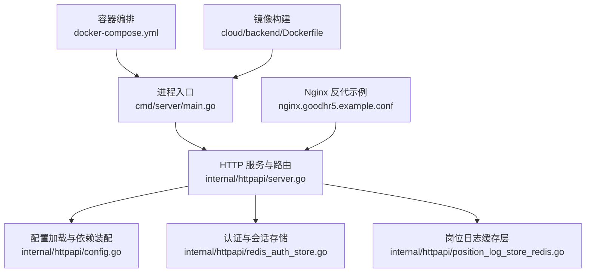
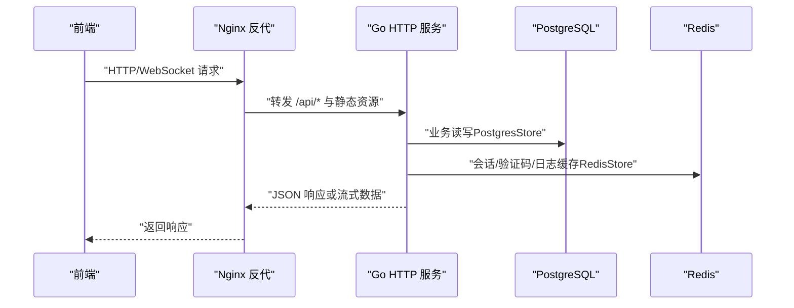
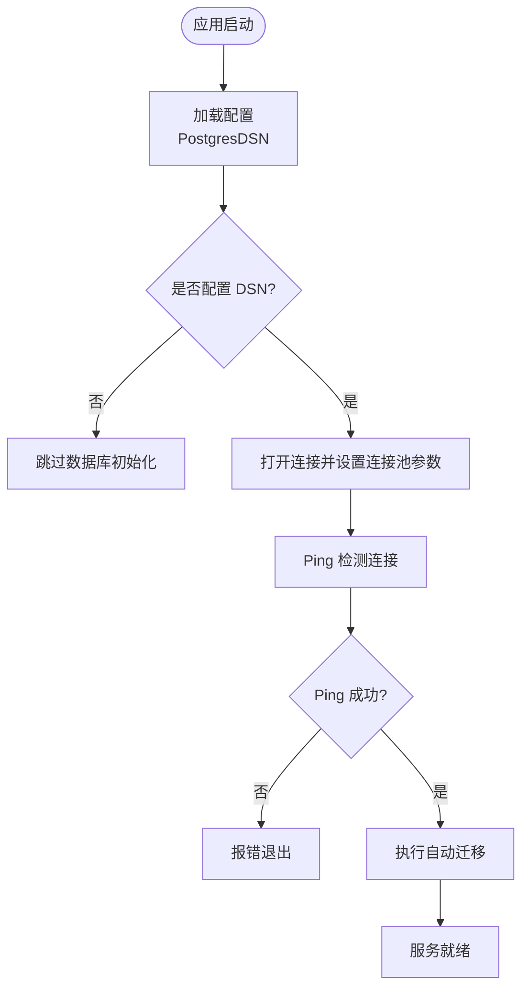
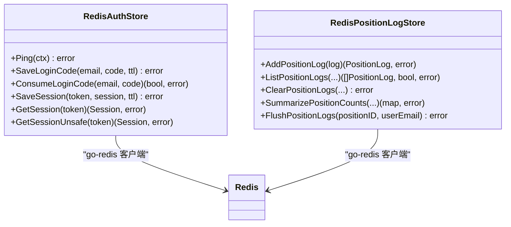
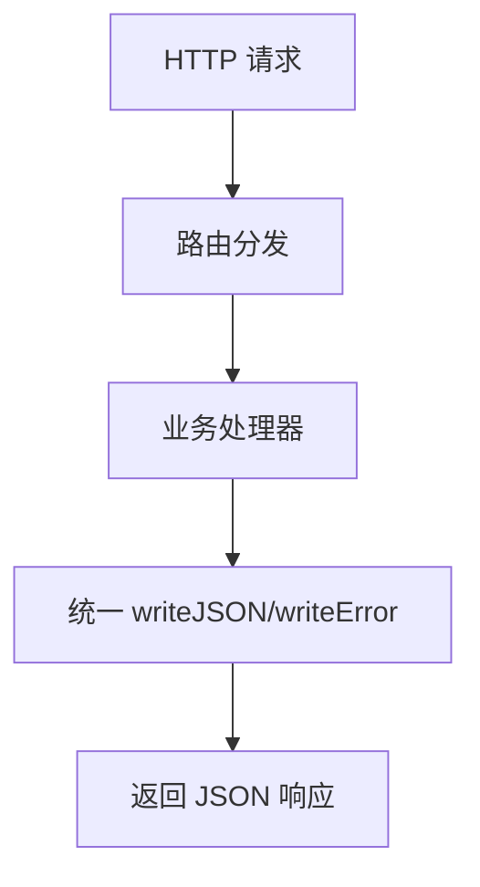
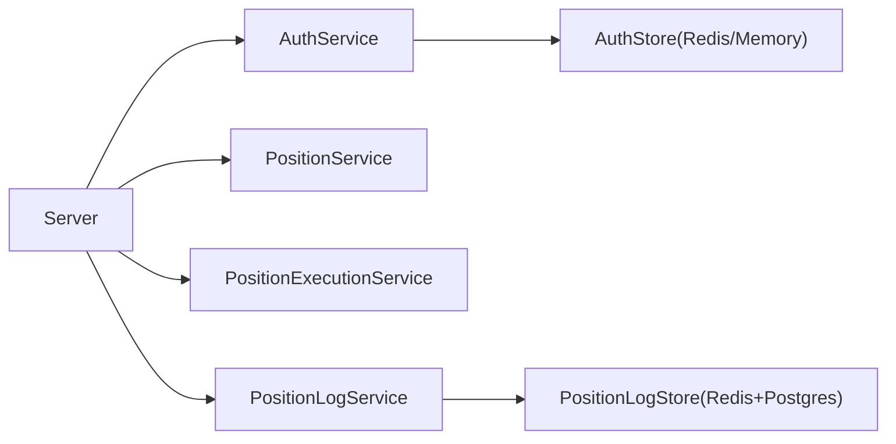

# 性能调优与安全加固

<cite>
**本文引用的文件**   
- [main.go](file://goodhr5/cloud/backend/cmd/server/main.go)
- [server.go](file://goodhr5/cloud/backend/internal/httpapi/server.go)
- [config.go](file://goodhr5/cloud/backend/internal/httpapi/config.go)
- [redis_auth_store.go](file://goodhr5/cloud/backend/internal/httpapi/redis_auth_store.go)
- [position_log_store_redis.go](file://goodhr5/cloud/backend/internal/httpapi/position_log_store_redis.go)
- [docker-compose.yml](file://goodhr5/docker-compose.yml)
- [Dockerfile](file://goodhr5/cloud/backend/Dockerfile)
- [nginx.goodhr5.example.conf](file://goodhr5/nginx.goodhr5.example.conf)
</cite>

## 目录
1. [引言](#引言)
2. [项目结构](#项目结构)
3. [核心组件](#核心组件)
4. [架构总览](#架构总览)
5. [详细组件分析](#详细组件分析)
6. [依赖关系分析](#依赖关系分析)
7. [性能调优指南](#性能调优指南)
8. [安全加固指南](#安全加固指南)
9. [监控与日志](#监控与日志)
10. [负载测试与容量规划](#负载测试与容量规划)
11. [故障排查](#故障排查)
12. [结论](#结论)

## 引言
本指南面向 GoodHR5 云端后端，围绕数据库连接池、Redis 缓存、内存与 CPU 优化、容器资源限制、网络与磁盘 I/O、安全加固（防火墙、端口暴露、输入校验、SQL 注入与 XSS 防护）、监控指标、日志收集、性能分析与负载测试进行系统化说明。文档以仓库中实际代码为依据，给出可操作的配置建议与风险点提示。

## 项目结构
GoodHR5 云端后端采用 Go HTTP 服务，入口在 main.go；HTTP 路由与服务组装在 server.go；配置与环境变量解析在 config.go；认证与会话使用 Redis 存储时由 redis_auth_store.go 实现；岗位运行日志通过 position_log_store_redis.go 提供 Redis 缓存层；部署相关包含 docker-compose.yml、Dockerfile 与 Nginx 反向代理示例 nginx.goodhr5.example.conf。

**图示来源**
- [main.go:14-30](file://goodhr5/cloud/backend/cmd/server/main.go#L14-L30)
- [server.go:47-129](file://goodhr5/cloud/backend/internal/httpapi/server.go#L47-L129)
- [config.go:54-113](file://goodhr5/cloud/backend/internal/httpapi/config.go#L54-L113)
- [redis_auth_store.go:16-34](file://goodhr5/cloud/backend/internal/httpapi/redis_auth_store.go#L16-L34)
- [position_log_store_redis.go:24-34](file://goodhr5/cloud/backend/internal/httpapi/position_log_store_redis.go#L24-L34)
- [docker-compose.yml:1-32](file://goodhr5/docker-compose.yml#L1-L32)
- [Dockerfile:1-8](file://goodhr5/cloud/backend/Dockerfile#L1-L8)
- [nginx.goodhr5.example.conf:1-38](file://goodhr5/nginx.goodhr5.example.conf#L1-L38)

**章节来源**
- [main.go:14-30](file://goodhr5/cloud/backend/cmd/server/main.go#L14-L30)
- [server.go:47-129](file://goodhr5/cloud/backend/internal/httpapi/server.go#L47-L129)
- [config.go:54-113](file://goodhr5/cloud/backend/internal/httpapi/config.go#L54-L113)
- [docker-compose.yml:1-32](file://goodhr5/docker-compose.yml#L1-L32)
- [Dockerfile:1-8](file://goodhr5/cloud/backend/Dockerfile#L1-L8)
- [nginx.goodhr5.example.conf:1-38](file://goodhr5/nginx.goodhr5.example.conf#L1-L38)

## 核心组件
- 进程入口：负责日志初始化、监听地址读取、启动 HTTP 服务。
- HTTP 服务：集中注册 API 路由，统一响应格式，基础 CORS 中间件。
- 配置中心：从环境变量加载 PostgreSQL、Redis、SMTP、管理员白名单等配置，并创建各 Store 实例。
- Redis 认证存储：会话与登录验证码的持久化与过期控制。
- 岗位日志缓存：将高频写入的岗位运行日志先落 Redis，再批量落库，并提供统计合并。

**章节来源**
- [main.go:14-52](file://goodhr5/cloud/backend/cmd/server/main.go#L14-L52)
- [server.go:132-229](file://goodhr5/cloud/backend/internal/httpapi/server.go#L132-L229)
- [config.go:54-113](file://goodhr5/cloud/backend/internal/httpapi/config.go#L54-L113)
- [redis_auth_store.go:16-115](file://goodhr5/cloud/backend/internal/httpapi/redis_auth_store.go#L16-L115)
- [position_log_store_redis.go:36-165](file://goodhr5/cloud/backend/internal/httpapi/position_log_store_redis.go#L36-L165)

## 架构总览
GoodHR5 云端后端对外暴露 REST 与 WebSocket 接口，前端通过 Nginx 反代访问后端。PostgreSQL 作为主存储，Redis 用于会话与日志缓存。开发环境可通过 Docker Compose 快速拉起后端与前端。

**图示来源**
- [nginx.goodhr5.example.conf:3-19](file://goodhr5/nginx.goodhr5.example.conf#L3-L19)
- [server.go:132-229](file://goodhr5/cloud/backend/internal/httpapi/server.go#L132-L229)
- [config.go:73-113](file://goodhr5/cloud/backend/internal/httpapi/config.go#L73-L113)
- [redis_auth_store.go:16-34](file://goodhr5/cloud/backend/internal/httpapi/redis_auth_store.go#L16-L34)
- [position_log_store_redis.go:36-165](file://goodhr5/cloud/backend/internal/httpapi/position_log_store_redis.go#L36-L165)

## 详细组件分析

### 数据库连接池与迁移
- 连接池参数：最大打开连接数、最大空闲连接数、连接生命周期。
- 健康检查：启动时 Ping 数据库，失败则中止启动。
- 自动迁移：连接成功后执行迁移脚本，保证 schema 一致。

**图示来源**
- [config.go:73-101](file://goodhr5/cloud/backend/internal/httpapi/config.go#L73-L101)

**章节来源**
- [config.go:73-101](file://goodhr5/cloud/backend/internal/httpapi/config.go#L73-L101)

### Redis 缓存策略
- 认证与会话：登录验证码一次性消费、会话带过期时间、键空间隔离。
- 岗位日志：按岗位维度列表缓存，限制单岗位日志条数，TTL 过期清理，支持增量读取与批量落库。
- 统计汇总：同时聚合 Redis 缓存与持久化数据。

**图示来源**
- [redis_auth_store.go:16-115](file://goodhr5/cloud/backend/internal/httpapi/redis_auth_store.go#L16-L115)
- [position_log_store_redis.go:24-165](file://goodhr5/cloud/backend/internal/httpapi/position_log_store_redis.go#L24-L165)

**章节来源**
- [redis_auth_store.go:16-115](file://goodhr5/cloud/backend/internal/httpapi/redis_auth_store.go#L16-L115)
- [position_log_store_redis.go:36-165](file://goodhr5/cloud/backend/internal/httpapi/position_log_store_redis.go#L36-L165)

### HTTP 路由与响应规范
- 统一 JSON 响应体与错误码。
- 基础 CORS 中间件允许跨域，便于本地开发。
- 健康检查端点用于存活探测。

**图示来源**
- [server.go:283-313](file://goodhr5/cloud/backend/internal/httpapi/server.go#L283-L313)
- [server.go:613-624](file://goodhr5/cloud/backend/internal/httpapi/server.go#L613-L624)

**章节来源**
- [server.go:132-229](file://goodhr5/cloud/backend/internal/httpapi/server.go#L132-L229)
- [server.go:283-313](file://goodhr5/cloud/backend/internal/httpapi/server.go#L283-L313)
- [server.go:613-624](file://goodhr5/cloud/backend/internal/httpapi/server.go#L613-L624)

## 依赖关系分析
- 外部依赖：PostgreSQL（lib/pq）、Redis（go-redis）。
- 内部依赖：Server 依赖多个 Service 与 Store，Store 根据配置选择 Postgres 或 Memory 实现；当启用 Redis 时，认证与会话、岗位日志走 Redis 层。

**图示来源**
- [server.go:47-129](file://goodhr5/cloud/backend/internal/httpapi/server.go#L47-L129)
- [config.go:103-113](file://goodhr5/cloud/backend/internal/httpapi/config.go#L103-L113)
- [config.go:296-308](file://goodhr5/cloud/backend/internal/httpapi/config.go#L296-L308)

**章节来源**
- [server.go:47-129](file://goodhr5/cloud/backend/internal/httpapi/server.go#L47-L129)
- [config.go:103-113](file://goodhr5/cloud/backend/internal/httpapi/config.go#L103-L113)
- [config.go:296-308](file://goodhr5/cloud/backend/internal/httpapi/config.go#L296-L308)

## 性能调优指南

### 数据库连接池配置
- 当前默认值：最大打开连接 10、最大空闲连接 5、连接生命周期 30 分钟。
- 建议：
  - 根据并发 QPS 与慢查询比例调整 MaxOpenConns，避免连接耗尽。
  - 合理设置 MaxIdleConns，减少冷连接重建开销。
  - ConnMaxLifetime 保持适中，配合数据库侧 max_connections 与超时策略。
  - 生产环境务必开启连接 Ping 检测，异常时快速失败。

**章节来源**
- [config.go:73-101](file://goodhr5/cloud/backend/internal/httpapi/config.go#L73-L101)

### Redis 缓存策略
- 认证与会话：
  - 登录验证码 TTL 应短且一次性消费，防止重放攻击。
  - 会话 TTL 与前端登出逻辑保持一致，避免僵尸会话。
- 岗位日志：
  - 单岗位日志上限限制，避免单个 key 过大。
  - 定期 FlushPositionLogs 将缓存落库，降低丢失风险。
  - 统计接口同时聚合缓存与持久化数据，保障一致性。

**章节来源**
- [redis_auth_store.go:36-115](file://goodhr5/cloud/backend/internal/httpapi/redis_auth_store.go#L36-L115)
- [position_log_store_redis.go:36-165](file://goodhr5/cloud/backend/internal/httpapi/position_log_store_redis.go#L36-L165)

### 内存使用优化
- 避免大对象序列化：日志与会话 JSON 体积需受控，必要时压缩或分片。
- 控制缓存规模：岗位日志列表长度限制、TTL 过期清理。
- 减少临时分配：批量落库前排序与过滤尽量复用切片。

**章节来源**
- [position_log_store_redis.go:36-165](file://goodhr5/cloud/backend/internal/httpapi/position_log_store_redis.go#L36-L165)

### CPU 利用率调优
- 路由分发与响应序列化集中在少量函数，注意避免阻塞 IO 操作。
- 对热点接口（如岗位日志列表）优先走 Redis 缓存，降低数据库压力。
- 异步任务（如邮件恢复调度）应避免与请求路径耦合。

**章节来源**
- [server.go:132-229](file://goodhr5/cloud/backend/internal/httpapi/server.go#L132-L229)
- [position_log_store_redis.go:72-110](file://goodhr5/cloud/backend/internal/httpapi/position_log_store_redis.go#L72-L110)

### Docker 容器资源限制
- 建议在 docker-compose 中为 backend 与 frontend 设置 memory/cpu 限制，避免争抢宿主机资源。
- 使用只读根文件系统与最小化镜像，减少攻击面。
- 挂载必要卷（如日志、上传目录），避免容器内写盘造成 GC 抖动。

**章节来源**
- [docker-compose.yml:1-32](file://goodhr5/docker-compose.yml#L1-L32)
- [Dockerfile:1-8](file://goodhr5/cloud/backend/Dockerfile#L1-L8)

### 网络性能优化
- Nginx 反代已开启 WebSocket 升级头与长连接超时，适合实时通信场景。
- 关闭不必要的 gzip 与缓存，避免对长连接与流式响应造成干扰。
- 合理设置 proxy_read_timeout 与 proxy_send_timeout，匹配业务耗时。

**章节来源**
- [nginx.goodhr5.example.conf:3-19](file://goodhr5/nginx.goodhr5.example.conf#L3-L19)

### 磁盘 I/O 优化
- 日志输出到独立卷，避免与业务数据竞争 I/O。
- 控制日志级别与轮转策略，避免瞬时大量写入。
- 上传目录与临时目录分离，使用高性能介质。

**章节来源**
- [main.go:40-52](file://goodhr5/cloud/backend/cmd/server/main.go#L40-L52)

## 安全加固指南

### 防火墙与端口暴露控制
- 仅暴露必要端口：后端 8084、前端 5173（开发），生产环境建议仅暴露 80/443，由 Nginx 统一入口。
- 禁止直接访问后端端口，所有流量经 Nginx 反代。
- 使用云厂商安全组/防火墙规则限制来源 IP。

**章节来源**
- [docker-compose.yml:4-21](file://goodhr5/docker-compose.yml#L4-L21)
- [nginx.goodhr5.example.conf:3-37](file://goodhr5/nginx.goodhr5.example.conf#L3-L37)

### 输入验证与 SQL 注入防护
- 系统配置更新接口对 JSON 有效性进行校验，并对特定配置项做结构化解析校验。
- 建议使用参数化查询与 ORM，避免拼接 SQL。
- 对管理员接口增加严格的权限校验与审计日志。

**章节来源**
- [server.go:510-579](file://goodhr5/cloud/backend/internal/httpapi/server.go#L510-L579)

### XSS 防护
- 统一 JSON 响应设置 Content-Type 与缓存控制头，避免浏览器误解析。
- 前端渲染对用户输入进行转义，服务端不信任任何用户输入。
- 上传文件类型与大小限制，避免恶意内容注入。

**章节来源**
- [server.go:297-305](file://goodhr5/cloud/backend/internal/httpapi/server.go#L297-L305)

### 认证与会话安全
- 登录验证码一次性消费，防止重放。
- 会话带过期时间，避免长期有效。
- Redis 密码与 DB 号通过环境变量注入，避免硬编码。

**章节来源**
- [redis_auth_store.go:36-115](file://goodhr5/cloud/backend/internal/httpapi/redis_auth_store.go#L36-L115)
- [config.go:54-71](file://goodhr5/cloud/backend/internal/httpapi/config.go#L54-L71)

## 监控与日志

### 监控指标
- 健康检查：/health 返回服务名称与版本，供探针探测。
- 关键指标：QPS、延迟分布、错误率、数据库连接池使用率、Redis 命中率、GC 次数与停顿。
- 建议接入 Prometheus + Grafana，采集 Go runtime 指标与业务自定义指标。

**章节来源**
- [server.go:283-295](file://goodhr5/cloud/backend/internal/httpapi/server.go#L283-L295)

### 日志收集策略
- 后端日志同时输出到 stdout 与文件，便于容器采集与本地调试。
- 日志路径与文件名通过环境变量配置，生产环境建议集中到日志平台。
- 建议按模块与级别拆分日志，便于检索与分析。

**章节来源**
- [main.go:40-52](file://goodhr5/cloud/backend/cmd/server/main.go#L40-L52)

### 性能分析工具
- pprof：在开发或预发环境开启，采样 CPU 与内存热点。
- go tool trace：定位长时间阻塞与调度问题。
- Redis 监控：查看键空间、命中率、内存使用与慢查询。

[本节为通用指导，无需具体文件引用]

## 负载测试与容量规划

### 负载测试方法
- 使用 k6/JMeter 模拟真实用户行为，覆盖登录、岗位日志查询、支付回调等关键路径。
- 逐步加压，观察 P95/P99 延迟与错误率拐点。
- 针对 WebSocket 场景，测试连接建立与消息吞吐。

[本节为通用指导，无需具体文件引用]

### 容量规划原则
- 数据库：根据 QPS 与慢查询比例估算连接池与索引优化需求。
- Redis：评估会话数量、日志缓存大小与淘汰策略。
- 计算资源：依据压测结果确定 CPU/内存配额，预留 30%~50% 余量。
- 存储：预估日志与上传数据增长，制定归档与清理策略。

[本节为通用指导，无需具体文件引用]

## 故障排查

### 常见问题
- 数据库连接失败：检查 DSN、网络连通性与权限；确认 Ping 失败时的日志。
- Redis 不可用：检查地址、密码、DB 号；确认会话与验证码失效。
- WebSocket 升级失败：检查 Nginx Upgrade 与 Connection 头配置。
- 日志未落库：检查 Redis 缓存是否过期或未 Flush。

**章节来源**
- [config.go:73-101](file://goodhr5/cloud/backend/internal/httpapi/config.go#L73-L101)
- [redis_auth_store.go:26-34](file://goodhr5/cloud/backend/internal/httpapi/redis_auth_store.go#L26-L34)
- [nginx.goodhr5.example.conf:3-19](file://goodhr5/nginx.goodhr5.example.conf#L3-L19)
- [position_log_store_redis.go:143-165](file://goodhr5/cloud/backend/internal/httpapi/position_log_store_redis.go#L143-L165)

## 结论
GoodHR5 云端后端在连接池、Redis 缓存与日志分层方面已有良好基础。生产环境应重点完善容器资源限制、网络与安全加固、监控与日志体系，并通过负载测试持续校准容量。遵循本指南的配置与建议，可在稳定性、性能与安全之间取得平衡。