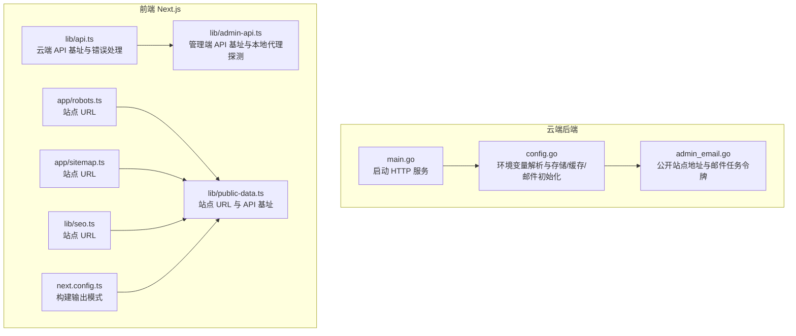
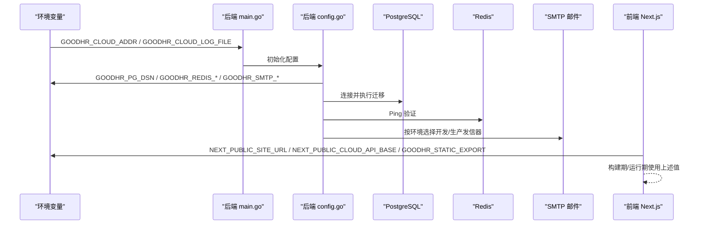
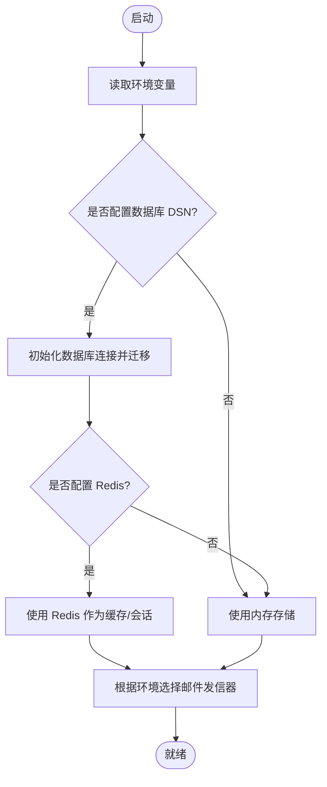
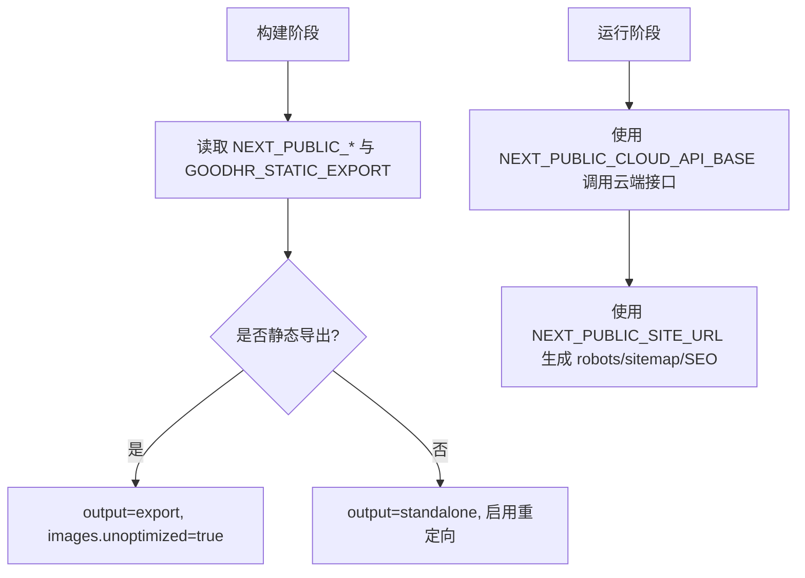
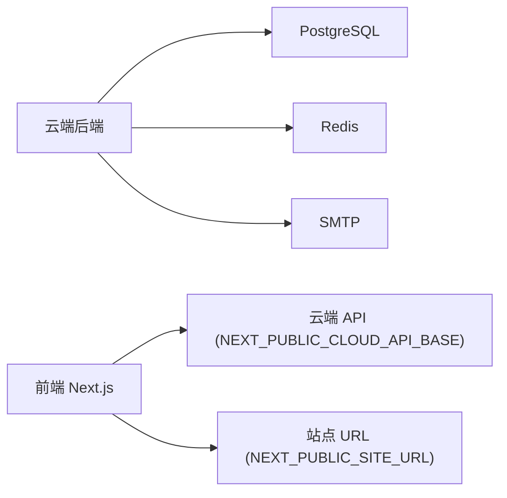

# 环境变量配置

<cite>
**本文引用的文件**   
- [cloud/backend/internal/httpapi/config.go](file://goodhr5/cloud/backend/internal/httpapi/config.go)
- [cloud/backend/cmd/server/main.go](file://goodhr5/cloud/backend/cmd/server/main.go)
- [cloud/backend/internal/httpapi/admin_email.go](file://goodhr5/cloud/backend/internal/httpapi/admin_email.go)
- [cloud/frontend-next/lib/api.ts](file://goodhr5/cloud/frontend-next/lib/api.ts)
- [cloud/frontend-next/lib/admin-api.ts](file://goodhr5/cloud/frontend-next/lib/admin-api.ts)
- [cloud/frontend-next/app/robots.ts](file://goodhr5/cloud/frontend-next/app/robots.ts)
- [cloud/frontend-next/app/sitemap.ts](file://goodhr5/cloud/frontend-next/app/sitemap.ts)
- [cloud/frontend-next/lib/public-data.ts](file://goodhr5/cloud/frontend-next/lib/public-data.ts)
- [cloud/frontend-next/lib/seo.ts](file://goodhr5/cloud/frontend-next/lib/seo.ts)
- [cloud/frontend-next/next.config.ts](file://goodhr5/cloud/frontend-next/next.config.ts)
</cite>

## 目录
1. [简介](#简介)
2. [项目结构](#项目结构)
3. [核心组件](#核心组件)
4. [架构总览](#架构总览)
5. [详细组件分析](#详细组件分析)
6. [依赖关系分析](#依赖关系分析)
7. [性能考虑](#性能考虑)
8. [故障排查指南](#故障排查指南)
9. [结论](#结论)
10. [附录：环境变量清单与模板](#附录环境变量清单与模板)

## 简介
本指南聚焦 HRPlus 项目的“环境变量配置”，覆盖云端后端（Go）与生产前端（Next.js）两类运行环境。文档将说明数据库连接、Redis、邮件服务、站点地址、构建模式等关键配置项，解释开发/测试/生产的差异与管理策略，并提供安全最佳实践、配置校验思路以及热重载与动态配置的可行方案。

需要特别说明的是：当前代码库中未发现 JWT 密钥、支付网关或 AI 服务 API 密钥的环境变量定义；相关能力通过其他机制实现（例如登录验证码、系统配置表、钱包余额等）。因此本指南不会虚构这些字段，而是基于现有代码给出准确说明与扩展建议。

## 项目结构
HRPlus 的云端后端与前端分别通过环境变量完成运行时配置：
- 云端后端（Go）：从进程环境变量加载数据库、缓存、邮件、监听端口、日志路径、公共站点地址、后台任务令牌等。
- 前端（Next.js）：通过 process.env 注入站点地址、云端 API 基址、静态导出开关等，用于构建期与运行期行为控制。

**图表来源**
- [cloud/backend/cmd/server/main.go:14-30](file://goodhr5/cloud/backend/cmd/server/main.go#L14-L30)
- [cloud/backend/internal/httpapi/config.go:54-71](file://goodhr5/cloud/backend/internal/httpapi/config.go#L54-L71)
- [cloud/backend/internal/httpapi/admin_email.go:542-542](file://goodhr5/cloud/backend/internal/httpapi/admin_email.go#L542-L542)
- [cloud/frontend-next/lib/api.ts:8-13](file://goodhr5/cloud/frontend-next/lib/api.ts#L8-L13)
- [cloud/frontend-next/lib/admin-api.ts:6-13](file://goodhr5/cloud/frontend-next/lib/admin-api.ts#L6-L13)
- [cloud/frontend-next/app/robots.ts:9-9](file://goodhr5/cloud/frontend-next/app/robots.ts#L9-L9)
- [cloud/frontend-next/app/sitemap.ts:9-9](file://goodhr5/cloud/frontend-next/app/sitemap.ts#L9-L9)
- [cloud/frontend-next/lib/public-data.ts:67-99](file://goodhr5/cloud/frontend-next/lib/public-data.ts#L67-L99)
- [cloud/frontend-next/lib/seo.ts:5-5](file://goodhr5/cloud/frontend-next/lib/seo.ts#L5-L5)
- [cloud/frontend-next/next.config.ts:4-7](file://goodhr5/cloud/frontend-next/next.config.ts#L4-L7)

**章节来源**
- [cloud/backend/cmd/server/main.go:14-30](file://goodhr5/cloud/backend/cmd/server/main.go#L14-L30)
- [cloud/backend/internal/httpapi/config.go:54-71](file://goodhr5/cloud/backend/internal/httpapi/config.go#L54-L71)
- [cloud/frontend-next/lib/api.ts:8-13](file://goodhr5/cloud/frontend-next/lib/api.ts#L8-L13)
- [cloud/frontend-next/lib/admin-api.ts:6-13](file://goodhr5/cloud/frontend-next/lib/admin-api.ts#L6-L13)
- [cloud/frontend-next/next.config.ts:4-7](file://goodhr5/cloud/frontend-next/next.config.ts#L4-L7)

## 核心组件
本节梳理与“环境变量”直接相关的核心逻辑：
- 云端后端配置加载：统一从环境变量读取应用环境、PostgreSQL DSN、Redis 地址/密码/库号、SMTP 发信参数、超级管理员列表、通用登录验证码偏移分钟数、Agent 绑定开关等。
- 云端后端启动：监听地址与日志文件路径由环境变量控制。
- 云端后端邮件与公开站点：公开站点地址与邮件任务令牌由环境变量控制。
- 前端 API 基址与站点 URL：NEXT_PUBLIC_CLOUD_API_BASE、NEXT_PUBLIC_SITE_URL 等决定前端访问目标与 SEO/robots/sitemap 生成。
- 前端构建模式：GOODHR_STATIC_EXPORT 控制是否进行静态导出。

**章节来源**
- [cloud/backend/internal/httpapi/config.go:54-71](file://goodhr5/cloud/backend/internal/httpapi/config.go#L54-L71)
- [cloud/backend/cmd/server/main.go:19-20](file://goodhr5/cloud/backend/cmd/server/main.go#L19-L20)
- [cloud/backend/cmd/server/main.go:41-41](file://goodhr5/cloud/backend/cmd/server/main.go#L41-L41)
- [cloud/backend/internal/httpapi/admin_email.go:542-542](file://goodhr5/cloud/backend/internal/httpapi/admin_email.go#L542-L542)
- [cloud/backend/internal/httpapi/admin_email.go:652-652](file://goodhr5/cloud/backend/internal/httpapi/admin_email.go#L652-L652)
- [cloud/frontend-next/lib/api.ts:8-13](file://goodhr5/cloud/frontend-next/lib/api.ts#L8-L13)
- [cloud/frontend-next/lib/admin-api.ts:6-13](file://goodhr5/cloud/frontend-next/lib/admin-api.ts#L6-L13)
- [cloud/frontend-next/app/robots.ts:9-9](file://goodhr5/cloud/frontend-next/app/robots.ts#L9-L9)
- [cloud/frontend-next/app/sitemap.ts:9-9](file://goodhr5/cloud/frontend-next/app/sitemap.ts#L9-L9)
- [cloud/frontend-next/lib/public-data.ts:67-99](file://goodhr5/cloud/frontend-next/lib/public-data.ts#L67-L99)
- [cloud/frontend-next/lib/seo.ts:5-5](file://goodhr5/cloud/frontend-next/lib/seo.ts#L5-L5)
- [cloud/frontend-next/next.config.ts:4-7](file://goodhr5/cloud/frontend-next/next.config.ts#L4-L7)

## 架构总览
下图展示环境变量在启动与请求链路中的位置：后端启动时读取监听地址与日志路径；配置模块根据环境变量创建数据库、Redis、邮件等依赖；前端在构建和运行期读取站点 URL 与云端 API 基址，并据此发起请求。

**图表来源**
- [cloud/backend/cmd/server/main.go:19-20](file://goodhr5/cloud/backend/cmd/server/main.go#L19-L20)
- [cloud/backend/cmd/server/main.go:41-41](file://goodhr5/cloud/backend/cmd/server/main.go#L41-L41)
- [cloud/backend/internal/httpapi/config.go:54-71](file://goodhr5/cloud/backend/internal/httpapi/config.go#L54-L71)
- [cloud/backend/internal/httpapi/config.go:74-100](file://goodhr5/cloud/backend/internal/httpapi/config.go#L74-L100)
- [cloud/backend/internal/httpapi/config.go:103-113](file://goodhr5/cloud/backend/internal/httpapi/config.go#L103-L113)
- [cloud/backend/internal/httpapi/config.go:115-133](file://goodhr5/cloud/backend/internal/httpapi/config.go#L115-L133)
- [cloud/frontend-next/lib/api.ts:8-13](file://goodhr5/cloud/frontend-next/lib/api.ts#L8-L13)
- [cloud/frontend-next/next.config.ts:4-7](file://goodhr5/cloud/frontend-next/next.config.ts#L4-L7)

## 详细组件分析

### 云端后端配置加载与存储/缓存/邮件
- 配置加载：从环境变量读取应用环境、数据库 DSN、Redis 地址/密码/库号、SMTP 主机/端口/用户名/密码/发件人、超级管理员邮箱列表、通用登录验证码偏移分钟数、Agent 绑定开关。
- 数据库：若未配置 DSN，则不创建持久化连接；否则建立连接池、Ping 检查并自动执行迁移。
- 认证存储：优先使用 Redis；未配置 Redis 时使用内存实现。
- 邮件：开发环境默认走开发发信器；生产环境要求 SMTP 三项齐全，否则降级为开发发信器并记录警告。
- 各类 Store：均遵循“有 PostgreSQL 则用 Postgres，否则回退到内存”的策略。

**图表来源**
- [cloud/backend/internal/httpapi/config.go:54-71](file://goodhr5/cloud/backend/internal/httpapi/config.go#L54-L71)
- [cloud/backend/internal/httpapi/config.go:74-100](file://goodhr5/cloud/backend/internal/httpapi/config.go#L74-L100)
- [cloud/backend/internal/httpapi/config.go:103-113](file://goodhr5/cloud/backend/internal/httpapi/config.go#L103-L113)
- [cloud/backend/internal/httpapi/config.go:115-133](file://goodhr5/cloud/backend/internal/httpapi/config.go#L115-L133)

**章节来源**
- [cloud/backend/internal/httpapi/config.go:54-71](file://goodhr5/cloud/backend/internal/httpapi/config.go#L54-L71)
- [cloud/backend/internal/httpapi/config.go:74-100](file://goodhr5/cloud/backend/internal/httpapi/config.go#L74-L100)
- [cloud/backend/internal/httpapi/config.go:103-113](file://goodhr5/cloud/backend/internal/httpapi/config.go#L103-L113)
- [cloud/backend/internal/httpapi/config.go:115-133](file://goodhr5/cloud/backend/internal/httpapi/config.go#L115-L133)

### 云端后端启动与日志
- 监听地址：由 GOODHR_CLOUD_ADDR 控制，默认 :8084。
- 日志文件：由 GOODHR_CLOUD_LOG_FILE 控制，默认 logs/backend.log，启动时会创建目录并追加写入。

**章节来源**
- [cloud/backend/cmd/server/main.go:19-20](file://goodhr5/cloud/backend/cmd/server/main.go#L19-L20)
- [cloud/backend/cmd/server/main.go:41-41](file://goodhr5/cloud/backend/cmd/server/main.go#L41-L41)

### 云端后端邮件与公开站点
- 公开站点地址：GOODHR_PUBLIC_BASE_URL 用于邮件等场景拼接链接。
- 邮件任务令牌：GOODHR_EMAIL_JOB_TOKEN 用于后台邮件任务鉴权。

**章节来源**
- [cloud/backend/internal/httpapi/admin_email.go:542-542](file://goodhr5/cloud/backend/internal/httpapi/admin_email.go#L542-L542)
- [cloud/backend/internal/httpapi/admin_email.go:652-652](file://goodhr5/cloud/backend/internal/httpapi/admin_email.go#L652-L652)

### 前端 API 基址与站点 URL
- 云端 API 基址：NEXT_PUBLIC_CLOUD_API_BASE 决定浏览器访问的后端地址；未设置时，非生产环境默认指向本地 8084 端口。
- 旧后台地址：NEXT_PUBLIC_LEGACY_ADMIN_URL 可自定义登录后跳转的旧后台路径。
- 站点 URL：NEXT_PUBLIC_SITE_URL 用于 robots、sitemap、SEO 等生成。
- 静态导出：GOODHR_STATIC_EXPORT=1 时启用静态导出模式，影响 images 优化与重定向行为。

**图表来源**
- [cloud/frontend-next/lib/api.ts:8-13](file://goodhr5/cloud/frontend-next/lib/api.ts#L8-L13)
- [cloud/frontend-next/lib/admin-api.ts:6-13](file://goodhr5/cloud/frontend-next/lib/admin-api.ts#L6-L13)
- [cloud/frontend-next/app/robots.ts:9-9](file://goodhr5/cloud/frontend-next/app/robots.ts#L9-L9)
- [cloud/frontend-next/app/sitemap.ts:9-9](file://goodhr5/cloud/frontend-next/app/sitemap.ts#L9-L9)
- [cloud/frontend-next/lib/public-data.ts:67-99](file://goodhr5/cloud/frontend-next/lib/public-data.ts#L67-L99)
- [cloud/frontend-next/lib/seo.ts:5-5](file://goodhr5/cloud/frontend-next/lib/seo.ts#L5-L5)
- [cloud/frontend-next/next.config.ts:4-7](file://goodhr5/cloud/frontend-next/next.config.ts#L4-L7)

**章节来源**
- [cloud/frontend-next/lib/api.ts:8-13](file://goodhr5/cloud/frontend-next/lib/api.ts#L8-L13)
- [cloud/frontend-next/lib/admin-api.ts:6-13](file://goodhr5/cloud/frontend-next/lib/admin-api.ts#L6-L13)
- [cloud/frontend-next/app/robots.ts:9-9](file://goodhr5/cloud/frontend-next/app/robots.ts#L9-L9)
- [cloud/frontend-next/app/sitemap.ts:9-9](file://goodhr5/cloud/frontend-next/app/sitemap.ts#L9-L9)
- [cloud/frontend-next/lib/public-data.ts:67-99](file://goodhr5/cloud/frontend-next/lib/public-data.ts#L67-L99)
- [cloud/frontend-next/lib/seo.ts:5-5](file://goodhr5/cloud/frontend-next/lib/seo.ts#L5-L5)
- [cloud/frontend-next/next.config.ts:4-7](file://goodhr5/cloud/frontend-next/next.config.ts#L4-L7)

## 依赖关系分析
- 后端依赖：
  - 数据库：PostgreSQL（可选，未配置则回退内存存储）。
  - 缓存：Redis（可选，未配置则回退内存存储）。
  - 邮件：SMTP（生产环境需完整配置，否则降级为开发发信器）。
- 前端依赖：
  - 云端 API：由 NEXT_PUBLIC_CLOUD_API_BASE 决定。
  - 站点信息：由 NEXT_PUBLIC_SITE_URL 决定。
  - 构建产物：由 GOODHR_STATIC_EXPORT 决定。

**图表来源**
- [cloud/backend/internal/httpapi/config.go:54-71](file://goodhr5/cloud/backend/internal/httpapi/config.go#L54-L71)
- [cloud/frontend-next/lib/api.ts:8-13](file://goodhr5/cloud/frontend-next/lib/api.ts#L8-L13)
- [cloud/frontend-next/app/robots.ts:9-9](file://goodhr5/cloud/frontend-next/app/robots.ts#L9-L9)

**章节来源**
- [cloud/backend/internal/httpapi/config.go:54-71](file://goodhr5/cloud/backend/internal/httpapi/config.go#L54-L71)
- [cloud/frontend-next/lib/api.ts:8-13](file://goodhr5/cloud/frontend-next/lib/api.ts#L8-L13)
- [cloud/frontend-next/app/robots.ts:9-9](file://goodhr5/cloud/frontend-next/app/robots.ts#L9-L9)

## 性能考虑
- 数据库连接池：后端已设置最大连接数、空闲连接数与连接生命周期，避免资源耗尽。
- Redis 缓存：当配置 Redis 时，岗位日志等读写会经过 Redis 层，提升热点数据访问性能。
- 邮件发送：生产环境必须正确配置 SMTP，否则会自动降级为开发发信器，避免误发邮件。
- 前端构建：静态导出模式下图片优化关闭，适合 CDN 托管静态站点；非静态模式采用 standalone 输出并启用重定向。

[本节为通用性能建议，不直接分析具体文件]

## 故障排查指南
- 无法连接云端服务（前端）：检查 NEXT_PUBLIC_CLOUD_API_BASE 是否正确，浏览器控制台网络面板确认请求目标。
- 无法连接本地程序（前端管理端）：检查本地代理端口探测逻辑与防火墙/安全软件拦截情况。
- 邮件未发出（后端）：确认 GOODHR_APP_ENV 是否为 prod，且 SMTP_HOST/USERNAME/PASSWORD 全部填写；否则将降级为开发发信器。
- 站点 URL 异常（前端）：检查 NEXT_PUBLIC_SITE_URL 是否包含协议与域名，robots/sitemap/SEO 将使用该值。
- 构建产物不符合预期（前端）：检查 GOODHR_STATIC_EXPORT 是否为 1，以切换 output 模式与图片优化策略。

**章节来源**
- [cloud/frontend-next/lib/api.ts:20-43](file://goodhr5/cloud/frontend-next/lib/api.ts#L20-L43)
- [cloud/frontend-next/lib/admin-api.ts:62-86](file://goodhr5/cloud/frontend-next/lib/admin-api.ts#L62-L86)
- [cloud/backend/internal/httpapi/config.go:115-133](file://goodhr5/cloud/backend/internal/httpapi/config.go#L115-L133)
- [cloud/frontend-next/app/robots.ts:9-9](file://goodhr5/cloud/frontend-next/app/robots.ts#L9-L9)
- [cloud/frontend-next/app/sitemap.ts:9-9](file://goodhr5/cloud/frontend-next/app/sitemap.ts#L9-L9)
- [cloud/frontend-next/next.config.ts:4-7](file://goodhr5/cloud/frontend-next/next.config.ts#L4-L7)

## 结论
HRPlus 的环境变量设计遵循“最小必要 + 环境差异化 + 回退策略”的原则：
- 后端通过环境变量驱动数据库、缓存、邮件等外部依赖的初始化，并在缺失时提供内存/开发模式的回退。
- 前端通过 NEXT_PUBLIC_* 暴露给浏览器的变量控制 API 基址与站点 URL，并通过 GOODHR_STATIC_EXPORT 控制构建模式。
- 当前仓库未出现 JWT 密钥、支付网关、AI 服务 API 密钥的环境变量；如需接入，应遵循“敏感信息不进代码库、集中管理、按需注入、严格校验”的安全原则。

[本节为总结性内容，不直接分析具体文件]

## 附录：环境变量清单与模板

### 云端后端环境变量
- GOODHR_APP_ENV：应用环境，dev 或 prod；未识别时默认 dev。
- GOODHR_PG_DSN：PostgreSQL 连接字符串；未配置则不使用持久化存储。
- GOODHR_REDIS_ADDR：Redis 地址；未配置则使用内存存储。
- GOODHR_REDIS_PASSWORD：Redis 密码。
- GOODHR_REDIS_DB：Redis 库号，整数。
- GOODHR_SUPER_ADMINS：超级管理员邮箱列表，逗号分隔。
- GOODHR_SMTP_HOST：SMTP 主机。
- GOODHR_SMTP_PORT：SMTP 端口，整数。
- GOODHR_SMTP_USERNAME：SMTP 用户名。
- GOODHR_SMTP_PASSWORD：SMTP 密码。
- GOODHR_SMTP_FROM：SMTP 发件人地址。
- GOODHR_UNIVERSAL_LOGIN_CODE_OFFSET_MINUTES：通用登录验证码偏移分钟数，整数。
- GOODHR_AGENT_BINDING_ENABLED：是否启用 Agent 绑定，布尔值。
- GOODHR_CLOUD_ADDR：后端监听地址，默认 :8084。
- GOODHR_CLOUD_LOG_FILE：日志文件路径，默认 logs/backend.log。
- GOODHR_PUBLIC_BASE_URL：公开站点地址，用于邮件等拼接链接。
- GOODHR_EMAIL_JOB_TOKEN：邮件任务令牌，用于后台邮件任务鉴权。

**章节来源**
- [cloud/backend/internal/httpapi/config.go:54-71](file://goodhr5/cloud/backend/internal/httpapi/config.go#L54-L71)
- [cloud/backend/cmd/server/main.go:19-20](file://goodhr5/cloud/backend/cmd/server/main.go#L19-L20)
- [cloud/backend/cmd/server/main.go:41-41](file://goodhr5/cloud/backend/cmd/server/main.go#L41-L41)
- [cloud/backend/internal/httpapi/admin_email.go:542-542](file://goodhr5/cloud/backend/internal/httpapi/admin_email.go#L542-L542)
- [cloud/backend/internal/httpapi/admin_email.go:652-652](file://goodhr5/cloud/backend/internal/httpapi/admin_email.go#L652-L652)

### 前端 Next.js 环境变量
- NEXT_PUBLIC_SITE_URL：站点 URL，用于 robots/sitemap/SEO。
- NEXT_PUBLIC_CLOUD_API_BASE：云端 API 基址；未设置时非生产环境默认 http://127.0.0.1:8084。
- NEXT_PUBLIC_LEGACY_ADMIN_URL：旧后台地址，默认 /admin/。
- GOODHR_STATIC_EXPORT：是否静态导出，值为 1 时启用静态导出模式。

**章节来源**
- [cloud/frontend-next/lib/api.ts:8-13](file://goodhr5/cloud/frontend-next/lib/api.ts#L8-L13)
- [cloud/frontend-next/lib/admin-api.ts:6-13](file://goodhr5/cloud/frontend-next/lib/admin-api.ts#L6-L13)
- [cloud/frontend-next/app/robots.ts:9-9](file://goodhr5/cloud/frontend-next/app/robots.ts#L9-L9)
- [cloud/frontend-next/app/sitemap.ts:9-9](file://goodhr5/cloud/frontend-next/app/sitemap.ts#L9-L9)
- [cloud/frontend-next/lib/public-data.ts:67-99](file://goodhr5/cloud/frontend-next/lib/public-data.ts#L67-L99)
- [cloud/frontend-next/lib/seo.ts:5-5](file://goodhr5/cloud/frontend-next/lib/seo.ts#L5-L5)
- [cloud/frontend-next/next.config.ts:4-7](file://goodhr5/cloud/frontend-next/next.config.ts#L4-L7)

### 不同环境的配置差异与管理策略
- 开发环境（GOODHR_APP_ENV=dev 或未配置）：
  - 后端：默认开发发信器，不发送真实邮件；数据库与 Redis 可选，未配置则使用内存实现。
  - 前端：NEXT_PUBLIC_CLOUD_API_BASE 默认指向本地 8084 端口。
- 生产环境（GOODHR_APP_ENV=prod）：
  - 后端：要求 SMTP 三项齐全，否则降级为开发发信器；建议使用 PostgreSQL 与 Redis。
  - 前端：NEXT_PUBLIC_CLOUD_API_BASE 通常为空或与站点同源；可通过反向代理统一入口。
- 测试环境：
  - 可使用独立数据库与 Redis 实例，隔离数据；邮件可继续使用开发发信器或配置测试 SMTP。
  - 前端可指向测试后端地址，便于联调。

[本节为通用策略说明，不直接分析具体文件]

### 配置模板与安全最佳实践
- 敏感信息加密存储：
  - 数据库连接串、Redis 密码、SMTP 密码、邮件任务令牌等不应明文提交至代码库；建议使用密钥管理服务或容器编排平台的 Secret 注入。
- 配置验证机制：
  - 启动时对关键字段进行非空校验（如生产环境 SMTP 三要素），失败时快速失败并输出明确日志。
  - 对整数字段进行类型校验与范围校验（如端口、超时时间）。
- 最小权限原则：
  - 仅注入当前服务所需的变量，避免泄露无关密钥。
- 审计与轮换：
  - 定期轮换密钥，记录变更审计；对生产环境变更实施审批流程。

[本节为通用安全建议，不直接分析具体文件]

### 配置热重载与动态配置更新方案
- 当前代码未实现进程内热重载；推荐方案：
  - 外部配置中心：将配置保存在数据库或配置中心，服务启动时加载，并提供管理端更新接口；必要时触发服务重启或优雅重载。
  - 文件系统监听：监听配置文件变化后触发进程重启（例如通过守护进程或容器编排平台）。
  - 前端动态配置：对于非敏感配置，可通过后端 API 下发，前端定时拉取或事件触发更新。
- 注意：
  - 涉及密钥与连接参数的变更，建议重启服务以确保连接池与缓存状态一致。
  - 动态更新需具备幂等性与回滚能力，避免脏配置导致服务不可用。

[本节为通用方案建议，不直接分析具体文件]