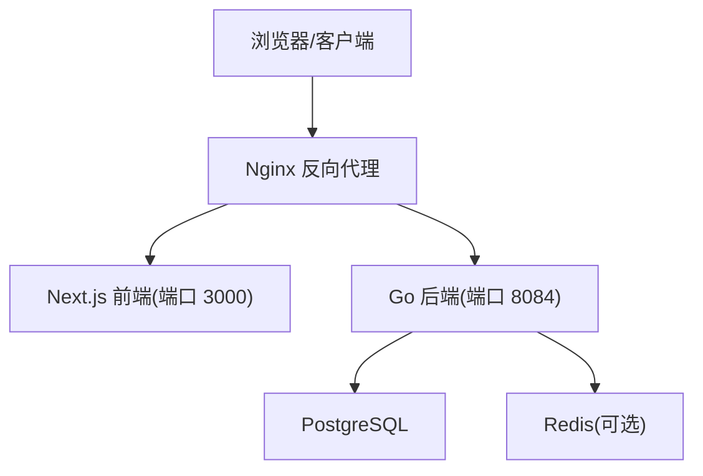
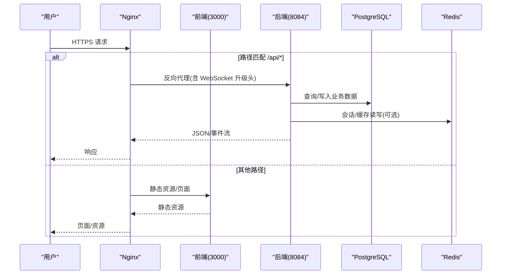
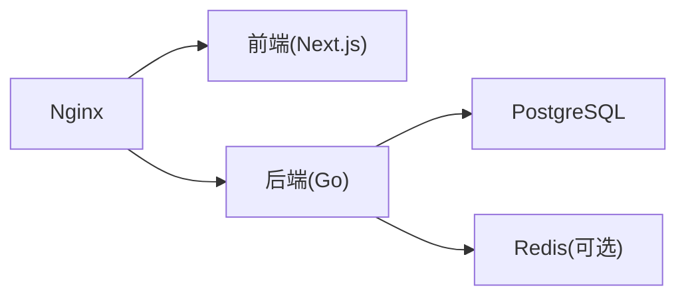
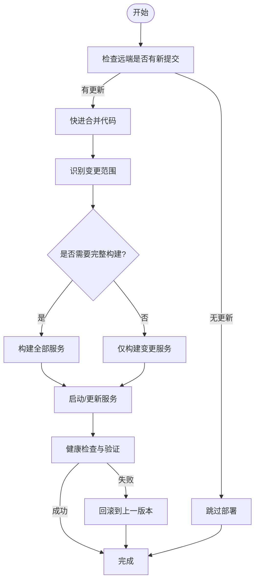

# 生产环境部署

<cite>
**本文引用的文件**
- [nginx.goodhr5.example.conf](file://goodhr5/nginx.goodhr5.example.conf)
- [docker-compose.server.yml](file://goodhr5/docker-compose.server.yml)
- [auto_deploy.sh](file://goodhr5/auto_deploy.sh)
- [README.md](file://goodhr5/README.md)
- [main.go](file://goodhr5/cloud/backend/cmd/server/main.go)
- [config.go](file://goodhr5/cloud/backend/internal/httpapi/config.go)
- [runtime_config.go](file://goodhr5/cloud/backend/internal/httpapi/runtime_config.go)
- [Dockerfile（后端）](file://goodhr5/cloud/backend/Dockerfile)
- [Dockerfile（前端）](file://goodhr5/cloud/frontend-next/Dockerfile)
- [package.json（前端）](file://goodhr5/cloud/frontend-next/package.json)
</cite>

## 目录
1. [简介](#简介)
2. [项目结构](#项目结构)
3. [核心组件](#核心组件)
4. [架构总览](#架构总览)
5. [详细组件分析](#详细组件分析)
6. [依赖关系分析](#依赖关系分析)
7. [性能考虑](#性能考虑)
8. [故障排查指南](#故障排查指南)
9. [结论](#结论)
10. [附录](#附录)

## 简介
本指南面向运维与平台工程团队，提供 HRPlus 在生产环境的完整部署与维护手册。内容覆盖 Nginx 反向代理、SSL 证书安装与域名绑定、环境变量与数据库连接配置、第三方服务集成、自动化部署脚本使用、版本更新与回滚策略、性能调优、安全加固、备份恢复、监控指标、日志轮转与告警规则等。文档中的配置项与流程均基于仓库内现有实现进行说明，确保可落地、可验证。

## 项目结构
HRPlus 采用“云端控制台 + 本地执行器”的架构：
- 云端后端：Go 实现的 HTTP API，负责认证、配置、岗位运行元信息、机器绑定与版本管理等。
- 云端前端：Next.js 构建的前端应用，通过 API 与后端交互。
- 本地 Agent：运行在用户机器的程序，负责浏览器操作、截图、OCR 与本地数据管理（不在本次生产部署范围内）。

图示来源
- [nginx.goodhr5.example.conf:1-38](file://goodhr5/nginx.goodhr5.example.conf#L1-L38)
- [docker-compose.server.yml:1-12](file://goodhr5/docker-compose.server.yml#L1-L12)
- [Dockerfile（后端）:1-8](file://goodhr5/cloud/backend/Dockerfile#L1-L8)
- [Dockerfile（前端）:1-23](file://goodhr5/cloud/frontend-next/Dockerfile#L1-L23)

章节来源
- [README.md:1-22](file://goodhr5/README.md#L1-L22)

## 核心组件
- 后端服务入口：监听地址由环境变量控制，默认 :8084；日志输出到文件并同步至标准输出。
- 配置加载：从环境变量读取 PostgreSQL DSN、Redis 地址/密码/库号、SMTP 发信参数、超级管理员列表等。
- 存储层：根据是否配置 PostgreSQL/Redis 自动选择持久化或内存实现；未配置时降级为内存模式。
- 前端服务：Next.js 生产镜像暴露 3000 端口，静态资源与 standalone 产物由镜像提供。

章节来源
- [main.go:14-30](file://goodhr5/cloud/backend/cmd/server/main.go#L14-L30)
- [config.go:16-45](file://goodhr5/cloud/backend/internal/httpapi/config.go#L16-L45)
- [config.go:47-87](file://goodhr5/cloud/backend/internal/httpapi/config.go#L47-L87)
- [Dockerfile（前端）:14-23](file://goodhr5/cloud/frontend-next/Dockerfile#L14-L23)

## 架构总览
生产环境推荐拓扑：
- Nginx 作为统一入口，对外暴露 HTTPS 域名，将 /api 请求转发到后端，其余静态资源与页面请求转发到前端。
- 后端直连 PostgreSQL 与 Redis（可通过 host.docker.internal 或宿主机网络访问）。
- 前端容器以独立服务运行，生产镜像仅包含构建产物，减少体积与攻击面。

图示来源
- [nginx.goodhr5.example.conf:3-19](file://goodhr5/nginx.goodhr5.example.conf#L3-L19)
- [nginx.goodhr5.example.conf:21-37](file://goodhr5/nginx.goodhr5.example.conf#L21-L37)
- [config.go:47-87](file://goodhr5/cloud/backend/internal/httpapi/config.go#L47-L87)

## 详细组件分析

### Nginx 反向代理与 SSL/域名绑定
- 路由规则
  - /api/* 转发到后端 8084，启用 WebSocket 升级所需头部，关闭缓冲与缓存，设置合理的读写超时。
  - 根路径 / 转发到前端 3000，传递真实 IP、端口、协议等上下文。
- SSL 证书安装
  - 在 Nginx 站点块中引入证书与私钥，强制 HTTPS，并开启 HSTS、TLS 版本限制等安全选项。
- 域名绑定
  - server_name 指向你的域名，配合 DNS 解析与证书域名一致。
- 建议
  - 对静态资源启用 Gzip/Brotli 压缩与缓存策略。
  - 对 /api 路径保持低延迟与长连接友好。

章节来源
- [nginx.goodhr5.example.conf:3-19](file://goodhr5/nginx.goodhr5.example.conf#L3-L19)
- [nginx.goodhr5.example.conf:21-37](file://goodhr5/nginx.goodhr5.example.conf#L21-L37)

### 环境变量与数据库连接配置
- 后端关键环境变量
  - GOODHR_PG_DSN：PostgreSQL 连接字符串（DSN），为空则不启用持久化存储。
  - GOODHR_REDIS_ADDR/GOODHR_REDIS_PASSWORD/GOODHR_REDIS_DB：Redis 地址、密码与库号，用于会话与缓存。
  - GOODHR_SMTP_HOST/PORT/USERNAME/PASSWORD/FROM：邮件发送配置，未配置时走开发模式。
  - GOODHR_SUPER_ADMINS：超级管理员邮箱列表（逗号分隔）。
  - GOODHR_UNIVERSAL_LOGIN_CODE_OFFSET_MINUTES：登录验证码偏移分钟数。
  - GOODHR_CLOUD_ADDR：后端监听地址，默认 :8084。
  - GOODHR_CLOUD_LOG_FILE：日志文件路径，默认 logs/backend.log。
- 数据库迁移
  - 启动时若检测到 PostgreSQL 连接成功，会自动执行迁移脚本，确保表结构最新。
- 存储降级
  - 未配置 PostgreSQL/Redis 时，系统自动降级为内存实现，便于开发与测试。

章节来源
- [config.go:16-45](file://goodhr5/cloud/backend/internal/httpapi/config.go#L16-L45)
- [config.go:47-87](file://goodhr5/cloud/backend/internal/httpapi/config.go#L47-L87)
- [main.go:14-30](file://goodhr5/cloud/backend/cmd/server/main.go#L14-L30)

### 第三方服务集成
- 邮件服务（SMTP）
  - 配置 SMTP 主机、端口、用户名、密码与发件人后，系统将使用真实 SMTP 发送验证码与通知。
- 支付服务（微信支付）
  - 代码中存在支付相关模块与存储接口，具体接入需结合业务密钥与回调配置（不在本仓库直接暴露密钥）。
- AI 钱包与系统配置
  - 运行时配置通过系统配置接口下发给本地程序，支持动态调整引导与组件配置。

章节来源
- [config.go:89-101](file://goodhr5/cloud/backend/internal/httpapi/config.go#L89-L101)
- [runtime_config.go:20-38](file://goodhr5/cloud/backend/internal/httpapi/runtime_config.go#L20-L38)

### 自动化部署脚本与版本更新
- 脚本能力
  - 检测目标分支是否有更新，避免重复部署。
  - 按变更范围智能决定仅构建/重启后端或前端，或执行完整构建与部署。
  - 自动选择 docker compose 或 docker-compose 命令。
  - 支持清理过期镜像与构建缓存。
- 使用方法
  - 在服务器项目目录下执行脚本，可通过环境变量指定分支、远程仓库、Compose 文件名与是否清理缓存。
  - 首次部署或容器缺失时，脚本会执行完整构建与 up。
- 版本更新流程
  - 推送代码到受保护分支 -> 触发定时任务或手动执行脚本 -> 脚本比对提交 -> 增量构建/重启或全量重建 -> 记录部署日志。
- 回滚策略
  - 基于 Git 快进合并机制，回滚即切回到上一个稳定提交并再次执行脚本。
  - 如需快速回滚服务，可使用 Compose 命令回退到上一镜像版本并重启。

章节来源
- [auto_deploy.sh:1-173](file://goodhr5/auto_deploy.sh#L1-L173)

### 容器化与运行方式
- 后端
  - 基于 golang:1.24-alpine，下载依赖并运行 cmd/server。
  - 生产建议使用宿主网络模式以便访问本机数据库与缓存。
- 前端
  - 基于 node:22-alpine，构建 standalone 产物并以生产模式运行。
  - 暴露 3000 端口，供 Nginx 反代。

章节来源
- [Dockerfile（后端）:1-8](file://goodhr5/cloud/backend/Dockerfile#L1-L8)
- [Dockerfile（前端）:1-23](file://goodhr5/cloud/frontend-next/Dockerfile#L1-L23)
- [docker-compose.server.yml:1-12](file://goodhr5/docker-compose.server.yml#L1-L12)

## 依赖关系分析
- 后端依赖
  - PostgreSQL：主数据存储，支持自动迁移。
  - Redis：可选，用于会话与高频缓存。
  - SMTP：可选，用于验证码与通知邮件。
- 前端依赖
  - Next.js 运行时，生产镜像仅包含构建产物。
- Nginx 依赖
  - 上游后端与前端服务，需保证健康检查与超时合理。

图示来源
- [nginx.goodhr5.example.conf:3-19](file://goodhr5/nginx.goodhr5.example.conf#L3-L19)
- [config.go:47-87](file://goodhr5/cloud/backend/internal/httpapi/config.go#L47-L87)

## 性能考虑
- Nginx
  - 对 /api 路径关闭缓冲与缓存，降低 WebSocket 延迟。
  - 合理设置 proxy_read_timeout/proxy_send_timeout，避免长连接中断。
  - 静态资源启用 gzip/brotli 与浏览器缓存。
- 后端
  - 数据库连接池：最大连接数、空闲连接数与生命周期已内置配置。
  - Redis 缓存：启用后可显著降低热点读压力。
  - 日志：生产建议将日志输出到文件并按天轮转。
- 前端
  - 使用 standalone 构建产物，减少运行时依赖与启动时间。
  - 静态资源 CDN 加速与缓存策略优化。

章节来源
- [nginx.goodhr5.example.conf:3-19](file://goodhr5/nginx.goodhr5.example.conf#L3-L19)
- [config.go:47-75](file://goodhr5/cloud/backend/internal/httpapi/config.go#L47-L75)
- [Dockerfile（前端）:14-23](file://goodhr5/cloud/frontend-next/Dockerfile#L14-L23)

## 故障排查指南
- 无法连接数据库
  - 检查 GOODHR_PG_DSN 是否正确，网络可达性与账号权限。
  - 查看启动日志中迁移失败提示。
- 会话丢失或并发问题
  - 确认 Redis 地址、密码与库号配置正确，并检查连通性。
- 邮件发送失败
  - 校验 SMTP 主机、端口、用户名、密码与发件人配置。
- 部署卡住或重复执行
  - 检查部署锁目录是否存在，查看部署日志定位阶段。
- 前端无法访问
  - 确认 Nginx 转发到 3000 端口，且前端容器正常运行。

章节来源
- [config.go:47-87](file://goodhr5/cloud/backend/internal/httpapi/config.go#L47-L87)
- [auto_deploy.sh:16-42](file://goodhr5/auto_deploy.sh#L16-L42)
- [auto_deploy.sh:119-173](file://goodhr5/auto_deploy.sh#L119-L173)

## 结论
HRPlus 的生产部署以 Nginx 为统一入口，后端 Go 服务对接 PostgreSQL 与可选 Redis，前端 Next.js 提供静态资源与页面。通过环境变量驱动配置，支持自动迁移与存储降级；自动化脚本实现增量构建与智能重启，保障发布效率与稳定性。结合合理的性能与安全配置、完善的日志与监控体系，可满足企业级生产需求。

## 附录

### 环境变量清单（生产）
- 后端
  - GOODHR_PG_DSN：PostgreSQL 连接串
  - GOODHR_REDIS_ADDR/GOODHR_REDIS_PASSWORD/GOODHR_REDIS_DB：Redis 配置
  - GOODHR_SMTP_HOST/PORT/USERNAME/PASSWORD/FROM：邮件服务
  - GOODHR_SUPER_ADMINS：超级管理员邮箱列表
  - GOODHR_UNIVERSAL_LOGIN_CODE_OFFSET_MINUTES：登录验证码偏移分钟数
  - GOODHR_CLOUD_ADDR：监听地址
  - GOODHR_CLOUD_LOG_FILE：日志文件路径
- 前端
  - NEXT_PUBLIC_SITE_URL：站点 URL（用于前端资源与链接）
  - CLOUD_API_BASE/NEXT_PUBLIC_CLOUD_API_BASE：后端 API 基址（开发/测试常用）

章节来源
- [config.go:16-45](file://goodhr5/cloud/backend/internal/httpapi/config.go#L16-L45)
- [docker-compose.yml:10-27](file://goodhr5/docker-compose.yml#L10-L27)
- [package.json（前端）:5-9](file://goodhr5/cloud/frontend-next/package.json#L5-L9)

### 数据库与迁移
- 启动时自动执行迁移，确保表结构一致。
- 建议在 CI/CD 中增加迁移预检步骤，失败则阻断发布。

章节来源
- [config.go:47-75](file://goodhr5/cloud/backend/internal/httpapi/config.go#L47-L75)

### 监控指标与告警
- 建议采集
  - 后端：HTTP 请求速率、错误率、P95/P99 延迟、GC 指标、数据库连接池使用率。
  - 前端：页面加载耗时、首屏渲染时间、错误率。
  - Nginx：连接数、5xx 比例、带宽利用率。
- 告警规则
  - 错误率超过阈值持续 N 分钟。
  - 数据库连接池耗尽或慢查询增多。
  - Redis 命中率下降或连接异常。
  - 磁盘空间不足（日志与备份目录）。

### 日志轮转与保留
- 后端日志
  - 默认输出到 logs/backend.log，建议配置 logrotate 按天切割并保留一定天数。
- Nginx 日志
  - access.log/error.log 同样建议按天切割与保留策略。

章节来源
- [main.go:40-52](file://goodhr5/cloud/backend/cmd/server/main.go#L40-L52)

### 备份与恢复
- 数据库
  - 定期逻辑备份（pg_dump）与物理备份（WAL 归档），异地多副本。
  - 恢复前校验备份完整性，并在维护窗口执行。
- 配置与密钥
  - 环境变量、Nginx 证书与配置文件纳入版本管理与加密存储。
- 应用数据
  - 如存在本地附件或临时文件，需纳入备份策略。

### 安全加固
- 传输安全
  - 全站 HTTPS，启用 HSTS，禁用不安全 TLS 版本与弱加密套件。
- 访问控制
  - 限制管理接口访问来源 IP，启用鉴权与最小权限原则。
- 输入校验与防护
  - 启用 WAF 规则，防 SQL 注入、XSS、CSRF。
- 依赖安全
  - 定期扫描镜像与依赖漏洞，及时更新。

### 部署与回滚流程图

图示来源
- [auto_deploy.sh:44-173](file://goodhr5/auto_deploy.sh#L44-L173)