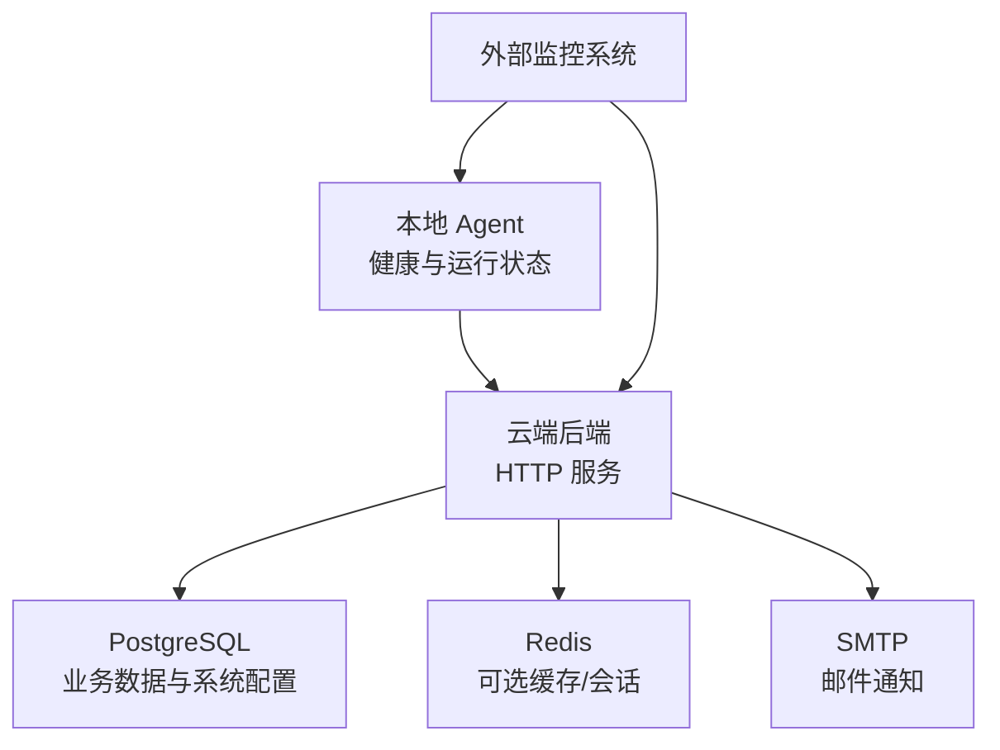
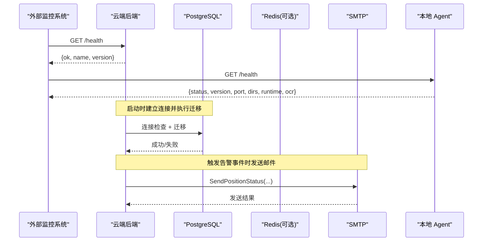
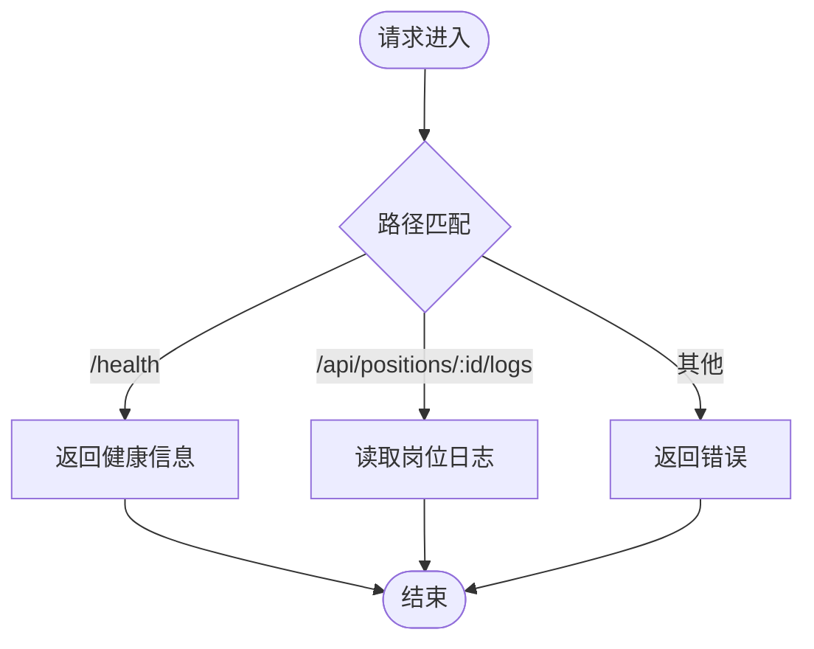
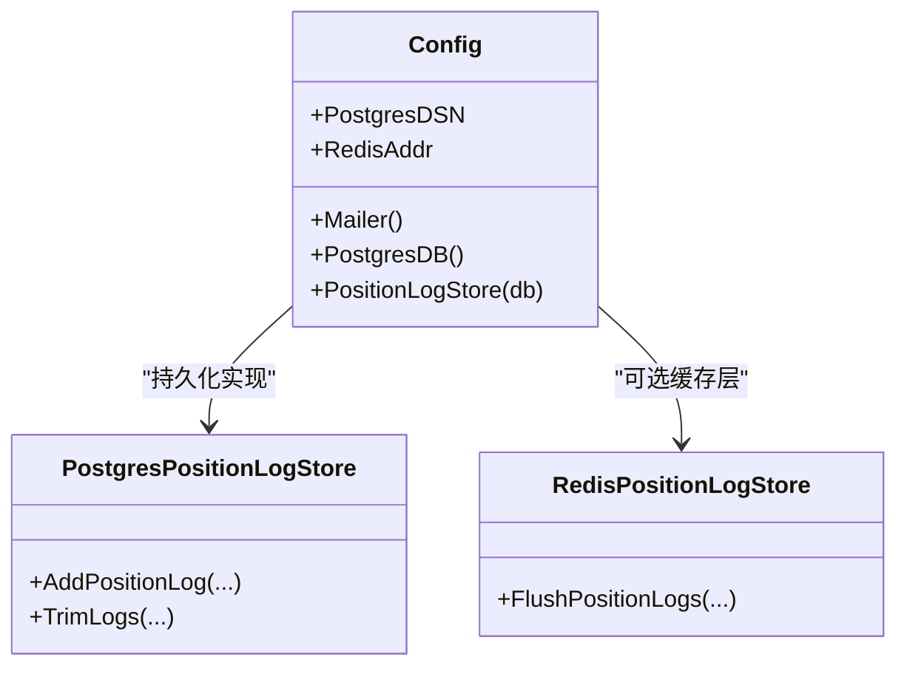
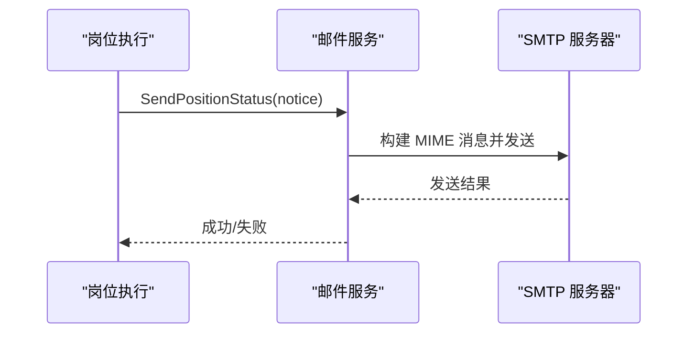
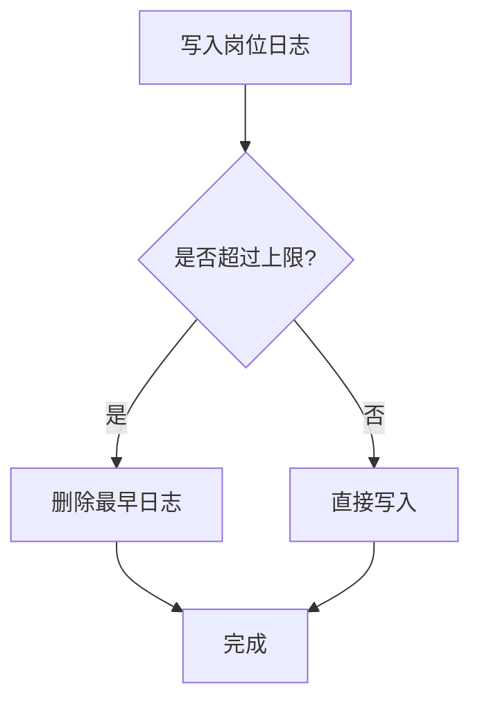
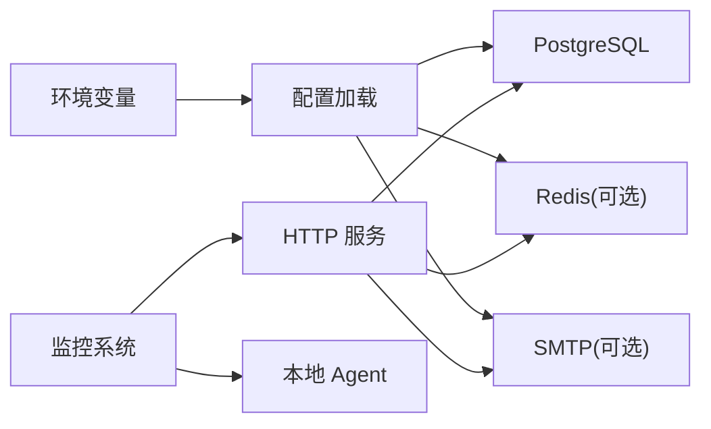

# 监控告警与备份恢复

<cite>
**本文引用的文件**
- [server.go](file://goodhr5/cloud/backend/internal/httpapi/server.go)
- [config.go](file://goodhr5/cloud/backend/internal/httpapi/config.go)
- [main.go](file://goodhr5/cloud/backend/cmd/server/main.go)
- [mailer.go](file://goodhr5/cloud/backend/internal/httpapi/mailer.go)
- [position_log.go](file://goodhr5/cloud/backend/internal/httpapi/position_log.go)
- [position_log_store_pg.go](file://goodhr5/cloud/backend/internal/httpapi/position_log_store_pg.go)
- [system_config_store.go](file://goodhr5/cloud/backend/internal/httpapi/system_config_store.go)
- [auto_migrate.go](file://goodhr5/cloud/backend/internal/httpapi/auto_migrate.go)
- [docker-compose.yml](file://goodhr5/docker-compose.yml)
- [docker-compose.local.windows.yml](file://goodhr5/docker-compose.local.windows.yml)
- [README.md](file://goodhr5/README.md)
- [server.go（本地代理）](file://goodhr5/local-agent-go/internal/app/server.go)
</cite>

## 目录
1. [简介](#简介)
2. [项目结构](#项目结构)
3. [核心组件](#核心组件)
4. [架构总览](#架构总览)
5. [详细组件分析](#详细组件分析)
6. [依赖关系分析](#依赖关系分析)
7. [性能考虑](#性能考虑)
8. [故障排查指南](#故障排查指南)
9. [结论](#结论)
10. [附录](#附录)

## 简介
本文件面向 GoodHR 5 的运维与平台工程团队，聚焦“监控、告警、备份与恢复”三大主题。内容覆盖：
- 应用性能监控：云端 API 健康检查、本地 Agent 健康检查、岗位运行日志与统计。
- 数据库监控：PostgreSQL 连接与迁移、Redis 缓存层可用性。
- 服务器资源监控：进程存活、端口监听、磁盘与日志路径。
- 告警规则与通知渠道：基于邮件的通知能力与可扩展接入点。
- 数据备份策略：数据库、文件、配置项的自动化方案建议。
- 灾难恢复流程：一致性保证与备份验证方法。
- 日志轮转与分析：后端日志输出、本地 Agent 日志与健康信息。

## 项目结构
GoodHR 5 由云端后端、前端控制台、本地执行器组成。监控与告警主要分布在云端后端的 HTTP 服务、配置加载、邮件通知、日志存储；本地 Agent 提供健康检查与运行时状态接口，便于外部监控系统采集。

图表来源
- [server.go:124-212](file://goodhr5/cloud/backend/internal/httpapi/server.go#L124-L212)
- [config.go:47-87](file://goodhr5/cloud/backend/internal/httpapi/config.go#L47-L87)
- [server.go（本地代理）:170-191](file://goodhr5/local-agent-go/internal/app/server.go#L170-L191)

章节来源
- [README.md:1-22](file://goodhr5/README.md#L1-L22)
- [docker-compose.yml:1-32](file://goodhr5/docker-compose.yml#L1-L32)
- [docker-compose.local.windows.yml:46-57](file://goodhr5/docker-compose.local.windows.yml#L46-L57)

## 核心组件
- 云端健康检查：提供 /health 端点用于存活探测与版本信息展示。
- 配置加载：从环境变量加载 PostgreSQL、Redis、SMTP 等关键依赖。
- 邮件通知：内置 SMTP 发信能力，支持登录验证码、会员变动、AI 余额变动、岗位运行状态等通知。
- 岗位日志：岗位运行日志写入持久化存储，支持按岗位查询、清理与限流。
- 系统配置：通过 system_configs 表管理系统级配置，包括平台配置、应用配置等。
- 数据库迁移：启动时自动执行 SQL 迁移并记录已执行清单。
- 本地 Agent 健康：暴露 /health 返回版本、端口、数据目录、日志目录、运行组件状态等。

章节来源
- [server.go:124-212](file://goodhr5/cloud/backend/internal/httpapi/server.go#L124-L212)
- [config.go:30-87](file://goodhr5/cloud/backend/internal/httpapi/config.go#L30-L87)
- [mailer.go:19-25](file://goodhr5/cloud/backend/internal/httpapi/mailer.go#L19-L25)
- [position_log.go:13-45](file://goodhr5/cloud/backend/internal/httpapi/position_log.go#L13-L45)
- [system_config_store.go:11-27](file://goodhr5/cloud/backend/internal/httpapi/system_config_store.go#L11-L27)
- [auto_migrate.go:13-55](file://goodhr5/cloud/backend/internal/httpapi/auto_migrate.go#L13-L55)
- [server.go（本地代理）:170-191](file://goodhr5/local-agent-go/internal/app/server.go#L170-L191)

## 架构总览
下图展示监控与告警在系统中的位置与交互：外部监控系统通过健康检查与指标接口采集云端与本地状态；告警通过邮件通知触达运维或用户；日志与统计用于问题定位与容量规划。

图表来源
- [server.go:247-259](file://goodhr5/cloud/backend/internal/httpapi/server.go#L247-L259)
- [config.go:47-75](file://goodhr5/cloud/backend/internal/httpapi/config.go#L47-L75)
- [mailer.go:204-228](file://goodhr5/cloud/backend/internal/httpapi/mailer.go#L204-L228)
- [server.go（本地代理）:170-191](file://goodhr5/local-agent-go/internal/app/server.go#L170-L191)

## 详细组件分析

### 应用性能监控
- 云端健康检查：/health 返回服务名称与版本，适合部署探针与负载均衡健康检查。
- 本地 Agent 健康检查：/health 返回版本、端口、数据/日志目录、运行组件状态、OCR 状态，便于评估本地环境就绪情况。
- 岗位运行日志：岗位运行过程中产生的日志可查询与清理，支持限制条数与时间范围过滤，便于监控任务执行质量。
- 每日统计：系统按日统计存储可用于趋势分析与容量规划。

图表来源
- [server.go:124-212](file://goodhr5/cloud/backend/internal/httpapi/server.go#L124-L212)
- [position_log.go:205-240](file://goodhr5/cloud/backend/internal/httpapi/position_log.go#L205-L240)

章节来源
- [server.go:247-259](file://goodhr5/cloud/backend/internal/httpapi/server.go#L247-L259)
- [server.go（本地代理）:170-191](file://goodhr5/local-agent-go/internal/app/server.go#L170-L191)
- [position_log.go:205-240](file://goodhr5/cloud/backend/internal/httpapi/position_log.go#L205-L240)

### 数据库监控
- 连接池与生命周期：PostgreSQL 连接池大小、空闲连接数、最大生命周期可配置，避免连接泄漏与资源耗尽。
- 迁移机制：启动时自动扫描 migrations 目录，执行未应用的迁移并记录到 schema_migrations，防止重复执行与破坏现有数据。
- Redis 缓存：当配置 Redis 地址时，岗位日志写入会先经 Redis 缓存层再落库，提升高并发写入性能。

图表来源
- [config.go:47-87](file://goodhr5/cloud/backend/internal/httpapi/config.go#L47-L87)
- [config.go:256-268](file://goodhr5/cloud/backend/internal/httpapi/config.go#L256-L268)
- [position_log_store_pg.go:199-235](file://goodhr5/cloud/backend/internal/httpapi/position_log_store_pg.go#L199-L235)
- [auto_migrate.go:13-55](file://goodhr5/cloud/backend/internal/httpapi/auto_migrate.go#L13-L55)

章节来源
- [config.go:47-87](file://goodhr5/cloud/backend/internal/httpapi/config.go#L47-L87)
- [auto_migrate.go:13-55](file://goodhr5/cloud/backend/internal/httpapi/auto_migrate.go#L13-L55)
- [position_log_store_pg.go:199-235](file://goodhr5/cloud/backend/internal/httpapi/position_log_store_pg.go#L199-L235)

### 服务器资源监控
- 进程与端口：后端默认监听 :8084，可通过环境变量调整；Docker Compose 映射端口便于外部访问。
- 日志路径：后端日志输出至文件与标准输出，路径可通过环境变量配置；本地 Agent 健康接口返回日志目录与具体日志路径。
- 磁盘与目录：本地 Agent 健康返回 dataDir、logsDir、profilesDir、downloadsDir、screenshotsDir、dbPath，便于监控磁盘使用率与空间预警。

章节来源
- [main.go:14-30](file://goodhr5/cloud/backend/cmd/server/main.go#L14-L30)
- [main.go:40-52](file://goodhr5/cloud/backend/cmd/server/main.go#L40-L52)
- [docker-compose.yml:1-32](file://goodhr5/docker-compose.yml#L1-L32)
- [server.go（本地代理）:170-191](file://goodhr5/local-agent-go/internal/app/server.go#L170-L191)

### 告警规则与通知渠道
- 通知渠道：通过 SMTP 发送邮件，支持 TLS 与非 TLS；开发模式使用 DevMailer 仅记录日志。
- 告警类型：登录验证码、会员变动提醒、AI 余额变动提醒、岗位运行完成或失败提醒、团队邀请等。
- 可扩展性：Mailer 接口抽象了不同通知实现，便于后续接入企业微信、钉钉、短信等渠道。

图表来源
- [mailer.go:204-228](file://goodhr5/cloud/backend/internal/httpapi/mailer.go#L204-L228)
- [mailer.go:278-312](file://goodhr5/cloud/backend/internal/httpapi/mailer.go#L278-L312)
- [mailer.go:410-449](file://goodhr5/cloud/backend/internal/httpapi/mailer.go#L410-L449)

章节来源
- [mailer.go:19-25](file://goodhr5/cloud/backend/internal/httpapi/mailer.go#L19-L25)
- [mailer.go:204-228](file://goodhr5/cloud/backend/internal/httpapi/mailer.go#L204-L228)
- [mailer.go:278-312](file://goodhr5/cloud/backend/internal/httpapi/mailer.go#L278-L312)
- [mailer.go:410-449](file://goodhr5/cloud/backend/internal/httpapi/mailer.go#L410-L449)

### 日志轮转与审计
- 后端日志：启动时将日志同时输出到文件与标准输出，便于容器化收集；日志路径可通过环境变量配置。
- 岗位日志：岗位运行日志持久化存储，支持按岗位清理与数量上限控制，避免无限增长。
- 审计日志：系统配置变更通过管理员接口保存，可在 system_configs 中追溯键值与更新时间。

图表来源
- [position_log_store_pg.go:199-235](file://goodhr5/cloud/backend/internal/httpapi/position_log_store_pg.go#L199-L235)
- [main.go:40-52](file://goodhr5/cloud/backend/cmd/server/main.go#L40-L52)

章节来源
- [position_log_store_pg.go:199-235](file://goodhr5/cloud/backend/internal/httpapi/position_log_store_pg.go#L199-L235)
- [main.go:40-52](file://goodhr5/cloud/backend/cmd/server/main.go#L40-L52)
- [system_config_store.go:11-27](file://goodhr5/cloud/backend/internal/httpapi/system_config_store.go#L11-L27)

### 数据备份策略
- 数据库备份：
  - 定期对 PostgreSQL 进行逻辑或物理备份，确保包含 system_configs、schema_migrations 及业务表。
  - 备份前可触发一次迁移标记，确保迁移记录一致。
- 文件备份：
  - 备份 uploads 目录（上传文件）、模板目录（邮件模板）、本地 Agent 的数据与日志目录。
  - Docker Compose 中的命名卷用于开发缓存，生产应另行挂载持久卷并纳入备份。
- 配置备份：
  - 通过管理员接口导出 system_configs 全量 JSON，作为配置快照。
  - 平台配置与应用配置均以 JSON 形式存储，便于版本化管理与回滚。

章节来源
- [server.go:445-472](file://goodhr5/cloud/backend/internal/httpapi/server.go#L445-L472)
- [docker-compose.yml:1-32](file://goodhr5/docker-compose.yml#L1-L32)
- [docker-compose.local.windows.yml:46-57](file://goodhr5/docker-compose.local.windows.yml#L46-L57)

### 灾难恢复流程
- 恢复步骤：
  1) 恢复 PostgreSQL 数据与迁移记录。
  2) 启动后端服务，自动执行迁移并校验连接。
  3) 恢复文件与配置快照（uploads、模板、system_configs）。
  4) 启动本地 Agent，确认健康检查与运行组件状态。
- 一致性保证：
  - 迁移记录表确保迁移幂等与顺序执行。
  - 岗位日志上限清理避免历史数据膨胀影响恢复体积。
- 备份验证：
  - 通过 /health 与本地 /health 验证服务可用。
  - 随机抽取 system_configs 条目进行解析校验。
  - 抽样回放岗位日志，确认可读性与完整性。

章节来源
- [auto_migrate.go:13-55](file://goodhr5/cloud/backend/internal/httpapi/auto_migrate.go#L13-L55)
- [server.go:247-259](file://goodhr5/cloud/backend/internal/httpapi/server.go#L247-L259)
- [server.go（本地代理）:170-191](file://goodhr5/local-agent-go/internal/app/server.go#L170-L191)

## 依赖关系分析
- 云端后端依赖 PostgreSQL、Redis（可选）、SMTP（可选），并通过环境变量注入。
- 岗位日志在启用 Redis 时采用缓存层，减少数据库压力。
- 本地 Agent 通过健康接口为外部监控提供就绪信号。

图表来源
- [config.go:30-87](file://goodhr5/cloud/backend/internal/httpapi/config.go#L30-L87)
- [config.go:256-268](file://goodhr5/cloud/backend/internal/httpapi/config.go#L256-L268)
- [server.go:124-212](file://goodhr5/cloud/backend/internal/httpapi/server.go#L124-L212)
- [server.go（本地代理）:170-191](file://goodhr5/local-agent-go/internal/app/server.go#L170-L191)

章节来源
- [config.go:30-87](file://goodhr5/cloud/backend/internal/httpapi/config.go#L30-L87)
- [config.go:256-268](file://goodhr5/cloud/backend/internal/httpapi/config.go#L256-L268)
- [server.go:124-212](file://goodhr5/cloud/backend/internal/httpapi/server.go#L124-L212)

## 性能考虑
- 连接池参数：合理设置最大连接数、空闲连接数与生命周期，避免数据库拥塞。
- 日志写入：启用 Redis 缓存层可降低高频写入对数据库的压力。
- 日志清理：岗位日志按上限清理，避免磁盘与查询性能退化。
- 健康检查：轻量级 /health 接口适合高频探测，避免引入重逻辑。

章节来源
- [config.go:47-75](file://goodhr5/cloud/backend/internal/httpapi/config.go#L47-L75)
- [config.go:256-268](file://goodhr5/cloud/backend/internal/httpapi/config.go#L256-L268)
- [position_log_store_pg.go:199-235](file://goodhr5/cloud/backend/internal/httpapi/position_log_store_pg.go#L199-L235)
- [server.go:247-259](file://goodhr5/cloud/backend/internal/httpapi/server.go#L247-L259)

## 故障排查指南
- 服务不可用：
  - 检查 /health 响应与端口监听状态。
  - 查看后端日志文件路径与内容，确认启动与监听正常。
- 数据库异常：
  - 检查 PostgreSQL 连接字符串与权限。
  - 查看迁移执行日志，确认 schema_migrations 记录。
- 邮件发送失败：
  - 核对 SMTP 主机、端口、用户名、密码与发件人。
  - 区分开发模式与真实发信模式，确认模板渲染与 MIME 组装。
- 本地 Agent 异常：
  - 调用 /health 获取运行组件状态与 OCR 状态。
  - 检查数据与日志目录是否存在且可写。

章节来源
- [server.go:247-259](file://goodhr5/cloud/backend/internal/httpapi/server.go#L247-L259)
- [main.go:40-52](file://goodhr5/cloud/backend/cmd/server/main.go#L40-L52)
- [auto_migrate.go:13-55](file://goodhr5/cloud/backend/internal/httpapi/auto_migrate.go#L13-L55)
- [mailer.go:278-312](file://goodhr5/cloud/backend/internal/httpapi/mailer.go#L278-L312)
- [server.go（本地代理）:170-191](file://goodhr5/local-agent-go/internal/app/server.go#L170-L191)

## 结论
GoodHR 5 提供了基础而实用的监控与告警能力：云端与本地健康检查、数据库迁移与连接管理、邮件通知通道、岗位日志与系统配置管理。结合外部监控系统与自动化备份脚本，可形成完整的可观测性与容灾体系。建议在生产环境中完善日志轮转、指标采集、备份验证与演练流程，持续提升系统稳定性与可恢复性。

## 附录
- 环境变量参考：
  - GOODHR_PG_DSN：PostgreSQL 连接串
  - GOODHR_REDIS_ADDR/GOODHR_REDIS_PASSWORD/GOODHR_REDIS_DB：Redis 配置
  - GOODHR_SMTP_HOST/PORT/USERNAME/PASSWORD/FROM：SMTP 发信配置
  - GOODHR_CLOUD_ADDR：后端监听地址
  - GOODHR_CLOUD_LOG_FILE：后端日志文件路径
- 关键接口：
  - /health：云端健康检查
  - /api/admin/system/configs/*：系统配置管理
  - /api/positions/:id/logs：岗位日志查询与清理
  - 本地 /health：本地 Agent 健康检查

章节来源
- [config.go:30-45](file://goodhr5/cloud/backend/internal/httpapi/config.go#L30-L45)
- [server.go:124-212](file://goodhr5/cloud/backend/internal/httpapi/server.go#L124-L212)
- [server.go:445-472](file://goodhr5/cloud/backend/internal/httpapi/server.go#L445-L472)
- [position_log.go:205-240](file://goodhr5/cloud/backend/internal/httpapi/position_log.go#L205-L240)
- [server.go（本地代理）:170-191](file://goodhr5/local-agent-go/internal/app/server.go#L170-L191)