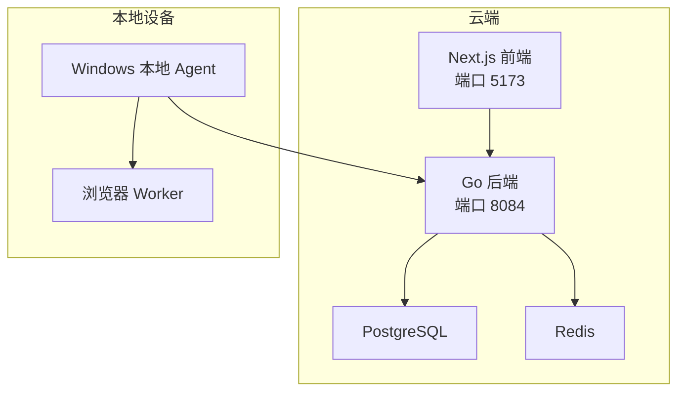
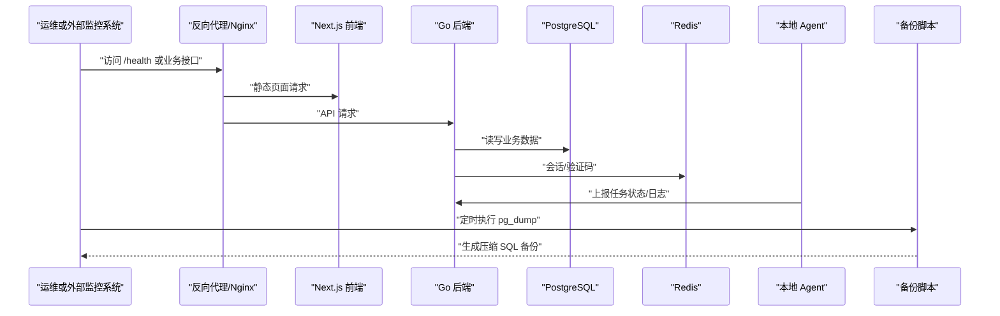
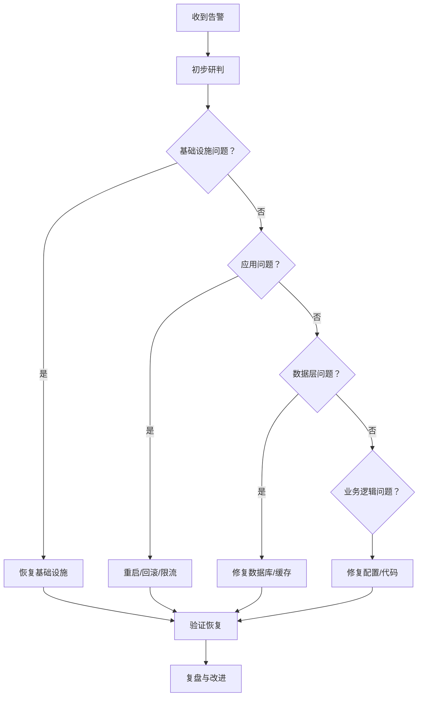
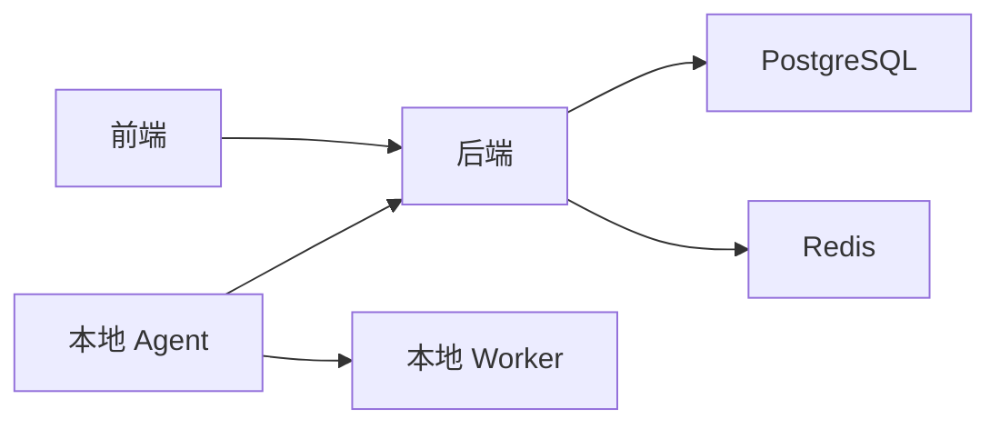

# 监控告警与备份恢复

<cite>
**本文引用的文件**   
- [README.md](file://README.md)
- [goodhr5/cloud/backend/README.md](file://goodhr5/cloud/backend/README.md)
- [docker-compose.prod.yml](file://goodhr5/docker-compose.prod.yml)
- [docker-compose.server.yml](file://goodhr5/docker-compose.server.yml)
- [scripts/backup-db.sh](file://goodhr5/scripts/backup-db.sh)
- [生产部署手册-Ubuntu.md](file://goodhr5/docs/生产部署手册-Ubuntu.md)
- [cloud/backend/internal/httpapi/server.go](file://goodhr5/cloud/backend/internal/httpapi/server.go)
- [cloud/backend/internal/httpapi/position_log.go](file://goodhr5/cloud/backend/internal/httpapi/position_log.go)
- [local-agent-go/internal/localdb/positions.go](file://goodhr5/local-agent-go/internal/localdb/positions.go)
- [local-agent-go/internal/browser/worker_test.go](file://goodhr5/local-agent-go/internal/browser/worker_test.go)
- [local-agent-go/worker-node/src/index.js](file://goodhr5/local-agent-go/worker-node/src/index.js)
- [cloud/frontend-next/app/admin/positions/page.tsx](file://goodhr5/cloud/frontend-next/app/admin/positions/page.tsx)
</cite>

## 目录
1. [引言](#引言)
2. [项目结构](#项目结构)
3. [核心组件](#核心组件)
4. [架构总览](#架构总览)
5. [详细组件分析](#详细组件分析)
6. [依赖关系分析](#依赖关系分析)
7. [性能与容量规划](#性能与容量规划)
8. [故障排查指南](#故障排查指南)
9. [结论](#结论)
10. [附录：运维检查清单](#附录运维检查清单)

## 引言
本文件面向 HRPlus 的运维与平台团队，聚焦“监控、告警、备份与恢复”三大主题。HRPlus 由云端后端（Go）、前端（Next.js）、PostgreSQL、Redis 以及 Windows 本地 Agent 组成；当前仓库未内置 Prometheus/Grafana 等第三方监控系统，但已提供健康检查、容器健康探针、数据库备份脚本、岗位运行日志接口和本地诊断日志能力。本文在现有实现基础上，给出可落地的监控指标体系、告警规则建议、通知渠道配置、备份策略、灾难恢复流程、日志轮转与审计方案，并明确哪些能力已有代码支撑、哪些需要外部系统补充。

## 项目结构
HRPlus 的关键运维相关资产分布如下：
- 云端后端：Go HTTP API，暴露岗位运行状态、日志等接口，默认监听 `:8084`。
- 前端管理后台：Next.js，用于查看任务、岗位、统计和日志。
- 数据层：PostgreSQL 持久化业务数据，Redis 缓存会话与验证码。
- 本地 Agent：Windows 程序，负责浏览器自动化、候选人处理、截图与诊断日志。
- 部署编排：Docker Compose 定义生产服务、网络、卷与健康检查。
- 备份脚本：通过 `pg_dump` 对 PostgreSQL 进行压缩 SQL 备份，支持保留天数清理。
- 文档：包含 Ubuntu 生产部署说明及恢复示例。

**图表来源**
- [docker-compose.prod.yml:12-98](file://goodhr5/docker-compose.prod.yml#L12-L98)
- [docker-compose.server.yml:1-12](file://goodhr5/docker-compose.server.yml#L1-L12)
- [goodhr5/cloud/backend/README.md:1-20](file://goodhr5/cloud/backend/README.md#L1-L20)

**章节来源**
- [README.md:50-83](file://README.md#L50-L83)
- [docker-compose.prod.yml:1-98](file://goodhr5/docker-compose.prod.yml#L1-L98)
- [docker-compose.server.yml:1-12](file://goodhr5/docker-compose.server.yml#L1-L12)

## 核心组件
本节梳理与监控、告警、备份、恢复直接相关的核心能力。

- 云端后端
  - 暴露岗位运行状态与日志接口，便于上层监控采集。
  - 默认监听 `:8084`，可通过环境变量调整地址。
  - 提供 `/health` 健康检查入口（见开发快速启动命令）。
- 数据层
  - PostgreSQL 使用命名卷持久化，具备健康检查探针。
  - Redis 开启 AOF，仅内网可达，具备健康检查探针。
- 本地 Agent
  - 本地 Worker 暴露 `/health` 端点，供本地进程检测。
  - 本地岗位运行日志写入 SQLite，并提供最近日志尾部读取能力。
  - Node Worker 输出结构化诊断日志，便于问题定位。
- 备份与恢复
  - 提供 `scripts/backup-db.sh`，基于 `pg_dump` 生成压缩 SQL，支持保留天数清理。
  - 生产部署文档给出 crontab 定时备份与恢复示例。

**章节来源**
- [goodhr5/cloud/backend/README.md:1-20](file://goodhr5/cloud/backend/README.md#L1-L20)
- [docker-compose.prod.yml:13-45](file://goodhr5/docker-compose.prod.yml#L13-L45)
- [local-agent-go/internal/browser/worker_test.go:62-83](file://goodhr5/local-agent-go/internal/browser/worker_test.go#L62-L83)
- [local-agent-go/internal/localdb/positions.go:240-283](file://goodhr5/local-agent-go/internal/localdb/positions.go#L240-L283)
- [scripts/backup-db.sh:1-36](file://goodhr5/scripts/backup-db.sh#L1-L36)
- [生产部署手册-Ubuntu.md:407-424](file://goodhr5/docs/生产部署手册-Ubuntu.md#L407-L424)

## 架构总览
从运维视角，HRPlus 的监控与备份恢复架构如下：

**图表来源**
- [docker-compose.prod.yml:47-89](file://goodhr5/docker-compose.prod.yml#L47-L89)
- [scripts/backup-db.sh:17-35](file://goodhr5/scripts/backup-db.sh#L17-L35)
- [goodhr5/cloud/backend/README.md:196-201](file://goodhr5/cloud/backend/README.md#L196-L201)

## 详细组件分析

### 应用性能监控
当前仓库未内置 Prometheus/Grafana，但可通过以下方式构建监控体系：

- 可用指标来源
  - 容器健康探针：PostgreSQL 与 Redis 均配置健康检查，可作为基础存活探测。
  - 后端健康检查：后端默认监听 `:8084`，并提供 `/health` 健康检查入口。
  - 本地 Worker 健康检查：本地 Worker 暴露 `/health`，返回 worker、pid 等诊断信息。
  - 业务接口：岗位运行状态、日志接口可用于间接评估任务吞吐与错误率。

- 推荐采集方式
  - 使用宿主机级监控工具（如 systemd health、自定义 curl 探针）定期调用 `/health`。
  - 使用 Docker 健康状态作为服务可用性信号。
  - 将 Go 后端接入标准指标库（如 prometheus/client_golang），暴露 `/metrics`，由外部 Prometheus 抓取。
  - 对 Nginx 接入 access/error log，结合外部日志系统进行吞吐、延迟、错误码分析。

- 关键指标建议
  - 应用可用性：`/health` 成功率、响应时间。
  - 任务健康：岗位运行状态接口成功率、失败率、平均耗时。
  - 资源使用：CPU、内存、磁盘、网络（由宿主或容器运行时提供）。
  - 队列与缓存：Redis 连接数、命中率、慢查询（需扩展 Redis 监控）。

**章节来源**
- [docker-compose.prod.yml:26-45](file://goodhr5/docker-compose.prod.yml#L26-L45)
- [goodhr5/cloud/backend/README.md:196-201](file://goodhr5/cloud/backend/README.md#L196-L201)
- [local-agent-go/internal/browser/worker_test.go:62-83](file://goodhr5/local-agent-go/internal/browser/worker_test.go#L62-L83)

### 数据库监控
- 现状
  - PostgreSQL 使用官方镜像，启用健康检查探针。
  - 业务数据通过迁移文件初始化，后端按 DSN 连接。
  - Redis 开启 AOF，仅内网可达，具备健康检查探针。

- 建议
  - 使用外部数据库监控（如 pg_stat_statements、Prometheus postgres_exporter）采集连接数、慢查询、锁等待、复制延迟等。
  - 对 Redis 使用 redis_exporter 采集内存、连接、命中率、持久化状态。
  - 将数据库健康状态纳入统一告警通道。

**章节来源**
- [docker-compose.prod.yml:13-45](file://goodhr5/docker-compose.prod.yml#L13-L45)
- [goodhr5/cloud/backend/README.md:15-48](file://goodhr5/cloud/backend/README.md#L15-L48)

### 服务器资源监控
- 现状
  - 生产部署使用 Docker Compose，服务以容器形式运行。
  - 后端绑定 `127.0.0.1:8084`，前端绑定 `127.0.0.1:5173`，由宿主机 Nginx 反代。

- 建议
  - 使用宿主机监控（如 node_exporter + Prometheus + Grafana）采集 CPU、内存、磁盘 I/O、网络、文件系统使用率。
  - 对容器层使用 cAdvisor 或 Docker 事件流，监控容器重启、OOM、健康检查失败。
  - 对 Nginx 接入 access/error log，监控 5xx、4xx、上游超时、SSL 证书过期。

**章节来源**
- [docker-compose.prod.yml:47-89](file://goodhr5/docker-compose.prod.yml#L47-L89)

### 告警规则配置
当前仓库未内置告警引擎，建议采用外部告警系统（如 Prometheus Alertmanager、云厂商告警、企业 IM 机器人）对接以下规则：

- 应用层
  - `/health` 连续失败超过阈值。
  - 后端 API 错误率超过阈值。
  - 本地 Worker `/health` 不可达。

- 数据层
  - PostgreSQL 健康检查失败。
  - Redis 健康检查失败。
  - 数据库连接池耗尽、慢查询增多。

- 业务层
  - 岗位运行日志中 error 级别比例上升。
  - 候选人操作连续错误计数异常（本地 Agent 内部有连续错误跟踪逻辑）。

- 通知渠道
  - 邮件、企业微信/钉钉/飞书机器人、短信、电话。
  - 告警分级：P0（立即电话+IM）、P1（IM+邮件）、P2（邮件）。

**章节来源**
- [local-agent-go/internal/positionrunner/error_policy.go:44-86](file://goodhr5/local-agent-go/internal/positionrunner/error_policy.go#L44-L86)

### 通知渠道设置
- 后端邮件能力
  - 后端支持 SMTP 发送验证码邮件，可作为告警邮件通道的基础。
  - 若用于告警，建议单独配置告警专用邮箱或第三方告警邮件服务。

- 其他渠道
  - 通过外部告警系统对接 IM 机器人、短信网关、电话语音。
  - 建议在告警消息中包含：服务名、环境、指标值、阈值、时间、链接、关联任务 ID。

**章节来源**
- [goodhr5/cloud/backend/README.md:67-82](file://goodhr5/cloud/backend/README.md#L67-L82)

### 故障响应流程
建议建立标准化 SRE 流程：

1. 告警触发：外部监控系统检测到异常。
2. 初步判断：确认是基础设施、中间件、应用还是业务问题。
3. 快速止血：重启服务、降级功能、切换只读、隔离故障节点。
4. 根因分析：收集日志、指标、堆栈、变更历史。
5. 修复验证：回归测试、灰度发布、观察指标恢复。
6. 复盘改进：更新预案、优化监控、完善自动化。

[本图为概念流程图，不映射具体源码]

### 数据备份策略
- 数据库备份
  - 使用 `scripts/backup-db.sh` 通过 `pg_dump` 导出压缩 SQL。
  - 支持环境变量覆盖备份目录与保留天数。
  - 建议加入 crontab 每日定时执行。

- 文件备份
  - 挂载到容器的上传目录、配置文件、密钥文件应纳入宿主机备份计划。
  - 注意敏感信息加密存储，备份文件权限控制。

- 配置备份
  - `.env`、Nginx 配置、Docker Compose 配置、迁移脚本应纳入版本库与备份。
  - 建议对配置变更做变更单与回滚预案。

**章节来源**
- [scripts/backup-db.sh:1-36](file://goodhr5/scripts/backup-db.sh#L1-L36)
- [生产部署手册-Ubuntu.md:407-424](file://goodhr5/docs/生产部署手册-Ubuntu.md#L407-L424)

### 灾难恢复流程
- 恢复步骤
  1. 准备目标环境：安装 Docker、Compose、Nginx、证书。
  2. 恢复数据库：解压备份 SQL 后导入 PostgreSQL。
  3. 恢复文件与配置：恢复上传目录、配置文件、密钥。
  4. 启动服务：`docker compose up -d --build`。
  5. 验证健康：检查 `/health`、业务接口、前端页面。
  6. 数据一致性校验：抽样比对关键表记录数、业务指标。

- 一致性保证
  - 备份前尽量停止写入或使用事务一致性快照（如数据库快照）。
  - 恢复后进行数据校验，确保无丢失、无损坏。
  - 对多租户场景，按租户维度抽样校验。

**章节来源**
- [production deployment manual snippet:413-424](file://goodhr5/docs/生产部署手册-Ubuntu.md#L413-L424)
- [docker-compose.prod.yml:1-10](file://goodhr5/docker-compose.prod.yml#L1-L10)

### 备份验证方法
- 自动验证
  - 备份完成后校验文件大小、非空、gzip 可解压。
  - 在隔离环境执行一次恢复演练，验证可成功启动。
- 人工验证
  - 随机抽取若干天备份，执行恢复演练。
  - 对比关键业务指标是否合理。

**章节来源**
- [scripts/backup-db.sh:29-35](file://goodhr5/scripts/backup-db.sh#L29-L35)

### 日志轮转配置
- 本地 Agent 日志
  - 本地岗位运行日志写入 SQLite，并提供最近日志尾部读取能力。
  - 建议对本地日志文件进行大小/时间轮转，避免磁盘占满。
  - 对敏感日志脱敏后再外发或归档。

- 云端后端日志
  - 建议将 stdout/stderr 接入集中式日志系统（如 ELK、Loki）。
  - 对日志级别、字段结构进行规范，便于检索与分析。

- Node Worker 日志
  - Worker 输出结构化诊断日志，包含时间戳与附加字段。
  - 建议对日志字段长度进行限制，避免过大影响存储与传输。

**章节来源**
- [local-agent-go/internal/localdb/positions.go:240-283](file://goodhr5/local-agent-go/internal/localdb/positions.go#L240-L283)
- [local-agent-go/worker-node/src/index.js:72-111](file://goodhr5/local-agent-go/worker-node/src/index.js#L72-L111)

### 日志分析工具
- 云端
  - 使用日志聚合系统（ELK/Loki）进行检索、聚合、可视化。
  - 对岗位运行日志、错误日志建立索引与看板。
- 本地
  - 对本地日志文件使用文本分析工具（grep、awk、tail）快速定位。
  - 对 Worker 诊断日志进行关键字检索，结合 trace ID 跨岗位追踪。

**章节来源**
- [cloud/frontend-next/app/admin/positions/page.tsx:2608-2621](file://goodhr5/cloud/frontend-next/app/admin/positions/page.tsx#L2608-L2621)
- [local-agent-go/worker-node/src/index.js:72-111](file://goodhr5/local-agent-go/worker-node/src/index.js#L72-L111)

### 审计日志管理
- 云端后端
  - 建议对管理员操作、账号变更、配置变更、支付相关操作记录审计日志。
  - 审计日志应包含操作人、时间、IP、动作、对象、结果。
- 本地 Agent
  - 对浏览器自动化关键操作（点击、输入、截图）记录诊断日志。
  - 对敏感信息（cookie、OCR 结果）进行脱敏或加密存储。

[本节为通用审计建议，不直接引用具体源码]

## 依赖关系分析
- 服务依赖
  - 后端依赖 PostgreSQL 与 Redis。
  - 前端依赖后端 API。
  - 本地 Agent 依赖后端 API 与本地 Worker。

- 健康检查依赖
  - PostgreSQL 与 Redis 的健康检查由 Docker Compose 定义。
  - 后端健康检查由 `/health` 提供。
  - 本地 Worker 健康检查由 `/health` 提供。

**图表来源**
- [docker-compose.prod.yml:47-89](file://goodhr5/docker-compose.prod.yml#L47-L89)
- [local-agent-go/internal/browser/worker_test.go:62-83](file://goodhr5/local-agent-go/internal/browser/worker_test.go#L62-L83)

**章节来源**
- [docker-compose.prod.yml:12-98](file://goodhr5/docker-compose.prod.yml#L12-L98)

## 性能与容量规划
- 后端
  - 建议根据并发任务数与候选人处理量，评估 CPU、内存、数据库连接池大小。
  - 对热点接口增加缓存与限流。
- 数据库
  - 根据数据增长速率规划磁盘容量与备份保留策略。
  - 对慢查询进行优化，必要时引入分库分表或归档策略。
- 缓存
  - 根据会话量与验证码频率评估 Redis 内存与连接数。
- 本地 Agent
  - 根据同时运行的浏览器数量与截图频率，评估 CPU、内存、磁盘空间。

[本节为通用性能建议，不直接引用具体源码]

## 故障排查指南
- 常见问题
  - 后端不可用：检查 `/health`、端口绑定、环境变量、依赖服务健康。
  - 数据库连接失败：检查 DSN、网络连通性、用户权限。
  - Redis 不可用：检查内网网络、密码、AOF 状态。
  - 本地 Worker 不可用：检查 `/health`、端口占用、浏览器进程。
  - 备份失败：检查容器名称、数据库凭据、磁盘空间、权限。

- 排查步骤
  1. 查看服务健康状态。
  2. 查看后端日志与岗位运行日志。
  3. 查看数据库与 Redis 健康检查。
  4. 查看本地 Agent 诊断日志。
  5. 复现问题并收集上下文（trace ID、时间窗口、操作步骤）。

**章节来源**
- [cloud/backend/internal/httpapi/server.go:212-238](file://goodhr5/cloud/backend/internal/httpapi/server.go#L212-L238)
- [cloud/backend/internal/httpapi/position_log.go:181-270](file://goodhr5/cloud/backend/internal/httpapi/position_log.go#L181-L270)
- [local-agent-go/internal/localdb/positions.go:240-283](file://goodhr5/local-agent-go/internal/localdb/positions.go#L240-L283)
- [local-agent-go/internal/browser/worker_test.go:62-83](file://goodhr5/local-agent-go/internal/browser/worker_test.go#L62-L83)

## 结论
HRPlus 当前已具备健康检查、容器健康探针、数据库备份脚本、岗位运行日志与本地诊断日志等基础能力。为实现完善的监控告警与备份恢复体系，建议：
- 引入外部监控系统（Prometheus/Grafana）采集应用、数据库、缓存、服务器资源指标。
- 建立告警规则与通知渠道，形成分级响应流程。
- 完善备份策略，覆盖数据库、文件、配置，并定期演练恢复。
- 规范化日志轮转与分析，建立审计日志机制。
- 持续优化性能与容量规划，保障系统稳定运行。

[本节为总结性内容，不直接引用具体源码]

## 附录：运维检查清单
- 监控
  - [ ] `/health` 健康检查正常
  - [ ] PostgreSQL/Redis 健康检查正常
  - [ ] 本地 Worker `/health` 正常
  - [ ] 业务接口错误率低于阈值
- 告警
  - [ ] 告警规则已配置并生效
  - [ ] 通知渠道已测试可用
  - [ ] 告警分级与响应流程明确
- 备份
  - [ ] 数据库备份脚本定时执行
  - [ ] 备份文件可解压且非空
  - [ ] 恢复演练成功
- 日志
  - [ ] 日志轮转配置生效
  - [ ] 集中式日志系统可检索
  - [ ] 审计日志完整且脱敏
- 性能
  - [ ] 资源使用率处于安全范围
  - [ ] 慢查询与热点接口已优化
  - [ ] 容量规划满足未来增长

[本节为通用检查清单，不直接引用具体源码]