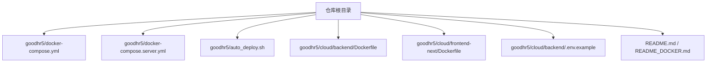
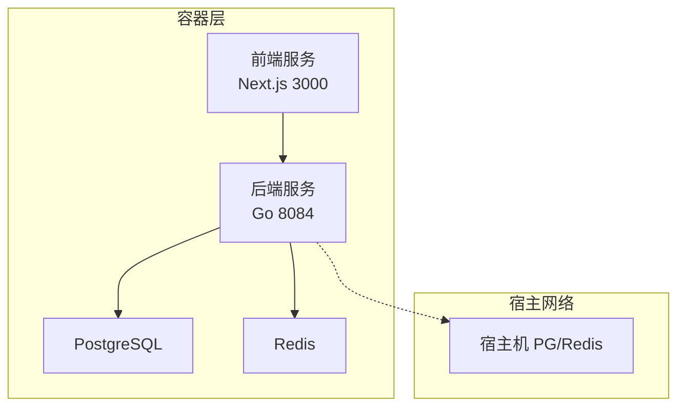
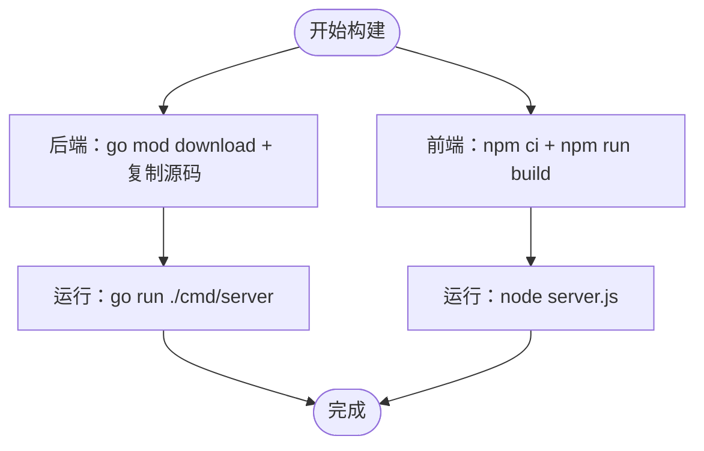
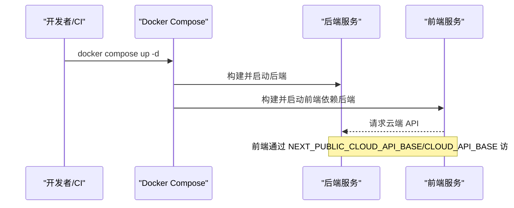
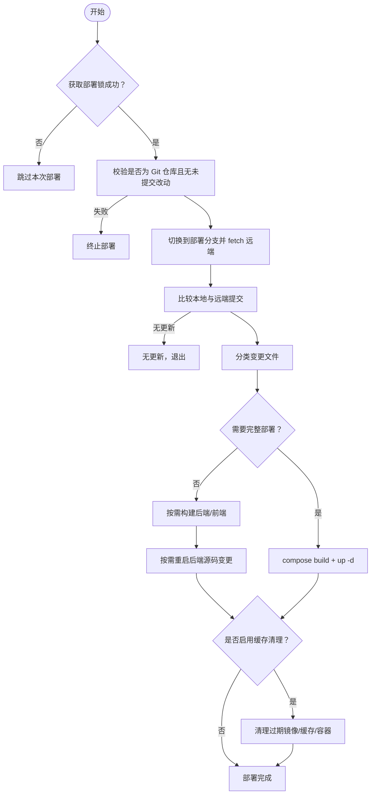
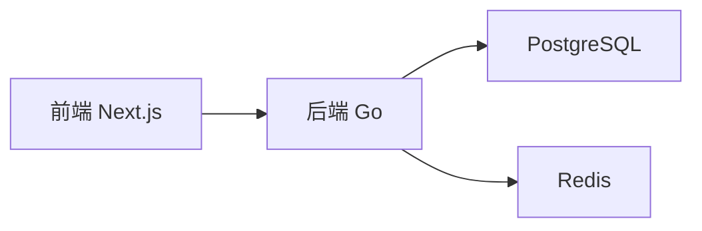
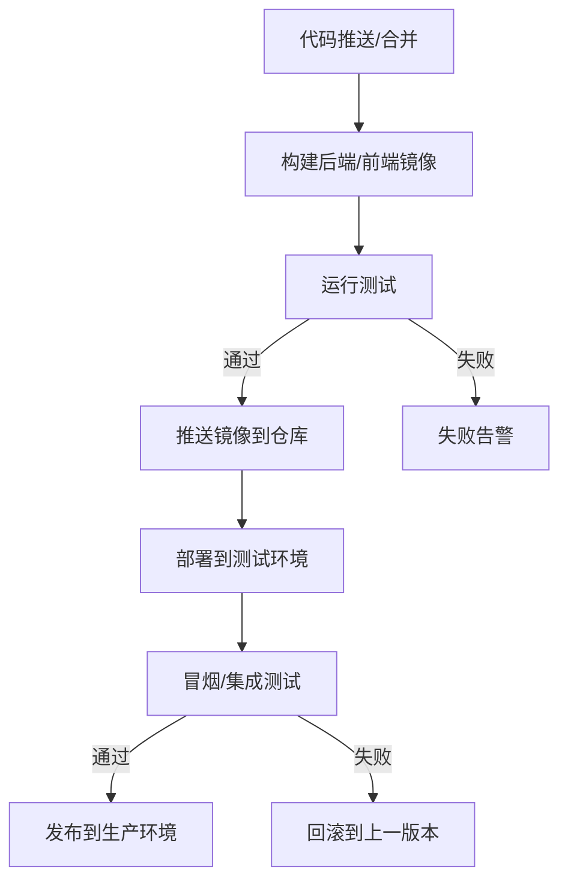
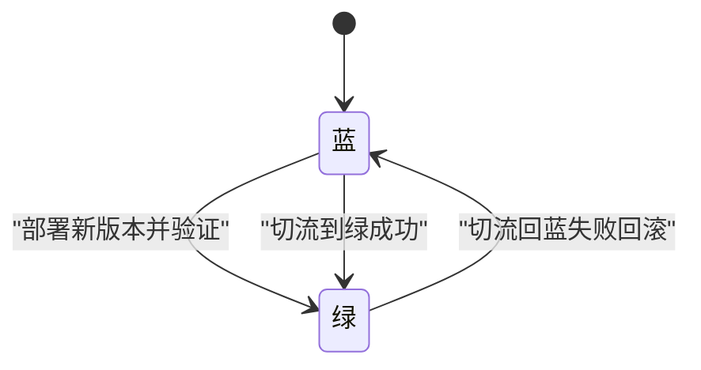
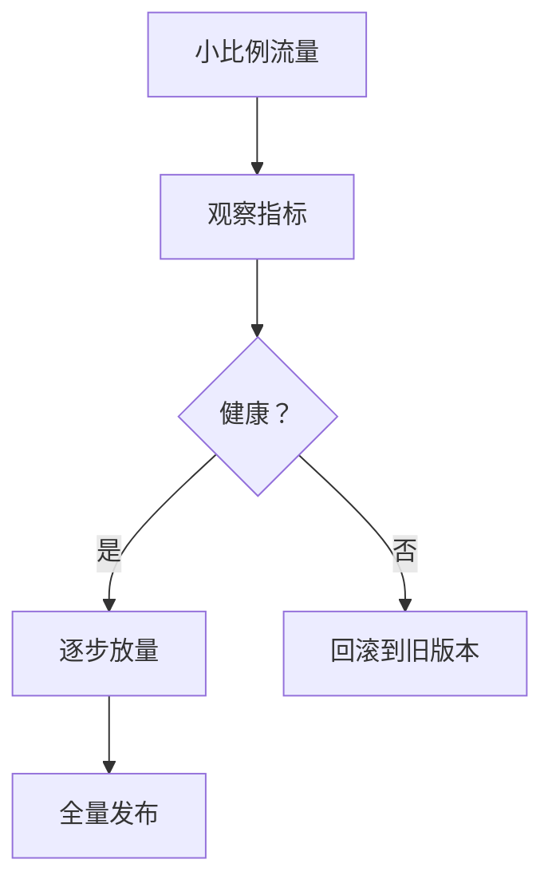

# 自动化部署流程

<cite>
**本文引用的文件**   
- [README.md](file://README.md)
- [README_DOCKER.md](file://goodhr5/README_DOCKER.md)
- [docker-compose.yml](file://goodhr5/docker-compose.yml)
- [docker-compose.server.yml](file://goodhr5/docker-compose.server.yml)
- [auto_deploy.sh](file://goodhr5/auto_deploy.sh)
- [Dockerfile（后端）](file://goodhr5/cloud/backend/Dockerfile)
- [Dockerfile（前端）](file://goodhr5/cloud/frontend-next/Dockerfile)
- [.env.example（后端环境变量示例）](file://goodhr5/cloud/backend/.env.example)
</cite>

## 目录
1. [简介](#简介)
2. [项目结构](#项目结构)
3. [核心组件](#核心组件)
4. [架构总览](#架构总览)
5. [详细组件分析](#详细组件分析)
6. [依赖关系分析](#依赖关系分析)
7. [性能与构建优化](#性能与构建优化)
8. [CI/CD 流水线集成方案](#cicd-流水线集成方案)
9. [高级发布策略](#高级发布策略)
10. [回滚、健康检查与服务发现](#回滚健康检查与服务发现)
11. [故障排查指南](#故障排查指南)
12. [结论](#结论)

## 简介
本文件面向 HRPlus 的自动化部署，覆盖 Docker 镜像构建、容器编排、服务启动顺序、自动化部署脚本使用方法与参数、错误处理机制，以及 CI/CD 流水线集成、蓝绿/金丝雀发布等生产级能力。HRPlus 由云端 Go 后端、Next.js 前端和 PostgreSQL/Redis 组成；本地 Agent 为 Windows 程序，不在容器中运行。

## 项目结构
仓库根目录提供统一的部署入口与说明：
- goodhr5/docker-compose.yml：开发环境编排，包含后端、前端与缓存卷。
- goodhr5/docker-compose.server.yml：Linux 服务器编排，后端使用宿主机网络以访问本机 PG/Redis。
- goodhr5/auto_deploy.sh：基于 Git 变更范围的最小化重建与滚动更新脚本。
- goodhr5/cloud/backend/Dockerfile：Go 后端镜像定义。
- goodhr5/cloud/frontend-next/Dockerfile：Next.js 前端镜像定义。
- goodhr5/cloud/backend/.env.example：后端环境变量示例。
- README.md 与 README_DOCKER.md：产品概述与 Docker 快速上手。

图表来源
- [docker-compose.yml:1-32](file://goodhr5/docker-compose.yml#L1-L32)
- [docker-compose.server.yml:1-12](file://goodhr5/docker-compose.server.yml#L1-L12)
- [auto_deploy.sh:1-173](file://goodhr5/auto_deploy.sh#L1-L173)
- [Dockerfile（后端）:1-8](file://goodhr5/cloud/backend/Dockerfile#L1-L8)
- [Dockerfile（前端）:1-29](file://goodhr5/cloud/frontend-next/Dockerfile#L1-L29)
- [.env.example（后端环境变量示例）:1-11](file://goodhr5/cloud/backend/.env.example#L1-L11)
- [README.md:75-84](file://README.md#L75-L84)
- [README_DOCKER.md:1-46](file://goodhr5/README_DOCKER.md#L1-L46)

章节来源
- [README.md:75-84](file://README.md#L75-L84)
- [README_DOCKER.md:1-46](file://goodhr5/README_DOCKER.md#L1-L46)

## 核心组件
- 后端服务（Go）
  - 镜像构建：基于 golang:1.24-alpine，下载依赖后拷贝源码并运行 cmd/server。
  - 端口与环境：默认监听 :8084，通过 .env 配置数据库、Redis、SMTP、加密密钥等。
- 前端服务（Next.js）
  - 镜像构建：Node 22 Alpine，分依赖安装、构建、运行三阶段；暴露 3000 端口。
  - 运行时注入：NEXT_PUBLIC_SITE_URL、NEXT_PUBLIC_CLOUD_API_BASE 控制站点地址与 API 基址。
- 编排文件
  - docker-compose.yml：开发模式，前后端均构建，前端依赖后端。
  - docker-compose.server.yml：生产/服务器模式，后端使用 host 网络，便于直连本机 PG/Redis。

章节来源
- [Dockerfile（后端）:1-8](file://goodhr5/cloud/backend/Dockerfile#L1-L8)
- [.env.example（后端环境变量示例）:1-11](file://goodhr5/cloud/backend/.env.example#L1-L11)
- [Dockerfile（前端）:1-29](file://goodhr5/cloud/frontend-next/Dockerfile#L1-L29)
- [docker-compose.yml:1-32](file://goodhr5/docker-compose.yml#L1-L32)
- [docker-compose.server.yml:1-12](file://goodhr5/docker-compose.server.yml#L1-L12)

## 架构总览
下图展示开发/服务器环境的容器编排与服务依赖关系。

图表来源
- [docker-compose.yml:1-32](file://goodhr5/docker-compose.yml#L1-L32)
- [docker-compose.server.yml:1-12](file://goodhr5/docker-compose.server.yml#L1-L12)

## 详细组件分析

### Docker 镜像构建与运行
- 后端镜像
  - 基础镜像：golang:1.24-alpine
  - 构建步骤：设置 GOPROXY、复制 go.mod/go.sum 并下载依赖，再复制源码，CMD 运行服务端。
- 前端镜像
  - 基础镜像：node:22-alpine
  - 构建步骤：安装依赖、构建产物、仅复制必要静态资源与 standalone 输出，CMD 运行 server.js。
  - 构建期变量：NEXT_PUBLIC_SITE_URL、NEXT_PUBLIC_CLOUD_API_BASE。

图表来源
- [Dockerfile（后端）:1-8](file://goodhr5/cloud/backend/Dockerfile#L1-L8)
- [Dockerfile（前端）:1-29](file://goodhr5/cloud/frontend-next/Dockerfile#L1-L29)

章节来源
- [Dockerfile（后端）:1-8](file://goodhr5/cloud/backend/Dockerfile#L1-L8)
- [Dockerfile（前端）:1-29](file://goodhr5/cloud/frontend-next/Dockerfile#L1-L29)

### 容器编排与服务启动顺序
- 开发编排（docker-compose.yml）
  - backend：构建 cloud/backend，映射 8084，挂载源码与 tmp 目录。
  - frontend：构建 cloud/frontend-next（使用 Dockerfile.dev），设置 CLOUD_API_BASE/NEXT_PUBLIC_* 环境变量，映射 5173:3000，depends_on backend。
- 服务器编排（docker-compose.server.yml）
  - backend：使用 network_mode: host，挂载源码与 /app/tmp，读取 cloud/backend/.env。
  - frontend：构建 cloud/frontend-next，映射 5173:3000。

图表来源
- [docker-compose.yml:1-32](file://goodhr5/docker-compose.yml#L1-L32)
- [docker-compose.server.yml:1-12](file://goodhr5/docker-compose.server.yml#L1-L12)

章节来源
- [docker-compose.yml:1-32](file://goodhr5/docker-compose.yml#L1-L32)
- [docker-compose.server.yml:1-12](file://goodhr5/docker-compose.server.yml#L1-L12)

### 自动化部署脚本 auto_deploy.sh
脚本目标：在 Linux 服务器上自动拉取代码并按变更范围最小化重建与重启服务。

关键行为
- 锁与日志
  - 使用 .deploy.lock 目录作为互斥锁，异常退出时清理锁。
  - 所有操作写入 deploy.log，带时间戳。
- 分支与远端
  - DEPLOY_BRANCH（默认 main）、DEPLOY_REMOTE（默认 origin）。
  - 切换到部署分支，fetch 远端，比较本地与远端提交，拒绝非快进合并。
- 变更分类
  - 根据 git diff --name-only 结果判断是否变更了后端、前端或 compose 文件。
  - 若 compose 文件变化或核心容器不存在，则执行完整构建与 up -d。
- 增量构建与重启
  - 后端 Dockerfile/go.mod/go.sum 变化才触发后端镜像重建；否则仅重启后端进程（生产后端挂载源码）。
  - 前端任何变更都触发前端构建与更新。
- 缓存清理
  - DEPLOY_PRUNE=1 时清理超过 DEPLOY_PRUNE_AGE（默认 168h）的镜像、BuildKit 缓存与容器。

图表来源
- [auto_deploy.sh:1-173](file://goodhr5/auto_deploy.sh#L1-L173)

章节来源
- [auto_deploy.sh:1-173](file://goodhr5/auto_deploy.sh#L1-L173)

## 依赖关系分析
- 服务间依赖
  - 前端依赖后端 API。
  - 后端依赖 PostgreSQL 与 Redis（可通过 .env 配置外部地址）。
- 构建依赖
  - 后端依赖 Go 工具链与模块缓存。
  - 前端依赖 Node 包管理器与 npm 缓存。
- 编排依赖
  - docker-compose.yml 中前端 depends_on backend。
  - docker-compose.server.yml 中后端使用 host 网络以便访问宿主机 PG/Redis。

图表来源
- [docker-compose.yml:1-32](file://goodhr5/docker-compose.yml#L1-L32)
- [docker-compose.server.yml:1-12](file://goodhr5/docker-compose.server.yml#L1-L12)
- [.env.example（后端环境变量示例）:1-11](file://goodhr5/cloud/backend/.env.example#L1-L11)

章节来源
- [docker-compose.yml:1-32](file://goodhr5/docker-compose.yml#L1-L32)
- [docker-compose.server.yml:1-12](file://goodhr5/docker-compose.server.yml#L1-L12)
- [.env.example（后端环境变量示例）:1-11](file://goodhr5/cloud/backend/.env.example#L1-L11)

## 性能与构建优化
- 分层构建与缓存
  - 后端先下载 go.mod/go.sum 再复制源码，利用 Go 模块缓存。
  - 前端分离依赖安装与构建阶段，复用 node_modules 缓存。
- 增量部署
  - auto_deploy.sh 按变更范围决定是否需要重新构建镜像；后端源码变更可仅重启进程。
- 构建缓存清理
  - 支持 DEPLOY_PRUNE 与 DEPLOY_PRUNE_AGE 控制镜像、BuildKit 与容器缓存清理周期。

章节来源
- [Dockerfile（后端）:1-8](file://goodhr5/cloud/backend/Dockerfile#L1-L8)
- [Dockerfile（前端）:1-29](file://goodhr5/cloud/frontend-next/Dockerfile#L1-L29)
- [auto_deploy.sh:124-170](file://goodhr5/auto_deploy.sh#L124-L170)

## CI/CD 流水线集成方案
建议将以下阶段纳入 CI/CD（如 GitHub Actions/GitLab CI/Jenkins）：

- 触发条件
  - 推送至 main/develop 或指定标签时触发。
  - 可选：仅当 cloud/backend 或 cloud/frontend-next 路径变更时触发对应构建。
- 代码检出
  - 检出仓库，缓存 Go 模块与 npm 依赖。
- 单元测试与静态检查
  - 后端：go test ./...
  - 前端：lint、类型检查、单元测试。
- 构建镜像
  - 后端：docker build -t goodhr5-backend:${TAG} ./cloud/backend
  - 前端：docker build -t goodhr5-frontend:${TAG} ./cloud/frontend-next
- 推送镜像
  - 推送到私有镜像仓库（如 Harbor/ACR/ECR）。
- 部署到测试环境
  - 使用 docker-compose 或 kubectl 部署到测试集群。
- 自动测试
  - 冒烟测试、API 测试、UI 端到端测试。
- 版本发布
  - 生成制品清单（镜像标签、commit、构建时间）。
  - 推送稳定版本到生产环境（见“高级发布策略”）。

[本图为概念性流程图，不直接映射具体源码文件]

## 高级发布策略

### 蓝绿部署
- 思路
  - 同时维护两套相同的服务集合（蓝/绿），流量只指向其中一套。
  - 新版本在空闲侧构建并验证，通过后切换流量。
- 实现要点
  - 使用负载均衡器或 Ingress 控制器进行流量切换。
  - 数据库变更需兼容新旧版本（向前兼容）。
  - 切换前执行健康检查与冒烟测试。

[本图为概念性状态图，不直接映射具体源码文件]

### 金丝雀发布
- 思路
  - 先向少量用户或实例发布新版本，观察指标后再全量推广。
- 实现要点
  - 使用权重路由或灰度规则（如 Header、Cookie、IP 段）。
  - 监控错误率、延迟、业务指标，达到阈值后逐步放量。
  - 出现异常立即回滚。

[本图为概念性流程图，不直接映射具体源码文件]

## 回滚、健康检查与服务发现

### 回滚机制
- 镜像回滚
  - 保留上一个稳定版本的镜像标签，快速替换容器。
- 编排回滚
  - docker-compose：down 后以旧镜像 up。
  - Kubernetes：kubectl rollout undo。
- 数据回滚
  - 数据库迁移需具备 down 脚本或备份恢复流程。

章节来源
- [auto_deploy.sh:124-170](file://goodhr5/auto_deploy.sh#L124-L170)

### 健康检查
- 应用健康检查
  - 后端：HTTP /health 或 /ready 接口返回 200。
  - 前端：HTTP 200 且页面可加载。
- 容器健康检查
  - docker-compose healthcheck 定期探测端口或 HTTP 接口。
- 依赖健康检查
  - 后端启动时校验 PG/Redis 连通性，失败则报错或降级。

章节来源
- [.env.example（后端环境变量示例）:1-11](file://goodhr5/cloud/backend/.env.example#L1-L11)

### 服务发现
- 单机/小规模
  - 使用 docker-compose 内部 DNS 解析服务名（backend、frontend）。
- 大规模/云原生
  - 使用 K8s Service/Ingress 或 Service Mesh（Istio/Linkerd）提供服务发现与流量管理。
  - 结合 ConfigMap/Secret 管理环境变量与证书。

章节来源
- [docker-compose.yml:1-32](file://goodhr5/docker-compose.yml#L1-L32)

## 故障排查指南
- 部署锁冲突
  - 现象：auto_deploy.sh 提示上一次部署仍在执行。
  - 处理：确认无残留进程后删除 .deploy.lock 目录。
- 非快进合并失败
  - 现象：远端分支无法快进合并，部署终止。
  - 处理：确保本地分支与远端一致，避免手动修改历史。
- 未提交改动导致终止
  - 现象：检测到工作区有未提交改动，部署终止。
  - 处理：提交或暂存改动后重试。
- 缺少 Docker Compose
  - 现象：未找到 docker compose 或 docker-compose。
  - 处理：安装 Docker Compose v2 或兼容版本。
- 后端环境变量缺失
  - 现象：PG/Redis/SMTP 等关键配置缺失导致启动失败。
  - 处理：参考 .env.example 补齐配置。
- 前端无法访问后端
  - 现象：NEXT_PUBLIC_CLOUD_API_BASE 或 CLOUD_API_BASE 配置不正确。
  - 处理：核对 docker-compose 中的环境变量与域名/IP。

章节来源
- [auto_deploy.sh:38-122](file://goodhr5/auto_deploy.sh#L38-L122)
- [.env.example（后端环境变量示例）:1-11](file://goodhr5/cloud/backend/.env.example#L1-L11)

## 结论
HRPlus 的自动化部署以 Docker 为核心，结合 docker-compose 与 auto_deploy.sh 实现了从构建、编排到增量更新的完整闭环。配合 CI/CD 流水线，可实现代码触发、自动测试、镜像推送与多环境发布。在生产环境中，推荐引入蓝绿/金丝雀发布、健康检查、服务发现与完善的回滚机制，以提升稳定性与可观测性。