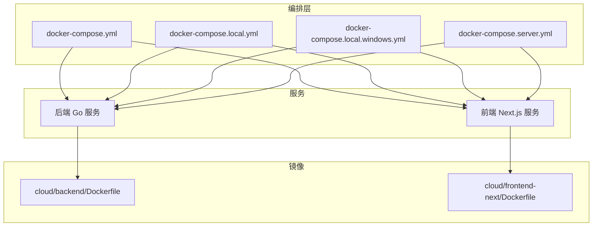
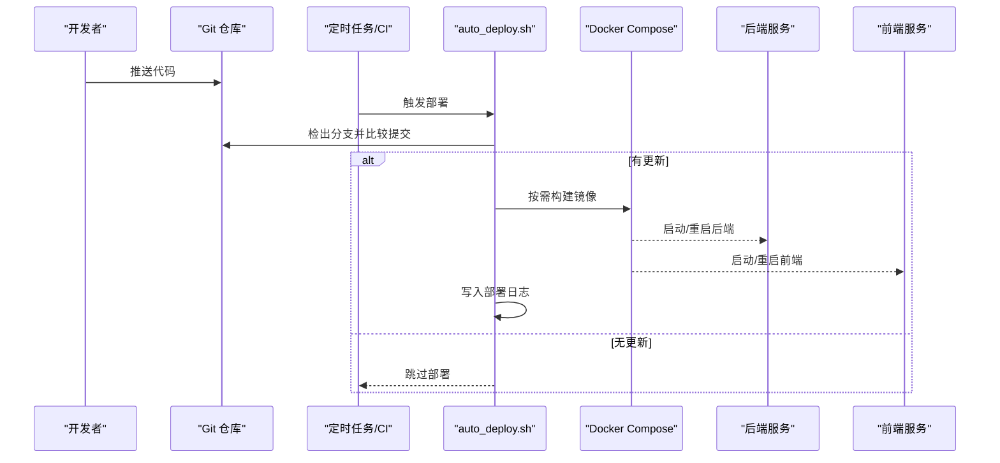
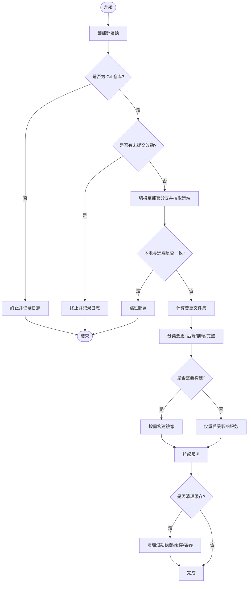
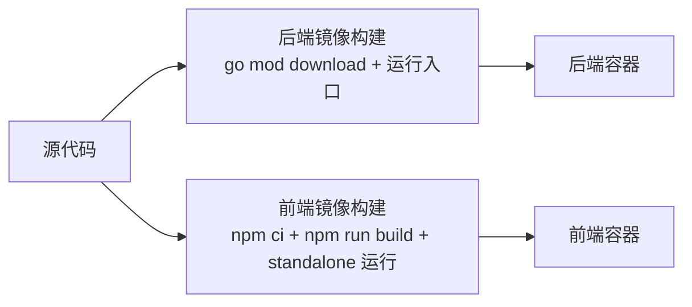
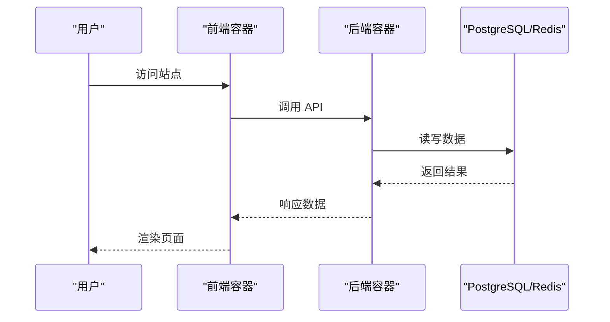
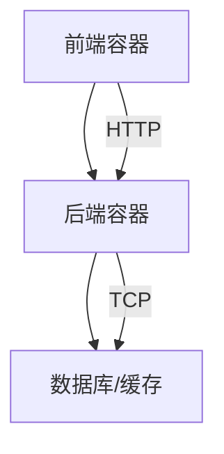

# 自动化部署流程

<cite>
**本文引用的文件**
- [docker-compose.yml](file://goodhr5/docker-compose.yml)
- [docker-compose.local.yml](file://goodhr5/docker-compose.local.yml)
- [docker-compose.local.windows.yml](file://goodhr5/docker-compose.local.windows.yml)
- [docker-compose.server.yml](file://goodhr5/docker-compose.server.yml)
- [auto_deploy.sh](file://goodhr5/auto_deploy.sh)
- [README_DOCKER.md](file://goodhr5/README_DOCKER.md)
- [backend Dockerfile](file://goodhr5/cloud/backend/Dockerfile)
- [frontend Dockerfile](file://goodhr5/cloud/frontend-next/Dockerfile)
</cite>

## 目录
1. [简介](#简介)
2. [项目结构](#项目结构)
3. [核心组件](#核心组件)
4. [架构总览](#架构总览)
5. [详细组件分析](#详细组件分析)
6. [依赖关系分析](#依赖关系分析)
7. [性能考虑](#性能考虑)
8. [故障排查指南](#故障排查指南)
9. [结论](#结论)
10. [附录](#附录)

## 简介
本文件面向 GoodHR 5 的自动化部署，覆盖容器化镜像构建、容器编排与服务启动顺序、自动化部署脚本使用方法与参数配置、错误处理机制，以及 CI/CD 流水线集成方案。同时给出蓝绿部署、金丝雀发布等高级策略建议，并说明回滚机制、健康检查与服务发现在生产环境的落地方式。

## 项目结构
GoodHR 5 采用前后端分离与多环境编排：
- 后端：Go 服务，提供 REST API，使用 PostgreSQL 与 Redis（可外部或容器内）。
- 前端：Next.js 应用，生产模式通过 standalone 输出运行。
- 编排：提供本地开发、Windows 开发、服务器生产三种 docker-compose 配置。
- 自动化：提供 Linux 服务器自动部署脚本，支持增量构建与重启。

图表来源
- [docker-compose.yml:1-32](file://goodhr5/docker-compose.yml#L1-L32)
- [docker-compose.local.yml:1-54](file://goodhr5/docker-compose.local.yml#L1-L54)
- [docker-compose.local.windows.yml:1-58](file://goodhr5/docker-compose.local.windows.yml#L1-L58)
- [docker-compose.server.yml:1-12](file://goodhr5/docker-compose.server.yml#L1-L12)
- [backend Dockerfile:1-8](file://goodhr5/cloud/backend/Dockerfile#L1-L8)
- [frontend Dockerfile:1-23](file://goodhr5/cloud/frontend-next/Dockerfile#L1-L23)

章节来源
- [docker-compose.yml:1-32](file://goodhr5/docker-compose.yml#L1-L32)
- [docker-compose.local.yml:1-54](file://goodhr5/docker-compose.local.yml#L1-L54)
- [docker-compose.local.windows.yml:1-58](file://goodhr5/docker-compose.local.windows.yml#L1-L58)
- [docker-compose.server.yml:1-12](file://goodhr5/docker-compose.server.yml#L1-L12)
- [backend Dockerfile:1-8](file://goodhr5/cloud/backend/Dockerfile#L1-L8)
- [frontend Dockerfile:1-23](file://goodhr5/cloud/frontend-next/Dockerfile#L1-L23)

## 核心组件
- 后端镜像：基于 golang 基础镜像，设置代理，下载依赖后编译运行服务端入口。
- 前端镜像：基于 node 多阶段构建，安装依赖、构建产物，以 standalone 模式运行。
- 编排：
  - 本地开发：挂载源码、启用热重载、复用外部数据网络。
  - Windows 开发：同本地开发但针对 Windows 路径与轮询监听优化。
  - 服务器部署：后端使用宿主机网络直连本机数据库与缓存；前端暴露端口供访问。
- 自动化脚本：检测分支更新、增量构建与重启、清理缓存、日志记录与锁保护。

章节来源
- [backend Dockerfile:1-8](file://goodhr5/cloud/backend/Dockerfile#L1-L8)
- [frontend Dockerfile:1-23](file://goodhr5/cloud/frontend-next/Dockerfile#L1-L23)
- [docker-compose.local.yml:1-54](file://goodhr5/docker-compose.local.yml#L1-L54)
- [docker-compose.local.windows.yml:1-58](file://goodhr5/docker-compose.local.windows.yml#L1-L58)
- [docker-compose.server.yml:1-12](file://goodhr5/docker-compose.server.yml#L1-L12)
- [auto_deploy.sh:1-173](file://goodhr5/auto_deploy.sh#L1-L173)

## 架构总览
下图展示从代码提交到服务运行的端到端流程，包括自动拉取、增量构建、服务重启与日志落盘。

图表来源
- [auto_deploy.sh:44-173](file://goodhr5/auto_deploy.sh#L44-L173)
- [docker-compose.server.yml:1-12](file://goodhr5/docker-compose.server.yml#L1-L12)

## 详细组件分析

### 自动化部署脚本 auto_deploy.sh
- 功能要点
  - 锁定机制：通过目录锁避免并发部署冲突，异常退出时释放锁。
  - 安全校验：确保在 Git 工作树中执行，且无未提交改动。
  - 分支管理：切换到指定分支，拉取远端并校验可快进合并。
  - 变更分类：根据 diff 文件判断是否需要重建后端镜像、重建前端镜像或完整部署。
  - 构建与重启：优先增量构建受影响服务，必要时完整构建并拉起全部服务。
  - 缓存清理：可选清理过期镜像、构建缓存与容器。
  - 日志记录：所有关键步骤均写入部署日志，便于审计与排障。

- 关键参数与环境变量
  - DEPLOY_BRANCH：部署目标分支，默认 main。
  - DEPLOY_REMOTE：远端名称，默认 origin。
  - DEPLOY_COMPOSE_FILE：使用的 compose 文件，默认 docker-compose.server.yml。
  - DEPLOY_PRUNE：是否清理缓存，默认 0。
  - DEPLOY_PRUNE_AGE：清理阈值，默认 168h。

- 错误处理
  - 非 Git 目录、存在未提交改动、不可快进合并、未找到 docker compose 命令等情况直接终止并记录日志。
  - 捕获信号释放锁，保证下一次部署可正常执行。

图表来源
- [auto_deploy.sh:1-173](file://goodhr5/auto_deploy.sh#L1-L173)

章节来源
- [auto_deploy.sh:1-173](file://goodhr5/auto_deploy.sh#L1-L173)

### 容器镜像构建
- 后端镜像
  - 基础镜像：golang 官方镜像，设置国内代理加速依赖下载。
  - 构建过程：复制 go.mod/go.sum 并下载依赖，再复制源码，运行服务端入口。
  - 适用场景：开发与生产均可，生产建议替换为更精简的运行镜像与静态编译。

- 前端镜像
  - 基础镜像：node 官方镜像，多阶段构建。
  - 构建过程：安装依赖、构建产物，以 standalone 模式运行，减少运行时体积。
  - 适用场景：生产推荐此模式，提升启动速度与资源占用。

图表来源
- [backend Dockerfile:1-8](file://goodhr5/cloud/backend/Dockerfile#L1-L8)
- [frontend Dockerfile:1-23](file://goodhr5/cloud/frontend-next/Dockerfile#L1-L23)

章节来源
- [backend Dockerfile:1-8](file://goodhr5/cloud/backend/Dockerfile#L1-L8)
- [frontend Dockerfile:1-23](file://goodhr5/cloud/frontend-next/Dockerfile#L1-L23)

### 容器编排与服务启动顺序
- 本地开发
  - 后端：挂载源码，启用热重载，连接外部 data-services 网络中的数据库。
  - 前端：开发模式，监听端口映射，环境变量指向后端地址。
  - 启动顺序：前端 depends_on 后端，确保后端先启动。

- Windows 开发
  - 与本地开发类似，针对 Windows 路径与轮询监听进行优化。

- 服务器部署
  - 后端：使用宿主机网络，直接访问本机 PG/Redis。
  - 前端：暴露端口供访问。
  - 启动顺序：由 compose 定义，通常先后端再前端。

图表来源
- [docker-compose.local.yml:1-54](file://goodhr5/docker-compose.local.yml#L1-L54)
- [docker-compose.local.windows.yml:1-58](file://goodhr5/docker-compose.local.windows.yml#L1-L58)
- [docker-compose.server.yml:1-12](file://goodhr5/docker-compose.server.yml#L1-L12)

章节来源
- [docker-compose.local.yml:1-54](file://goodhr5/docker-compose.local.yml#L1-L54)
- [docker-compose.local.windows.yml:1-58](file://goodhr5/docker-compose.local.windows.yml#L1-L58)
- [docker-compose.server.yml:1-12](file://goodhr5/docker-compose.server.yml#L1-L12)

### CI/CD 流水线集成方案
- 触发条件
  - 代码推送至指定分支（如 main）时触发。
  - 也可按标签或 PR 合并事件触发。

- 自动测试
  - 单元测试：在后端与前端构建前执行，失败则阻断后续步骤。
  - 集成测试：在临时容器中启动服务，执行冒烟测试。

- 版本发布
  - 构建镜像并打标签（语义化版本或 commit SHA）。
  - 推送至镜像仓库。
  - 在目标环境执行自动化部署脚本，完成滚动或灰度发布。

- 部署阶段
  - 预发环境：验证兼容性、性能与回归。
  - 生产环境：分批次或灰度发布，配合健康检查与回滚策略。

[本节为概念性说明，不直接分析具体文件]

### 高级部署策略
- 蓝绿部署
  - 维护两套相同环境（蓝/绿），流量只切到新环境，验证通过后切换域名或负载均衡器。
  - 结合 Ingress/网关实现快速切换与回滚。

- 金丝雀发布
  - 将新版本以小比例流量引入，监控指标（错误率、延迟、业务指标）。
  - 逐步扩大比例直至全量，或失败时立即回滚。

- 回滚机制
  - 保留上一版本镜像与配置，一键回滚到稳定版本。
  - 数据库变更需具备向下兼容或迁移回滚脚本。

- 健康检查
  - 进程级：容器健康检查探针（HTTP/TCP/命令）。
  - 应用级：关键依赖可达性检查（数据库、缓存、第三方 API）。

- 服务发现
  - 容器内通过 DNS 解析服务名。
  - 生产环境可使用 K8s Service/Ingress 或外部网关提供服务发现与路由。

[本节为概念性说明，不直接分析具体文件]

## 依赖关系分析
- 服务间依赖
  - 前端依赖后端 API，compose 中通过 depends_on 控制启动顺序。
  - 后端依赖数据库与缓存，可通过外部网络或容器内服务提供。

- 构建依赖
  - 后端依赖 Go 模块与代理配置。
  - 前端依赖 Node 包管理器与构建工具链。

图表来源
- [docker-compose.local.yml:1-54](file://goodhr5/docker-compose.local.yml#L1-L54)
- [docker-compose.server.yml:1-12](file://goodhr5/docker-compose.server.yml#L1-L12)

章节来源
- [docker-compose.local.yml:1-54](file://goodhr5/docker-compose.local.yml#L1-L54)
- [docker-compose.server.yml:1-12](file://goodhr5/docker-compose.server.yml#L1-L12)

## 性能考虑
- 构建优化
  - 利用分层缓存：先复制依赖清单再复制源码，减少重复构建。
  - 使用独立缓存卷保存 Go 模块缓存与构建缓存。
  - 前端使用 standalone 输出，减少运行时体积。

- 运行优化
  - 生产环境使用最小化基础镜像。
  - 合理设置资源限制与副本数，避免单点瓶颈。
  - 对频繁读写的中间件（如 Redis）进行本地缓存或连接池优化。

[本节为通用指导，不直接分析具体文件]

## 故障排查指南
- 常见问题
  - 部署锁冲突：检查是否存在残留锁目录，清理后重试。
  - 未提交改动：确保工作区干净后再执行部署。
  - 无法快进合并：检查本地与远端分支历史，必要时重新拉取或合并。
  - 缺少 docker compose：确认系统已安装并可用。

- 日志定位
  - 查看部署日志文件，定位失败阶段与错误信息。
  - 查看容器日志，确认服务启动与依赖连通性。

- 恢复策略
  - 回滚到上一个稳定版本镜像与配置。
  - 重置容器与缓存，重新构建与启动。

章节来源
- [auto_deploy.sh:1-173](file://goodhr5/auto_deploy.sh#L1-L173)

## 结论
GoodHR 5 提供了完善的容器化与自动化部署能力：通过多环境 compose 配置适配开发与生产，借助自动化脚本实现增量构建与智能重启，结合 CI/CD 可实现持续交付。生产环境建议引入蓝绿/金丝雀发布、健康检查与服务发现，并完善回滚机制，以确保高可用与稳定性。

[本节为总结性内容，不直接分析具体文件]

## 附录
- 快速启动参考
  - 首次构建与启动命令、停止命令、外部数据库接入方式见文档。

章节来源
- [README_DOCKER.md:1-46](file://goodhr5/README_DOCKER.md#L1-L46)