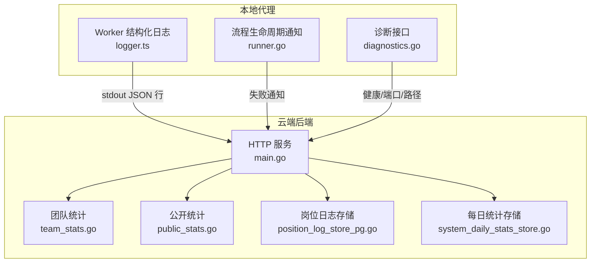
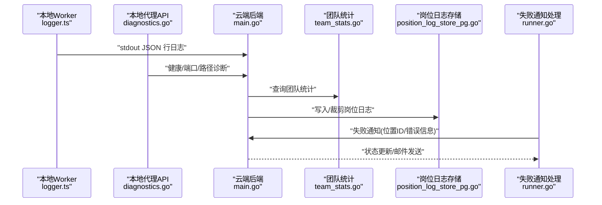
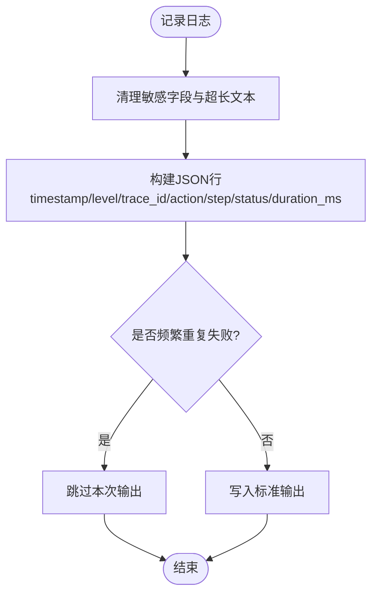
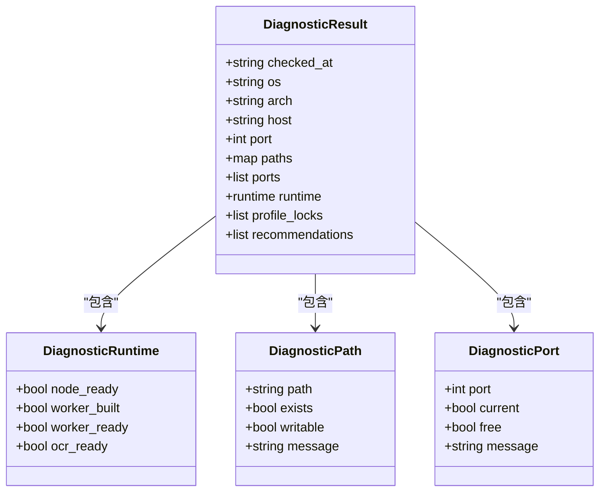
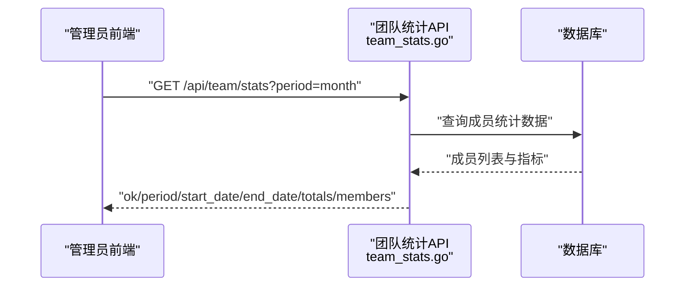
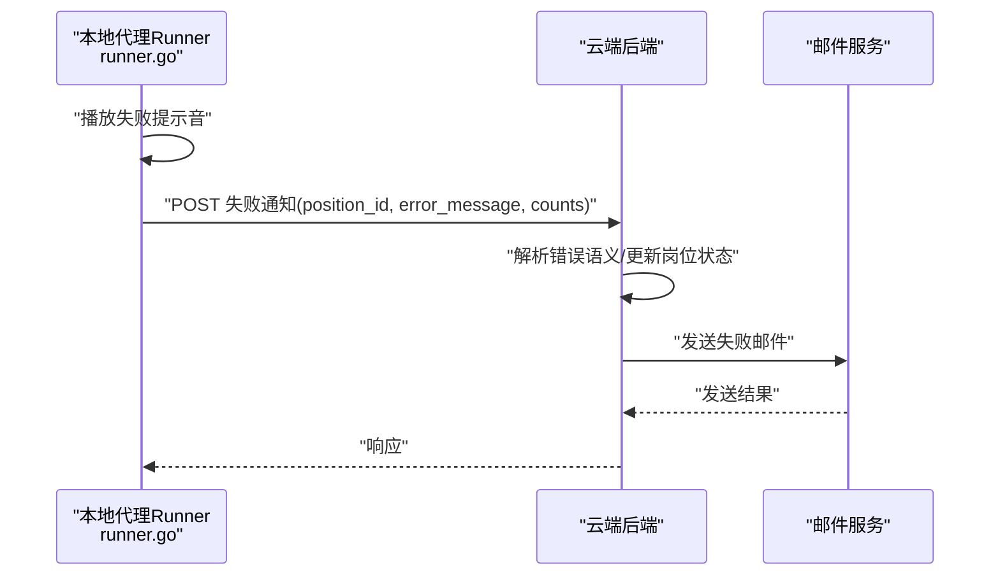
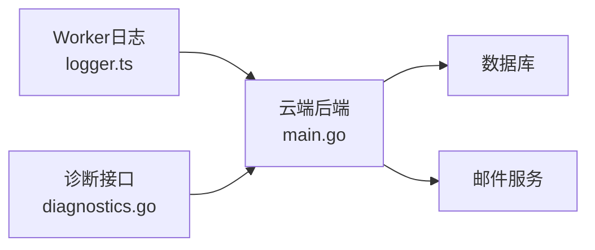

# 监控与日志

<cite>
**本文引用的文件**
- [main.go](file://goodhr5/cloud/backend/cmd/server/main.go)
- [logger.ts](file://goodhr5/local-agent-go/worker/src/logging/logger.ts)
- [types.go](file://goodhr5/local-agent-go/internal/flow/shared/types.go)
- [diagnostics.go](file://goodhr5/local-agent-go/internal/api/diagnostics.go)
- [position_log_store_pg.go](file://goodhr5/cloud/backend/internal/httpapi/position_log_store_pg.go)
- [team_stats.go](file://goodhr5/cloud/backend/internal/httpapi/team_stats.go)
- [public_stats.go](file://goodhr5/cloud/backend/internal/httpapi/public_stats.go)
- [system_daily_stats_store.go](file://goodhr5/cloud/backend/internal/httpapi/system_daily_stats_store.go)
- [runner.go](file://goodhr5/local-agent-go/internal/flow/lifecycle/runner.go)
- [error_policy.go](file://goodhr5/local-agent-go/internal/positionrunner/error_policy.go)
</cite>

## 目录
1. [简介](#简介)
2. [项目结构](#项目结构)
3. [核心组件](#核心组件)
4. [架构总览](#架构总览)
5. [详细组件分析](#详细组件分析)
6. [依赖关系分析](#依赖关系分析)
7. [性能考量](#性能考量)
8. [故障排查指南](#故障排查指南)
9. [结论](#结论)
10. [附录](#附录)

## 简介
本文件面向运维与研发人员，系统化说明 GoodHR5 的监控与日志体系：包括应用日志格式、级别与输出方式；关键业务指标与系统性能指标的采集与上报；日志聚合与分析建议；告警规则与异常通知机制；分布式追踪与请求链路跟踪思路；以及常见故障的诊断方法。文档内容均基于仓库中现有实现进行梳理与归纳，便于快速落地与扩展。

## 项目结构
GoodHR5 的监控与日志能力分布在云端后端与本地代理两端：
- 云端后端（Go）：负责启动时统一日志输出到标准输出与文件；提供团队统计、公开统计、岗位日志存储等能力；接收本地代理的失败通知并发送邮件。
- 本地代理（Go + TypeScript Worker）：Worker 输出结构化 JSON 行日志，包含 trace_id、action、step、status、duration_ms 等字段；提供健康检查与诊断接口，汇总运行组件状态、端口占用、目录可写性等。

**图表来源**
- [main.go:14-51](file://goodhr5/cloud/backend/cmd/server/main.go#L14-L51)
- [logger.ts:39-123](file://goodhr5/local-agent-go/worker/src/logging/logger.ts#L39-L123)
- [diagnostics.go:84-104](file://goodhr5/local-agent-go/internal/api/diagnostics.go#L84-L104)
- [runner.go:400-428](file://goodhr5/local-agent-go/internal/flow/lifecycle/runner.go#L400-L428)
- [team_stats.go:27-65](file://goodhr5/cloud/backend/internal/httpapi/team_stats.go#L27-L65)
- [public_stats.go:6-18](file://goodhr5/cloud/backend/internal/httpapi/public_stats.go#L6-L18)
- [position_log_store_pg.go:172-235](file://goodhr5/cloud/backend/internal/httpapi/position_log_store_pg.go#L172-L235)
- [system_daily_stats_store.go:87-102](file://goodhr5/cloud/backend/internal/httpapi/system_daily_stats_store.go#L87-L102)

**章节来源**
- [main.go:14-51](file://goodhr5/cloud/backend/cmd/server/main.go#L14-L51)
- [logger.ts:39-123](file://goodhr5/local-agent-go/worker/src/logging/logger.ts#L39-L123)
- [diagnostics.go:84-104](file://goodhr5/local-agent-go/internal/api/diagnostics.go#L84-L104)

## 核心组件
- 云端后端日志初始化：启动时将标准日志同时输出到标准输出与日志文件，便于容器化收集与本地调试。
- 本地 Worker 结构化日志：以 JSON 行输出，包含时间戳、级别、trace_id、action、step、status、耗时等，并对敏感字段进行脱敏。
- 本地诊断接口：暴露运行时健康、端口占用、目录可写性、Profile 锁文件等信息，辅助快速定位环境问题。
- 业务指标与统计：团队统计、公开统计、岗位日志计数、系统每日统计等，用于运营与运维看板。
- 失败通知与邮件：本地代理在任务失败时触发提示音并调用云端发送失败通知，云端根据错误语义更新岗位状态并发送邮件。

**章节来源**
- [main.go:14-51](file://goodhr5/cloud/backend/cmd/server/main.go#L14-L51)
- [logger.ts:39-123](file://goodhr5/local-agent-go/worker/src/logging/logger.ts#L39-L123)
- [diagnostics.go:84-104](file://goodhr5/local-agent-go/internal/api/diagnostics.go#L84-L104)
- [team_stats.go:27-65](file://goodhr5/cloud/backend/internal/httpapi/team_stats.go#L27-L65)
- [public_stats.go:6-18](file://goodhr5/cloud/backend/internal/httpapi/public_stats.go#L6-L18)
- [position_log_store_pg.go:172-235](file://goodhr5/cloud/backend/internal/httpapi/position_log_store_pg.go#L172-L235)
- [system_daily_stats_store.go:87-102](file://goodhr5/cloud/backend/internal/httpapi/system_daily_stats_store.go#L87-L102)
- [runner.go:400-428](file://goodhr5/local-agent-go/internal/flow/lifecycle/runner.go#L400-L428)

## 架构总览
下图展示了从本地 Worker 结构化日志到云端统计与通知的整体数据流，以及诊断与健康检查的交互。

**图表来源**
- [logger.ts:104-123](file://goodhr5/local-agent-go/worker/src/logging/logger.ts#L104-L123)
- [diagnostics.go:84-104](file://goodhr5/local-agent-go/internal/api/diagnostics.go#L84-L104)
- [main.go:14-51](file://goodhr5/cloud/backend/cmd/server/main.go#L14-L51)
- [team_stats.go:27-65](file://goodhr5/cloud/backend/internal/httpapi/team_stats.go#L27-L65)
- [position_log_store_pg.go:172-235](file://goodhr5/cloud/backend/internal/httpapi/position_log_store_pg.go#L172-L235)
- [runner.go:400-428](file://goodhr5/local-agent-go/internal/flow/lifecycle/runner.go#L400-L428)

## 详细组件分析

### 应用日志规范（本地 Worker）
- 输出格式：每行一个 JSON 对象，包含以下关键字段：
  - timestamp：ISO 时间戳
  - level：info / warning / error
  - trace_id：请求或动作追踪标识
  - action：动作名称
  - step：步骤名
  - status：操作结果状态
  - duration_ms：动作耗时（毫秒）
  - 其他业务字段：经安全清洗后附加
- 敏感信息保护：自动识别 cookie、authorization、token、password、proxy.*(user|pass)、secret 等键并隐藏值；字符串长度限制以避免过大日志。
- 失败去重：对高频重复失败进行短时间窗口内的去重，避免日志风暴。
- 输出目标：标准输出，便于容器日志收集器抓取。

**图表来源**
- [logger.ts:12-37](file://goodhr5/local-agent-go/worker/src/logging/logger.ts#L12-L37)
- [logger.ts:73-94](file://goodhr5/local-agent-go/worker/src/logging/logger.ts#L73-L94)
- [logger.ts:104-123](file://goodhr5/local-agent-go/worker/src/logging/logger.ts#L104-L123)

**章节来源**
- [logger.ts:12-37](file://goodhr5/local-agent-go/worker/src/logging/logger.ts#L12-L37)
- [logger.ts:73-94](file://goodhr5/local-agent-go/worker/src/logging/logger.ts#L73-L94)
- [logger.ts:104-123](file://goodhr5/local-agent-go/worker/src/logging/logger.ts#L104-L123)

### 云端后端日志与输出
- 启动时创建日志目录与文件，将标准日志同时输出到标准输出与文件，便于容器化部署时的日志收集与本地调试。
- 日志标志包含标准时间与微秒级精度，便于时序分析与问题定位。

**章节来源**
- [main.go:14-51](file://goodhr5/cloud/backend/cmd/server/main.go#L14-L51)

### 本地诊断与健康检查
- 诊断接口返回操作系统、架构、主机与端口、关键目录存在性与可写性、候选端口占用情况、运行组件就绪状态（Node、Worker、OCR）、浏览器 Profile 锁文件列表，以及基于诊断结果的简短建议。
- 适用于环境自检、安装后验证、常见问题快速定位。

**图表来源**
- [diagnostics.go:18-61](file://goodhr5/local-agent-go/internal/api/diagnostics.go#L18-L61)
- [diagnostics.go:84-104](file://goodhr5/local-agent-go/internal/api/diagnostics.go#L84-L104)
- [diagnostics.go:106-176](file://goodhr5/local-agent-go/internal/api/diagnostics.go#L106-L176)

**章节来源**
- [diagnostics.go:84-104](file://goodhr5/local-agent-go/internal/api/diagnostics.go#L84-L104)
- [diagnostics.go:106-176](file://goodhr5/local-agent-go/internal/api/diagnostics.go#L106-L176)

### 业务指标与统计
- 团队统计：支持按今日、本周、本月、上月、自定义日期范围查询团队成员的岗位数、扫描数、简历数、详情数、打招呼数、跳过数、失败数等，并汇总总数。
- 公开统计：对外提供系统层面的统计接口，便于官网展示。
- 岗位日志：按岗位维度统计扫描、打招呼、跳过、失败次数，并在写入前进行数量裁剪，控制存储规模。
- 系统每日统计：按日聚合已处理简历数等指标，供长期趋势分析。

**图表来源**
- [team_stats.go:27-65](file://goodhr5/cloud/backend/internal/httpapi/team_stats.go#L27-L65)
- [team_stats.go:135-166](file://goodhr5/cloud/backend/internal/httpapi/team_stats.go#L135-L166)
- [team_stats.go:168-203](file://goodhr5/cloud/backend/internal/httpapi/team_stats.go#L168-L203)

**章节来源**
- [team_stats.go:27-65](file://goodhr5/cloud/backend/internal/httpapi/team_stats.go#L27-L65)
- [team_stats.go:135-166](file://goodhr5/cloud/backend/internal/httpapi/team_stats.go#L135-L166)
- [team_stats.go:168-203](file://goodhr5/cloud/backend/internal/httpapi/team_stats.go#L168-L203)
- [public_stats.go:6-18](file://goodhr5/cloud/backend/internal/httpapi/public_stats.go#L6-L18)
- [position_log_store_pg.go:172-235](file://goodhr5/cloud/backend/internal/httpapi/position_log_store_pg.go#L172-L235)
- [system_daily_stats_store.go:87-102](file://goodhr5/cloud/backend/internal/httpapi/system_daily_stats_store.go#L87-L102)

### 失败通知与告警
- 本地代理在任务执行失败时播放失败提示音，并调用云端发送失败通知，附带岗位 ID、错误信息与运行统计。
- 云端根据错误语义判断岗位状态（如账号异地登录导致停止），并发送邮件通知用户。
- 通知失败会记录为警告日志，不影响任务最终状态。

**图表来源**
- [runner.go:400-428](file://goodhr5/local-agent-go/internal/flow/lifecycle/runner.go#L400-L428)

**章节来源**
- [runner.go:400-428](file://goodhr5/local-agent-go/internal/flow/lifecycle/runner.go#L400-L428)

### 连续错误策略与稳定性
- 针对候选人操作的错误进行归一化与连续计数，当同一操作连续出现相同错误指纹达到阈值时，触发停止策略，避免无效重试造成资源浪费。
- 成功操作后可重置该环节的错误计数，恢复流程。

**章节来源**
- [error_policy.go:48-85](file://goodhr5/local-agent-go/internal/positionrunner/error_policy.go#L48-L85)

## 依赖关系分析
- 云端后端依赖数据库进行统计与日志持久化；通过 HTTP API 暴露团队统计、公开统计、岗位日志等能力。
- 本地代理通过 stdout 输出结构化日志，便于外部日志收集器（如容器日志平台）统一采集；通过 HTTP 接口提供健康与诊断能力。
- 本地代理与云端通过失败通知接口联动，形成“端侧感知—云端通知”的闭环。

**图表来源**
- [logger.ts:104-123](file://goodhr5/local-agent-go/worker/src/logging/logger.ts#L104-L123)
- [diagnostics.go:84-104](file://goodhr5/local-agent-go/internal/api/diagnostics.go#L84-L104)
- [main.go:14-51](file://goodhr5/cloud/backend/cmd/server/main.go#L14-L51)

**章节来源**
- [logger.ts:104-123](file://goodhr5/local-agent-go/worker/src/logging/logger.ts#L104-L123)
- [diagnostics.go:84-104](file://goodhr5/local-agent-go/internal/api/diagnostics.go#L84-L104)
- [main.go:14-51](file://goodhr5/cloud/backend/cmd/server/main.go#L14-L51)

## 性能考量
- 日志体积控制：Worker 日志对字符串长度进行限制，并对高频失败进行去重，降低日志风暴风险。
- 存储裁剪：岗位日志写入前检查数量上限，删除最早记录，避免无限增长影响查询性能。
- 超时与限流：统计查询使用上下文超时，防止慢查询拖垮服务。
- 建议：在生产环境中结合日志收集平台的采样与压缩策略，进一步降低 I/O 压力。

**章节来源**
- [logger.ts:25-37](file://goodhr5/local-agent-go/worker/src/logging/logger.ts#L25-L37)
- [logger.ts:73-94](file://goodhr5/local-agent-go/worker/src/logging/logger.ts#L73-L94)
- [position_log_store_pg.go:199-235](file://goodhr5/cloud/backend/internal/httpapi/position_log_store_pg.go#L199-L235)
- [system_daily_stats_store.go:87-102](file://goodhr5/cloud/backend/internal/httpapi/system_daily_stats_store.go#L87-L102)

## 故障排查指南
- 查看本地诊断：调用本地诊断接口，确认目录可写性、端口占用、运行组件就绪状态与 Profile 锁文件，依据返回建议进行处理。
- 检查日志：
  - 云端后端：启动时会输出日志文件路径，可通过标准输出与文件双写获取日志。
  - 本地 Worker：采集 stdout 中的 JSON 行日志，关注 error/warning 级别与失败去重后的关键错误。
- 失败通知：若收到失败通知，检查岗位状态与邮件发送结果；若邮件发送失败，重试后可再次尝试。
- 连续错误：若某操作连续失败，检查错误指纹与阈值策略，必要时调整重试策略或修复上游问题。

**章节来源**
- [diagnostics.go:84-104](file://goodhr5/local-agent-go/internal/api/diagnostics.go#L84-L104)
- [main.go:14-51](file://goodhr5/cloud/backend/cmd/server/main.go#L14-L51)
- [logger.ts:73-94](file://goodhr5/local-agent-go/worker/src/logging/logger.ts#L73-L94)
- [runner.go:400-428](file://goodhr5/local-agent-go/internal/flow/lifecycle/runner.go#L400-L428)
- [error_policy.go:48-85](file://goodhr5/local-agent-go/internal/positionrunner/error_policy.go#L48-L85)

## 结论
GoodHR5 的监控与日志体系围绕“结构化日志 + 健康诊断 + 业务统计 + 失败通知”展开，既满足容器化环境的日志采集需求，又提供了面向运维的快速排障能力。通过团队统计、公开统计与岗位日志，形成了完整的业务指标观测面；通过失败通知与邮件，构建了端到端的异常闭环。建议在后续迭代中引入更完善的分布式追踪与指标上报通道，进一步提升可观测性与自动化告警能力。

## 附录
- 日志字段建议：
  - 基础字段：timestamp、level、trace_id、action、step、status、duration_ms
  - 业务字段：position_id、user_email、platform、operation、error_code、error_message
  - 安全字段：对敏感键进行隐藏，避免泄露 Cookie、Token、密码等
- 日志聚合方案建议：
  - 容器化部署：使用容器日志收集器统一抓取 stdout，并按服务名与实例标签分类
  - 结构化解析：将 JSON 行解析为字段索引，便于查询与聚合
  - 保留策略：按天滚动与过期清理，控制存储成本
- 告警规则建议：
  - 错误率：单位时间内 error 级别日志占比超过阈值
  - 失败通知：失败通知频率突增或持续失败
  - 健康检查：诊断接口返回组件未就绪或端口不可用
  - 业务指标：团队统计中失败数、跳过数异常上升
- 分布式追踪建议：
  - 在 trace_id 基础上增加 span_id、parent_span_id，串联跨进程调用
  - 在 Worker 与云端之间传递 trace_id，确保请求链路完整
  - 在关键步骤埋点，记录耗时与状态，便于瓶颈定位

[本节为概念性补充，不直接引用具体代码文件]