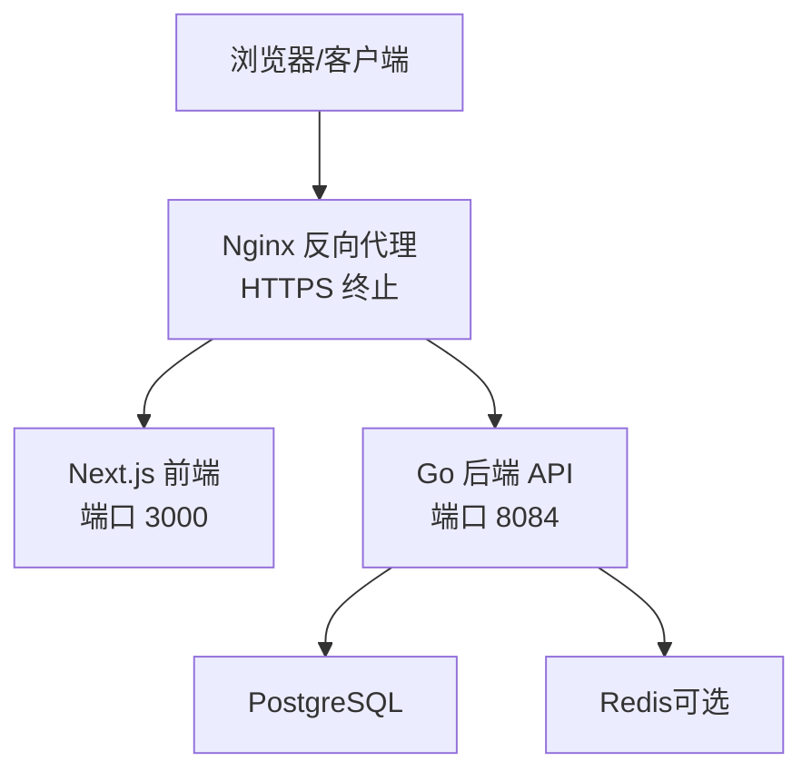
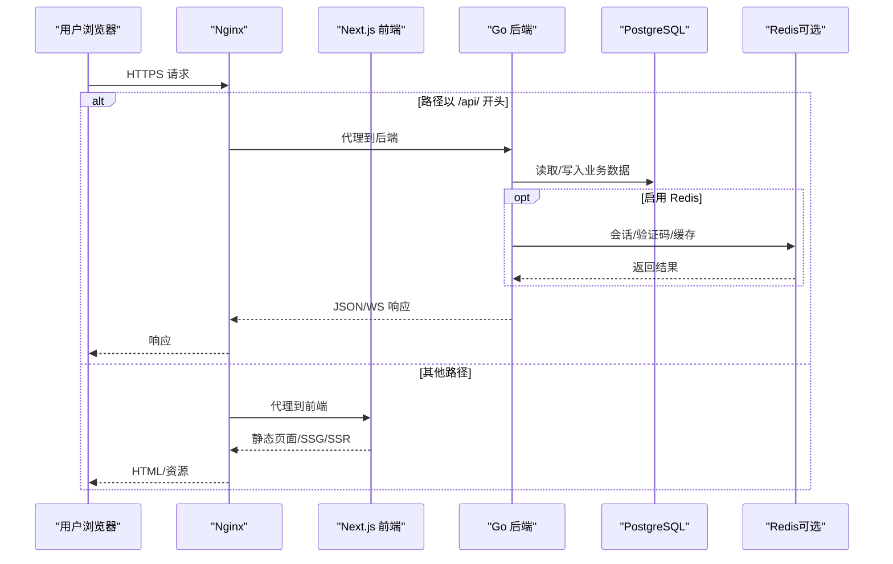
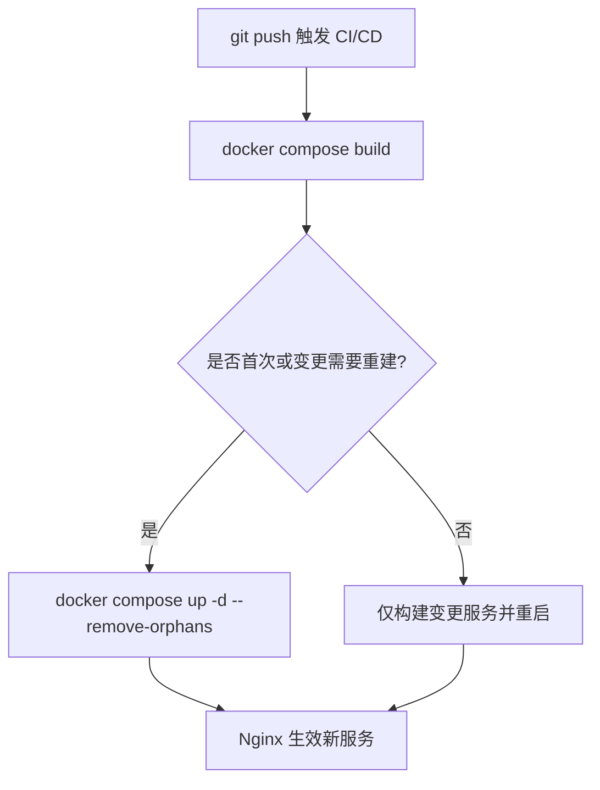
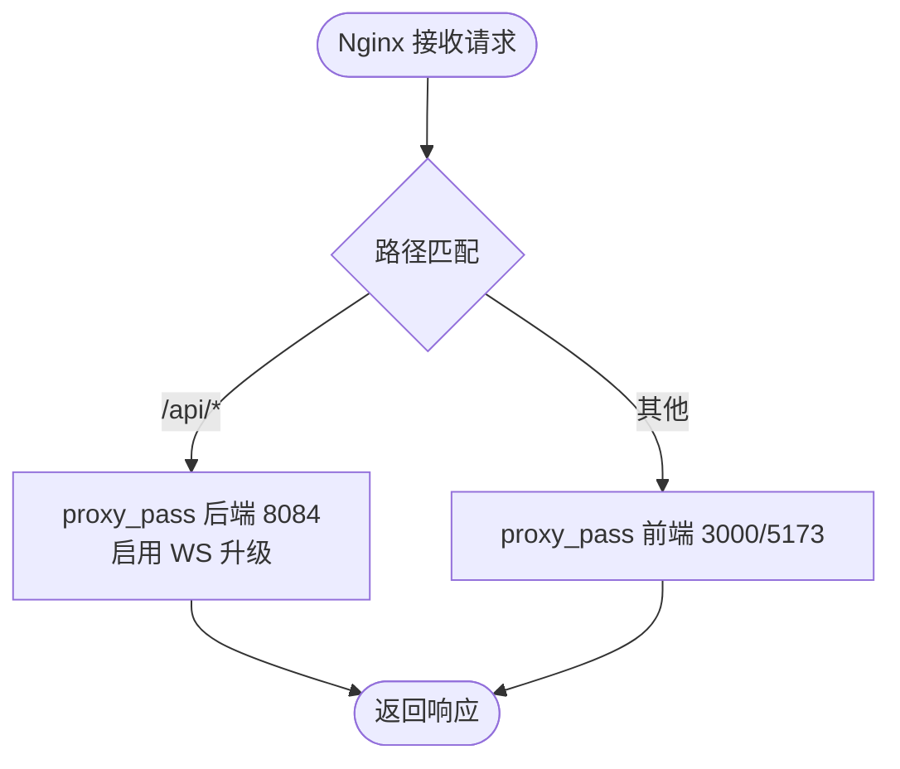
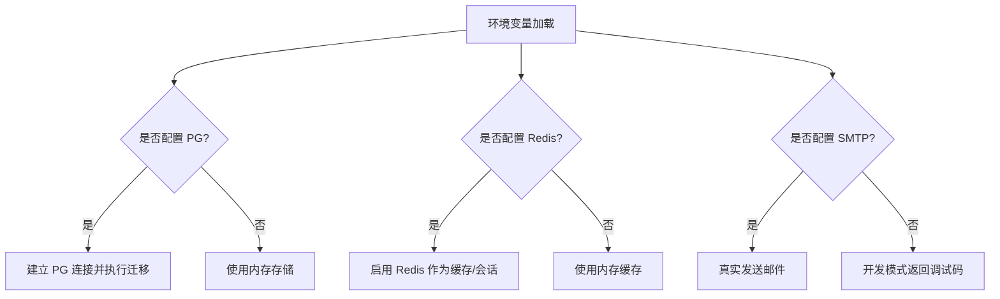
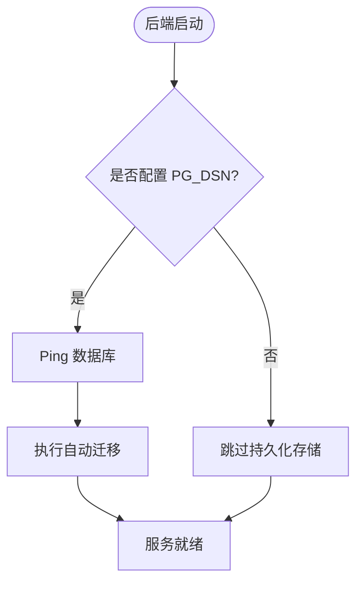
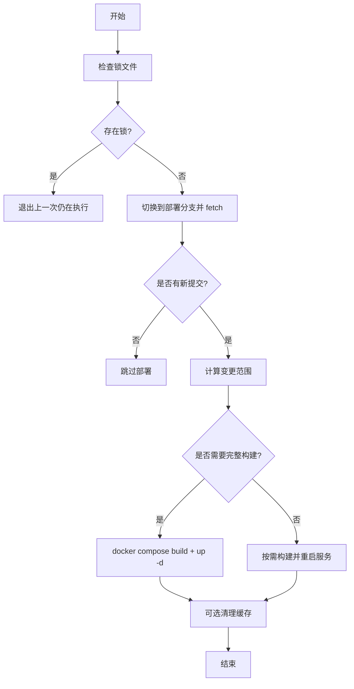
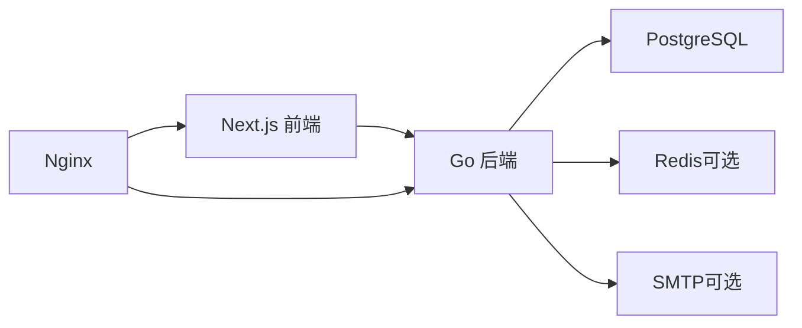

# 部署指南

<cite>
**本文引用的文件**
- [README_DOCKER.md](file://goodhr5/README_DOCKER.md)
- [docker-compose.yml](file://goodhr5/docker-compose.yml)
- [docker-compose.server.yml](file://goodhr5/docker-compose.server.yml)
- [nginx.goodhr5.example.conf](file://goodhr5/nginx.goodhr5.example.conf)
- [auto_deploy.sh](file://goodhr5/auto_deploy.sh)
- [Dockerfile（后端）](file://goodhr5/cloud/backend/Dockerfile)
- [Dockerfile（前端）](file://goodhr5/cloud/frontend-next/Dockerfile)
- [docker-compose.local.yml](file://goodhr5/docker-compose.local.yml)
- [config.go](file://goodhr5/cloud/backend/internal/httpapi/config.go)
- [main.go](file://goodhr5/cloud/backend/cmd/server/main.go)
- [0001_initial_schema.sql](file://goodhr5/cloud/backend/db/migrations/0001_initial_schema.sql)
</cite>

## 目录
1. [简介](#简介)
2. [项目结构](#项目结构)
3. [核心组件](#核心组件)
4. [架构总览](#架构总览)
5. [详细组件分析](#详细组件分析)
6. [依赖关系分析](#依赖关系分析)
7. [性能考虑](#性能考虑)
8. [故障排查指南](#故障排查指南)
9. [结论](#结论)
10. [附录](#附录)

## 简介
本指南面向运维与交付团队，提供 GoodHR 5 在生产环境的完整部署与维护说明。内容涵盖：容器化构建与服务编排、Nginx 反向代理与 SSL、环境变量与数据库初始化、自动化部署脚本使用、版本更新与回滚策略、监控告警与日志收集、以及性能调优建议。读者可据此在 Linux 服务器或容器平台完成从 0 到 1 的上线与持续交付。

## 项目结构
GoodHR 5 由云端后端（Go）、云端前端（Next.js）、本地 Agent（桌面端程序）三部分组成。生产环境通常只部署云端后端与前端，并通过 Nginx 暴露 HTTPS 入口；本地 Agent 由终端用户自行安装运行。

图表来源
- [nginx.goodhr5.example.conf:1-38](file://goodhr5/nginx.goodhr5.example.conf#L1-L38)
- [docker-compose.yml:1-32](file://goodhr5/docker-compose.yml#L1-L32)
- [docker-compose.server.yml:1-12](file://goodhr5/docker-compose.server.yml#L1-L12)

章节来源
- [README_DOCKER.md:1-46](file://goodhr5/README_DOCKER.md#L1-L46)
- [docker-compose.yml:1-32](file://goodhr5/docker-compose.yml#L1-L32)
- [docker-compose.server.yml:1-12](file://goodhr5/docker-compose.server.yml#L1-L12)

## 核心组件
- 后端服务（Go）：监听地址可通过环境变量配置，默认 :8084；支持 PostgreSQL 持久化与 Redis 缓存；启动时自动执行数据库迁移。
- 前端服务（Next.js）：开发模式通过 Dockerfile.dev 提供热重载；生产镜像基于 standalone 输出，端口 3000。
- 数据层：PostgreSQL 存储业务数据；Redis 用于会话、验证码与部分日志缓存（可选）。
- 反向代理：Nginx 负责 HTTPS 终止、WebSocket 升级、静态资源与 API 路由转发。
- 自动化部署：shell 脚本实现增量构建与滚动重启，支持清理缓存与锁机制。

章节来源
- [main.go:14-53](file://goodhr5/cloud/backend/cmd/server/main.go#L14-L53)
- [config.go:30-75](file://goodhr5/cloud/backend/internal/httpapi/config.go#L30-L75)
- [Dockerfile（前端）:1-23](file://goodhr5/cloud/frontend-next/Dockerfile#L1-L23)
- [Dockerfile（后端）:1-8](file://goodhr5/cloud/backend/Dockerfile#L1-L8)

## 架构总览
下图展示了生产环境请求路径：浏览器访问域名，Nginx 将 /api/* 转发至后端，其余请求转发至前端；后端连接 PostgreSQL 与可选 Redis；前端通过环境变量获取后端 API 基址。

图表来源
- [nginx.goodhr5.example.conf:1-38](file://goodhr5/nginx.goodhr5.example.conf#L1-L38)
- [config.go:30-75](file://goodhr5/cloud/backend/internal/httpapi/config.go#L30-L75)
- [main.go:14-53](file://goodhr5/cloud/backend/cmd/server/main.go#L14-L53)

## 详细组件分析

### 容器化与服务编排
- 后端镜像：基于 golang:alpine，设置 GOPROXY，编译并运行 cmd/server。
- 前端镜像：多阶段构建，dependencies/builder/runner，生产模式输出 standalone 并运行 server.js。
- 开发编排：docker-compose.yml 同时启动前后端，挂载源码与缓存卷，便于热重载。
- 服务器编排：docker-compose.server.yml 使用 host 网络以便直接访问宿主机上的 PG/Redis。

图表来源
- [Dockerfile（后端）:1-8](file://goodhr5/cloud/backend/Dockerfile#L1-L8)
- [Dockerfile（前端）:1-23](file://goodhr5/cloud/frontend-next/Dockerfile#L1-L23)
- [docker-compose.yml:1-32](file://goodhr5/docker-compose.yml#L1-L32)
- [docker-compose.server.yml:1-12](file://goodhr5/docker-compose.server.yml#L1-L12)

章节来源
- [README_DOCKER.md:1-46](file://goodhr5/README_DOCKER.md#L1-L46)
- [docker-compose.yml:1-32](file://goodhr5/docker-compose.yml#L1-L32)
- [docker-compose.server.yml:1-12](file://goodhr5/docker-compose.server.yml#L1-L12)
- [docker-compose.local.yml:1-54](file://goodhr5/docker-compose.local.yml#L1-L54)

### Nginx 反向代理与 SSL
- /api/* 转发至后端 8084，开启 WebSocket 升级所需头部与超时设置。
- 根路径 / 转发至前端 5173（开发）或 3000（生产），设置标准代理头。
- SSL 证书：在 Nginx 中配置 listen 443 ssl、ssl_certificate、ssl_certificate_key，并将域名绑定到该 server block。
- 域名绑定：在 DNS 中将域名解析到服务器 IP，并在 Nginx server_name 中声明。

图表来源
- [nginx.goodhr5.example.conf:1-38](file://goodhr5/nginx.goodhr5.example.conf#L1-L38)

章节来源
- [nginx.goodhr5.example.conf:1-38](file://goodhr5/nginx.goodhr5.example.conf#L1-L38)

### 环境变量与配置
- 后端监听地址：GOODHR_CLOUD_ADDR，默认 :8084。
- 日志文件：GOODHR_CLOUD_LOG_FILE，默认 logs/backend.log。
- 数据库：GOODHR_PG_DSN，未配置时使用内存存储；配置后自动迁移。
- 缓存与会话：GOODHR_REDIS_ADDR、GOODHR_REDIS_PASSWORD、GOODHR_REDIS_DB。
- 邮件：GOODHR_SMTP_HOST/PORT/USERNAME/PASSWORD/FROM。
- 超级管理员：GOODHR_SUPER_ADMINS（逗号分隔）。
- 万能验证码偏移：GOODHR_UNIVERSAL_LOGIN_CODE_OFFSET_MINUTES。
- 前端环境变量：CLOUD_API_BASE、NEXT_PUBLIC_CLOUD_API_BASE、NEXT_PUBLIC_SITE_URL。

图表来源
- [config.go:30-101](file://goodhr5/cloud/backend/internal/httpapi/config.go#L30-L101)
- [main.go:14-53](file://goodhr5/cloud/backend/cmd/server/main.go#L14-L53)

章节来源
- [config.go:30-101](file://goodhr5/cloud/backend/internal/httpapi/config.go#L30-L101)
- [main.go:14-53](file://goodhr5/cloud/backend/cmd/server/main.go#L14-L53)
- [docker-compose.local.yml:1-54](file://goodhr5/docker-compose.local.yml#L1-L54)

### 数据库初始化与迁移
- 初始表结构位于迁移文件，包含用户、本地 Agent 连接记录、平台账号映射、岗位配置、任务运行与日志等。
- 后端启动时若检测到 PG 连接成功，会自动执行迁移流程，确保 schema 最新。
- 生产环境建议提前创建数据库与用户，并授予最小权限。

图表来源
- [config.go:47-75](file://goodhr5/cloud/backend/internal/httpapi/config.go#L47-L75)
- [0001_initial_schema.sql:1-135](file://goodhr5/cloud/backend/db/migrations/0001_initial_schema.sql#L1-L135)

章节来源
- [config.go:47-75](file://goodhr5/cloud/backend/internal/httpapi/config.go#L47-L75)
- [0001_initial_schema.sql:1-135](file://goodhr5/cloud/backend/db/migrations/0001_initial_schema.sql#L1-L135)

### 自动化部署脚本
- 功能要点：
  - 检测 Git 工作区状态，避免覆盖本地改动。
  - 比较远端分支提交，仅在有新提交时执行部署。
  - 根据变更文件分类决定是否需要重建镜像或仅重启服务。
  - 自动选择 docker compose 或 docker-compose。
  - 支持清理过期镜像与构建缓存。
- 使用方法：
  - 将脚本置于项目根目录，赋予执行权限。
  - 通过定时任务（如 cron）调用，或通过 CI/CD 触发。
  - 可通过环境变量控制分支、远程仓库、Compose 文件与缓存清理策略。

图表来源
- [auto_deploy.sh:1-173](file://goodhr5/auto_deploy.sh#L1-L173)

章节来源
- [auto_deploy.sh:1-173](file://goodhr5/auto_deploy.sh#L1-L173)

### 版本更新与回滚策略
- 版本更新：
  - 推送代码到受保护分支，CI/CD 拉取并执行 auto_deploy.sh。
  - 脚本会按变更范围增量构建与重启，减少停机时间。
- 回滚策略：
  - 使用 Git 标签或分支标记稳定版本，回滚时切换至旧分支并重新部署。
  - 数据库迁移采用幂等设计，必要时准备 down 脚本进行回滚。
  - 保留最近若干镜像与构建缓存，便于快速回退。

章节来源
- [auto_deploy.sh:1-173](file://goodhr5/auto_deploy.sh#L1-L173)
- [0001_initial_schema.sql:1-135](file://goodhr5/cloud/backend/db/migrations/0001_initial_schema.sql#L1-L135)

### 监控告警与日志收集
- 应用日志：
  - 后端日志输出到 stdout 与文件（可通过 GOODHR_CLOUD_LOG_FILE 指定路径）。
  - 建议将 stdout 接入集中式日志系统（如 journald、Fluent Bit、Filebeat）。
- 指标与告警：
  - 可在 Nginx 中开启 access_log/error_log，并结合 Prometheus exporter 采集。
  - 对关键接口与健康检查端点设置存活探针（liveness/readiness）。
- 健康检查：
  - 后端启动后会监听端口，可结合容器编排的健康检查命令探测服务可用性。

章节来源
- [main.go:14-53](file://goodhr5/cloud/backend/cmd/server/main.go#L14-L53)
- [nginx.goodhr5.example.conf:1-38](file://goodhr5/nginx.goodhr5.example.conf#L1-L38)

### 性能调优建议
- 数据库连接池：
  - 后端已设置最大连接数、空闲连接数与连接生命周期，可根据负载调整。
- 缓存层：
  - 启用 Redis 以降低热点读压力，提升验证码与会话处理速度。
- 反向代理：
  - 合理设置超时与缓冲，关闭不必要的压缩以提升 CPU 利用率。
- 前端构建：
  - 使用多阶段构建与缓存卷加速构建；生产模式启用 standalone 输出。

章节来源
- [config.go:47-75](file://goodhr5/cloud/backend/internal/httpapi/config.go#L47-L75)
- [Dockerfile（前端）:1-23](file://goodhr5/cloud/frontend-next/Dockerfile#L1-L23)
- [nginx.goodhr5.example.conf:1-38](file://goodhr5/nginx.goodhr5.example.conf#L1-L38)

## 依赖关系分析
- 后端依赖：
  - PostgreSQL：主数据存储，迁移自动执行。
  - Redis：可选，用于会话、验证码与日志缓存。
  - SMTP：可选，用于发送验证码邮件。
- 前端依赖：
  - 后端 API：通过环境变量注入基础地址。
- 反向代理：
  - Nginx：统一入口，负责路由与协议升级。

图表来源
- [config.go:30-101](file://goodhr5/cloud/backend/internal/httpapi/config.go#L30-L101)
- [docker-compose.yml:1-32](file://goodhr5/docker-compose.yml#L1-L32)
- [nginx.goodhr5.example.conf:1-38](file://goodhr5/nginx.goodhr5.example.conf#L1-L38)

章节来源
- [config.go:30-101](file://goodhr5/cloud/backend/internal/httpapi/config.go#L30-L101)
- [docker-compose.yml:1-32](file://goodhr5/docker-compose.yml#L1-L32)
- [nginx.goodhr5.example.conf:1-38](file://goodhr5/nginx.goodhr5.example.conf#L1-L38)

## 性能考虑
- 连接池与超时：
  - 后端数据库连接池已配置，建议根据并发量调整最大连接数与生命周期。
  - Nginx 超时与缓冲需与后端处理能力匹配，避免请求堆积。
- 缓存命中：
  - 启用 Redis 后，关注 key 空间与过期策略，防止缓存穿透与雪崩。
- 构建与部署：
  - 利用分层缓存与增量构建缩短发布周期；生产环境关闭不必要调试信息。
- 资源限制：
  - 为容器设置 CPU/内存限制，避免单实例占用过多资源。

[本节为通用指导，不直接分析具体文件]

## 故障排查指南
- 无法连接数据库：
  - 检查 GOODHR_PG_DSN 是否正确，确认 PG 可达且权限足够。
  - 查看后端日志，定位连接失败与迁移错误。
- 验证码/会话异常：
  - 若启用 Redis，检查 GOODHR_REDIS_* 配置与连通性。
  - 未配置 Redis 时，使用内存存储，重启后失效属预期行为。
- WebSocket 断开：
  - 确认 Nginx 已正确设置 Upgrade 与 Connection 头部，并调整超时。
- 前端无法访问后端：
  - 检查 NEXT_PUBLIC_CLOUD_API_BASE 与 CLOUD_API_BASE 指向的后端地址。
- 部署卡住：
  - 检查 auto_deploy.sh 的锁文件是否存在，必要时手动清理。
  - 查看 deploy.log 中的阶段日志与错误堆栈。

章节来源
- [config.go:47-101](file://goodhr5/cloud/backend/internal/httpapi/config.go#L47-L101)
- [nginx.goodhr5.example.conf:1-38](file://goodhr5/nginx.goodhr5.example.conf#L1-L38)
- [auto_deploy.sh:1-173](file://goodhr5/auto_deploy.sh#L1-L173)

## 结论
GoodHR 5 的生产部署围绕容器化与编排展开，配合 Nginx 提供统一的 HTTPS 入口与 WebSocket 支持。通过环境变量灵活配置数据库、缓存与邮件服务，借助自动化脚本实现增量发布与回滚。建议在生产环境中启用 Redis、集中式日志与监控告警，并对连接池与代理参数进行压测调优，以获得稳定高效的运行体验。

## 附录
- 常用命令
  - 本地开发：参考 README_DOCKER.md 的快速启动步骤。
  - 服务器部署：使用 docker-compose.server.yml 与 auto_deploy.sh。
  - 停止与清理：使用 docker compose down 与脚本的缓存清理选项。
- 环境变量清单
  - 后端：GOODHR_CLOUD_ADDR、GOODHR_CLOUD_LOG_FILE、GOODHR_PG_DSN、GOODHR_REDIS_*、GOODHR_SMTP_*、GOODHR_SUPER_ADMINS、GOODHR_UNIVERSAL_LOGIN_CODE_OFFSET_MINUTES。
  - 前端：CLOUD_API_BASE、NEXT_PUBLIC_CLOUD_API_BASE、NEXT_PUBLIC_SITE_URL。

章节来源
- [README_DOCKER.md:1-46](file://goodhr5/README_DOCKER.md#L1-L46)
- [config.go:30-101](file://goodhr5/cloud/backend/internal/httpapi/config.go#L30-L101)
- [docker-compose.local.yml:1-54](file://goodhr5/docker-compose.local.yml#L1-L54)