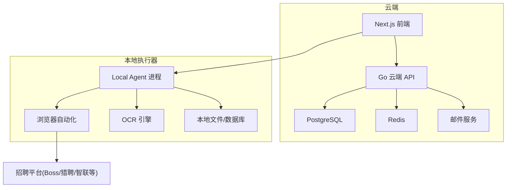
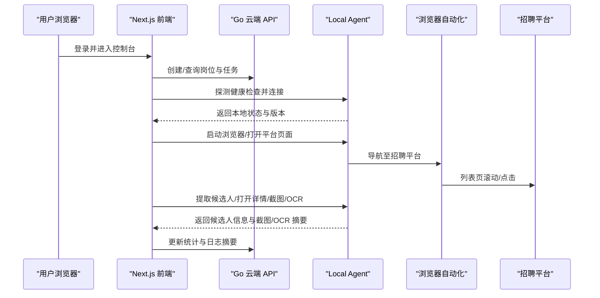
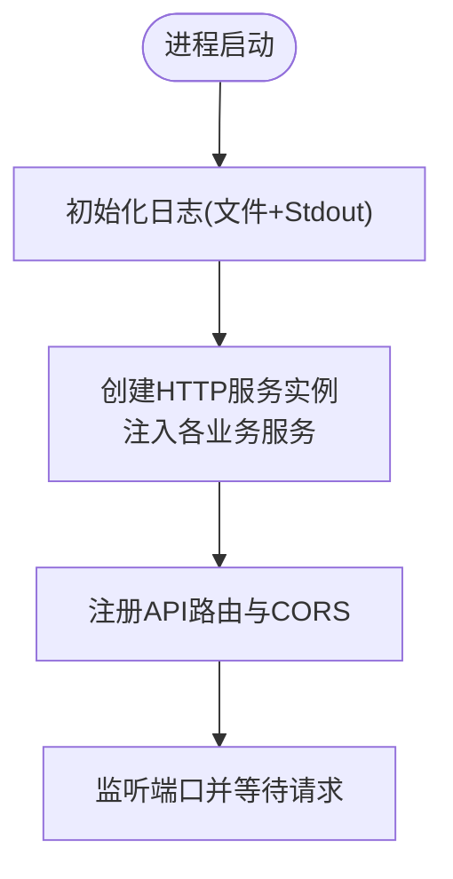
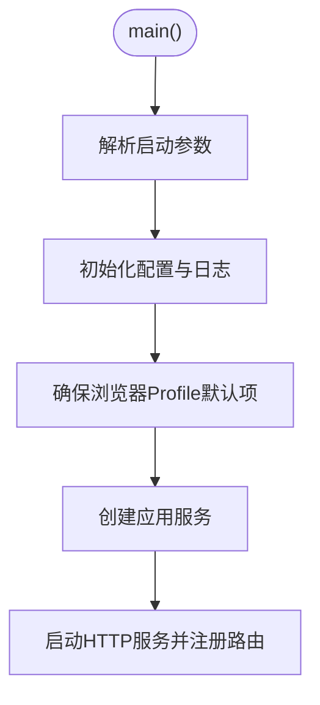
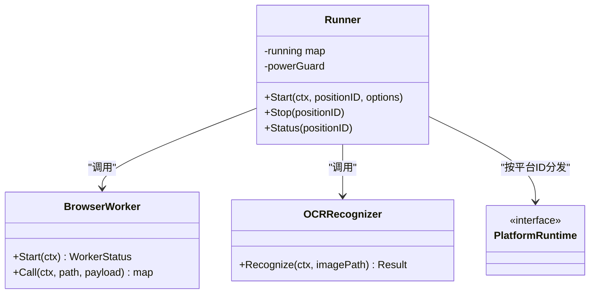
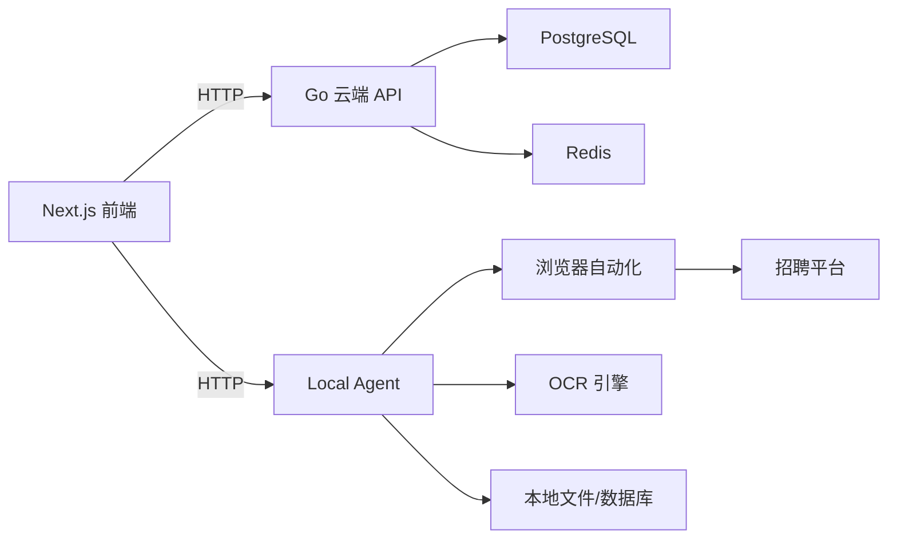

# 项目概述

<cite>
**本文引用的文件**
- [goodhr5/README.md](file://goodhr5/README.md)
- [docs/cloud-control-local-agent-architecture.md](file://docs/cloud-control-local-agent-architecture.md)
- [goodhr5/docs/architecture.md](file://goodhr5/docs/architecture.md)
- [goodhr5/cloud/backend/cmd/server/main.go](file://goodhr5/cloud/backend/cmd/server/main.go)
- [goodhr5/cloud/backend/internal/httpapi/server.go](file://goodhr5/cloud/backend/internal/httpapi/server.go)
- [goodhr5/local-agent-go/cmd/goodhr-local-agent/main.go](file://goodhr5/local-agent-go/cmd/goodhr-local-agent/main.go)
- [goodhr5/local-agent-go/internal/app/server.go](file://goodhr5/local-agent-go/internal/app/server.go)
- [goodhr5/local-agent-go/internal/platforms/registry.go](file://goodhr5/local-agent-go/internal/platforms/registry.go)
- [goodhr5/local-agent-go/internal/positionrunner/runner.go](file://goodhr5/local-agent-go/internal/positionrunner/runner.go)
- [goodhr5/cloud/frontend-next/package.json](file://goodhr5/cloud/frontend-next/package.json)
- [goodhr5/cloud/frontend-next/components/BrandMark.tsx](file://goodhr5/cloud/frontend-next/components/BrandMark.tsx)
- [goodhr5/cloud/backend/db/migrations/0021_system_app_config.sql](file://goodhr5/cloud/backend/db/migrations/0021_system_app_config.sql)
- [goodhr5/local-agent-go/internal/version/version.go](file://goodhr5/local-agent-go/internal/version/version.go)
- [goodhr5/local-agent-go/packaging/environments/prod.json](file://goodhr5/local-agent-go/packaging/environments/prod.json)
</cite>

## 更新摘要
**变更内容**
- 将品牌名称从 GoodHR 全面更新为 HRPlus，包括用户界面、文档、配置和构建脚本
- 更新前端品牌标识组件，显示 "HR Plus" 品牌名称
- 更新系统配置中的版本信息和公告内容
- 保持内部基础设施标识符不变（如 goodhr5 目录结构、数据库表名等）

## 目录
1. [简介](#简介)
2. [项目结构](#项目结构)
3. [核心组件](#核心组件)
4. [架构总览](#架构总览)
5. [详细组件分析](#详细组件分析)
6. [依赖关系分析](#依赖关系分析)
7. [性能与可扩展性](#性能与可扩展性)
8. [故障排查指南](#故障排查指南)
9. [结论](#结论)
10. [附录：使用场景示例](#附录使用场景示例)

## 简介
HRPlus 是招聘自动化平台，采用"云端控制台 + 本地执行器"的混合架构。云端负责用户登录、任务编排、配置管理、版本管理与统计摘要；本地执行器运行在用户电脑上，负责浏览器自动化、候选人详情截图与 OCR、岗位运行数据与日志的本地持久化。其核心目标是让招聘团队通过云端控制台轻松编排并驱动本地执行器，实现对多个招聘平台的智能简历筛选、自动打招呼、候选人信息提取与结果汇总，同时保证敏感数据（如简历原文、截图、OCR 文本、平台 Cookie）仅保存在本地，降低隐私与合规风险。

**更新** 品牌已从 GoodHR 重命名为 HRPlus，所有用户可见内容已更新为新品牌标识。

## 项目结构
仓库采用多模块组织：
- 云端后端：Go 实现的 HTTP API，提供认证、Agent 绑定、岗位与候选人管理、支付与订阅、系统配置等能力。
- 云端前端：Next.js 构建的管理控制台与营销页面，用于用户操作与可视化展示。
- 本地执行器：Go 程序监听本机端口，封装浏览器自动化、OCR、岗位运行器与本地存储，并通过 HTTP API 暴露给云端前端直连调用。
- 文档与部署：包含架构说明、迁移计划、Docker Compose 与 Nginx 示例配置。

图表来源
- [goodhr5/docs/architecture.md:1-50](file://goodhr5/docs/architecture.md#L1-L50)
- [docs/cloud-control-local-agent-architecture.md:30-52](file://docs/cloud-control-local-agent-architecture.md#L30-L52)

章节来源
- [goodhr5/README.md:1-56](file://goodhr5/README.md#L1-L56)
- [goodhr5/docs/architecture.md:1-50](file://goodhr5/docs/architecture.md#L1-L50)

## 核心组件
- 云端后端服务：启动 HTTP 服务、注册路由、注入业务服务（认证、岗位、候选人、支付、订阅、租户、Cookie、AI 钱包等），并提供健康检查与公共配置接口。
- 本地执行器服务：解析启动参数、初始化配置与日志、确保浏览器 Profile 默认项、启动 HTTP 服务并注册大量浏览器与岗位运行相关接口。
- 岗位运行器：协调浏览器 Worker、OCR、平台运行时、本地数据库与云端同步，实现扫描、打开详情、截图、OCR、AI 评分、打招呼、统计上报等流程。
- 平台运行时注册表：按平台 ID 分发到具体平台实现（Boss、猎聘、智联等）。
- 前端控制台：基于 Next.js，提供登录、任务编排、本地 Agent 连接、候选人查看与管理界面。

**更新** 前端品牌标识已更新为 "HR Plus"，显示新的品牌视觉形象。

章节来源
- [goodhr5/cloud/backend/cmd/server/main.go:14-30](file://goodhr5/cloud/backend/cmd/server/main.go#L14-L30)
- [goodhr5/cloud/backend/internal/httpapi/server.go:46-121](file://goodhr5/cloud/backend/internal/httpapi/server.go#L46-L121)
- [goodhr5/local-agent-go/cmd/goodhr-local-agent/main.go:18-62](file://goodhr5/local-agent-go/cmd/goodhr-local-agent/main.go#L18-L62)
- [goodhr5/local-agent-go/internal/app/server.go:45-115](file://goodhr5/local-agent-go/internal/app/server.go#L45-L115)
- [goodhr5/local-agent-go/internal/platforms/registry.go:15-34](file://goodhr5/local-agent-go/internal/platforms/registry.go#L15-L34)
- [goodhr5/cloud/frontend-next/package.json:1-33](file://goodhr5/cloud/frontend-next/package.json#L1-L33)
- [goodhr5/cloud/frontend-next/components/BrandMark.tsx:1-24](file://goodhr5/cloud/frontend-next/components/BrandMark.tsx#L1-L24)

## 架构总览
HRPlus 采用"云端控制、本地执行"的混合架构：
- 云端只保存用户、配置、岗位元信息、统计摘要与机器绑定信息；不保存候选人详情、截图与 OCR 原文。
- 本地执行器负责浏览器自动化、平台交互、截图与 OCR、候选人数据与日志的本地持久化。
- 前端通过直连本地 Agent 的方式获取实时状态与数据，避免跨域与隐私问题。

图表来源
- [docs/cloud-control-local-agent-architecture.md:595-618](file://docs/cloud-control-local-agent-architecture.md#L595-L618)
- [goodhr5/local-agent-go/internal/app/server.go:117-168](file://goodhr5/local-agent-go/internal/app/server.go#L117-L168)
- [goodhr5/cloud/backend/internal/httpapi/server.go:123-212](file://goodhr5/cloud/backend/internal/httpapi/server.go#L123-L212)

## 详细组件分析

### 云端后端服务
- 启动入口：读取环境变量设置监听地址，初始化日志输出到文件与标准输出，创建 HTTP 服务器并注册路由。
- 路由与服务装配：集中注册认证、Agent 绑定、AI 配置、岗位、候选人、支付、订阅、租户、Cookie、系统配置等接口，统一 CORS 中间件处理。
- 健康检查：对外暴露 /health，便于部署与健康探针检测。

图表来源
- [goodhr5/cloud/backend/cmd/server/main.go:14-30](file://goodhr5/cloud/backend/cmd/server/main.go#L14-L30)
- [goodhr5/cloud/backend/internal/httpapi/server.go:123-212](file://goodhr5/cloud/backend/internal/httpapi/server.go#L123-L212)

章节来源
- [goodhr5/cloud/backend/cmd/server/main.go:14-53](file://goodhr5/cloud/backend/cmd/server/main.go#L14-L53)
- [goodhr5/cloud/backend/internal/httpapi/server.go:46-212](file://goodhr5/cloud/backend/internal/httpapi/server.go#L46-L212)

### 本地执行器服务
- 启动流程：解析 host/port/data-dir/open-console/restart 等参数，清理旧实例与端口占用，初始化配置与文件日志，确保浏览器 Profile 默认项，创建应用服务并启动 HTTP 监听。
- 路由覆盖：健康检查、运行组件安装与状态、Worker 管理、岗位运行、OCR、下载记录、截图、页面操作、平台特定能力（如猎聘稳定点击）、控制台代理等。
- 安全边界：仅监听本机地址，限制图片路径访问范围，避免任意文件读写。

图表来源
- [goodhr5/local-agent-go/cmd/goodhr-local-agent/main.go:18-62](file://goodhr5/local-agent-go/cmd/goodhr-local-agent/main.go#L18-L62)
- [goodhr5/local-agent-go/internal/app/server.go:87-115](file://goodhr5/local-agent-go/internal/app/server.go#L87-L115)

章节来源
- [goodhr5/local-agent-go/cmd/goodhr-local-agent/main.go:18-87](file://goodhr5/local-agent-go/cmd/goodhr-local-agent/main.go#L18-L87)
- [goodhr5/local-agent-go/internal/app/server.go:117-168](file://goodhr5/local-agent-go/internal/app/server.go#L117-L168)

### 岗位运行器与平台运行时
- 运行器职责：维护运行中的岗位上下文、并发度、延时策略、错误恢复、通知、统计上报与云端同步；协调浏览器 Worker、OCR、平台运行时与本地数据库。
- 平台运行时：通过注册表按平台 ID 分发到 Boss、猎聘、智联等平台的具体实现，屏蔽平台差异，提供统一的执行接口。
- 关键流程：扫描列表、打开详情、截图与 OCR、AI 评分/决策、打招呼、保存候选人 JSON、同步统计到云端。

图表来源
- [goodhr5/local-agent-go/internal/positionrunner/runner.go:71-137](file://goodhr5/local-agent-go/internal/positionrunner/runner.go#L71-L137)
- [goodhr5/local-agent-go/internal/platforms/registry.go:15-34](file://goodhr5/local-agent-go/internal/platforms/registry.go#L15-L34)

章节来源
- [goodhr5/local-agent-go/internal/positionrunner/runner.go:71-200](file://goodhr5/local-agent-go/internal/positionrunner/runner.go#L71-L200)
- [goodhr5/local-agent-go/internal/platforms/registry.go:15-34](file://goodhr5/local-agent-go/internal/platforms/registry.go#L15-L34)

### 前端控制台
- 技术栈：Next.js + React + TypeScript，提供开发、构建与生产脚本，集成 UI 库与编辑器组件。
- 功能定位：用户登录、岗位与任务编排、本地 Agent 连接与状态展示、候选人查看与管理、支付与订阅、系统配置等。
- 品牌标识：显示 "HR Plus" 品牌名称和 Logo，提供可点击的品牌链接。

**更新** 品牌标识组件已更新，现在显示 "HR Plus" 品牌名称和相关视觉元素。

章节来源
- [goodhr5/cloud/frontend-next/package.json:1-33](file://goodhr5/cloud/frontend-next/package.json#L1-L33)
- [goodhr5/cloud/frontend-next/components/BrandMark.tsx:1-24](file://goodhr5/cloud/frontend-next/components/BrandMark.tsx#L1-L24)

## 依赖关系分析
- 云端后端依赖 PostgreSQL 与 Redis，提供认证、会话、验证码、订阅与统计等能力；通过邮件服务发送验证码与通知。
- 本地执行器依赖浏览器自动化与 OCR 引擎，以及本地文件系统与数据库，负责真实执行与数据持久化。
- 前端通过 HTTP 直连本地执行器，读取实时状态与数据，减少跨域与隐私风险。
- 平台运行时通过注册表解耦不同招聘平台实现，便于扩展与维护。

图表来源
- [goodhr5/docs/architecture.md:1-50](file://goodhr5/docs/architecture.md#L1-L50)
- [docs/cloud-control-local-agent-architecture.md:30-52](file://docs/cloud-control-local-agent-architecture.md#L30-L52)

章节来源
- [goodhr5/docs/architecture.md:1-50](file://goodhr5/docs/architecture.md#L1-L50)
- [docs/cloud-control-local-agent-architecture.md:30-52](file://docs/cloud-control-local-agent-architecture.md#L30-L52)

## 性能与可扩展性
- 并发与超时：岗位运行器定义多项超时与并发参数（如候选处理并发、AI 请求超时、详情页关闭超时等），可依据实际平台响应与网络状况调优。
- 资源隔离：本地执行器将浏览器、OCR、岗位运行与本地存储隔离，避免相互干扰；支持运行组件的安装与状态管理。
- 可扩展性：平台运行时通过注册表扩展新平台；云端 API 模块化装配，新增业务可通过注入服务扩展。
- 缓存与存储：云端使用 Redis 做验证码与会话缓存；本地持久化候选人数据与日志，减轻云端压力。

[本节为通用指导，不直接分析具体文件]

## 故障排查指南
- 本地执行器未检测到：前端会依次探测本机端口，若全部失败则提示下载与启动步骤；确认本地程序已启动且监听本机地址。
- 健康检查失败：检查本地执行器 /health 与云端 /health，确认端口与 CORS 配置正确。
- 岗位运行异常：查看本地岗位运行日志与状态接口，核对浏览器 Worker 状态、OCR 状态与平台配置；必要时重启 Worker 或重新安装运行组件。
- 权限与路径限制：OCR 与截图接口限制只能访问 GoodHR 数据目录内的文件，确保传入绝对路径且在允许范围内。
- 品牌相关问题：确认前端显示的是 "HR Plus" 品牌标识，检查品牌资源文件是否正确加载。

**更新** 新增了品牌相关问题的故障排查指导。

章节来源
- [docs/cloud-control-local-agent-architecture.md:547-577](file://docs/cloud-control-local-agent-architecture.md#L547-L577)
- [goodhr5/local-agent-go/internal/app/server.go:484-535](file://goodhr5/local-agent-go/internal/app/server.go#L484-L535)

## 结论
HRPlus 通过"云端控制台 + 本地执行器"的混合架构，实现了招聘自动化的高效编排与安全执行。云端聚焦于用户、配置、任务与统计管理；本地专注浏览器自动化、OCR 与数据持久化。该设计既满足多平台支持与 AI 驱动的智能化筛选，又保障了敏感数据的本地化存储与隐私合规。随着平台运行时的扩展与云端服务的模块化演进，系统具备良好的可维护性与可扩展性。

**更新** 品牌已从 GoodHR 成功重命名为 HRPlus，所有用户可见内容已更新为新品牌标识，同时保持了内部基础设施的稳定性和向后兼容性。

[本节为总结性内容，不直接分析具体文件]

## 附录：使用场景示例
- 智能简历筛选：用户在云端创建岗位并配置关键词与排除词，本地执行器扫描候选人列表，打开详情进行截图与 OCR，结合 AI 评分与规则进行匹配判断，最终输出候选人清单与理由。
- 多平台支持：通过平台运行时注册表，同一套流程可适配 Boss、猎聘、智联等不同平台，屏蔽平台差异，提升复用性。
- 云端与本地协作：前端登录后直连本地执行器，实时获取岗位运行状态、候选人数据与截图预览；云端仅保存统计摘要与配置，降低数据泄露风险。
- 品牌体验：用户使用 HRPlus 品牌界面，享受全新的视觉体验和品牌识别。

**更新** 新增了品牌体验相关的场景示例。

[本节为概念性说明，不直接分析具体文件]